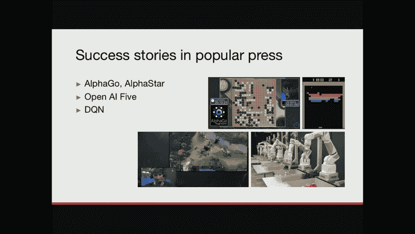
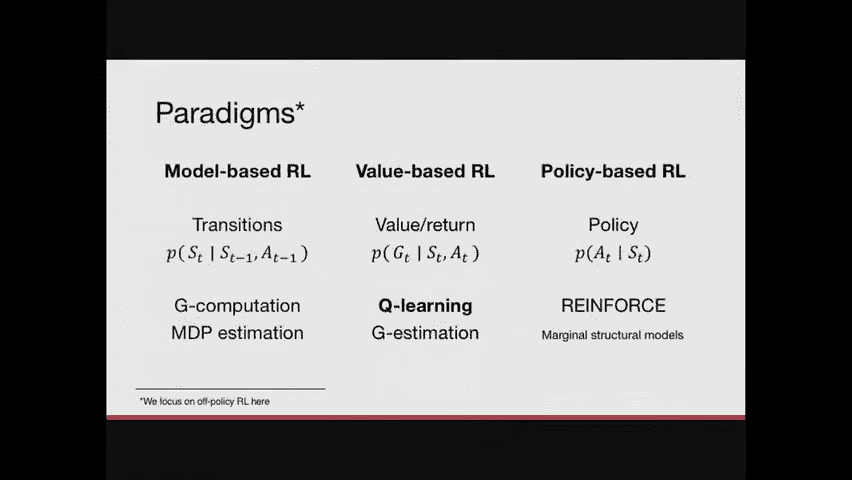
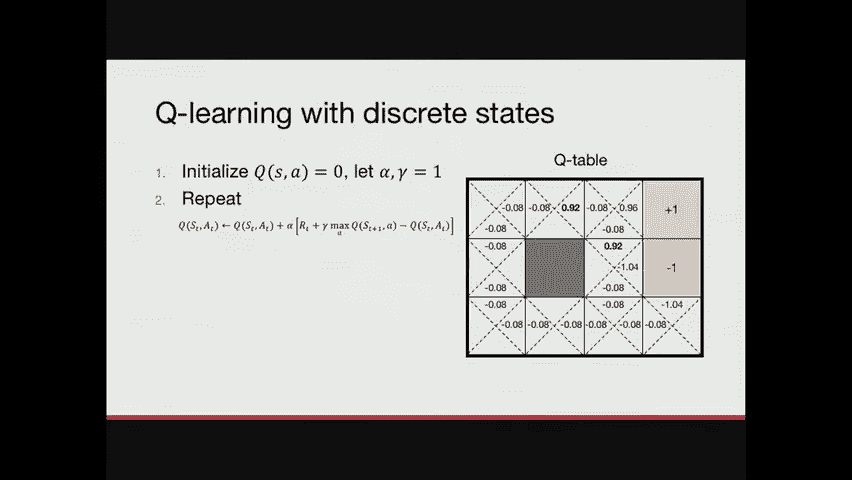

# P16：16.Reinforcement Learning, Part 1 - 大佬的迷弟的粉丝 - BV1oa411c7eD

大家好，我们现在开始，所以这周的课真的很有收获，上周停止的地方，你还记得我们上周讨论了推理，上周我告诉过你，我们只是要专注于一次步骤设置，正如我们所知，许多医学都与跨时间的多个顺序决定有关。

这将是整个星期讨论的焦点，当我真的在想，在这次讲座中我应该教什么，我意识到最了解这个话题的人是，事实上，我实验室的一名博士后研究员，嗯，关于这个话题的最多，你知道将军，我会接受的，我要那个，我要那个。

这很公平，这很公平，所以我邀请他切，今天来到我们这里，作为一个受邀的讲座，这是弗雷德里克·约翰逊，从九月份开始，他将在瑞典的查尔莫斯担任教授，非常感谢，戴维，那真是太慷慨了，嗯是的，正如大卫上次提到的。

我们研究了很多因果效应，这也是我们将开始讨论的地方，所以我就从这个提醒开始，在这里我们基本上介绍了四个量，上节课或者前两节课，据我所知，我们有两个潜在的结果。

它代表了我们在各种选择下看到的一些治疗选择的结果，所以两种不同的选择，1和0，我们有两个协变量或者对不起，我们有一个协变量，一组协变量x和一个治疗t，我们感兴趣的是这种治疗对结果的影响，给定协变量x。

我们当时关注的效果是条件平均治疗效果，这正是这些潜在结果之间的区别，基于特征的条件，所以整个上周都在试图用各种方法来识别这个数量，这个问题并没有出现太多，或者有一个问题没有出现那么多。

那就是我们如何使用这个数量，我们可能会对它感兴趣，只是就它的绝对规模而言，效果有多大，但我们也可能有兴趣设计一个政策来治疗我们的病人，根据这个数量，所以今天我们将重点讨论政策，我的意思是。

特别是考虑到我们对病人的了解，并将选择或操作作为输出，通常我们会认为政策取决于病史，也许他们以前接受过哪些治疗，病人目前处于什么状态，但我们也可以纯粹基于我们上次产生的这个数字，条件平均处理效果。

一个很自然的政策是说，x的pi等于表示，如果这个食物是阳性的，所以如果效果是积极的，我们治疗病人，如果效果是负面的，我们不，当然，积极的一面是相对于结果的有用性高，但是，嗯是的。

这是一个很自然的政策来考虑，然而，嗯，我们也可以考虑更复杂的政策，不仅仅是基于这个，这个数字，结果的质量，我们可以考虑考虑立法、药物成本或副作用的政策，我们今天不打算这么做，但当我们讨论这些事情时。

你可以记住这一点，大卫提到，我们现在应该从单一治疗的一步设置，一次行动，我们只需要考虑病人的状态一次，我们将从那里转移到顺序设置，我的第一个例子是败血症管理，所以败血症是感染的并发症，嗯。

这可能会产生非常灾难性的后果，它会导致器官衰竭并最终死亡，它实际上是重症监护室死亡的主要原因之一，因此，我们能够管理和治疗这种情况当然很重要，嗯，当你开始治疗败血症时，主要目标。

你首先应该考虑修复的是感染本身，如果我们不治疗感染，事情会继续糟糕，但即使你找到了治疗感染的正确抗生素，这是感染性休克或感染性炎症的来源，嗯，我们需要管理很多不同的情况，因为感染本身会导致发烧。

呼吸困难，低心脏或低血压，高心率，所有这些都是症状，但不是事业本身，但我们还是要设法管理他们，这样病人就活下来了，舒服了，所以当我说败血症管理，我说的是随着时间的推移管理这样的数量，病人在，在医院里。

上次又来了，只是为了真正把这个钉进去，我们讨论了潜在的结果和单一治疗方法的选择，所以我们可以在化粪池的环境中考虑这个，作为一个病人进来，或者已经在医院的病人，可能会出现繁殖困难。

这意味着它们的血氧会很低，因为它们不能自己繁殖，我们可能想让他们接受机械通气，这样我们就可以确保它们获得足够的氧气，我们可以把这看作是一个单一的选择，我们要不要给病人用机械通气。

但我们需要考虑的是在我们做出选择后会发生什么，什么会，这个选择更进一步会有什么副作用，因为我们想确保病人舒适健康，在他们逗留期间，所以今天我们将转向顺序决策，特别是我刚才提到的是按顺序做出的决定。

可能有早期选择的性质，排除以后的某些选择，我们将看到一个例子，很快，特别是我们会有兴趣提出一个反复做决定的政策，嗯，优化给定结果的，我们关心的事情可以优化，或减少，将死亡风险降至最低，这可能是一个奖励。

说，病人的生命体征在正确的范围内，您可能需要优化它，但本质上现在想想，就像拥有这个，在任何时候给予药物或干预的选择，并有这样做的最佳政策，好的，我就跳过那个，好的，所以我已经提到过了。

在脓毒症患者的管理中，我们可能需要做出的一个潜在选择，就是把它们放在机械通气上，因为他们不能自己呼吸，这样做的副作用是他们可能，可能会因为插管而感到不适，这个过程并不是无痛的，不是没有不舒服。

所以你可能要做的事情，给他们机械通气是为了给病人镇静，嗯，所以这是一种由前一个动作通知的动作，因为如果我们不给病人进行机械通气，也许我们不会考虑用它们来镇静，当我们给病人打镇静剂时。

我们冒着降低他们血压的风险，所以我们可能也需要管理，嗯，所以如果他们的血压太低，也许我们需要给血管升压剂，人为地提高血压或液体，或者其他任何处理这个问题的东西，嗯，所以说，把这看作是一个选择的例子。

它们的后果是级联的，当我们在时间里向前滚动，我们将面临病人住院期的结束，希望我们成功地管理了病人，所以他们是他们的反应，或者他们的结果是好的，我在这里说明的是什么。

对于我们医院或医疗保健系统中的任何一个病人，我们将通过这些选项只观察一个轨迹，所以我会多次展示这种类型的插图，但我希望你能，你可以意识到，这里的决策空间的范围，本质上，在任何时候。

我们都可以选择不同的动作，通常我们在重症监护室做出的决定的数量，例如，比我们在随机试验中测试的要大得多，把所有这些不同的轨迹想象成不同的手臂，在随机对照试验中，你想比较，进行这样的试验是不可行的。

所以我们谈论强化的一个重要原因，今天学习，谈论学习政策，而不是因果影响，在设置中，我们上周所做的是因为可能的行动轨迹空间太大了，话虽如此，我们现在试图找到本质上，在这里选择橙色路径的策略。

这导致了一个好的结果，为这样的事讲道理，我们还需要推理什么是好的结果，对我们代理的好奖励是什么，当它穿越时间并做出选择时，我们的一些政策，嗯，我们作为机器学习者生产的，可能不适合医疗保健环境。

就像我们必须。

以某种方式把自己限制在现实的事情上，我今天不会太关注这个，这个问题将在明天的讨论中提出来，希望，以及评估用于医疗保健系统的东西的概念，明天也会讨论，嗯，因此，我将首先简短地提及一些成功的故事。

这些不是来自医疗保健环境，大家可以猜到，从图片中，有多少人看过这些照片，好的，伟大，伟大，几乎每个人，是啊，是啊，所以这些来自各种电子游戏，几乎都是，好好小游戏，不管怎么说，这些都是很好的例子。

当强化学习起作用时，基本上，这就是为什么我在这张幻灯片中使用这个，因为从本质上讲，很难说计算机或程序最终，嗯打败丽莎娃娃，我想就在这张照片里，也是后来的围棋冠军，基本上在左上角的Alphago图片中。

很难说他们做得不好。

因为他们显然在这里打败了人类，嗯，但有一件事我想让你记住，在整个演讲中，这些场景的不同之处在于，我们稍后再讨论这个问题，和医疗保健环境有什么不同，本质上，所以我只是在这里添加了另一个例子。

这就是为什么我认识到，所以最近有一个更接近我的心，也就是阿尔法星，玩星际争霸，我喜欢星际争霸，所以你知道我无论如何都应该在滑梯上。

让我们继续前进，从广义上讲，这些可以概括在下面的图片中，这些系统发生了什么，当涉及到围棋这样的事情时，有更多的细微差别，但为了本课的目的，我们将用幻灯片总结它们，所以本质上。

强化学习的三个重要量之一是环境的状态，游戏的状态，病人的状态，我们想要优化的东西的状态，在这种情况下基本上是这样，我选择了井字游戏，这里我们有一个状态，它表示圆和十字的当前位置，游戏的那种状态。

作为一名球员，我的工作是选择一个可能的或，或者是的，可能采取的行动，一个自由的方块把我的十字架放进去，所以我是这里的蓝色球员，我可以考虑这五个选择来把我的下一个十字架放在哪里。

每一个都将带领我进入游戏的新状态，如果我把我的十字架放在这里，这意味着我的意思是现在在这个盒子里，下一轮我有一套新的动作，取决于红色玩家做什么，所以我们有这个州，我们有行动，我们有下一个州，本质上。

我们有一个轨迹或状态的转变，我们需要的最后一个数量是奖励的概念，这对强化学习非常重要，因为这就是推动学习本身的原因，我们努力优化某件事的回报或结果，所以如果我们把动作看得最远，就在这里，基本上。

我让自己在这里受到红色球员的攻击，因为我没有把十字架放在那里，这意味着如果红色球员是体面的，他会把他的圆圈放在这里，我将遭受损失，基本上，所以我的奖励是负的，如果我们把积极当成好。

这是我可以从未来中学到的东西，本质上，我想避免的是以这种状态结束，它显示在这里的底部，这是，的，的，加固的基本思路，学习电子游戏和其他任何东西，所以如果我们拿着这块板，类比或这个例子。

并转移到医疗保健环境，我们可以把病人的状态想象成游戏板，或者游戏的状态，在这次谈话中，我们将永远称之为ST，我们开出的治疗处方或干预措施将是一个，这些就像游戏中的动作，很明显，病人的结果可能是。

死亡率可以控制，会询问生命体征，就像游戏中输了或赢了的奖励，然后我把它放在这里，可能会出什么问题，嗯，就像我之前提到的，医疗保健不是游戏，就像电子游戏是游戏一样，但它们有很多共同的数学结构。

所以这就是为什么我在这里做类比，这些量在这里s a和r um会形成一个叫做决策过程的东西，这就是我们接下来要讨论的，这是今天和星期四的大纲。我今天不谈这个，但这些是我们正在考虑的话题。

所以决策过程本质上是描述我们访问的数据的世界，还是我们曾经的世界啊，管理我们的代理，而且经常是，如果你见过强化学习教，你以某种形式见过这张照片，通常是一些东西，有一只老鼠和一些奶酪，还有其他事情在发生。

但你知道我在说什么，但有相同的基本成分，所以有一个代理人的概念，让我们先想想医生，随着时间的推移反复采取行动，所以这里的T表示时间的索引，当我们绕着这个轮子旋转时，我们看到它基本上在增加，这里。

我们在时间上前进，所以一个特工采取了行动，并在任何时候获得该行动的奖励，那就是RT，就像我之前说的，环境是提供奖励的原因，例如，如果我是医生，我是经纪人，我对我的病人采取行动或干预，病人将是环境。

基本上，回应并不回应我的干预，这里的状态是病人的状态，正如我之前提到的，比如说，但它也可能是一种比病人更广泛的状态，就像，的，它们所连接的机器的设置，或者医院里某些药物的可用性，或者类似的东西。

所以我们可以比病人更广泛地思考，我也是，我说在这里部分观察到了，我可能并不真正了解与我相关的病人的一切，我们稍后会回到这个问题，所以有两种不同的形式化，它们非常接近，也就是当你知道S的一切。

当你在谈话的大部分时间里都不舒服的时候，专注于我知道的与环境无关的一切，好吧，让这一切变得更具体一点，3。我会回到我给你看的那幅画，但现在把它放在你读对的论文的上下文中，是强制性的吗，机械通风，好的。

伟大，所以在这种情况下，他们有一个有趣的奖励结构，本质上他们试图优化的东西，是与病人生命体征有关的奖励，还有他们是否保持机械通气，这篇论文的想法是，你不想让病人不必要地接受机械通气。

因为它有我们之前说过的副作用，所以在任何时间点，基本上我们可以考虑给病人开开关关，也处理给他们开的镇静剂，所以在这个例子中，他们在这份申请中考虑的州包括病人的人口统计信息，这并不会随着时间的推移而改变。

他们的生理测量，通风机设置，意识水平，他们使用的镇静剂的剂量，这可能是一个动作，我想，和其他一些事情，这些是我们必须跟踪的价值观，以与时俱进，具体包括的行动，是给病人插管还是拔管，以及给药和给药。

镇静剂，所以这又是一个所谓的决策过程的例子，本质上，嗯那个，这个过程是这些量的分布，我一直在谈论随着时间的推移，所以我们有各州，他们所经历的行动和回报，或者它们都随着时间的推移而进化。

我之前提到的决策过程是如何发生的，我们今天将讨论政策，通常在所谓的行为策略和目标策略之间是有区别的，或者有不同的词，本质上，我们观察到的东西通常被称为行为策略，我是说，如果我们去医院看看现在发生了什么。

这将是行为策略，我将表示mu，所以这就是我们要学习的，基本上，所以到目前为止，决策过程非常普遍，我没有说过这种分配是什么样的，但当人们研究系统过程时，他们所做的绝对主导的限制。

就是看一个马尔可夫决策过程，它们有一个特定的条件独立结构，我将在下一张幻灯片中演示，但我会用数学来定义它，在这里，它本质上说，我们关心的所有量的状态，我想应该是国家奖励，操作仅取决于操作中的最新状态。

所以如果我们想，或者如果我们观察到医院里医生的一个动作，比如说，做一个马尔可夫假设，会说这位医生没有看到任何早期发生的事情，或任何其他信息，而不是状态中的信息。

我们当时观察到的变量，这是我们所做的假设，是的，这像是一种假设吗，你可以做一个医疗保健，因为你没有衡量，你不能进入房地产，但只是关于健康状况的衡量，这是个很好的问题，所以从推断因果量的角度来看。

好的事情是，我们只需要最初用来做决定的东西，所以医生也只能根据这些信息采取行动，除非我们不把医生知道的一切都记录下来，也是如此，所以这是我们肯定要担心的事情，另一个，丢失信息的另一种方式，正如我提到的。

与此相关的是，如果我们希望，呃，调音，时光倒流到纽约的对立面是什么，所以我们不看病人的整个病史，当我在这里说圣。

不一定是，瞬间，就像病人的快照，我们也可以在那里和再次包括历史，我们稍后再讨论这个问题，是呀，嗯好吧，所以马尔可夫假设本质上是这样的，嗯，或者这就是我将如何说明，无论如何。

我们这里有一系列随时间演变的状态，我允许自己在这里画一些点，因为我不想永远画画，但本质上你可以想到这种模式，重复上一个状态进入下一个状态的位置，动作进入下一个阶段，动作和状态进入奖励。

这就是我们在这次演讲中将要生活的世界，在马尔可夫假设下不允许的东西是这样的边缘，它说早期的一个动作会影响后来的一个动作，具体地说，如果不通过一个状态铸造，它就不能这样做，比如说。

它很可能会对这个轨迹产生影响，但不是直接。

在这种情况下，这是更多的假设，嗯，所以你可以看到有，如果我把所有不同的测量都画出来，我们看到的，在逗留期间，基本上我在这张照片中可能会有很多错误，我没有，所以马尔可夫假设似乎是一个非常，非常强壮的。

但是确保马尔可夫假设更有可能，就是在你的状态中包含更多的东西，包括历史摘要，等等，我之前提到过，对决策过程的更强限制，就是假设随着时间的推移，状态本身，独立的，嗯，这个有不同的名字。

有时以上下文强盗的名义，但土匪本身在这里就不那么相关了，所以我们不要过多地谈论这个名字，但本质上我们能说的是在这里，然后在以后的时间点的状态，不受上一个时间点状态的直接影响，也不是上一个时间点的动作。

所以如果你有，呃，如果你还记得你上周做了什么，这看起来基本上是我们有的非常简单的图表的重复，尽可能多的潜在结果，如果我们假设这在数学上是等价的，这里代表病人的状态。

所有的病人本质上都是从某个过程中提取的，所以零一，等从上到st都是相同分布的iID图，那么我们就有了一个针对不同病人的模型，没有一个时间步骤或一个动作，而不是以某种方式依赖，所以我们可以看到。

通过倒着看我的幻灯片，这基本上是我们上周的内容，我们只需要添加更多的箭头来获得本周的内容，这表明上周是一个特例就像大卫之前说的，它还暗示了强化学习问题比潜在结果问题更复杂，我们稍后会看到更多的例子。

就像我们上周做的因果效应估计，我们对几个变量的影响感兴趣，所以上次我们研究了单一治疗选择的效果，在这种情况下，我们将研究我们在前进的道路上采取的这些不同行动的影响，那将是目标。

它可以通过对即时奖励的即时影响，也可以是通过一个动作对状态轨迹本身的影响，所以好吧，我告诉过你我们现在生活的世界，我们有这些S和NAS和我们的，我还没有告诉你这么多，关于我们试图解决的目标。

或者我们试图解决的问题，大多数RL或强化学习的目标是，保单或找到有良好回报的保单，一大笔奖励，这个有很多名字，但本质上是一项效果良好的政策，我们将在这节课中使用的井的概念，返回，所以一次返回。

遵循策略的步骤t，我以前的圆周率，是我们看到的未来回报的总和，如果我们按照那个政策行事，所以基本上我现在停下来，我问，好的，如果我继续做我一生所做的事情，会怎么样，也许这是一个好政策，我不知道。

一直走到时间的尽头，我会做得多好，我得到的那些奖励的总数是多少，基本上，那是回报，价值是对这类事情的期望，所以如果我不是唯一一个，但我们所有人，对人口的期望是政策的价值。

所以如果我们把病人作为一个比我的生活更好的类比，也许对病人的期望是什么，如果我们以同样的方式对待我们人口中的每个病人，根据同一政策，那就是，这些病人的预期回报是多少，所以作为一个例子，我又画了几条轨迹。

因为我喜欢画画，我们可以想到三个不同的病人他们从不同的状态开始，结果它们会有不同的动作轨迹，所以我们用同样的政策对待他们，就叫它圆周率吧，而是因为他们在不同的状态，他们会在不同的时间有不同的动作。

所以这里我们采取零动作，我们从这里下去，我们采取零行动，我们下去，这就是这里的意思，这件事的细节并不那么重要，但我想让你注意的是，在每一个动作之后，我们得到了奖励，最后我们可以总结一下，那是我们的回报。

所以每个病人对自己的轨迹都有一组一个值，保单的价值就是这些轨迹的平均值。

这就是我们试图优化的，我们现在有了善的概念，我们想找到一个圆周率，使v pi向上，有好的，这就是目标，所有的权利，所以我想是时候，这里有一个例子，嗯，我想让你配合一下，你要，你要解决这个问题，这并不难。

所以我想你能应付，我想我想你会没事的，但这是另一个世界的例子，这是房间里的机器人，我从大卫那里偷了这张幻灯片，谁从彼得·博迪奇那里偷的，是啊是啊，所以无论如何都归功于他，这个世界的规则是这样说的。

如果你告诉机器人谁在穿过这组瓷砖，如果你告诉机器人上去，有机会，他不上去，但去别的地方，所以我们有随机跃迁，基本上，如果我说向上，他以八分之一的概率上升，以均匀的概率上升到其他地方，这么说向上八点。

然后第二点是唯一可能的方向，如果你从这里开始，这样点二，有机会，你走错了方向，这就是我想说明的，他们不可能朝相反的方向走，这么说，如果我在这里说，它不能走那条路，嗯，这个游戏的奖励是。

加一个在上面的绿色盒子里，减一个在这里的盒子里，这些也是终态，所以我还没告诉你那是什么，但它本质上是游戏结束的一种状态，所以一旦你到了，加一或减一，游戏结束了，机器人每走一步就会得到一个点，四负奖励。

也就是说如果你坚持很长时间，你的回报会很糟糕，您的保单价值将是坏的，所以你想提高效率，所以基本上你可以，你可以想出你想去绿色的东西，那是其中的一部分，但你也想快点做。

所以我想让你现在做的是基本上找出什么是最好的政策，在这方面，这些不同的方框中的箭头应该以何种方式指向，嗯，用指向某个方向的箭头填写问号，我们知道转换是随机的，所以你可能需要考虑到这一点。

但本质上弄清楚我如何有一个政策给我最大的预期回报，几分钟后我会问你。

如果你们中的一个有足够的勇气把它放在黑板上什么的，随着时间的推移，他们开始打折，没有折扣，我们和邻居说话，是呀，这是鼓励的，所以我有个问题，动作空间是什么基本上动作空间总是向上向下向左或向右。

取决于有没有墙，嗯，所以你不能，你不能走在这里，比如说。

你不能向左走，准确地说，是啊，是啊，说得好，所以最后的每一个盒子，当你做完，应该包含指向某个方向的箭头，所有的权利，我想我们会，我们将看看是否有人解决了这个问题，现在，他们认为自己解决得很好。

你想分享你的解决方案吗，是啊，是啊，所以我觉得先上去很好，好的，往上走，坚持住，我会试着复制这个，哦，很抱歉，好的，你在这里说，是啊，是啊，好的，呃，基本的想法是，你想减少你靠近红盒子的机会，是呀。

所以尽你所能远离它，好的，是啊，是啊，所以要上去，一旦你最终到达那里，我得往右走，好的，然后，好的，那么这些呢，顺便说一句，这也是政策的一部分，关于这个，好的，那些取决于各种权利，但是这个负零点，哦。

所以这通常意味着其他的事情，我们以后再谈这个，但这是对，只是迈出任何一步，所以是的，如果你移动到一个不是终端的空间，你招致了负面的回报，所以你不停地蹦蹦跳跳很长一段时间，负数，如果我们有这个。

有一些机会，我从来没有出去过，出现这种差距的可能性很小，但这是一个非常糟糕的政策，因为你不停地来回移动，是啊，是啊，所有的权利，我们在某个地方有一只胳膊，我在这里该怎么办，嗯哼，你可以投票，好的。

谁想对了，真的，还剩谁，好的，有趣，我其实不记得了，让我们看看，所以这是好的，是啊，是啊，所以这是我们已经确定的部分，如果我们有确定性的转换，这将是伟大的，好的，因为我们不必考虑其他的。

这是彼得放在幻灯片上的，所以我不同意，实际上那里的投票。

然后它，它实际上很大程度上取决于负点，零四，嗯，所以如果你增加一点，你可能想走那条路，或者如果你减少它，我不记得了，精确减少，如果你增加它，你可能会得到别的东西，终止可能真的很好，所以这些细节有点重要。

但我想你大概知道了，尤其是我喜欢这样，你评论说你想远离红色的，因为如果你看看这些不同的路径，你上去那里，它们有相同数量的状态，但机会更少，你最终会被关进红盒子里，如果你走上层路线，伟大。

所以我们有一个政策的例子，我们有一个决策过程的例子，到目前为止，事情进展顺利，但是我们怎么做，我是说，就班级而言，这是一个黑盒实验，我不知道你是怎么知道的，所以强化学习就是这样。

强化学习就是试着想出一个政策，以一种严格的方式，希望理想情况下，嗯，所以这将是这里的下一个话题。

直到这一点，有什么问题是你一直想问的吗，但还没有，好奇，行为偏见对第一个马尔可夫假设有多大影响，比如说，如果你是一个工作了三十年的临床医生，你只是真的习惯了给某种治疗，是的，你过去给的一个动作。

这种习惯可能会影响将来的行动，是啊，如果这是一个担心，人们如何考虑解决这个问题，嗯有趣，我想这取决于它是如何表现的，如果它也影响了你以前，比如你最近的动作，也许你在某种意义上已经观察到了这一点，嗯会的。

这是一个非常广泛的问题，那会有什么影响呢，你心里有具体的东西，我想我只是在想，如果它违反了这一假设，有点像过去的一个动作，行动有趣，所以我想我的，我的回应是，以前行动并不真正取决于行动的选择。

因为政策保持不变，你可以有一个，你可能对一个动作有偏见，不依赖于你以前付出的行动，如果你明白我的意思，说，说我采取行动的概率是1，那么我过去给它也没关系，我的政策还是一样，所以不一定，可能会有其他后果。

我们，我们以后可能有理由回到那个问题上来，只是实际上我会认为医生会想要始终如一，所以你不会，比如说，想给某人上呼吸机，然后如果你把它们脱掉，然后马上又穿上，所以这将是一个例子，是啊，是啊。

过去的行动影响的地方，你完全在做什么，是啊，是啊，我认为这是一个很好的例子，你所希望的是，在这种情况下，状态变量包括一些治疗的概念，历史，这就是你，你的工作是什么，然后是的。

所以这就是为什么国家作为一个术语可能会有些误导，至少对我来说，我不知道，我不是美国人，所以说英语，但是但是但是是的，我认为这太瞬间了，所以我们现在要进入强化学习，我让你在最后一张幻灯片上做了什么。

我不知道你用什么方法。

但很可能是中间的那个，强化学习有三种非常常见的范式，他们本质上是根据他们专注于建模的内容来划分的，呃，不出所料，基于模型的RL专注于，嗯，它至少有某种模型在里面，和模型，在这种情况下。

你所说的模型是什么意思，是过渡的模型，那么在给定的动作下，我最终会处于什么状态，我现在的状态，所以基于模型的RL试图本质上为环境或环境创建一个模型，有很多，嗯，有几个基于模型的RL的例子。

其中之一是g计算，它来自统计文献，如果你喜欢MDPS本质上是，那是MDP，这是一个马尔可夫决策过程，它本质上是试图估计我们之前谈到的整个分布，嗯，这有各种各样的起起落落。

我们今天没有时间讨论所有这些范例，我们今天实际上只关注基于价值的模型，嗯，但是是的，你可以离线问我，如果您对基于模型或L感兴趣，这里最右边的是基于策略的rl，你基本上只专注于建模，被执行的政策。

或者你观察到的数据中使用的行为，你想要达成的政策，所以你在优化一个策略，你在估计一个过去使用的策略，中间的一个关注这两个都不关注，只关注估计回报，那就是G或奖励函数作为你的行为和状态的函数。

对我来说很有趣，你可以选择任何变量A、S和R并对其进行建模，你可以在强化学习中得到一些合理的东西，这个特别有趣，因为它甚至没有看，是啊，是啊，它不会试图理解你是如何到达某个，嗯。

基于国家行动的回报只是直接优化政策，它有一些明显的好不明显，但不这样做有一些缺点，所以好吧，无论如何，我们将专注于基于价值的RL，基于价值的RL的最主要的实例是Q学习，我肯定你听说过，它是画出来的。

这是我以前展示的成功故事的驱动力，球门星际争霸什么的，g估计是这方面的另一个例子，这又来自统计文献，但我们今天将重点讨论Q学习，Q学习是动态规划的一个例子，从某种意义上说，这就是通常的解释。

我只是想看看有多少人以前听过动态编程这个短语，好的，伟大的嗯，所以我想我不会在一般情况下详细讨论动态编程，但一般的想法是递归的，在这种情况下，你知道什么是好的终态，然后你想知道怎么去那里。

以及如何到达之前的州和之前的州等等，这就是我们将要讨论的递归，并以结束状态结束，那是这里最好的，很明显，这是这里的加号，也是最好的方法，或者去那里的唯一方法是先在这里停下来，因为你不能离开这里。

因为它是一个终端状态，所以你唯一的赌注就是那个，然后我们可以问什么是到达3-1的最佳方式，我们如何在最佳状态之前到达状态，嗯，我们可以说一个方法是从，从这里走，从这里走一条路。

正如我们之前从观众那里得到的，这是一个稍微糟糕的方式去那里，然后从这里开始因为这里我们有可能以-1结束，然后我们进一步递归，基本上我们得到了这样的东西，也就是说，我将在这里试图说明的是，就是绿色的盒子。

我希望你能，我很抱歉任何颜色，盲人观众，因为这是我的一个糟糕的选择，无论如何，这个底部大部分是红色的，这个大部分是绿色的，你可以按照这里的绿色，本质上是为了达到最佳的结束状态，嗯，我在这里用颜色。

这是一个知道一个状态有多好的想法，取决于那个状态之后的状态有多好，所以我知道加一是一个很好的结束状态，这导致我向后递归，所以问题是，我们怎么得到，我们怎么知道那边的那个州是好的。

当我们把它形象化在我们面前，很容易看到，这很简单，因为我们知道加一在这里是终态，就到此为止了，所以这是唯一的，在这种情况下，我们唯一需要考虑的状态，但更普遍的是，我们如何学习。

Q学习的目的是什么状态的价值，好之后，如果我们知道什么是好的状态，我们总是可以，我简单地解释了一下递归，你会发现一个有很高价值的状态，你想出怎么去那里，所以我们现在必须定义，嗯，我所说的价值是什么意思。

这个词我已经用了好几次了，嗯，我说在这里回忆，但我不知道我以前是否真的把它放在幻灯片上，所以我们只能说这是我们将使用的价值定义，所以值是，是啊，是啊，我想我在行动前把它放在幻灯片上了，这是预期的回报。

记住这个g，这是未来的奖励总和，那么这个状态的值就是对这种回报的期望，所以我之前说过，保单的价值是回报期的预期，和一个状态的值，保单是该回报的值，从某种状态开始，我们可以进一步分层。

如果我们喜欢并说一个状态动作对的值是预期的回报，从某一状态开始并采取行动，之后，遵循策略PI，这就是状态动作对的所谓Q值，It’没问题，这就是Q学习得名的地方，所以Q学习试图估计Q函数。

从状态s开始的预期返回，并从数据中采取操作a um，它这样做了，Q学习也与确定性政策有关，所以策略和Q函数以这种特定的方式结合在一起，如果我们有一个Q函数，它试图估计策略PI的值。

圆周率本身是arg max，根据那个Q，听起来有点递归，但希望一切都好，如果我们看这里可能会更明显，所以我之前说过，开始一个采取行动的价值，然后遵循策略PI，这是由决策过程本身定义的，最好的圆周率。

最好的政策是Q最高的政策，这就是我们所说的Q星，好的，这很好，这不是我们所说的Q星，让我们叫小Q E开始Q星，对此最好的估计显然是事情本身，所以如果你能找到一个好的功能，它为状态操作对赋值。

你能得到的最好的这样的函数是一个有，等于小Q星，这并不太令人困惑，我会在下一张幻灯片上显示，这可能是合理的，所以Q学习是基于动态规划的一个一般思想，也就是所谓的贝尔曼方程，好了，行李员最优性说。

这是行李员最优性的关联吗，上面说Q星，最佳状态动作值函数，拥有财产，它等于在状态下采取行动的立即奖励，加上这个，这是下一个状态的最大q值，所以我们要盯着这个看一会儿，因为它是需要消化的东西。

我想这里有一点需要消化，记住Q Star为任何状态操作对赋值，所以我们这里有Q星，我们这里有Q星，这里的这个东西应该代表时间向前的值，在我做了这个选择行动后，如果我知道采取行动有多好，a代替s。

它应该包括我得到的即时奖励，这是RT，这个选择有多好，所以想想机械通气，就像我之前说的，如果我们让病人接受机械通气，在那之后我们还得做很多其他的事情，如果这些事情都没有带来好的结果，这部分会比较低。

即使立即的回报是好的，所以对于最佳Q星，这个数量保持，我们知道我们可以证明，所以问题是，我们怎么找到这东西，我们如何找到Q星，因为Q星不仅仅是给你最优策略的东西，它也满足了这个等式。

这并不是对每个Q函数都是正确的，但对于最优的一个来说是真的，是啊，是啊，如果你以前没见过这个，可能有点难以消化，符号清楚吗，基本上在这里，你有下一次到达的状态，素数是，这里的参数，或者对此的争论。

你在尽最大努力，Q星值在您到达它之后的状态下，是的，你在黑板上的一个例子，是呀，其实，我可能会在一秒钟内做一个Q学习的完整例子，是呀，我会的，我会讲那个例子，然后呢，是啊，是啊，我在考虑要不要那样做。

可能需要一些时间，但它可能很有用，那么我们在哪里，我在行李员不等式之前给你看的，我们知道这是最优的，如果有一种质量在最佳状态下是正确的，优化中的一个一般思想是所谓的不动点迭代，你能做的到达那里，嗯。

这就是我们要做的，以获得一个好的队列，Q学习的一个好处是，你的状态和动作空间是小而离散的，您可以将Q函数表示为表，所以你所要跟踪的就是，在某一状态下的某一动作，或所有州的所有行动。

所以这就是我们在这里所做的，这是一张桌子，我基本上已经向你描述过了，这里的政策，但我们接下来要做的是描述每个动作的价值，所以你可以想到，取权利的价值，一个下上左，本质上，这些将是我们需要考虑的价值观。

所以Q学习对离散状态的作用是从某个地方开始，从Q是随机的这个概念开始，可能是零，然后重复下面的不动点迭代，在那里你更新了你以前对Q应该是什么的想法，嗯，以其现值。

加上一些基本上是在那种状态下采取行动的直接奖励的混合物，和未来的回报，根据你目前对Q函数的估计来判断，所以我们现在就这么做，在实践中，是啊，是啊，在整个过程中，我们得到了，就像过渡概率。

或者喜欢游戏的行为，所以这里不用，实际上是基于值的RL，我没有明说，但他们并不依赖于知道过渡概率，你可能会问的是，我们从哪里得到s、as和rs，我们会讨论的，我们如何估计这些，我们会讨论的，以后好问题。

虽然，好的，我要向你扔一个非常凌乱的滑梯，给你很多数字，嗯，所以我现在所做的，这是我在黑板上写的更详尽的版本，对于每个小三角形，这里表示状态操作对的q值，所以这个三角形又是为了动作，对呀。

如果你在这种状态下，好的，所以我在第一张幻灯片上写的，这是立即的奖励，嗯每个动作，所以我们知道任何一步都会让我们付出代价，我们损失了零点四，所以这就是为什么这里有很多这样的人。

这里的这些白框不是可能的动作，在上面，你得了96分，因为这是去这里的直接回报，负零点四，这两个是负一，因为同样的原因，而是因为你在零下一到达，好的，这是第一步，第二步完成了，我们将线索初始化为零。

然后我们把问题的两个参数--和--选为一个，然后我们做了Q学习的第一次迭代，其中我们将Q设置为Q的旧版本，也就是零加阿尔法乘以这个，所以q是零，这意味着这也是零，所以我们唯一需要看的是这里的这个东西。

这也是零，因为所有州的队列都是零，所以我们最终得到的唯一结果是，这就是这张桌子上的东西，下一次我正在做的步骤，Q现在学习，以一种我一次更新所有状态的方式，一次所有的车站动作对，我怎么能做得那么好。

这取决于我到那里的问题，基本上，我观察到什么数据，或者我如何知道S A对的回报，我们会回到这个问题上，所以在下一步，我得再更新一遍，所以它是以前的Q值。

对很多事情来说都是负零点四，然后加上立即的奖励，这就是RT，我必须继续前进，所以桌子上最主要的东西，这一次，几乎所有这些盒子的最佳Q值都是负零，零点四，所以基本上我会加上即时奖励，加上几乎到处都是。

有趣的是，不过这里最好的Q值是0。96，它将继续存在，所以说，这意味着相邻状态的最佳q值将在这里看到这个最大值，把9点6拿出来，好的然后加上即时奖励，所以这个东西到了这里给了我9点6分。

立即奖励扣零点四，现在我们可以弄清楚接下来会发生什么，当你走的时候，这些值就会散开，离，离加一更远。

我认为我们不应该经历这一切，但你会感觉到信息是如何从加号移动的，我相信你自己也是这么解决的，嗯在你的脑海里，但这清楚地表明，你为什么能这么做，即使你不知道，其中终端状态为，或者哪里最好，嗯。

其中状态操作对的值为，如果你想朝着某个方向前进，你就会往那个方向走，是呀，对不起，谢谢你提醒我那应该在幻灯片里，是呀，是啊，是啊，我要去，剩下的我就不说了，我希望你原谅我，我们可以以后再谈。

但有一件事很感谢你提醒我，皮特在那里，我在这里利用的一件事，我假设只是确定性的转换，我在这里非常依赖的另一件事是，我可以表示这个q函数。

作为一张桌子，就像我画了所有这些盒子，我把数字填了进去，那很容易，但如果我有成千上万的状态和成千上万的行动呢，那是一张大桌子，它不仅是我记忆中的一张大桌子，对我也很不好，统计学上。

如果我想观察任何关于状态动作对的事情，我必须在那种状态下做那个动作，如果你考虑在医院治疗病人，你不会在每个州都尝试一切，通常你也不会有无限多的病人，那么你怎么，你怎么知道。

在某种状态下采取某种行动的直接回报是什么，这就是函数近似的作用，本质上，如果您不能将数据表示为表，要么是出于统计原因，要么是出于记忆良好的原因，让我们说，你可能想用参数函数近似Q函数。

或者带有非参数函数，这正是我们能做的，所以我们现在可以类比我们上周所做的，我会回来的，但本质上，做这个不动点迭代，我们以前做过。

我们会试着寻找一个函数qθ，它等于r加gamma，最大最大Q，这是在我们有行李员不等式之前的记忆。

我们说q星s a等于r，最大值为素数，我们到达的状态是什么，在A状态下采取行动后，所以我在这里做的唯一一件事就是把这个等式变成，关于违反这一等式的损失函数，所以通过最小化这个数量。

我会找到一些类似于我们之前谈到的行李员等式的东西，这就是拟合Q学习的理念，其中，用函数近似代替表格表示，本质上，为了让这个更具体一点，我们可以考虑这样一个情况，我们只有一个步骤，只有一个动作要做。

这意味着这个方程没有未来的部分，这部分消失了，因为在我们的轨迹中只有一个阶段，所以我们只有即时的奖励，我们现在只有Q函数，这完全是一个类似方程的回归，就像你在估计潜在结果时看到的那样。

这里的rt表示抱歉，做行动的结果，状态为s和q的a，这是我们对这个RT的估计，如果我们再一次，我以前说过，如果我们在我们的过程中有一个单一的时间点，问题归结为估计潜在的结果，就像我们看到的那样。

上次我们有曲线，对应于不同动作下的不同结果，我们可以做回归调整，试图找到一个F，使这个数量很小，这样我们就可以模拟每一个不同的潜在结果，这正是拟合迭代所发生的事情，如果你有一个单一的时间步骤二，所以说。

让它更具体，我们可以说，这里有一些目标值G帽，它代表了眼前的奖励和未来的奖励，那就是我们回归的目标，我们将一些函数拟合到该值，我们之前的问题是，嗯，我怎么做，我如何利用，或者我怎么知道转移矩阵，嗯。

我怎么得到关于这件事的任何信息，好的，我在幻灯片上说，好的，我们有目标了，这是r加上未来的q值，我们有一些预测，我们对这里的过渡有一个期望，但我如何评价这件事，我必须从某个地方得到的过渡，另一种说法是。

这就是我们回归的输入和输出，因为当我们估计潜在的结果时，我们对此有一个非常清楚的想法，我们知道Y是，结果本身就是一个目标，输入是，你知道我的职业，是x，但这里我们有一个移动的目标。

因为这个Y或者这个Q帽，它也必须来自某个地方，这也是我们估计的，所以通常情况下，我们，我们在更新这个目标Q和Qθ之间交替，所以基本上我们复制Qθ成为我们的新Q帽，我们以某种方式迭代这个。

但我还没有告诉你如何评估这个期望，所以通常在RL，有几种不同的方法可以做到这一点，要么取决于你来自哪里，本质上这些是不同的，或者这些是不同的可行的，所以如果我们回头看这个。

这里的这个东西依赖于转换的元组，国家，动作，下一个状态，我得到的奖励，所以我必须以某种方式观察那些，我可以通过各种方式获得它们，当谈到学习玩电子游戏时，这是一个非常常见的问题，例如。

你做了一些叫做策略探索的事情，这意味着您观察当前正在优化的策略中的数据，你只要按照你目前的政策玩游戏就行了，在医疗保健方面的类比是，你对如何治疗病人有一些想法，你就这么做看看会发生什么可能会有问题。

尤其是如果你有保单，就像如果你随机初始化它，或者如果你得到了一些，在某个非常次优的地方，对呀，我们更多的是不同的事情，也许在有限的环境中接受医疗保健，是随机试验的想法，在哪里。

而不是尝试一些你目前正在学习的政策，你决定在一个可以掷硬币的人口上，基本上，在不同的动作之间，你在这里有区别，顺序设置和一步设置之间的区别，现在我们必须随机化一系列动作。

这与你以前看到的临床试验有点不同，我认为最后一个是练习时研究最多的一个，我想说这是不符合政策的，我们谈论的那个在哪里，相反，本周是政策评估或学习，在这种情况下你你，你观察医疗保健记录，比如说。

你观察注册表，你观察到一些来自医疗保健系统的数据，鸽子已经被处理过的地方，你试图根据这些信息提取一个好的策略，这意味着您可以看到状态和下一个状态中的动作之间的转换，你看到的回报是基于过去发生的事情。

你必须想出一个模式来帮助你想出一个好的动作，好政策，所以我们现在就关注那个，我将结束这次演讲的最后一部分，嗯，我们怎么能，本质上，当我们了解非策略数据时，我们必须小心的是，到目前为止有什么问题吗，呃。

当你离开，呃，对不起，必须满足的要求，呃，就像我们，是的，我将在下一组幻灯片中讨论这个问题，我会在下一组幻灯片上讲到这一点，是啊，是啊，谢谢。关于Q学习部分的其他问题，我的同事拉胡尔，他说。

也可能他只是转述了别人的话，但本质上，你必须看到RL十次才能得到它，或者类似的东西，我也有同样的经历，所以希望你有问题要问我，但什么人类，是啊，是啊，准确地说，但是嗯。

但我认为你应该从最后两部分中吸取什么，如果没有详细的Q学习怎么做，因为我失去了很多东西，1。你应该随身携带，动态编程的思想，我怎样才能早点知道什么是好的，在我的过程中，从什么好晚。

以及走向良好状态的想法，而不仅仅是立即到达那里，嗯，有很多方法可以考虑这一点，好吧，我们将继续进行非策略学习，这里的设置是我们接收病人状态的轨迹，来自某些来源的行动和奖励，我们不知道这个来源一定是什么。

我会，我们可能知道来源是什么，但我们不知道这些动作是如何执行的，我们不知道是什么政策导致了这些轨迹，这和上周你估计因果效应时的设置是一样的，在很大程度上，我们说动作又画了一遍。

根据一些我们不知道的行为政策，但是我们想弄清楚一个新的策略圆周率的值是多少，所以当我很早就给你看的时候，我希望我又有了那张幻灯片，但本质上是一堆病人的轨迹，和一些返回的病人轨迹。

有些返回被称为值的平均值，如果我们根据一定的政策有轨迹，这就是那份保单的价值，这些东西的平均值，但是当我们根据一个策略有轨迹时，我想知道另一个的价值，那是同样的问题，作为协变量调整问题，你上周基本上。

或者混淆问题，本质上像，我们画的轨迹有偏见，根据创造它们的临床医生的政策，我们想弄清楚不同政策的价值，所以和上次的混淆问题是一样的，而且因为它和上次的混杂问题是一样的，嗯。

我们知道这至少和做那件事一样难，我们有混杂，我已经提到了差异问题，你也提到了重叠或积极，事实上，我们需要做出同样的假设，但更强有力的假设是，这些都是充分条件，所以在非常确定的情况下，你不需要它们。

但在一般情况下，我应该说这些都是相当普遍的假设，仍然是严格的，我应该这么说，上次我们研究了一种叫做强忽略能力的东西，我意识到这里的文本很小，你能看到后面，可以吗，好的，伟大，这么强的无视能力。

说潜在的结果y 0和y 1有条件地独立于治疗，t给定变量x或变量x的集合，也就是说，这并不重要，如果我们知道给了什么治疗，我们可以根据x计算出，在任何一个治疗臂下会发生什么，我们用T等于治疗这个病人吗。

零，不是一个，我们有一个重叠的想法或假设，它说任何治疗都可以在任何状态下观察到，嗯，这就是为什么，就是这个意思，那就是，只是为了确保我们至少可以在x处估计一个条件平均治疗效果。

如果我们想估计人群中的平均治疗效果，我们需要知道，我们需要对人口中的每一个x都有这个，所以在顺序的情况下，我们需要更强有力的假设，这里有一些符号我没有介绍，对此我表示歉意，但在这些SS上面有一个酒吧。

因为我不知道，如果你能看到，在本文献中通常表明，你在看这里索引的序列，所以直到我观察到的所有状态，和所有的动作，直到T减1，也许这个应该，是啊，是啊，完全正确是的，我把T减一，因此，为了确定最佳策略。

或可识别的策略值。

我们需要这个强大的条件，因此，保单的返回与当前操作无关，考虑到过去发生的一切，很明显，这比马尔可夫假设要弱，因为我们说过未来发生的任何事情都是有条件独立的，给定当前状态。

所以这个比较弱因为我们现在只需要观察历史上的一些东西，我们需要观察历史上所有的混乱，从某种意义上说，我们不需要用s来概括它们，我们将在下一张幻灯片上继续讨论这个问题，积极是真正困难的，虽然。

因为我们要说的是，在轨迹的任何一点上，任何行动都应该是可能的，以便我们计算，以便我们估计任何可能的保单的价值，我们知道这不会是真的，在实践中，我们不会在每一个可能的点上考虑每一个可能的行动。

在卫生保健环境中，只是不可能，所以这告诉我们，我们应该，我们不能估计每一份可能的保单的价值，我们只能估计与UM一致的保单的价值，在我们的支持下，如果我们从来没有在时间三看到行动四。

我们不可能了解一项政策，这样做，采取行动的时间三，这就是我想说的，所以说，从某种意义上说，这是，嗯，是啊，是啊，只是因为顺序设置是如何工作的，它就更强了，它更多的是关于应用程序域而不是任何东西，我会说。

在下一组幻灯片中，我们将关注顺序随机化或顺序忽略。

能力有时被称为，明天我们将谈谈，或者是积极的结果，假设和像重要性等待这样的事情，等，我说过明天我星期四在吗？嗯，所以最后回顾一下潜在的结果故事，这是一张幻灯片，我不确定你是否给他看这个。

但我们在很多谈话中都用过，这再次说明了一步决定的想法，我们这里有安娜，一个病人进来了，她有高血压，血糖和其他一些特性，我们在争论是给她A药还是B药，为了做到这一点。

我们想知道在这些不同的选择下她的血糖会是多少，几个月后，所以我要，我只是用这个把你介绍给病人安娜，我们要多谈谈安娜，所以给安娜治疗一次，我们可以用这个因果图来表示，你现在已经看到很多次了。

我们接受了一些治疗，我们有一些状态S和一些结果R，我们想弄清楚这A对结果R忽略能力的影响，在这种情况下，只是说每个作用下的潜在结果A有条件地独立于给定的S，所以我们知道忽略能力是一个足够的能力和重叠。

是确定这种影响的充分条件，但现在发生的事情，如果我们再加一个时间点，好的，所以在这种情况下，如果我这里没有多余的箭头，我只是有完全独立的时间点，忽略能力显然仍然有效，没有从A到R的链接，没有从s到等。

所以无视能力还是可以的，好的，如果我，如果我不知何故你知道，选择，还是安娜未来的健康状况取决于我现在采取的行动，那我就得拿，情况有点不同，所以这现在不是完全独立的，呃，我所做的行动。

但这里的行动影响着未来的国家，所以我们看到了这个，这又是，这是一个马尔可夫决策过程，就像你以前看到的那样，这很有可能，这在实践中很有可能，嗯还有，如果安娜，例如糖尿病，正如我们所看到的。

在我提到的例子中，她很可能会一直这样，所以这个以前的状态会影响未来的状态，这些事情似乎很有道理。对呀，但现在我试图争论顺序忽略能力假设，我们怎么打破它，我们怎样才能打破，忽略能力，当涉及到顺序设置时。

如果你在这里有行动，所以以后的结果取决于以前的选择，情况肯定是这样，因为我们可能会有延迟效应，所以如果我们测量，比如说实验室值，它可能在正确的范围内，也可能不在正确的范围内。

这很可能取决于我们很久以前给的药物，奖励也可能取决于一个州，这是更早的，取决于我们在状态变量中包含的内容，好的，我们已经有了一个例子，我想从观众的角度来看，所以实际上忽略，能力应该有一个大红十字在上面。

因为它不在那里，幸运的是，它在下一张幻灯片上，嗯，因为在医疗环境中，我们可以想象有更多的错误，对所以，哦耶，我们之前得到的例子本质上是，如果我们以前尝试过一个动作，我们可能不想再试一次，或者喜欢。

如果我们知道以前有什么东西有效，我们可能想再做一次，所以如果我们在这里有一个好的奖励，我们可能想做两次同样的事情，这个箭头说如果我们知道，一个病人早些时候有症状，我们以后可能想以此为基础采取行动。

如果你知道病人在某个时候有过敏反应，例如，我们可能不想在以后使用这种药物，但你总是可以把所有的东西都放在准确的状态下，所以这取决于你在状态下放入什么，所以这是这样是这样的，这是一个例子。

我应该在哪里引入这些箭头来表明，如果我这里没有这些信息，然后我引入这个依赖关系，好吧，所以如果我如果我没有关于，以前在这里是什么过敏反应还是什么症状，那我就得做点别的事，所以这正是重点。

如果我能以某种好的方式总结历史，如果我能压缩变量的这四个值，对不起变成一些，一些变量h代表历史，那么我有你知道，关于那段历史的能力，嗯，问题是那个问题，我是说，这就是这就是你的解决方案。

它引入了一个新的问题，因为历史通常是一件很大的事情，我是说我们知道历史是随着时间而发展的，但通常我们观察病人的时间点不相同，那么对于一个程序，我们如何表示它，我们如何将其表示为学习算法。

那是我们必须处理的事情，你可以用零填充历史记录，等，但是如果你保持每一个时间步长，重复每一个时间步长中的每一个变量，你得到一个非常大的物体，对，可能会引入统计问题，因为现在你有更多的方差。

如果你有新的变量，等等，所以人们做的一件事是，呃，回头看一段时间，所以不要只看一次后退一步，你现在看一个长度K的窗口，你的状态基本上是通过，呃，通过一个因素，K嗯，另一种选择是尝试学习一个摘要函数。

学习一些与预测结果相关的功能，考虑到所有的历史，但它的表示形式比T乘以变量要小，但这是需要发生的事情，通常如果你和任何，实践中的大多数医疗保健数据，你必须对此做出选择，我只想强调这是你无法避免的。

我想说的最后一点，未观察到的混淆也是一个问题吗，那是无法避免的，只是因为总结历史，我们可以引入新的混杂，如果我们不能很好地总结历史，那就有问题了，但我们也可以有未观察到的混杂物。

就像我们在一步设置中一样，所以一个案例是，一个例子是，如果我们有一个不确定的创始人，就像我们以前做的那样，它既影响当前的行动，也影响当时的行动，第一时间的奖励，但当然现在我们在顺序设置中。

混杂结构可能要复杂得多，我们可能会有一个混淆器，它影响了早期的行动和后期的奖励，所以我们可能更难描述什么是，我只想指出这一点，并强调这只比一步设置更难，所以我们现在要结束了，我只想结束，嗯，关于，呃。

我们以前看过的游戏，他们的一个重要原因，这些算法在玩游戏中如此成功是因为我们有充分的可观察性，在这些设置中，我们什么都知道，从游戏板本身，当谈到去的时候，至少，我们可以用它来辩论，当谈到电子游戏时。

但是嗯，但在围棋中，我们对棋盘有完全的可观察性，我们需要知道的最佳决策的一切都在任何时间点，所以不仅嗯，我们不仅可以通过历史来观察它，但在围棋的情况下，你甚至不需要看历史，周，我们当然有马尔科夫。

马尔可夫动力学，关于董事会本身，你永远不需要记得早些时候的一个动作是什么，除非你想读懂你的对手，我想是的，但那是一种博弈论的观点，我们不会进入这里，但更重要的是，我们可以几乎无限地探索这些系统的动力学。

只是通过模拟和自玩，这是真的，不管你是否有完全的可观察性，或者不像星际争霸，你可能没有完全的可观察性，但你可以尝试你的东西，把它和我不知道的，七百名类风湿性关节炎或类似疾病的患者，这些是你的样品。

你不会得到新的，所以这对我们来说是一个惊人的障碍，如果我们想以一种好的方式做到这一点，目前的算法对他们使用的数据非常非常低效，这就是为什么这种无限的探索或模拟对这些游戏如此重要。

这也是为什么奥运会是成功的故事，最后一点是，对于我放在这里的这些设置，我们通常有，我们没有噪音，基本上，我们得到了对行动、状态和结果的完美观察，诸如此类的事情，在任何现实世界的应用程序中都是如此。

所有的权利，我明天要收工了，没有，周四大卫会更明确地谈论，如果我们想在医疗保健中正确地做到这一点，会发生什么，我们要好好讨论一下吗，我也肯定。

所以不要介意滑梯，今天是星期四。

