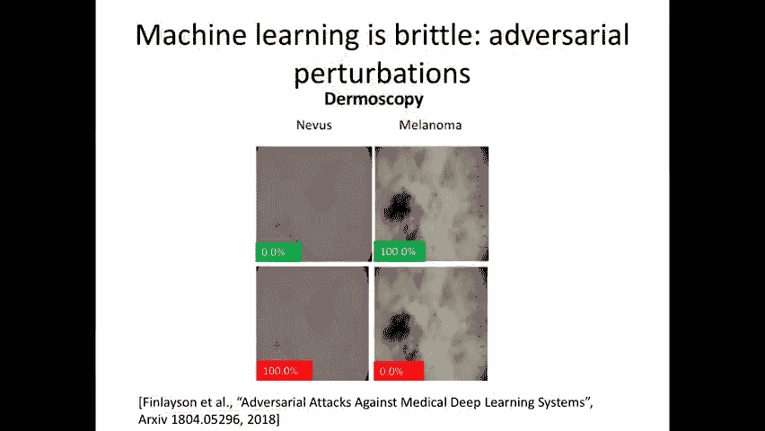
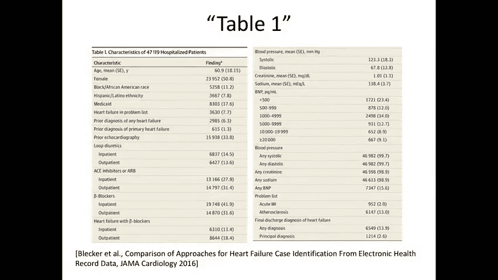
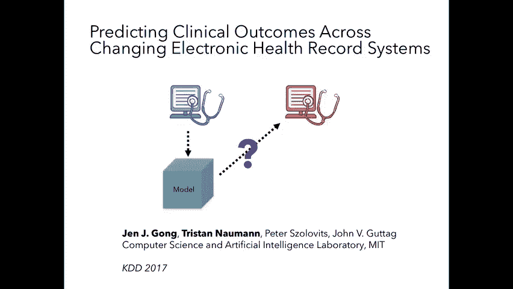

# P24：24.Robustness to Dataset Shift - 大佬的迷弟的粉丝 - BV1oa411c7eD

好的，那么今天的课将是关于数据集转移的，特别是如何对数据集移位鲁棒性，这是我们整个学期都在讨论的话题，我想让你考虑的设置如下，你是一个数据科学家，让我们说，大众综合医院和，在设置机器学习任务时非常小心。

以确保数据被很好地指定，您试图预测的标签是很好指定的，你在一个，根据训练数据进行训练，你在一个伸出的布景上测试它，你看这个模型很好地概括了，你做图表回顾，以确保你所预测的实际上是什么，你以为你在预测。

你甚至做前瞻性部署，然后让你的机器学习算法驱动一些临床决策支持，你看现在一切都很好，这个阶段之后会发生什么，当您进行部署时，当您的相同模型将被使用时会发生什么，不仅仅是明天，也是下周，下一周，第二年。

如果你的模型在这家医院运行良好会发生什么，然后就想，然后还有另一个机构，说也许把妇女医院，或者你看到SF或美国的一些农村医院，想用同样的型号，它在短期内会继续工作吗，今后一段时期，或在新的机构。

这就是问题所在，我们将在今天的课上讨论，我们将谈论，如何处理两个不同品种的数据集转移，第一种是对数据的对抗性扰动，第二种是数据，由于数据现在因自然原因而变化，为什么一点也不明显。

您的机器学习算法在这种设置下仍然可以工作，是因为当我们进行机器学习时，我们所做的首要假设，你的培训分配，您的训练数据来自与测试数据相同的分布，因此，如果您现在转到数据分布已更改的设置。

即使你用你的数据计算了你的准确性，看起来很不错，没有理由穿上新衣服继续好看，在数据分布发生变化的新设置中。

下面是一个简单的例子，说明数据分布发生变化意味着什么，假设我们有作为输入数据的，我们试图预测一些标签，这可能意味着像Y这样的东西是，如果病人有或将被新诊断为2型糖尿病，这是我们的一个例子。

当我们引入风险分层时，我们谈到了这一点，你学习一个从x中预测y的模型，现在假设你去了一个新的机构，他们对2型糖尿病的定义发生了变化，你知道的，也许他们的数据中实际上没有编码二型糖尿病。

也许他们的数据中只编码了糖尿病，它聚集在一起，一型和二型糖尿病，1型通常是青少年糖尿病，它实际上是一种与二型糖尿病截然不同的疾病，所以现在对糖尿病的概念是不同的，也许用例也略有不同，没有理由，很明显。

你用来预测二型糖尿病的模型，会为那个新标签工作，这是一个非常类型的数据集移位的例子，这对你来说可能很明显，在设置正确的情况下什么都不起作用，因为这里给定x的y的分布会改变，意思是即使你有同一个人。

你的分布py给定x，假设分布p为零，和y的分布p给定x p 1，这里是，假设一个机构，这是另一个，现在是两个不同的分布，如果标签的含义发生了变化，所以对于同一个人来说，在y上可能有不同的分布。

所以这是一种类型的数据集移位，另一种非常不同的数据集移位是我们假设这两者相等，所以这会，比如说，排除这种类型的数据集移位，而是从一个位置到另一个位置的变化是x的p，这是数据集移位的类型。

这将是今天讲座的重点，它的名字是协变量移位，让我们来看看两个不同的例子，第一个例子是对抗性的扰动，和，所以说，你们都看到了，卷积神经网络在图像分类问题中的应用，这只是这样一个架构的一个例子。

有了这样的架构，人们可以尝试做各种不同的物体分类或图像分类任务，你可以把它作为输入，这张狗的照片显然是一只狗，对呀，你可以稍微修改一下，只要加入少量的噪音，我要做的是现在我要创造一个新的形象。

也就是现在的原始图像，用每一个像素，我要在噪音的方向上加上一个非常小的epsilon，你得到的是这个新的图像，你可以盯着它看，你想呆多久就呆多久，你将无法区分，基本上对人眼来说，这两个看起来一模一样。

当你拿着你的机器学习分类器，它是在原始的无扰动数据上训练的，现在将其应用于，这个新图像被归类为鸵鸟，这一观察发表在2014年的一篇论文中，叫做神经网络的有趣特性。

对机器学习社区的兴趣激增，论机器学习的对抗性扰动，所以问问题，如果你稍微干扰输入，这如何改变分类器的输出，这能用来攻击机器学习算法吗，顺便说一句，一个人怎么能防御它呢，作为旁白。

这实际上是一个非常古老的研究领域，甚至回到线性分类器的土地上，这些问题已经研究过了，虽然我不会在这门课上深入讨论它，所以这是一种数据集移位，从某种意义上说，我们想要的是，这仍然应该被归类为鸵鸟。

作为一只狗，对呀，所以实际的标签没有改变，我们希望这种分布在标签上，考虑到它的扰动略有不同，除了现在输入的分布有点不同，因为我们允许在每个输入中添加一些噪声，在这种情况下，噪音实际上不是随机的。

这是对抗性的，今天的讲座快结束时，我给你举个例子，一个人如何真正产生敌对的形象，它现在可以改变分类器，我们为什么要关心这些类型的事情，在这门课程中，是因为我希望这种类型的数据集转移，这一点也不自然。

这是对抗性的，也将开始出现在计算机视觉和非计算机视觉问题中，在医学领域，萨姆·菲林森有一篇很好的论文，安迪·比姆和扎克·科恩最近，那个，它提供了几个不同的案例研究，这些问题可能在医疗保健中真正出现。

例如，这里我们要研究的是皮肤病学引起的图像分类问题。

你会得到一个图像作为输入，比如说，您希望此图像被归类为个人，有一种特殊类型的皮肤病，另一个图像黑色素瘤，我们可以看到，随着输入的微小扰动，一个可以完全交换将分配给它的标签。

从一个到另一个，在本文中，他们讨论了如何恶意使用这些算法来谋利，例如，想象一下，一家健康保险公司现在决定，为了报销病人昂贵的皮肤活检费用，临床医生或护士必须首先拍摄疾病的照片。

并将该照片与该程序的账单一起提交，我想现在保险公司有了机器学习算法，是一种自动检查，在这种情况下，这个程序实际上是合理的吗，如果不是，它可能会被标记，现在，恶意用户可能会扰乱输入，使其。

尽管病人的皮肤看起来甚至完全正常，尽管如此，机器学习算法还是可以将其归类为在某种程度上不正常的，因此，也许可以通过该程序获得偿还，显然这是一个邪恶环境的例子，我们希望这样的人会被警察抓住送进监狱。

但尽管如此，我们希望能够做的是建立，将制衡纳入系统，以至于这甚至不可能发生在正确的地方，因为对一个人类来说，很明显，你不应该欺骗，嗯，用这么小的干扰欺骗任何人，那么你如何构建不那么容易被欺骗的算法。

因为人类不会被骗，那个问题，是啊，是啊，对于这些示例中的任何一个，攻击者是否需要访问网络，有办法吗，所以问题是，攻击者是否需要了解有关该函数的一些信息，那是用来分类的，有白盒和黑盒攻击的例子，其中。

在一个设置中，您可以访问该功能，而在其他设置中，您不能访问该功能，所以两者都在文献中被研究过，有结果表明，在任何一种情况下都可以攻击，有时候你可能需要知道更多，比如说，有时您需要能够查询函数一定次数。

所以即使你不知道函数是什么样的，你不知道神经网络的权重，只要你能足够多次地查询它，你将能够构造对抗性的例子，这将是一种方法，另一种方法是，哦，也许我们不知道函数，但我们对训练数据有所了解。

所以有很多方法可以做到这一点，即使你不完全知道函数，这回答了你的问题吗？那么自然扰动呢，所以这个数字是从第五讲提取的，当我们在风险分层的背景下谈论非平稳性时。

只是想在这里提醒你，x轴是时间，Y轴是不同类型的实验室测试结果，可以订购，颜色表示什么，在某个时间点，在某个人群中订购了多少这些实验室测试，所以我们希望看到的是，如果数据是静止的，每一行都是均匀的颜色。

但相反，我们看到的是时间点有，例如，在这里每隔几个月，突然间，一些实验室测试似乎从未进行过，嗯，这很可能是由于数据问题，或者实验室测试提供商的数据丢失了，系统出了点问题，但也会有一些设置，比如说。

一个实验室的测试是永远不会使用的，直到它突然被使用，这可能是因为这是一种新的测试，刚刚发明或批准，在该时间点偿还，所以这是一个非平稳性的例子，当然，这也可能导致数据分布的变化，就像我在那边描述的那样。

第三个例子是当你跨越机构，什么时候，当然啦，两种可能使用的语言都想到了美国的医院，相对于中国的一家医院，临床记录将用完全不同的语言书写这将是一个极端的情况。

一个不那么极端的例子可能是波士顿的两家不同的医院，在哪里，用于某些临床术语的首字母缩写或速记实际上可能不同，因为当地的做法，那么我们该怎么办，这就是所有的设置，在剩下的演讲中，我首先要简短地谈谈。

人们如何建立人口水平检查发生了什么变化，然后今天讲座的大部分内容，我们将讨论如何开发迁移学习算法，以及如何思考对抗攻击的防御。

在我给你们看第一张幻灯片之前，我想讨论一下，你突然做了学习机器学习算法的事情，和你的机构，你想知道，这个算法在其他机构行得通吗，你拿起电话，你打电话给，你在另一个机构的合作数据科学家。

你应该问他们什么问题，为了试图理解，你的算法也能在那里工作吗，他们定期收集什么样的实验室测试信息，看看他们是否这样，他们有什么样的病人数据，他们是否有类似的数据类型或特征可用于他们的患者群体，其他想法。

前两节课都没说过话的人，也许后面的某个人，把电脑拿出来的人，也许你的手在你的嘴里，就在那里，带着你的眼镜在想法上，你想让我重复这个问题吗，问题如下，你在某个机构学习机器学习算法。

你现在想在一个新的机构应用它，你对那个新机构有什么问题要问，尝试评估您的算法是否会推广新的机构，我是说我想这取决于你的问题，就像，你们的人口可能有差异吗，如果您使用特定的工具获取数据，或者人们的差异。

您想要为您的机器校准的视觉数据，他们是否使用不同的技术来获得所有的权利，所以让我们分解你给出的每一个答案，你给出的第一个答案是，人口有差异吗，现在别人会是什么，一个群体差异的例子是什么。

年轻人的年龄分布以及与性有关的费用，波士顿可能会有年轻人和老年人，或者在马萨诸塞州中部，年龄分布的变化会如何影响算法的泛化能力，年轻人的健康模式可能与老年人有很大的不同。

也许有些疾病在年龄较大的人群中更流行，谢谢。所以说，有时我们可能会期待一系列不同的疾病发生，对于较年轻的人口和较年长的人口，对呀，所以我是二型糖尿病高血压，这些疾病通常是在病人，当个人四十岁时。

五十岁及以上，如果你有一套，如果你有20多岁的人，你通常不会在年轻人群中看到这些疾病，所以这意味着，如果你的模特，比如说，是在一群非常年轻的人身上训练的，那么它可能无法假设你在做这样的事情。

预测未来成本，或者与疾病本身没有直接联系的东西，在非常年轻的人群中预测未来成本的特征，可能与老年人群的成本预测特征非常不同，因为这些人现在的条件不同，给出的第二个答案，与仪器校准有关的事情。

你能详细说明一下吗，是啊，是啊，所以我在想，尤其是在结肠镜检查领域，但就像如果你在收集，所以在那个空间里，就像你在收集冒号的视频，所以你可以有非常不同校准的机器，让我们说，不同相机设置的不同曝光。

我们也有那个，美国兵和内科医生有不同的技术，他们是如何探索，所以视频数据本身将是，所以给出的例子是结肠镜检查，以及可能作为其中一部分收集的数据，和，可以收集的数据可能是不同的因为两个不同的原因。

一是因为收集数据的实际仪器，比如说，成像数据的校准可能有点不同，第二个原因可能是，因为每个机构用于进行诊断测试的程序可能不同，每一个都会导致对数据的偏差略有不同。

目前还不清楚一个算法是在一种类型的过程上训练的，或者一种仪器会推广到另一种仪器，嗯，所以这些都是很好的例子，所以说，当一个人读到一篇来自临床社区的关于开发一种新的风险分层工具的论文时，你将永远看到的。

这张纸就是所谓的第一张表，所有的权利，第一桌看起来有点像这里，我从我自己的报纸上，发表在2016年的《美国医学会心脏病学》上。

在那里我们研究了如何找到住院的心力衰竭患者，我只是要走过这张桌子是什么，这张表格描述了研究中使用的人口，上面说这些是四万七千名住院病人的特征，那么我们所做的就是利用我们的领域知识。

我们知道这是一个心力衰竭的人群，我们知道有许多不同的轴来区分病人，因心力衰竭住院的人，所以，我们列举了许多我们认为，对确定人口特征至关重要，我们给出了你通常开始使用的每一个功能的描述性统计数据。

比如年龄，性别和种族，所以这里，比如说，平均年龄是61岁，顺便说一句，这是，纽约大学医学院，呃，五十，百分之八，女性，十一点，百分之二，黑色，非洲，美国人，十七点，6%的人接受医疗补助。

这是一个国家为残疾人或低收入个人提供的健康保险，然后我们观察了药物的数量，比如40岁的病人服用了什么类型的药物，四十的百分之一，2%的住院病人服用了一种叫做受体阻滞剂的东西，三十一分。

6%的门诊病人服用受体阻滞剂，然后我们看了一些东西，比如，实验室测试结果，所以人们可以看看平均值，创建Anine值，这个病人群体的平均钠值，以这种方式描述正在研究的人口是什么，那么当你去新机构的时候。

新机构接收的不仅仅是算法，但他们也收到这张桌子，一个描述算法在其上学习的群体的群体，他们可以利用这些知识和一些领域知识来思考问题，就像我们在听的，在我们的讨论中我从你那里列出了什么，对呀。

这样我们就可以思考，它真的做到了吗，这个模型将推广到这个新机构是有意义的，它可能不会的原因是什么，你甚至可以在对新人口进行任何前景评估之前就这样做，所以在你们的项目中。

几乎所有人都应该有类似于表1的东西，写对了，因为这是该领域任何研究的重要组成部分，你正在研究的人口是多少，你同意我的看法吗？皮特，是啊，是啊，我只想加上1号桌，如果你在做病例对照研究。

我们将有两列显示这两个关系中的分布，然后是这些差异显著的可能性的p值，你，我会，只是我只是重复皮特的回答录音，如果你是，这个表是用于预测问题的，但是如果你在考虑一个因果推理类型的问题。

有不同干预小组的概念，你会被期望报告同样的事情，但对于病例群体，接受的人，让我们说，治疗一，接受治疗的人，然后你会看到这些群体之间的差异以及个体特征水平上的差异，作为该研究描述性统计数据的一部分。

只是为了识别，就像医院之间的团结，做T测试就足够了吗，或者那些桌子，看看它们是否不同，否，所以他们总是不同的，对呀，你去一个新的机构，它总是会看起来不一样，所以只是看看事情发生了什么变化并不是。

答案总是肯定的，但这真的，它使对话能够思考，好的，这个，然后你可能会看，你们可能会用到皮特下周要讲的一些技巧，关于可解释性，试图很好地理解，模型实际使用的是什么，然后你可能会问，哦，好的，嗯。

模型正在使用这个东西，这在这个群体中是有意义的，但在另一个人群中可能没有意义，这两件事加在一起使谈话，近年来，这个问题确实引起了人们的注意，我与皮特上周讨论的话题密切相关，论公平与机器学习。

因为您可能会问分类器是否构建在某些群体中，它会推广到另一个人群吗，如果它所学习的人群非常有偏见，例如，可能都是白人，你可能会问，这个分类器在另一个人群中会很好地工作吗，这可能包括不同种族的人。

所以这导致了一个概念，最近发表了这个，这个工作草案，我展示的摘要是几周前，称为数据集的数据表，这里的目标是标准化描述，引出关于，是什么数据集真正影响了你的嗯，是啊，是啊，你的模特。

所以我要简单地向你们介绍一下，只是通过一个例子的几个元素，数据表的数据集可能类似于，这太小了，你看不懂，但我会在一秒钟内炸毁一个部分，这是一个叫做研究人脸识别的数据集的数据表，在不受限制的环境中。

这是为了解决计算机视觉问题，会有很多问卷，我给你们看的这篇论文概述了，而你作为模型开发人员，仔细检查问卷并填写答案，所以包括动机，用于数据集的创建组成等，所以在这个特殊的例子中。

这个数据集被称为标记人脸，在野外被创造出来是为了提供研究人脸识别的图像，在不受限制的环境中，图像特征如姿势，照明，分辨率和焦点无法控制，所以它旨在成为现实世界的设置，现在，本报告中最有趣的部分之一。

应该与数据集一起发布，与，数据是如何预处理或清理的，例如，对于此数据集，它将经历以下过程，首先，从数据集获得原始图像，然后嗯，它由图像和标题组成这些图像和标题是与图像一起发现的，在新闻文章或网络上。

然后有一个人脸探测器在数据集上运行，以下是使用的面部探测器的参数，然后记住这里的目标是研究人脸检测，所以嗯，所以人们必须知道，怎么样，标签怎么样，确定，一个人怎么会，比如说，如果这张图像中没有脸。

则消除，所以他们描述了一张脸是如何被检测到的，以及一个地区是如何被确定不是一张脸的，在不是的情况下，最后描述了如何删除重复项。

如果你回想一下本学期早些时候的例子，从医学成像，比如说，病理学和放射学，必须在那里进行类似的数据集构造，比如说，一个会去PAC系统，那里存储放射学图像，一个会一个会决定哪些图像会被拉出来。

一个会去放射学报告，来弄清楚我们如何从图像中提取相关的发现，这将给标签，为了那个预测性，为了那个学习任务，每一步都会产生一些偏见，有些需要仔细描述，为了理解学习的分类器的偏差是什么，我现在就不详细说了。

但这也将是，这是一个快速阅读，我鼓励你经历它，得到一些直觉，对于什么是问题，我们可能想问，我们创建的数据集，在这学期剩下的时间里，在今天讲座剩下的时间里。

我现在要继续讨论一些更技术性的问题，所以，我，我们必须做到这一点的权利，我们在做机器学习，现在，种群可能不同，我们该怎么办，我们能不能改变学习算法，希望你的算法能更好地转移到一个新的机构。

或者如果我们从那个新机构得到一点数据，我们能利用新机构的少量数据吗，或者未来的一个时间点，重新训练我们的模型，使其在略有不同的分布中表现出色，这就是迁移学习的整个领域。

所以你有从x和y的p上的一个分布中提取的数据，也许我们有一点数据来自不同的分布，x y的q，在协变量移位假设下，我假设q x逗号y等于，给定x，y的p，即给定x的y的条件分布没有改变。

唯一可能改变的是你在x上的分布，这就是协变量移位假设所假设的，所以假设我们从新的分布中提取了一些少量的数据，q，我们如何利用它，为了重新训练我们的分类器，让它为新的机构做得很好。

所以我将通过四种不同的方法来做到这一点，我将从最容易理解的线性模型开始，然后我将继续深深的模型，第一种方法是你已经见过几次的东西，在本课程中，我们将把迁移看作是一个多任务学习问题。

其中一个任务的数据比另一个任务少得多，所以如果你还记得当我们谈到疾病进展模型时，我们引入了正则化权重向量的概念，这样他们就可以互相靠近，当时我们谈论的是权重向量，预测未来不同时间点的疾病侵蚀。

我们可以在这里使用完全相同的想法，你把你的分类器，你的线性分类器是在一个非常大的语料库上训练的，我要把它叫做，我要把那个分类器的权重称为w旧，然后我要解决一个新的优化问题，也就是最小化重量w最小化损失。

所以这就是你训练的地方，你的新训练数据进来了，所以说，我假设新的训练数据d是从q分布中提取的，然后呢，我将增加一个正则化，要求w应该保持在，老了，您拥有的数据量，如果那个新机构的数据非常大。

那你就不需要这个了，你就可以，您可以忽略以前学过的分类器，把一切都修改到新机构的数据上，像这样的东西特别有价值，如果有少量的数据集移动，你只有来自那个新机构的非常少量的标记数据。

这样你就可以稍微改变一下你的重量矢量，对呀，所以如果这个系数很大，它会说新的W不能离旧的W太远，所以允许你稍微改变一下事情，为了在你拥有的少量数据上做得很好，比如说，如果有一个特征是以前预测的。

但这一特征在新的数据集中不再存在，例如，它都是等于零，然后SP是新的权重向量，该特性的新权重将被设置为零，和重量，你可以考虑的重量，正在被重新分配到其他一些特性，这是有道理的，有什么问题吗？

所以这是最简单的迁移学习方法，在你尝试更复杂的事情之前，总是尝试这个，所以第二种方法，也有线性模型，但在这里，我们不再假设这些特性仍然有用，所以当你从，当你从你的第一个机构，比如说MGH，在左边。

你学习你的模型，你想把它应用到一些新的机构，说UCSF，在右边，可能是功能集有了很大的变化，使原始特性对新特性集毫无用处，一个非常极端的例子可能是我之前给出的设置，在那里我说，你知道你的模特是学英语的。

你在中国人身上测试，对呀，那将是一个例子，如果你用一袋话，模型，这将是一个例子，在那里嗯，你的模型显然根本不能推广。

因为，因为你的特征完全不同，那么在那种情况下你会怎么做，什么是，你能做的最简单的事是什么？所以你拿的是用英语学的文本分类器，你想在语言是中文的环境中应用它，你会怎么做，翻译，你说过，还有另一个答案。

训练一个RNN做什么艺术训练，哦好吧，所以假设你有一些机器翻译的能力，你是从英语翻译过来的，从汉语到英语，它必须在那个方向，因为最初的分类器是用英语训练的，然后你的新功能是翻译和原始功能的组成。

然后你可以想象做一些微调，如果你现在有少量的数据，如果最简单的翻译函数可能是，你只要查字典就可以了，如果这个词在另一种语言中有类比，你说，好的，这是翻译，但在你的语言中总会有一些词，没有很好的翻译。

所以你可能会想象最简单的方法是翻译，但把没有很好类比的词去掉，并强制分类器使用，让我们说，只是共享的词汇，我们在这里讨论的一切都是手动选择决策的例子，所以我们将手动为数据选择一个新的表示形式，这样。

我们在源数据集和目标数据集之间就有了一些共享的特性，让我们来谈谈电子健康记录一。

电子健康档案二，顺便说一句，我将在这里展示的幻灯片来自一篇发表在KD的论文，作者：简·特里斯坦，你的导师，皮特和约翰·古塔格，所以你有两个电子健康记录，电子健康档案一，电子健康档案二，世事如何才能善变。

可能电子健康记录中的同样概念，一个可能映射到不同的编码，这就像是电子健康记录2中的英语到西班牙语的打字翻译，另一个改变的例子可能是说一些概念被删除了，比如你在电子健康记录一号里有实验室测试结果。

但不是电子健康记录二，所以这就是为什么你看不到任何优势，另一个变化可能是，可能会有新的概念，因此，新机构可能拥有旧机构所没有的新类型的数据，那么你在那种环境下做什么，一种方法会说好。

我们从二号电子健康记录中获得了一些少量数据，我们可以用它来训练扔掉电子健康记录一号中的原始数据，当然，如果您只从目标分布中获得少量数据，这将是一个非常糟糕的方法。

因为你可能没有足够的数据来学习一个足够合理的模型，第二个明显的方法是可以的，我们将在电子健康记录1上进行训练并应用它，对于那些已经不存在的概念，就这样吧，也许事情不会很顺利，我们之前提到的第三种方法。

当我们谈到翻译的时候，就是在这两个特征的交汇处学习一个模型，这项工作所做的是，他们说我们要手动重新定义功能集，为了找到尽可能多的共同点，这确实涉及到很多领域知识，我将用这个作为一个对比点。

从我十分钟或十五分钟后将要谈论的内容来看，在那里我谈到了如何做到这一点，如果没有我们将要在这里使用的领域知识，他们看到的环境是预测结果，比如在医院，死亡率或逗留时间，将要使用的模型是一袋事件模型，因此。

我们将记录病人的纵向病史，直到预测的时候，我们将看看发生的不同事件，这项研究是用理疗等方法进行的，所以在模仿中，比如说，事件用一些数字编码，像五个，八，一个四可能对应于CVP警报，一零。

四六可能对应着疼痛的存在，两个五可能与给的肝素药物相对应，等等，所以我们将为每个事件创建一个功能，它有一些数字，它是用一些数字编码的，我们就说一个，如果该事件发生为零，否则，这就是病人的代表。

因为当一个人去这个新机构的时候，小时二，事件的编码方式可能完全不同，一个人不能仅仅使用原始的特征表示，这是我给出的英语到西班牙语的例子，但人们可以尝试做的不是想出一个新的功能集。

其中该特征集可以从每个不同的数据集导出，例如，因为mimic中的每个事件都有相应的文字描述，事件一对应于缺血性中风，事件二出血性中风，等等，人们可以试图用英语对FE的描述。

想出一种方法把它映射成一种共同语言，在这种情况下，通用语言是U，Pete前几节课讲的联合医学语言系统是什么，所以我们现在要说好，我们有一个更大的功能集，我们现在把缺血性中风编码为概念。

这实际上是同样的缺血性中风，也作为这个概念和那个概念，是原始版本的更一般的版本，对呀，所以这只是一般的中风，可能是多种不同类型的中风，希望即使在，即使模型没有，即使。

其中一些更具体的数据没有出现在新机构的数据中，也许更多的一些更一般的概念确实出现在那里，然后你要做的是，你现在要在这个扩展的翻译词汇表上学习你的模型，然后翻译，在新的机构里。

你也将使用同样的通用数据模型，通过这种方式，人们希望在你的功能集中有更多的重叠，所以要评估这一点，作者观察了拟态中两个不同的时间点，有一次伯特利迪肯医疗中心使用电子健康记录，称为关怀视图。

第二个时间点是医院使用一种不同的电子健康记录叫做metavision，所以这实际上是一个非平稳性的例子，现在，因为他们使用了两种不同的电子健康记录，然后涂层是不同的，这就是为什么这个问题出现了。

所以我们要用这种方法，然后我们将在这个新编码的基础上学习一个线性模型，我刚才描述的，我们将通过观察损失了多少性能来比较结果，由于使用这种新编码，我们从一个概括得有多好，从一个，从一个。

从源任务到目标任务，所以这是第一个问题，这就是我们使用这种新编码损失了多少，因此，作为预测医院死亡率的比较点，我们将看看预测的性能是什么，如果你只是使用一个现有的非常简单的风险评分，称为SAP评分。

这是一条红线，Y轴，这里是ROC曲线下的区域，x轴是提前多少时间，你在预测预测差距，所以用这个非常简单的分数，萨吉特，在设定点75到80之间的某个地方在ROC曲线下的区域。

但是如果你要使用所有的事件数据，这比简单的SAP评分要丰富得多，你会得到紫色的曲线，也就是紫色的曲线，也就是行动，加上事件数据，或者蓝色的曲线，这只是事件数据，你可以看到，通过使用更丰富的特性集。

您可以获得更好的预测性能，最高分的好处是更容易概括，因为它是如此简单，这些特征元素可以简单地转化为任何新的EHR，手动或自动，因此，这将永远是一条可行的路线，而这条蓝色的曲线。

虽然它得到了更好的预测性能，你必须真正担心这些概括问题，同样的情况发生在源任务和目标任务中，现在第二个问题，第二个要问的问题很好，发生了什么事，当您使用数据的新表示形式时，您损失了多少。

所以在这里再看一次，这两个都是我们所看到的，第一个红色的是相同的红色曲线是相同的蓝色曲线，我在上一张幻灯片中显示过，它在用树液，加上项目ID，所以使用所有的数据，然后这里的蓝色曲线，有点看不清楚。

但这是对的，要低得多，如果您现在使用这个新的表示形式，就会发生这种情况，你会发现你确实失去了一些东西，因为你试图找到一个共同的词汇，表演确实受到了一点打击，但特别有趣的是，当你试图概括，你开始看到交换。

所以如果我们现在所以现在颜色会很相似，所以红色是使用数据的原始表示，在它处于最顶端之前，如图所示，这是这个机构护理视图上的训练错误，你看，原始功能集中有这么多丰富的信息，它能够做非常好的预测性能。

但一旦你试图翻译它，所以你接受同行评议的训练，但你在元视觉上测试，那么这里这条实心红线显示的测试性能，实际上是所有系统中最糟糕的，性能大幅下降，因为并不是所有这些功能都出现在新的人力资源中，另一方面。

翻译过来的版本说，尽管它有点糟糕，嗯，在源上评估时，它概括得更好，所以你会看到一个明显更好的表现，这是由这里的蓝色曲线显示的，嗯，当你使用这个翻译词汇时。

有一个问题，是啊，是啊，所以当你用更多的功能训练时，那又怎样，你如何应用这个模型，如果有，如果对方，所有的功能，你只是这样，你是，您假设您已经想出了一个映射，从两个人力资源中的功能到这个共同的功能。

Q的词汇，以及在本文中进行映射的方式，是基于，事件的，因此，您将获取基于文本的事件描述，你得到了一个到这个新U的确定性映射，基于S的表示，然后这就是被使用的，在这个特定的例子中没有进行微调。

所以我认为这是一个非常幼稚的转移应用，结果正是你所期望的结果，显然要做很多工作，有一点创造性的想法是你应该使用英语空间，描述特征，提出自动映射，但故事到此为止，所以你们可能会有一个问题。

你怎么能自动地尝试这样的方法，我们如何自动找到表示，数据的新表示形式，这些表示形式可能会泛化，从下水道分布，去测试，目标分布，所以说到这一点，我们现在要开始通过表示来思考，基于学习的方法。

其中深层模型特别能够，让我们说，深度神经网络将只是切断网络的一部分，并重用这个新位置中数据的一些内部表示，所以画面看起来有点像这样，所以数据可能会在底部提供，可能有许多卷积层，一些完全连接的层。

你决定做的是，你要把这个在一个机构训练过的模型，你把它切成几层，例如，它可能在最后一个完全连接的层之前，然后你要把数据的新表示形式，现在，数据的表示是你会得到的，在做了一些卷曲之后。

然后是单个完全连接的层，然后你要把你的目标分布数据，你可能只有少量的，你在新的表示形式上学习一个简单的模型，例如，您可能会在新的表示形式之上使用支持向量机学习浅分类器，或者你可以添加更多的深度神经网络。

然后从头到尾微调一下，所以这些都试过了，在某些情况下，一件作品比另一件作品更好，我们已经在。

嗯，在本课程中，那是亚当·耶拉在第十三讲的时候，在他的方法中，他说他两者都试过了，分类器，并将其与，如果您用一个众所周知的imagenet初始化会发生什么，基于深度神经网络的问题。

他在他的案子里讲了一个非常有趣的故事，他有足够的数据，他实际上不需要初始化，使用Imagenet的这个预先训练的模型，如果他只是做了一个随机的初始化，最后这个和这个就像我记不清了一样。

也许是几个小时的训练或时代，我不记得了，是时候了，最终随机初始代理得到非常相似的性能，但为了他的特殊情况，如果要使用imagenet进行初始化，然后微调，你到那里要快得多。

所以正是由于计算的原因，他发现它很有用，但在医学成像的许多其他应用中，这些同样的技巧变得必不可少，因为您在新的测试用例中没有足够的数据，所以一个人利用，比如说，从Imagenet任务中学到的过滤器。

这与医学成像问题截然不同，然后使用同样的过滤器，加上一套新的顶层，以便对您关心的问题进行微调，所以说，这将是试图希望有一个共同的转移表示的最简单的方法，在一个深邃的建筑中，但你可能会问。

你如何用时间数据做同样的事情，非图像数据，可能是来自语言的数据，也可能是来自时间的数据，健康保险索赔系列，为此，你真的想考虑递归神经网络，所以只是想提醒你，递归神经网络是一种递归体系结构。

在那里你把一些向量作为输入，比如说，如果你在做语言建模，那个矢量可能只编码了一个热的，该位置的单词的编码，例如，这个向量可能都是零，除了四维空间，这是一个表示这个词是class这个词的词。

然后它被输入一个循环单元，它将之前的隐藏状态，将其与当前输入组合，给你一个新的隐藏状态，这样你就读进去了，您对完整的输入进行编码，然后你可能会预测，根据最后一次步骤的隐藏状态进行分类。

这将是一种常见的方法，这里是一个非常简单的循环单位的例子，这里我用s来表示隐藏状态，我们经常寻找H用来表示隐藏的状态，这是一个特别简单的例子，只有一个非线性，所以你把你以前的隐藏状态。

你用一些矩阵W打它，就像，你把它添加到被不同矩阵击中的输入中，您现在有一个输入加上以前隐藏状态的组合，你对它应用非线性，你得到了你新的隐藏状态，所以这将是一个典型的循环单位的例子。

一个非常简单的循环单位，现在，我讲这些细节的原因是想指出，WSX矩阵的维数是隐态的维数，s的维度词汇量，如果您使用输入的一个热编码，所以如果你有大量的词汇量，矩阵WSX也将同样大，这带来的挑战是。

很快就会导致对稀有单词的过度适应，所以这是一个可以通过，而是使用wsx矩阵的低秩表示，特别是，你可以考虑引入一个低维瓶颈，在这张图片中，我注意到它是xt素数，它是原始的XT输入。

这是一个热编码乘以一个新的矩阵，我们，然后你的循环单元只接受隐藏的输入，xt素数，为k的维度，它可能比V小得多，然后你可以考虑中间表示的每一列，WWE作为单词嵌入，这是一种，这是皮特经常谈论的事情。

当我们思考自然语言的时候，当我们谈论自然语言处理时，还有很多，你们中的许多人可能在单词到VEC的上下文中听说过，如果一个人想做一个设置，比如说，其中一个数据，你有大量的数据，跑。

在该机构的数据上学习递归神经网络，然后推广到一个新的机构，尝试做到这一点的一种方法，如果你想想你砍的东西是什么，一个答案可能是，你所做的一切，你保留嵌入这个词，所以你可能会说，好的，我要留下韦斯一家。

我要把它翻译成我的新机构，但我会让循环单位参数，循环参数，比如说，你可能允许为每个新机构重新学习的WSS，所以这可能是如何使用我们从，从…，递归设置下的前向神经网络，现在所有这些都很普遍，嗯。

我接下来要做的是对它进行一点实例化，在保健方面，所以自从皮特提出，单词对VEC的扩展，比如伯特和埃尔莫，我也不打算，我现在不打算谈他们，但你可以回到几周前皮特的演讲，提醒你们自己。

从你们在讲座上介绍的时候起，这些是什么，实际上有三篇新论文试图将这一点应用于医疗保健领域，其中一个来自麻省理工学院，所以这些论文都有同样的想法，他们要拿一些数据集，这些论文都用了模仿。

他们会拿走文本数据，他们将学习一些单词嵌入，或者词汇表中所有单词的一些低维表示，在这种情况下，他们不是在学习每个单词的静态表示，而是，这些伯特和埃尔莫的方法将学习什么，你可以认为是动态表示。

所以它们将是这个词的一个函数，以及它们在左手边和右手边的上下文，然后他们会做的是，然后他们会接受这些表示，并试图用它们来完成一项全新的任务，这些新任务可能是在模拟数据上，例如。

这两个任务都是模仿上的分类问题，但它们也可能在非模拟数据上，所以这两个任务是临床试验中的分类问题，它根本不是来自模仿，所以说，这真的是一个翻译你所学到的东西的例子，从一个机构到另一个机构。

这两个数据集非常小，实际上，与最初的模拟规模相比，所有这些数据集真的真的很小，所以可能有一些希望，人们可以学到一些真正提高泛化的东西，事实上，这就是结果，所以这个，所有这些任务都是一个概念检测任务。

给出临床说明，标识注释中引用，比如说，疾病或治疗，或者别的什么，然后你在第二阶段可能会正常化到U，s，那么这些结果真正引人注目的是什么呢，当你从左列转到右列时会发生什么，我一会儿就解释。

当你从上到下处理这些不同的任务时会发生什么，所以左栏是结果这些结果是我们的F或F分数，嗯，如果使用在非临床数据集上训练的嵌入，结果会如何，或者说得不同，不是在模仿上，但是在其他一些更一般的数据集上。

第二列是会发生什么，如果你在临床数据集上训练这些嵌入，在这种情况下，模仿，你会看到很大的改进，从一般嵌入到基于模拟的嵌入，更惊人的是，是随着越来越好的嵌入而发生的改进，所以第一行是结果是什么。

如果您只使用Word到VEC嵌入，所以，比如说，参加2010年的挑战赛，你得了82分65分，使用逐字逐句到VEC嵌入，如果你使用一个非常大的bert嵌入，你得了九十二分，它要高得多。

在不同的任务中一次又一次地发现了相同的发现。

现在，我发现这些结果真正引人注目的是，几年前我尝试过很多这样的东西，不使用伯特或埃尔莫，但是用文字来真空，手套和快速文本，我发现使用单词嵌入方法解决这些问题并没有，即使你把它作为其他最先进的附加功能。

概念提取问题的方法，没有提高预测性能超过现有的技术状态，然而，在本文中，这里，他们使用了最简单的算法，使用递归神经网络，输入条件随机场，以便将每个单词分为这些类别中的每一个和特征。

他们使用的特性只是这些嵌入特性，所以只要用VEC这个词嵌入功能，表演很烂，你不会更接近艺术的状态，但是有了更好的嵌入，他们实际上获得了状态，实际上他们在每一个任务中都改进了最先进的技术。

