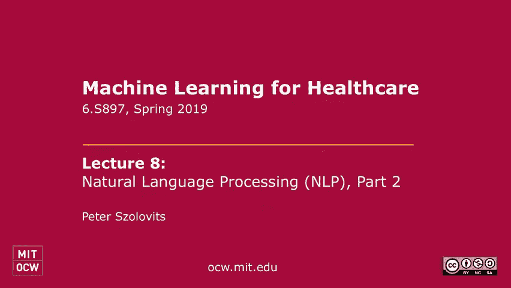
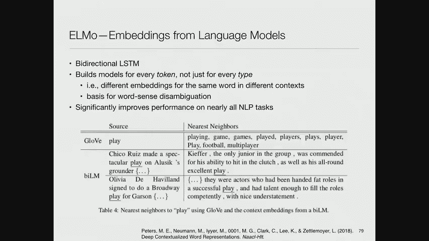
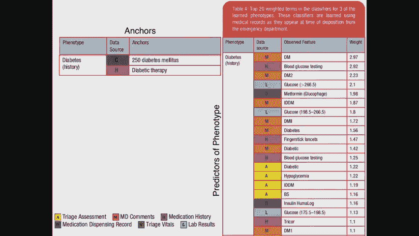
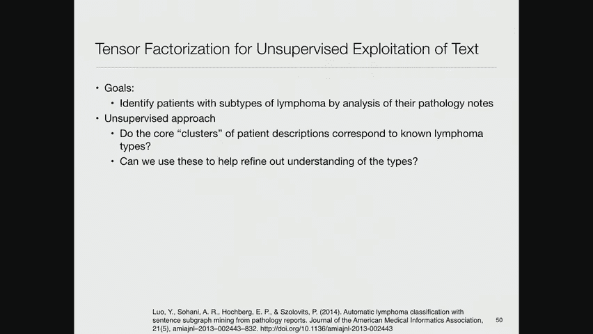
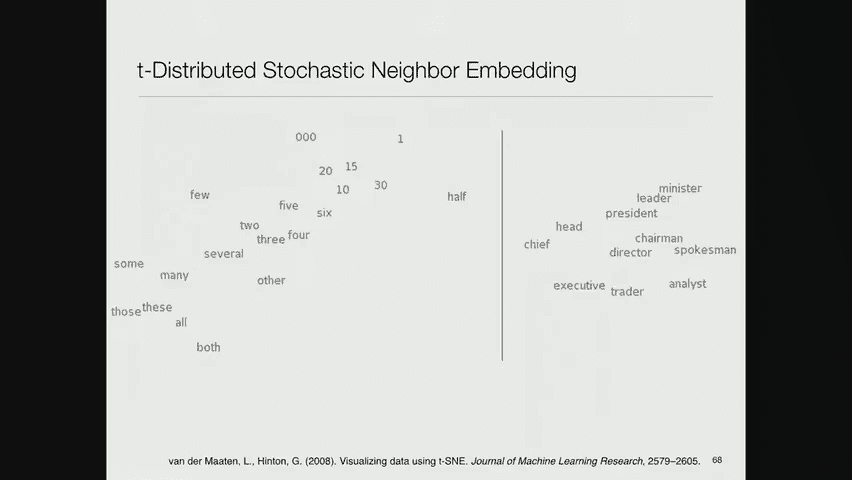

# P8：8.Natural Language Processing (NLP) - 大佬的迷弟的粉丝 - BV1oa411c7eD

所有的权利，让我们开始吧下午好，所以上次我开始谈论使用自然语言处理来处理临床数据，事情进展得有点慢，我今天会试着多赶点时间，因此，我有很多东西要涵盖，所以如果你还记得上次，我一开始就说。

NLP的很多工作都涉及到想出短语，人们可能感兴趣的，以帮助识别您想要的数据类型，然后在文本中寻找那些，所以这是一个非常简单的方法，但这是一个相当好的工作，然后Kat Liao在这里讨论了一些应用程序。

那种工作，她在队列选择中所做的，所以我今天想说的是更复杂的版本，然后转向更现代的方法，到自然语言处理，所以这是一篇给你的论文，作为上次的选读之一，这是大卫桑塔格实验室的成果，他们说，嗯。

我们如何让这个更复杂，所以他们开始的方式是一样的，他们说，好的廖医生，让我们说给我一个非常好的条件，我有合适的病人的指标，如果我在病人的笔记中找到它们，所以这些都是有很高预测价值的东西。

所以你不想用像生病这样的术语，因为那会找到太多的人，但你想找到一些非常具体的东西，但这有很高的预测值，你会找到合适的人，然后他们所做的是，他们建立了一个模型，试图预测这个词在文本中的存在。

从医疗记录中的其他一切，这是一种银标准的训练方式，一个说得很好的模型，我没有精力也没有时间去找医生，翻阅成千上万的记录，但如果我选择这些锚足够好，然后我会从那些人那里得到很高的正确答案。

然后我训练一个机器学习模型，术语或那些包含这些术语的相同记录，顺便说一句，从那开始，我们将学习一大堆其他术语，这些术语是代理，为了我们开始的那个，所以这是一种放大的方式，所以你可以找到一堆技术细节。

通过阅读报纸，他们使用了一个相对简单的表示，它本质上是一袋文字表示，然后他们掩盖了这个词周围的三个词，这实际上是他们试图预测的，只是为了摆脱，短期的，然后他们建立了一个L2正则Logistic回归模型。

预测这个词出现的特征是什么，然后他们扩展了搜索词汇表，将这些功能也包括在内，还有很多关于如何，如何离散连续值，诸如此类的事情，你可以找到，所以你从锚中建立一个表型估计器，和选择的预测器。

他们为这些其他预测器中的每一个计算了校准分数，告诉你它预测得有多好，然后您可以构建一个联合估计器，使用所有这些，底线是他们做得很好，所以他们看了看，以便评估这一点，他们观察了八种不同的表型。

他们有人类的判断数据，所以这告诉你他们得到了，对于这些不同的表型来说，在83点和95点之间。

所以这很好，嗯，事实上，他们不仅在估计这八种表型，但是四十来岁，我不记得确切的数字了--要大得多，但他们没有验证的数据来测试其他人，但人们的期望是，如果它在这些方面做得很好，它可能在其他地方也做得很好。

所以这是个很好的主意，只是为了说明，如果你从糖尿病这样的表型开始，你说，嗯，我要去找锚，这是一个代码，250糖尿病，或者我要看看糖尿病治疗的用药史，所以这些是最初的，我正在考虑的银本位目标。

而那些实际上，对队列中的某人有很高的预测价值，然后他们识别出所有这些其他特征来预测，因此反过来，预测他们感兴趣的表型的合适选择者。

如果你再看一遍报纸，你看到的是，随着时间的推移，这优于，他们与之比较的标准监督基线，在那里你会得到更高的精度，在病人就诊的早期，能够识别他们属于这个队列，我晚点再来，看看另一个类似的尝试。

用一套不同的技术从核心进行推广，所以你应该在大约4-5分钟后看到，我希望，所以如果你看像先生这样的句子，亨廷顿接受了亨廷顿病的治疗，在位于亨廷顿大道的亨廷顿医院，每一次提到亨廷顿这个词都是不同的，例如。

如果您对消除可识别个人身份的健康信息感兴趣，从这样的唱片中，那么你当然想摆脱亨廷顿先生的部分，你不想摆脱亨廷顿病，因为这是医学上相关的事实，你可能真的想摆脱亨廷顿医院，及其在亨廷顿大道的位置。

尽管这些不一定是你被禁止保留的东西，例如，如果你试图在不同的医院之间进行质量研究，那么保留医院的名称就有意义了，这不被认为是对个人的识别，所以我们我们，事实上，早在2000年中期就做了一项研究。

我们试图建立一个改进的，我们是这样做的，这是一种厨房水槽的方法，它说好吧，拿着文本，给它做个记号，看看每一个令牌，并从中派生事物，所以构成信物的文字，词性，词性，它是如何大写的，它周围是否有标点符号。

它在哪个文档部分，你知道，许多数据库都有某种传统的文档结构，如果你看过模拟出院总结，比如说，有一种典型的方式，它从头到尾流动，你可以利用这些结构信息，然后我们确定了一堆模式和词库术语。

所以我们查了MLS，单词和短语，看看它们是否与一些有临床意义的术语相匹配，我们有识别电话号码、社会安全号码和地址的模式，等等，然后我们对文本进行了解析，所以在那些日子里。

我们使用一种叫做链接语法解析器的东西，这没什么区别，什么解析器，但你要么得到一个选民，要么得到一个选区，或依赖项解析，它给了你单词之间的关系，因此，它允许您包含作为功能，你看一个词的方式。

与它周围的其他单词有关，所以我们所做的是我们说，好的，词汇上下文包括上述所有类型的信息，对于所有字面上相邻的单词，或者你所关注的原词的n个字以内，或者通过对该单词的解析通过k个链接链接。

所以这给了你一个非常大的功能集，当然还有，解析不是一个解决的问题，这是我上次给你们看的那个故事中的一个例子，如果你看到它，就会得到两个四个模棱两可的解析，关于如何处理这个问题有一些技术问题。

今天您可以使用不同的解析器，斯坦福解析器，比如说，可能比我们14年前用的那个做得更好，并至少给你更明确的答案，所以你可以用它来代替，所以如果你看看我们所做的，我们说过，嗯，这是课文先生。

以下是你可以在MLS中查找的所有方法，结果很模棱两可，所以MMR不仅代表先生，但它也代表磁共振，它代表了一大堆其他东西，所以你会得到大量的模糊性，盲人也会给你各种模棱两可的地方，所以它在这里映射到。

是可以的，七十九岁还可以，然后雄性又映射到四个五个不同的概念唯一标识符，所以从这个数据库中产生了所有这些过度生成的问题，这里还有一些，但我要跳过这一点，然后我们的学习模型是这个项目的支持向量机。

我们只是说好，把所有的，你知道是把他们都杀了，上帝会把他们整理出来的，那种方法，所以我们只是加入了所有这些功能，然后说，哦，支持向量机非常擅长准确地挑选出什么是最好的特性，所以我们只是依靠这一点，果然。

你最终得到了数百万的功能，但果然效果很好，所以统计ID是我们的程序，你可以在真正的出院总结中看到，我们正在获得精度，并在PHI上召回，大约98。5，百分之九十五又四分之一，这比以前的技术水平要好得多。

它建立在规则和词典的基础上，作为一种识别事物的方式，所以这是这种方法的一个成功例子，当然，这不仅适用于识别，但它也可用于实体识别，因为不是选择个人身份健康信息的实体，你可以训练它选择疾病或药物的实体。

或者是其他各种各样的东西，所以这是在2000年，人们处理这类问题的一种非常典型的方式，至今仍在使用，我是说，周围有工具可以让你做到这一点，它们工作得合理有效，它们目前不是最先进的。

但它们比当今许多最先进的技术更简单，所以这里有另一种方法，这是我们几年前出版的东西，在那里我们开始和一些精神病医生一起工作，然后说，我们能预测一个精神病患者30天的再入院时间吗，具有任何程度的可靠性。

那是个很难的预测，威利目前正在进行一项实验，我们要求精神病学家预测，事实证明，他们在这个预测上几乎不比偶然更好，所以这不是一件容易的事，我们所做的是，我们说过，嗯，让我们使用主题建模。

所以我们有一群病人，大约有5000个病人，其中大约10%的人在心理诊断后被重新接纳，其中近3000人因其他诊断而重新入院，所以这告诉你的一件事是，如果你在和精神病患者打交道，2。他们经常去医院。

这对医院的底线不利，因为报销，保险公司的保单等等，所以只有四十个，七百，只有一百四十人在三十天内没有被重新接纳，所以有非常频繁的反弹，所以我们说，嗯，让我们尝试从基线使用支持向量机构建基线模型。

年龄等临床特征，性别，公共健康保险是社会经济地位的代表，所以如果你有医疗补助，你可能很穷，如果你有私人保险，那么你可能是麻省理工学院的员工，过得更好，所以这是一个经常使用的代理，一个共病指数。

告诉你你的病情有多严重，除了你的精神问题之外，然后我们说好，如果我们添加到那个模型中呢，笔记中的常用词，所以我们说，让我们做一个TF IDF计算，所以这是术语频率除以文档频率的对数。

所以这是一个术语有多具体来识别一种特定的情况，我们把一千个最有信息的词，所以有很多这样的，所以如果你用这将近5000个病人的一千个最有信息的词，你最终会写出大约六万六千个字。

对一些人来说信息丰富的独特词汇，但如果你把自己限制在前十名，那它只用了一万八千字，然后它用了大约三千字，然后我们说好，而不是做个别的单词，让我们做潜在的狄利克雷分配，所以对所有的单词进行主题建模。

作为一袋文字，所以没有序列信息，只是单词的集合，所以我们在所有这些笔记上使用lda计算出了75个主题，所以只是想提醒你，LDA过程是一个模型，它说每个文档都由特定的主题混合组成。

这些主题中的每一个都可能产生某些单词，所以你可以建立一个这样的模型，然后用复杂的技术来解决它，您在本研究中的主题如下，我不知道，你能读懂这些吗，它们可能太小了，所以这些都是无人监督的话题。

如果你看第一个，上面写着，病人，酒精，撤回，一个物质使用治疗项目名称，是一个不确定的使用滥用问题号，我们让我们的专家研究了这些主题，他们说，哦，嗯，那个话题和酗酒有关。这似乎是合理的，然后你看到。

你知道在底部精神病思想特征，偏执狂，精神病，妄想症症状，精神病，等等，他们说好的，那是精神病的话题，所以回想起来，您可以为这些主题分配含义，但事实上。

它们是在没有任何关于它们应该是什么的先验概念的情况下产生的，它们只是一个统计数据，对这些文件中常见的词语的概述，但你会发现，如果你使用基线模型，它只使用了社会，人口统计学和临床变量，你说生存有什么不同。

在这种情况下，及时在这个队列中的一组和另一组之间重新接纳，答案是他们很相似，而如果你使用一个预测，基于基线和75个主题，我们确定的75个主题，你会得到更大的分离，当然，这在统计学上是显著的，和。

它告诉你，这项技术有助于提高队列的预测，那更有可能被重新接纳，从不太可能被重新接纳的队列中，这不是一个可怕的预测，所以这个模型的auc只有7个点的数量级，所以你知道这不像九点九，但它提供了有用的信息。

嗯，和我们一起工作的同一组精神病医生，也做了一项研究，队列要大得多，但数据要少得多，所以他们从两个医疗中心得到了所有的出院，在十二年期间，所以他们有八十四万五千次放电，来自四十五万八千个独特的个体。

他们在寻找这些病人的自杀或其他死亡原因，看看他们是否能预测某人是否可能试图伤害自己，或者他们是否可能意外死亡，有时无法与自杀区分开来，所以大卫谈到的审查问题在这里非常普遍，因为你失去了人们的踪迹。

这是一个高度不平衡的数据集，因为在八十四万五千名病人中，只有235人自杀，这当然可能是一件好事，从社会的角度来看，是什么使数据分析变得困难，另一方面，在九年的随访中，所有原因死亡率约为18。

所以这不是那么不平衡，然后他们所做的是，他们整理了一份3000个术语的清单，这与精神病学文献中所说的正价性相对应，所以这是像快乐、幸福和好东西这样的概念，与负价相反，像沮丧和悲伤之类的，他们说好。

我们可以使用这些类型的术语来帮助区分这些病人，他们发现，如果你绘制卡普兰·迈尔曲线，对这些病人的风险，你看，不同的四分位数之间有很大的差异，你当然可以识别出更有可能自杀的人，从不太可能做的人那里。

所以这条曲线代表自杀或意外死亡，所以这是一个更大的数据集，因此误差条更小，但你在这里看到了同样的分离，所以这些都是有用的技术，现在，切换到另一种方法，这是我的一个学生的作品，元律。

他和马萨诸塞州总医院的一些淋巴瘤病理学家一起工作，所以他们采取的方法是说，如果你读到一份关于淋巴瘤患者的病理报告，我们能从病理报告中判断出他们患的是什么类型的淋巴瘤吗，如果我们把病理报告上说我。

病理学家认为这个人有，你知道的，非亨金淋巴瘤什么的，所以从上下文的其余部分来看，我们现在能做出预测吗，你想拿一种有趣的，有点奇怪的方法，也就是把这个看作是一个无监督的学习问题。

而不是作为一个监督学习问题，所以他真的掩盖了真正的答案，说，如果我们只是把除了给出答案的东西之外的一切都当成数据，我们能用某种有趣的方式对这些数据进行聚类吗，以便我们重新识别不同类型的淋巴瘤。

现在，这之所以重要，是因为淋巴瘤，病理学家一直在争论如何对淋巴瘤进行分类，每隔几年他们就会修改分类规则，所以他的部分目标是说，让我们尝试提供一个无偏见的数据驱动方法，这可能有助于识别适当的特征。

以分类这些不同的淋巴瘤，所以他的方法是张量因式分解方法，你经常看到这样的数据集，上面写着，你知道病人的特点，所以在这种情况下，实验室测量，收缩期，舒张压，血压，钠钾，等，这是一个非常普通的数据矩阵编码。

然后如果你给它添加第三个维度，像这样是在入场的时候，三十分钟后，60分钟后或90分钟后，你有一个三维张量，就像你可以做矩阵因式分解一样。

如上图所示，我们说，我的数据矩阵，我假设是由两个矩阵的乘积生成的，尺寸较小的，你可以通过说，我想让这两个矩阵中的条目最小化重建误差，所以如果我把这些矩阵相乘，然后我得到我原来的矩阵加误差。

我想把这个错误降到最低，通常是根，均方或均方误差，或者类似的东西，你可以对张量玩同样的游戏，有一个所谓的核心张量，它标识，然后你做的是同样的游戏，你有一个对应于每个维度的矩阵。

如果你把这个核心张量乘以这些矩阵中的每一个，你重建原始张量，你可以再次训练它，以最大限度地减少重建，损失，所以还有更多的技巧，因为这是处理语言，所以这是一个典型的，一个淋巴瘤病理学家的报告说。

免疫组织化学染色显示卵泡，废话，废话，废话，废话，对呀，所以很多很多的细节，所以他需要一个可以放入矩阵张量的表示，这个张量，他所做的是说好，让我们看看这样的语句。

免疫染色显示大的非典型细胞CD30强阳性，所以这个句子告诉我们程序之间的关系，细胞类型，和免疫因素，和功能选择，我们可以用文字，或者我们可以使用ummls概念，或者我们可以找到各种各样的映射。

但他决定为了保留，他要做的是使用一个图形表示，解析所有这些句子，所以你得到的是，这创建了一个图表，讲述了，你知道的，CD强烈阳性，三十个大型非典型细胞，等等，然后你可以把它分解到子图中。

然后你还必须识别经常出现的子图，例如，大的非典型细胞出现在这里，也出现在那里，当然会出现在许多其他地方，是啊，是啊，这个解析域和语言不可知论，比如说，他们在这里结合了某种医学信息或某种语言。

所以在这个特殊的研究中，他使用了斯坦福解析器和一些技巧，所以斯坦福解析器不知道很多医学单词，所以他基本上把这些东西标记为名词短语，然后斯坦福解析器也不能很好地处理长列表，就像，免疫特征的集合。

所以他会认出这些是模式替代品，为他们编造的一个词，这使得解析器在这方面工作得更好，所以有一大堆这样的小把戏，为了适应它，但它不是专门为此训练的模型，或者类似的东西，所以是通用英语。

这些都是他手工做的事情，而不是说不，他做了他用算法做的，但他没有学会使用哪些算法，2。他是用手工缝制的，但当然这是一个很大的语料库，他在上面运行了这些程序，做了这些转变，所以他称之为两阶段解析。

这一节的第一张幻灯片上提到了他的论文，如果你对细节感兴趣的话，那里有描述，好的，所以他最终得到的是一个张量，病人在一个轴上，文本中出现在另一个轴上的单词，所以他还在用一袋单词表示。

但第三个轴是我们讨论的语言概念子图，然后他对这个做张量因式分解，有趣的是，它比我想象的要好得多，如果你看看他的技术，他称之为TF，精度和召回率约为7。02，宏观平均值为8。5，七点五，四微平均数。

比非负矩阵因式分解的结果要好得多，它只按单词使用病人或按子图使用病人，或者实际上你只是这样做，耐心地将子图和单词连接在一个维度上，这意味着这实际上是在利用三方关系，如果你读到大约15-20年前的报纸。

人们对BI聚类的想法非常兴奋，用现代术语来说，这相当于矩阵因式分解，上面写着，给定两个维度的数据，我想把事情聚类，但我想用这样的方式把它们聚集在一起，一个维度的聚类有助于另一个维度的聚类。

所以这是一种相对有效的正式方法，张量因式分解本质上是三聚类，好的，所以现在我要谈谈今天的最后一个大话题，也就是语言建模，这就是现在自然语言处理中的动作，我会说。

临床数据的自然语言处理有些落后于最先进的水平，在自然语言处理中，可用的语料库较少，做这件事的人少了，所以我们正在迎头赶上，但我要稍微温和地引导这一点，那么对语言建模意味着什么呢，我是说。

你可以想象说它提出了一套解析规则，定义语言的句法结构，或者你可以想象说，就像我们上次建议的那样，提出一套相应的语义规则，语言中的概念或术语对应于某些概念，它们在功能上结合在一起，按照语法的指示。

以便给我们一个语义表示，所以我们不知道如何把这两个都做得很好，所以电流，当代关于语言建模的想法是说，给定一系列令牌，预测下一个令牌，如果你能完美地做到这一点，大概你会有一个很好的语言模型。

所以很明显你不能做得很完美，因为我们并不总是说同一个词，当我们说话的时候，在前面的一些话之后，但很可能你可以接近它，通常有某种马尔可夫假设说，给定之前的东西，发出令牌的概率，前文，而不是在所有的历史上。

你以前说过的一切，在你的生活中，它是预测词上概率分布的熵，粗略地说，它是如果所有的，所有的可能性都是一样的，所以困惑经常被使用，比如说，在语音处理中，我们做了一项研究，我们试图建立一个语音系统。

理解医生和病人之间的对话，我们遇到了真正的问题，因为我们使用的软件是为了解释医生的口述而开发的，那是训练有素的，但事实证明，当我们开始的时候，我们并不知道这一点，医生在口述医疗记录时使用的语言非常简单。

很简单，所以它的困惑大约是九个，而对话则更自由，涵盖更多的话题，所以它的困惑大约是七十三，所以很好地解决困惑的模型，九对困惑也不起作用，所以这告诉你准确转录语音的困难，就是很难，那就难多了。

这仍然是一个没有解决的问题，现在你们可能都知道ZIPF定律了，所以如果你根据经验把所有文献中的所有词，让我们说，英语，你发现第n个单词大约是n的一比一，就像第一个词一样可能，好的，所以有一个长尾分布。

有一件事你应该意识到，当然啦，如果你从零到无穷大积分1/n，它是无限的，好的，这可能不是对语言的不准确描述，因为语言是富有成效的，人们一直在编造新词等等，所以它实际上可能是无限的，但粗略地说。

有一种像这样的下降，有趣的是，在棕色语料库中，前十个词几乎占语料库规模的四分之一，所以你写了很多U和A，二英寸，等，那么N克模型呢，请记住，如果我们做这个马尔可夫假设。

那么我们要做的就是注意最后n个代币，在我们有兴趣预测的之前，所以人们产生了这些大的印迹语料库，例如，几十年前有人拿走了莎士比亚的所有作品，我想他们试图确定他是否写了他所有的作品。

或者是某人或其他人的伯爵，实际上是写莎士比亚的人，你知道这场争论，所以这就是他们这么做的原因，但不管怎样，他们创建了这个语料库，他们说，所以莎士比亚的词汇量大约有三万字。

在八亿四千四百万个可能的bigrams中，所以九十九点，96%的人从来没有见过正确的，所以他现在的语言生产有一定的规律性，谷歌，当然莎士比亚比，他们说，嗯哼，我们可以取一个太字节的语料库。

这是在2006年，我不会感到惊讶，如果今天是一个PB字节的语料库，他们发表了这个，他们只是提供了它，所以有十三点，600万个独特的单词在这个Terra单词语料库中出现了至少200次。

有12亿个单词序列至少出现了40次，这些是统计数据，如果你有兴趣，有一个URL，这是他们数据库的一小部分，所以陶瓷收藏品收藏品，我不知道在一个太字节的文本中发生了五次，陶瓷收藏品，陶器收藏品。

烹饪逗号周期，刑期结束，和在是等等，不同次数，陶瓷来自一个发生了六百六十次，这是一个相当大的数字，与这里的一些竞争对手相比，如果你看四克，你会看到像服务作为传入的废话这样的事情，废话。

废话92次作为索引，两百二十三次作为最初的五十三次，好的，所以你有所有这些统计数据，现在考虑到这些统计数据，然后我们可以建造一个发电机，这样我们就可以说好吧，假设我从令牌开始。

它是一个句子的开头或句子之间的分隔符，我说样本一个随机的二进制，从一个句子的开头开始，根据一个单词的概率，然后从这个单词中提取下一个二元组，和所有其他的词根据它的概率，一直这样做。

直到你到达句子的结尾标记，好的，例如，这里我正在生成句子，我从，i，然后是匮乏，然后是两个，紧随其后的是get，其次是中文，然后是食物，接着是句子结束，所以我刚刚生成了，我想吃中国菜。

这听起来是个很好的句子，有趣的是，如果你再看看莎士比亚语料库，说如果我们从字母中产生莎士比亚，你把上面的东西给他，吞咽，在此忏悔，为RI设备保存踪迹和死记硬背的寿命，听起来不太好吧，它不太合乎语法。

它没有那种英语，你知道莎士比亚，英式风味，虽然你确实有像Nave和I之类的词，现在隐约让人想起，如果你去参加大型活动，开始听起来好一点，什么意思，先生，我承认她，然后各种，他是船长，对呀。

那没有任何意义，但听起来开始好一点，用三叉戟我们得到，亲爱的王子，福斯塔夫会死，蒙莫斯坟墓的哈利，等等，所以这听起来有点莎士比亚的味道，如果你去四分图，你得到亨利国王，我会去什么，寻找叛徒，格洛斯特。

擦掉一些手表，在诸如此类的地方举行的盛大宴会，你知道，我是说，当我二十年前第一次看到这个的时候，还是什么的，我惊呆了，这实际上是在产生听起来有点像莎士比亚的东西，和模糊的英语，就像。

这里有一个生成华尔街日报的例子，月玛雅和年发行的外国新交易所，是单词沙拉，但如果你去三元，他们也指向九十九点，60亿美元从两个零，四零，六，3%的利率像墨西哥和巴西一样。

所以你可以想象这是一些华尔街日报的作家在酸性写作，这篇文章，因为它有一点正确的味道，好的，所以最近人们说，我们应该能够以某种系统的方式利用这一点，帮助我们完成语言分析任务，所以对我来说，第一个。

在这个方向上的努力对VEC来说是口头上的，这是米科洛夫这样做的方法，他开发了两个模型，他说，让我们建立一个连续的单词袋，模型表明我们将使用的是共现数据，我们试图建模的文本中的一系列标记。

我们将使用神经网络模型来预测单词，从它周围的文字，在这个过程中，我们将使用神经网络模型的参数作为向量，这个向量将是这个词的表示，我们做到了，所以我们要找到的是，倾向于出现在同一上下文中的单词。

在这个高维向量中会有类似的表示，顺便说一句，高维的人通常使用三五百维的向量，所以有很多，这是一个很大的空间，文字散落在这本书中，但你得到了这种凝聚力，在同一上下文中使用的单词看起来很接近，由此推断。

如果单词在相同的上下文中使用，也许他们有共同的意义，所以另一个模型是跳克模型，你在另一个方向做预测，从一个单词中你预测它周围的单词，你又一次使用神经网络模型来做到这一点，您使用该模型的参数。

为了表示你所关注的单词，所以令我惊讶的是，他最初的论文中的这一说法，也就是说，你不仅得到了局部性的效果，对应意义，但你会得到几何学上表示的关系，这些嵌入的空间，所以你看到的是。

如果你把男人和女人两个词的编码，看看它们之间的向量差，然后将同样的向量差值应用于King，你接近女王，如果你应用它，叔叔，你靠近阿姨，所以他们展示了许多例子，然后人们研究了这个，它不能很好地支撑。

我的意思是它不喜欢，我们已经解决了语义问题，但这是一种真正的关系，它不好用的地方，当这些事情中的一些比其他事情更频繁的时候，所以经常被引用的一个例子是，如果你去，你知道伦敦之于英国，巴黎之于法国。

那个管用，但你说吉隆坡之于马来西亚，那个不太好用，然后你就像一个，你知道uu juba什么的对任何国家来说，它是…的首都。既然我们不在报纸上写非洲，这方面的数据很少，所以这不太好用。

后来范德马丁和杰夫·辛顿发表了另一篇论文，他们想出了一种可视化的方法来拍摄这些高维向量，并将它们可视化为二维，你看到的是，如果你拿一堆计数概念，所以一点半，十五，四，两个，三个，几个，有的很多，等。

它们之间有几何关系，所以它们实际上映射到了空间的同一部分，同样的部长领导，总裁，主席，主任发言人，首长等，在这个空间里形成一种集群，所以这肯定是有原因的。

好吧，我答应过你，我会回到一个不同的尝试，尝试采用你想用于术语定位的概念的核心，并开发一种自动化的方法来扩大这组概念，为了给你更丰富的词汇量，用来识别你感兴趣的案例，所以这是我的一些同事，包括凯特。

你星期二看到了谁，说得好，我们想要的是一个完全自动化和健壮的，仅利用公开医学知识来源的无监督特征选择方法，而不是EHR数据，所以大卫小组开发的方法，我们之前说过，使用电子健康记录的数据。

这意味着你搬到不同的医院，可能有不同的惯例，你可能会想象你必须重新训练这种方法，而这里的想法是从知识来源中获得这些代理特征，所以不像早期的模型，在这里他们造了一个词来惹恼。

从大约500万篇斯普林格文章中跳过Gram模型，这些是发表的医学文章，为每个单词提供500维向量，然后他们取了他们感兴趣的概念名称，及其在MLS中的定义，然后他们总结了这些单词的单词向量。

按文档频率反比加权，所以这是一种TF，IDF喜欢，然后他们出去了，他们说，好的，维基百科上提到的每一种疾病，Medscape，E医学，默克曼纽尔专业版，蛋黄酱，诊所，疾病和条件，medline。

加医学百科全书，他们使用命名实体识别技术，找到与这种表型相关的所有概念，然后他们说，嗯，这些来源有很多随机性，也许在我们的提取技术中，但如果我们坚持认为某些概念至少出现在这五个来源中的三个。

那么我们可以非常有信心这是一个相关的概念，所以他们说，好的，我们就这么做，然后他们选择了前K个概念，其嵌入向量以余弦距离最近，他们计算出的这种表型的嵌入，他们说，好的表型将是所有这些相关概念的线性组合。

所以再一次，这和我们之前看到的有点相似，但这里不是从电子病历中提取数据，他们从出版的文献中提取它，这些网络来源，专家策划了这五种表型的特征，这是一种冠状动脉疾病，类风湿性关节炎，克罗恩病，溃疡性结肠炎。

和儿科肺部，他们一开始，你知道，20到50个精心策划的特写，所以这些是医生说的，好的，这些是大卫术语中的锚，然后他们把这些扩展到一个更大的集合，使用我刚才描述的技术，然后向下选择它到顶部。

这是一个可怕的图表，总结了结果，但是，你看到的是橙色的线条是基于专家策划的特征，这是基于，尝试这样做的早期版本，说的是我刚才描述的技术，你看到的是，许多这些表型的自动技术，和手工策划的一样好，当然。

它们需要的手工策展要少得多。

因为他们使用这种自动学习的方法，回到DE标识主题的有趣示例是，我的几个学生，几年前建造了一个新的标识符，它有一个相当复杂的架构，所以它从递归开始，一种双向递归神经网络模型。

它是在医学文本中的单词字符序列上实现的，那么为什么字符序列，为什么这些可能很重要，我们考虑一下拼写错误的单词，比如说，大部分字符序列都是正确的，拼写错误就会有bug。

或者考虑到很多医学术语都是这些复合术语，在那里，它们由许多与希腊或拉丁词根相对应的片段组成，对呀，所以学习这些实际上是非常有帮助的，所以你从那个模型开始，然后将左跑和右跑的结果连接起来，递归神经网络。

并将其与VEC这个词联系起来，你把它输入另一个双向RNN层，然后对于每个单词，您将这些RNN的输出，通过前馈神经网络运行它们，为了估计概率，它就像一个软最大值，你估计这个词的概率。

属于特定类别的个人识别健康信息，所以它是一个名字吗，是地址吗，是电话号码吗，是什么，好的，然后顶层是一种条件随机场，类似层，上面写着OK，如果你见过一个名字，那么你接下来最有可能看到的事情是什么。

所以你把它和每个词的概率分布结合起来，为了识别这个词的phi或非phi的类别，按f 1分优化，我们的精确度是99点，百分之二，召回九十九点，百分之三，通过召回优化，我们大约在九十八，每人百分之九十九。

所以这个做得很好，现在，有一个非机器学习的评论要做，如果你读了HIPAA定律，HIPAA条例，他们没有说你必须摆脱90，9%的个人身份信息，为了能够共享这些数据用于研究，它说你必须把所有的东西都处理掉。

所以我们所知道的任何技术都不是百分之百完美的，所以在从事这项工作的人中有一种实际的理解，没有什么是完美的，因此，你可以逃脱一点点，所以我记得，许多年前，我妻子在法学院，我一度问她，那么人们能告你什么呢。

她说了任何话，他们可能赢不了，但如果你不得不在法庭上为自己辩护，所以这还没有结束，我们不知道，如果一个de标识符是九十，9%的敏感性和99%的特异性，将通过同意发布数据集的人的审查。

因为他们也担心上报纸，或者最终被起诉，好的，今天最后一个话题，所以如果你读了这个有趣的博客，顺便说一句，它有一个非常好的关于伯特的教程，他说，2018年是机器学习模型的转折点，处理文本，或者更准确地说。

nlp，我们对如何最好地表示单词和句子的概念理解，以一种最能捕捉潜在含义和关系的方式迅速发展，所以有一大堆新的想法，在过去的一两年里发生的事情，包括埃尔莫，它学习特定于上下文的，嵌入，变压器体系结构。

这种伯特方法，然后我将以向你展示，这个巨大的GPT模型是由Openai人开发的，它在生成语言方面比我之前展示给你的东西要好得多，所有的权利，如果你看看谷歌翻译，至少就在不久前，你发现的是这样的模型。

所以它本质上是一个LSTM模型，接受输入单词，它总结了模型所知道的关于那个句子的一切，你刚刚喂它，很明显，它必须是一个相当高的维表示，因为你的句子几乎可以是关于任何事情的，因此。

能够在这个表示中捕捉到所有这些是很重要的，但基本上在这一点上，你开始产生输出，所以如果你把英语翻译成法语，这些是进来的英语单词，这些是法语单词，以某种方式，我给你看了我们创作莎士比亚的地方。

但这里的关键特征是，在这个的最初版本中，你所学到的关于这个英语句子的一切都必须用这个向量编码，从解码器传出来的，从编码器到解码器，或者从源语言进入目标语言生成器，然后有人过来说，嗯哼，某人。

就是这些家伙走过来说，这不是很好吗？如果我们能给发电机提供一些辅助信息，你应该注意输入句子的哪一部分，当然，这个问题没有固定的答案，我是说，如果我在翻译一个任意的英语句子，变成武断的法语句子。

我不能笼统地说，看英语句子中的第三个单词，当你在法语句子中生成第三个单词时，因为这可能是真的，也可能不是真的，取决于特定的句子，但另一方面，直觉是有这样一种位置依赖，依赖于特定的英语句子是一个英语单词。

这是产生法语单词的一个重要组成部分，所以他们创造了这个想法，除了传递这个矢量，它编码整个输入的含义，以及在输出中生成的前一个单词，此外，我们传递其他信息，告诉我们应该注意哪些输入词。

我们应该给予他们多少关注，当然还有，在这些嵌入的风格中，这些都是用高维向量表示的，与其他向量组合的高维实数向量，为了产生输出，现在一个古典语言学家会看到这个，可怜的权利。

因为这看起来一点也不像古典语言学，随机梯度下降法训练的只是命理学，为了优化输出，但从工程的角度来看，效果还挺好的，所以有一段时间，这是最先进的，然后去年这些家伙瓦斯瓦尼来了，说，你知道的。

我们现在有了这个复杂的架构，我们在做旧式翻译，我们把所有的东西总结成一个向量，然后用它来生成一系列输出，我们有这个注意机制，它告诉我们在，生成输出的每个元素是实际需要的第一个元素。

所以他们发表了这篇可爱的论文，说关注是你所需要的，上面写着嘿，你知道你们添加到这个翻译模型中的东西，它不仅是一个有用的添加，但实际上它可以代替原来的模型，所以变压器是一个最热门的建筑。

因为现在切片面包说，好的，我们是这样做的，我们把输入，我们为他们计算一些嵌入，然后我们想保留这个位置，因为，当然，单词出现的顺序很重要，位置编码是一个奇怪的东西，它使用正弦波编码，所以是的。

这是一个正交基，所以它有很好的特点，然后我们把它运行到一个注意力模型中，这本质上是计算自我注意力，所以它对VEC说了什么，除了以一种更复杂的方式，所以它看句子中的所有单词，并说出这个词与哪些词最相关。

然后为了让它更复杂，他们说，嗯，我们不想要一个单一的关注概念，我们想要多种注意力的概念，这听起来像什么，对我来说，这听起来有点像你在卷积神经网络中看到的，当你用CNN处理图像时。

你不仅仅是对图像应用一个过滤器，但是你在应用一大堆不同的过滤器，因为你随机初始化它们，你希望它们会汇聚到实际检测到不同的东西上，图像的有趣性质，所以这里的想法是一样的，他们所做的是。

他们从一堆注意力矩阵开始，说我们随机初始化它们，它们将演变成对帮助我们处理整体问题最有用的东西，然后他们把这个通过一系列，我想在瓦斯万的报纸上，类似于六层的东西，只是复制，还有一些额外的东西。

比如将输入信号前馈，以便将其添加到舞台的输出信号中，然后正常化，然后重新运行它，然后通过前馈网络运行它，也有旁路，它将输入和前馈网络的输出结合在一起，然后你这样做六次或N次，然后输入发电机。

然后生成器使用非常相似的体系结构来计算输出概率，然后它从这些样本中取样，以便生成文本，所以这是一种当代的翻译方式，人们可以用这种方法来翻译，很明显，我没有时间详述所有的细节，这一切都是如何做到的。

反正我可能会做错，但你可以看看论文，它给出了很好的解释，我指向的那个博客也有一个指向另一篇博客文章的指针，同一个人很好地解释了，嗯，所以你从多头注意机制中得到的，和，比如说。

这里的颜色表示单词编码的程度，这取决于句子中的其他单词，你看到它聚焦在动物身上，这是有道理的，因为它，事实上，是指，在这个句子中，他们引入了另一种编码，而这个关注的太累了，这也很好。

因为它又指的是太累的事情，当然还有多头，他们的意思是它已经这样做很多次了，所以你很好地识别了输入句子中的各种不同关系，沿着同样的路线是这种叫做elmo的编码，人们似乎喜欢芝麻街的角色，嗯。

所以Elmo是基于双向LSTM，所以这是一种更古老的技术，但它的作用不同于文字对VEC，它为每种类型构建了编码和嵌入，所以每次垃圾这个词出现，它在这里得到了相同的嵌入，他们说的是嘿，认真对待上下文。

我们将为每个事件计算不同的嵌入，在象征性权利的背景下，事实证明这很好，因为它在一定程度上解决了词义消歧问题，所以这只是一个例子，如果你看看手套里的游戏这个词，这是VEC方法的一个稍微复杂的变体。

你得到玩游戏游戏，玩的人玩的人，玩家游戏，足球，多人游戏，这一切似乎都与游戏有关，因为可能从文献中他们得到了这个，这是游戏这个词最常见的用法，而使用这种双向语言模型，他们可以分离出基弗这样的东西。

小组里唯一的低年级学生，因他击中离合器的能力而受到称赞，以及他全方位的出色发挥，所以这大概是棒球运动员，他们是演员在一部成功的戏剧中扮演了很多角色，所以这是游戏这个词的不同含义。

所以，这种嵌入也为提高自然语言处理的质量做出了非常重要的贡献，通过能够处理单个单词有多种含义的事实，不仅用英语，但在其他语言中，所以在埃尔莫之后是伯特，因此，与其使用Elmo使用的LSTM模型。

不如使用Elmo使用的LSTM模型，这些家伙说，嗯，让我们加入这股潮流，使用基于变压器的体系结构，然后他们介绍了一些有趣的技巧，所以变压器的一个问题是，如果你把它们叠在一起。

从任何输入到任何中间节点都有许多路径，和产出，所以如果你在自我关注，你试图弄清楚输出应该关注输入的地方，答案，当然啦，就像如果你试图重建输入，如果输入存在于模型中。

您将了解到相应的单词是您输出的正确单词，所以他们必须防止这种情况发生，所以他们这样做的方法是在每一层都遮蔽，单词的一部分，或该一级的投入，所以这个做的是，它有点像Word到VEC中的跳克模型。

它试图预测某个词的可能性，除了它不知道单词的重要部分是什么，所以它不能像我刚才建议的那样太合适，所以这是个好主意，又变得复杂了，浏览详情，你得看报纸，我给了变压器纸和伯特纸作为今天的选读。

我本想按要求给他们读数，但我没有及时做，但还有一大堆其他的把戏，所以与其用文字，他们实际上使用单词片段，所以想想音节，不要，变成了，do和撇号t，等等，然后他们发现大约15%的代币被掩盖。

似乎比其他百分比更有效，所以这些是防止过度拟合的隐藏标记，做一些其他奇怪的事情，就像他们而不是掩盖一个令牌，他们会把词汇表中随机的其他单词再次注入到它的位置上，防止过装，然后他们看着不同的任务。

比如我能预测语料库中的下一个句子吗，所以我读了一个句子，而且没有翻译成另一种语言，但它在预测下一句会是什么，所以他们把它训练在8亿个单词上，这些单词来自一个叫做书籍标记的东西，书籍语料库。

大约250万字，维基百科语料库，他们发现，在许多经典任务上有了巨大的改进，这是自然语言处理的一些标准任务的列表，大多不在医学界，但是在一般的nlp域中，你看到你得到了这样的东西，呃，从。

你知道百分之八十，甚至是我一会儿要讲的GPT模型，八十六岁，百分之八十二，它们高达86%左右，所以在这个领域4%的改进真的是巨大的，我是说，经常，人们发表论文表明你知道1%的进步。

如果他们的语料库足够大，那么它在统计上是显著的，因此可以出版，但在这个术语的普通意义上并不重要，显著，如果你做得好百分之一，但提高4%就很好了，我们要出发了，你知道从60岁开始，百分之六到百分之七十二。

从早期的艺术状态，八十二对九十一，九十三到九十四，三五到六十，在可乐任务中，语言可接受性主体，所以这是在问，我觉得，生成句子的机械土耳其人，这句话，有效的英语句子，所以这是一个有趣的基准。

所以它产生了非常显著的改进，到处都是，他们训练，它的两个模型，基础模型是较小的，大型模型只是在较大的数据集上训练，在做这个训练时需要大量的计算，所以你知道，我已经忘了。

他们花了一个月的时间在一些巨大的GPU机器集群上，所以这是令人生畏的，因为你不能在笔记本电脑上启动这个，并期待它在你有生之年完成，我想告诉你的最后一件事是GPT 2，这是Openai研究所的。

这是一个慈善资助的，我想这是埃隆·马斯克的，一个研究机构来推进，爱恩，他们说的很好，这一切都很酷，但他们没有使用伯特，他们使用变压器架构，但没有和伯特一样的训练风格，他们说秘诀是我们要应用这个。

不仅仅是一个问题，但是一大堆问题，所以这是一种多任务学习的方法，上面写着，我们要建立一个更好的模型，通过试图同时解决一堆不同的任务，所以他们建造了巨大的模型，顺便说一句，任务本身是作为一系列令牌给出的。

例如，他们可能有一个任务说，翻译成法语英语文本，法文本，好的或者回答，问题文件，问答，所以这个系统，如何做它应该做的事情，但它甚至学会了一些关于它被要求工作的任务的东西，通过编码这些。

并将它们作为模型的一部分，所以他们造了四个不同的模型，看看下面这个，一分，五百万，一分，50亿，参数，这是一个大模型，这是一个非常大的模型，所以它是一个字节级模型，所以他们就说废话少说。

因为我们试着用多种语言来做这件事，所以对于中文来说，你想要字符，对英语来说，你还不如把字符也拿走，系统将在其一点上，50亿个参数，学习组成单词的字符序列，会很酷的，所以他们看到了一大堆不同的挑战。

你看到的是他们在做这个之前的技术水平，比如说，Labata数据集是，它的预测令人困惑，有了这个大模型，它的预测的困惑大约是九个，所以这意味着它减少了，下一步该预测什么的不确定性太荒谬了。

我的意思是超过一个数量级，你得到了类似的收获，准确率从百分之五十九到百分之六十三，对…的准确性，这是孩子们的东西或其他挑战，从百分之八十五到百分之九十三，如此戏剧性的改进几乎是全面的。

除了这个特定的数据集，他们做得不好的地方，真正让我震惊的是，这是他们建立的50亿字模型的应用程序，所以他们说，好的，我给你一个提示，就像一堵墙的开头段落，街头杂志文章或维基百科文章。

你用我之前展示给你的生成器的想法来完成这篇文章，它只是使用语言模型，并选择下一个最有可能出现的词，作为下一个词发出，所以这里有一个提示说，今天在辛辛那提一辆装有受管制核材料的火车车厢被盗，下落不明。

顺便说一句，这是编造的，我是说，这不是一篇真正的新闻文章，系统得出的结论是事故发生在市中心的铁路线上，从卡温顿和阿什兰车站出发，在给俄亥俄州新闻媒体的电子邮件中，美国能源部说。

它正在与联邦铁路管理局合作寻找小偷等，好的，这看起来，现在这篇文章来自的报纸，这实际上是来自一个博客，但他们也发表了一篇关于它的论文，声称这些例子甚至不是精心挑选的，如果你去那一页选择，样本一，两个。

三个，四，五个，六，等等，你会得到不同的例子，他们声称不是精心挑选的，他们每个人都很好，我是说，你可以想象这是一篇关于这个真实事件的真实文章，所以不知何故在这个巨大的模型中，有了这种变压器技术。

通过他们所做的多任务训练，他们设法捕捉到了英语的许多规律性，他们可以根据提示生成这些假新闻文章，让它们看起来难以置信的逼真，现在有趣的是，他们选择不释放那个训练有素的模型。

因为他们担心人们实际上会这样做，他们会一直生成假新闻文章，他们发布了一个小得多的型号，就其现实主义而言，这几乎没有那么好，这就是目前语言建模的最新技术，正如我所说，一般领域领先于医学领域。

但你可以打赌有很多人坐在那里，看着这些结果，说好，我们应该能利用这一点，为医学领域建立更好的语言模型，并剥削他们，为了做表型分型，为了做实体识别，为了做推理，为了做问答，为了做任何这类主题。

现在我在和帕特里克·温斯顿说话，他是一个很好的老式人工智能人，就像他描述自己一样，有点麻烦的是，这项技术实际上与我们所理解的语言无关，或者关于推理，或者关于回答问题，或者任何事情。

所以一个人留下了这种反胃的感觉，这是一个很好的工程解决方案，可以解决一系列问题，但尚不清楚它与人工智能的最初目标有何关系，那就是通过在计算机中模拟人类智力来理解人类智力的一些东西，也许我们的BCS。

朋友们会发现，事实上，深埋在我们大脑中的变压器机制，但如果事实证明确实如此，我会感到惊讶，但也许有类似的事情在发生，所以这留下了一个有趣的科学难题，我们到底从这种非常，非常成功的模型构建，好的。

