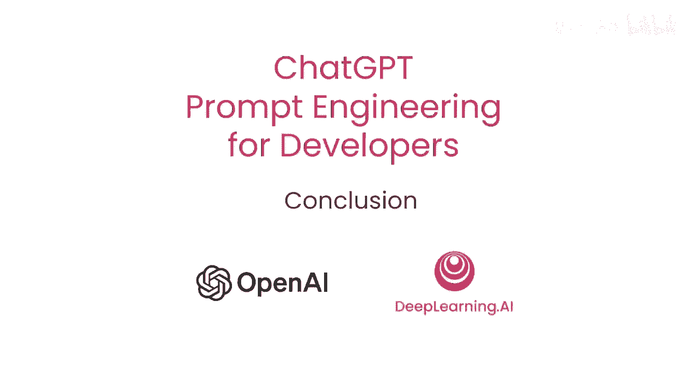
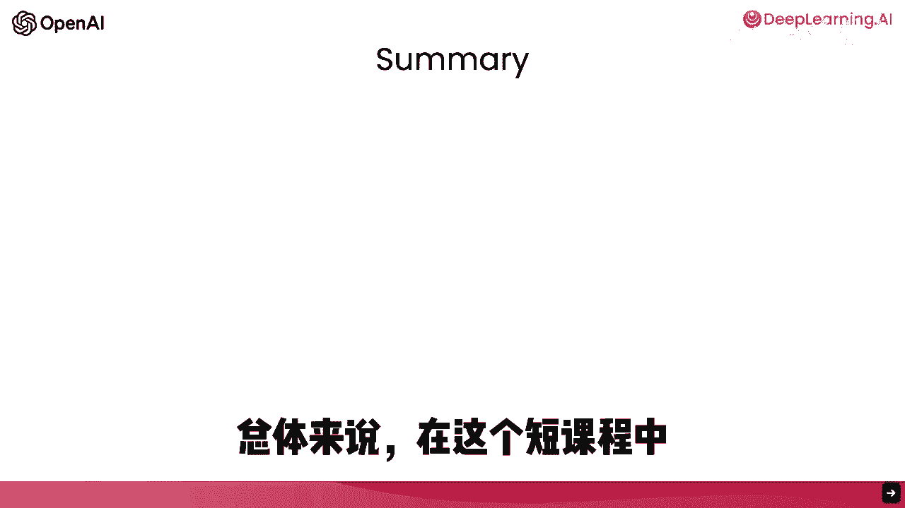
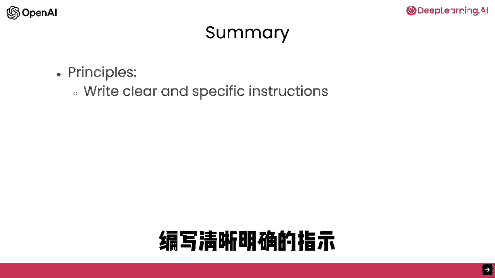
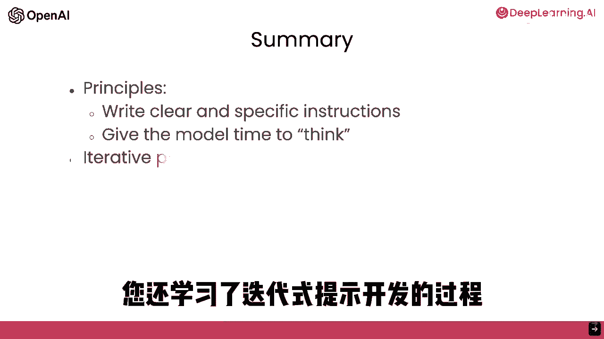
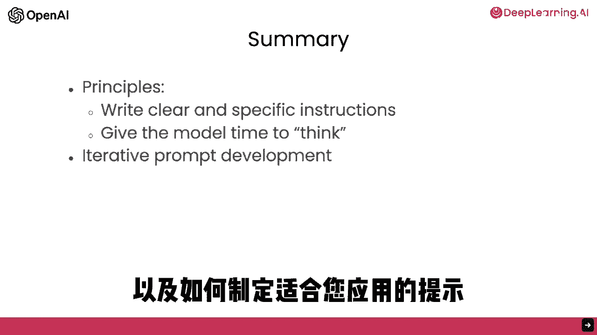
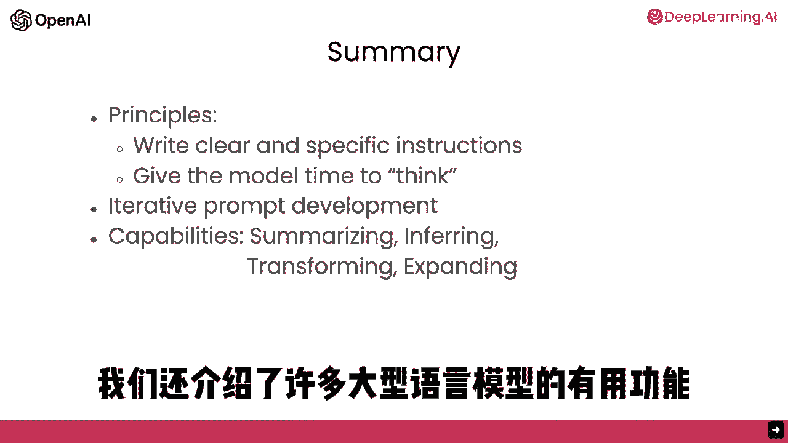
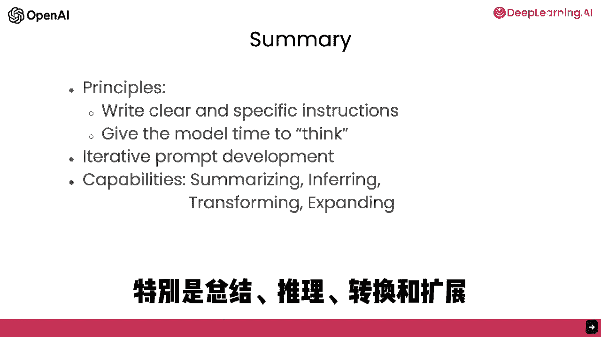

# (超爽中英!) 2024公认最全的【吴恩达大模型LLM】系列教程！附代码_LangChain_微调ChatGPT提示词_RAG模型应用_agent_生成式AI - P18：第9集 总结 - 吴恩达大模型 - BV1gLeueWE5N

恭喜你完成这个简短课程的所有部分，总的来说。

在这个简短的课程中，你学习了关于如何引导的两个关键原则，写清楚和具体的指令。

并且在适当的时候，给模型时间来思考，你还学习了迭代式提示的开发。

以及有一个过程来获取提示的重要性，对于你的应用来说，这是关键的。

然后我们了解了大型语言模型的一些有用能力，适用于许多应用。

特别是总结，推断，变换和扩展。

你也看到了如何构建一个定制的聊天机器人，那太多了，你在短短的课程中就学到了这么多，我希望你享受浏览这些材料，我们希望你能想出一些你可以自己构建的应用程序的想法，请去尝试这个，并让我们知道你的想法。

你提出，没有的应用程序再小也不为过，从你知道的做起，一个稍微小的项目，比如，可能有一点实用性，或者甚至一点用都没有，它就是一件有趣的事情，是的，我发现与这些模型玩耍实际上真的很有趣，所以去玩吧，是的。

我同意这是从经验中寻找的好周末活动，嗯，你知道，请使用你的第一个项目的学习来构建一个更好的第二个项目，你知道，也许甚至一个更好的第三个项目等等。

这就是我如何随着时间的推移使用这些模型自己也有所成长的方式，嗯，或者如果你有一个更大的项目想法，已经，就只管去做，嗯，你知道作为一个提醒，这种大型语言模型是一种非常强大的技术，因此。

可以说我们希望你们负责地使用它们，请只建造会对他人产生积极影响的东西，完全同意，我认为在这个时代，构建人工智能系统的人可以对他人产生巨大的影响，因此。

我们现在比以往任何时候都更需要我们只负责地使用这些工具，嗯，我认为基于大型语言模型的应用程序建设就是一个非常激动人心且正在迅速增长的领域，现在，你已经完成了这门课程，我认为你现在拥有大量的知识。

可以让你建造出，今天很少有人知道如何建造，所以我希望你们也能帮助我们传播这个消息，鼓励他人参加这门课程，最后，我希望你在完成这门课程时过得愉快，我想感谢你完成这门课程。

