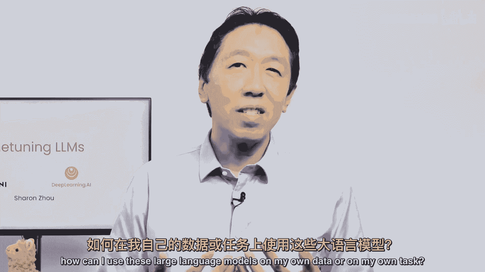
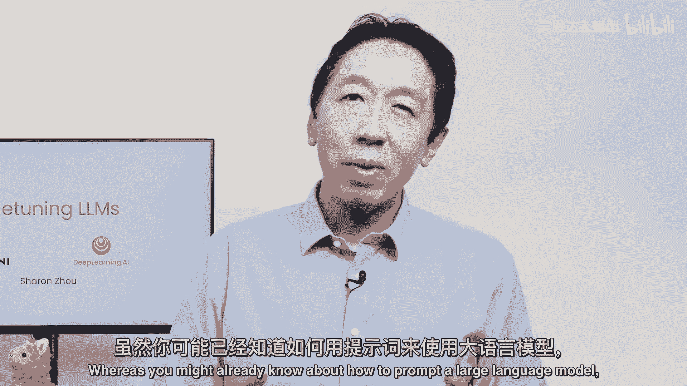
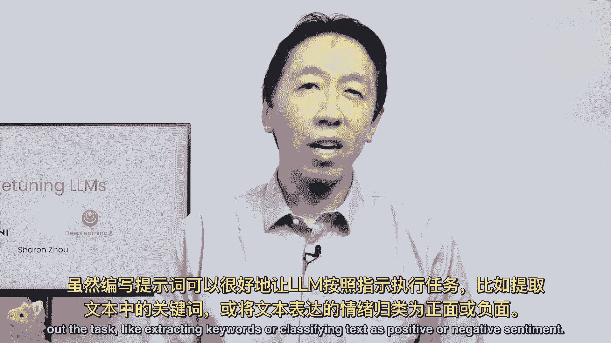
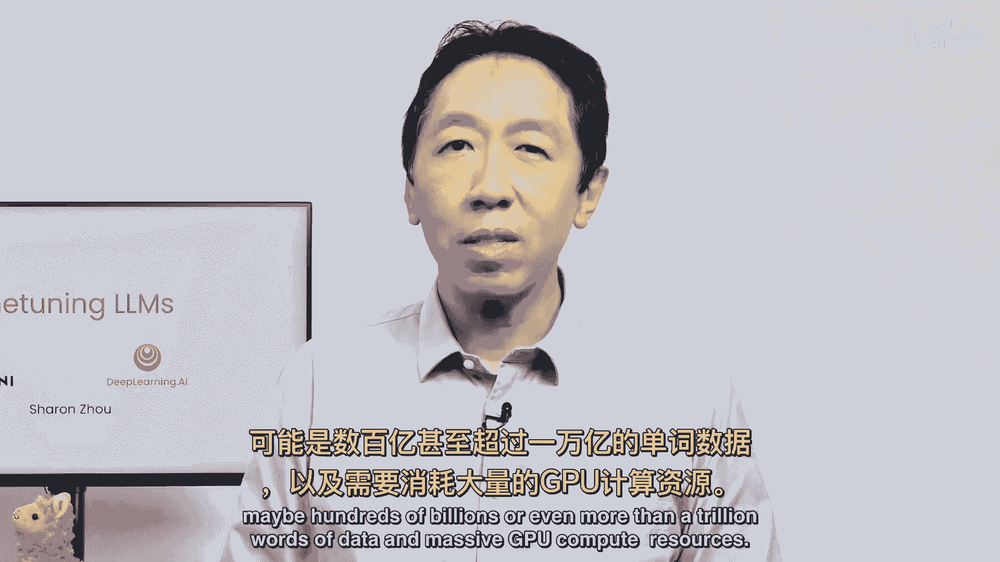
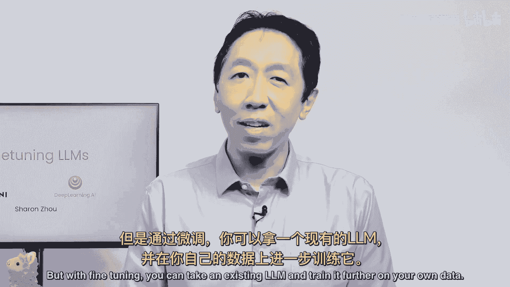
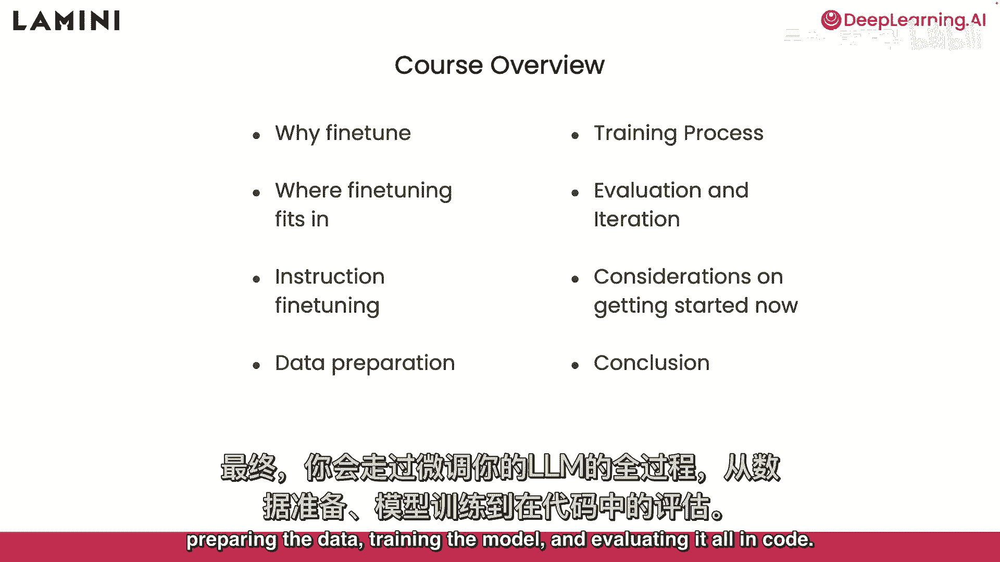
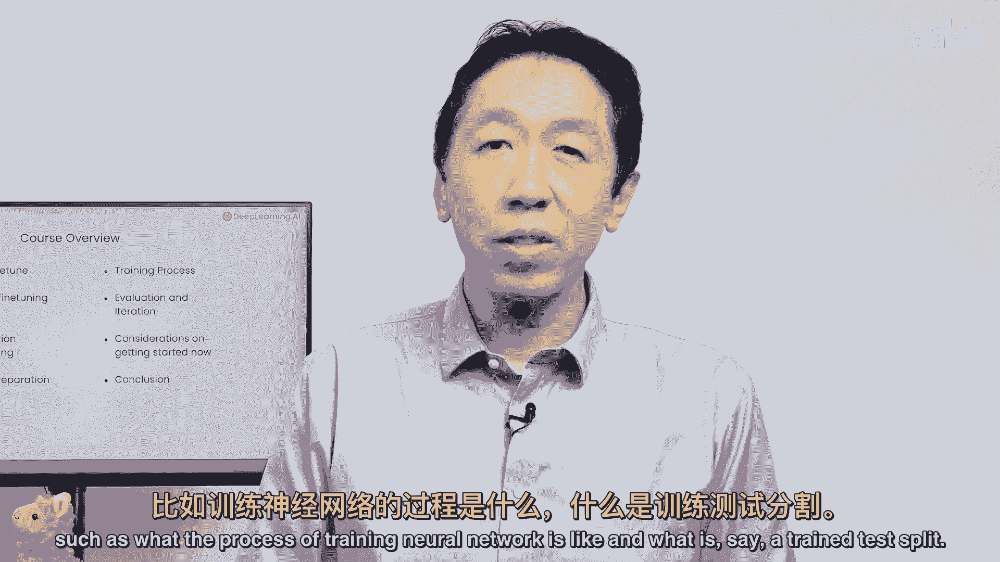
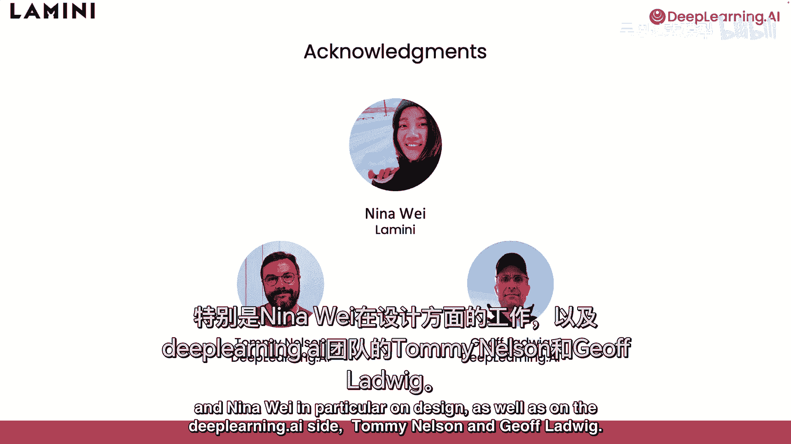

# (超爽中英!) 2024公认最全的【吴恩达大模型LLM】系列教程！附代码_LangChain_微调ChatGPT提示词_RAG模型应用_agent_生成式AI - P1：《大语言模型微调之道》1-介绍 - 吴恩达大模型 - BV1gLeueWE5N

欢迎来到微调，由 Sharon Joe 教的大型语言模型，非常高兴能在这里，当我与不同群体交流时，我经常听到人们问，我怎么能在自己的数据或任务上使用这些大型语言模型。

你可能已经知道如何提示一个大型语言模型。

这门课程将介绍另一个重要工具，专门微调它们，如何进行，例如，一个开源的 lm 并在自己的数据上进行进一步训练，在编写提示时，可以相当好地让 lm 遵循指令，来完成任务。

如提取关键词或将文本分类为积极或消极情感。

如果你微调，你可以让 lm 更加一致地做你想要的事情，我发现提示一个 NLM 可以使其以某种风格说话，如更有帮助或更礼貌，或简洁而非冗长，到一定程度，这也可能很具有挑战性。

微调最终也是好调整 lm 语调的方法，人们现在认识到聊天机器人 GPT 和 other 流行 llms 的惊人能力，可以回答关于广泛主题的问题，但个人和公司希望拥有与他们自己私有和专有数据相同的接口。

一种方法是训练一个 llm 与你的数据，当然，训练基础 lm 需要大量的数据，可能数百亿甚至更多 than 万亿个单词的数据，和巨大的 GPU 计算资源。

但通过微调，你可以对一个现有的 lm 进一步训练你的数据。

所以在这门课程中，你将学习微调是什么，它可能在你的应用程序中有哪些帮助，微调如何融入训练，它与提示工程或检索有何不同，增强生成单独，以及如何将这些技术与微调结合使用，你将深入研究一种特定的微调变体。

使得 GPT 变得聊天友好，被称为指令微调，它教 llm 遵循指令，最后，你将走过步骤来微调你自己的 llm，准备数据，训练模型，并在代码中评估它，这门课程是为熟悉 Python 的人来说设计的。

但要理解所有代码，它将有助于进一步了解深度学习，如训练过程的知识，例如，"神经网络就像"。

"并且你说什么？"，"一个火车测试集"，"大量的努力已经投入到这门课程中"，我们想要感谢整个lamini团队和nina wei，特别是在设计上，"除了深度学习之外"，"人工智能"。

"汤姆尼森和杰夫·洛迪大约在一个小时后"。

"通过这门短期课程"，你通过微调可以获得对如何构建自己lm更深入的理解，以及使用自己数据的现有lm。