# (超爽中英!) 2024公认最全的【吴恩达大模型LLM】系列教程！附代码_LangChain_微调ChatGPT提示词_RAG模型应用_agent_生成式AI - P21：3. 第二篇 - RAG 指标三元组(RAG Triad of metrics) 中英文字幕 - 吴恩达大模型 - BV1gLeueWE5N

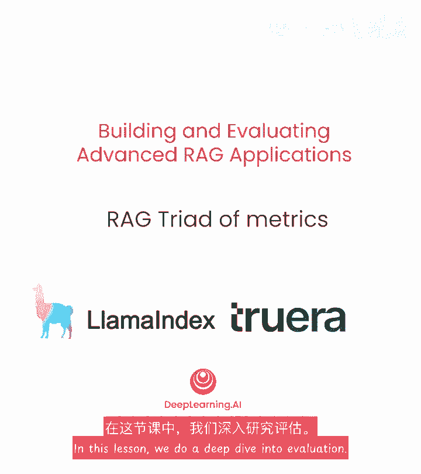

本节课我们将深入探讨评估，我们将带你了解如何评估服务器架设的核心概念，具体来说，我们将介绍三叉戟，用于拉执行三个主要步骤的度量标准，上下文相关性，基于事实的答案无关性，这些是反馈函数可扩展框架的示例。

LLM应用的程序化评估，然后，我们将教你如何合成生成评估数据集，给定任何无结构化语料库，我们现在开始，我将使用笔记本带你走遍三叉戟，答案相关性，上下文相关性和基于事实的答案无关性。

以理解如何使用真正的镜头来检测幻觉。

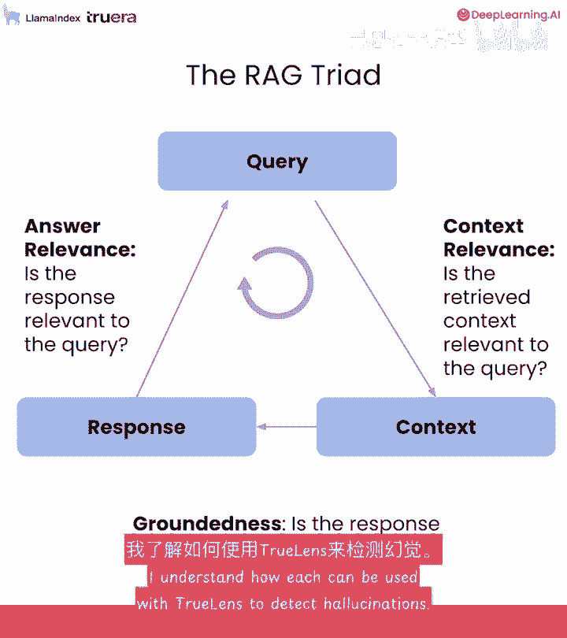

到这个点，你已经安装了真正的镜头和Lama索引。

所以我不会显示那个步骤，对你来说，第一步将是设置OpenAI API密钥，OpenAI密钥用于三叉戟的完成步骤，并使用真正的镜头实施评估，所以，这里有一个代码片段，它正好这样做。

我们现在已经设置好了OpenAI密钥，下一个部分，我将快速回顾使用Lama Index Jerry的查询引擎构建，Jerry已经在第一课中走你走过了，在详细程度上，我们将主要建立在那个课程上，现在。

第一步是设置一个真正的对象，从真正的镜头，我们将导入真正的类，然后，我们将设置一个真正的对象，这个类的一个实例，然后，这个对象将被用于重置数据库，这个数据库将在后来的某个时候用于记录提示，响应。

Llama Index应用程序的中间结果，以及各种评估的结果，我们将使用真正的镜头，现在，让我们设置Lama Index读者，所以，这个代码片段从目录中读取这个PDF文档。

由Andrew Eng编写的关于如何在AI中建立职业生涯的文章，然后，将此数据加载到文档对象中。

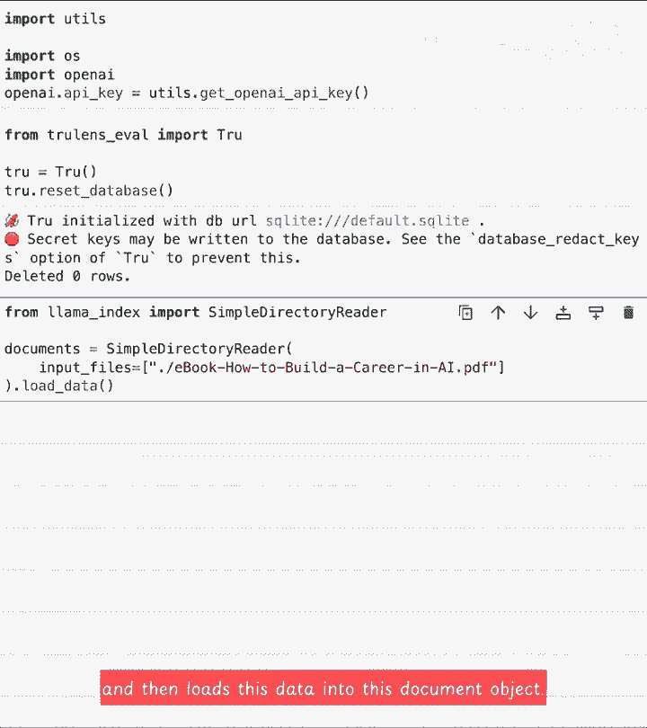

下一步是将所有内容合并为一个大型文档，而不是每个页面都有一个文档，这是默认设置，接下来。

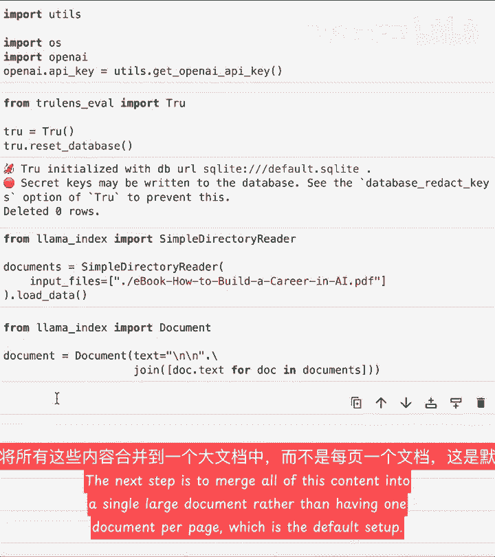

我们设置句子索引，利用Llama Index的一些工具，所以你可以看到这里，我们正在使用OpenAI GPT 3。5 Turbo，设置在零点温度，一个将被用于完成rag的llm。

嵌入模型被设置为bg small和版本一点五，并且所有内容都正在被句子索引对象索引。

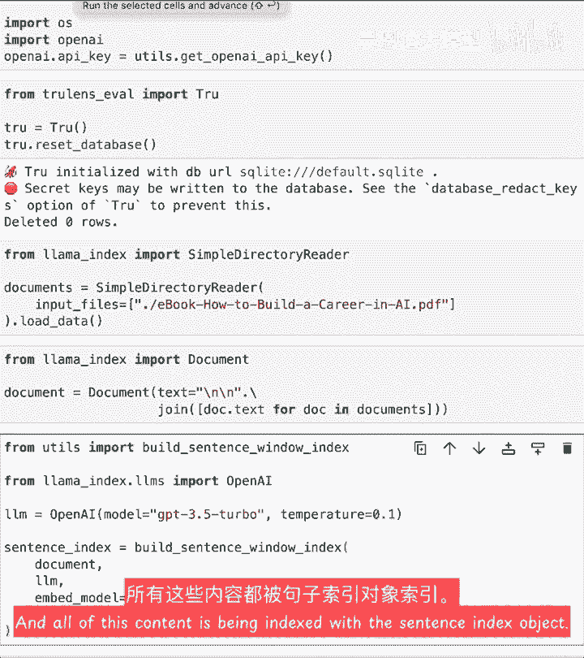

接下来我们设置句子窗口引擎，这是后来将被使用的查询引擎，从高级rag应用中有效地进行检索。

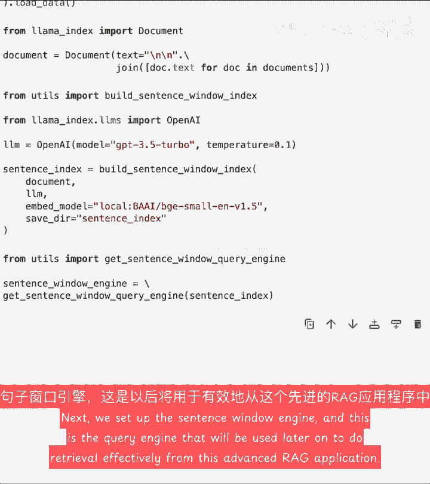

现在我们已经为基于句子窗口的rag设置了查询引擎，让我们通过实际提问来看看效果。

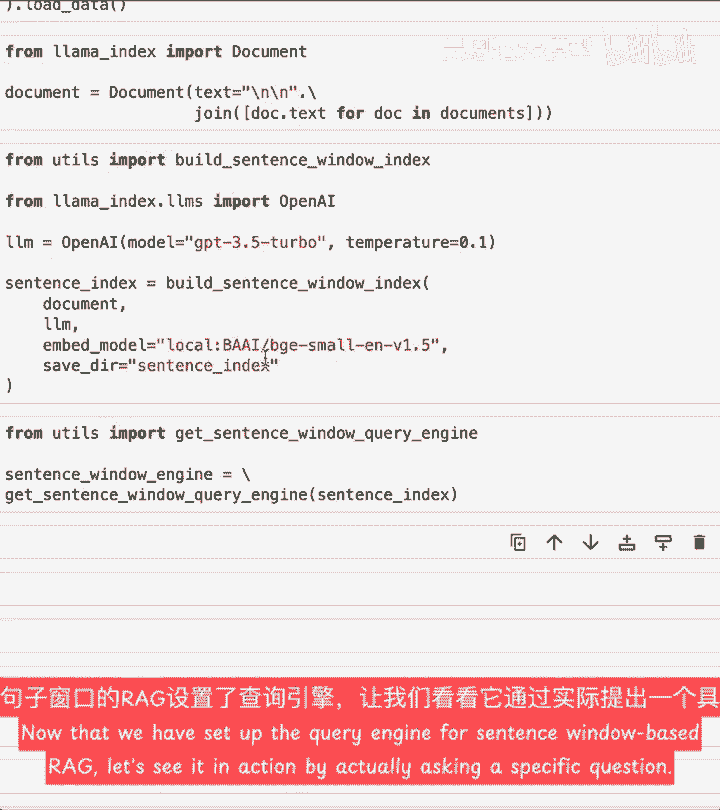

你如何创建你的ai投资组合，这将返回一个包含最终从lla响应的全对象，检索的上下文片段，以及一些额外的元数据。

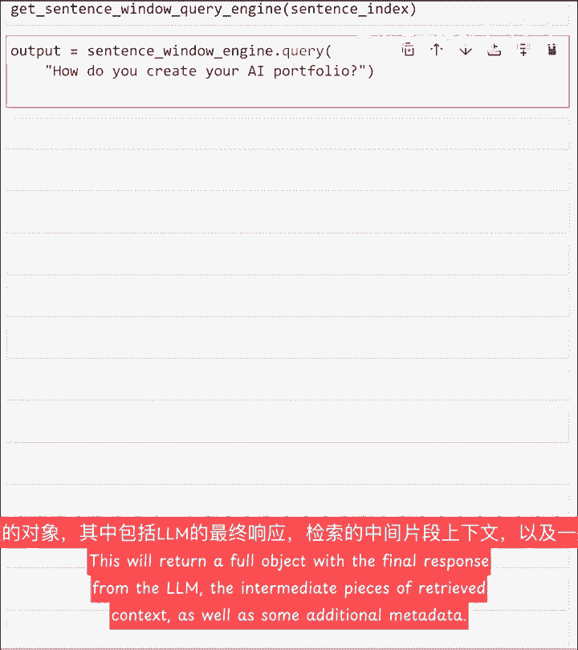

让我们来看看最终响应的样子。

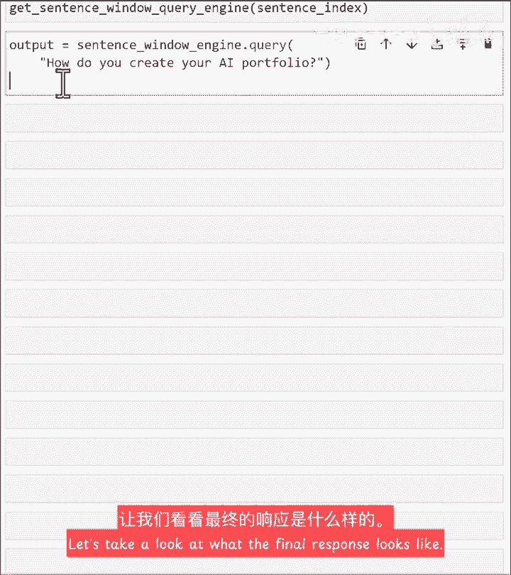

所以这里你可以看到基于句子窗口拖动产生的最终响应，它表面上提供了一个对这个问题'如何创建你的ai投资组合'的相当好的回答，稍后，我们将看到如何将这种形式的答案与rag三叉戟进行比较。

以建立信心并识别rag这种形式的失败模式，现在，我们已经有一个看起来在表面上相当好对这个问题的响应的例子，我们将看到如何利用反馈函数，例如，使用三段式评估这种响应方式，同时识别失败模式。

并建立信心或迭代以改进llm应用。

现在我们已经设置了基于句子窗口的拖放应用，让我们看看如何使用三段式来评估它，在开始之前，我们将做一些清理工作。

第一步是这个代码片段，它让我们从笔记本内部启动流体面板，从笔记本内部查看仪表板，稍后你会看到，这将使用仪表板来查看评估结果的结果，并且进行实验，查看不同的应用选择，并查看哪个在下一个阶段表现更好。

我们初始化为默认提供者openai gpt three point five turbo，以进行我们的评估，这个提供者将被用于实现不同的反馈函数或评估，例如，上下文相关性，答案相关性和锚定性。

现在让我们深入探讨rag triad的每个评估，我们将在幻灯片和笔记本之间来回切换，以便给您提供完整的上下文。

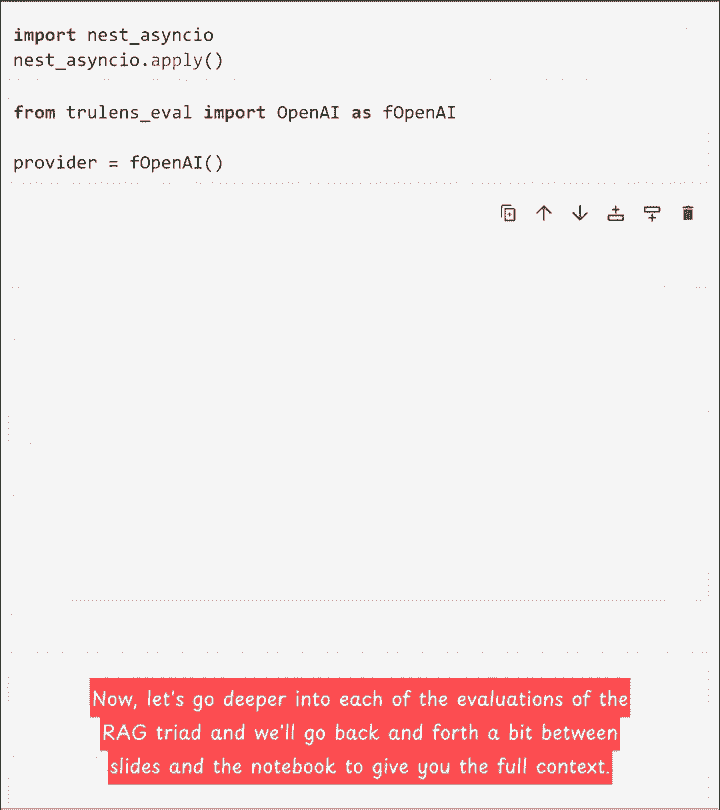

首先，我们将讨论答案的相关性。

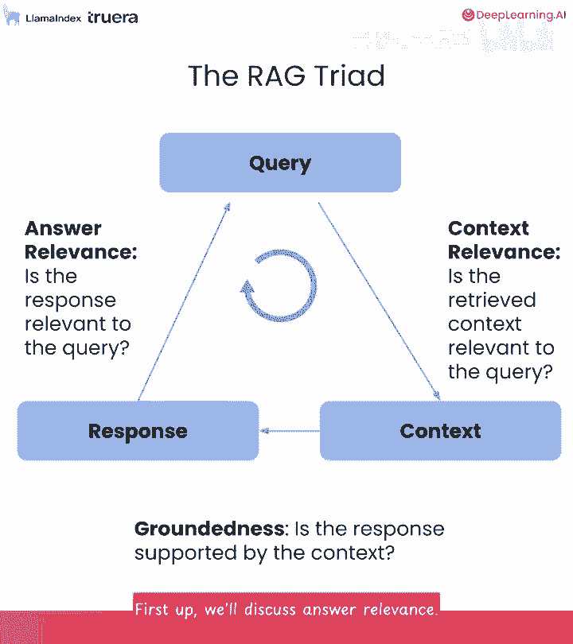

记住，答案的相关性是检查的，是否最终的响应与用户提出的查询相关，为了给您一个关于答案的相关性可能输出的具体例子。

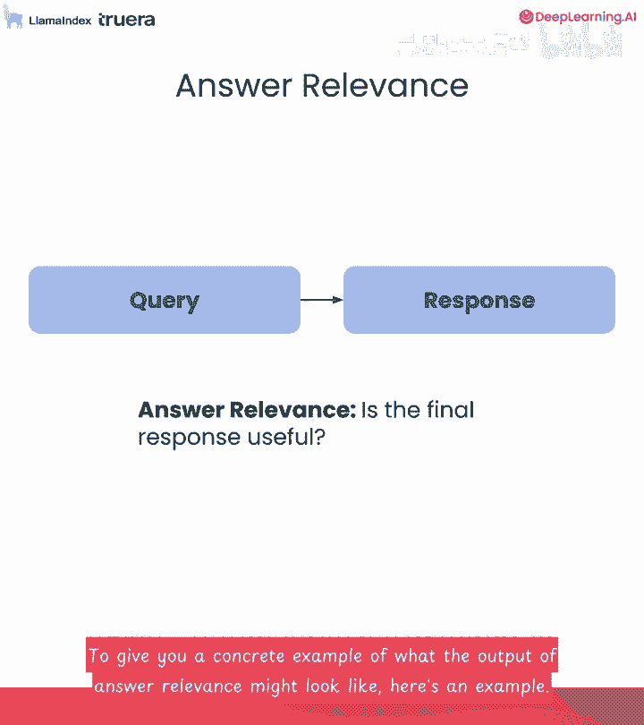

这里是一个例子，用户提出了问题，如何利他主义在构建职业生涯中有益，这是来自申请材料的响应，并答案的相关性评估产生两个输出项，一个是在0到1的尺度上的得分，答案被评估为高度相关，因此它得到了0。9的分数。

第二部分是支持证据或理由，或者是产生这个评分的思考链，所以这里你可以看到，答案本身中找到的支持证据，这表明alammi评估认为它是有意义和相关的答案，我还想利用这个机会来介绍反馈函数的抽象。

答案相关性是反馈函数的一个具体例子，更一般地说，反馈函数提供了一个0到1的分数，在审查llm应用的输入、输出和中间结果后，让我们现在来看看反馈函数的结构。

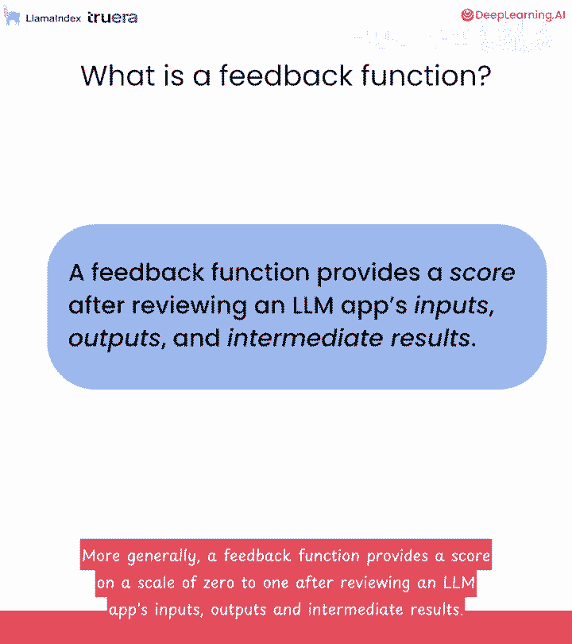

使用答案相关性反馈函数作为具体例子，第一个组件是提供者，在这个情况下，我们可以看到，我们正在使用openai的llm来实施这些反馈函数，请注意，反馈函数不一定必须使用llm。

我们也可以使用bert模型和其他类型的机制来实施反馈函数，我会在后面的课堂上详细讨论这一点，第二个组件是利用那个提供者，我们将实现一个反馈函数，在这个情况下，那就是相关性反馈函数，我们给它一个名字。

一个人类可读的名字，将在我们的评估仪表板中显示，对于这个特定的反馈函数，我们运行它于用户输入，用户查询，并且它也接受输入，最终的输出或响应来自应用，所以，给定用户问题和rag的最终答案。

这个反馈函数将使用llm提供者，如openai gpt 3。5，来计算对问题的响应的相关性得分，此外，它还将提供支持证据或思考链的论证，以证明那个得分。

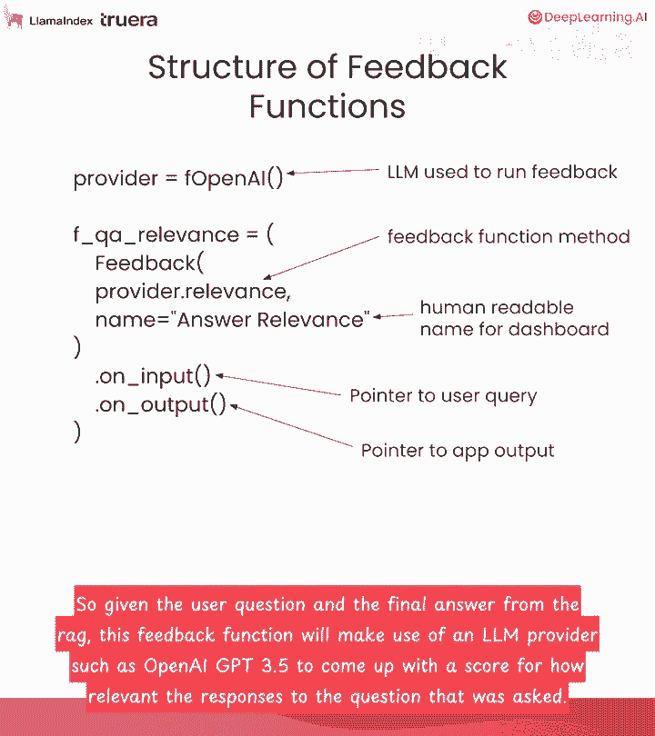

现在，让我们回到笔记本，看看代码的详细情况，现在，让我们看看如何在代码中定义问题答案相关性反馈函数。

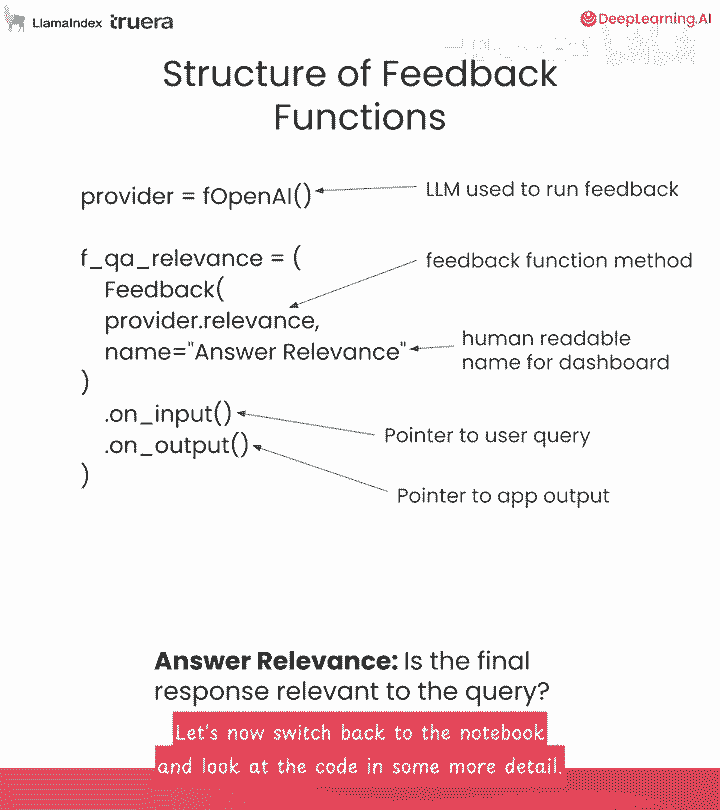

现在，让我们看看如何从true和well定义问题答案相关性反馈函数在代码中，我们将导入反馈类，然后，我们设置问题答案相关性反馈函数的不同部分，我们已经在讨论中设置。

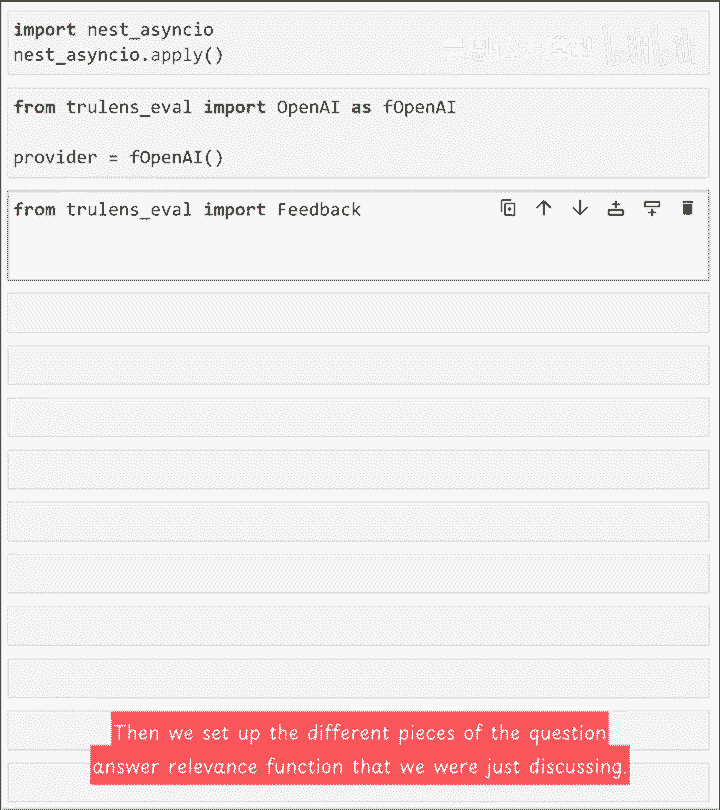

首先，我们有提供者，它是openai gpt 3。5，我们设置这个特定的反馈函数，其中，相关得分也将增强思考链论证，就像我在幻灯片中所示的，我们给这个反馈函数一个人类可理解的名字，我们叫它答案元素。

这将在仪表板中显示，使用户能够理解反馈函数正在设置的内容，然后，我们也将反馈函数赋予输入访问权，那就是提示，以及输出，在这个设置下，rag应用产生的最终响应是什么。

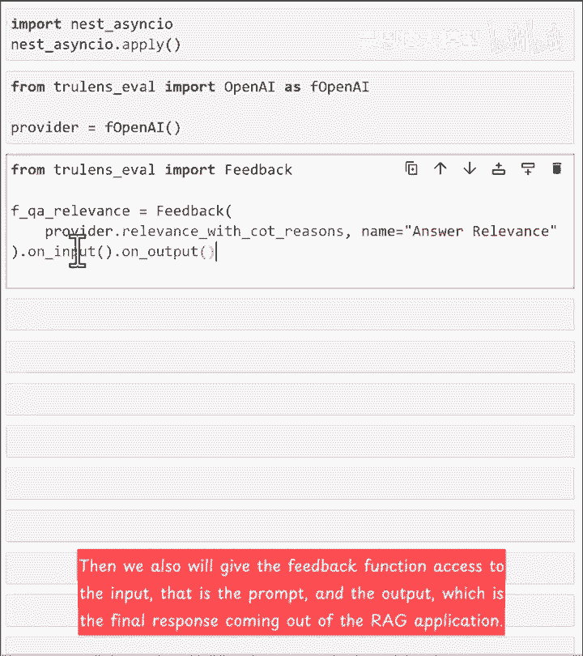

在笔记本的后面，我们将看到如何将这个反馈函数应用到一组记录上，获取与答案相关的评估分数，以及为那个特定答案提供链式思考理由，那是在评估中被判断为适当的分数。

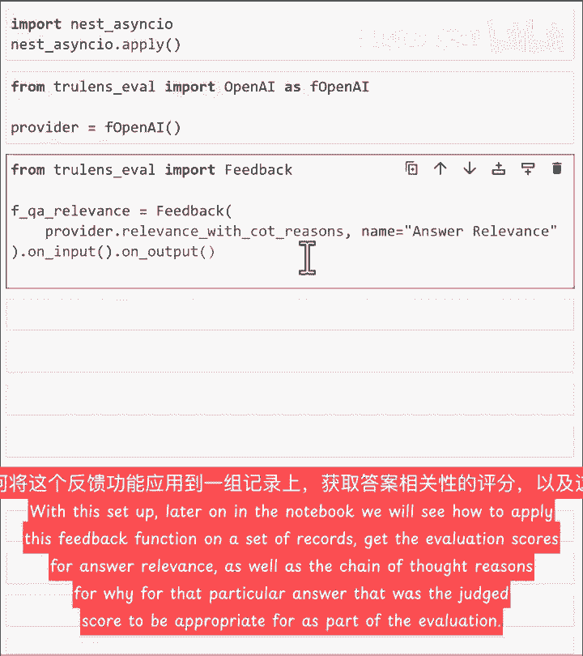

接下来我们将深入探讨的下一个反馈函数是上下文相关性，记得上下文相关性是检查的，给定查询的检索过程有多好，我们将从向量数据库中查看每片检索的上下文，并评估这块上下文与所问问题的相关性如何。

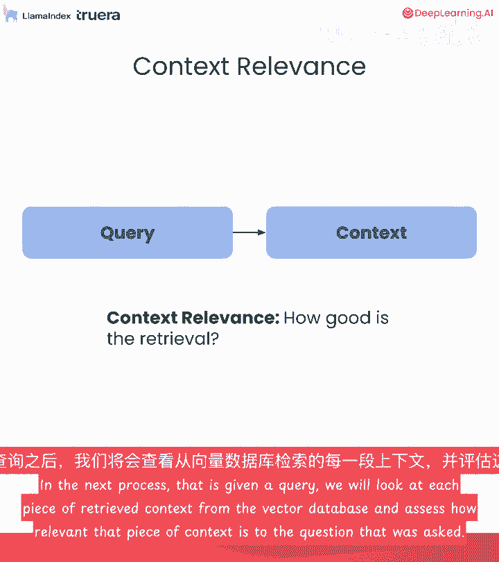

让我们看一个简单的例子，用户提示中的问题在这里是，如何在职业生涯中受益于利他主义，这是检索到的两片上下文，在评估上下文相关性后，这些片检索的上下文 each 都会得到一个介于零和一的分数。

你可以在这里看到，左边的上下文获得了相关性得分为零点五，右边的上下文获得了相关性得分为零点七，因此，它被评估为与这个特定查询更相关，然后，平均上下文，相关性得分。

是这些检索的上下文片段相关性得分的平均值，也得到了报告，现在让我们看看反馈函数对于上下文相关性的结构，这个结构的各种部分与答案元素的结构相似，我们几分钟前就审查过了。

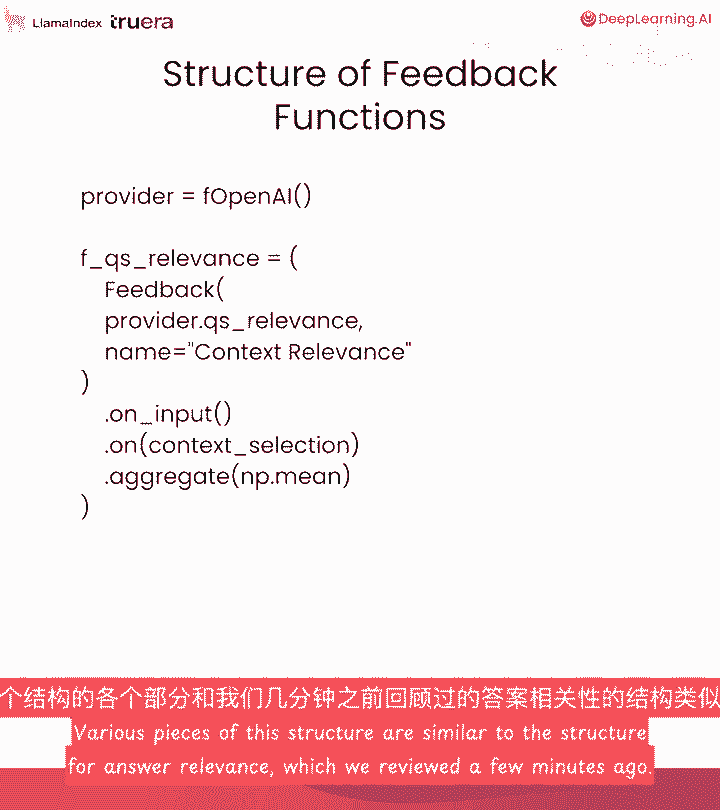

有一个提供者是open ai，并且反馈功能是利用那个提供者来实现上下文相关性反馈功能的，与这个特定反馈函数输入的不同之处在于，除了用户输入或提示之外，我们还将这个反馈函数分享，一个指向检索上下文的指针。

那就是在rag应用执行过程中的中间结果，我们为每个检索的上下文片段返回一个分数，评估这个上下文与被询问的查询的相关性或质量如何，然后，我们将这些分数聚合并平均所有检索的上下文片段，以获取最终分数。

你现在会发现，在答案相关性反馈函数中，我们只使用了原始输入，在这个反馈函数中，提示和rag的最终响应，我们正在使用用户输入或提示以及中间结果，检索上下文集，为了评估这两个例子之间的检索质量。

反馈函数的全部力量通过使用输入得以利用，通过评估rag的应用程序的输出和中间结果来评估其质量。

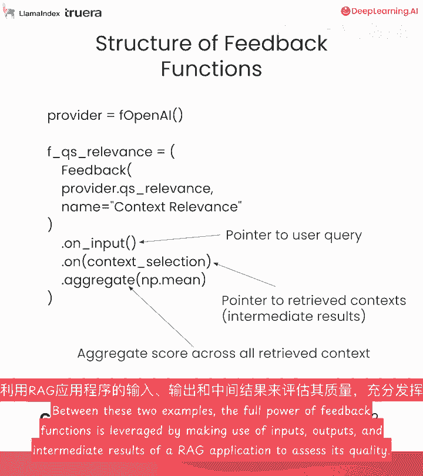

现在我们已经设置了上下文选择，我们有条件在代码中定义上下文相关性反馈函数，你会发现这基本上是我走过并解释的代码片段。

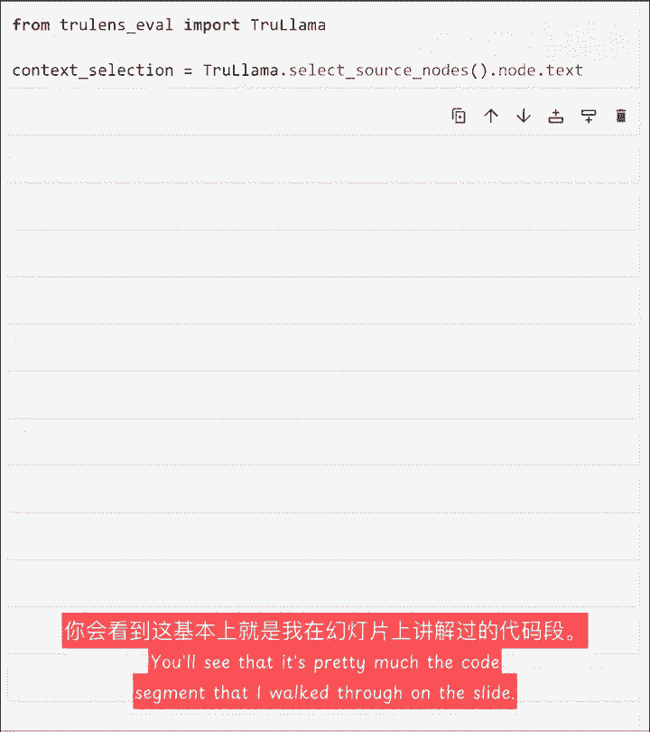

在幻灯片上，我们仍然在使用openai，作为提供者，Gpt三点五作为评估llm，我们正在调用问题陈述或上下文相关性反馈函数，它获取输入提示，一组检索到的上下文片段。

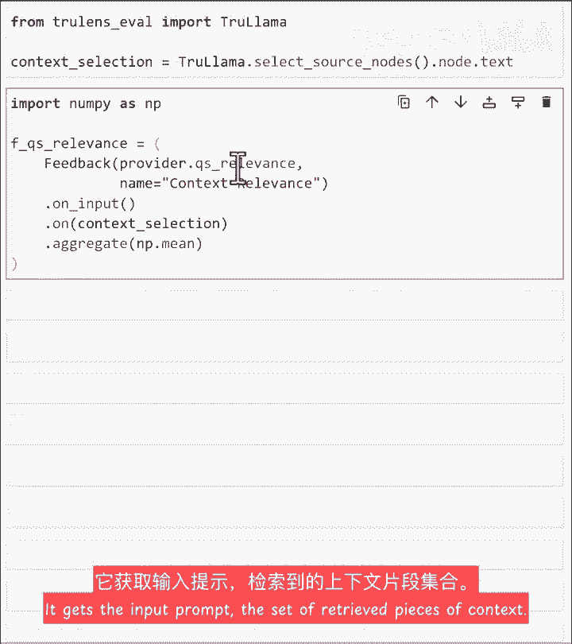

它对每个检索到的上下文片段运行评估函数，单独，为它们每个人获取一个得分，然后，将它们平均起来，以报告一个最终的聚合得分。现在，还有一个你可以使用的变体，如果你喜欢。

除了为每个检索的上下文报告相关的得分外，你还可以增强它以链式思考推理，这样，评估的llm不仅可以提供得分，还可以提供对其评估得分的论证或解释，这可以通过使用u s相关性和链式思考推理方法实现，推理方法。

如果我给你一个具体的例子，你可以在这里看到问题或用户提示，你可以看到，这是一个问题或用户提示，如何利他主义在构建职业生涯中受益。

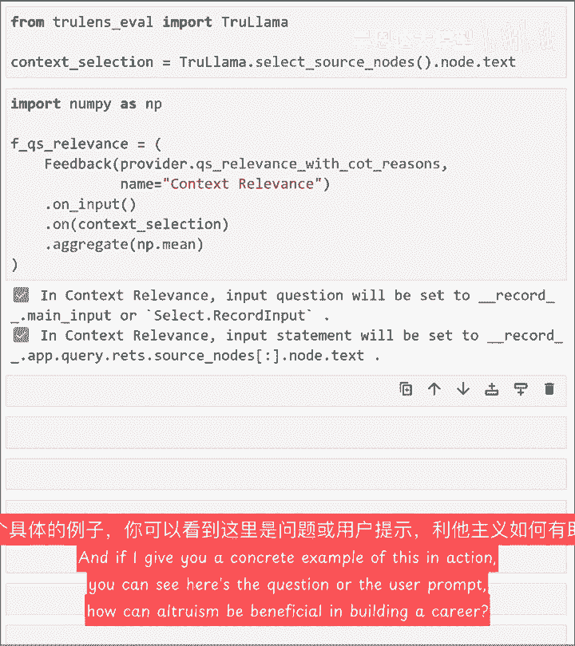

这是检索到的上下文片段的一个例子，并从安德鲁关于这个话题的文章中删除一段，你可以看到上下文相关性反馈函数给出了一个得分为0。7，以0到1的尺度来评估这个检索到的上下文片段。

因为我们还在评估中引用了链式思考推理，它提供了这个得分为0。7的论证，现在让我为您展示设置上下文相关性反馈函数的代码片段，我们以与前一个反馈函数相同的方式启动它，利用llm提供者为评估，如果你记得。

这就是'打开'的意思，AI GPT 3。5。

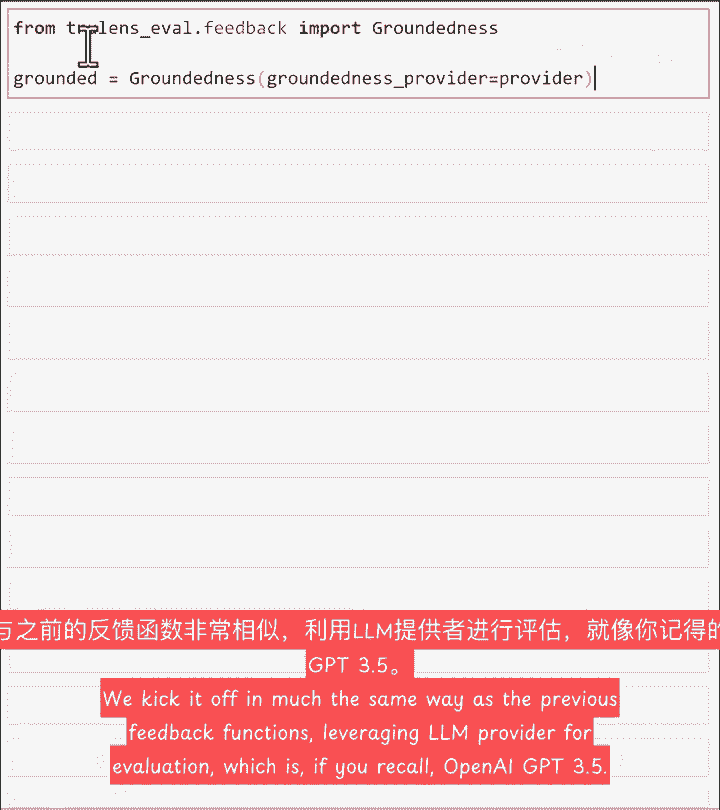

然后，我们定义了基于的反馈函数，这个定义结构上非常类似于上下文相关性的定义。

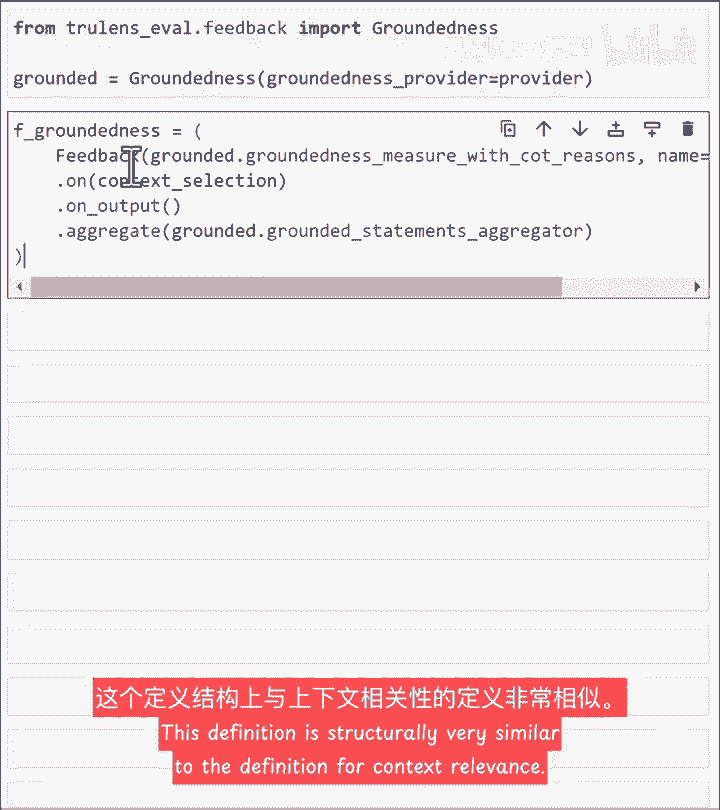

基于的度量带有链式思考理由。

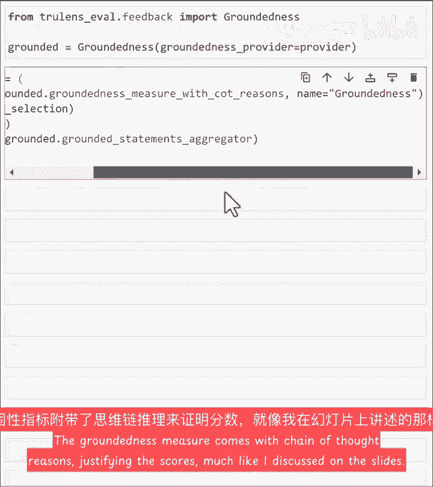

解释分数，就像我在幻灯片上讨论的那样，我们给它起了名字叫做基于的，这是很容易理解的。

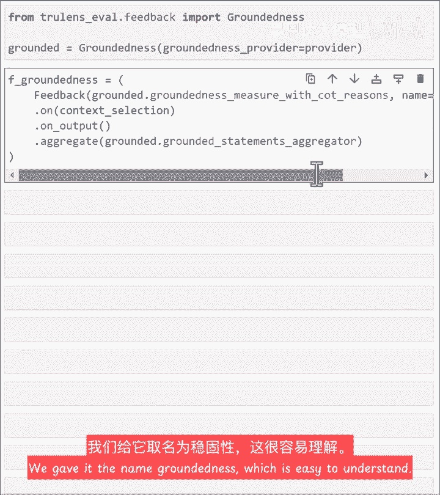

并且它获得了RAG应用程序检索的上下文集的访问权，与上下文相关性和最终输出或回应的rag类似，然后，最终回应中的每一句都得到一个基于分数的锚定，这些被聚合平均，以产生对完整回应的最终锚定测试分数。

在这里的语境选择，是与设置语境相关性反馈函数时使用的相同语境选择。

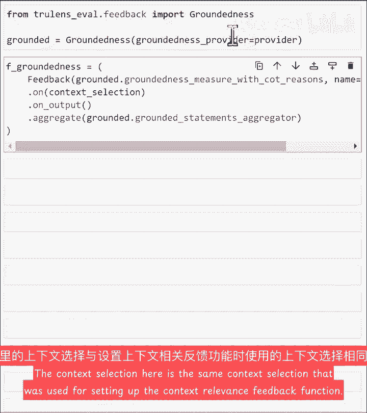

如果你记得，仅仅从rag的检索步骤中获取一组检索到的上下文片段，然后可以访问该列表中的每个节点，从该节点中恢复上下文的文本，然后继续处理那个，同时进行上下文相关性和锚定性评估。

我们现在已经准备好开始执行拉格应用评估。

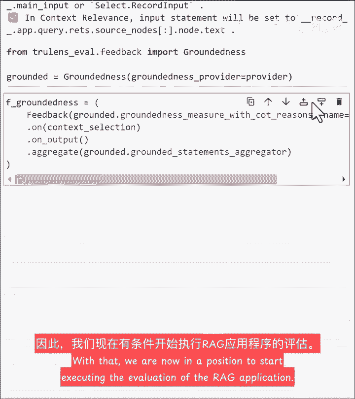

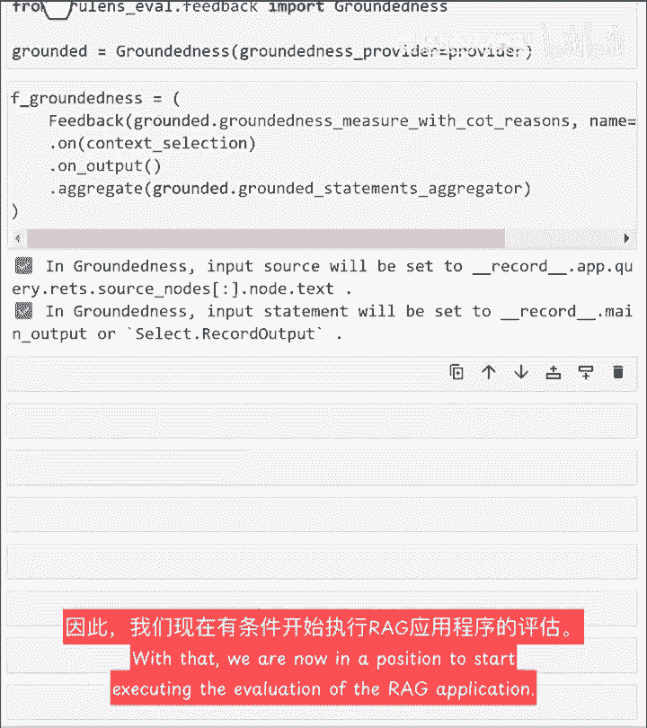

我们已经设置了所有三个反馈函数，答案相关性，上下文相关性和锚定性，我们所需的只是一个可以进行应用和评价的评估集，并查看它们的表现，并如果存在迭代和进一步改进的机会，让我们现在来看看评估和迭代的工作流程。

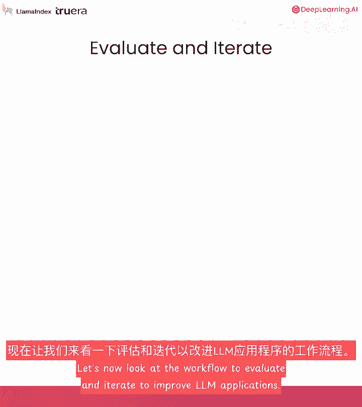

以改进llm应用，我们将从之前课程中引入的基本拉格 llama index 开始，我们已经已经使用真镜头拉格三叉戟对其进行了评估。

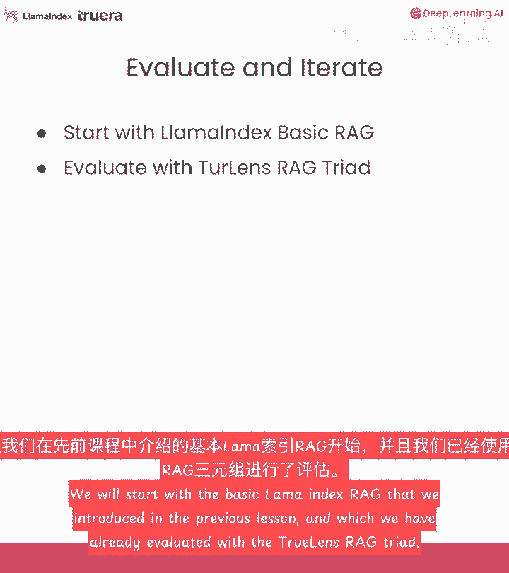

我们将稍微关注与上下文大小相关的失败模式，然后，我们将迭代这个基本拉格使用高级拖放技术，下一个是 llama index 句子窗口拉格，我们将重新评估这个新的先进拖放与真镜头拉格三叉戟，专注于这些问题。

我们是否在特定上下文中看到改进。

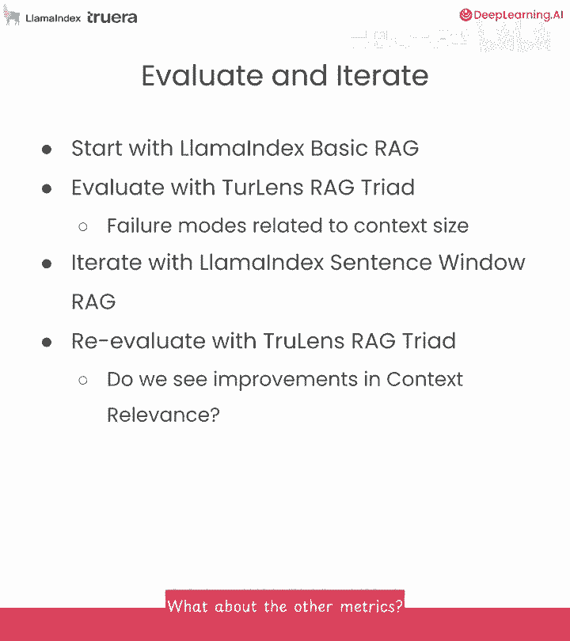

其他指标如何，我们专注于上下文相关性，是因为常常会出现失败模式，因为上下文太小，一旦你增加到某个点，你可能看到上下文相关性的改进，此外，当上下文相关性提高时，我们常常发现锚定性也有所提高。

因为在完成步骤中，llm有足够的相关上下文来产生总结，如果没有足够的相关上下文，它倾向于利用其内部知识从预训练数据集中，来尝试填补这些空白，这导致锚定性的丧失，最后，我们将尝试不同窗口大小。

以找出哪种窗口大小产生最佳评估指标，记住，如果窗口大小太小，可能没有足够的相关上下文来获得好的上下文相关性和锚定性得分，如果窗口大小变得太大，另一方面，不相关的上下文可能会渗入最终响应。

导致在锚定性或答案元素方面的不高分。

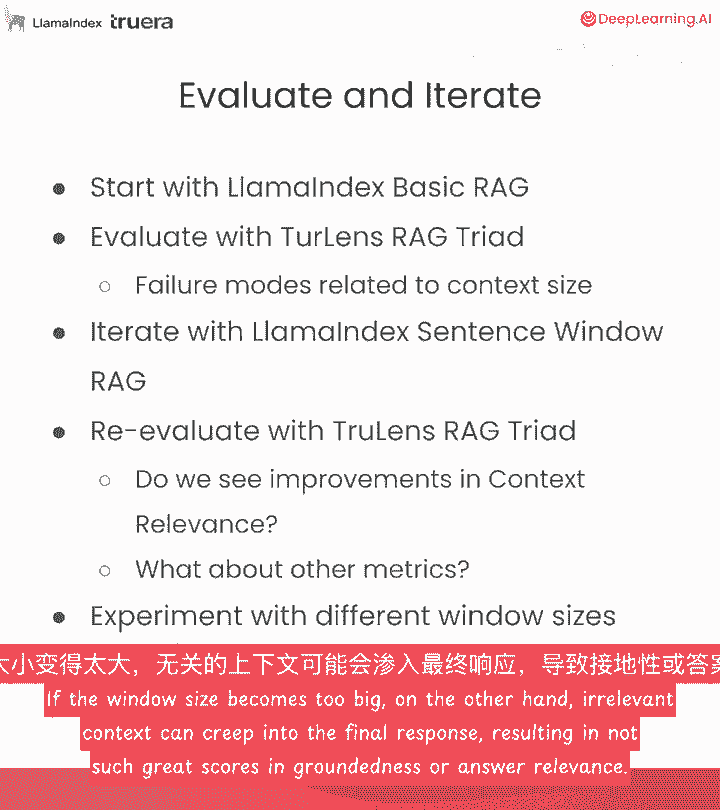

我们已经走过了三个评估或反馈函数的例子，上下文相关性和相关性与锚定性在我们的笔记本中，所有 three 都是使用 llm 评估实现的，我想指出，反馈函数可以以不同的方式实现。

我们常常看到实践者从真实事件开始，这可能是昂贵的来收集，但仍然是一个良好的起点，我们还看到人们利用人类来做评估，这也是有帮助和有意义的，但在实践中，真实事件难以扩展，只是为了给你一个具体的例子。

想象一个摘要用例，当有大段文本时，然后llm生成一个摘要，人类专家将给这个摘要打分，指示其质量如何，这也可以用于其他用例，如聊天机器人或甚至分类用例，人类的恶行在某些方面与事实类似。

就像当llm产生输出时，或应用产生输出时，那个应用的人类用户将对那个输出进行评分，它多好，与真实事件相比，这是因为，这些人类用户可能不像产生精心编辑的真实事件的那些人那样专家，在主题上，尽管如此。

这是一个非常有意义的评估，它将比真实值规模更大，但我们对它的信心程度较低，从研究文献中得出的一个非常有趣的结果是，如果你问一组人类对一个问题进行评分，大约有八十 percent 的协议，有趣的是。

当你使用 for 评估时，法律评估与人类评估之间的协议也大约是八十二十，五 percent 标记，因此，这表明 llm 评估与人类评估相当，对于它们已被应用的基准数据集。

所以反馈函数为我们提供了一种程序化方式，以便扩大评估。

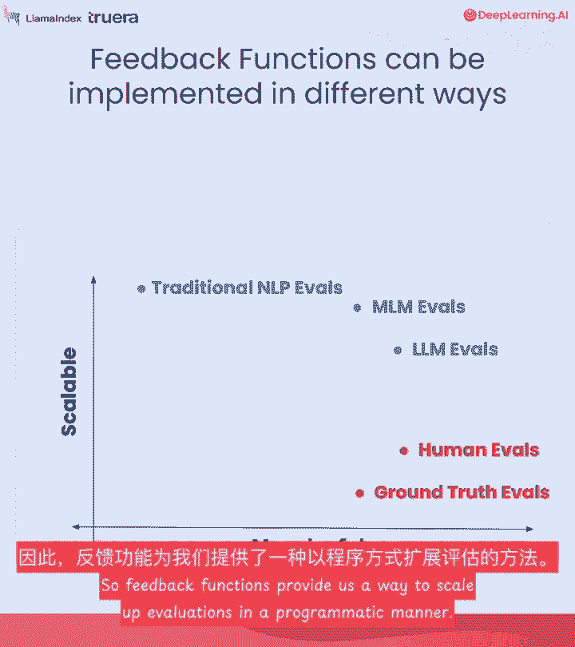

除了您看到的 lm 阀，反馈函数还提供，我们可以实现传统的自然语言处理指标，如Rouche分数和Blue分数。

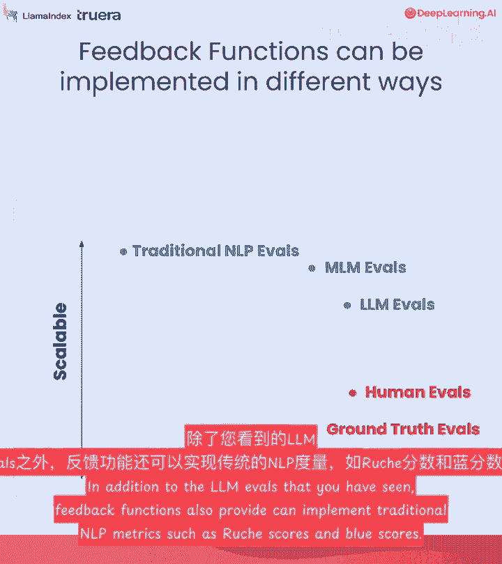

它们在某些情况下可能会有所帮助，但它们有一个弱点，那就是它们非常语法化，它们寻找两个文本片段中单词的重叠。

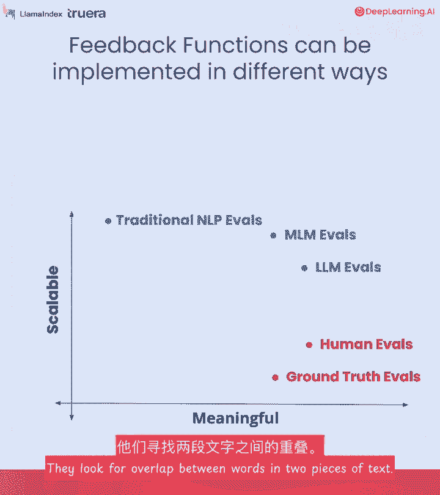

例如，如果你有一个倾向于河岸的文本片段，而另一个倾向于金融银行，从语法上看，它们可能会被视为相似，这些引用可能会被传统自然语言处理评估视为相似的引用，而，周围的上下文将被用于提供更有意义的评估。

当你在使用像gpt这样的大规模语言模型时，四，或者是像bird模型这样的中型语言模型时，并且要进行你的评估时。

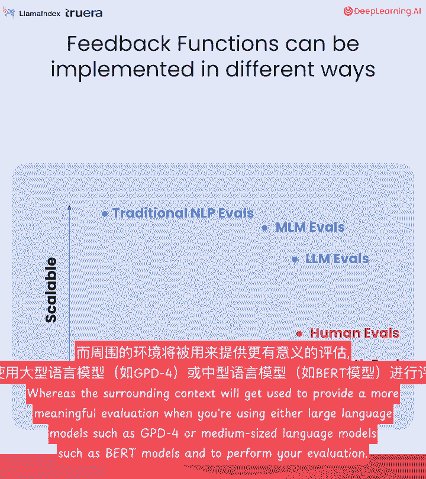

在本课程中我们已经给了你三个反馈函数和评价的例子，不相关性，上下文，相关性和基于上下文的真实性，真实的镜头提供了一个更广泛的评价集，以确保你构建的应用程序诚实。

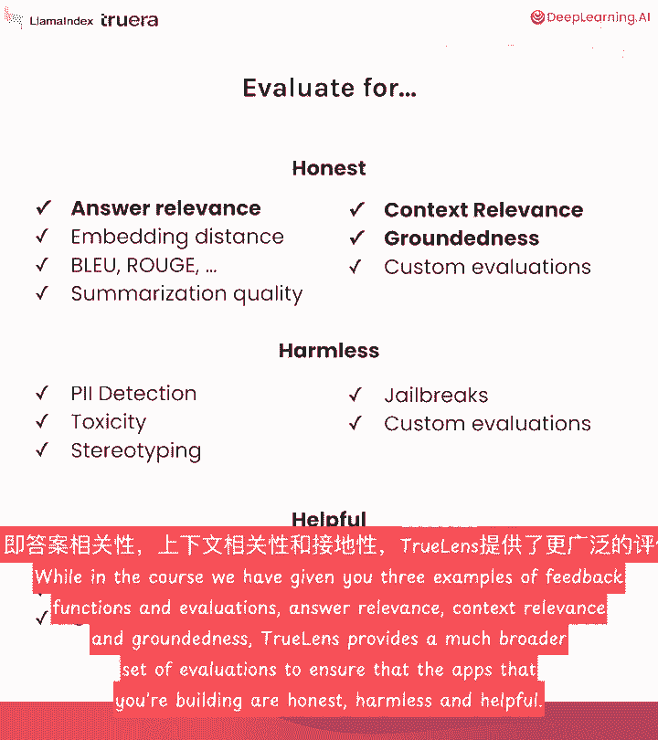

无害且有益，所有这些都在开源库中可用，我们鼓励你尝试它们，在你完成课程并构建你的llm应用程序时。

现在我们已经设置了所有反馈功能，我们可以设置一个对象来开始记录。

它将用于记录在各种记录上的应用程序执行。

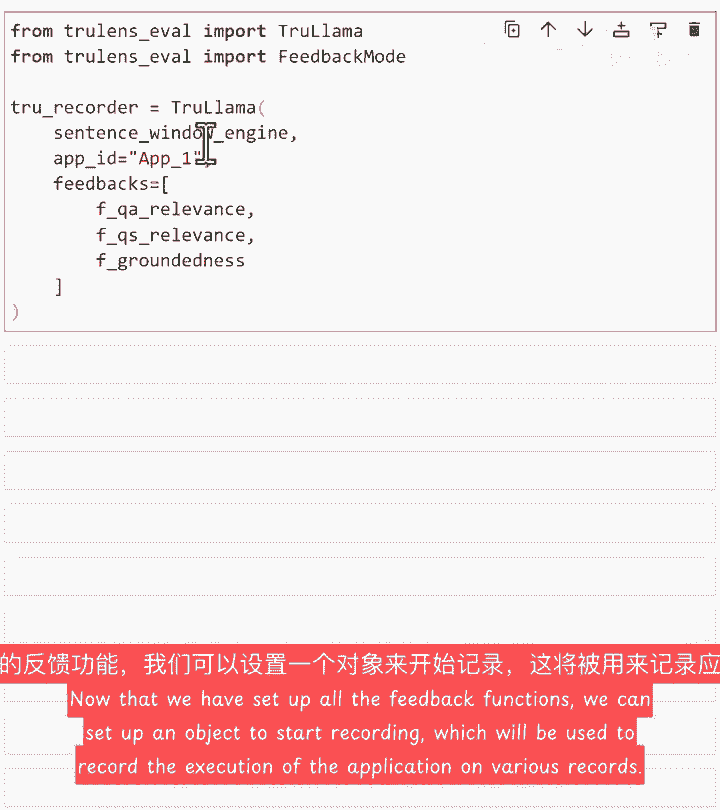

在这里，我们可以看到正在导入这个真lama类，创建了这个真recorder对象，这个真lama类的对象，这是我们的真lens与lama index的集成。

它接受了我们从lama index earlier创建的句子窗口引擎，设置应用程序ID，并使用我们 earlier 创造的 rag triad 的三个反馈函数。

这个真recorder对象将在稍后用于运行lama index应用程序，以及这些反馈函数的评估，并将所有记录保存在本地数据库中。

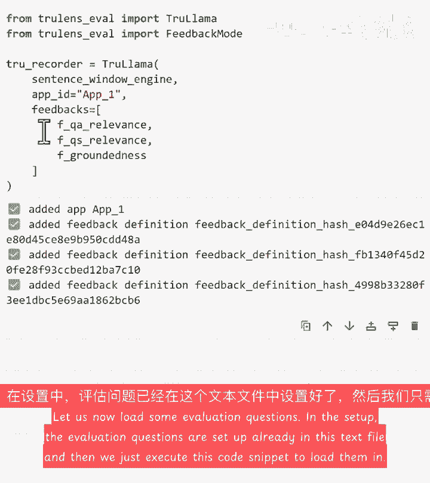

现在让我们在这个设置中加载一些评估问题，评估问题已经在这个文本文件中设置好了，然后我们只需执行这个代码片段来加载它们。

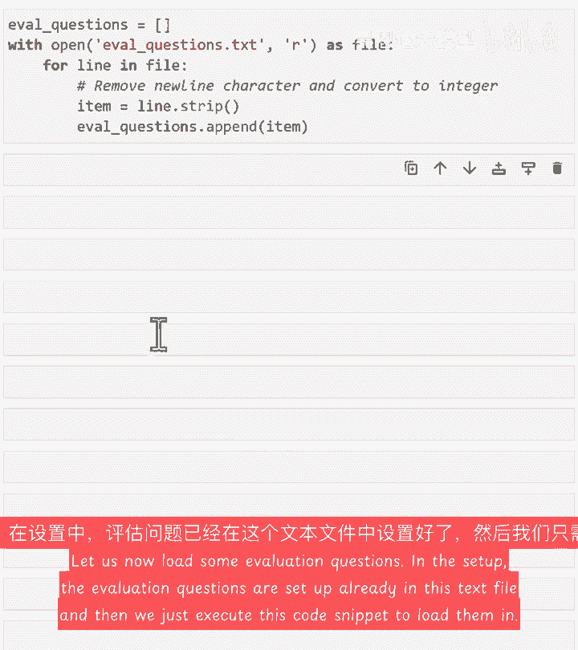

让我们快速看一下我们将用于评价的这些问题。

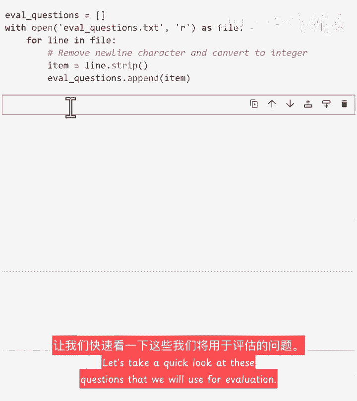

可以看到构建人工智能职业生涯的关键是什么等，这个文件，你可以自己编辑并添加你可能想要得到答案的问题，Andrew，你也可以直接向问题列表添加问题，让我们看看val questions列表。

你可以看到这个问题已经被添加到末尾，去添加你自己的问题，现在，我们已准备好进入这个笔记本中最激动人心的一步，用这个代码片段，我们可以在每个问题上执行句子窗口引擎，我们在刚刚看过的eval问题列表中。

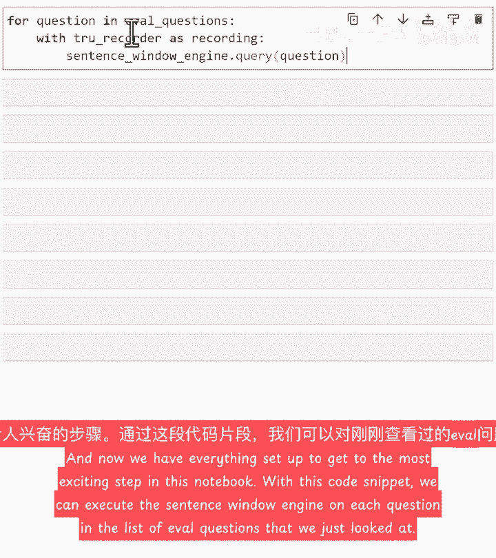

然后使用真recorder，我们将每个记录与rag triad进行比较，我们将记录提示，响应，中间结果和评估结果在真数据库中。

你可以在这里看到，每当。

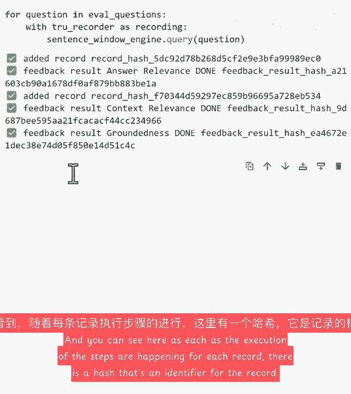

对于每个记录的步骤执行完成时，都有一个对于记录的哈希，未知，当记录被添加时，这里有一个指示，表明那个步骤执行有效，此外，答案相关性的反馈已经完成，等等，对于上下文相关性等等，现在，我们完成了记录。

我们可以在笔记本中查看日志，通过执行，通过获取记录和反馈，并且执行这段代码。

片段，我并不希望你一定要阅读这里所有的信息。

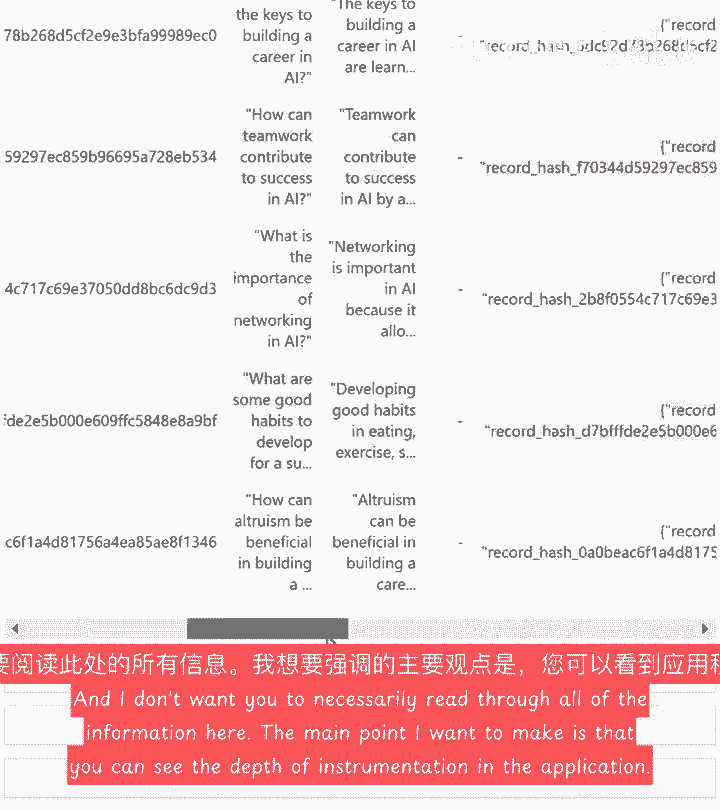

我想强调的主要点是，你可以看到应用程序的深度仪器化。

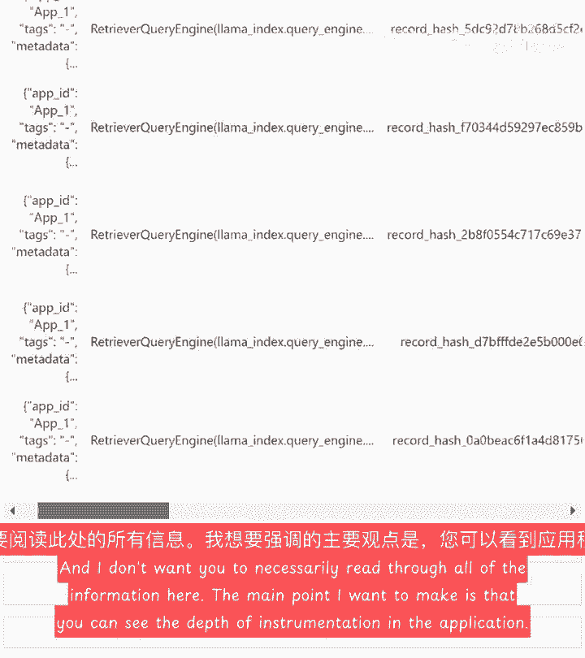

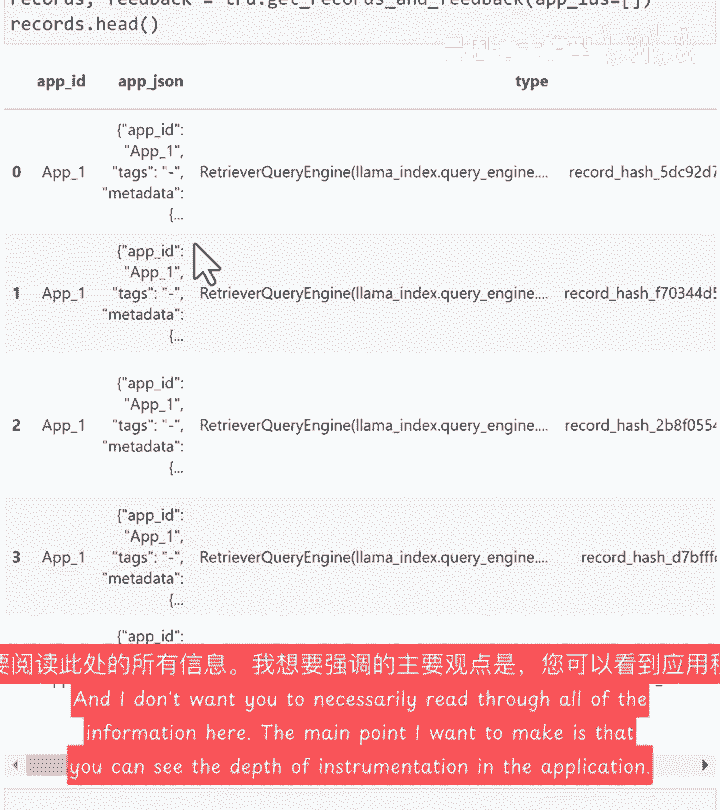

大量的信息通过真记录器被日志。

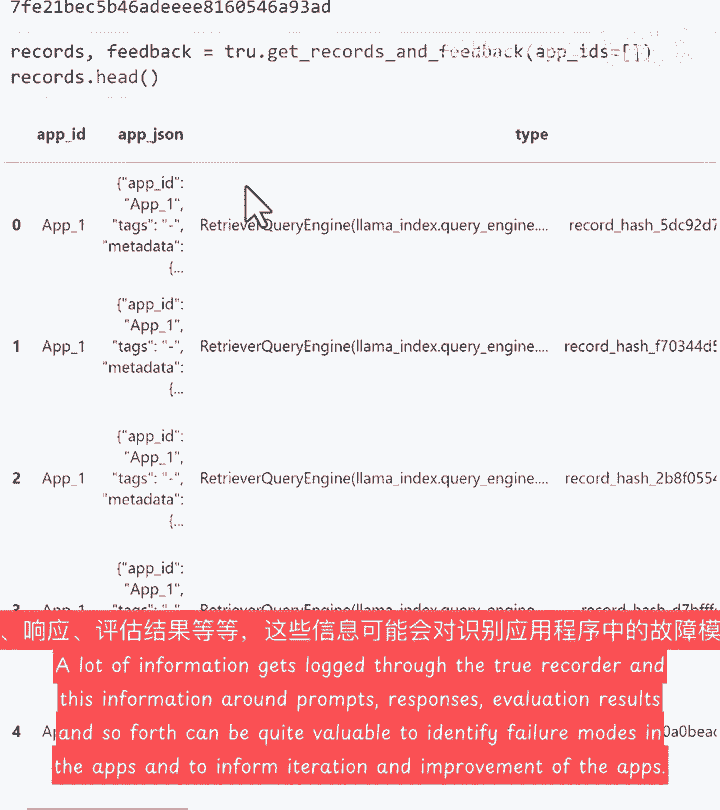

以及关于提示响应的信息。


评估结果和其他信息可以帮助识别应用程序的失败模式，并且用于应用程序迭代和改进的信息。


所有这些信息都是可灵活的json格式。


所以它们可以被导出并消费由下游过程后续处理。


让我们来看看一些更人性化的提示格式，包含此代码的响应和反馈函数评估。


你可以看到，对于每个输入，提示或问题，我们看到输出和他们在各自上下文中的相关性得分，基于的事实性和答案的相关性。

并且对于列表中的每个问题，都会对其进行这样的评估。


下划线问题。


点文本，你可以在这里看到，最后一个问题是，我怎么能在，'Ai'是我在列表末尾手动添加的问题。


在运行评估时，你可能会看到一个nan，这可能是因为API调用失败的结果。


你需要重新运行它，以确保执行成功完成。


我刚刚向你展示了评估的记录级视图，提示，回答和评估，现在，让我们在领导者板上获取聚合视图。


这聚合了所有这些个记录，并产生了该数据库中十个记录的平均得分，所以你可以在领导者板上看到，对所有十个记录的聚合视图，我们曾经说过id到f one，平均上下文相关性是零点五六，同样。

他们的平均得分对于扎根性和相关性和延迟，在所有被问到拉格应用的十个记录中，然后成本是这些十个记录的总成本，以美元计，获取这个聚合视图很有用，以便看到您的应用程序的性能如何。


以及延迟和成本的水平，除了笔记本界面之外，True lens 还提供了一个本地流线图应用仪表板，通过它可以查看您正在构建的应用程序，查看评估结果，深入到记录级别。

视图以获取应用程序性能的聚合和详细评估视图。


因此，我们可以使用真女儿的仪表板方法启动仪表板，这设置在一个特定URL的本地数据库，现在，一旦我点击这个，这可能会在一些窗口中显示。


这不是在这个框架内的，让我们花几分钟时间来浏览这个仪表板，你可以在这里看到，应用程序性能的总体视图，应用程序已处理并评估了11条记录，平均延迟为3。555秒，我们有总成本，被LLAMPS处理的总令牌数。

然后，对于上下文相关性的RAG三元组，我们有得分，接地性得分为0。56，答案相关性得分为0。86，上下文相关性得分为0。92，我们可以在这里选择应用程序，以获取更详细的记录级别视图。


对于每个记录，你可以看到用户输入。


提示，响应，这些元数据，时间戳。


然后，对于答案相关性、上下文相关性和接地性的得分，已经被记录下来，还包括延迟，总令牌数，和总成本，让我为包含LLM指示评估的行选择一行，指示说嗯，DEM。

RAG应用程序做得很好，让我们点击箭头后选择这一行。


我们可以向下滚动，并从表中获取该行的不同组件的详细视图。


所以，这里的问题。


提示是成为AI好的第一步是什么，RAG的最终响应是学习基础的技术技能，在这里，你可以看到答案相关性被视为1，在0到1的尺度上。


这是一个相关的，非常不相关的答案，相对于所问的问题，在这里，你可以看到上下文相关性，平均上下文相关性得分为0。8，对于检索到的两个上下文部分，它们分别得到了0。8的分数，你可以看到思考链。

LM评估为什么给这个特定的响应得分为0。8，以及在检索步骤，然后，在这里，你可以看到接地性评估，这是最终答案的一个从句，嗯，它得到了1的分数，在这里，你可以看到得分的原因。


在检索步骤，然后是在这里，你可以看到接地性评估，这是最终答案的一个部分，嗯，它得到了1的分数，在这里，你可以看到得分的原因。


你可以看到，这是一句陈述句，支持证据证明了它，因此，它在0到1的评分尺度上获得了满分1分，或者在0到10的评分尺度上获得了满分10分，在0到10的评分尺度上。


所以，之前我们通过幻灯片讨论的那种推理和信息。


现在，你在笔记本中可以看到，非常整洁地体现在这个溪流中，本地应用程序，运行在你的机器上。


你也可以获得一个详细的时间线视图，以及获取到完整的JSON对象。


现在，让我们看一个例子，布条没有做得那么好，当我浏览评估时，我看到这一行有一个低的基础，得分为0。5分，所以，让我们点击那个，它会带来这个例子。


问题是，利他主义如何有益于构建职业生涯，回答是。


如果向下滚动到基础评估，然后，最终响应中的两句话都有低，圆整了得分，让我们选择其中一个，看看为什么基础得分低，所以你可以看到，整体响应被分解为四个陈述，并且前两个是好的。

但后两个没有在检索的语境片段中提供足够的支持证据，特别是如果你看看这个最后一个，Allam的最后输出说，此外，实践利他主义可以贡献到个人的满足感和目的感，这可以增强动力和整体福祉。

最终有益于职业生涯的成功，虽然这可能确实如此，在检索的语境片段中找不到支持证据，来支撑那个陈述，这就是为什么我们的评估给这个得分给了低分，你可以在仪表板上玩一玩，探索一些其他不太成功的例子。

比如a la，最后的布条输出，没有做得那么好，以了解一些非常常见的失败模式，当您使用rag应用程序时，一些这些将会在我们进入关于更先进rag技术的研讨会时得到解决。

这些技术在处理这些失败模式方面做得更好，第二课就结束在这里。


在下一课中，我们将走遍基于句子窗口的检索机制和先进的rag技术，并也将向您展示如何评估这个高级技术，利用rag三叉戟和真矛。

