# (超爽中英!) 2024公认最全的【吴恩达大模型LLM】系列教程！附代码_LangChain_微调ChatGPT提示词_RAG模型应用_agent_生成式AI - P25：《基于LangChain的大语言模型应用开发》1——介绍 - 吴恩达大模型 - BV1gLeueWE5N

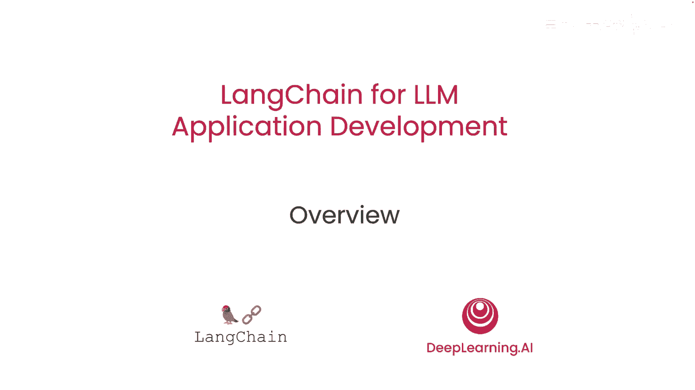

欢迎参加这个关于大型语言模型语言链的短课程。

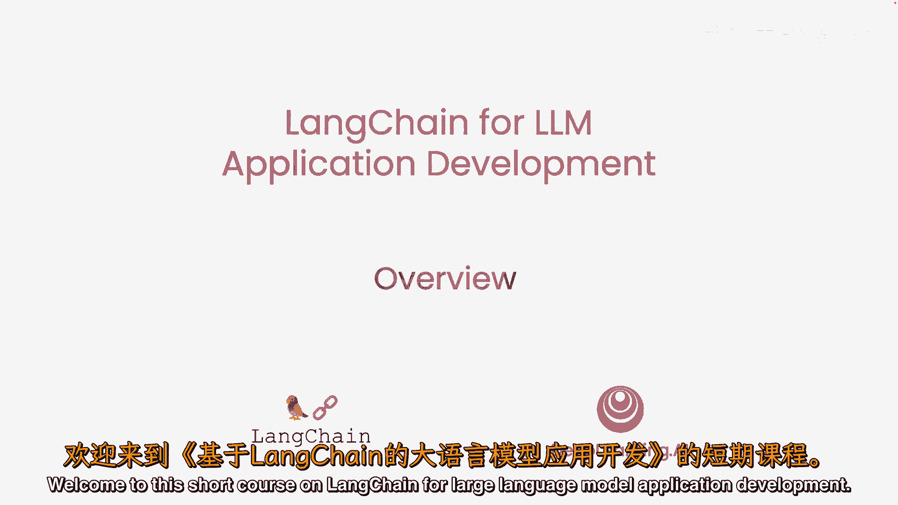

通过提示大型语言模型或大型语言模型来开发应用，现在比以往任何时候都更快地开发人工智能应用成为可能，但是，一个应用可能需要多次提示语言模型并解析输出，因此，需要编写大量的胶水代码。

哈里森·查塞创造的语言链极大地简化了这个开发过程，我很高兴有哈里森在这里，他是与深度学习一起合作创建了这个短课程的人，AI教我们如何使用这个惊人的工具，谢谢你们邀请我，我非常兴奋能来到这里。

长链最初是一个用于构建所有类型应用的开源框架，它起源于我与该领域的许多人的谈话，他们正在构建更复杂的应用，并看到了他们在开发过程中使用的一些共同抽象，我们对链链社区的采纳感到非常兴奋，因此。

期待在这里与大家分享它，并期待看到人们用它建造什么，是的，实际上，作为语言链动量的标志，它不仅有许多用户，而且还有数百的贡献者到开源中，这对其快速发展起到了关键作用，这个团队以惊人的速度发布代码和特性。

所以，希望短课程结束后，您将能够快速构建一些非常酷的应用程序使用链链，谁知道，也许您甚至决定贡献回开源的语言链努力，链链是一个用于构建LM应用的开源开发框架，我们有两个不同的包，一个Python的。

一个JavaScript的，它们专注于组合和模块化。

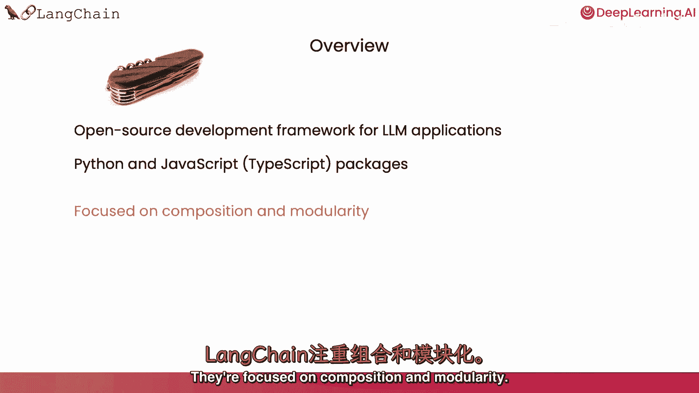

所以它有许多可以单独使用或与其他组件结合使用的个体组件，这就是一个关键价值主张。

然后，另一个关键价值主张是许多不同的使用案例，所以，将这些模块组件组合成更端到端的应用的各种方式，并在这个课程中使用它们非常容易。

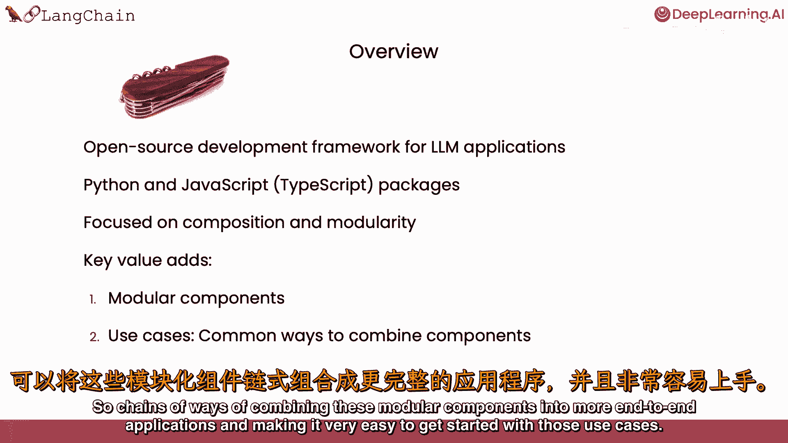

我们将覆盖链链的常见组件。

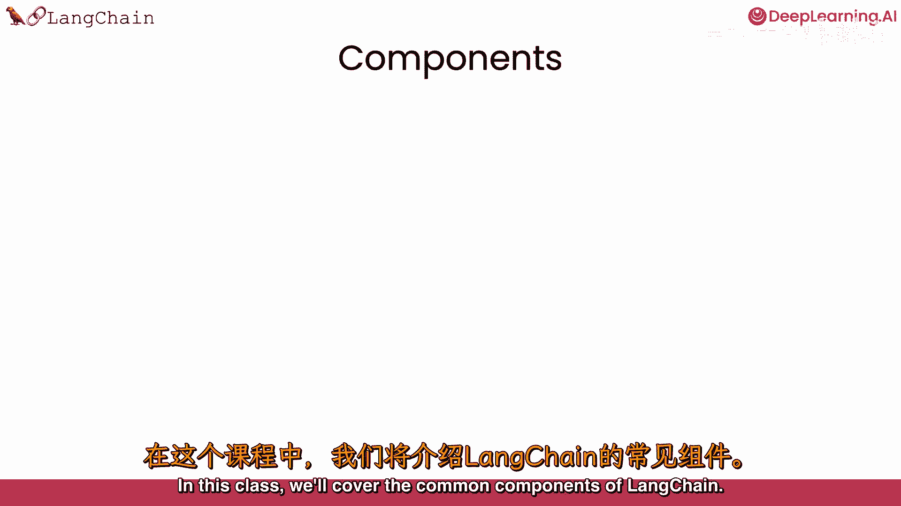

所以我们会讨论模型，我们会讨论提示，这是您如何让模型做有用和有趣的事情的方式。

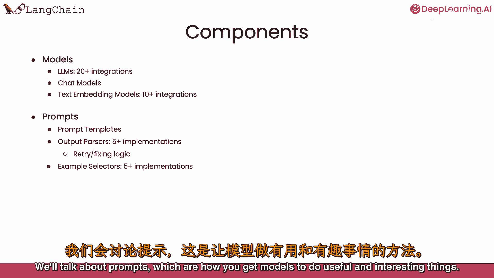

我们会讨论索引，这是数据摄入的方式。

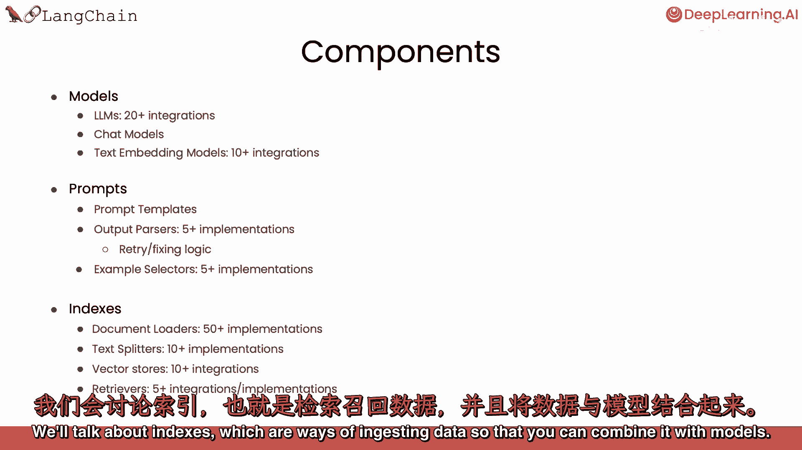

以便您可以将其与模型结合，然后我们会讨论链，这是一种更端到端的使用案例，以及代理，这是一种非常令人兴奋的端到端使用案例，它使用模型作为推理引擎。

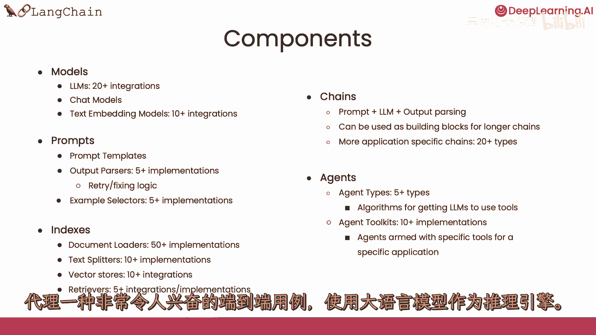

我们也感谢阿尼什·戈拉，他是与哈里森·查塞一起创立兰奇的联合创始人，也为这些材料投入了大量思考，帮助创建了这个短课程。

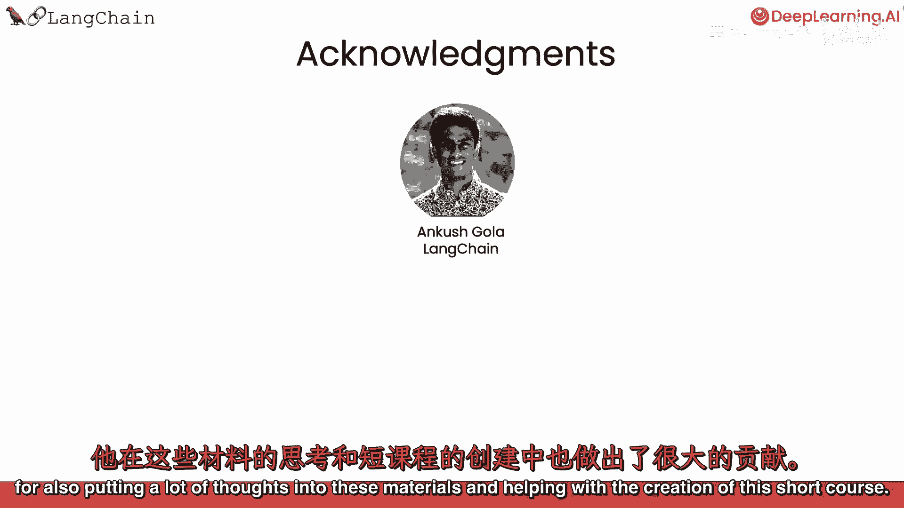

在深度学习和AI方面，杰夫，路德维希，埃德迪舒和迪亚拉作为院长，也对这些材料做出了贡献。

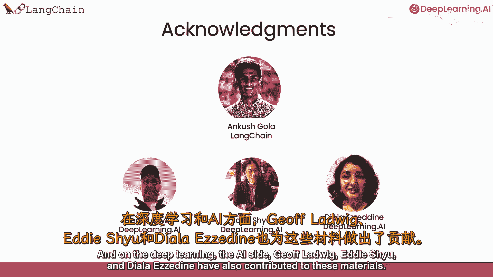

因此，让我们继续看下一个视频，在那里，我们将学习关于空白模型的内容。

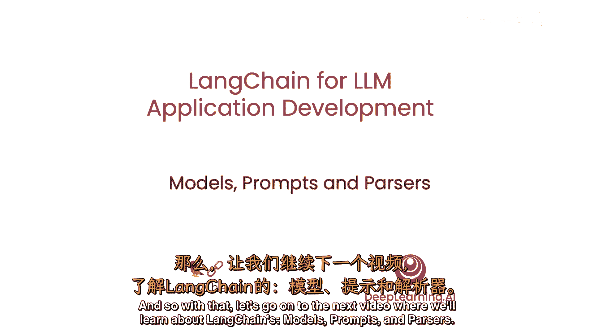