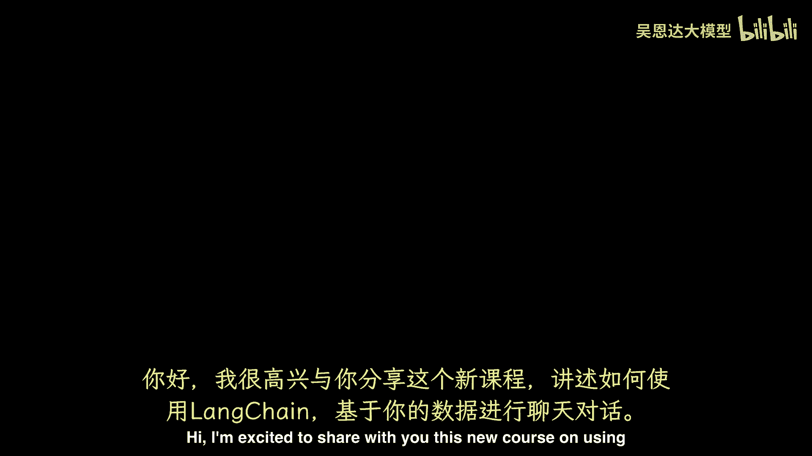
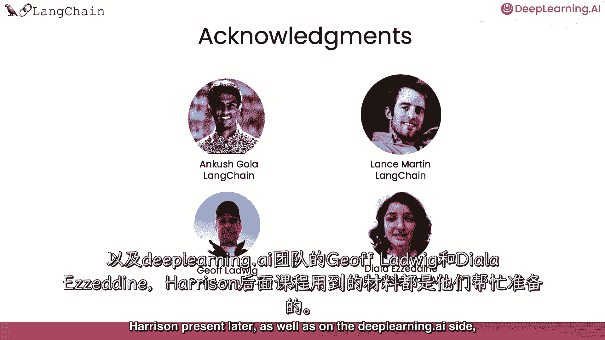

# (超爽中英!) 2024公认最全的【吴恩达大模型LLM】系列教程！附代码_LangChain_微调ChatGPT提示词_RAG模型应用_agent_生成式AI - P33：《LangChain：构建与数据对话的聊天机器人》1——介绍 - 吴恩达大模型 - BV1gLeueWE5N

你好，很高兴与你分享，使用线链与数据聊天的全新课程，与Harrison Chase合作开发，他是Lang Chain的联合创始人兼CEO，大型语言模型（如ChatGPT）可以回答许多主题的问题。

但一个孤立的大型语言模型只知道它被训练的内容，不包括你的个人数据，比如你在公司，有专有文档，不在互联网上，以及大型语言模型训练后撰写的数据或文章，若对你或他人有用，比如你的客户。

能与你的文档对话并解答问题，利用那些文档的信息和本课程中的LM，我们将涵盖如何用Link Chain与数据聊天，Link Chain是一个开源开发者框架，用于构建LLM应用。

Link Chain由多个模块化组件和更多端到端模板组成，Link Chain中的模块化组件包括提示，模型，索引，链条和代理，深入了解这些组件，可查看我与安德鲁合上的第一门课，在这门课中。

我们将深入聚焦lang chain的一个流行用例，如何用lang chain与数据聊天，首先将介绍如何使用lang chain文档加载器，从各种激动人心的来源加载数据。

然后将触及如何将这些文档分割为有意义的语义块，这个预处理步骤看似简单，但含义丰富，接下来，将概述语义搜索，获取相关信息的基本方法，给定用户问题，这是入门最简单的方法，但有几个情况会失败，将讨论这些情况。

然后讨论如何修复，然后展示如何使用检索文档，使LLM回答文档问题，但显示你缺一关键，为完全重现聊天体验，最后将涵盖缺失部分记忆，展示如何构建完全功能的聊天机器人，通过它，你可以与数据聊天。

这将是一门激动人心的短期课程，我们感谢安哥拉，以及兰斯·马丁，来自Lang Chain团队的，为哈里森稍后呈现的所有材料工作，以及深度学习，艾赛杰夫。

路德维希和迪亚拉·艾恩，如果你正在学习这门课程，并决定想复习一下语言链的基础，我鼓励你也要参加那个早期的语言链短课程，对于哈里森提到的LM应用开发，但就这些，我们现在继续下一个视频，在那里。

哈里森将向你展示如何使用。