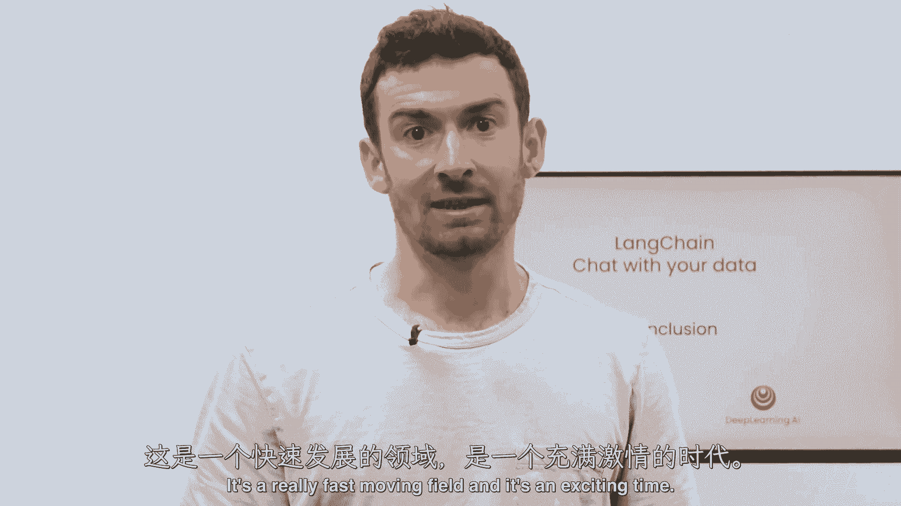

# (超爽中英!) 2024公认最全的【吴恩达大模型LLM】系列教程！附代码_LangChain_微调ChatGPT提示词_RAG模型应用_agent_生成式AI - P40：8——完结 - 吴恩达大模型 - BV1gLeueWE5N

这就结束了本课程与您数据进行长链聊天的部分，在本课程中，我们讲述了如何使用链式链接从各种文档源加载数据，使用链式链接，八十多款不同的文档加载器，从那里我们分割文档为块。

并讨论了在做到这一点时出现的许多微妙之处，然后，我们将那些块，为他们创建嵌入式，并将它们放入向量存储中，展示了这如何轻松地使语义搜索成为可能，但我们也讨论了语义搜索的一些缺点。

以及它可能在出现的特定边缘情况中失败，我们接下来将讨论检索，可能是我课程中最喜欢的部分，我们在那里讨论了许多新的、先进的和真的很有趣的检索算法，以克服这些边缘情况，我们将在下一节中将其与llms结合。

在那里，我们将那些检索到的文档，我们将用户问题，将其传递给llm，并生成对原始问题的答案，但还有一个东西缺失，那就是其中的对话性，这就是我们通过创建一个完全功能的端到端聊天机器人来结束课程的方式。

过您的数据，我真的很喜欢教这门课程，我希望你们大家也喜欢参加它，我想感谢开源社区的所有人，他们为使这门课程成为可能做出了很多贡献，如所有的提示和您看到的许多功能，随着您使用lang chain进行构建。

并发现新的方法和技巧来做事情，我希望您能将所学分享到Twitter上，甚至为link chain打开一个PR，这是一个快速发展的领域，这是一个令人兴奋的时刻。

我真的期待着看到您如何应用在这门课程中学到的一切。