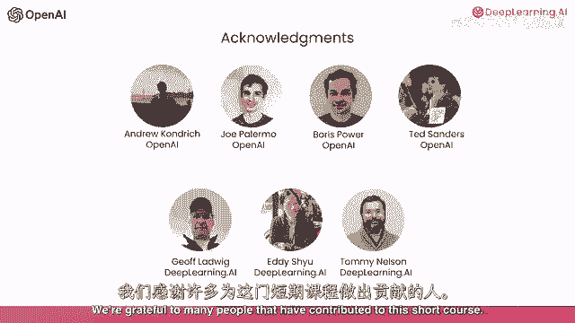
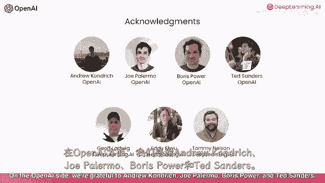
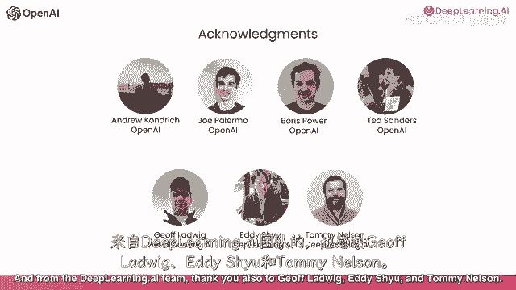

# (超爽中英!) 2024公认最全的【吴恩达大模型LLM】系列教程！附代码_LangChain_微调ChatGPT提示词_RAG模型应用_agent_生成式AI - P41：《使用API构建LLM系统》 - 介绍 - 吴恩达大模型 - BV1gLeueWE5N

欢迎参加关于使用聊天构建系统的课程，Gpg api之前ea和我曾介绍过如何提示的课程，Gpt，但系统需要远超过一个提示，或对大型语言模型的单个调用，在这门短课程中。

我们想与您分享使用llm构建复杂应用程序的最佳实践，使用llm，我们将使用构建端到端，客户服务辅助系统的运行示例，该系统使用不同的指令链式调用语言模型，根据前一个调用的输出，有时甚至从外部来源查找东西。

例如，给定用户输入如告诉我有关出售的电视，我们将使用以下步骤来处理这第一个，您可以评估输入以确保它不包含任何问题内容，如仇恨言论接下来，系统将处理输入，它将识别查询的类型，这是投诉还是产品信息请求等。

一旦它确定是一个产品查询，它将检索有关电视的相关信息，并使用语言模型编写有用的响应，最后您将检查输出以确保它不是问题，如不准确或不适当的答案，您在这门课程中看到的一个主题是应用程序通常需要多个内部步骤。

它们对最终用户不可见，您通常希望按顺序处理用户输入的多个步骤，以获得最终输出然后显示给用户，并且随着您长期使用lms构建复杂系统，您通常还想继续改进系统，因此也向您分享开发基于lm的应用程序的感觉。

以及一些评估和改进系统的最佳实践随时间，我们感谢许多人对这门短课程做出了贡献。

在open ai方面。

我们感谢安德鲁，肯德里克，乔，帕勒莫，鲍里斯，鲍威尔和特德·桑德斯。

从深度学习ai团队，也感谢杰夫。

路德维希，埃迪·胡和汤米·尼尔森通过这门短课程，我们希望您将充满信心地构建一个复杂的多步骤应用程序，并且也准备好维护并继续改进它。

