# (超爽中英!) 2024公认最全的【吴恩达大模型LLM】系列教程！附代码_LangChain_微调ChatGPT提示词_RAG模型应用_agent_生成式AI - P42：1——大语言模型、API格式和Token - 吴恩达大模型 - BV1gLeueWE5N

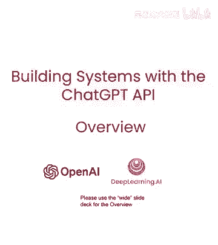

首先视频，将分享大型语言模型概述，工作将涉及，如何训练，以及像分词器如何影响输出等细节，当你提示LM时，也将查看LM的聊天格式，这是指定系统及用户消息的方式，并理解你能用此能力做些什么，先看看。

大型语言模型如何工作，你可能熟悉文本生成过程，你可以给出一个提示。

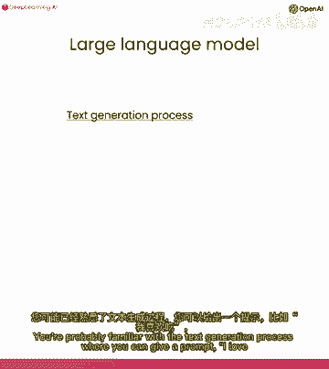

我爱吃和很棒，让lm填充可能的东西，基于此提示的完成，它可能会说奶油芝士维加斯或我妈妈的肉馅饼，或也与朋友一起，但模型是如何学会这样做的，训练大型语言模型的主要工具实际上是监督学习。

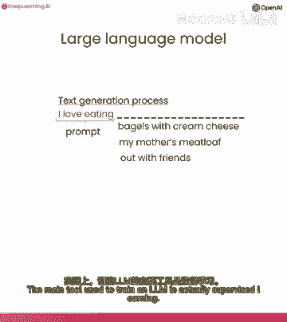

计算机使用标记的训练数据学习输入输出或x到y的映射，例如，若用监督学习分类餐厅评论情绪，你可能收集这样的训练集，如最佳驾驶三明治很棒，标记为正面情绪评论等，这很慢，食物一般为负面，早期成绩他很棒。

作为正面标签，顺便说以太和我都生于英国，我们都喜欢伯爵茶。

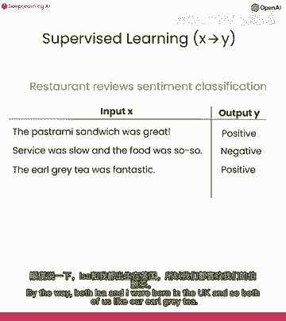

监督学习的流程通常是获取标记数据。

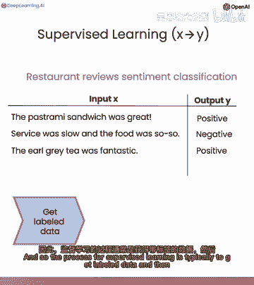

然后训练模型，训练后，你可以部署并调用模型，给它一个新的餐厅评论，最好的披萨，我吃过，你希望输出，那有积极情绪，事实证明，监督学习是训练大型语言模型的核心组成部分，具体来说。

大型语言模型可以通过使用监督学习反复预测下一个单词来构建，假设在你的训练集中有很多文本数据，你有句子，我最喜欢的食物是一个奶油贝果，芝士和抹酱，然后这句话被转换成训练示例序列，给定一个句子片段。

我最喜欢的水果是一个，如果你想预测下一个词，在这种情况下是贝果，或给定句子片段或句子前缀，我最喜欢的食物是贝果，接下来的词可能是'和'等。

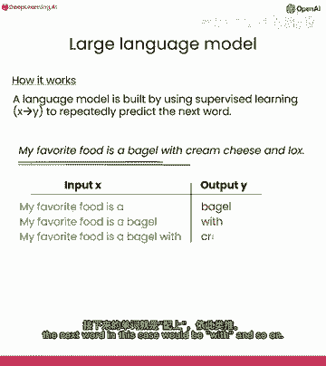

考虑到数百亿甚至更多单词的大型训练集，然后可以创建一个庞大的训练集，你可以从句子或文本的一部分开始，并反复要求语言模型学习预测下一个单词，因此，目前有两种主要的大型语言模型。

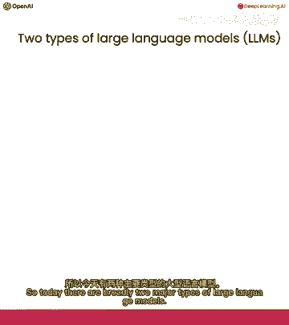

第一种是基础语言模型，第二种是越来越常用的，指令微调模型。

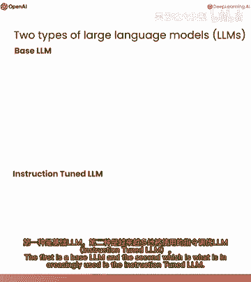

基础模型反复预测下一个词。

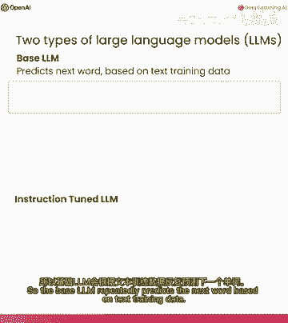

如果我给它一个提示，从前有只独角兽，然后它可能逐词预测，编出一个完成的故事，关于独角兽在魔法森林，与所有独角兽朋友生活，现在一个缺点是。

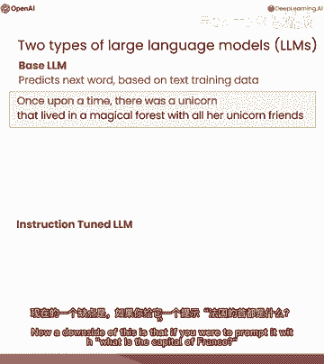

如果你提示它，法国首都是什么，他们用法国最大城市完成，法国人口等，但你真正想要的是告诉你法国首都，可能而不是列出所有问题，所以给LM的指令试图遵循指令。

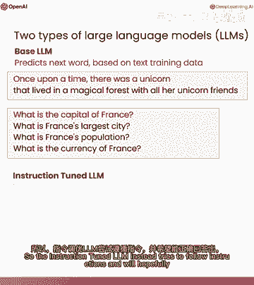

并希望会说法国巴黎等，如何从基础LM到指令调优LM，这就是训练和指令调优LM的过程，像Chagpt，看起来你首先在大数据上训练一个基础LM，数百亿单词甚至更多，这过程需数月在大超算系统。

训练完基础语言模型后。

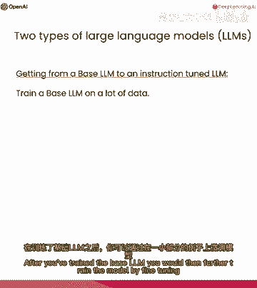

然后进一步训练模型，通过微调在小样本上，输出遵循输入指令，例如，承包商希望编写大量指令示例，以及指令的良好响应，创建额外微调的训练集，学习预测下一个词，若遵循指令，提高输出质量。

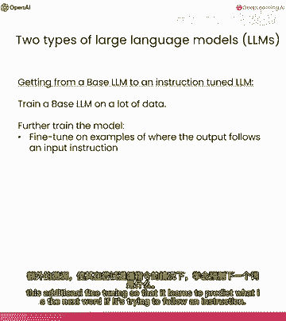

现常用人类评分，评估输出是否有用，诚实无害。

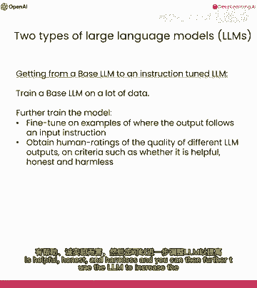

进一步调优模型，增加高评分输出概率，常用技术为RHF，意为强化学习，从人类反馈中学习，训练基础语言模型可能需要数月，从基础语言模型到指令调优语言模型的过程可以在，可能几天内。

在更小的数据集和更小的计算资源上完成，所以这是如何使用语言模型，导入一些库，我将在这里加载我的OpenAI密钥，稍后在这个视频中我会多说一些。

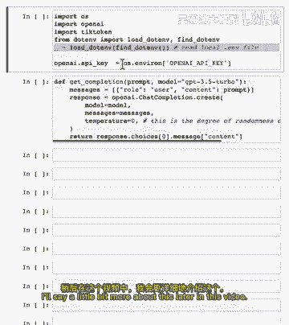

这是一个获取完成的辅助函数，给定一个提示，如果你还没有在你的计算机上安装openai包，你可能需要运行pip，安装open ai，但这里我已经安装了，所以我不运行那个。

让我按Shift+Enter运行这些，现在我可以设置响应等于，获取完成，法国的首都是什么，希望现在它会给我一个好的结果，在大语言模型的描述中，到目前为止，我把它描述为逐词预测。

但实际上还有一个重要的技术细节，如果你告诉它，将单词lollipop的字母反转，这似乎是一个简单的任务，可能像四岁小孩能做的任务，但如果你要求GPT做这件事，它实际上输出了一些混乱的，东西。

这不是lollipops字母反转，所以为什么GPT无法完成看似相对简单的任务，事实证明，对于大型语言模型的工作方式还有一个重要的细节，即它实际上并不是反复预测下一个单词，相反，它反复预测下一个标记。

而标记实际上所做的就是，它将像学习新事物很有趣这样的字符序列，分组为形成常见字符序列的标记，所以这里，学习新事物很有趣，它们都是相当常见的单词，因此每个标记对应一个单词或一个单词空格。

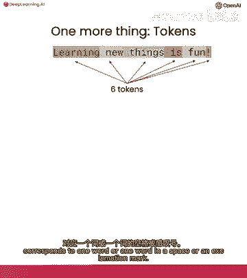

或感叹号，但如果你给它输入，包含一些不太常用单词的输入，比如提示，作为强大的开发人员到单词，提示在英语中仍然不是很常见，但肯定越来越受欢迎，因此提示实际上被分解为三个标记，其中提示。

因为那三个是常见字母序列，如果你给它单词lollipop，分词器实际上将其拆分为三个标记，L和all和epop，因为Chai GPT没有看到单个字母，而不是看到这三个标记。

所以它更难正确打印出这些字母的反序。

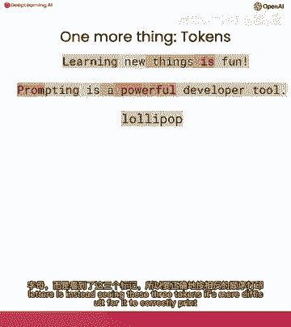

所以这里有一个技巧可以修复，如果我在这几个字母之间添加破折号和空格也会起作用，其他东西也会起作用，将字母和棒棒糖反转，实际上效果更好。

I，P，O，P，原因是，如果你给它带破折号的棒棒糖，它将每个字符标记为一个单独的标记，使它能更容易看到单个字母并按逆序打印出来，所以如果你想用Chi GPI玩文字游戏，像拼字游戏之类。

这巧妙技巧助其看清英语单词字母。

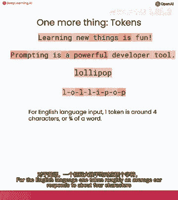

一个标记，平均约，对应约4个字符或3/4个单词。

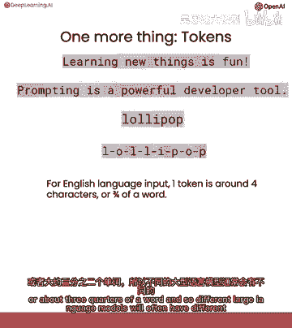

因此不同大型语言模型常设不同输入输出标记数限制，模型gpt3。5 turbo，例如，最常用的cgpu模型输入限制约4千标记，输出结果，若输入上下文过长，实际抛出异常或错误，分享另一种强大用法。

涉及指定独立系统，用户和助手消息，示例，可详细解释。

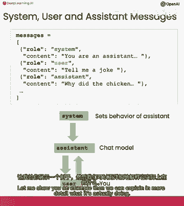

实际操作，新辅助函数，从消息获取完成，当我们提示这个LM时。

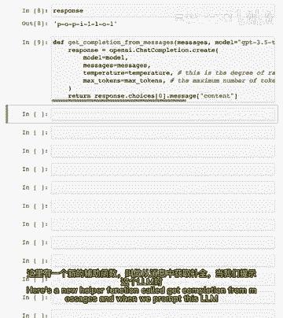

我们将给它多个消息，这是你可以做的示例，我将首先指定一个系统角色的消息，这是一个系统消息，系统消息的内容是，你是一个助手，以苏斯博士的风格回应，然后我将指定一个用户消息，第二条消息的角色是行用户。

内容是写一首关于快乐胡萝卜的短诗，所以让我们运行它，温度等于一，我实际上从来不知道会出来什么，但好吧，那是一首很酷的诗，哦，我看到的这个角色多么快乐，实际上押韵得很好，好吧，做得好，有gpd。

在这个例子中，系统消息指定了你想要大型语言模型或助手做的整体语气，用户消息是你想要执行的特定指令，给定在系统消息中指定的更高层次行为。

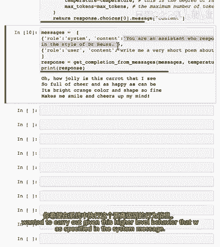

这是它是如何工作的示意图，这就是聊天格式的运作方式，系统消息设定大型语言模型或助手的整体行为基调，然后当你给它一个用户消息，例如，告诉我一个笑话或写一首诗，它将输出一个适当的响应。

遵循你在用户消息中要求的，并与系统消息中设定的整体行为一致，顺便说一句，虽然我在这里没有展示，如果你想在一个多回合的对话中使用它，你也可以以这种消息格式输入助手消息，让Chap，知道它之前说了什么。

如果你想基于之前说过的话继续对话。

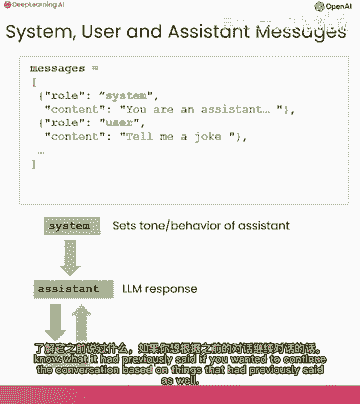

但这里还有一些其他例子。

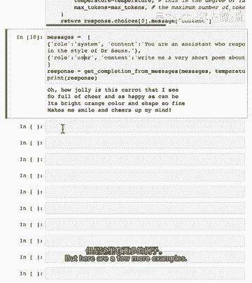

如果你想设定语气，让它输出一个句子，那么在系统消息中我可以说所有响应都必须是一个句子长。

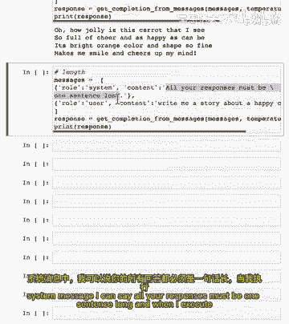

当我执行这个，它输出一个句子。

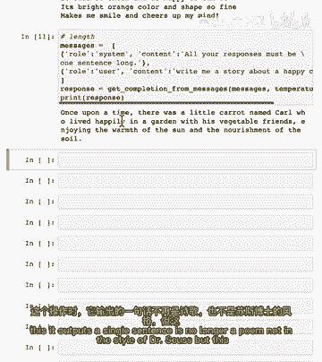

不再是诗，不是苏斯博士的风格，但是一个句子，有一个关于快乐胡萝卜的故事，如果我们想结合指定风格和长度。

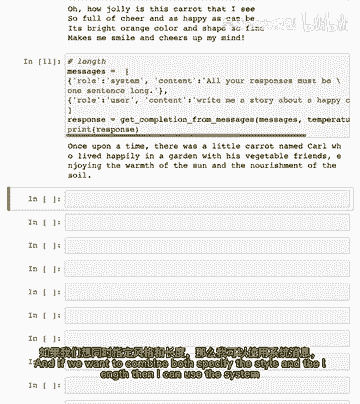

那么我可以使用系统消息说你的系统响应开始苏斯博士，所有句子都必须是一个句子长，现在，这生成了一个很好的单句诗，总是微笑着，从不吓人，我喜欢那个，那是一个非常快乐的诗，然后最后只是为了好玩。

如果你正在使用一个LM，并且你想知道你在使用多少个令牌，这里有一个稍微更复杂的函数希望，从OpenAI API端获取响应，然后使用响应中的其他值告诉你使用了多少提示令牌。

完成令牌和总令牌在API调用中使用了，让我定义一下。

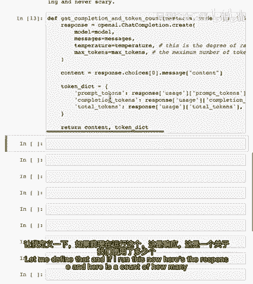

如果我运行这个。

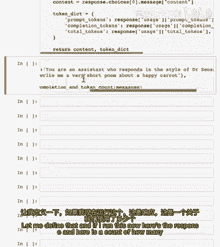

这是响应，这里是，关于我们使用了多少令牌的帐户，所以此输出有55个令牌，而提示输入有37个令牌，所以总共使用了92个令牌，当我实践中使用模型时，坦白说，我并不太担心使用的令牌数。

可能有一个值得检查令牌数的情况，如果你担心用户给了你过长的输入，超过了ChatGPT约4000个令牌的限制，在这种情况下，你可以检查一下使用了多少令牌并截断，确保你保持在大型语言模型的输入令牌限制内。

现在我想与你分享，如何使用大型语言模型的另一个提示，调用OpenAI API需要使用与免费或付费账户绑定的API密钥，因此许多开发人员会将API密钥以纯文本形式，像这样写入Jupyter笔记本。

这是一种不安全的API密钥使用方式，我不推荐你使用，因为它很容易与其他人共享这个笔记本，或将其检查到GitHub或其他地方，最终导致API密钥泄露给其他人，相比之下。

你在Jupyter笔记本中看到我所做的是这段代码，我使用库dot n，然后运行此命令load n find n读取本地文件，该文件称为dot n，包含我的秘密密钥，因此，使用此代码片段。

我在本地存储了一个名为dot n的文件，其中包含我的API密钥，它将其加载到操作系统的环境变量中，然后我从get和open API密钥中获取它，并将其存储到这个变量中，在整个过程中。

我从未需要在Jupyter笔记本中输入API密钥的纯文本，和未加密的纯文本，所以这是一种相对更安全和更好的访问API密钥的方式，实际上，这是一种通用的方法，用于存储来自许多不同在线服务的不同API密钥。

你可能想要使用并从你的Jupyter笔记本中调用，并调用从你的Jupyter笔记本中调用，这是一个相对更安全和更好的访问API密钥的方式，实际上，这是一种通用的方法。

用于存储来自许多不同在线服务的不同API密钥，你可能想要使用并从你的Jupyter笔记本中调用，并调用从你的Jupyter笔记本中调用。

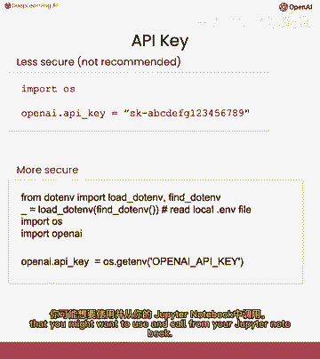

这是一个相对更安全和更好的访问API密钥的方式，我认为提示对AI应用，开发的影响仍被传统监督。

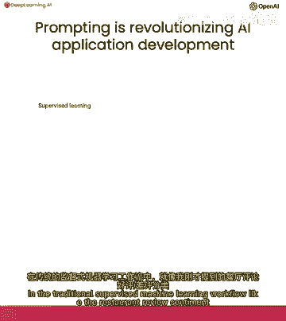

机器学习流程低估，如我刚刚提到的餐厅评论，情感分类示例，如果你想构建一个分类器，来分类餐厅评论的正面，负面情绪，你首先会得到一堆标记数据，可能几百个例子，这可能需要，我不知道，几周，可能一个月。

然后你会在数据上训练模型，获取合适的开源模型，调整模型，评估它，这可能需要几天，几周甚至几个月，然后你可能需要找到云服务，部署它，然后将模型上传到云，然后运行模型，最后能够调用你的模型。

这通常不是常见情况，这需要团队几个月才能工作，相比之下，基于提示的机器学习，当你有一个文本应用时，你可以指定一个提示，这可能需要几分钟，可能几小时，如果你需要迭代几次以获得有效的提示，然后在几小时。

最多几天，但坦率地说，更多时候是几小时你可以运行它，并开始调用模型，一旦你完成了这一点，只需再次，可能几分钟或几小时你可以开始调用模型，并开始做推断，所以曾经需要我，可能六个月或一年才能构建的应用。

你现在可以在几分钟或几小时内构建，可能只有很少几天使用提示，这正在改变AI应用可以快速构建的方式，一个重要的警告是这适用于许多非结构化数据应用，包括文本应用和可能越来越多的视觉应用。

尽管视觉技术目前还不成熟，但它在某种程度上正在实现，继续看下一个视频，将展示如何评估客服助手输入，这是更大示例的一部分。

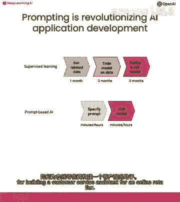