# (超爽中英!) 2024公认最全的【吴恩达大模型LLM】系列教程！附代码_LangChain_微调ChatGPT提示词_RAG模型应用_agent_生成式AI - P43：2——输入评估： 分类 - 吴恩达大模型 - BV1gLeueWE5N

在本节中，我们将专注于评估输入的任务，这对于确保系统的质量和安全性可能是重要的，对于需要处理不同情况的许多独立指令集任务的任务，首先分类查询类型可能是有益的，然后使用该分类来确定应使用哪些指令。

这可以通过定义固定的类别来实现，并硬编码与处理给定类别的任务相关的指令，例如，在建立客户服务助手时，首先分类查询类型可能是重要的，然后根据该分类确定应使用哪些指令，所以例如，如果用户询问关闭账户。

你可能会给出不同的第二级指令，与用户询问特定产品相比，在第一种情况下，你可能添加关于如何关闭账户的额外指令，然后在第二种情况下，你可能添加有关产品的额外信息，让我们看一个例子，我认为这将使情况更清楚。

所以这里我们有我们的系统消息，这是系统的总体指令，我们正在使用这个分隔符，分隔符只是一个方式，用于分离指令或输出的不同部分，它帮助模型确定不同的部分，对于这个例子，我们将使用分隔符为标签。

这是一个很好的分隔符，因为它实际上被表示为一个标记，所以这是我们的系统消息，我们正在要求模型，所以你将被提供客户服务查询，客户服务查询将用这些标签字符分隔，将每个查询分类为主要类别和次要类别。

然后以JSON格式提供输出，键为主要和次要，所以我们这里有我们的主要类别列表，所以账单，技术支持，账户管理，或一般查询，然后下面我们有次要类别列表，取消订阅，升级，等。

所以现在让我们做一个用户消息的例子，对于我们的第一个用户消息，我们将使用。

以下，所以用户消息，我想删除我的个人资料和所有用户数据。

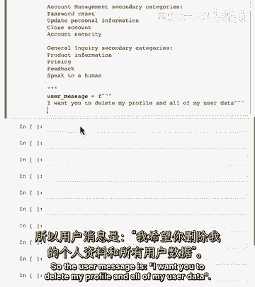

然后我们将这个消息格式化为消息列表，与系统消息和用户消息用这些标签分隔，让我们只看看，这可能是什么，所以我想让你删除我的个人资料，这种看起来像账户管理，也许关闭账户，所以让我们看看模型怎么想。

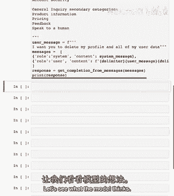

太好了，所以从模型中的分类，猫的主要类别是账户管理，然后关闭账户作为次要的，询问结构化输出如json的一个好处。

是您可以轻松地将其读取为某种对象。

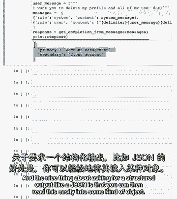

所以字典，例如，在Python或其他地方。

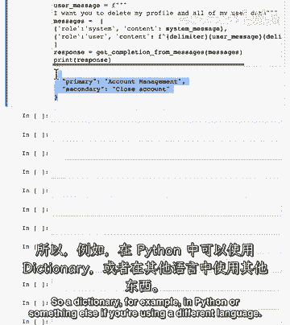

如果您正在使用不同的语言，然后您可以将其用作后续步骤的输入。

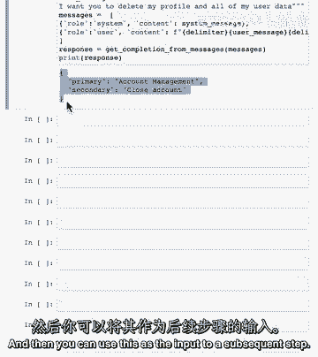

我会给你另一个例子，但也请随时暂停视频。

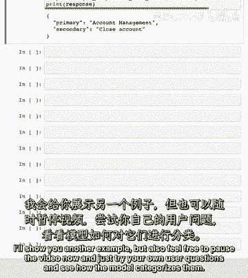

并尝试自己的用户问题，看看模型如何分类它们。

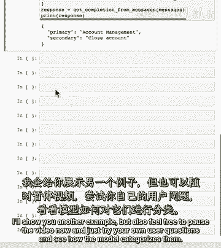

这是另一个用户消息，告诉我更多关于你的平板电视。

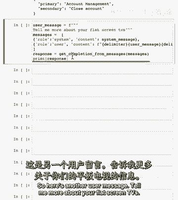

我们只是收到了模型相同的消息列表响应。

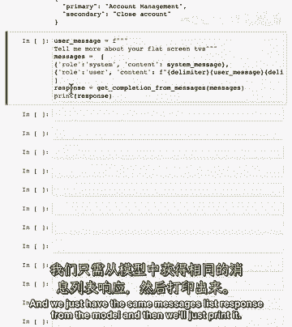

然后我们就会打印它，这就是我们的第二个分类。

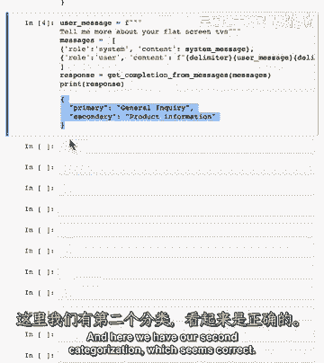

看起来，总的来说，基于客户询问的分类，我们现在可以提供一套更具体的指示来处理下一步，在这种情况下，我们可能会添加关于电视的一些额外信息，与，在这种情况下，我们可能想要提供一个关闭账户的链接。

或类似的东西，我们将在后续的视频中学习处理输入的不同方式。

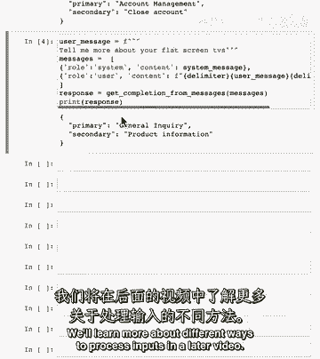

在下一个视频中，我们将看更多的输入评估方法。