# (超爽中英!) 2024公认最全的【吴恩达大模型LLM】系列教程！附代码_LangChain_微调ChatGPT提示词_RAG模型应用_agent_生成式AI - P48：7——构建一个端到端的系统（中英文字幕） - 吴恩达大模型 - BV1gLeueWE5N

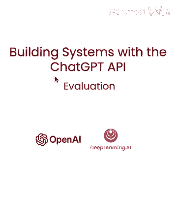

本视频中，将整合前面视频所学，创建客户服务助手端到端示例，将按以下步骤进行，首先检查输入是否触发审核API，如果没有，提取产品列表，第三，如果找到产品，将尝试查找它们，第四，用模型回答用户问题，最后。

将答案通过审核API，如果没有标记，将返回给用户，所以，我们有设置。

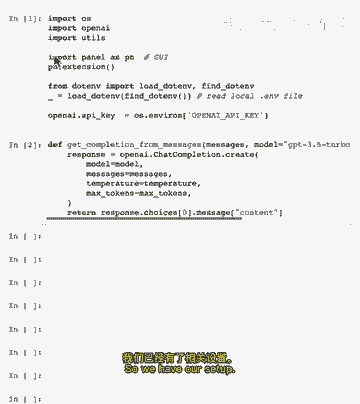

有额外导入，这是一个Python包，将用于聊天机器人UI。

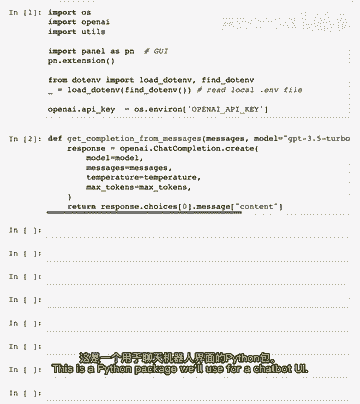

将粘贴处理用户消息函数。

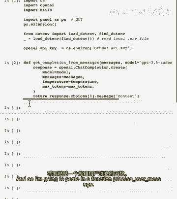

实际上，先运行示例，然后讨论函数，我们有一直在使用的用户输入，告诉我关于智能手机，相机也告诉我关于电视，所以，让我们先运行这个，让我们运行这个，如你所见，正在通过步骤回答用户问题，第一步，审核步骤。

第二步是提取产品列表，第三步是查看产品信息，所以现在有了这些产品信息，模型被问及，正尝试回答问题，如前面视频所见，最后，它将响应通过审核API再次，以确保安全显示给用户，这是我们熟悉的响应，所以。

让我们稍微讨论一下正在发生的事，我们有辅助函数处理，用户消息，它接受用户输入，这是当前消息和所有消息的数组，这是构建聊天机器人UI时，所以，第一步是检查，输入是否触发审核API。

我们在前面的视频中已经覆盖了这一点，如果输入被标记，然后告诉用户我们无法处理请求，如果没有标记，我们尝试提取产品列表，如我们在前视频中，然后尝试查找产品，若未找到产品，这将是一个空字符串。

然后回答用户问题，因此给出对话历史和相关信息的新消息，因此我们得到响应，然后运行此响应通过审核API，若标记，我们告诉用户无法提供此信息，也许我们会说，让我连接你，你可以采取后续步骤。

因此让我们与漂亮的UI一起整合这一切，并尝试进行对话。

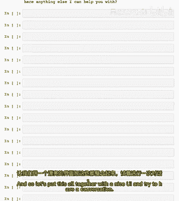

因此我们有一个函数，它将累积消息，当我们与助手交互时，请随时暂停视频。

以更详细地了解如何工作。

和，当然，也请对刚刚看到的真正长过程用户消息函数做同样的事情。

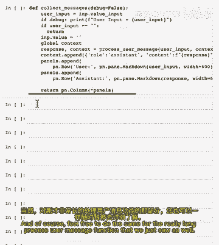

所以现在我们要粘贴我们的代码来显示聊天机器人UI。

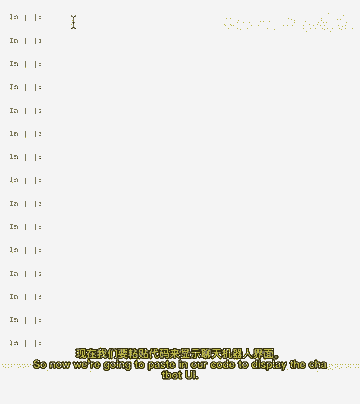

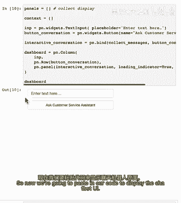

因此如果我们运行此操作，让我们尝试与客户服务助理进行对话。

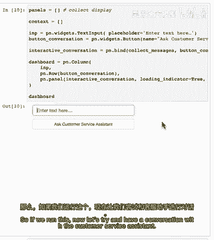

那么你们有哪些电视？

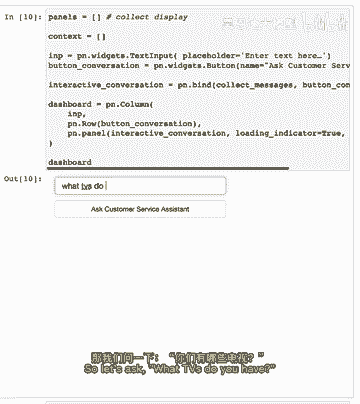

在幕后。

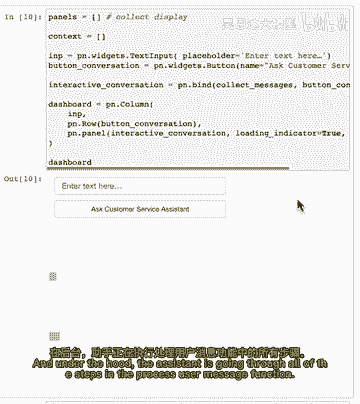

助手正在通过所有过程步骤，使用消息函数，所以它列出了各种不同的电视，所以现在让我们问。

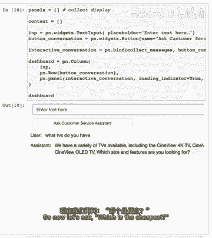

哪个最便宜，再次通过所有相同的步骤，但这次它将对话历史也作为提示传递，好的，所以它告诉我们扬声器是最便宜的电视相关产品，我们有趣，让我们看看最昂贵的，所以最昂贵的电视是Synerview 8K电视。

所以让我们询问更多信息，告诉我更多关于它，因此我们收到了关于这台电视的更多信息，因此在这个例子中，我们结合了在整个课程中学到的技术来创建一个全面的系统，具有评估用户输入的一系列步骤，处理它们。

然后通过监控系统在更多输入上的质量来检查输出，您可以更改步骤并提高系统的整体性能，也许我们会发现我们的提示对于某些步骤会更好，也许有些步骤甚至是不必要的，也许我们会发现更好的检索方法。

