# (超爽中英!) 2024公认最全的【吴恩达大模型LLM】系列教程！附代码_LangChain_微调ChatGPT提示词_RAG模型应用_agent_生成式AI - P49：8——评估（上） - 吴恩达大模型 - BV1gLeueWE5N

在之前的几个视频中，这些展示了如何使用llm构建一个应用，从评估输入到处理输入，然后到在你向用户显示输出之前做最终输出检查，在你构建了这样一个系统之后，你怎么知道它工作得如何。

甚至在你部署它并让用户使用它时，你怎么能跟踪它的表现并找到任何不足，并在这个视频中继续提高你系统的答案质量，我想与你分享，评估线性回归输出时的最佳实践，我想特别与你分享，构建这类系统的感觉。

本视频中我所谈论的关键区别，与您可能在传统机器学习中看到的有所不同，监督学习应用的原因在于您可以如此快速地构建一个应用，评估它的方法，它通常不是从测试集开始，相反，您往往最终会逐渐构建起一套测试示例。

让我与您分享，我的意思是，你从第二个视频中会记住这个图表，关于如何基于提示的开发加速模型开发的核心部分。

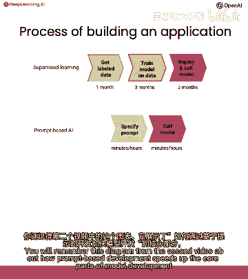

从可能几个月到仅仅几分钟或几小时，或者在传统的监督学习方法中，最多几天。

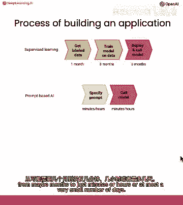

如果你需要收集。

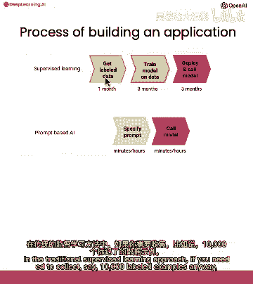

比如说，无论如何你需要收集一万个标记的例子，那么收集另一个一千个测试例子的增量成本并不算坏。

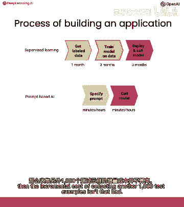

所以在传统的监督学习设置中。

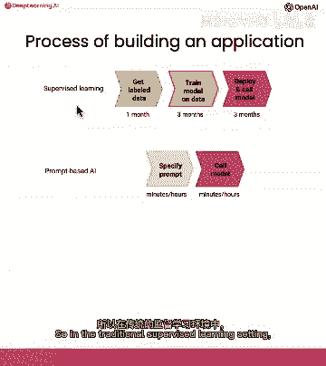

收集一个训练集并不算罕见，收集一个开发集。

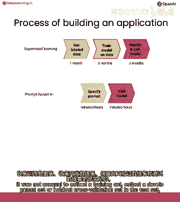

或者保留交叉验证集和测试集，然后在这个开发过程中随时使用这些。

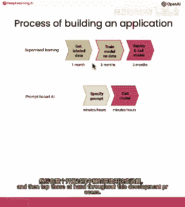

但如果你能在几分钟内指定一个提示。

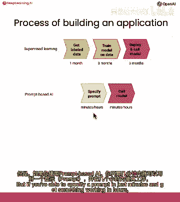

并在几小时内使用它工作，那么看起来就像是一个巨大的痛苦。

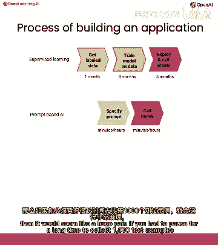

如果你需要花很长时间来收集一千个测试示例，因为你现在可以使用零个训练示例来使用它工作，所以当使用lm构建应用程序时，这通常是首先的感觉，你会在只有几例示例上调整提示，也许一至三至五例示例。

然后尝试找到一个在这些示例上起作用的提示，然后当你的系统经受到额外的测试时，你偶尔会遇到一些棘手的示例，提示在这些示例上不起作用，或者算法在这些示例上不起作用，在这种情况下。

你可以取这些额外的一至二至三至五例示例，并将它们添加到你正在测试的示例集中，只是为了偶然地添加更多的棘手示例，最终，你有足够的这些示例，你已经添加了到你逐渐增长的开发集中。

这使得手动运行每个示例通过提示变得有些不便，每次你更改提示，然后您开始开发指标来测量在这个小集例上的性能，例如，可能平均准确率，这个过程的一个有趣方面是，如果你在任何时刻决定你的系统工作足够好。

你可以在那里停止并不再继续到下一个项目，实际上，有许多部署的应用程序停在，也许第一个或第二个项目，并且实际上正在运行，我现在运行得很好，如果你正在评估模型上的人工构建开发集。

它可能还不足以给你对你的系统性能的信心，然后，那就是你可能去下一个步骤的，收集一个随机样本的示例来调整模型，这将继续是一个开发集，或一个留出交叉验证集，可能会因为继续调整提示是很常见的。

只有在你需要甚至更高精度的系统性能估计时，你可能收集和使用留出测试集，你知道你在调整模型时不会看自己，如果说你的系统正确回答问题的比例是九十一%，你想要调整它来，给出正确答案九十二或九十三%。

那么你确实需要一个更大的示例集来测量这些差异，在九十一和九十三性能之间，然后，只有如果你真的需要一个无偏公正的估计系统是如何做的，那么你需要超越开发集，也要收集留出测试集，一个重要的警告。

我已经看到许多大型语言模型的应用，在没有显著风险造成伤害的情况下，即使它给出的答案不是完美的，但对于任何高风险的应用，如果有风险存在偏差或不适当的输出可能会对某人造成伤害。

那么收集测试集来严格评估你系统的性能就成为责任，以确保在使用它之前它正在正确地做事，这变得尤为重要，例如，如果你正在使用它来总结文章，只是为了你自己阅读，没有任何其他人，那么伤害的风险可能更小。

你可能可以在这个过程的早期阶段停止，而不必去花费子弹，四和五是收集更大的数据集来评估你算法，所以，在这个例子中，让我开始使用通常的辅助函数，使用利用函数获取产品列表和类别，所以在电脑和笔记本电脑类别中。

有电脑、笔记本电脑和小型手机配件类别，这里有智能手机列表，对其他类别的配件等。

假设任务需要一个地址是用户输入的，例如，我可以买什么电视，如果我有一个预算来检索相关类别和产品，这样我们就有回答用户查询所需的正确信息，所以这里有一个提示，您随时可以暂停视频并详细阅读这个，如果您愿意。

但是提示指定一套指令，它实际上给了语言模型一个良好的输出示例，这有时被称为几枪，或技术上称为一枪，提示，因为我们实际上在使用用户消息和系统消息来给它，一个良好的输出示例，如果有人说我想要最昂贵的电脑。

你知道，让我们只返回所有电脑，因为我们现在没有价格信息，让我们用这个提示在客户消息上，如果我在预算内可以买什么电视，所以我们将这个传递给它，提示定制消息零，以及类别中的产品。

这是我们在上方使用util函数检索的信息，这里列出了与此查询相关的相关信息，这位于卡路里电视和家庭影院系统下，这是一些似乎与电视和家庭影院系统相关的电视列表，看看这个提示做得如何。

您可能想在第二个提示上进行评估，提示客户说，我需要为我的智能手机充电，看起来它正正确地检索这些数据，卡路里智能手机配件和相关产品的列表，这是另一个。

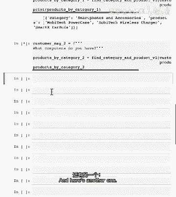

所以你有什么电脑，希望你能检索出电脑列表，这里有我的三个提示，如果您正在开发这个提示第一次，有一个或两个或三个像这样的例子是相当合理的，并继续调整提示，直到它给出适当的输出。

直到提示检索出与客户请求相关的产品和类别，对于所有您的提示，所有这些三个，所有，在这个例子中，如果提示缺少了一些产品或者什么，那么我们可能会回去编辑提示几次，直到它在这三个属性上都正确。

当你的系统达到了这个阶段，也许把它发送给内部测试用户，或者尝试自己使用它，只是运行一段时间看看会发生什么，有时候你会遇到一个它失败的提示，所以这里是一个提示的例子。

告诉我关于smiprofile和全屏快照相机的信息，你还有什么电视，所以，当我在这个提示下运行它时，看起来它正在输出正确的数据，但它也输出了一大堆文本在这里，这些额外的垃圾。

这使得将其传递到一个Python的字典列表变得更加困难，所以我们不喜欢这种输出方式，因为它包含这些额外的垃圾，所以当你遇到一个系统失败的例子时，然后，常见的做法是只是记录下这是一个有些复杂的例子，所以。

让我们将这个添加到我们的示例集合中，我们将系统系统地测试，如果你继续运行系统一段时间，也许在大多数示例上都有效，我们调整了提示到三个示例。

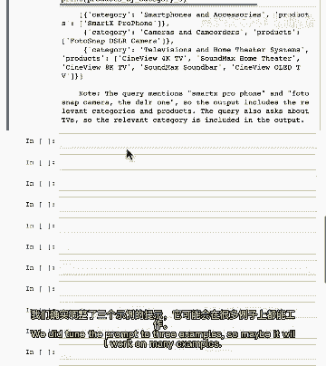

所以，也许我们将处理许多示例，但是，偶然地，你可能遇到另一个示例，它在生成错误，所以这个客户消息，也导致系统输出大量垃圾文本在末尾，我们不想要，试图通过添加所有这些额外文本来帮助，我们实际上不想要这个。

所以到这个点你可能已经运行过这个提示，也许在数百个例子上，也许你有测试用户，但你只会取例子，困难的是在做得不好的例子上，现在我有这个从零到四索引的五个例子集，有您用于进一步微调props的五个例子集。

并且在这两个例子中，lm输出了一些额外的垃圾文本，在最后，我们不想要这些，经过一些尝试和错误后，你可能决定修改提示如下。

所以这里有一个新的提示，这个被称为提示v2，但我们在这里做的是向提示中添加，不要输出任何额外的文本，不是json格式，只是为了强调，请勿输出这个json东西，并添加了第二个示例。

使用用户和助手消息进行少数示例提示，其中用户是最便宜的电脑，在少数示例中，我们都向系统展示了，一个响应，它只给出JSON输出，所以这是我们刚刚添加到问题输出中的额外内容，任何不是JSON格式的附加文本。

我们使用少数用户一，未来助手一和未来使用二未来助手二来给它，这些少数示例中的两个，所以让我按下Shift+Enter来找到这个提示，您应该返回并手动重新运行此提示，在所有五个用户输入示例中。

包括之前给出错误输出的这个示例，您会发现它现在给出了正确的输出，如果您返回并重新运行这个新的提示，这是提示版本v2在导致错误输出的客户消息示例中。

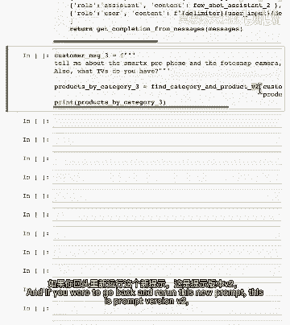

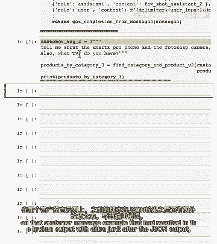

带有JSON输出后的额外垃圾，然后这将生成更好的输出。

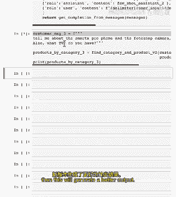

我在这里不会去做，但我鼓励您暂停视频并自己重新运行它于客户消息四，以及这个提示，v2，看看是否也生成了正确的输出，希望它会，我认为应该，当然，当您修改提示时，也有用于进行回归测试。

以确保在修复提示中的错误时，三和四，它没有破坏提示零的输出，要么，现在您可以看出，如果我必须复制粘贴，五个提示，客户搜索零，一，二，三和四，然后手动查看它们，看看它们是否输出在正确的类别和产品中。

所以您可以这样做，我可以看到这并说是的，卡尔加里电视和医疗数据系统产品，是的，看起来都包含了它们，但实际上，手动检查这是非常痛苦的，或者看到这些输出，以确保用眼睛看这是否正是正确的输出。

当您正在调整的开发集变得超过只是一小手把的示例时，然后开始有用于自动化测试过程的价值，所以这里是一个包含十个示例的集合，我明确指定十个客户消息，所以这是一条客户消息，我想购买一款既经济又理想的电视。

应该怎么做，你可以把这视为测试集中的正确答案，或者我应该说开发集，因为我们实际上正在调整这个，所以我们在这里收集了，十个示例，从零到九的索引，其中最后一个是，如果用户说我想要时间机器浴缸。

我们对此没有相关的产品，真的很抱歉，所以理想的答案是空集，现在，如果你想要自动评估，这些十个示例中提示做了什么，这里有一个函数可以做到这一点，它是一个很长的功能，你可以暂停视频并阅读它，如果你愿意。

但我只想演示它实际上在做什么。

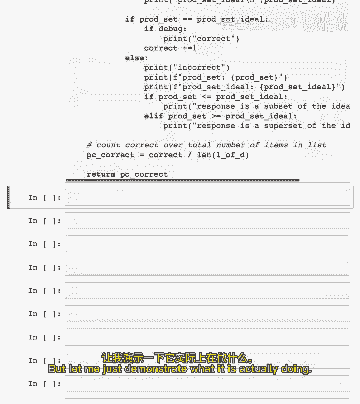

让我打印出针对客户消息的自定义消息。

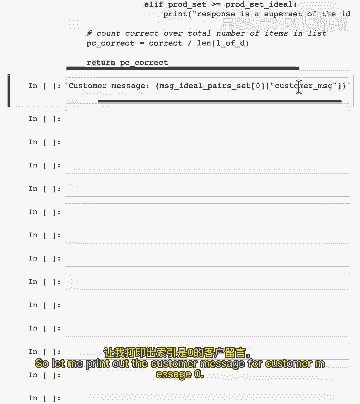

零对吧，所以，关于我可以购买哪些电视的客户消息。

如果我在预算范围内，让我们也打印出理想的答案。

所以理想的答案是这里所有我们想要提示检索的电视，让我现在调用提示，这是提示，V2对于这个客户消息，让我们打印它出来，然后我们将调用eval，我们将调用响应理想选项的eval。

以查看响应是否与理想答案匹配得好，在这种情况下，它确实输出了我们想要的类别，并且它输出了所有产品的完整列表，因此，它得到了一分，零，只是为了让你看一个例子。

它 turns out 我们知道它在示例七上错了，所以如果我将此更改为七并运行它，这就是它得到的，哦，让我更新这个为，七也，所以对于这个客户消息，这是理想的答案，应该在游戏机和配件下输出。

所以游戏机和配件的列表，但是，这里的响应有三个输出，而此处的响应有三个输出，实际上它应该有一个，两个，三个，四个五输出，因此它缺少了一些产品，所以我会做，如果我现在调整提示是。

我会然后使用for循环来遍历所有十个开发集示例，在那里我们反复拉取客户消息，获取理想的答案，正确的答案，调用以获取响应评估，然后您累积了一个平均值，让我运行这个酷的。

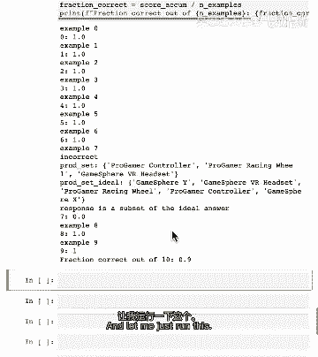

好的，好的，所以这将需要一段时间来运行，但当它运行完成，这是结果。

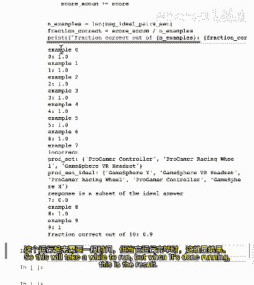

我们正在遍历十个示例，看起来示例七是错误的，因此百分比正确地，十个是九十 percent 正确。

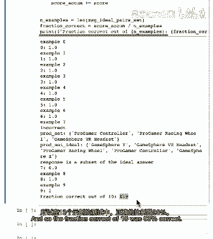

因此如果您调整了提示，您可以重新运行此以查看百分比正确是否上升或下降，您在笔记本中看到的就是正在执行步骤一，二和三的公告列表，并且这已经给出了一个相当好的开发集十个示例，与哪些用于调整和验证提示的示例。

如果您需要额外的严格性级别，然后您现在需要软件来收集一个随机样本的集，也许一百个示例及其输出，甚至可能超过那个到保持出测试集的严格性，那是您在调整提示时不会看的，但对于许多应用，停止在第三项公告。

但也有许多应用您可以做，您在我在Jupyter笔记本中看到的那样，并且可以很快得到一个相当性能的系统，再次，重要的警告是，如果您正在处理一个安全关键的应用，或一个存在非 trivial 伤害风险的应用。

那么当然，做正确的事情是实际上获取一个更大的测试集，在您使用它之前真正验证性能，这就是全部，我发现使用提示构建应用的工作流程与使用监督学习的工作流程非常不同，迭代的速度感觉更快，如果您还没有做过。

您可能会惊讶于仅基于几个精心手工挑选的困难示例构建的评估方法，您认为只有十个示例，对于几乎任何事情，这并不统计上有效，您认为只有十个示例，这并不适用于几乎任何事情，但是，当你实际使用此程序时。

你可能会感到惊讶，在帮助您和团队达到有效的提示集和有效系统方面，添加一把手可能非常有效，仅仅在开发集中添加一些复杂的示例，可能会产生很大的影响，从帮助您和团队达到有效的提示集和有效系统方面来看。

添加一把手可能非常有效，在这个视频中，输出的效果可以定量评估，就像有一个期望的输出，你可以知道它是否给出了这个期望的输出。

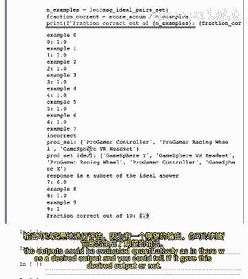

所以，在下一个视频中，让我们看看如何在那个设置中评估输出。