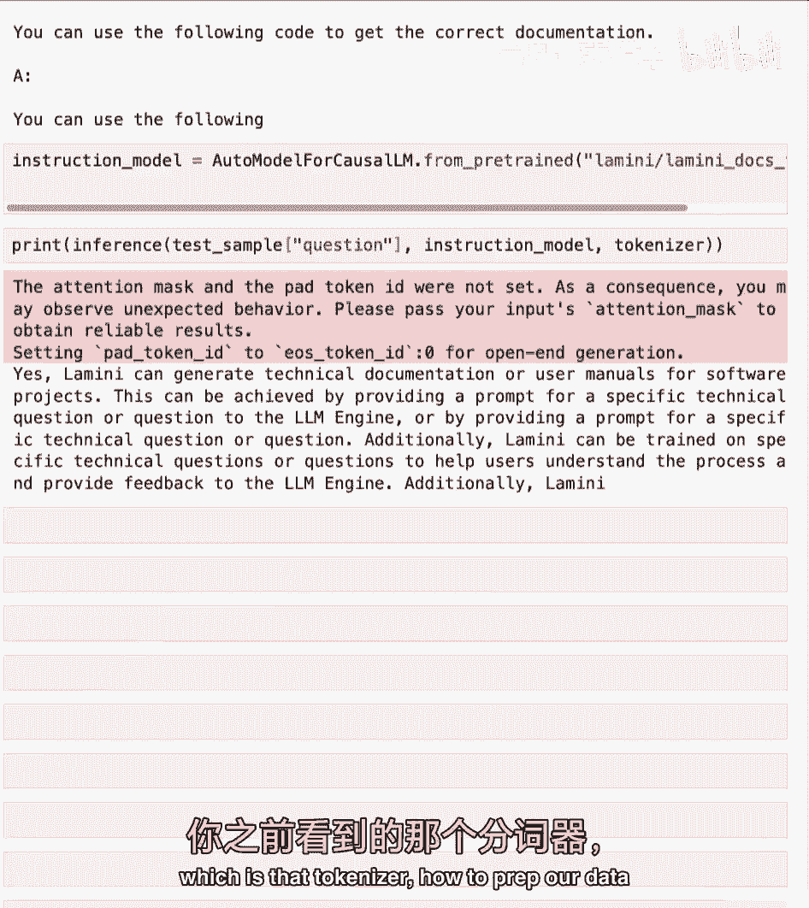
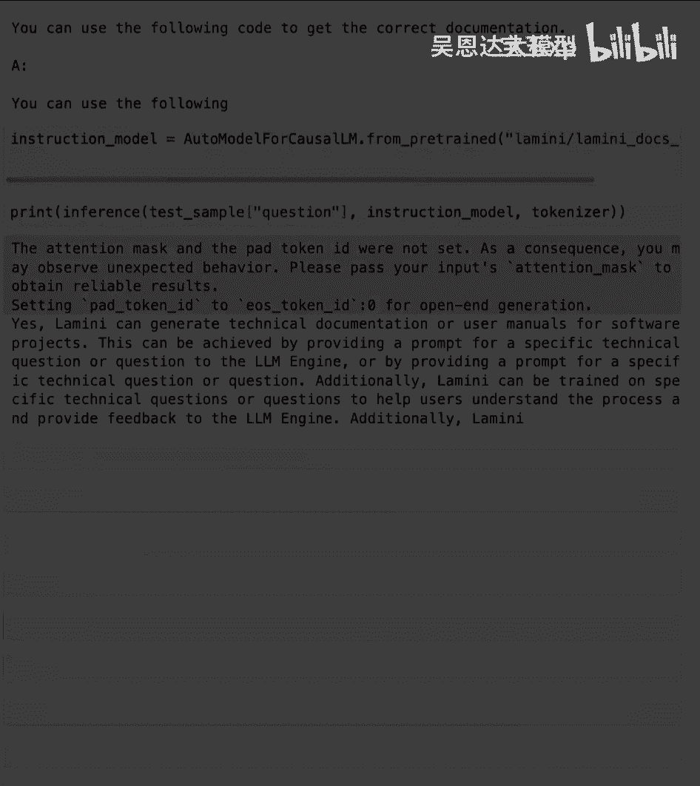

# (超爽中英!) 2024公认最全的【吴恩达大模型LLM】系列教程！附代码_LangChain_微调ChatGPT提示词_RAG模型应用_agent_生成式AI - P4：4-指令微调 - 吴恩达大模型 - BV1gLeueWE5N

本课将学习指令微调，一种使GPT-3成为聊天的微调变体，赋予GPT聊天能力的指令微调，与GPT聊天，好的，让我们开始为所有模型赋予聊天能力，好的，让我们深入了解指令微调，指令微调是一种微调类型。

你可以做很多其他任务，如推理，路由，Copilot（编写代码），聊天，不同代理，但具体是指令微调，你可能也听过指令调优或指令跟随，LLMs教模型遵循指令，更像聊天机器人，这是与模型交互的更好界面。

正如我们在Chagbt中看到的，这是将GPT-3变成ChatGPT的方法，这极大地增加了AI的采用率，从像我这样的少数研究人员，增加到数百万的人，对于指令跟随的数据集，你可以使用很多现成的。

无论是网上还是针对你公司的，可能是常见问题解答，客户，支持对话或Slack消息，所以这真的是对话数据集，或仅仅是指令响应数据集，当然，如果没有数据，没问题，你也可以将你的数据转换成。

更像问答格式或指令跟随格式，通过使用提示模板，所以你可以看到，你知道，一个读我可能会被转换成问答对，你也可以使用另一个LLM为你做这件事，斯坦福有一种称为Alpaca的技术。

它使用ChatGPT来做这件事，当然，你也可以使用不同开源模型的管道来做这件事，酷，我认为关于微调最酷的事情之一是，它教会了模型这种新的行为，虽然你可能对微调数据有，法国首都是什么？巴黎。

因为这些是容易获取的问答对，可将问答概念泛化至数据，可能未为微调数据集提供模型，但模型已在预存中学习，预训练步骤，可能是代码，实际来自ChatGPT论文的发现，模型现可回答关于代码的问题。

尽管他们没有关于该问题的问答对，用于指令微调，因为让程序员去，你知道，标记数据集，问关于代码的问题并编写代码，非常昂贵，微调不同步骤概述，数据准备，训练与评估，当然，评估模型后，需要再次准备数据以改进。

改进模型是一个迭代过程，特别是对于指令，微调和其他不同类型的微调数据准备是真正有差异的地方，这真的是你，你知道，改变你的数据，根据特定类型的微调定制你的数据，微调的具体任务，训练与评估非常相似。

所以现在让我们深入实验室，在那里你可以瞥见Alpaca的指令调优数据集，你还可以再次比较经过指令调优的模型与，未经过指令调优的模型，你还可以看到不同大小的模型，所以首先导入几个库，第一个重要的是。

从datasets库中的load_dataset函数，让我们加载这个指令调优数据集，这是指定Alpaca数据集，我们正在流式传输这个，因为这实际上是一个庞大的微调数据集，不像PILE，当然我们会加载它。

就像之前与PILE一样，你会查看一些示例，好吧，与PILE不同，不仅仅是文本，就在这里，它有点更结构化，但并不像，像问答对那样清晰，仅仅是问答对，关于这点真的很酷，你知道这是作者写的。

他们实际上有两个提示模板，因为他们想让模型能够处理两种不同类型的提示，本质上也是两种不同类型的任务，一个是你知道的指令遵循，其中有一组额外的输入，例如它，指令可能是加两个数字，输入可能是第一个数字是三。

第二个数字是四，然后有输入的提示模板，你可以在这些例子中看到，有时输入并不相关，所以它没有那个，所以这些是正在使用的提示模板，所以再次，与之前非常相似，你只需将这些提示水化并运行整个数据集。

让我们只打印出一对看看它看起来像什么酷，所以这是输入输出，你知道它是如何被水化到提示中的，所以它以响应结束，然后它输出这个响应，酷，就像之前一样你可以将其写入行文件。

你可以将其上传到hugging face hub，如果你想，我们实际上已经在lamini alpaca加载了它，所以它很稳定，你可以在那里查看它，你可以去使用它，好的很棒。

所以现在你已经看到了那个指令遵循数据集的样子，我认为接下来要做的就是再次提醒你这一点，告诉我如何训练我的狗坐下提示在不同模型上，第一个将是llama two模型，那又是没有指令调整的。

我们将运行告诉我如何训练我的狗坐下，好的，它又以句号开始，只是说这些，所以记住这一点然后现在我们将再次将其与，指令调整的模型进行比较，就在这里，好的，好多了，它实际上产生了不同的步骤。

最后我只想再次分享chat gbt，这样你就可以在这里进行比较，很好，好的，这是一个更大的模型集，你知道，待定的模型集相当大，与llama 2模型相比，实际上它们是70亿参数的模型。

Chagbt据称约为700亿，非常大的模型，你还会探索一些较小的模型，一个是7000万参数的模型，我在这里加载这些模型，这目前并不重要，你稍后会更多地探索这个，但我要加载两个不同的东西来处理数据。

然后运行模型，你可以看到，这里的标签是luther，Ai Pythia 7000万，这是一个未经指令调整的7000万参数模型，我要粘贴一些代码，这是一个运行推理的函数，或基本上是在文本上运行模型的函数。

我们将通过，你知道这些不同部分，了解这个函数中究竟发生了什么，在接下来的几个实验中，酷，所以该模型未经微调，它对公司一无所知，但我们可以再次加载之前的那个公司数据集。

所以我们将给这个模型来自该数据集的问题，可能是测试集中的第一个样本，例如，然后我们可以运行这个，问题是Lamini能否为软件项目生成技术文档或用户手册，实际答案是是的。

Lam和I可以生成软件项目的技术文档和用户手册，它还在继续，但模型的答案是，我对以下问题有疑问，如何获取正确的工作文档，我认为你需要使用以下代码等，所以它相当偏离，当然它学习了英语，它包含了文档这个词。

所以，它有点理解，也许我们处于问答设置中，因为它有一个答案，但显然它相当偏离，并且它并不完全理解这个数据集的知识，也不理解我们期待它表现的行为，所以它并不理解它应该回答这个问题，好的。

所以现在比较一下我们现在为你微调过的模型，但你实际上要微调以遵循指令，正在加载这个模型，然后我们可以通过该模型运行相同的问题并查看其表现，它说可以，无趣，我可以为软件项目生成技术文档或用户手册，等。

这比之前的准确得多，它遵循我们期望的正确行为，很好，现在你了解了指令跟随模型的作用，下一步正是你看到的高峰部分，即分词器。

