# (超爽中英!) 2024公认最全的【吴恩达大模型LLM】系列教程！附代码_LangChain_微调ChatGPT提示词_RAG模型应用_agent_生成式AI - P50：9——评估（下） - 吴恩达大模型 - BV1gLeueWE5N

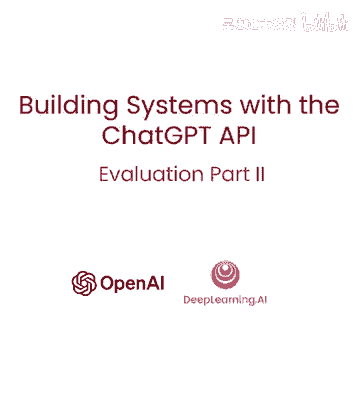

上视频中，你学习了如何评估输出，例如，答案正确，可写函数明确告知，如果LM输出正确类别和产品列表，但有些LM用于生成文本，仅有一正确文本，看看评估方法，这类LM输出，这是我的辅助函数和客户消息。

告诉我关于配置和全步相机等，获取助手答案的几个工具，基本上是EA早期视频中走过的过程，这是助手答案，你肯定得帮助智能手机，智能，等等，如何评估，这是否是好答案，似乎有很多可能的好答案。

一种评估方法是写评分表，即评估答案的不同维度的指南，然后用它来决定是否满意答案，让我展示如何做。

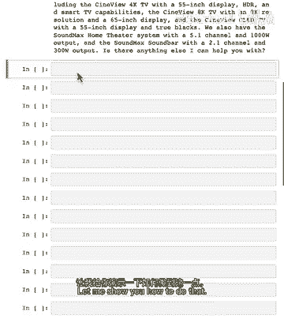

所以让我创建一个数据结构来存储客户消息和产品信息。

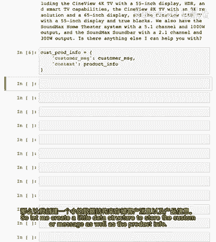

所以这里我将指定评估助手答案的提示，使用所谓的评分表，稍后解释这意味着什么，但此提示说在系统消息中，你处于系统，评估客户服务代理回答用户问题的效果，但在客户服务代理生成响应的上下文中。

所以此响应是我们上面笔记本中的，那是助手答案，我们将指定此问题中的数据是客户消息，是上下文，即提供的产品和类别信息，然后是LM的输出，这是评分表，我们希望LM比较工厂内容有限，至于内容，忽略，风格差异。

语法，标点，然后我们要检查几件事，如助手响应，仅基于提供的上下文，答案是否包含上下文中未提供的信息，响应和上下文之间是否有任何不一致，这称为评分表，这指我们认为的，答案应正确，我们才考虑是好答案。

最后我们想打印出是或否等，现在，如果我们运行此评估，这就是您得到的，系统响应基于提供的成本，它没有，在这种情况下似乎编造新信息。

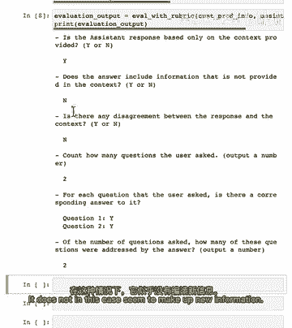

没有分歧，你问两个问题，回答问题一，回答问题二。

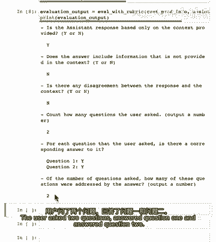

所以回答两个问题，所以我们可能会查看此输出并可能得出结论，这是一个很好的响应。

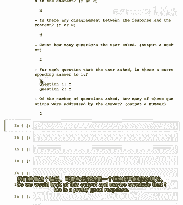

这里要注意。

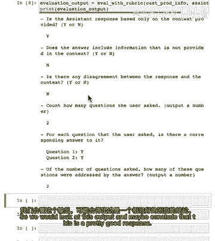

我正在使用chagpt 3。5 turbo模型进行此评估，对于更严格的评估。

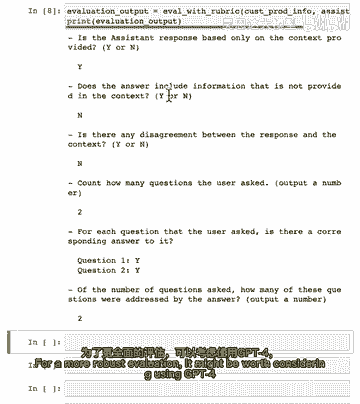

可能值得考虑使用gpt 4，因为即使您在生产中部署3。5 turbo并生成大量文本。

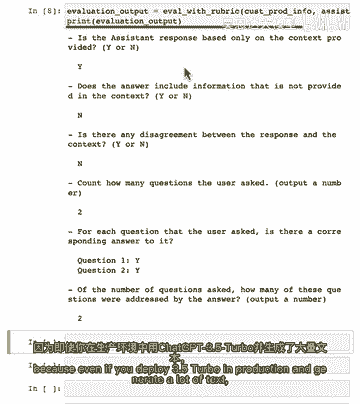

如果您的评估是最不频繁的练习。

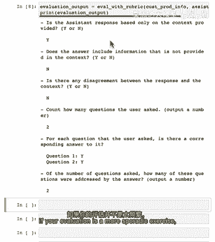

那么支付稍贵的gpt 4 API调用以获得更严格的输出评估可能是谨慎的。

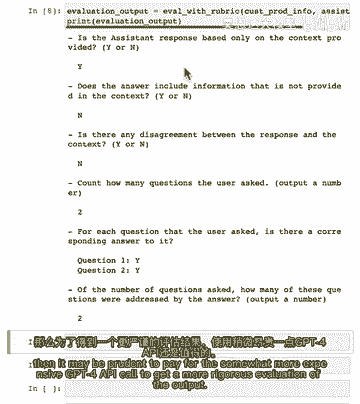

四个API调用以获得更严格的评估一个设计模式，我希望你从中学到，是当你可以指定一个评分标准意味着。

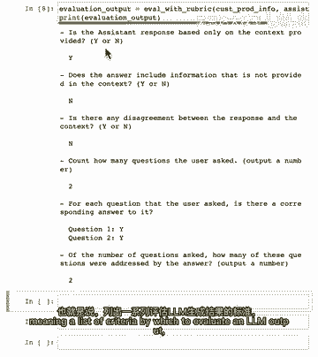

一个评估输出的标准列表。

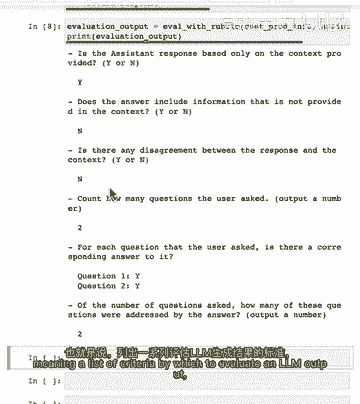

然后你可以实际上使用另一个API调用来评估你的第一个输出。

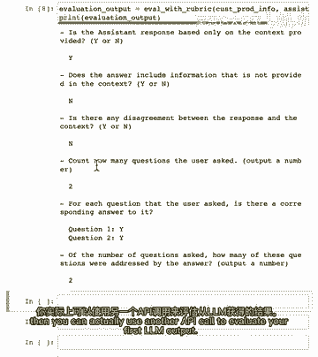

这是一个设计模式，可能对某些应用程序有用，即如果你可以指定一个理想响应。

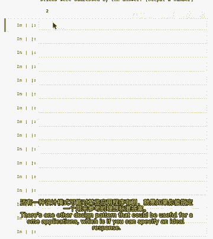

所以这里我将指定一个测试示例，客户消息是，告诉我关于简介等，所以这是理想的答案，所以如果你有一个专家，人类客户服务代表写了一个非常好的答案，专家说这将是一个很好的答案，当然。

间谍等继续提供很多有用的信息，现在，期望任何LM生成这个确切答案是不合理的，在经典自然语言处理技术中，有一些传统指标用于衡量，如果LM输出与这个专家人类编写的输出相似，例如。

有一个叫做蓝分数的bl eu，你可以在线搜索了解更多，它可以衡量一段文本与另一段文本的相似性，但结果证明有更好的方法，即你可以使用一个提示。

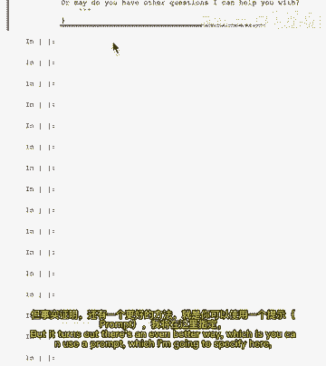

你想要在这里指定，要求LLM比较自动生成的客户服务代理输出，与由人类编写的理想专家响应相对应，我刚刚在上面显示的，这里是我们可以使用的提示，我们将使用LM并指示其为助手，评估客户服务代理回答问题的效果。

通过比较自动生成的响应与理想专家人类编写的响应，因此我们将提供数据，即客户请求和专家编写的理想响应，然后RLM实际输出了什么，此评分标准来自Open AI的开源Evils框架，这是一个出色的框架。

由OpenAI开发人员和更广泛的开放源代码社区贡献了许多评估方法，实际上，如果您愿意，您可以向该框架贡献一个评估，以帮助其他人评估他们的大型语言模型输出，因此，在此评分标准中。

我们告诉LM比较提交答案的事实内容与专家答案。

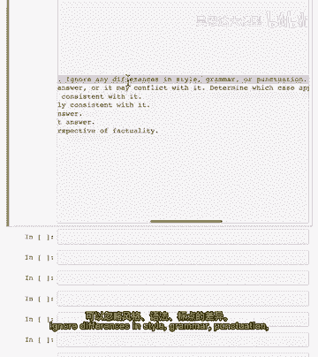

忽略风格差异，语法或标点符号，可以暂停视频并详细阅读此内容，但关键是要求它进行比较并输出从A到E的分数，取决于提交的答案是否是答案的子集，并且完全一致与答案相比，答案是专家答案的超集，但完全一致于它。

这可能意味着它产生了幻觉或编造了一些额外的事实，简单答案包含所有细节。

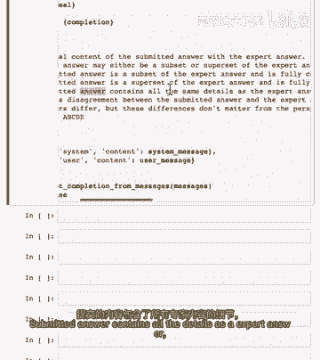

如专家答案，无论是否不同意或答案不同，但从实际性的角度来看这些差异并不重要。

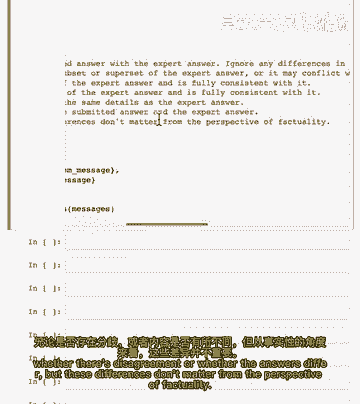

将选择，这些中看起来最合适的描述，这是刚才我们有的助手答案，我认为它是个很好的答案，但现在让我们看看它与助手答案的比较以测试那个想法，哦看起来它得到了一个A。

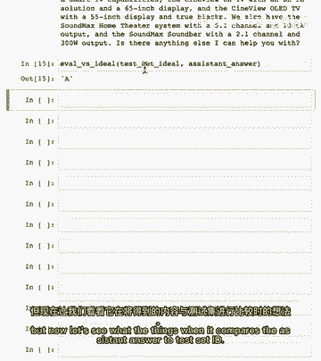

所以它认为提交的答案是专家答案的子集，并且完全一致于它，这听起来对我来说很对，这个助手答案比上面的长答案要短，但它希望再次是一致的，我在此示例中使用gpt 3。5 turbo，但为了更严格的评估。

在您自己的应用程序中可能更有意义使用gp 4，现在让我们尝试完全不同的东西，我将有一个非常不同的助手答案，生活就像一盒巧克力，来自电影《阿甘正传》的引用，如果我们评估它输出d。

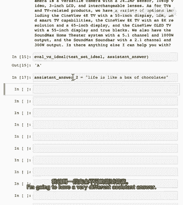

并得出结论提交的答案与答案之间存在分歧。

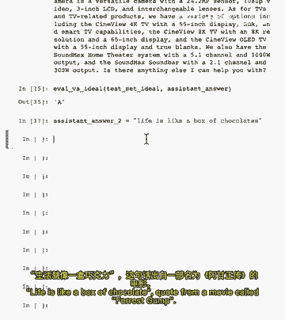

生活就像一盒巧克力与指数，存在分歧，存在分歧，正确评估此答案很糟糕，就这样，希望从视频中学习设计模式，即使没有专家提供的理想答案，若能编写评分标准，可用一个LM评估另一个的输出。

其次若能提供专家提供的理想答案，则可帮助你的LM更好地比较，若特定助手输出与专家提供的理想答案相似，希望帮助评估你的LM系统输出，因此，在开发过程中以及系统运行时，你可以继续监控其性能。

