# (超爽中英!) 2024公认最全的【吴恩达大模型LLM】系列教程！附代码_LangChain_微调ChatGPT提示词_RAG模型应用_agent_生成式AI - P53：2：NLP 任务接口 - 吴恩达大模型 - BV1gLeueWE5N

在第一节课中，我们将构建两个自然语言处理应用，一个用于文本摘要的应用和一个用于命名实体识别的应用，使用梯度用户界面，让我们深入其中，欢迎来到课程的第一节课。

使用广播与团队或社区获取反馈来构建生成式AI应用。

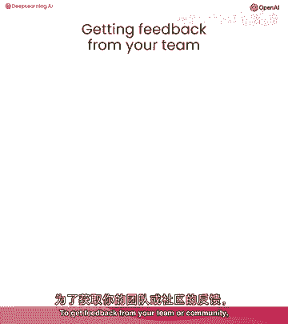

为他们提供一个不需要他们运行的用户界面可以非常有帮助，任何代码梯度都让你能够快速构建这个用户界面，并且不需要写太多代码。

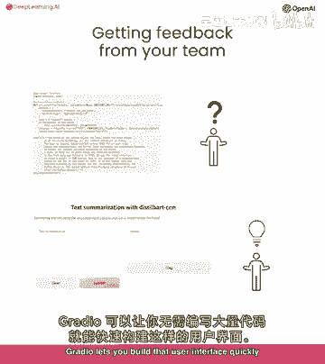

当你有一个特定的任务在 mind，例如，总结文本，一个专门为那个特定任务设计的小型专家模型可以执行。

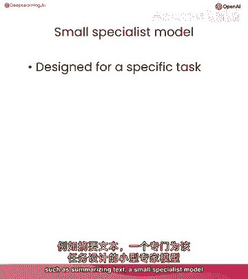

与通用目的的大型语言模型一样好。

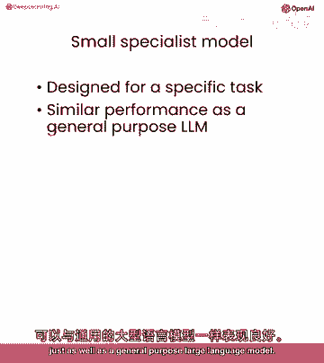

在这里，一个小型的专家模型也可以更便宜、更快地运行。

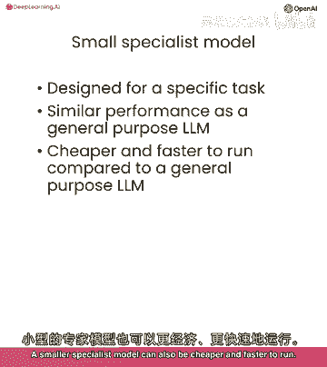

您将构建一个可以执行两个nlp任务的应用程序，总结文本和命名密度识别，使用为这两个任务设计的两个专家模型。

所以首先，我们将设置我们的api密钥，然后，我们将设置我们的辅助函数，使用总结端点，在这里，我们有一个推断端点的端点，与课程中设置的API密钥一起工作的API，并且这个API本质上是在调用一个函数。

如果你在本地运行它，它将看起来像这样，所以我们从Hugging Face Transformers库中导入了管道函数，我们选择了模型仍然使用CNN进行文本摘要，因为它是文本摘要的当前最佳模型之一。

实际上，如果我们使用Transformers的管道函数进行文本摘要，如果没有明确指定模型，它将默认为静态部分cnn，因为这个模型专门为任何文本的摘要而构建，它将输出它的摘要。

因为速度和成本对于任何应用都重要，专家模型，与通用目的相反，大型语言模型可以既便宜运行又提供更快的用户响应，另一种提高成本和速度的方式，是创建模型的一个小型版本，该版本具有非常相似的性能。

这是一个叫做荒芜的过程，荒芜使用大型模型的预测来训练小型模型，所以，我们使用的模型，barcnn，实际上是一个蒸馏模型，基于由Facebook训练的大型模型，被称为bart的大，Cnn对于这个课程。

我们在服务器上运行这些模型，并通过API调用访问它们，如果你在自己的机器上本地运行模型，你将使用这段代码，但由于我们不直接在这个教室中运行模型，我将删除这段代码，好的。

所以这就是我们关于埃菲尔铁塔和其建设历史的一点小文本，实际上，这段文本相当长，我自己都没有全部阅读，但这就是我们有摘要任务的原因，所以我们运行代码，就可以看到摘要，所以埃菲尔铁塔很高，它是最高的。

但它被超越了，它是世界上第一个结构，太酷了，它给我们提供了一点描述，这就是我们想要的，但如果你想要让你的团队或beta测试社区尝试你的模式，也许给他们运行代码并不是最佳的用户体验。

特别是如果你的用户不熟悉编程，或者如你所见，你的模式有一些选项会使其难以尝试，即使你的用户是程序员，这就是gracan可以帮助的地方，所以让我们从导入radial sgr开始，接下来。

我们将定义一个名为summarize的功能，它接受一个输入字符串，调用我们 earlier 定義的get completion函数，并返回摘要，接下来。

我们将使用gradient interface函数，传递函数的名称，我们刚刚定义的summarize，设置输入为文本，输出也为文本，然后调用demo launch来创建用户界面。

所以让我们来看看这有多酷，我们有我们的第一个演示，所以这里我会复制粘贴来自埃菲尔铁塔的文本，这里是摘要，现在，你有一个漂亮的用户界面，现在，为你想要摘要的任何文本复制粘贴变得更加容易，例如。

如果你去维基百科的前页，你可以找到一些要摘要的文本，我在这里找到了一些关于这种岩石或矿物质的信息，叫做沃尔芬泰，让我们摘要一下，不错，所以这里是所有文本的摘要，你可以在这里暂停并去你最喜欢的网站。

复制一些文本并粘贴到应用程序中，这是我们的第一个演示，我们可以继续尝试自定义用户界面。

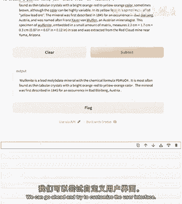

例如，现在，它只是说输入和输出，我们可以自定义这些标签，如果我们将输入和输出替换为梯度组件文本框，gr点文本框，让我们给它添加一些标签，所以我们可以将输入标记为文本，总结来说，让我们将输出标记为结果。

让我们看看这个效果如何。

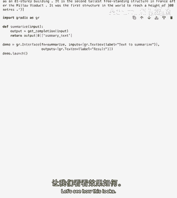

您在这里可以暂停并选择输入和输出的自己标签，好的，所以我们这里有一个非常漂亮的应用，但可能您想要使人们明确知道他们可以粘贴长段落的文本，现在，如果用户看到像这样的文本框。

他们可能会认为模型只能接受一行文本，我们可以将这个文本框转换为一个更高的文本字段，这样可以接受多行文本来做到这一点，我们使用lines参数如果您将lines等于6。

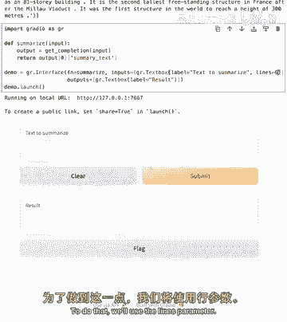

请注意，这里的文本字段现在稍微高一些，我们也可以设置summary的lines参数说3，这就是我们得到的。

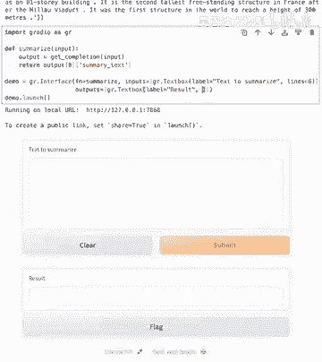

我们还可以为此应用程序添加标题，所以让我们称这个文本摘要为still bart文本摘要，cnn。

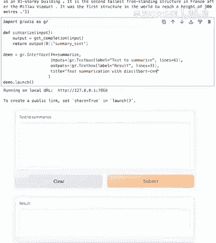

我们可以添加应用程序做什么的描述。

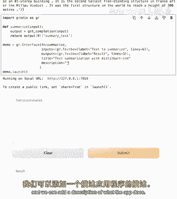

我们现在在这些应用程序中在本地显示Jupyter笔记本，但如果您在自己的机器上尝试这个，并且您想要通过互联网与朋友分享这个应用程序，您实际上可以创建一个链接，您的朋友或同事可以使用。

在他们的Web浏览器中查看您的应用程序，为了更新此，demo点，启动与分享等于通过，它输出运行在公共URL。

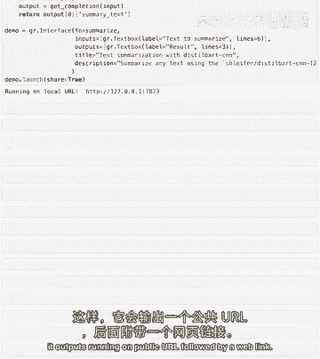

跟随一个Web链接，如果您分享此链接给任何人。

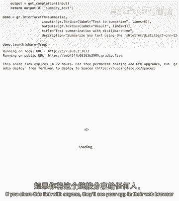

他们将在他们的Web浏览器中看到您的应用程序，并能够测试出您在自己的机器上运行的模型，在这个课程中，我们将在本地显示应用程序在Jupyter笔记本中，所以我不会设置share等于true。

但在您自己计算机上使用radio时，您感到自由设置，share等于true并分享公共链接给他人，下一个。

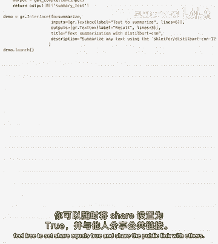

我们将构建一个应用程序，该应用程序执行名称密度识别，我的意思是，模型将接受文本并标记某些单词为人员，机构或地点，我们将使用基于鸟类的名称密度识别模型。

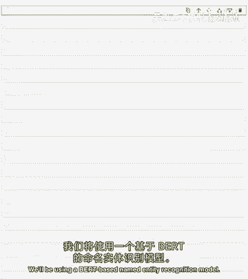

鸟类是一种通用的自然语言处理模型，可以进行许多NLP任务，但我们正在使用的模型已经被专门精细调整，以在名称密度识别任务中达到最先进的性能，它识别四种实体类型，地理位置和组织，人和其他，一种开源模型。

像这样的模型也可以被精细调整以识别您特定用例的特定实体，与课程中的所有模型一样，我们在服务器上运行这些模型，通过API端点访问它们。

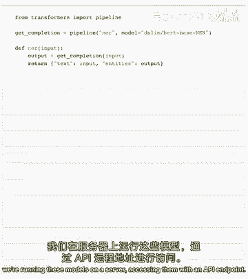

所以这里我们有API端点，这里是现在的输入文本，让我们调用get completion函数，参数等于none，设置端点URL。

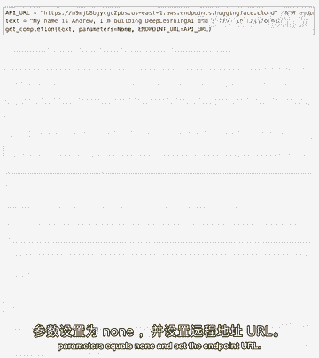

当我运行这个，它输出了一个包含每个字典的实体信息的列表。

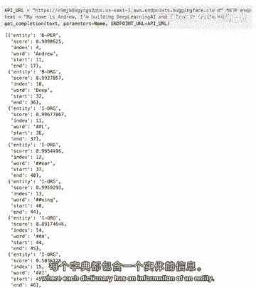

例如，它识别了安德鲁为一个人。

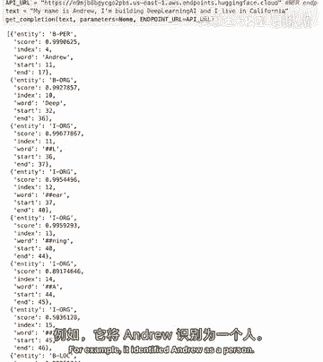

这种原始输出对下游软件应用程序可能有用。

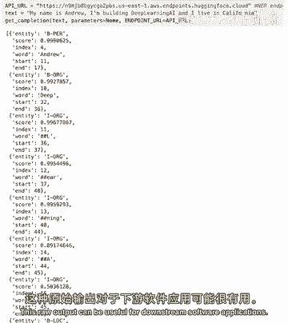

但如果你想要使输出更友好于人类用户，你可以使输出更加视觉上易于消化。

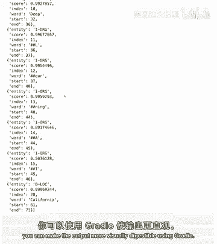

使用无线电来做到这一点，让我们定义一个函数，该梯度应用程序将调用，以访问模型。

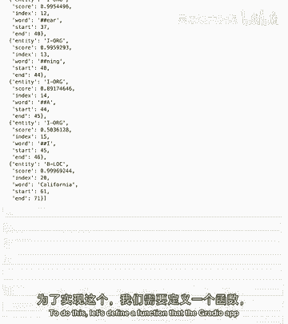

让我们称它为n a r，它调用获取完成函数，并返回原始输入文本和模型返回的实体，所以这里我们将进行一个与代码的演示。

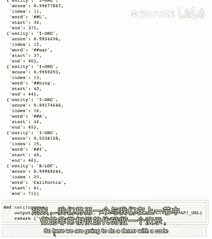

这与我们上次部分非常相似，其中，基本上我们有带有梯度文本框的输入，但 here 输出有一个不同参数，那就是高亮文本，然后我们将在一秒钟后看到那意味着什么，我们有一个标题，一个描述。

我们添加一个允许标记等于的标志，从不，因为如果我们回到这里。

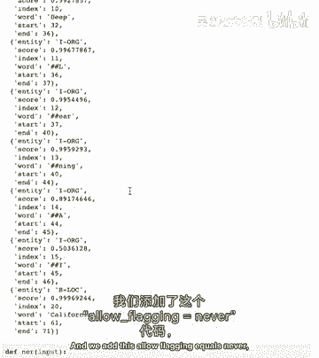

你可以看到，由默认设置，这里有一个标记按钮。

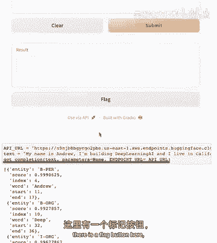

它允许用户标记不适当的回应，但如果你的应用程序不需要那个，我们可以用这段代码隐藏那个按钮，我在这里还介绍了两个你应用程序的输入文本示例，所以，你的用户可以点击示例中的一个来将这些输入到模型中。

并看到一个示例，显示你的应用如何工作，所以，对于一个梯度演示，我们将有我们的名称密度识别函数，其中，它将输入梯度输入，然后，它将运行我们之前做的获取完成函数，并返回文本，这将就像输入和实体一样。

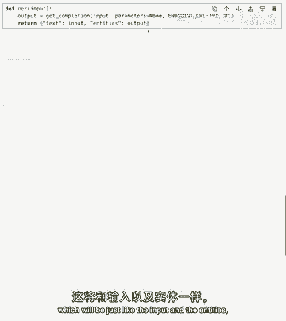

这就是名称密度识别模型为我们返回的整个实体列表。

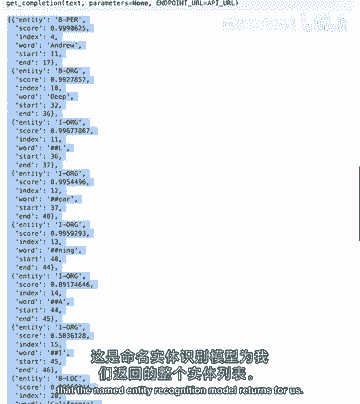

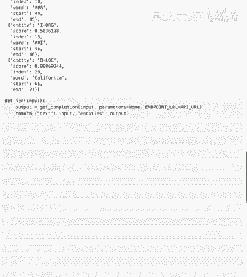

在这里，我们有我们的渐变演示，那么让我们运行它，看看它看起来如何，在这里，我们可以看到它与我们之前在文本摘要中演示的类似，我们有像那里的梯度文本框功能，但在这里，我们有一种新的输出。

这是一种高亮文本输出，而高亮文本输出的作用是，它可以接受实体的输出，这是之前我们展示的名称实体识别模型中的实体，我们还有示例，所以这里我们有一个新的区域叫做示例，基本上。

它帮助应用程序的用户理解如何通过示例来工作。

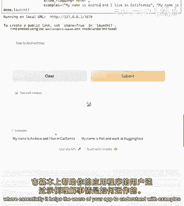

所以让我们使用其中一个示例并提交它。

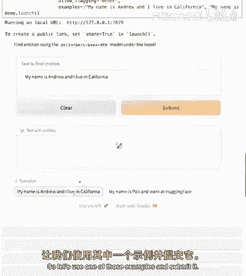

你可以看到，哦，它工作得非常好，现在让我们尝试这个其他示例，你可以看到，这里它工作了，在这里，你可以看到它识别了poly为一个人并识别了hugging faces为一个组织，但你也可以看到。

它分解了单词为这个ch，所以这里你可以看到poly有两个片段，和hugging faces分解为这个片段，这些片段被称为标记，标记是语言中常见出现的短字符序列，所以更长的单词由多个标记组成。

模型想要这样做的原因是为了效率，所以你想要让模型以它能获得的最少标记进行训练，而不是一个标记一个单词，这将非常低效，你有字符组的分组，这些字符组的大小可以变化，取决于模型，在这里。

你可以看到实体标签以字母b开头，表示开始标记，在这里我们有这个字母i，它指示它是一个中间标记，组织实体hugging face由开始标记识别，可以跟随一个或多个中间标记，虽然对于面向用户的应用程序来说。

有时看到单个标记可能有帮助，你可能只想显示hugging face作为单个单词，我们可以编写一些代码来合并这些标记，所以这里你可以看到，我们有我们的合并标记函数，为了将每个标记视觉化为一个单词。

我们可以使用此函数，我们可以在这里使用此函数，合并标记在这里，所以让我们运行我们的代码，看看发生了什么，现在，我在这里添加了一些更多的实体，哦，所以现在将paul合并为一个单词，维也纳是地点。

hugging face也是，我还添加了一些上下文，你可以看到，它也连接了所有这些单词，我是如何做到的呢，我创建了这个合并标记函数，它基本上从我们上次的标记中获取标记，并且检查它们是否以字母i开头。

这些标记与前面的以字母b标记的标记合并，这里还有一个小的更正，我们将其删除，如果我们回到这里，你可以看到他们在中间标记中。

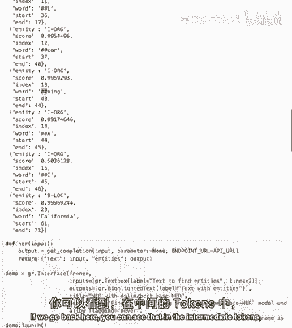

它添加了我们不想向用户显示的哈希标记，所以这里的代码正在删除它们，然后，将标记合并为一个字符串，这个代码也计算了分数的平均值，但由于应用程序不显示分数，它可以暂时忽略这一点，这就是全部。

我们有我们的名称密度识别应用，恭喜你构建了你的第一个两个广播应用，我鼓励你尝试找到一个句子，或尝试想出一个包含实体的句子，比如你的名字，你住在哪里，或你工作在哪里，并测试模型在那个上看看它如何行为。

在结束这个课程之前，还有一点，因为我们打开了许多端口以运行多个广播应用。

你可能想要清理你的端口，运行广播。

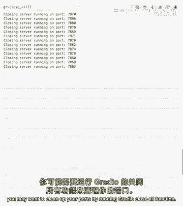

在下一节课中关闭所有函数，你超越了文本输入，通过构建一个图像描述应用，该应用接受一张图像，并输出描述该图像的文本。

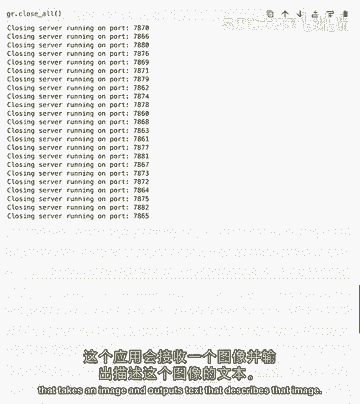