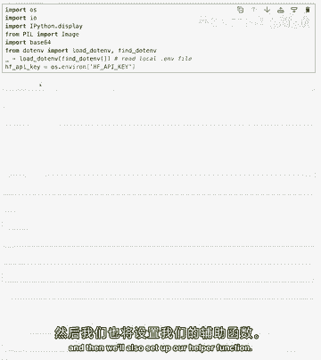
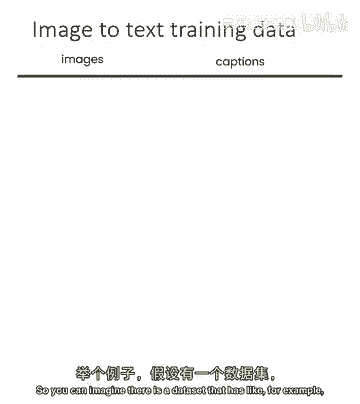
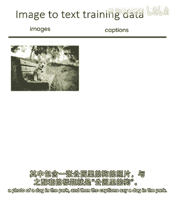
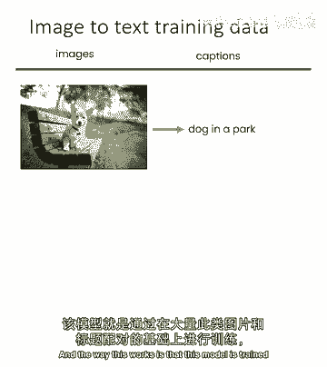
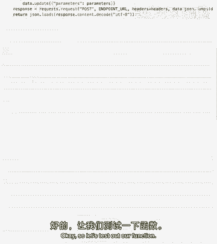
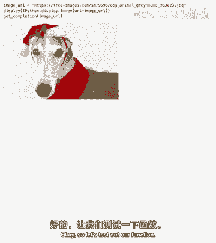
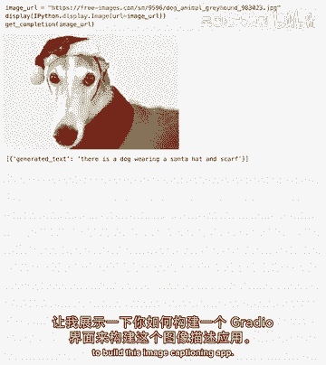
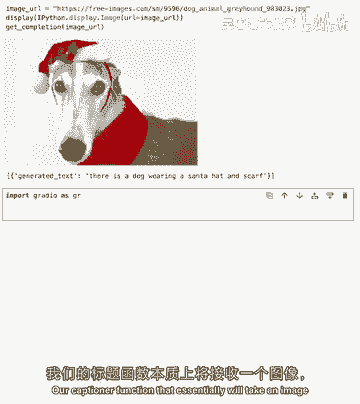
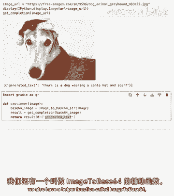
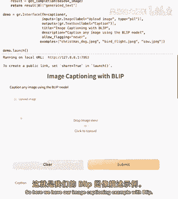

# (超爽中英!) 2024公认最全的【吴恩达大模型LLM】系列教程！附代码_LangChain_微调ChatGPT提示词_RAG模型应用_agent_生成式AI - P54：3：图片描述应用 - 吴恩达大模型 - BV1gLeueWE5N

现在我们要构建一个图像标题生成应用，使用开源的图像到文本模型，我们将再次设置API密钥，然后还将设置辅助函数。

这里有一个图像到文本的端点，这是Salesforce Blip图像标题生成模型的端点，基本上它是一个接收图像作为输入的模型，并输出所述图像的标题，这是一个在图像及其相应标题的管道上训练的模型。

所以你可以想象有一个数据集，其中包含类似。

例如，公园里的一只狗的照片。

然后标题说公园里的一只狗，这个工作方式是，这个模型在数百万这样的图像和文本标题对上进行训练。

以一种它们学习预测的方式，如果它看到新的图像，标题是什么，好的。

所以让我们测试一下我们的函数，我们使用一个免费图像的URL。

你可以在这里看到它显示，是的，我们可以看到我们拿了这张图片，标题已生成，一只戴着中心隐藏和围巾的狗听起来不错，让我们向您展示如何构建一个无线电接口来构建此图像标题生成应用。

我们将从导入无线电开始，这里我们有两个函数，我们的标题生成器函数，本质上将获取图像。

我们将运行获取完成函数，并将返回生成的文本，在特定情况下，我们还有一个名为image_to_base64的辅助函数。

它基本上将我们的图像转换为这种base64格式，这是API所需的格式，如果您在本地运行模型，您不必担心这一点，但由于我们正在运行，呃，在API格式中，我们需要将其转换为base64并返回才能正确运行。

所以在这里，与我们在上一课中一样，我们有完全相同的结构，所以我们有输入，输出，标题，描述和一些示例，所以这里我们有使用Blip的图像标题生成示例。

我们可以看到应用程序看起来与之前的非常相似，但它有这个漂亮的上传图像字段，如果我们回到代码，可以看到所有字段与上节课相同，除了输入字段中有这个单选图片，这是一个我们之前未用过的组件，当图片组件是输入时。

可以看到它变成了一个上传图片字段，随意上传你路径的照片，或者你的孩子看看它是如何描述的，也许是你周围的一些可爱的东西，你现在可以拍张照片，如果你愿意，发送并放在这里，或者你可以直接浏览这些示例，例如。

让我们回到之前看到的狗，看看，如果它给出了相同的标题，它确实如此，关于这只鸟这里，它会说空中有一只鸟，这是真的，这里有一头生气的牛对你，但我们希望它不会说它不会，它说有两头牛。

所以它没有识别出这另一头牛，像这头十分之一的牛作为一头新牛，它然后在一个有湖的背景的田野里，这已经很完整了，尽管我不完全确定这是一个湖，但总体上它做得相当不错，现在我们知道如何构建一个标题应用。

