# (超爽中英!) 2024公认最全的【吴恩达大模型LLM】系列教程！附代码_LangChain_微调ChatGPT提示词_RAG模型应用_agent_生成式AI - P56：5：图文互生游戏 - 吴恩达大模型 - BV1gLeueWE5N

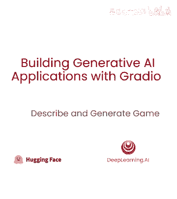

本课内容，将之前学过的文本到图像和图像到文本整合到一个有趣的应用中，可以玩耍，之前课程，学习了如何构建NLP应用的gradle应用，如何构建字幕应用，如何构建文本到图像应用。

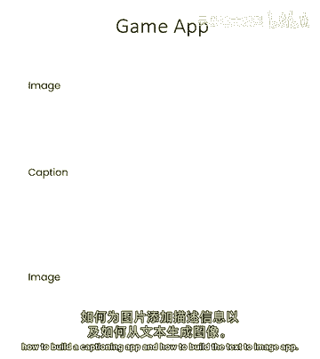

现在让我们整合其他课程学到的知识，在本游戏中构建一个酷游戏，从字幕开始，然后从该字幕生成新图像。

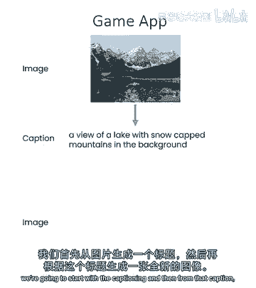

先进行常规导入。

在辅助函数中。

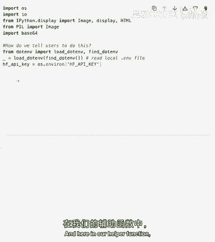

可以看到这里有一个空端点URL和两个端点变量，因为基本上这节课将使用两个API，文本到图像API和图像到文本API，让我们从第3和第4课引入函数，图像到base64，base64到图像。

生成字幕的captioner，接受图像生成字幕，generate函数，接受文本生成图像，开始吧，导入gra，构建简单的字幕应用，可以看到上传图像，生成字幕，生成的字幕输出。

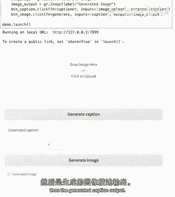

然后从该输出生成图像，如何做到？本质上非常简单的使用radio blocks，使用两个按钮，按钮字幕和按钮图像，每个按钮都有自己的函数，按钮字幕将调用captioner函数，输入为图像上传，输出为字幕。

就像之前单元格中那样，但按钮图像将取最后函数的输出，即字幕，放入generate函数，然后输出图像，让我们看看效果。

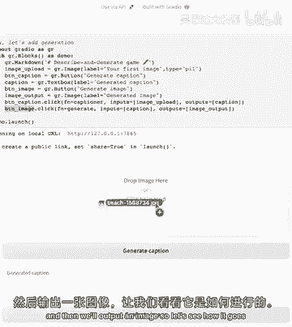

这里上传图像，生成其字幕，从该字幕点击生成图像，将生成新图像，我们可以玩电话游戏，上传图像，它将字幕该图像，我们使用该字幕，然后生成新图像，然后可回传此图，鼓励你尝试，将生成的图回传第一张，生成新字幕。

重复几次，看是否不同，或总保持主题，这很酷，但可能想要更简洁，某种程度上这很好，可生成字幕，查看效果，然后点生成图，某种程度上有两个按钮，有些人可能觉得困惑或太多。

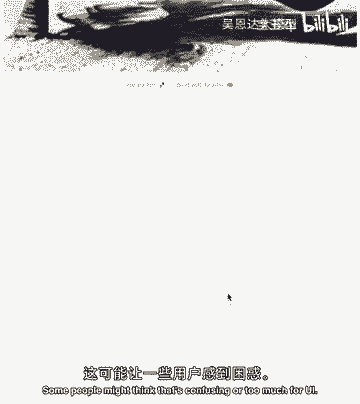

完全取决于你，但想展示简洁版，有一个单一功能，称为字幕生成，包含字幕和生成，然后以更简洁方式玩游戏，仅上传图片。

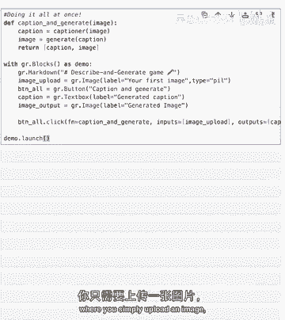

按字幕生成按钮，然后一次获得字幕和生成图，看看会怎样。

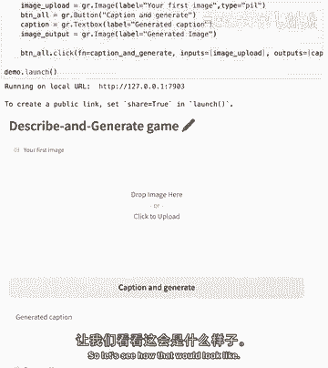

上传办公室的羊驼钥匙扣图片。

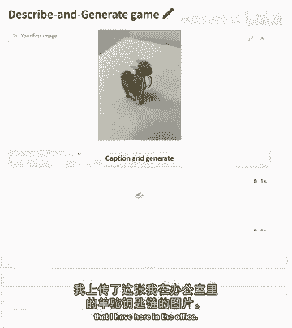

看看会同时生成什么字幕。

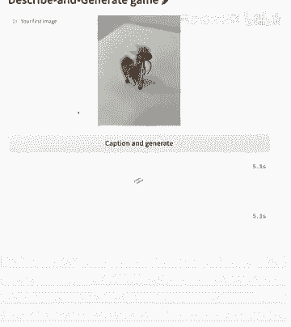

好的，脖子上有红丝带的迷你玩具羊驼。

听起来不错，是的，生成了这种可爱的小羊驼和脖子下的丝带，是的，鼓励你拍周围的东西，或电脑里可爱的图片。

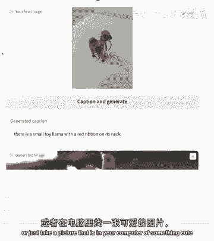

看字幕模型和下游图像如何生成，主要想展示的是，一次完成两个任务的简洁模型，和稍复杂的模型，有两个按钮，可分两步生成，恭喜，你已用Radio构建第一个游戏，结合从文本到图像到图像到文本所学。

在一个非常简单的应用中，在下一课。