# (超爽中英!) 2024公认最全的【吴恩达大模型LLM】系列教程！附代码_LangChain_微调ChatGPT提示词_RAG模型应用_agent_生成式AI - P66：介绍LLM和生成式AI项目的生命周期3——生成式AI和大语言模型的输出 - 吴恩达大模型 - BV1gLeueWE5N

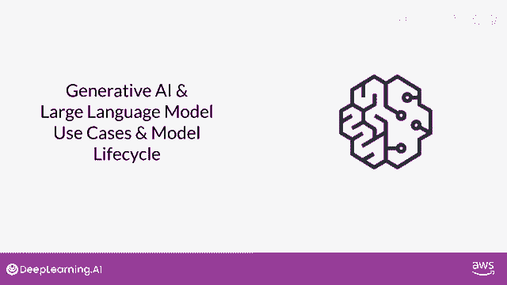

好的，让我们开始在这门课程中，我们将设置场景，我们将谈论大型语言模型，它们的应用场景，模型如何工作，提示工程，如何生成创造性的文本输出，并概述生成式ai项目的项目生命周期，鉴于你对这门课程的兴趣。

可以说，这可能是安全的，你已经有机会尝试过生成式AI工具。

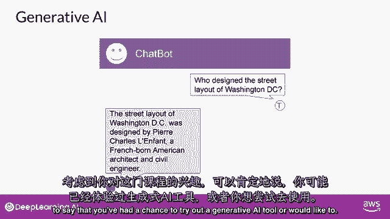

或者想要，无论是聊天机器人，从文本生成图像。

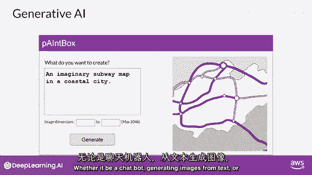

还是使用插件来帮助你开发代码，你在这些工具中看到的，是一台能够创建模仿或近似人类能力的机器，生成式AI是传统机器学习的一个子集，并支撑生成式AI的机器学习模型通过找到统计模式来学习这些能力。

在大量的由人类原生成成的内容数据集中，大规模的语言模型已经在数周数月的时间内训练了万亿个单词，并且使用了大量的计算资源。

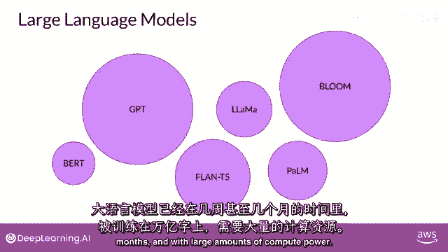

这些基础模型，像我们所说的，拥有亿级别的参数，展现出超越语言本身的涌现特性，研究者们正在解锁它们分解复杂任务的能力，在这里，推理和解决问题是一系列基础模型的集合，有时被称为基础模型和它们的相对大小。

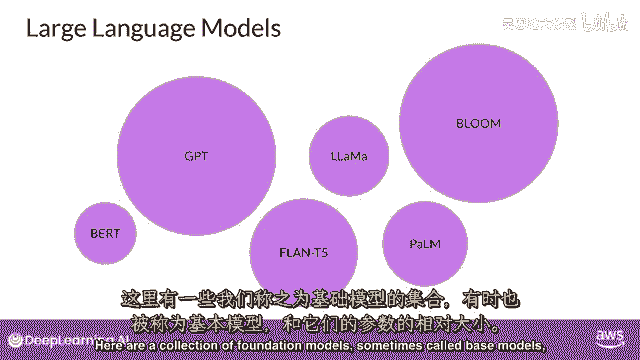

以参数来衡量，稍后我们将更详细地讨论这些参数，但现在把它们看作是模型的记忆。

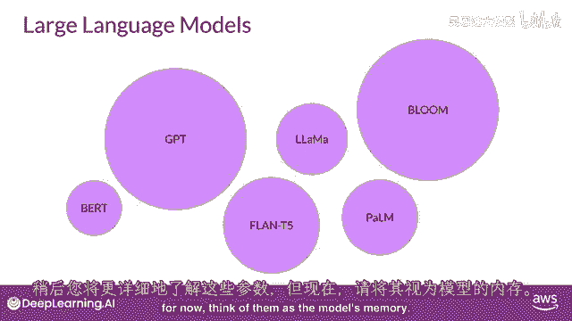

一个模型拥有的参数越多，它就需要更多的记忆，结果证明，在整个课程中，它们能够完成的任务就越复杂。

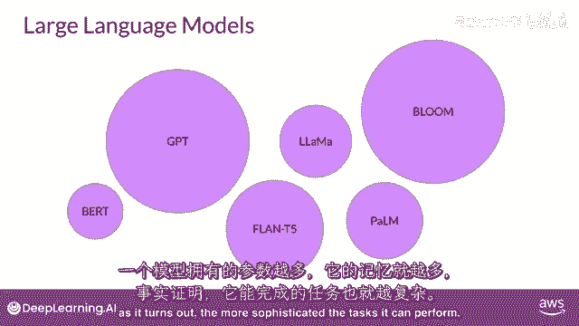

我们将用这些紫色圆圈来表示llms。

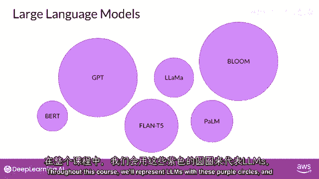

在实验室中，你将使用特定的开源模型，Flan T5用于执行语言任务，可以通过使用这些模型本身。

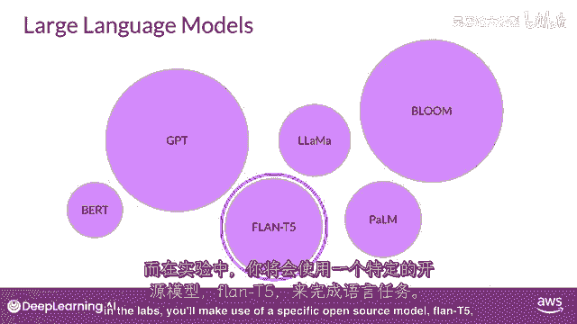

或者通过应用微调技术来适应您的特定用例，你现在可以快速构建定制的解决方案，无需从头训练一个新的模型。

虽然生成式AI模型正在为多个模态创建，包括图像，视频，音频和语音，在这个课程中，你将专注于大型语言模型及其自然语言生成的使用，你将看到它们是如何构建和训练的，如何通过文本与它们交互，被称为提示。

以及如何根据您的使用案例和数据微调模型，并且你如何将这些部署到应用程序中，以解决你的商业和社会任务，你与语言模型互动的方式与其他机器学习和编程范式有很大的不同，在这些情况下。

你使用正式语法的计算机代码与库和API进行交互，相比之下，大型语言模型能够处理自然语言或人类编写的指令，并执行任务。

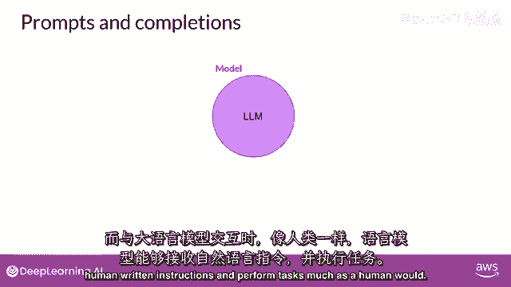

就像人类一样，你传递给llm的文本是被称为提示的文本。

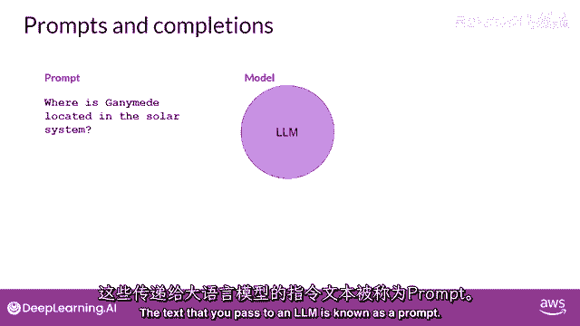

可用给提示的空间或内存被称为上下文窗口，通常足够大以容纳数千个单词，但与模型不同。

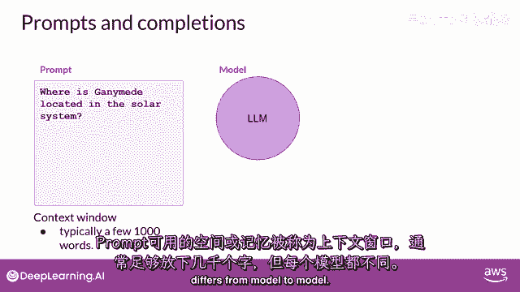

在这个例子中，你问模型甘ymede在太阳系中的位置在哪里。

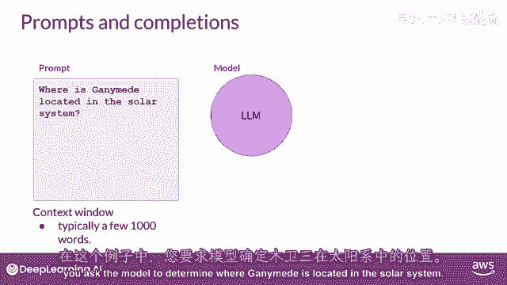

提示被传递给模型，模型然后预测下一个单词，因为你的提示包含一个问题，这个模型生成了一个答案。

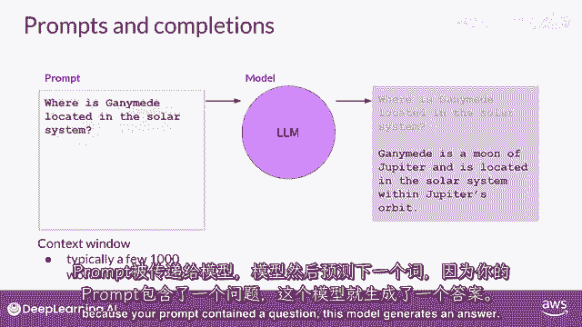

模型的输出被称为完成，使用模型生成文本的行为被称为推理。

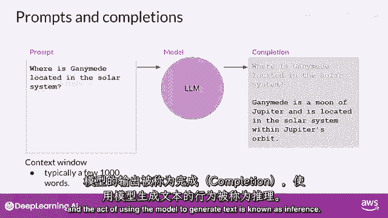

完成由原始提示中包含的文本组成，跟随生成的文本，你可以看到，这个模型做得很好，回答了你的问题。

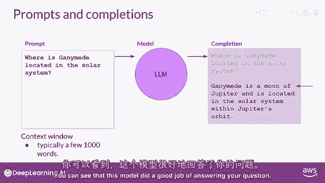

它正确地识别出甘ymede是木星的卫星，并生成了对你问题的合理答案，指出卫星位于木星的轨道中。

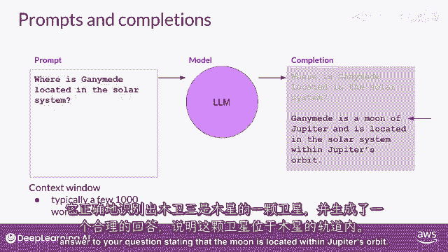

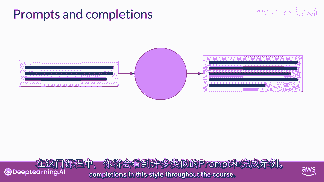