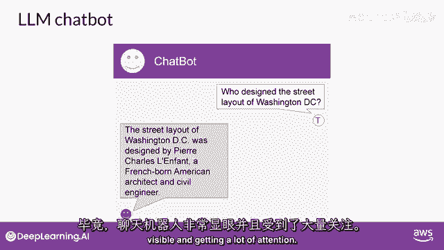
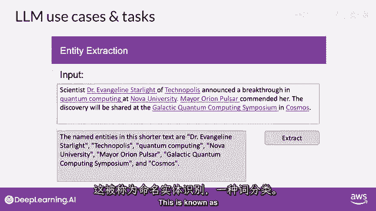
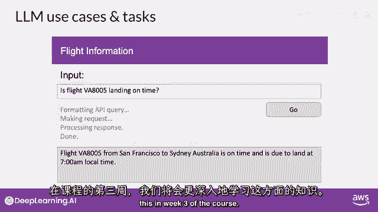
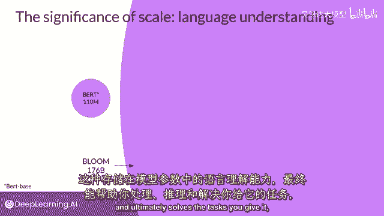

# (超爽中英!) 2024公认最全的【吴恩达大模型LLM】系列教程！附代码_LangChain_微调ChatGPT提示词_RAG模型应用_agent_生成式AI - P67：介绍LLM和生成式AI项目的生命周期4——LLM的使用案例和任务 - 吴恩达大模型 - BV1gLeueWE5N

你可能会认为llms和生成式ai主要专注于聊天任务，毕竟聊天机器人非常可见，得到了很多关注。

下一个词预测是许多不同能力的基础概念，从基本的聊天机器人开始，然而，你可以用这个概念上简单的技术来完成文本生成中的各种其他任务，例如，你可以要求模型根据提示写一篇总结对话的论文，其中。

你将对话作为提示的一部分提供，而模型将使用这些数据，与其理解自然语言生成摘要的能力一起，你可以使用模型进行各种翻译任务，从传统的两种不同语言之间的翻译开始，例如，法语和德语，或者英语和西班牙。

或者将自然语言翻译成机器代码，例如，你可以要求模型编写一些Python代码，这将返回数据框中每列的平均值，并且模型将生成你可以传递给解释器的代码，你可以使用LLMs来执行像信息检索这样的小而专注的任务。

例如，在这个例子中，你请求模型识别新闻文章中所有识别的人名和地点，这被称为命名实体识别。

一种词性分类，模型参数中编码的知识的理解，使它能够正确地完成这项任务并返回您要求的信息，最后，增强大型语言模型（llms）的一个活跃领域是将它们连接到外部数据源，或使用他们来调用外部api。

你可以利用这 ability 来为模型提供它从预训练中不知道信息的信息，并使您的模式能够驱动与现实世界的交互，你将学习更多关于如何做 this。

课程第三周，开发者发现，随着基础模型的参数规模从数百亿增长到数千亿，甚至数千亿，一个模型所拥有的语言主观理解，也增加了这种语言理解，存储在模型的参数中的处理方式是，原因，最终解决你给它的任务。

但是，也确实有小型模型可以很好，调优以在特定专注于的任务中表现良好，你在课程第二周将学习更多关于如何做到的内容，过去几年中LLMs展现出的能力迅速增长，主要归功于驱动它们的架构。

