# (超爽中英!) 2024公认最全的【吴恩达大模型LLM】系列教程！附代码_LangChain_微调ChatGPT提示词_RAG模型应用_agent_生成式AI - P68：介绍LLM和生成式AI项目的生命周期5——Transformer之前的文本生成 - 吴恩达大模型 - BV1gLeueWE5N

应注意生成算法非新，前代语言模型用循环神经网络，或RNN，RNN，虽当时强大，但受限于计算和内存。

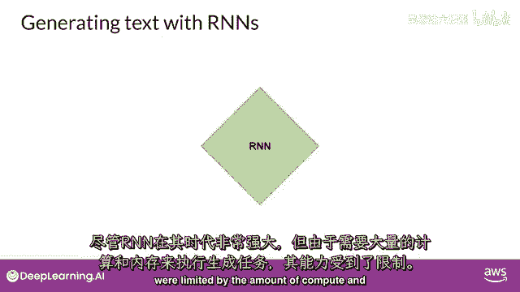

看RNN做简单词预测示例，仅见前一词的生成任务。

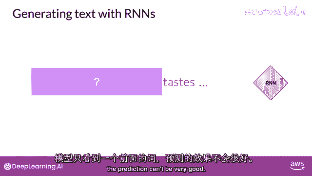

预测不会很好，扩大RNN看更多前文可改善，需大幅扩展模型资源。

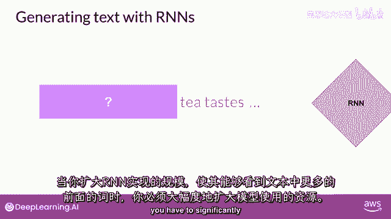

实际上，RNN计算和内存需求呈指数增长，随模型可见文本窗口增加。

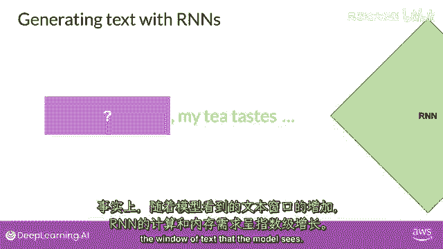

至于预测，模型失败于此，即使扩展模型，仍未见足够输入以作好预测。

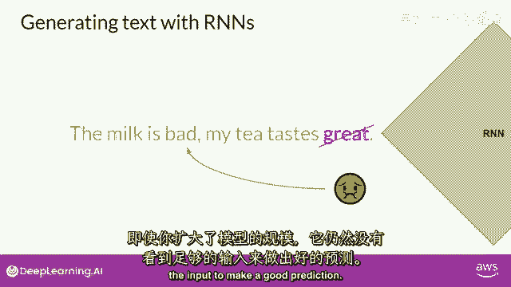

成功预测需模型见更多前词，模型需理解整句甚至整文档，问题在于语言复杂，许多语言中，一词可有多义，这些是同音词。

在这种情况下，只有结合句子语境才能确定银行类型。

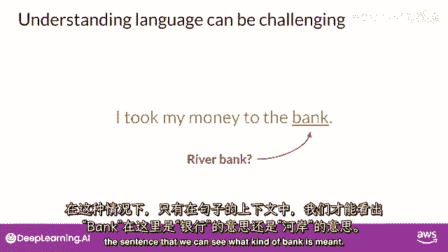

句子结构中的单词可能含糊，或存在我们所说的句法歧义，例如，这句话，老师用书教学生。

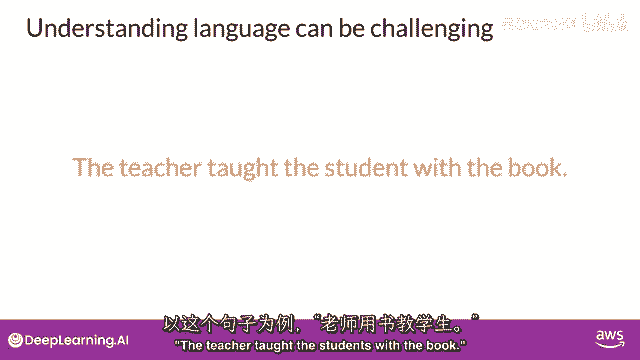

老师用书教学吗，还是学生有书。

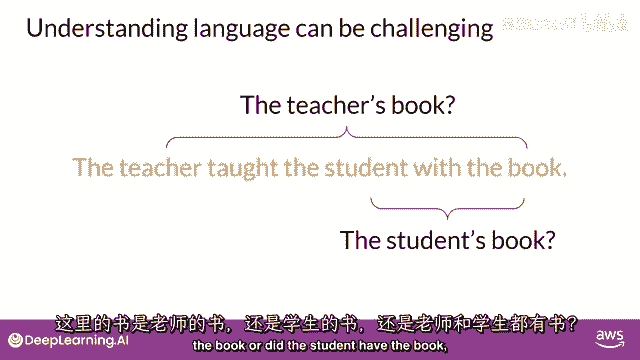

或是两者都有，算法如何理解人类语言。

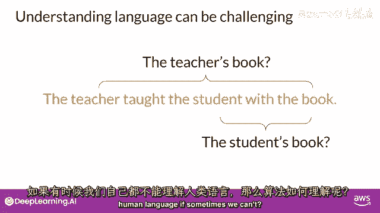

17年论文发表后，有时我们仍难理解，谷歌和多伦多大学：注意力即一切。

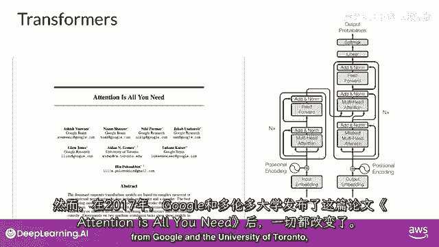

一切都变了，变换器架构已到来，这种新方法开启了当今生成AI的进步。

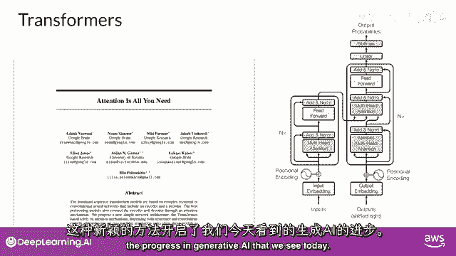

高效扩展至多核GPU。

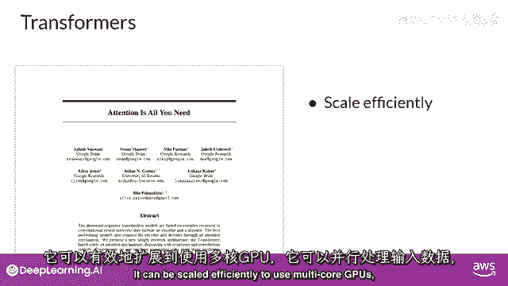

并行处理输入数据，利用更大训练集，关键能关注词义。

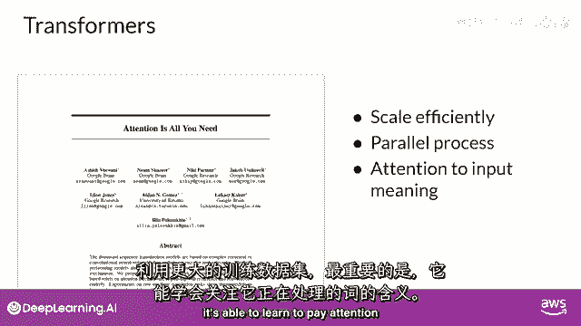

处理与关注即所需。