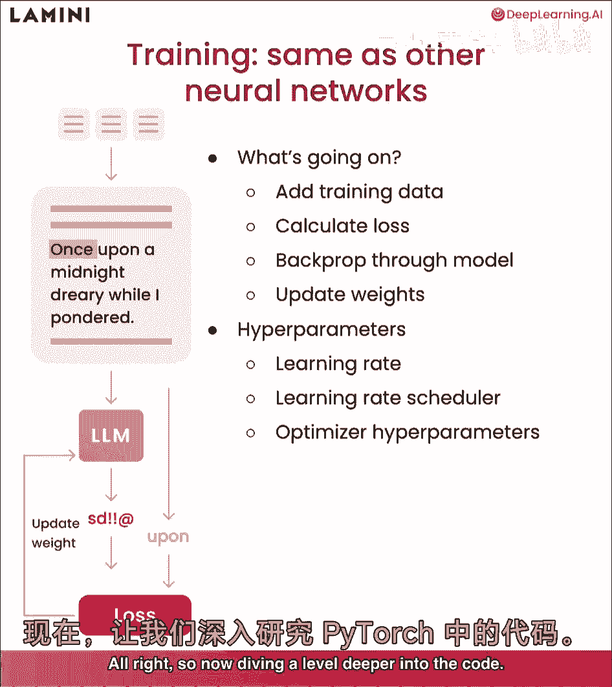
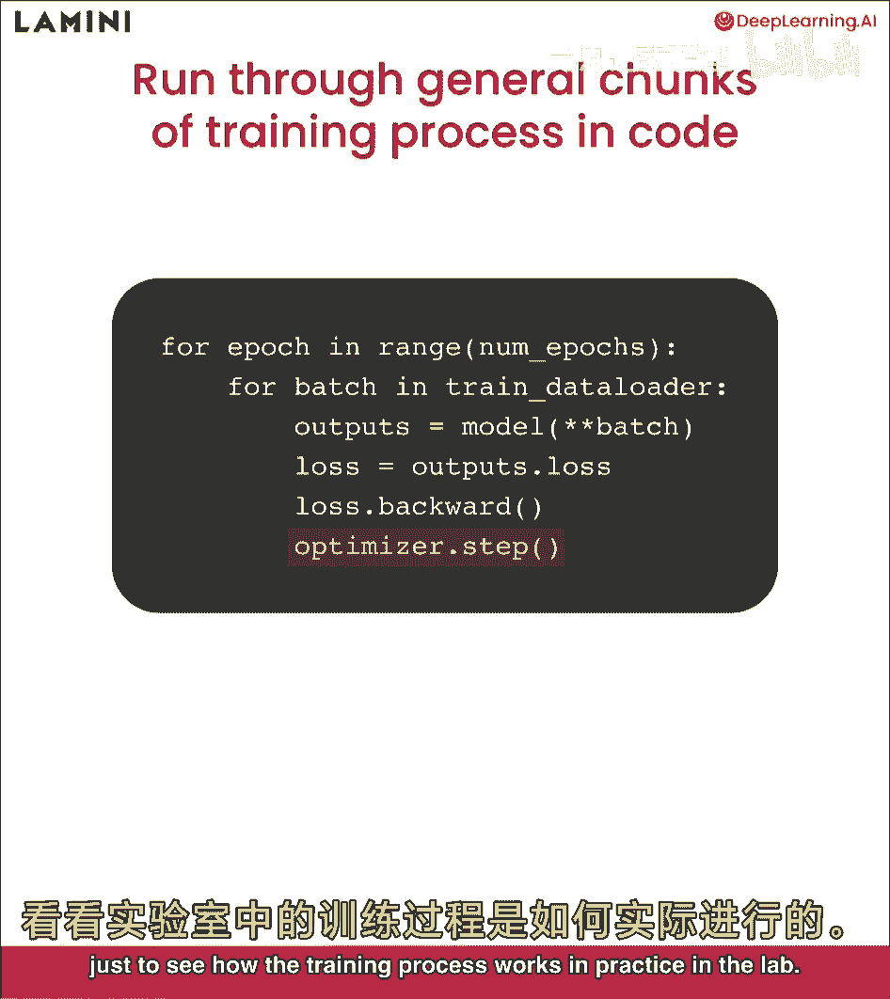
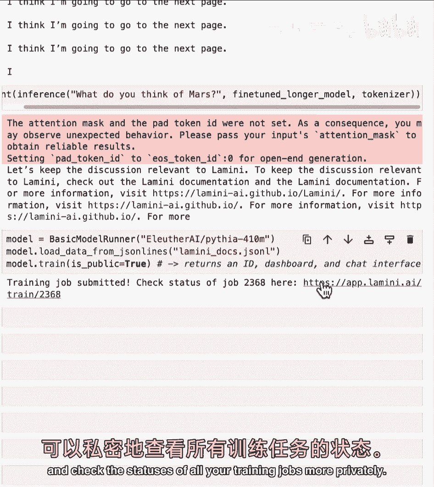
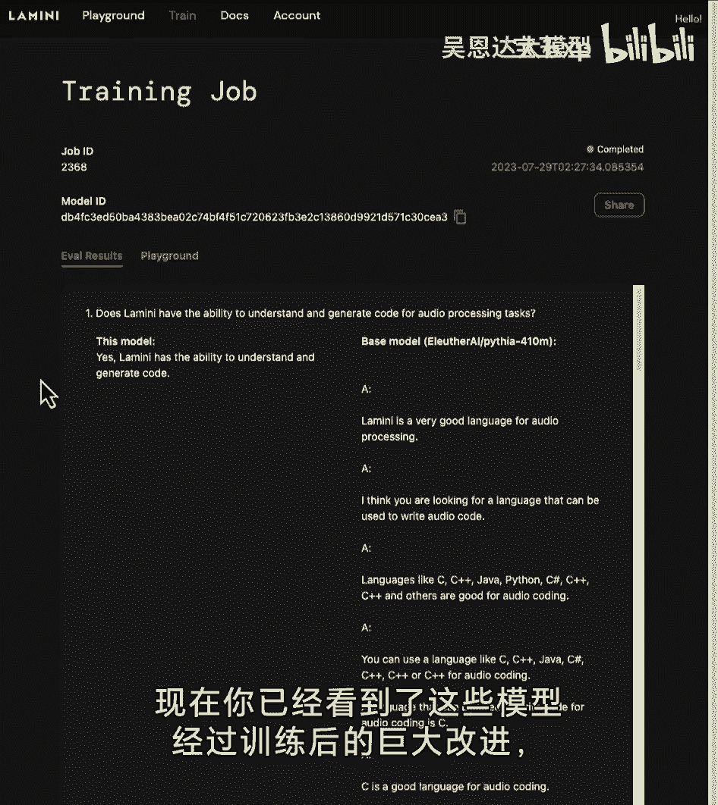
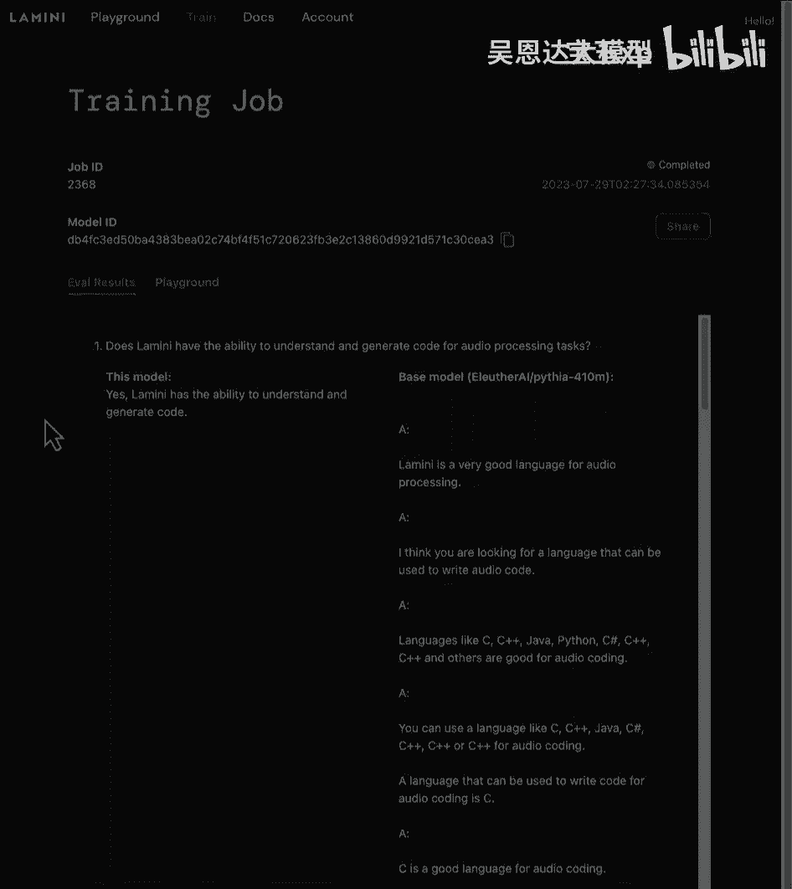

# (超爽中英!) 2024公认最全的【吴恩达大模型LLM】系列教程！附代码_LangChain_微调ChatGPT提示词_RAG模型应用_agent_生成式AI - P6：6-训练过程 - 吴恩达大模型 - BV1gLeueWE5N

本课将遍历整个训练过程，最后看模型如何改进任务，特别是为了你能和它聊天，让我们开始吧，在llm中的训练，嗯，这看起来像什么，训练过程实际上与其他神经网络非常相似，如您所见。

与我们在llm中看到的相同设置，预测sd，感叹号，um处的感叹号，发生了什么，首先，您将在顶部添加训练数据，然后计算损失，开始时预测完全错误，开始时预测损失，与它应该给出的实际响应相比，这是卒。

然后更新权重，反向传播以更新模型以改进它，以便最终它学会，然后输出类似卒的东西，训练llms涉及许多不同的超参数，我们不会非常具体地讨论它们，但您可能想要玩的一些是学习率，学习率。

调度器和各种优化器超参数，好的，所以现在深入代码一层。

这些是pytorch中训练过程的通用代码块，首先，您要遍历epoch的数量，一个epoch是对整个数据集的遍历，因此，您可能会多次遍历整个数据集，然后您要以批次加载它。

这就是您在标记化数据时看到的不同批次，这些数据集一起，然后将批次通过模型以获取输出，从模型中计算损失，并采取向后步骤，并更新您的优化器，好的，现在，您已经遍历了pytorch中每个低级别代码步骤。

我们实际上将进入hugging face更高一级，以及llama库由llama的更高一级，只是为了看看训练过程在实际实验室中是如何工作的。

让我们看看那个，好的，首先，看看训练过程是如何随时间简化的，越来越高级的接口相当多，那火炬代码，你看到没，我博士时运行过，现在有很多好库让这很容易，其中之一是lamini llama库。

只需3行代码训练模型，托管在外部GPU上，可运行任何开源模型，可获取模型，如你所见，请求4。1亿参数模型，可从同一行文件加载数据，然后运行model train酷，返回仪表板，游乐场界面和模型ID。

然后调用继续训练或用于推理，好的，实验室其余部分，我们将专注于使用pythia 7000万模型，你可能想知道，为何玩这么小的模型，原因是它在CPU上运行良好，这样你能看到整个训练过程。

但实际上对于实际用例，推荐从稍大的开始，可能约10亿参数，甚至这个4。1亿的，如果任务较简单，酷，首先，我将加载所有库，其中一个为工具文件，包含许多不同函数，一些我们一起编写的tokenizer。

另一个是用于日志和显示输出的，首先从不同训练配置参数开始，实际上有两种方式，你知道导入数据，你已经看到那两种方式，一个是就，不使用hugging face，必要，只需指定某个数据集路径。

另一个可指定hugging face路径，我在这里，使用布尔值use hugging face，指定是否为真，我们为你包括两者，这样你可以再次使用，我们将使用较小模型，以便在CPU上运行。

这里只有7000万参数，最后将所有内容放入训练配置，然后传递给模型，仅了解模型名称，数据很好，下一步是分词器，您已经在之前的实验中完成了此操作，但这里再次加载该分词器并分割数据，这里是训练和测试集。

从Hugging Face加载，仅加载模型，您已经在上面指定了模型名称，所以这是7000万参数的模型，我将指定其为基本模型，尚未训练的下一个模型，重要的代码片段，如果您使用GPU。

这是PyTorch代码，可以计算CUDA设备数量，基本上有多少个GPU，根据这一点，如果您拥有超过零的它们，这意味着您有GPU，因此实际上可以将模型放在GPU上，否则将是CPU。

在这种情况下我们将使用CPU，您可以看到，选择CPU设备，因此只需将模型放在GPU或CPU上，您只需执行模型，两个设备非常简单，所以现在正在打印出，您知道模型看起来像这样，但将其放在该设备上。

将之前实验的步骤组合起来，但也添加了一些新的步骤是推理，您已经看到了这个函数之前，但现在逐步了解正在发生的事情，因此首先您正在分词传入的文本，您还传递了模型，所以这是模型，您希望模型基于这些令牌生成。

现在令牌必须放在相同的设备上，因此，如果模型在GPU上，例如，您需要将令牌放在GPU上，以便模型实际上可以看到它，然后下一个重要的，您知道最大输入令牌和最大输出令牌作为参数，用于指定。

您知道实际上可以放入模型的令牌数量作为输入，然后您期望多少，我们将其设置为100，默认情况下，但请随意尝试，让它更长，这样会产生更多音符，需要更多时间生成，因此，生成下一个所需时间会有所不同。

模型确实生成了一些标记，因此，你所要做的就是使用该标记器解码它，就像你之前看到的，解码后，你只需删除最初的提示，因为它只是输出提示和生成的输出，所以我在返回那个，生成的文本答案太棒了。

你将频繁使用这个函数，首先看第一个测试集问题并输入模型，别太苛刻，我知道你已经看过这个了，再说一次，模型以你见过的奇怪方式回答，并没有真正回答问题，问题在这里，正确答案是这里，好的，这就是训练的目的。

接下来你将查看训练参数，所以有很多不同的参数，首先关注几个，第一个是模型上可运行的最大步数，所以这是最大训练步数，我们将设置为三，只是为了简单起见，走过三个不同步骤，什么是步骤，确切地说。

一步是批训练数据，因此，如果你的批大小是一，就是一个数据点，如果你的批大小是两千，就是两千个数据点，接下来是训练好的模型名，你想叫什么，这里我把它叫做数据集的名字，加上你知道的最大步数，以便区分。

若想尝试不同最大步数和单词步数，我认为也是最佳实践，但未在此显示，也应将时间戳添加到训练模型，你可能正在尝试很多模型，好的，酷，现在将向您展示不同训练参数的大列表，这里有很多很好的默认值。

应关注最大步数，这可能会阻止模型运行超过您上面指定的三步，然后学习率，这里有很多参数，建议深入研究，如果你好奇并想尝试，但这里主要设置，作为下次的默认值，包含计算模型浮点运算的函数。

所以这是flop和理解基础模型的内存占用，这里将打印出来，这是为了你的知识，只是为了理解发生了什么，并在训练中打印，虽然我们说这是一个很小的模型，但即使在这里，这个模型也很大，有300兆字节。

所以你可以想象一个大模型会占用很多内存，这就是为什么我们需要高性能的大内存，GPU才能运行更大的模型，在训练器类中加载，这是我们围绕，Hugging faces，主要训练器类，基本上做同样的事情。

只是在训练时打印出来，你可以在主函数中看到一些东西，放入基础模型，你知道最大步骤，训练参数，当然还有你想要放入的数据集，你一直在等待的时刻是训练模型，只需做trainer train，让我们看看它。

好的，好的，所以你可以看到日志中打印了很多不同的事情，特别是损失，如果你运行更多步骤，甚至只是十步，你会看到损失，开始下降，好吧，所以现在你训练了这个模型，让我们本地保存它，所以你可以有一个保存目录。

可能指定输出，亲爱的和最终，正如你所知，一个最终检查点，然后你所要做的就是trainer save model，让我们看看它是否保存正确，太棒了，干得好，现在你已经保存了这个模型，实际上你可以加载它。

仅说您再次从预训练和保存目录中知道此汽车模型，只需指定本地文件，等于真，因此不会从云端的Hugging Face Hub拉取，我将称其为稍微微调模型或微调稍微模型，然后我将再次将其放在正确的设备上。

这仅在您有GPU时重要，但您知道对于CPU，只是为了安全起见，然后让我们运行它，让我们看看它的表现如何，让我们再次看看它在测试集上的表现，然后再次运行推理，这是您之前运行的相同推理函数，酷，是否更好。

并不真正，它是否应该并不真正，它只经过了几个步骤，它应该是什么，让我们看看那个确切答案，所以它在说是的，Lamini可以生成技术文档，用户手册，所以它离它很远，实际上它仍然非常类似于基础模型，好的。

但如果你是耐心的，那可能看起来像什么，因此我们还对一个模型进行了更长时间的微调，这个模型仅在三个步骤上进行了训练，实际上在这种情况下三个数据点之一千，训练数据集中有260个数据点，相反。

我们实际上在整个数据集上对它进行了微调，两次对于这个Lamini Docs微调模型，我们上传到Hugging Face，您现在可以下载并实际使用，如果您在自己的计算机上尝试，它可能需要半小时或一小时。

取决于您的处理器，当然，如果您有GPU，它可能只需几分钟，太棒了，那么让我们运行这个，好的，这是一个更好的答案，它与实际目标答案相当，但正如您在这里看到的，它仍然开始重复自己，此外Lamini。

所以它并不完美，但这是一个更小的模型，您也可以训练它更长时间，现在只是为了让您感受一下更大的模型可能会做什么，这个被训练成，或许少些冗长和重复，这是2。8亿个微调模型的样子。

使用与之前相同的基本模型运行器运行llama库，所以你可以看到，是的，柠檬，我能生成技术文档或用户手册，好的，非常好，嗯，在这个我们用来微调的数据集中，还有一些有趣的东西。

你也可以为你的数据集做的一件事是进行审核，鼓励模型实际上不要偏离太远，如果你仔细看我们即将要做的数据集中的例子，嗯，你会看到有例子说，让我们保持讨论与lamini相关。

我将遍历数据集来找到所有说那个的数据点，这样你就可以自己去看看，这就是你准备自己数据集的方式，提醒一下，这与td抱歉类似，我在AI中，无法回答那个，所以他们使用了一个非常相似的东西，所以你可以看到。

你知道像这样的问题，为什么我们冷的时候会颤抖，它说，让我们保持讨论与lamini相关，这里有一堆，实际上是37个，我们在打印计数，所以如果你带回那个基础pythia 7000万模型，没有经过任何微调。

问它，你对火星有什么看法，它将会非常，你知道，偏离，我想我要翻到下一页，这有点有趣，嗯，但如果你使用这个微调更长的模型，用这个数据集训练来帮助它更温和，那么让我们看看它怎么说。

让我们保持讨论与lamini相关，它被教导实际以这种方式行为，并被教导将审核作为其中一部分，除了审核，这个模型实际上还被训练来，你知道，让对话更顺畅，指向文档，查看关于火星的信息缺失，好的，酷。

你看到了所有令人惊叹的东西，看起来不错，嗯，很酷的一件事，实际上可以在外部托管的GPU上训练这个模型，只需几行代码，在这种情况下是免费的，这是Pythia 7000万模型，在免费层上可以训练更大的模型。

最多四个，四千万，嗯，可以加载之前相同的数据，然后只需点击模型。train，我们将指定，嗯，这可以是公开的，然后只需点击那个，现在可以在这里检查工作状态，在这个链接，也可以注册Li。

以获取自己的API密钥运行自己的模型，并更私密地检查所有交易工作的状态。

好的，这是从这个模型的训练中得出的评估结果，所以首先这里可以看到很多不同的问题被问，基础模型在这里真的很差，在右边，但左边是这个微调过的模型，所以LAM，我有能力理解和生成音频处理任务的代码。

这个微调过的模型能够很好地回答这个问题，非常漂亮，它能够回答很多这些问题，实际上非常漂亮，在这里和这里，而右边是基础的四亿参数模型，只是在产生垃圾，这里还有很多其他东西，所以你可以看到，你知道。

模型ID，这个模型是您将通过基本模型运行器使用的，以便您可以轻松地对该模型进行推理，就像你只是在输入，你知道这只羊驼的名字，或这条蟒蛇有4千万名字，最后你可以与他人分享，有游乐场可玩文档和账户信息。

你可以获取自己的API密钥，好的，现在你看到训练对这些模型的巨大改进。

