# (超爽中英!) 2024公认最全的【吴恩达大模型LLM】系列教程！附代码_LangChain_微调ChatGPT提示词_RAG模型应用_agent_生成式AI - P73：介绍LLM和生成式AI项目的生命周期10——生成式AI项目的生命周期 - 吴恩达大模型 - BV1gLeueWE5N

在整个课程剩余部分，你将学习开发和部署基于llm的应用所需的技术，在这个视频中，你将走过一个可以帮助你引导这项工作的生成式ai项目生命周期，这个框架列出了从概念到发布的任务，到课程结束时。

你应该对即将做出的重要决策有一些良好的直觉，你将遇到可能遇到的困难，以及开发和部署你的应用所需的基础设施，这里是总体生命周期的图表，我们将一步一步讨论这个问题。

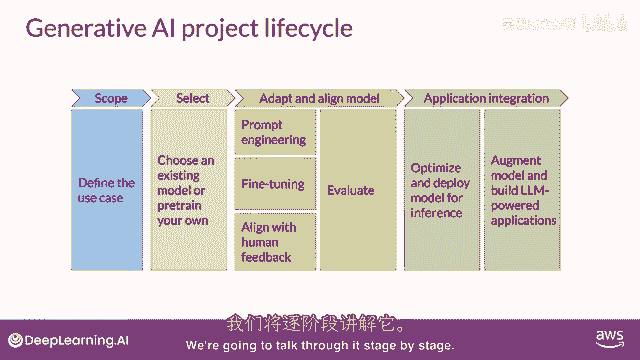

任何项目的最重要的一步是定义范围。

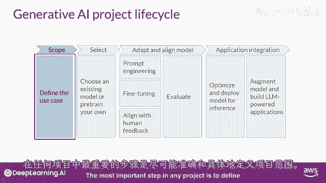

尽可能准确和狭窄，就像你在这门课程中看到的那样，到目前为止，llms有能力执行许多任务，但他们的能力强烈依赖于模型的大小和架构，你应该考虑llm在你特定应用中的功能。

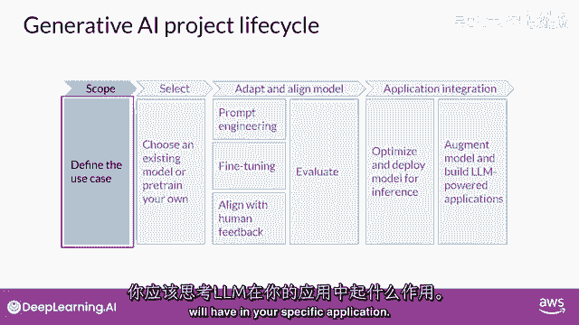

你是否需要模型能够执行许多不同的任务，包括长形式文本生成。

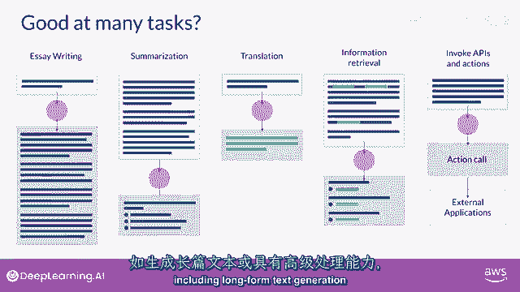

或者是具有高能力的，或者是任务更加具体，比如命名实体识别，所以，你的模型只需要在某一件事上做得好。

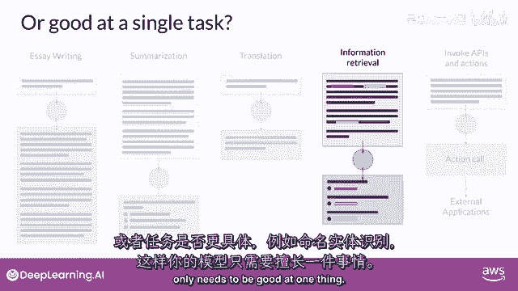

正如你在课程的其余部分所看到的，对你的模型需要做什么非常具体，可以节省你的时间，并且，更重要的是。

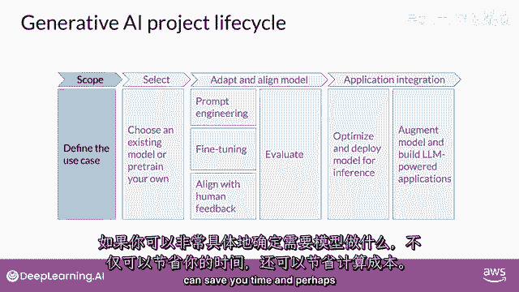

在你满意后计算成本，并且，你已经足够定义了你的模型需求，可以开始开发。

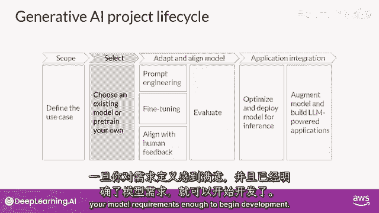

你的第一个决定将是是否要从头训练你自己的模型，或者一般与现有的基础模型合作。

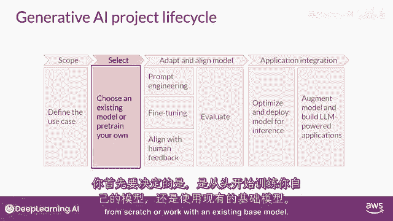

你将从一个现有的模型开始，尽管有一些情况下你可能发现有必要从零开始训练一个模型，你将在本周晚些时候了解这个决定的考虑因素，以及一些经验法则，来帮助你估计使用你手中的模型训练自己模型的可行性。

下一步是评估其性能并如果需要，进行额外的训练以适应你的应用程序。

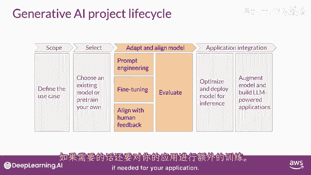

正如你们本周早些时候看到的，提示工程有时足以让你的模型表现良好。

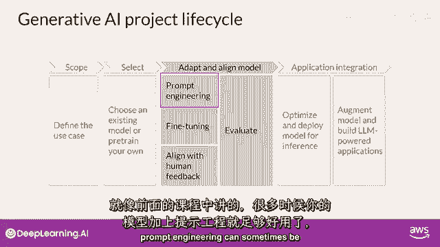

所以你可能会首先在特定上下文中尝试，根据你的任务和用例，使用适合的例子进行学习。

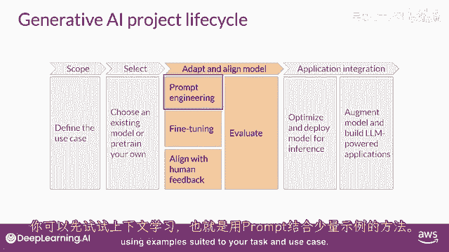

但仍然有一些情况，然而，在这些情况下，模型可能无法像你需要的那样表现。

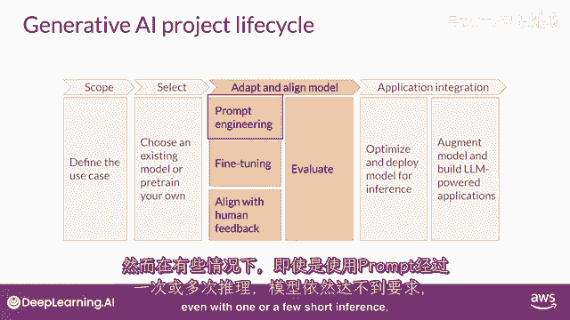

即使进行一次或几次的推断，那么在这种情况下，你可以尝试微调你的模式，这个监督学习过程将在第二周详细覆盖。

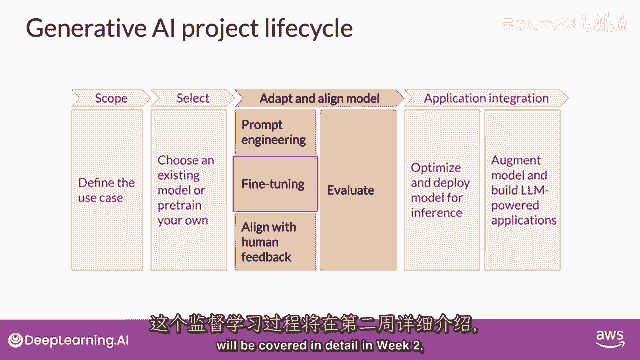

在第二周，你将有机会自己尝试微调一个模型。

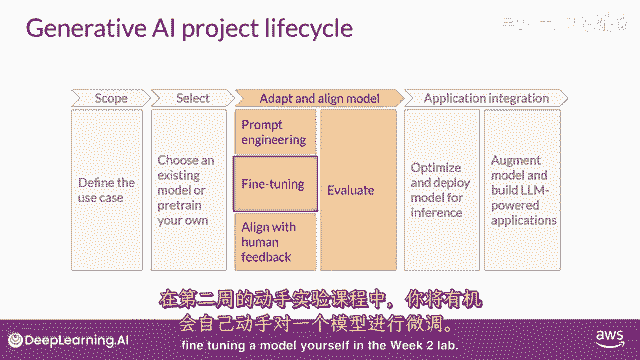

随着模型的能力增强，实验室将变得更加重要，确保它们行为良好的重要性正在日益增加，在第三周，部署方式将与人类偏好相一致。

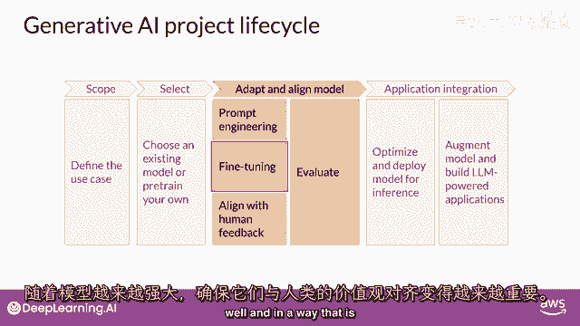

你将学习一种额外的微调技术，叫做强化学习，带有人类反馈，这可以帮助确保你的模型表现良好，所有这些技术的重要方面是评估。

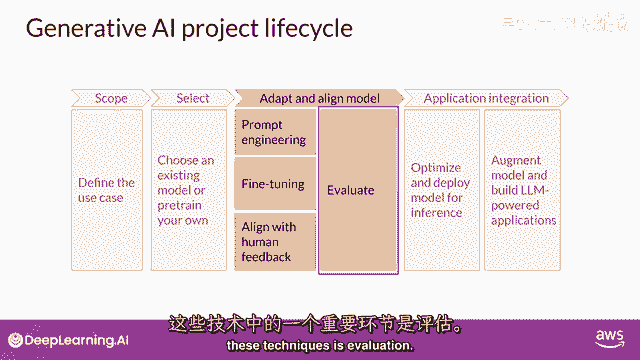

下周，你将探索一些可以用于衡量的指标和基准，以确定你的模型性能如何，或者它与你偏好的吻合程度如何。

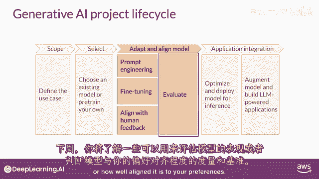

请注意，应用开发的适应和对齐阶段可能高度迭代，你可能从尝试提示工程并评估输出开始。

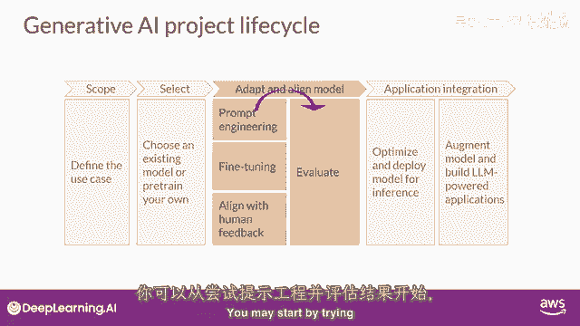

然后使用微调来提高性能，然后，再次回顾和评估提示工程。

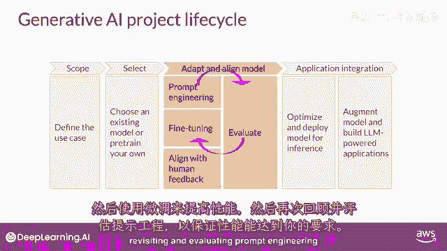

再次以确保您获得所需的性能，最后，当你有一个满足您性能需求且与您的目标高度一致的模型时，您可以将其部署到基础设施中并将其集成到您的应用程序中，在这个阶段，优化模型以备部署是一个重要的步骤。

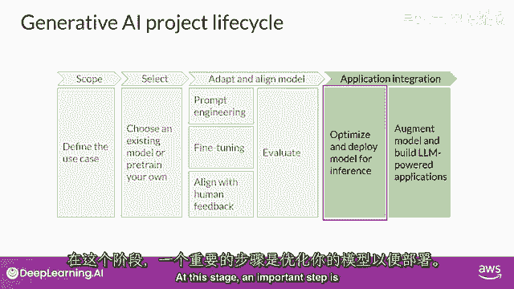

这可以确保您最大限度地利用计算资源，并为您的应用程序用户提供最佳可能的体验。

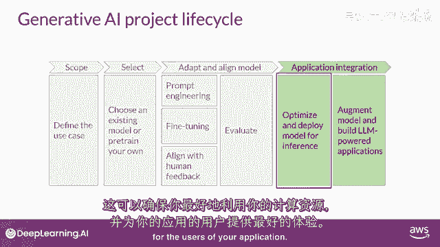

最后一个但非常重要的步骤是考虑您的应用程序可能需要的任何额外基础设施，以使其正常工作。

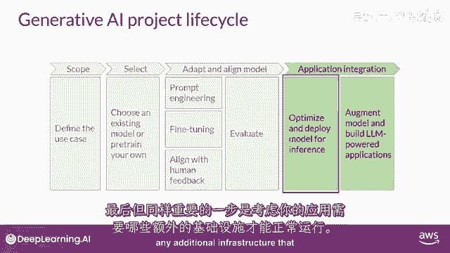

有一些LLMs的基本限制，仅通过训练难以克服。

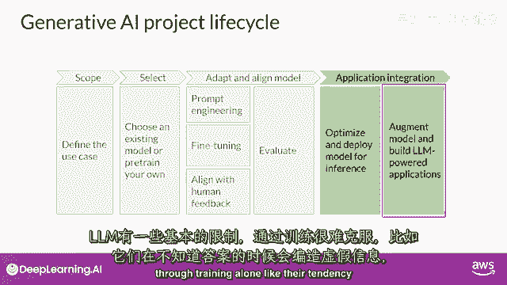

例如，他们的倾向发明信息，当他们不知道答案时，或者是他们进行复杂推理和数学计算的能力有限，在本课程的最后部分，你将学习一些强大的技术，你可以使用它们来克服这些限制。

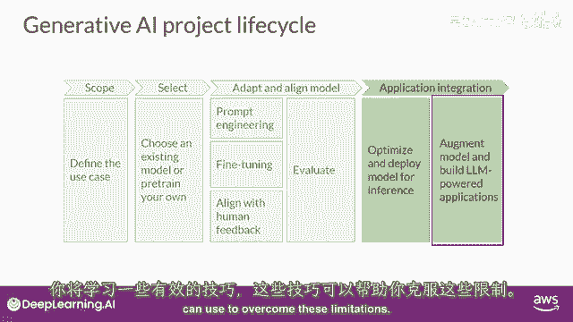

我知道这里有很多需要思考的地方，但是，不要担心现在要全部理解，你将看到这个视觉一次又一次，在整个课程中。

