# (超爽中英!) 2024公认最全的【吴恩达大模型LLM】系列教程！附代码_LangChain_微调ChatGPT提示词_RAG模型应用_agent_生成式AI - P77：使用指令对LLM进行微调4——多任务指令微调 - 吴恩达大模型 - BV1gLeueWE5N

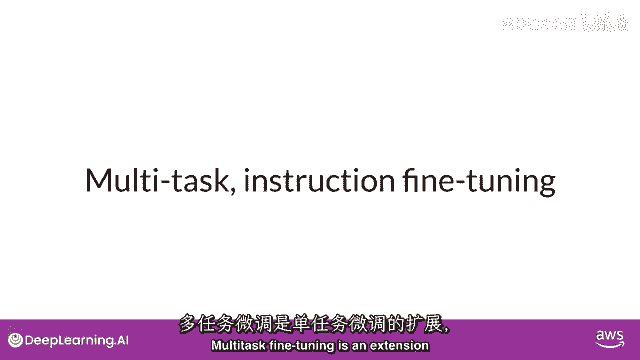

多任务微调是单任务微调的扩展，训练数据集包含多个任务的示例输入和输出，数据集包含指示模型执行各种任务的示例，包括摘要，评论，评分代码翻译，实体识别，你在混合数据集上训练模型。

以便同时提高模型在所有任务上的性能，从而避免在多个训练时期出现灾难性遗忘问题。

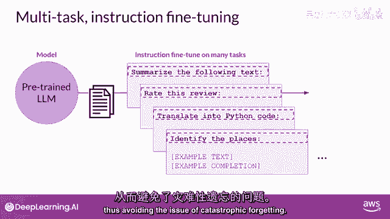

示例损失用于更新模型权重，生成一个适应性调优模型，学会同时擅长多种任务，多任务微调的一个缺点是需要大量数据，训练集可能需要多达5万至10万个示例，但收集这些数据非常值得，值得付出努力。

生成的模型通常非常强大，适用于需要多项任务表现良好的情况，让我们看看一个使用多任务指令训练的模型家族，基于微调期间使用的数据集和任务，指令调优模型变体不同，微调数据集和任务决定了指令调优模型变体。

一个例子是flann模型家族，Lanan，意为微调语言网，是一组用于微调不同模型的特定指令。

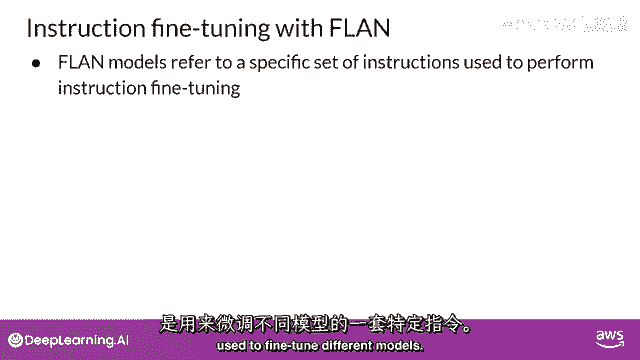

因为flan微调是训练过程的最后一步。

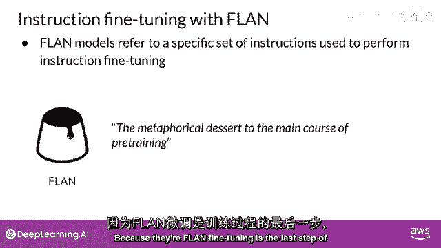

原始论文的作者称其为预训练主菜的比喻甜点，相当合适的名字，Flanan t5是Lanan指令版的t5基础模型。

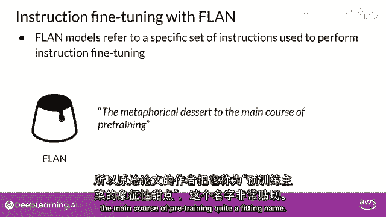

而Flanan pal是Flaninstruct版的palm基础模型。

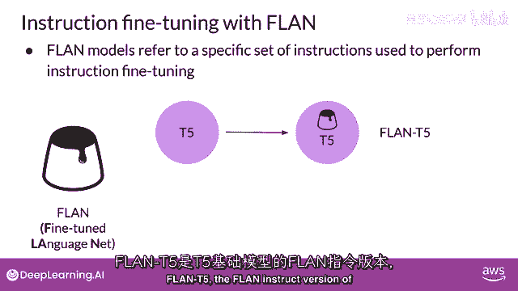

你明白了。

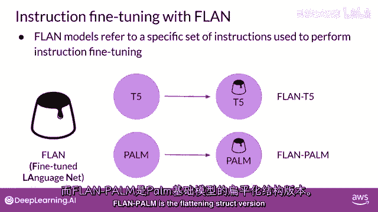

Get the idea，Flant 5是通用指导模型。

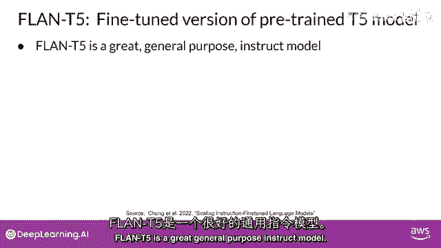

已微调473个数据集，涵盖146个任务类别，数据集选自其他模型和论文，无需阅读所有细节，如感兴趣，视频后可阅读原文细看，Flant用于摘要任务的数据集示例，T5是三星，属于Muffin任务集。

用于训练语言模型总结对话，三星数据集包含1。6万条类似聊天的对话和摘要，示例显示在左侧为对话，右侧为摘要，对话和摘要由语言学家精心制作，专为生成高质量训练数据集设计语言模型，语言学家被要求创建对话。

类似于他们日常写作的对话，反映他们真实生活聊天话题的比例，其他语言专家随后为这些对话创建了简短摘要，包含对话中重要信息和人名，这是为三星对话摘要数据集设计的提示模板，模板实际上由几个不同的指令组成。

它们基本上都要求模型，做同样的事情，总结对话，例如，简要总结该对话，这个对话的总结是什么，以及那场对话中发生了什么，用不同的方式表达相同的指令有助于模型泛化和表现更好，就像你之前看到的提示模板一样。

每个案例中可见，将Sansum数据集的对话插入模板，对话字段出现处，摘要用作标签，将此模板应用于Sansum数据集中的每行。

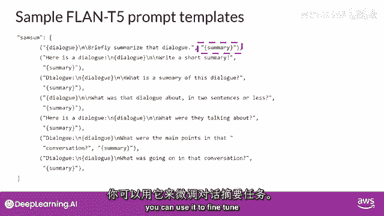

可用于微调对话摘要任务，尽管Flant Five是通用模型，表现良好，但在特定任务上仍有改进空间，例如，设想你是为客服团队构建APP的数据科学家。

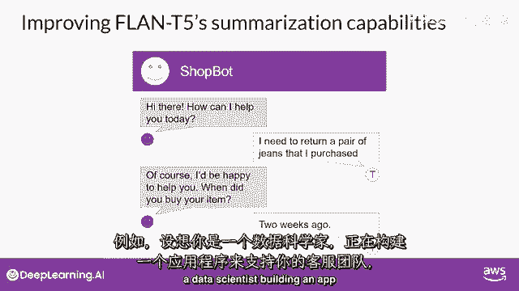

通过聊天机器人接收请求。

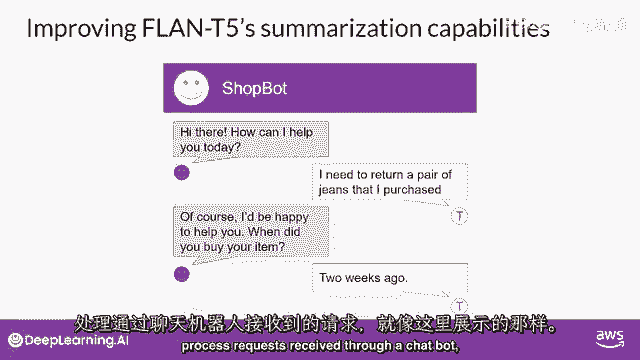

如这里所示，客服团队需每段对话总结，识别客户请求的关键行动。

并确定应采取的行动。

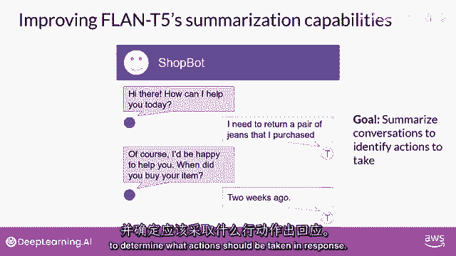

三星数据集赋予Flann T5总结对话能力，然而，数据集中的示例多为朋友间日常对话，与客服聊天语言结构重叠不多，可使用对话数据集对Flann T5模型进行额外微调，更接近与机器人对话。

本周实验室探索场景，使用对话摘要数据集，提升Flant Five总结能力，包含1。3万对话和摘要，对话摘要非训练数据，模型未见过这些对话。

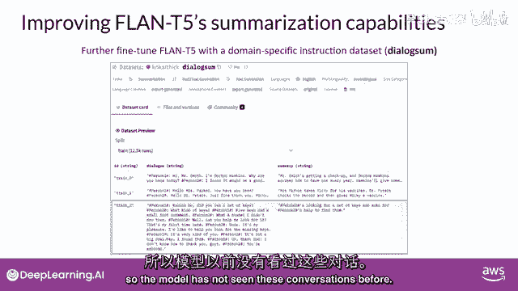

看对话摘要示例，讨论如何进一步微调，典型支持对话示例，客户与酒店前台对话，聊天已应用模板，以便总结指令在文首，看Flamt Five如何响应，在进一步微调前注意，提示现在左侧浓缩。

给你更多空间检查模型完成，模型对指令的响应，模型表现不错，能识别预订Tommy。

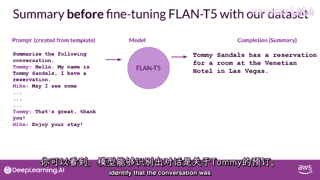

但不如人类生成的基准摘要，包括重要信息，如迈克询问信息以方便登记，模型的完成也发明了原始对话中没有的信息，特别是酒店名称和所在城市，让我们看看模型表现如何，在对话摘要数据集上微调后。

希望你会觉得这更接近人类产生的摘要，没有虚构信息，摘要包括所有重要细节，包括参与对话的两人姓名，此示例使用公共对话摘要数据集演示了在自定义数据上的微调，实际上。

使用公司自己的内部数据进行微调将获得最大收益，例如，客户支持应用程序中的支持聊天对话，这将帮助模型学习，公司如何喜欢总结对话，以及对客户服务同事最有用的是什么。

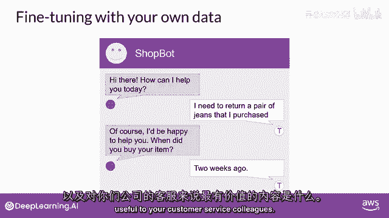

我知道这里有很多需要理解的内容，但别担心，这个示例将在实验室中覆盖，所以你会有机会看到实际操作并亲自尝试，当进行微调时需要考虑的一件事，是如何评估模型完成质量，在下一个视频中，你将学习几种指标和基准。

以确定模型表现如何。