# (超爽中英!) 2024公认最全的【吴恩达大模型LLM】系列教程！附代码_LangChain_微调ChatGPT提示词_RAG模型应用_agent_生成式AI - P78：使用指令对LLM进行微调5——模型评估 - 吴恩达大模型 - BV1gLeueWE5N

本课程中，你见过类似模型表现良好的陈述，或这个微调模型在性能上大大超过了基础模型，这些陈述意味着什么，如何量化你微调模型相对于预训练模型的性能改进，你开始使用的。

让我们探索一些大型语言模型开发者使用的指标。

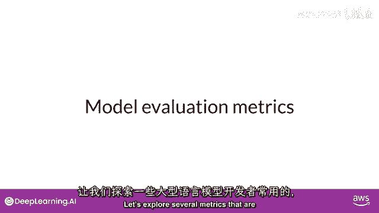

你可以用来评估你自己的模型，并与世界上的其他模型进行比较。

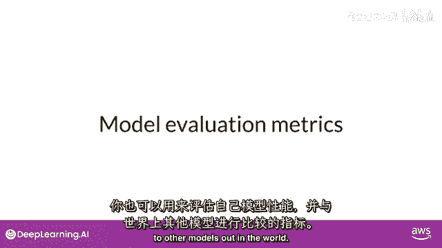

在传统机器学习中，你可以通过查看模型在训练和验证数据集上的表现来评估它，其中输出是已知的。

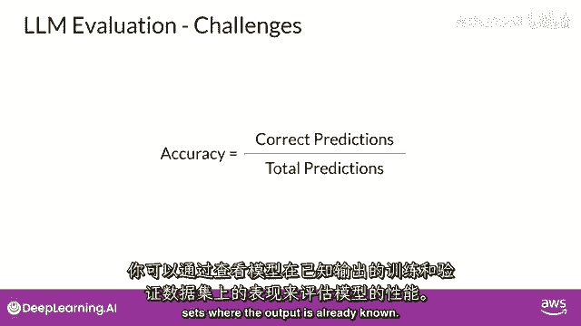

你可以计算简单的指标，如准确率，它表示所有预测中正确的比例，因为模型是确定的。

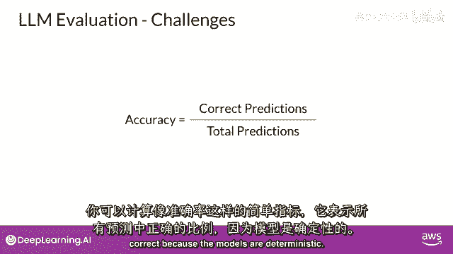

但对于大型语言模型，输出是不确定的，语言评估更加困难。

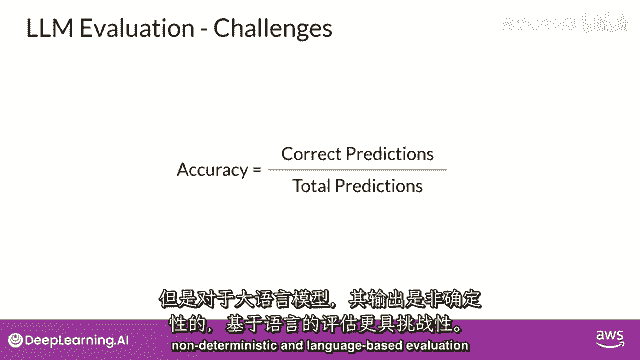

例如，迈克真的很喜欢喝茶，这与迈克喜欢啜饮茶非常相似。

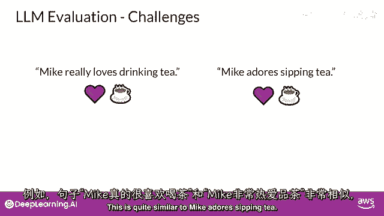

但如何衡量相似性。

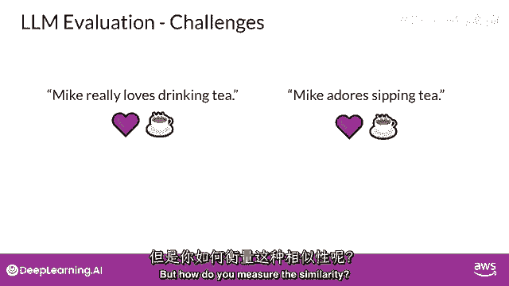

让我们看看另外两个句子，迈克不喝咖啡和迈克喝咖啡。

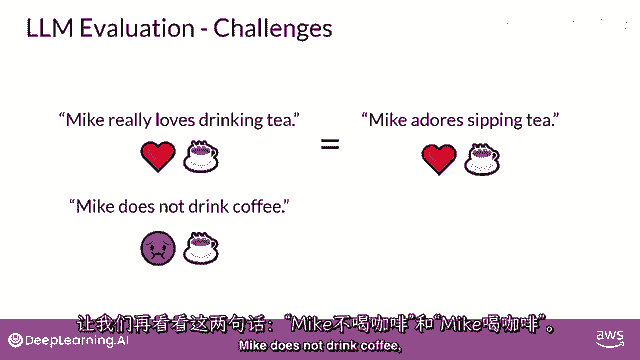

这两个句子之间只有一个词的区别，但意义却完全不同。

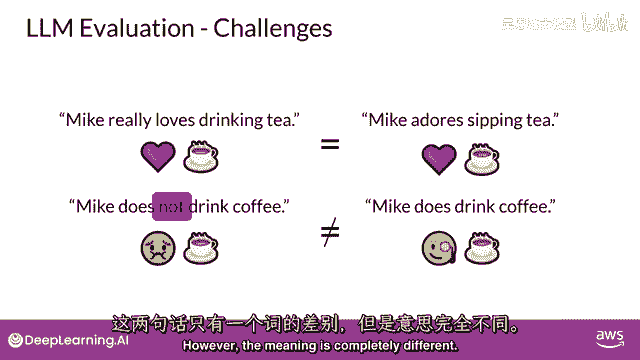

对于我们人类来说，拥有柔软有机的大脑，我们可以看到相似性和差异，但当你训练一个模型时，有数百万个句子，你需要一种自动的结构化方法来测量。

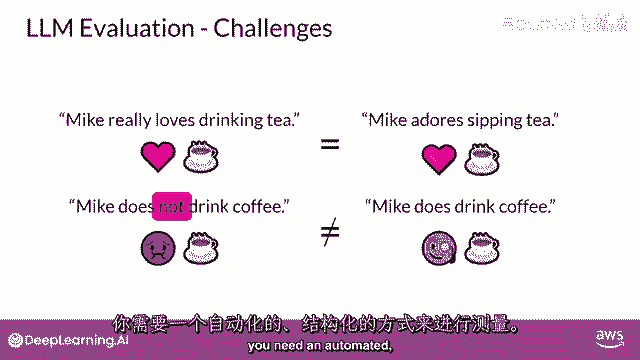

Rouge和Blur是两种广泛使用的评估指标，用于不同的任务。

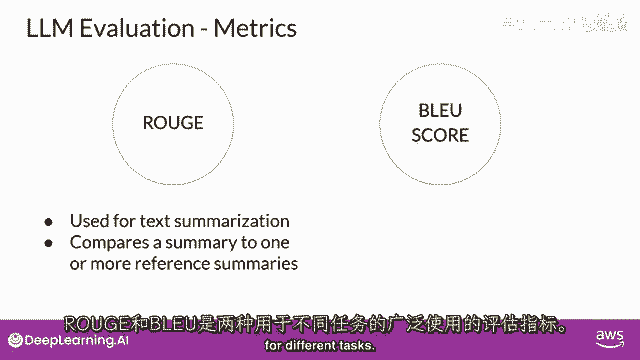

Rouge或召回导向的本科生评估，主要用于评估自动生成的摘要的质量，通过将它们与人类生成的参考摘要进行比较，另一方面。

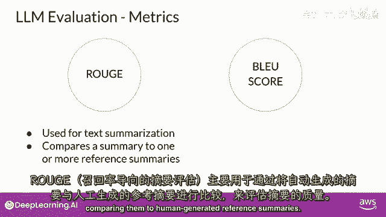

或，双语评估本科生算法，旨在评估机器翻译文本的质量，再次通过将其与人类生成的翻译进行比较，现在单词bleu是法语中的蓝色，所以你可能听到人们称它为蓝色，但在这里我将坚持使用原始的blur。

在我们开始计算指标之前。

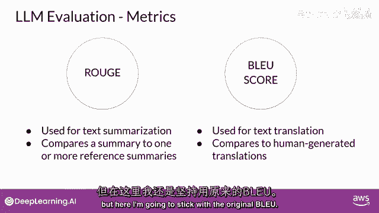

让我们回顾一下语言解剖学中的一些术语。

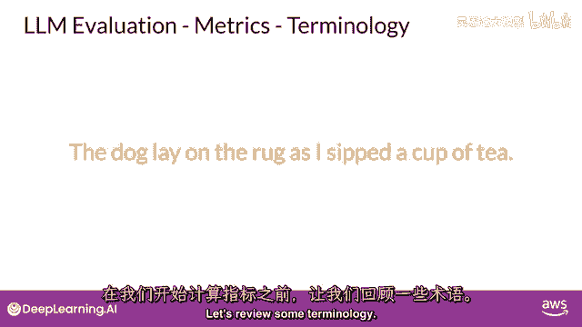

Unigram相当于一个单词，Bigram是两个字，N-gram是n个单词的组，相当直接的东西，首先。

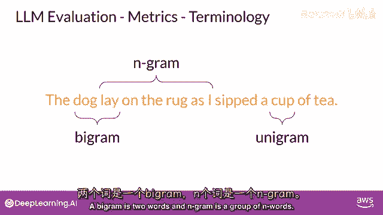

让我们看看Rouge，一个指标，并这样做，让我们看一个人类生成的参考句子，外面很冷，生成输出，外面非常冷。

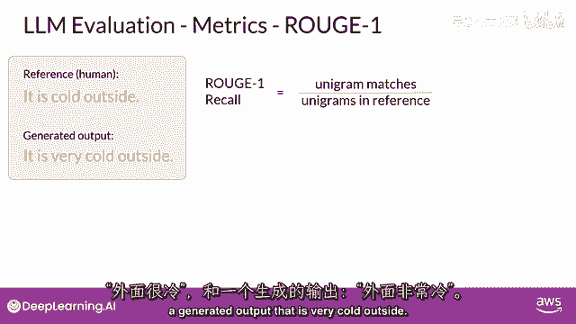

可进行类似其他机器学习任务的简单度量计算，使用召回率、精确度和F1。

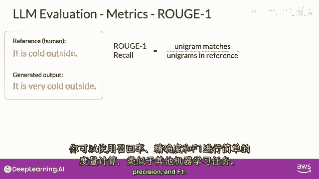

召回率指标衡量，参考和生成输出之间匹配的单词或单元数。

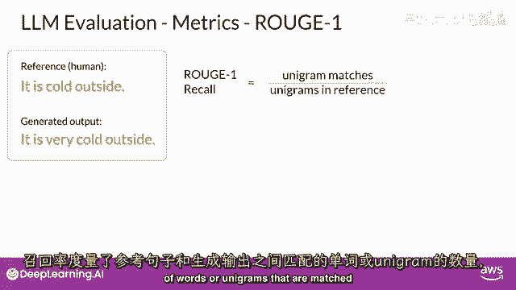

除以参考中的单词或单元数。

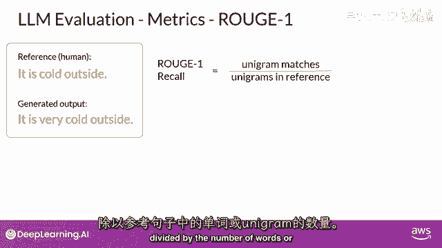

在这种情况下得满分1，因为所有生成的单词都与参考中的单词匹配，精确度衡量。

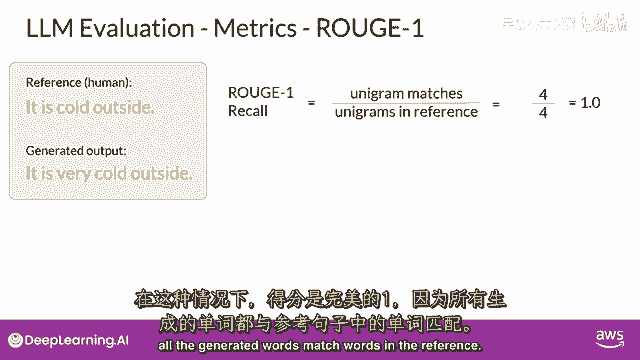

单元匹配数除以输出大小，F1分数是这两个值的调和平均数，这些是仅关注单词的基本指标，因此名称中的那个，不考虑单词的顺序，所以可能具有欺骗性，很容易生成得分高的句子，但主观上可能很差，暂停一下。

想象一下模型生成的句子只差一个词'不'，所以外面不冷。

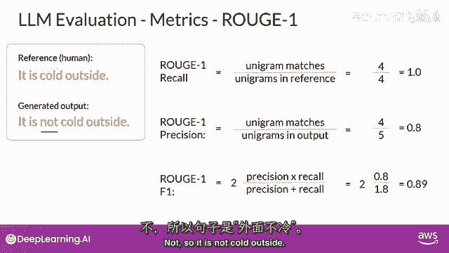

分数将相同，考虑双词可略提分数。

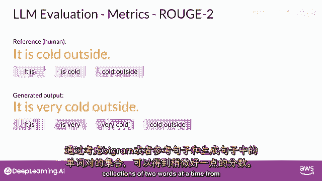

从参考和生成句子，处理成对单词，简单确认句子词序，使用双词。

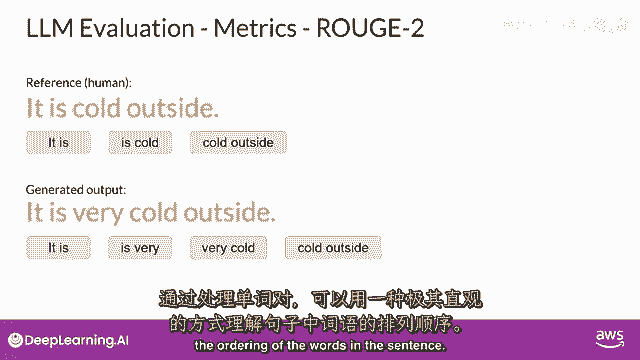

可计算ROUGE 2。

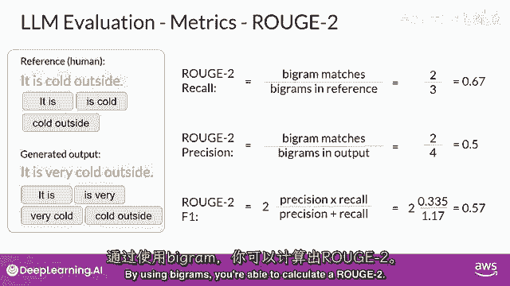

用双词匹配算召回率，而非单个词。

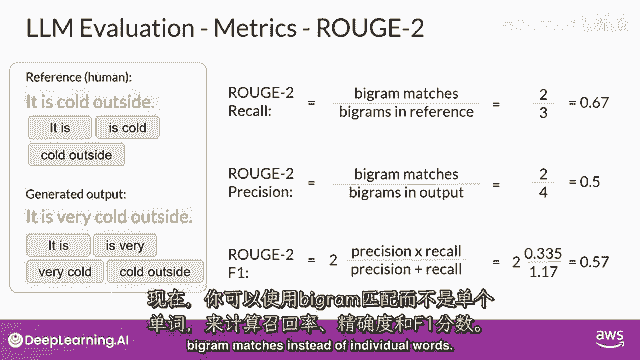

分数低于ROUGE 1，长句更明显，大几率双字不匹配，分数可能更低。

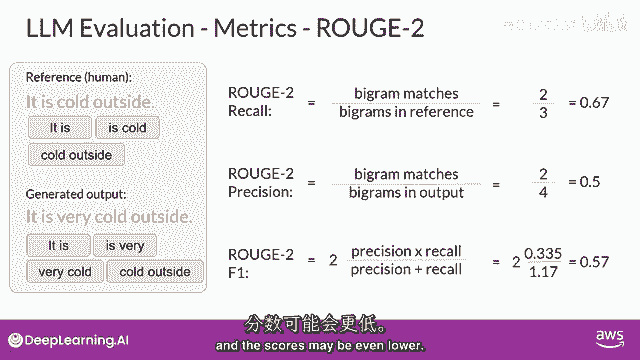

而非继续增加n-gram到3或4，让我们换种方法，相反，寻找生成输出和参考输出中最长的公共子序列。

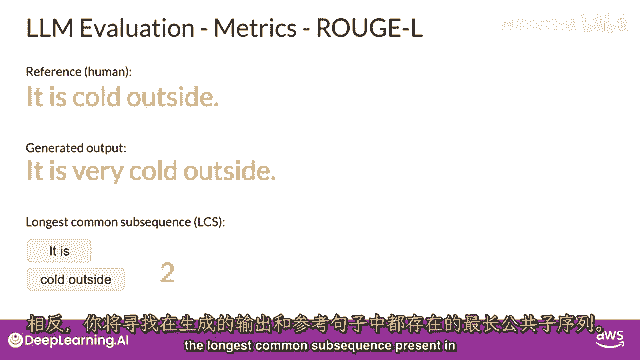

在这种情况下，最长匹配子序列是'it is'和'cold outside'。

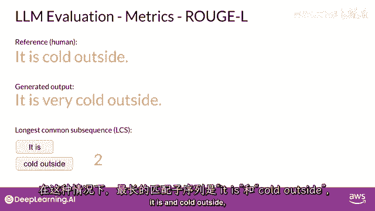

每个长度为2，现在可用lcs值计算召回率、精确度和F1分数。

召回率和精确率计算中，分子是最长公共子序列长度，这种情况下为两个，这三个量称为ROUGE分数。

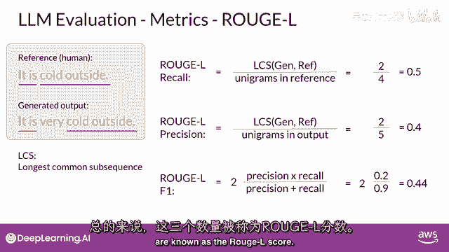

与所有ROUGE分数一样，需要考虑上下文。

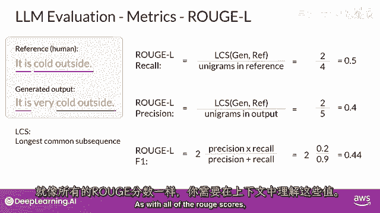

仅能使用分数比较模型能力，如果分数针对同一任务确定。

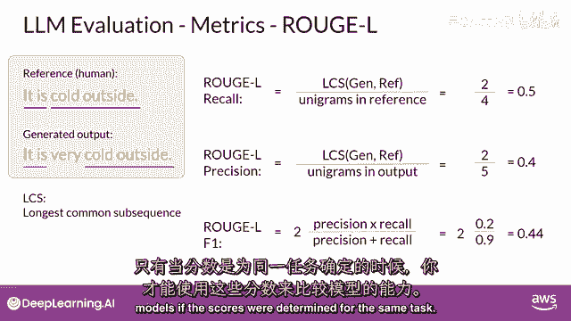

例如，不同任务的摘要ROUGE分数不可比较。

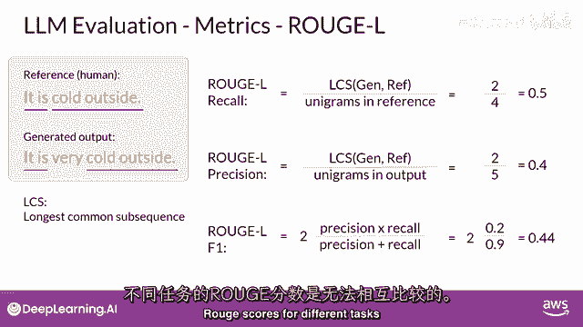

如你所见，简单ROUGE评分的问题，是坏完成可能得高分，例如，此生成输出为，冷，冷，冷，因生成输出含参考句单词。

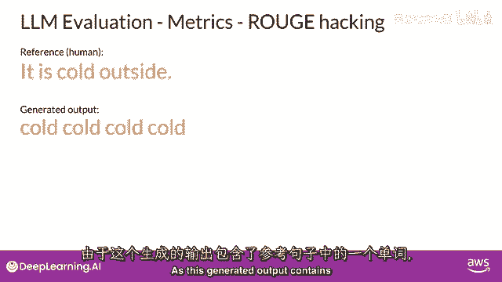

将得高分。

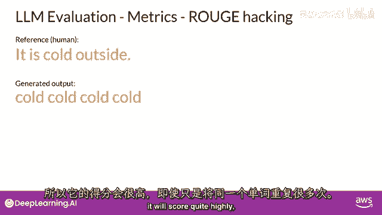

尽管同一单词重复多次，ROUGE 1精确度将完美。

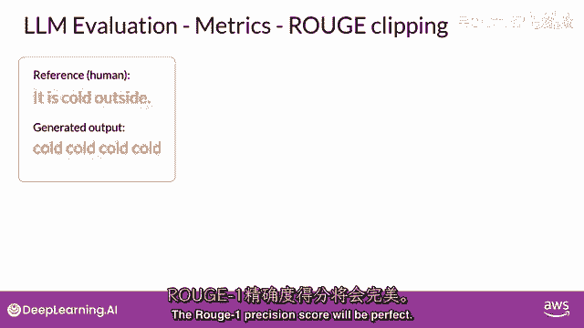

一种方法是，使用剪裁函数，限制一元匹配数至参考中最大值。

在此情况下。

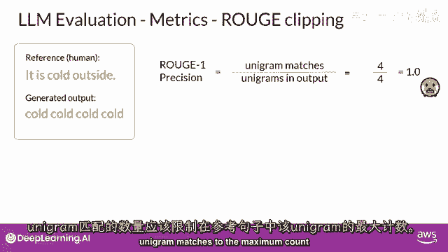

参考中有1次冷出现。

故带剪裁的一元精确度，导致显著降低得分，然而。

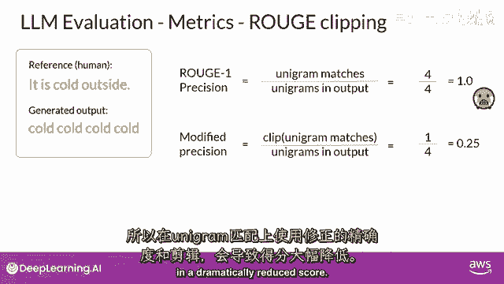

若生成单词都在，但顺序不同。

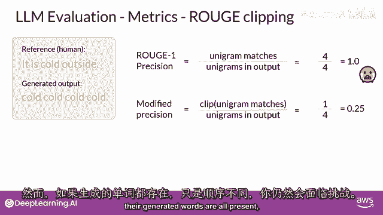

例如，此生成句子外冷，它被。

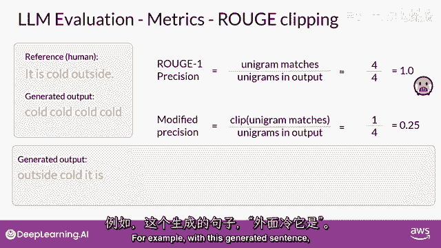

完美评价，即使带剪裁的一元精确度，因生成输出所有单词都在参考中，所以使用不同ROUGE评分有帮助，但最有用评分将取决于句子，句子大小和用例。

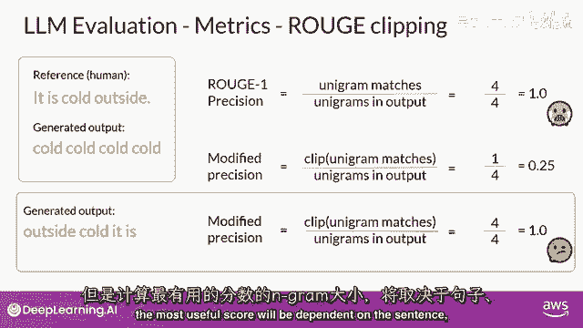

注意许多语言模型库，例如，Hugging face，第一周实验用，包含ROUGE评分实现，你可以尝试ROUGE评分，用它比较模型调优前后的性能，本周实验，另一个评估模型性能的分数。

是BLUR评分，代表双语评估研究。

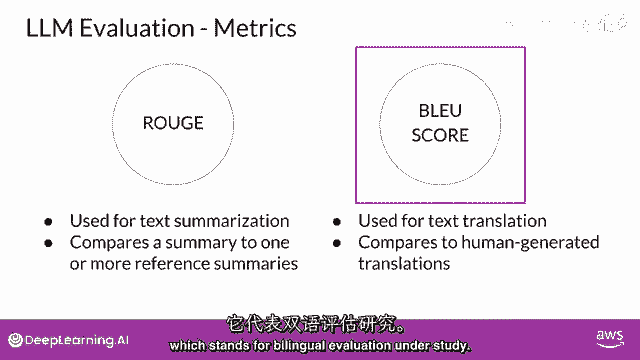

提醒你，BLUR评分用于评估机器翻译文本质量。

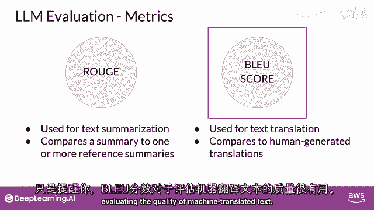

评分本身使用多个n元大小平均精度计算。

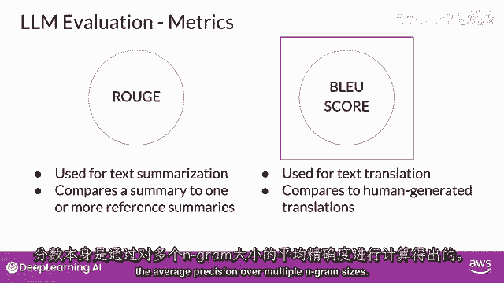

就像之前看的ROUGE 1评分，但为一系列n元大小计算，然后平均，让我们仔细看看它衡量什么和如何计算。

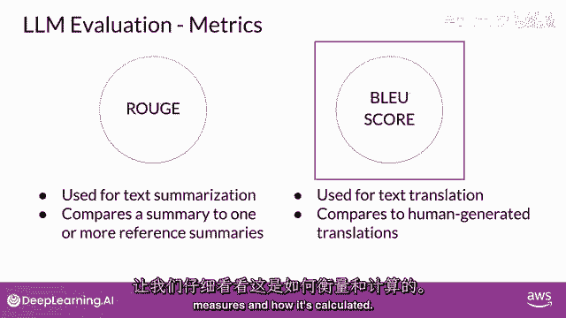

BLUR评分通过检查，机器生成翻译中多少n元与参考匹配。

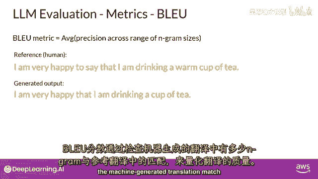

匹配参考翻译，计算得分，跨不同n-gram大小平均精度。

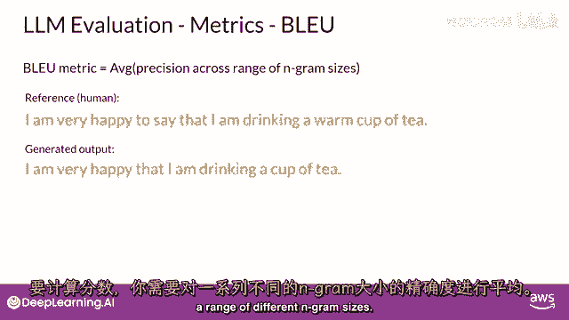

若手动计算，需多次计算，然后平均所有结果得模糊分，以例来说。

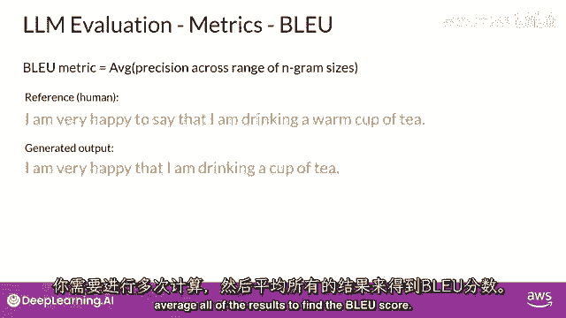

看长句，更好理解分值。

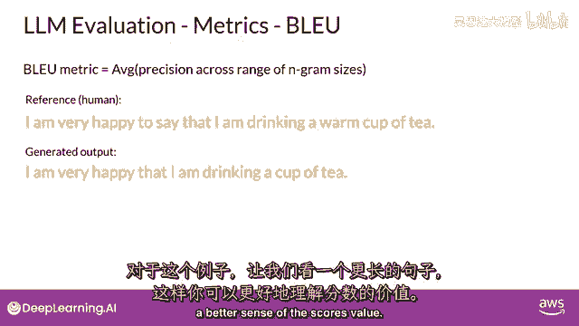

参考人类提供的句子是，我很高兴地说，现喝热茶，如深入看过个别计算，查看ROUGE时，将展示模糊结果，使用标准库。

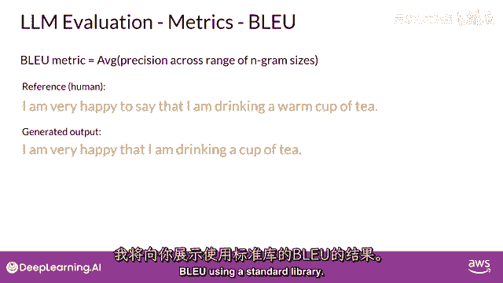

计算模糊分简单，使用Hugging Face等提供商的预写库。

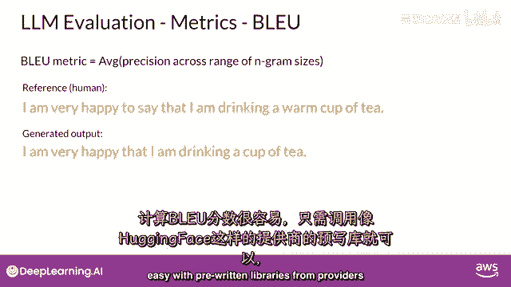

我已为每个候选句子完成，第一个候选是，我很高兴在喝茶，模糊分为0。495。

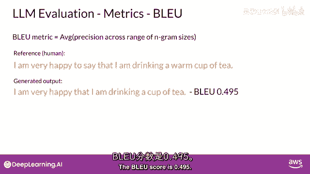

越接近原文，得分越接近1，ROUGE和模糊都很简单，计算成本低。

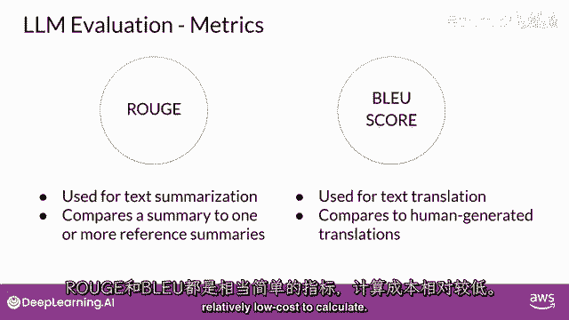

迭代模型时可作简单参考。

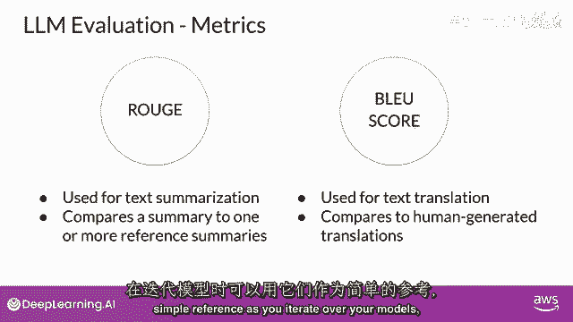

不要单独使用它们报告大型语言模型的最终评估。

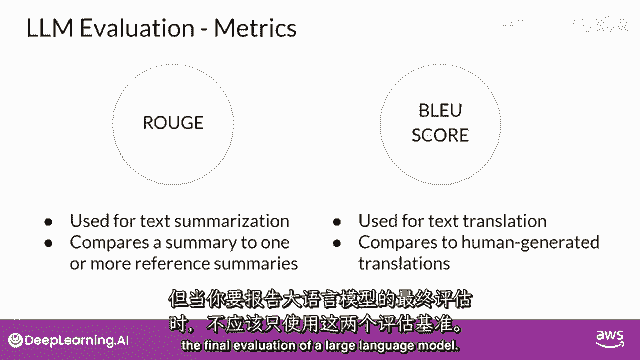

使用ROUGE评估摘要任务，使用模糊评估翻译任务，整体评估模型性能。

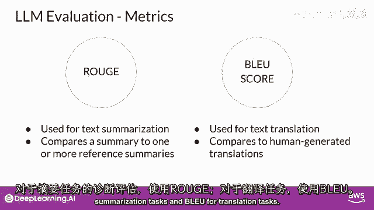

但需查看研究人员开发的一个评估基准。