# (超爽中英!) 2024公认最全的【吴恩达大模型LLM】系列教程！附代码_LangChain_微调ChatGPT提示词_RAG模型应用_agent_生成式AI - P79：使用指令对LLM进行微调6——基准测试 - 吴恩达大模型 - BV1gLeueWE5N

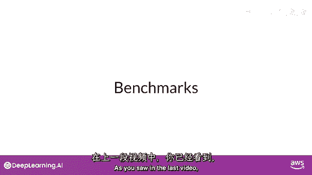

如上视频所见，LLM既复杂又简单，如ROUGE和BLUR评分，仅能告诉你模型能力多少，为全面评估和比较LLM，可利用预，存数据集和相关基准，由LLM研究人员专为该目的建立，选择合适评估数据集至关重要。

以便准确评估LLM性能，理解其真正能力，选择隔离特定模型技能的数集将有用，如推理或常识知识，关注潜在风险，如假信息或版权侵犯，应考虑模型是否在训练时见过评估数据，可更准确评估模型能力。

通过评估其未见过的数据表现，基准如glue，Superglue，或helm涵盖广泛任务和场景。

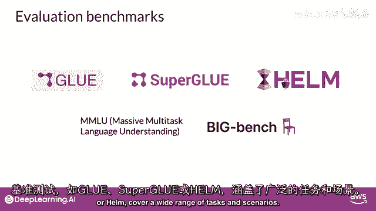

通过设计或收集测试特定方面的大型数据集。

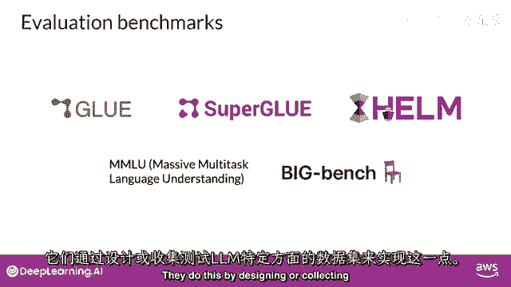

Glue或通用语言理解评估于2018年引入。

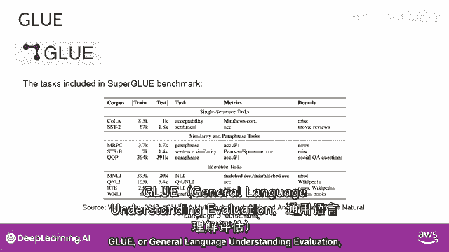

胶水是自然语言任务集，如情感分析和问答。

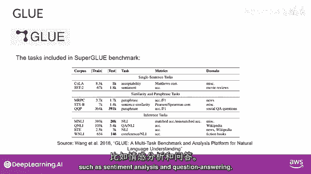

胶水旨在促进跨多任务模型的开发。

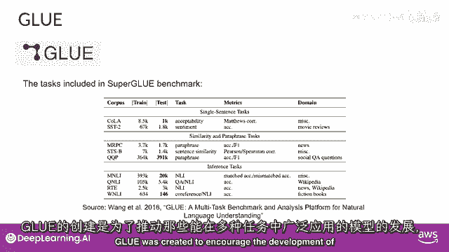

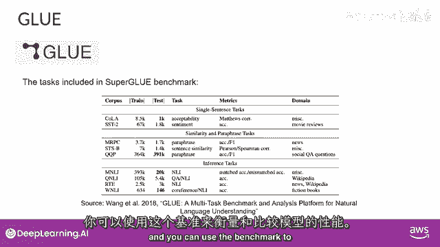

超胶水于2019年推出，以解决其前身的限制，它由一系列任务组成。

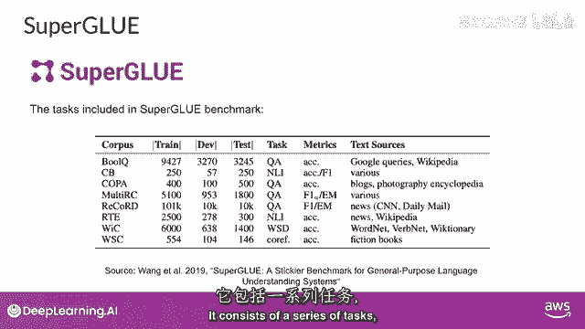

其中一些任务未包含在胶水中，其中一些是相同任务的更具挑战性版本。

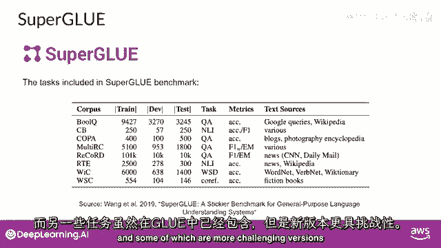

超胶水包括多句推理和阅读理解等任务。

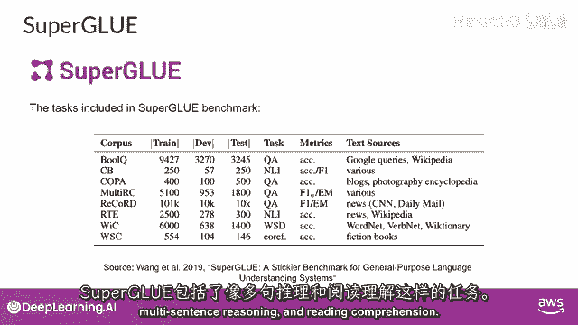

两者，胶水和超胶水，基准有排行榜，可比较模型，结果页是追踪llms进展的好资源，模型越大，对基准的性能，如超胶开始匹配人类特定任务能力，即模型在基准测试中表现与人类相当，但主观上。

我们看到它们在一般任务上未达人类水平，因此，本质上，llms涌现特性和衡量它们的基准间有军备竞赛，以下是推动llms发展的几个近期基准，这里是推动llms发展的几个新基准。

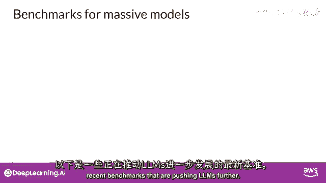

大规模多任务语言理解。

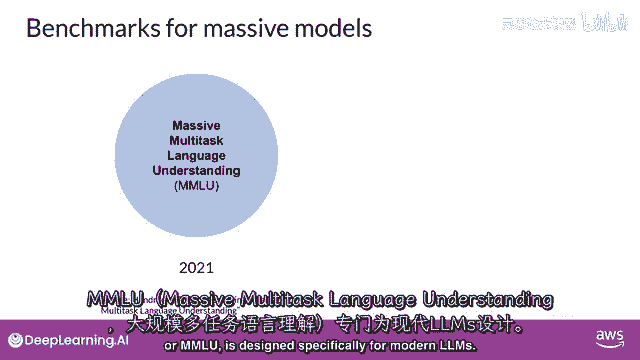

模型需具备广泛世界知识。

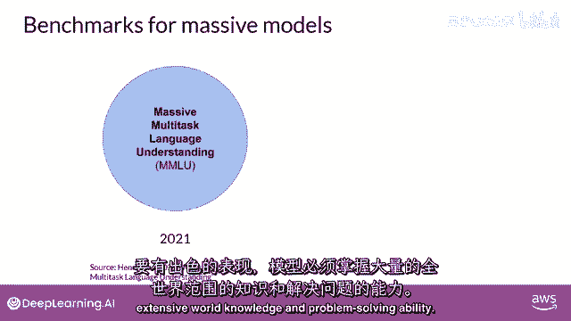

模型测试基础数学，美国历史，计算机科学，法律等，即超越基本语言理解的任务。

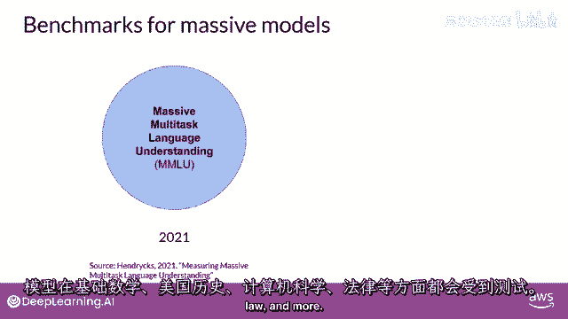

Big Bench目前包括204项任务。

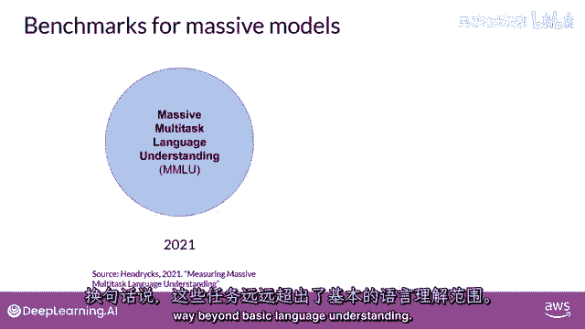

涵盖语言学、儿童发展、数学等。

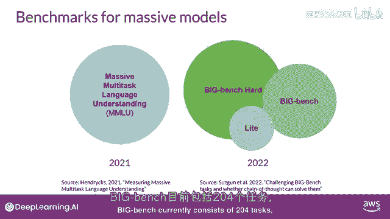

儿童发展，数学，常识，推理，生物学，物理学，社会偏见，软件开发等更多。

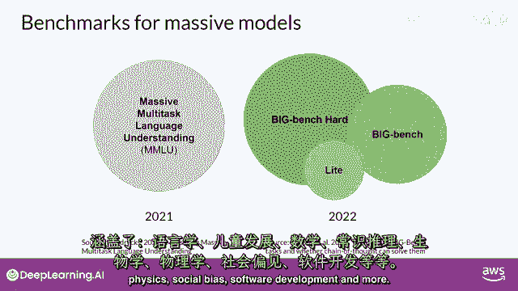

大本钟有3种尺寸，部分原因是控制成本，因为这些大型基准测试会产生大推断成本。

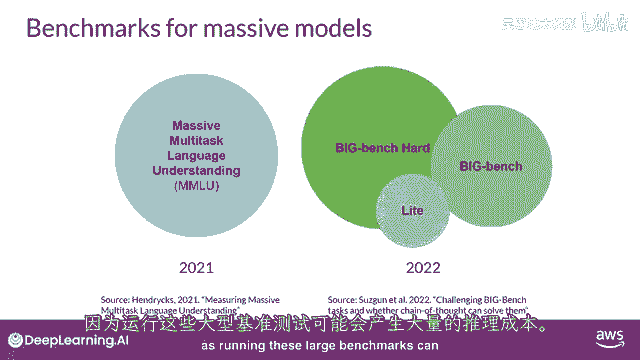

你应该了解的最终基准是语言模型的整体评估或helm，helm框架旨在提高模型的透明度，并为特定任务提供模型性能的指导，helm采用多指标方法，在16个核心场景中测量7个指标。

确保模型和指标之间的权衡清晰，helm的一个重要特点是评估超越基本准确度指标，如精确度或F1分数，基准还包括公平性，偏见和毒性指标，随着大型语言模型越来越能生成人类语言，并可能表现出潜在有害行为。

helm是一个不断发展的基准，旨在随着新场景，指标和模型的添加而不断演进，你可以查看结果页面，浏览已评估的llms。

