# (超爽中英!) 2024公认最全的【吴恩达大模型LLM】系列教程！附代码_LangChain_微调ChatGPT提示词_RAG模型应用_agent_生成式AI - P82：参数高效微调3——PEFT技术2 - 软提示 - 吴恩达大模型 - BV1gLeueWE5N

与劳拉一起，目标是找到一种高效的方法更新模型的权重，无需再次训练每个参数，PEFT中也有添加的方法，旨在提高模型性能，没有任何权重更改，在这个视频中。

你现在将探索一种名为提示调整的第二种参数高效微调方法，提示调整听起来有点像提示工程，但它们与彼此有很大的不同。

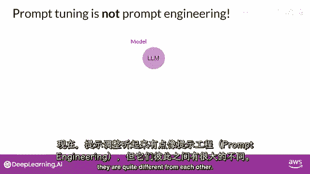

与提示工程，"你专注于你的提示语言"，"以获取你想要的完成"，这可能只需要尝试使用不同的词汇或短语，"或者更复杂，如包括一个或几个样本的推断示例"，目标是帮助模型理解你正在要求它完成的任务的本质。

"执行并生成更好的完成"。

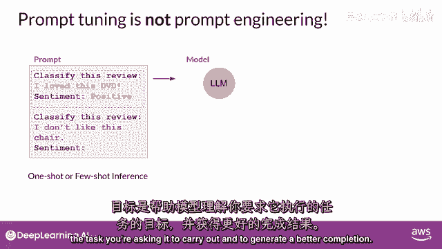

然而，"提示工程有一些限制"，"因为它可能需要大量的手动努力来编写和尝试不同的提示"，"你也受限于上下文的窗口长度"，到了一天结束时，你仍然可能无法达到完成你任务所需的性能，通过提示微调。

你向提示中添加额外的可训练标记，并让监督学习过程决定它们的最佳值，这些可训练标记被称为软提示，它被添加到代表输入文本的嵌入向量之前，软提示向量，与语言标记的嵌入向量长度相同。

包括大约二十到一百个虚拟标记可能足以获得良好的性能。

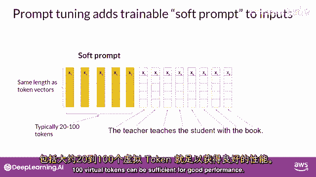

代表自然语言的标记是硬的，"从意义上说，它们各自对应于嵌入向量空间中的一个固定位置"，然而，"柔软的提示并不是自然语言中固定的连续词语"。

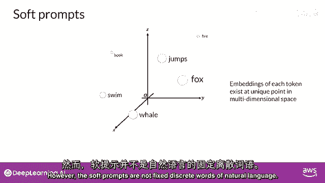

"相反地"，你可以将它们视为可以在连续的多元化中取任何值的虚拟代币。"维度嵌入空间"，"并通过监督学习"，"模型学习到的这些虚拟标记的值，能够最大化给定任务的性能"。

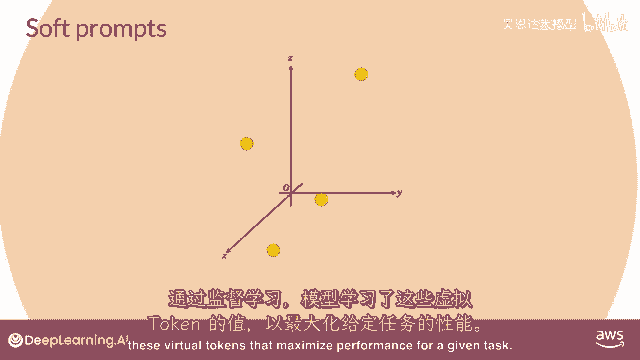

"在精确的调整中"，"训练数据集包括输入提示和输出完成或标签"，大型语言模型的权重在监督学习期间得到更新。

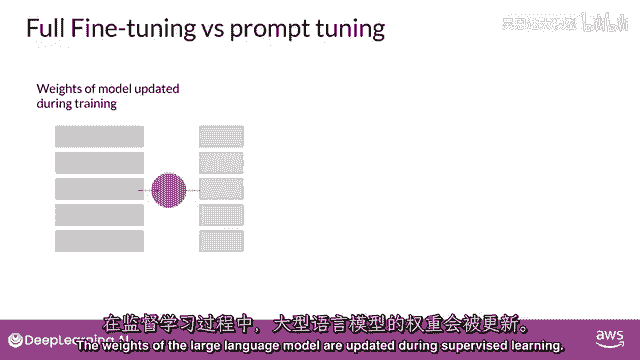

与提示调整不同，大型语言模型的权重被冻结，底层模型没有得到更新，相反，软提示的嵌入向量随时间得到更新，为了优化模型对提示的完成，提示调整是一种非常参数高效的策略，因为只有几个参数被训练。

与全细调中的几百万到数十亿个参数不同。

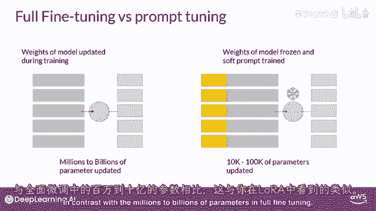

类似于你与laura看到的情况，你可以为每个任务训练一套不同的软提示，然后在推理时轻松地替换它们，你可以为一个任务训练一套软提示。

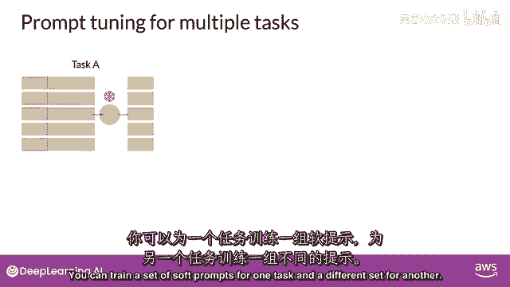

并为另一个任务训练一套不同的，以在推理时使用它们，你将在输入提示的末尾添加学习到的词元，以切换到另一个任务，你只需更改软提示，软提示在磁盘上非常小，因此，这种微调极其高效和灵活。

你会注意到所有任务都使用相同的llm，你所需要做的就是在推理时替换软提示。

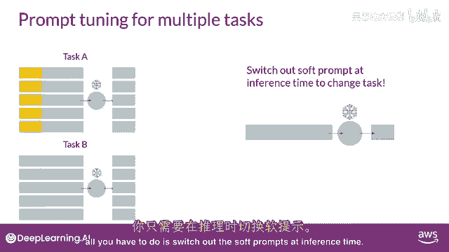

那么在原始论文中，提示调整的性能如何，由布莱恩·莱斯特和他的谷歌合作者在此方法中探索，作者在此图中比较了提示调整与其他方法在多种模型大小上的性能，从论文中，你可以在x轴上看到模型大小。

在y轴上看到超级胶水得分，这是您本周早些时候学到的评估基准，它评估模型在多个不同语言任务上的性能，红色线显示了通过单个任务全细调创建的模型的得分，而橙色线显示了使用多任务细调创建的模型的得分。

绿色线显示了提示调整的性能，最后，蓝色线显示了仅针对提示工程的得分，正如你可以看到，提示调整在较小的llms上的性能不如全细调，然而，随着模型大小的增加，提示调整的性能也随之提高。

一旦模型的参数数量达到约十亿。

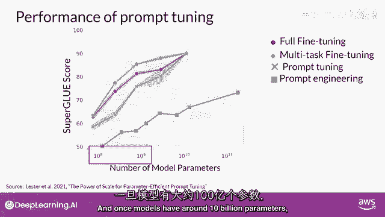

提示调整可以与全细调一样有效，并提供比仅使用提示工程显著提升性能的优势，需要考虑的一个潜在问题是学习到虚拟标记的解释性，记住，因为软提示标记可以取连续嵌入向量空间中的任何值。

训练标记不对应于任何已知标记，LLM词汇表中的词汇或短语，然而，对软提示位置的最近邻居标记的分析显示，它们形成了紧密的语义簇，换句话说，最接近软提示标记的词汇具有相似的意义，被识别的词汇通常与任务有关。

这表明提示正在学习像词的表示。

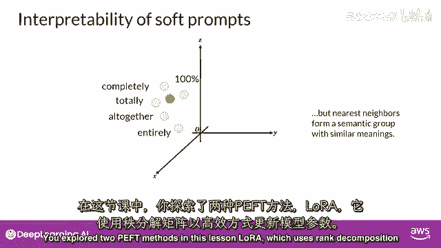

"劳拉在这节课中探索了两种不良的方法"，"它使用秩分解矩阵以高效更新模型参数"，"并及时调整，在你 的提示中添加可训练的标记"，"并且模型权重未被修改"。

"这两种方法都允许你根据任务可能的性能改进来精细调整模型。"。

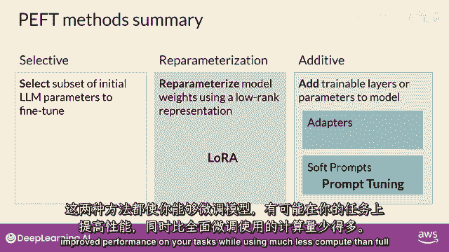

"在使用比全精细调整方法少得多的计算资源时"，"劳拉在实践中广泛使用"，"由于在许多任务和数据集上与全面微调具有可比性"。

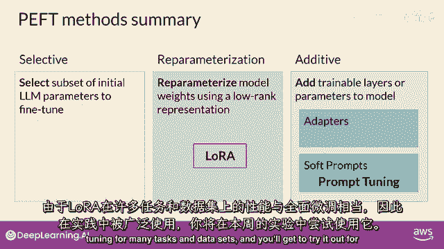

"并且在这周的实验室里，你将有机会亲自尝试它。"，"所以，恭喜你完成了第二周的任务"，让我们回顾一下你本周早些时候看到的内容。

Mike，通过名为指令微调的过程，为你解释了如何适应基础模型，在这个过程中，你看了一些用于训练平面五模型的提示模板和数据集，你也看到了如何使用如rouge和helm等评估指标和基准。

来在实践中测量模型微调的成功，指令微调已被证明非常有效和有用，在各种自然语言使用案例和任务中都有广泛的应用，仅仅需要几百个例子，你就可以根据你的特定任务微调一个模型，这真是令人惊叹，接下来。

你看到参数高效的微调或盗窃如何减少调整模型的计算需求，你学习了两种你可以用于此的方法，laura和提示微调，顺便说一句，你也可以将laura与第一周中学习的量化技术结合使用，以进一步减少你的内存占用。

这在实践中被称为"奎拉拉"。"佩夫被广泛用于最小化计算和内存资源"，"最终降低微调成本"。