# (超爽中英!) 2024公认最全的【吴恩达大模型LLM】系列教程！附代码_LangChain_微调ChatGPT提示词_RAG模型应用_agent_生成式AI - P86：人类反馈强化学习4——RLHF - 获取人类的反馈信息 - 吴恩达大模型 - BV1gLeueWE5N

微调大型语言模型第一步，选择模型开始工作，用它准备人类反馈数据集，选用的模型应能执行任务，无论是文本摘要，问题，回答，或其他一般任务。

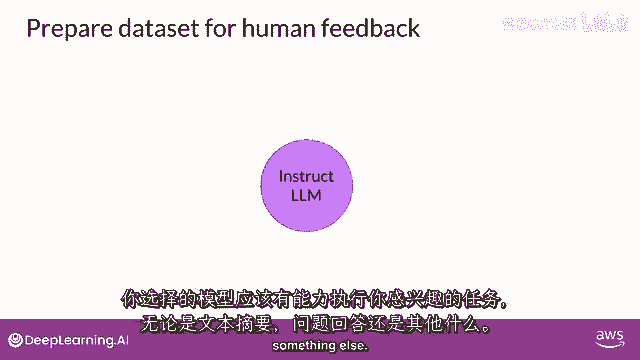

从已微调多任务。

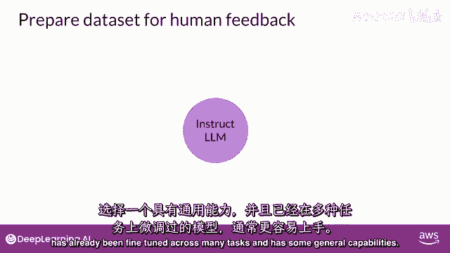

并具通用能力的指导模型开始可能更容易，然后使用此llm，结合提示数据集生成每个提示的不同响应。

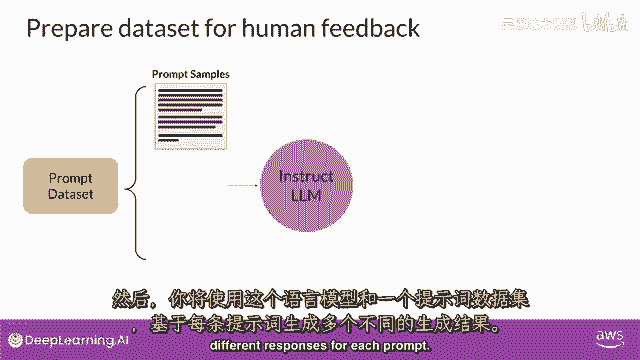

提示数据集由多个提示组成，每个提示都由lm处理以产生一组完成。

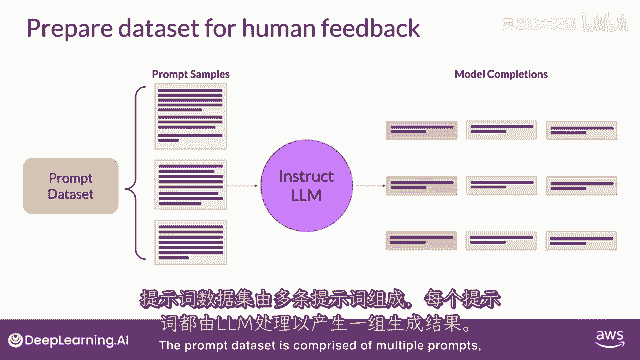

下一步是收集人类标签者的反馈，关于llm生成的完成，这是人类反馈部分，强化学习首先使用人类反馈，您必须决定人类应评估的标准。

这些完成的可能是迄今为止讨论的任何问题。

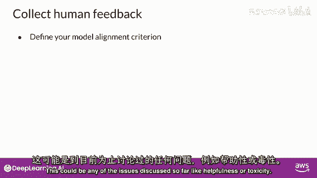

如帮助性或毒性，一旦决定，请评估数据集中的每个完成，基于标准。

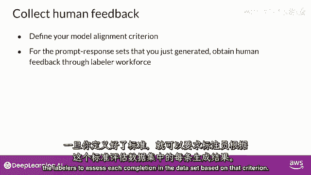

看个例子，这次提示是：我家太热。

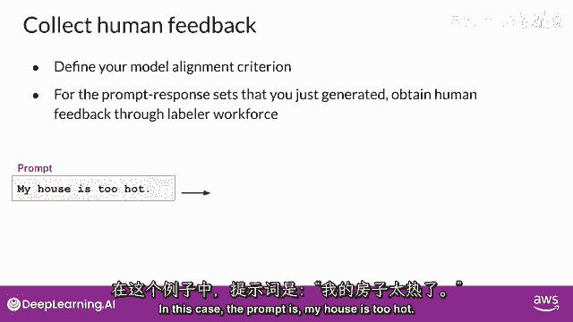

将提示传递给llm，然后生成三个不同完成，你给标签员的任务是按帮助性排名，从最有帮助到最没帮助，所以标签员可能决定完成二是最有帮助的，告诉用户可降温方法，完成一或三无帮助，但标记者可能认为三最差。

因模型与用户输入相悖，标记者将最佳完成排第二，此过程对多提示完成集重复，构建可训练奖励模型的数据集，最终代替人类执行工作，相同提示，完成集常分配给多人类标记者，建立共识，减少差标签影响，如第3个标签者。

其回答与其他人不同，可能误解说明，这实际上很重要，说明清晰影响反馈质量，标签者常从多样化全球样本中抽取，这是为人类标签者编写的示例说明，这将在任务开始前呈现给标签者阅读，并在处理数据集时可供参考。

说明从总体任务开始，在这种情况下，选择最佳完成提示，说明继续提供额外细节，指导标签员如何一般完成任务，这些说明越详细，标签员理解他们必须执行的任务并按您希望的方式完成的可能性就越高，例如。

在第二个说明项中，标签员被告知应基于，他们对响应正确性和信息性的感知做出决定，他们被告知可以使用互联网核实事实，他们可以使用互联网核实，检查并查找其他信息，他们被告知如何处理平局。

即他们认为同样正确和信息丰富的成对完成，工人被告知排名是可以的，两个相同的完成，但应尽量少做，这里值得强调的最终指示是遇到无意义，令人困惑或不相关的答案时该怎么做，在这种情况下，工人应选择f而不是排名。

低质量答案可轻易删除，提供详细指导可提高高质量回复概率，确保人类个体完成任务方式相似，这有助于确保标注完成的集合，代表共识观点，人类标注者完成提示完成集评估后，您拥有所有数据，需要训练奖励模型。

将用于强化学习中分类模型完成，而非人类，在开始训练奖励模型之前进行微调，然而，需将排名数据转换为成对比较。

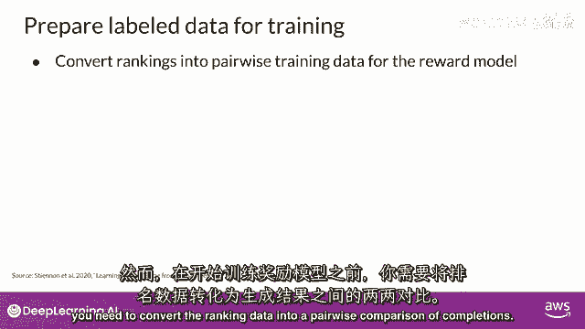

换句话说，所有可能的完成对，从可用选项到提示应分类为0或1分。

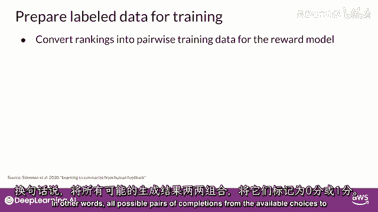

如图所示，对一个提示有3个完成，人类标签员分配的排名为213，如图所示，1为最高排名，对应最受欢迎的回应。

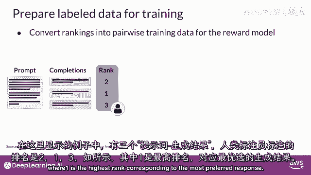

三种不同完成，三种紫色可能。

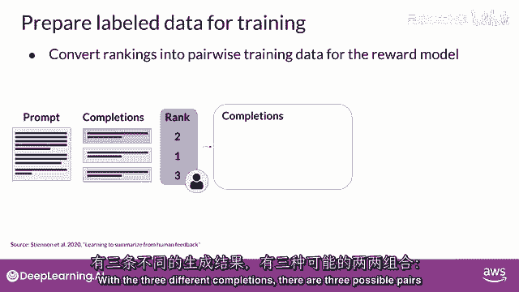

黄色，紫色，绿和黄绿。

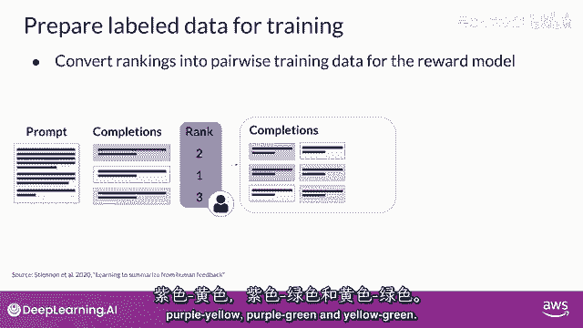

根据提示的备选完成数n。

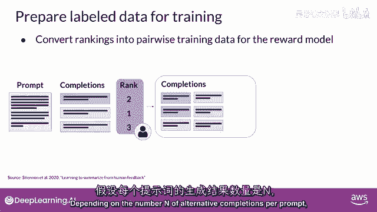

每对有n选2组合。

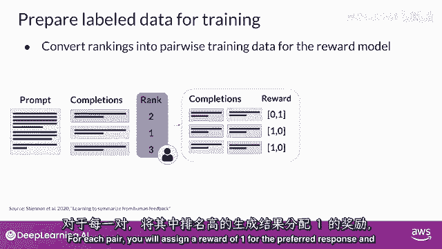

给优选回复1分，给次选回复0分。

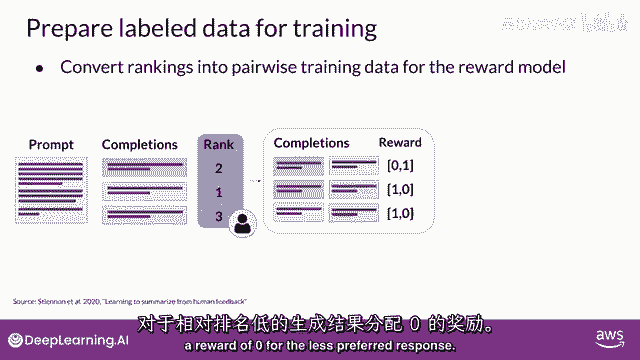

然后重排提示，优选在前。

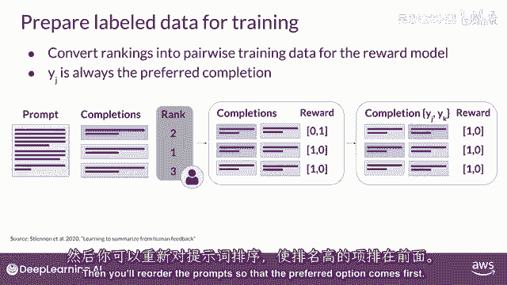

这是重要一步，因奖励模型期待首选完成，即称为y_sub_j第一，一旦完成此数据，重构人类回应将符合训练格式。

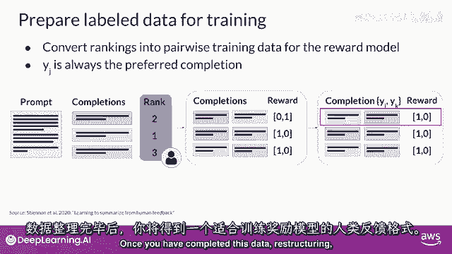

奖励模型注意，虽然点赞，点踩，反馈常比排名反馈更容易一起。

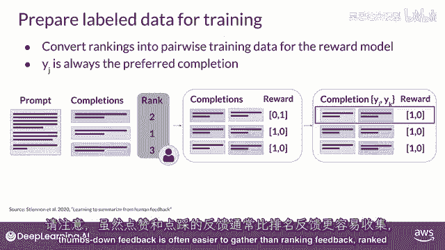

排名反馈提供更多提示完成数据训练奖励模型，如你所见。