# (超爽中英!) 2024公认最全的【吴恩达大模型LLM】系列教程！附代码_LangChain_微调ChatGPT提示词_RAG模型应用_agent_生成式AI - P88：人类反馈强化学习6——RLHF - 通过强化学习进行微调 - 吴恩达大模型 - BV1gLeueWE5N

好的，把所有东西整合起来，看看如何在强化学习过程中使用奖励模型，更新llm权重并生成人类对齐模型，记住要从已经在您感兴趣的任务上表现良好的模型开始。

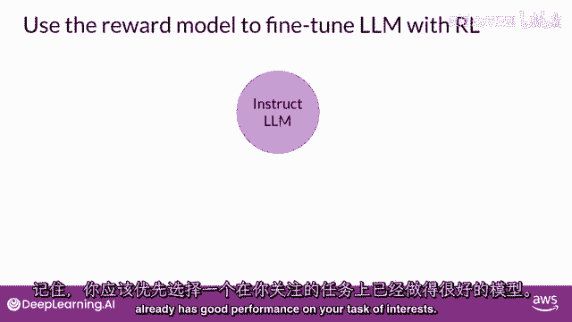

所以您将努力对齐一个指令。

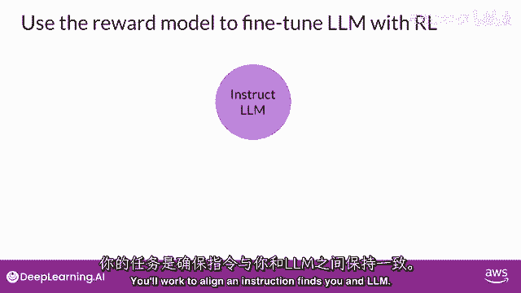

首先您会从提示数据集中传递一个提示。

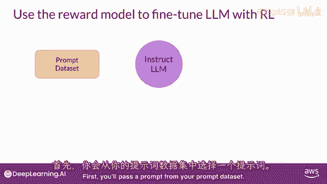

在这种情况下，狗是指导，一条肢体，然后生成一个完成。

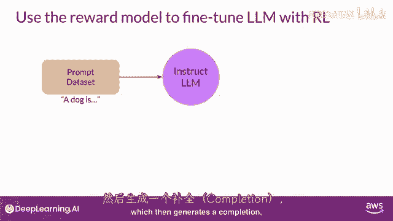

在这种情况下，一个毛茸茸的动物，接下来，您将把这个完成和原始提示发送给奖励模型作为提示完成对。

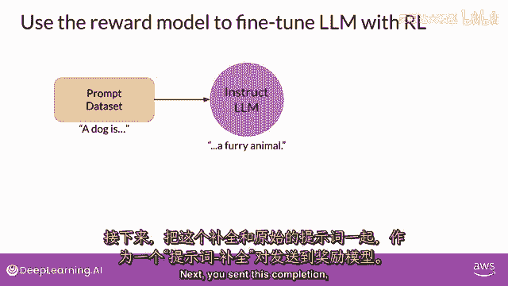

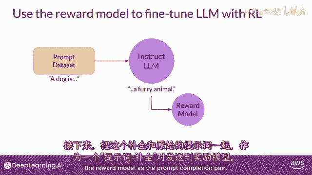

奖励模型基于它所训练的人类反馈评估对。

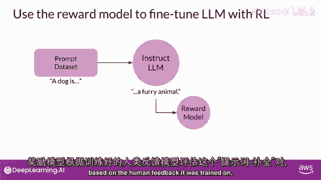

并返回一个奖励值，更高的值，如这里显示的0。24，代表更对齐的响应。

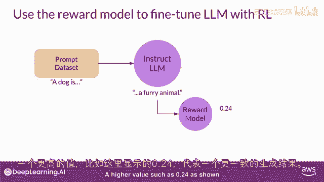

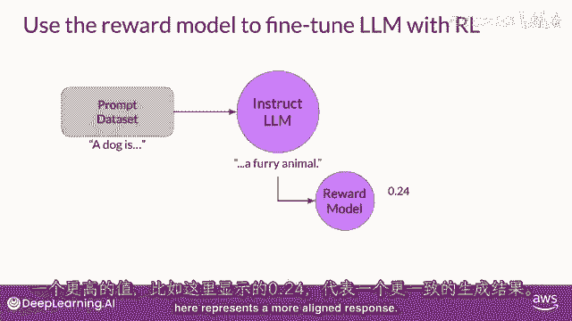

较不一致的响应将获得较低的值，例如，-0。53。

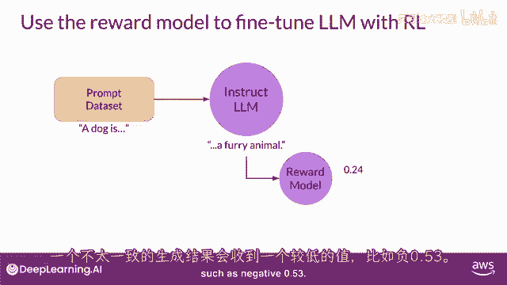

然后您将把这个奖励值传递给提示完成对，到强化学习算法以更新llm的权重并使其朝着。

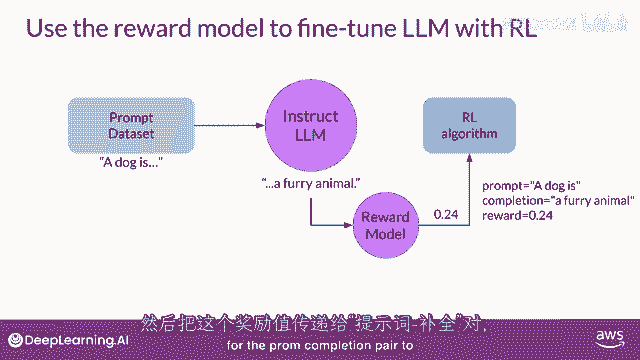

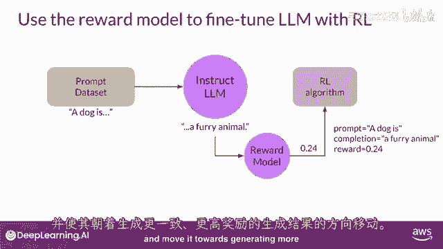

生成更多对齐的更高奖励响应，让我们称这个中间版本的模型为。

rl更新llm，这些步骤一起形成一个rhf过程的单个迭代。

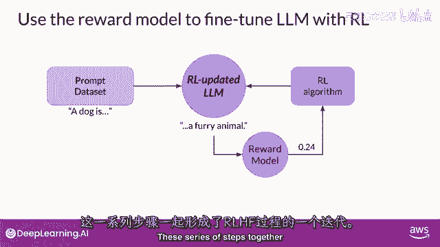

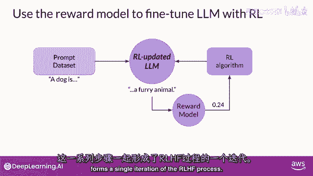

这些迭代将持续给定的周期数。

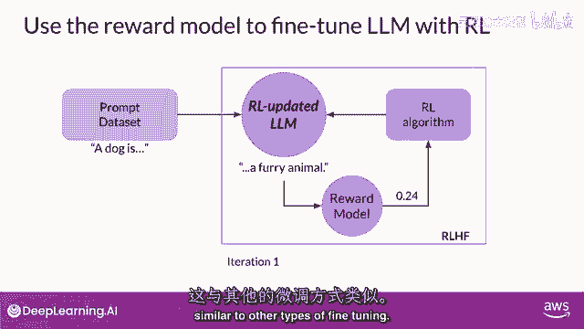

类似于其他类型的微调，您可以看到由rl更新llm生成的完成获得更高的奖励得分。

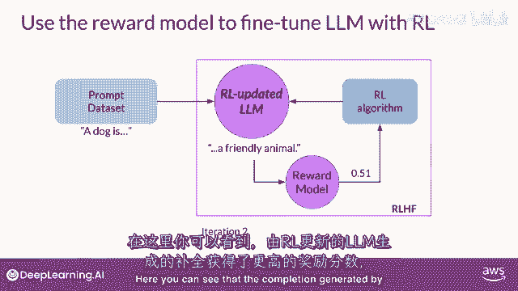

指示权重更新已导致更对齐的完成。

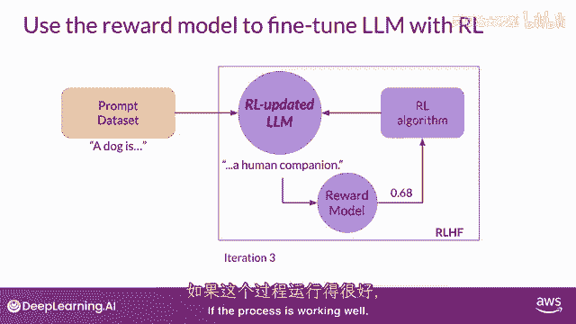

如果过程进展顺利，您将看到每次迭代后奖励都有所提高，因为模型产生越来越符合人类偏好的文本。

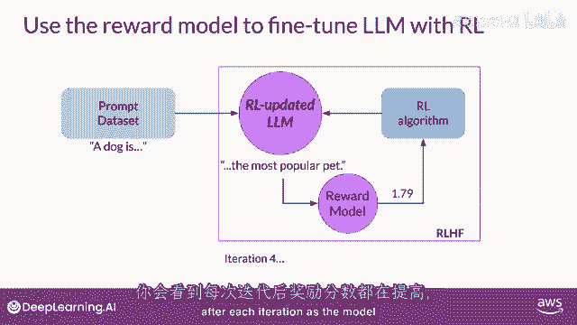

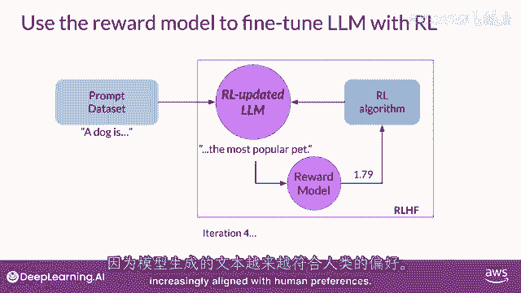

您将继续这个迭代过程，直到您的模型对齐，基于某些评估标准。

例如，达到您定义的有用性阈值。

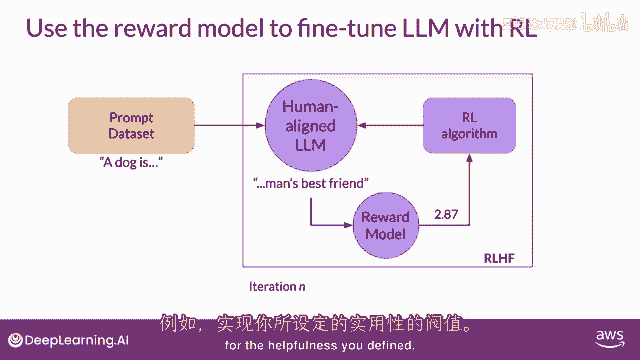

您还可以定义最大步骤数，例如。

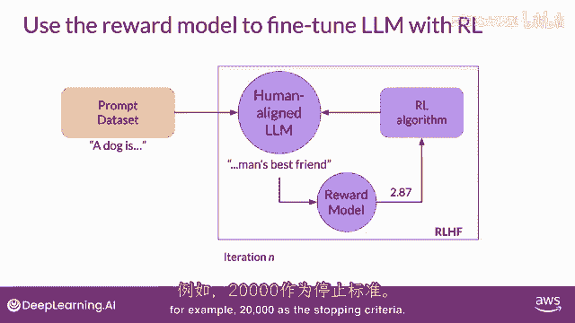

20，000作为停止标准，让我们称微调后的模型为人类对齐llm。

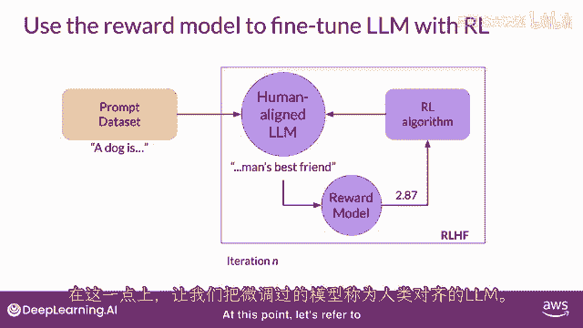

我们还没有讨论的一个细节是强化学习算法的确切性质，这是接受奖励模型输出的算法，并使用它来更新llm模型权重。

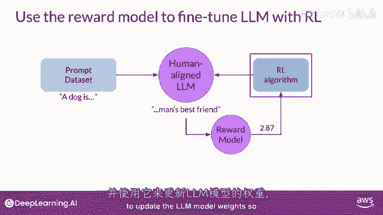

以便奖励得分随时间增加。

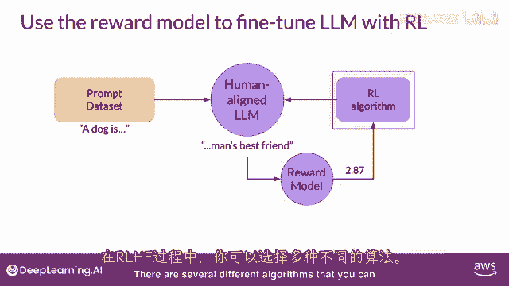

对于rf过程的这一部分，您可以使用几种不同的算法。

一个流行选择是近端策略优化或简称ppo。

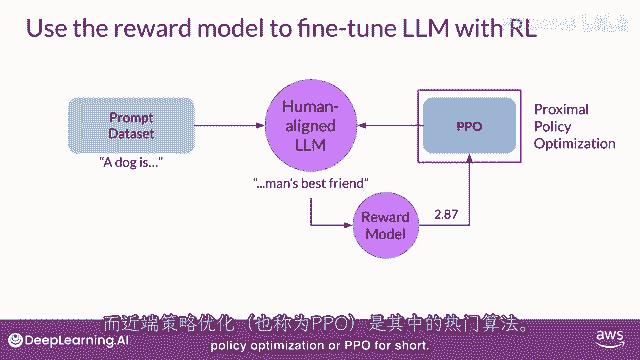

ppo是一个相当复杂的算法，您不必熟悉所有细节。

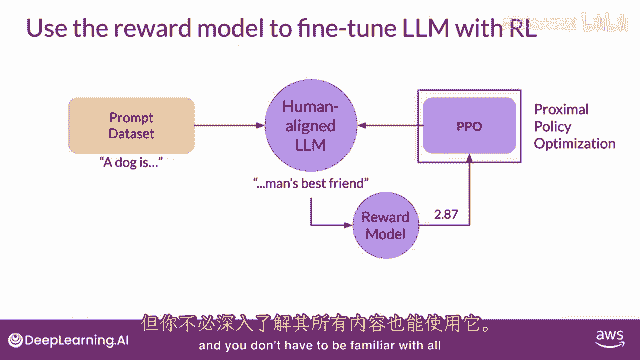

就能使用它，然而，它可能是一个难以实现的算法，更深入地了解其内部工作原理是有帮助的。

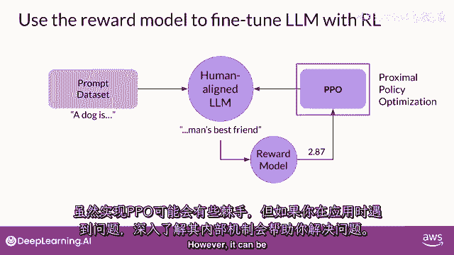

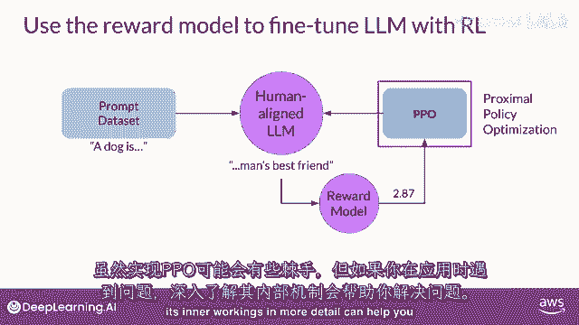

如遇问题，可帮你排错，让它工作，详细解释PPO算法，我邀请了AWS同事，E，K，深入探讨技术细节，下一个视频可选，可跳过，看奖励破解视频，完成测验或本周作业无需此信息，然而，鼓励查看详情。

因LLM日益重要。