# (超爽中英!) 2024公认最全的【吴恩达大模型LLM】系列教程！附代码_LangChain_微调ChatGPT提示词_RAG模型应用_agent_生成式AI - P89：人类反馈强化学习7——PPO增强学习算法深度解析 - 吴恩达大模型 - BV1gLeueWE5N

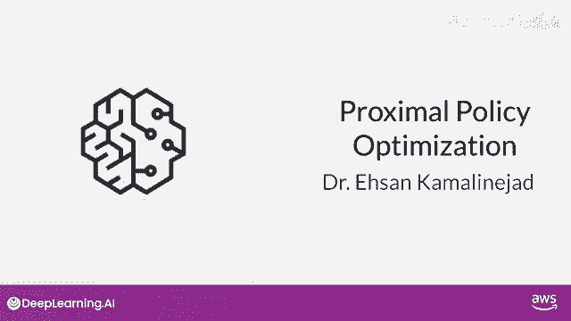

Dr。的儿子卡玛利尼·贾德，通常被称为K的机器学习应用科学家，目前是亚马逊NLP开发的首席科学家，之前共同创立了计算机视觉领域的Y Combinator初创公司Visual One，在那之前。

他是苹果的机器学习技术负责人，负责项目如Memories，EA还是加州州立大学东湾分校的数学副教授，感谢今天加入讨论PPO强化学习算法，谢谢邀请我，PPO代表近端策略优化。

这是一种强大的解决强化学习问题的算法，顾名思义，PPO优化策略，在这种情况下，使LLM更符合人类偏好，经过多次迭代，PPO更新LLM，更新小且在边界内，结果是一个接近先前版本的更新LLM。

因此名为近端策略优化，保持这些变化在这个小区域内导致更稳定的学习。

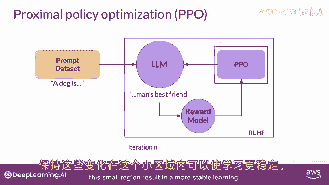

好的，目标是更新策略以最大化奖励，你能猜出在大型语言模型的具体背景下这是如何工作的吗，是的，很高兴你开始用初始指导LLM进行PPO，然后，从高层次来看，每个PPO周期包括两个阶段，在第一阶段。

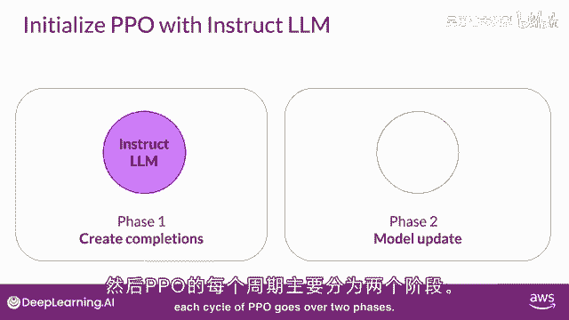

LLM被用来进行一系列实验，完成给定的提示，这些实验允许你在第二阶段更新LLM以对抗奖励模型，记住，奖励模型捕获了人类偏好，例如，奖励可以定义响应有多有帮助，无害和诚实。

完成奖励是一个重要的PPO目标量，我们通过这个LLM的单独头部——价值函数来估计这个量，让我们更仔细地看看价值函数。

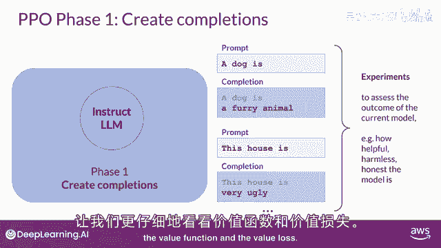

和价值损失，假设首先给出了一些提示，你生成LLM对提示的响应，然后使用奖励模型计算提示完成的奖励，例如，这里显示的第一个提示完成可能获得1。87的奖励，下一个可能获得-1。24的奖励，等等。

你有一组提示完成和相应的奖励，价值函数估计给定状态s的预期总奖励。

换句话说，当LM生成每个完成令牌的时，你想估计基于当前令牌序列的总体未来奖励，价值损失衡量预测奖励与实际奖励之间的差异，可视为基准，评估完成质量与对齐标准，假设完成此步，预计未来总奖励0。34。

生成下一个标记时，预计未来总奖励增至1。23，目标是减少价值损失，即实际未来总奖励，示例中，1。87与其对价值函数的近似，示例中，一二三，损失使未来奖励估计更准，值函数用于第二阶段优势估计，稍后讨论。

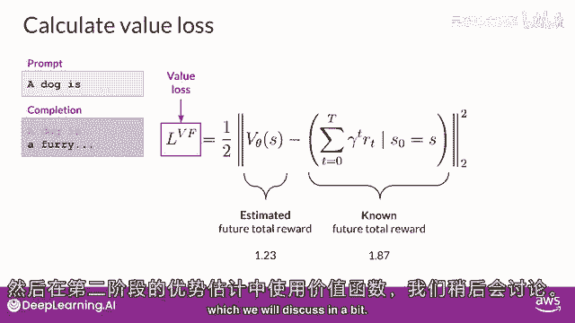

类似你开始写文章，对最终形式有大致想法，甚至在你写之前，好的，好的，你提到一阶段确定的损失和奖励用于二阶段，更新权重以更新LLM，能否更详细解释此过程？当然，在二阶段对模型进行小更新。

评估这些更新对模型对齐目标的影。

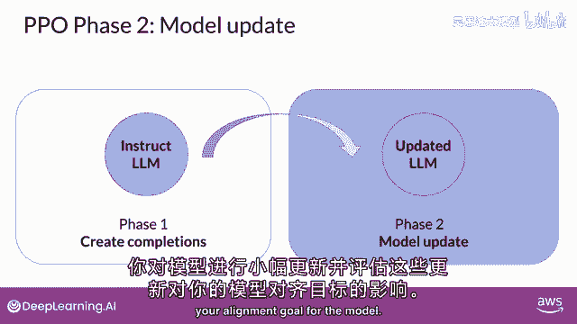

模型权重，更新由提示完成引导，损失和奖励，PPO确保模型更新在一个小区域内，称为信任区，这是PPO的近端方面发挥作用的地方，理想情况下，这些小更新将模型推向更高奖励。

PPO策略目标是此方法的主要成分，记住目标是找到预期奖励高的策略，换句话说，你试图更新LLM，权重导致更符合人类偏好的完成，因此获得更高奖励，策略损失是PPO算法在训练中试图优化的主要目标。

我知道数学看起来很复杂，但实际上它比看起来简单，逐步分解，首先，关注主要表达，忽略其他，子t的π，给定s子t，在LLM的上下文中，是下一个token的概率，给定当前提示的A子t，S子t，动作。

A子t是下一个token，状态s子t是完成的提示，到标记t为止，分母是下一个标记的概率，初始版本的llm，是冻结的，分子是下一个标记的概率，通过更新的llm，我们可以改变以获得更好的奖励。

帽子下标t是特定动作选择的估计优势项，优势项估计当前动作，与该状态下所有可能动作的比较，所以我们看新标记后完成预期的未来奖励，并估计这种完成与其余的比较优势，有一个递归公式来估计这个量。

基于我们之前讨论的价值函数，这里，我们关注直观理解，这是我刚刚描述的可视化表示，你有提示s，你有不同的路径来完成它，如图所示的不同路径，优势项告诉你当前标记，相对于所有可能标记在这个可视化中的好坏。

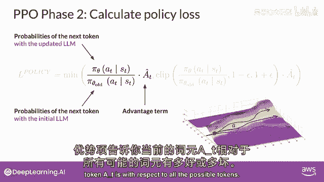

顶部路径更高，是更好的完成，获得更高的奖励，底部路径下降，是更差的完成，所以我有一个问题，为什么最大化这个术语导致更高的奖励，考虑建议标记的优势为正的情况，正优势意味着建议标记优于平均。

因此增加当前标记的概率似乎是一个好的策略，导致更高的奖励，这转化为最大化我们这里的表达式，如果建议的标记比平均差，优势将再次为负，最大化表达式将降级标记，这是正确的策略。

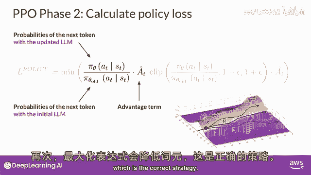

所以总体结论是最大化这个表达式会导致更好的对齐的llm，好的很好，那么我们只需最大化这个表达式，然后直接，最大化表达式会导致问题，因为我们的计算在优势估计有效的前提下是可靠的。

优势估计仅当旧和新策略接近时才有效，这就是其余术语发挥作用的地方，所以后退一步，再次看整个方程，这里你选择两个术语中较小的，我们刚刚讨论的，和这个第二。

修改后的版本注意这个第二个表达式定义了两个策略接近的区域，这些附加条款是护栏，仅定义了靠近llm的区域，我们的估计有小的误差，这称为信任区域，这些附加条款确保我们不太可能离开信任区域，总之。

优化ppo策略目标可得到更好的llm。

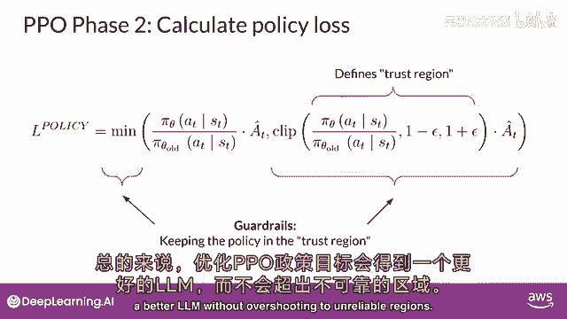

不会过度到不可靠区域，还有其他组件吗？是的，还有熵损失，策略损失使模型向对齐移动，目标熵允许模型保持创造力。

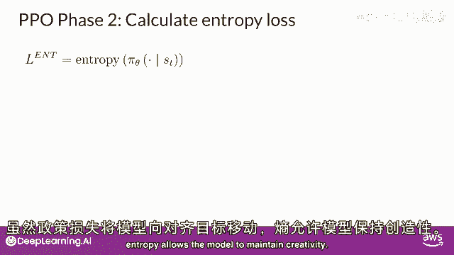

如果保持熵低，你可能会总是以相同的方式完成提示，如图所示。

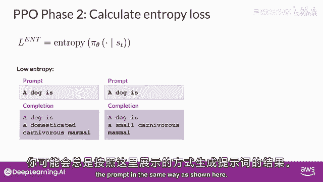

更高的熵引导llm向更多创意，这类似于第一周看到的llm温度设置，区别是温度影响模型创造力在推理时间，而熵影响模型创造力在训练期间。

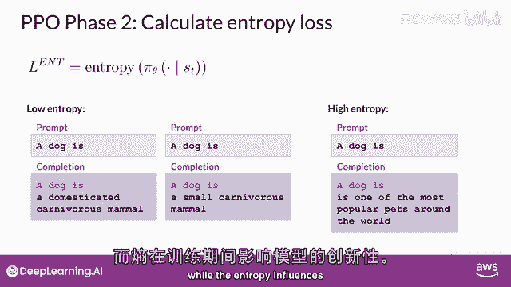

将所有项作为加权总和，我们得到ppo目标，以稳定方式更新模型以符合人类偏好，这是总体ppo目标，c一和c二系数是超参数，ppo目标通过反向传播更新模型权重。

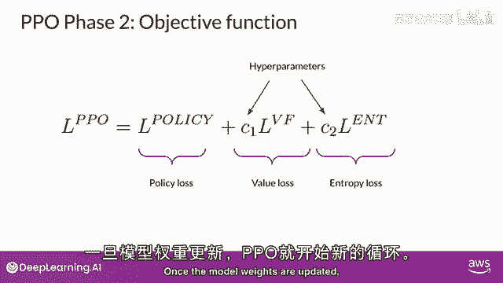

一旦模型权重更新，ppo开始新的周期进行下一次迭代，llm被更新的llm替换。

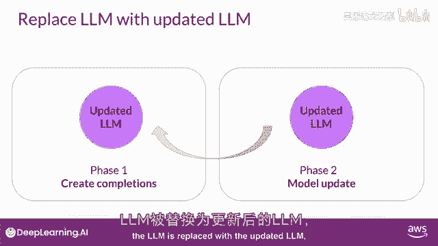

经过多次迭代后，开始新的ppo周期，你到达与人类对齐的llm，还有其他强化学习技术用于rhf吗？

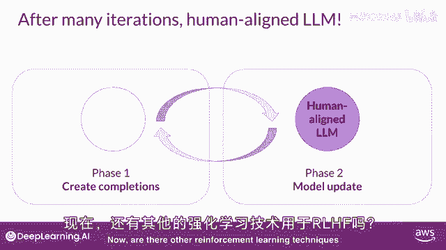

是的，例如，Q学习是另一种通过rl微调llms的技术，但ppo是目前最受欢迎的方法，在我看来，ppo流行因为它具有复杂性和性能的正确平衡，虽然如此，通过人类或AI反馈微调llms是一个活跃的研究领域。

我们可以期待这个领域在不久的将来会有更多的发展，例如，就在我们录制这个视频之前，斯坦福的研究人员发表了一篇描述称为直接偏好优化的技术论文，这是一种比rf更简单的替代方法，像这样的新方法仍在积极开发中。

需要做更多的工作来更好地理解它们的优点，但我认为这是一个非常令人兴奋的研究领域，同意，非常感谢您分享关于ppo和强化学习的见解。

