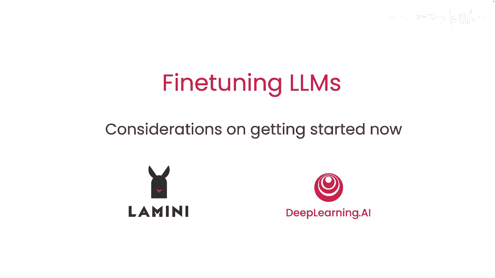
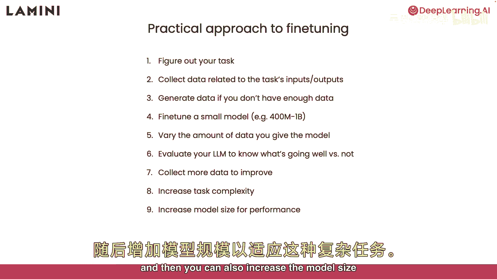
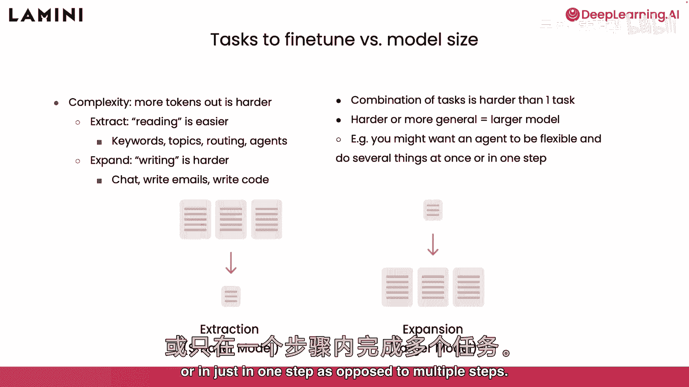
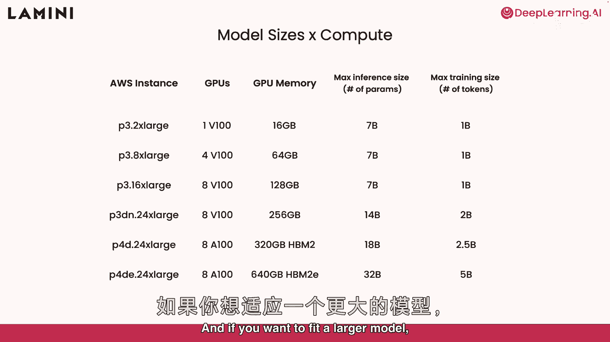
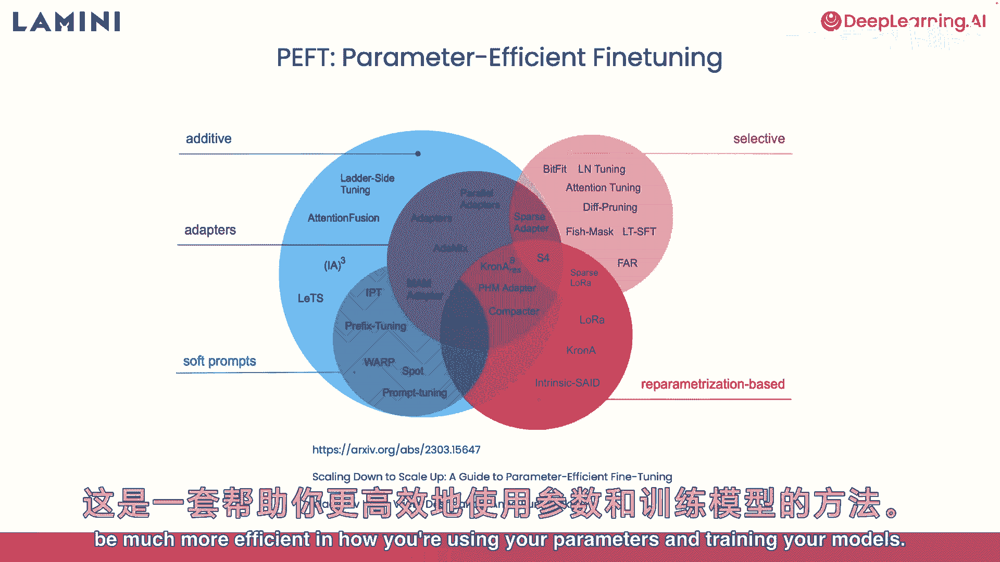
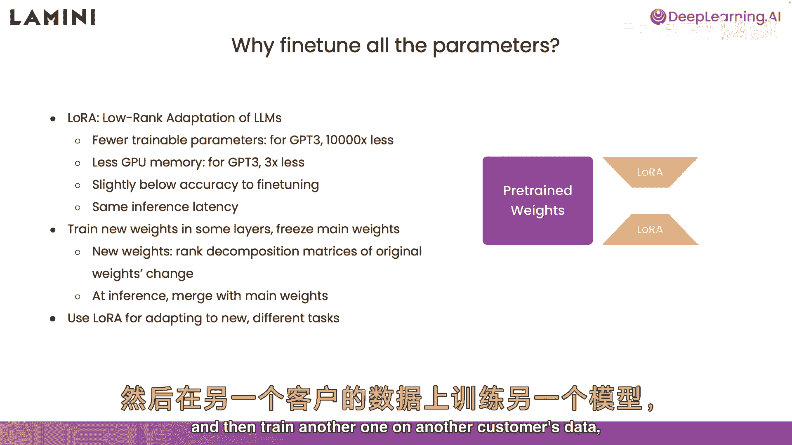

# (超爽中英!) 2024公认最全的【吴恩达大模型LLM】系列教程！附代码_LangChain_微调ChatGPT提示词_RAG模型应用_agent_生成式AI - P8：8-建议和实用技巧 - 吴恩达大模型 - BV1gLeueWE5N

好的，你完成了最后一课，这些是开始时要考虑的，现在，一些实用技巧，以及更高阶训练方法的预览，首先，一些微调步骤，总结一下，首先，确定任务，收集与任务相关的数据，输入和输出，按此结构组织。

如果没有足够的数据，没问题，生成一些或使用提示模板创建更多，首先，微调一个小模型，推荐4亿到10亿参数的模型，以了解该模型性能如何，你应该改变实际给模型的数据量，以了解数据量对模型走向的影响。

然后评估模型，看看进展如何，最后，通过评估收集更多数据以改进模型，从那里，你可以增加任务复杂性，现在可以让它更难，然后你也可以增加模型大小以提高复杂任务性能。

在任务微调中，你了解了，阅读任务和写作任务，写作任务更难，这些是更广泛的任务，如聊天，写电子邮件，写代码，因为模型产生了更多的标记，所以这是一个对模型来说更困难的任务。

更难的任务往往需要更大的模型才能处理，另一种让任务更难的方法是组合任务，让模型做组合的事情而不是单一任务，这意味着让代理灵活，同时做几件事或仅一步，而不是多步。

所以，现在你对任务复杂度所需的模型大小有了感觉，还有计算要求，基本上关于硬件，你需要运行模型的实验室，你看到那些7000万参数的模型在CPU上运行，它们不是最好的模型，我建议从更通用的东西开始，所以。

如果你看这张表，第一行，我想指出的是可用的1v100 GPU，例如，在AWS上，所以，也支持其他云平台，内存有16GB，可运行70亿参数模型，但训练需更多内存存梯度，实际仅能适配10亿参数模型。

若要适配更大模型。

可查看其他选项，很棒，或许你认为不够，想处理更大模型，那么，有种叫盗窃或参数高效，微调，一系列不同方法助你，更高效使用参数和训练模型。

我喜欢的叫Laura，代表低秩适应，Laura减少需训练权重数，对GPT-3大幅减少，例如，发现可减少1万倍，结果需3倍内存，精度略低于微调，但仍为高效方法，推理延迟不变，Laura究竟如何？实际上。

在模型部分层训练新权重，冻结主要预训练权重，蓝色部分为冻结，全部冻结，你有这些新橙色重物，那些是Lora重物，新重物，这有点数学化，原始权重的秩分解矩阵是否改变，但重要的是较少，所以你知道这里的数学。

你可以单独交替训练这些，而不是预先训练的权重，但在推理时间，能够将它们合并回主要预先训练的权重，优化精细调优模型更高效，我真正兴奋用Laura做，是适应新任务。

这意味着你可以用Laura在一个客户的数据上训练模型，然后在另一个客户的数据上训练另一个。

然后在推理时合并它们。