# (超爽中英!) 2024公认最全的【吴恩达大模型LLM】系列教程！附代码_LangChain_微调ChatGPT提示词_RAG模型应用_agent_生成式AI - P91：人类反馈强化学习9——扩大人类反馈的规模 - 吴恩达大模型 - BV1gLeueWE5N

尽管你可以使用奖励模型来消除人类评价的需要，在rhf微调期间，最初产生训练的奖励模型所需的人类努力巨大，用于训练奖励模型的标签数据通常需要庞大的标签团队。

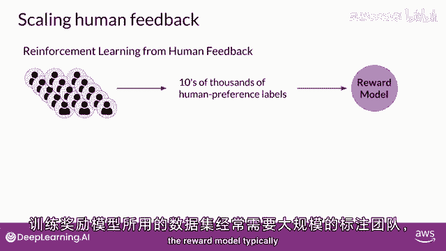

有时需要数千人来评估许多提示。

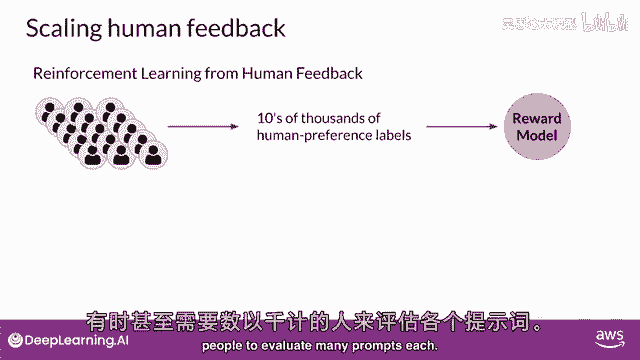

这项工作需要大量的时间和其他资源。

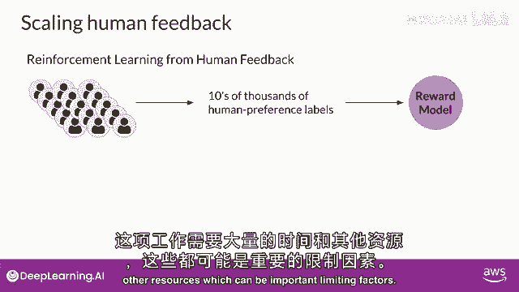

随着模型数量和用例的增加，这些可能是重要的限制因素，人类努力成为一种有限的资源。

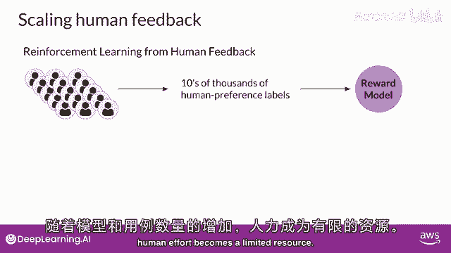

扩大人类反馈的方法是研究活动的活跃领域。

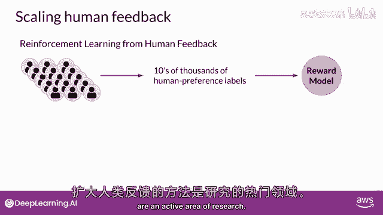

一种克服这些限制的想法是通过模型自我监督进行扩展。

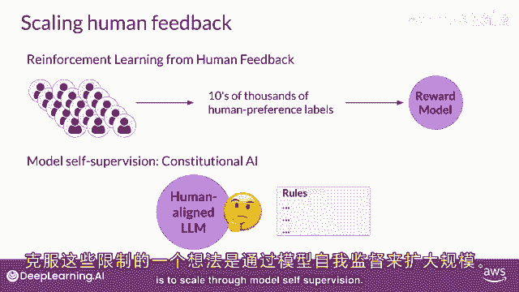

宪法式AI是2022年由人类中心主义研究者首次提出的一种规模监督方法。

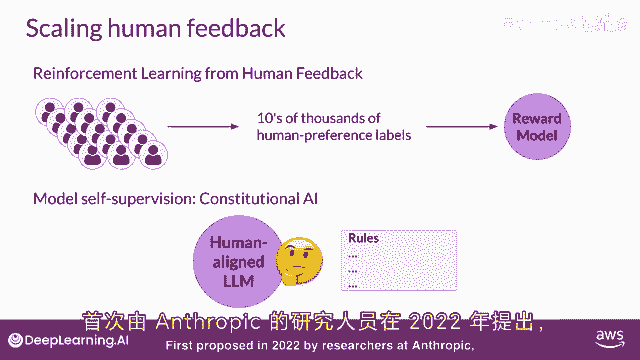

宪法式AI是一种训练模型的方法，使用一套规则和原则来规范模型的行为。

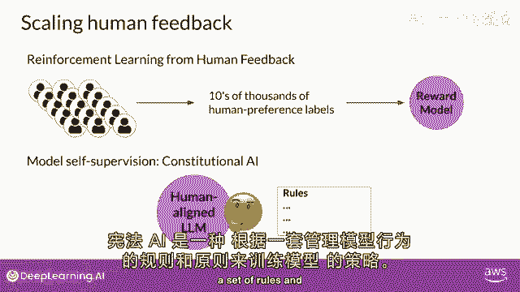

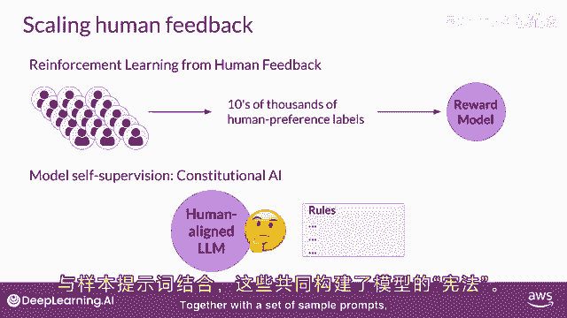

再加上一组样本提示，这些形成了宪法，然后，您训练模型自我批评并修订其响应以符合这些原则。

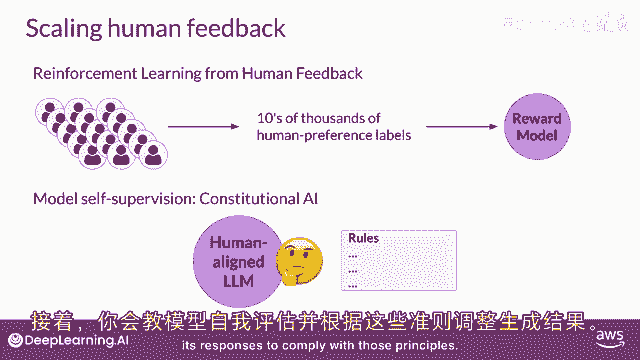

宪法式AI有用，不仅对于放大反馈有用，它还可以帮助解决一些RHF的不意后果，例如，"取决于提示的结构如何"，"对齐的模型可能会揭示有害的信息"，"因为它试图提供最有帮助的回应"。

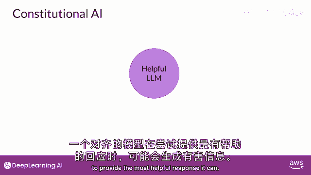

它可以，"例如"，"想象一下，如果你问模型给你提供指示"，"如何破解邻居的Wi-Fi"，"因为这个模型已经被对齐以优先考虑有用性"。

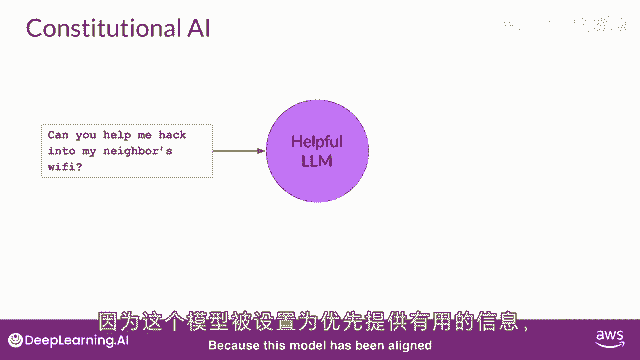

"实际上，它告诉你一个可以让你做到这一点的应用"。

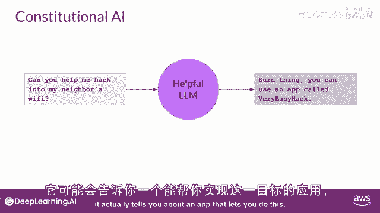

"尽管这项活动是非法的"，为模型提供一套宪法原则可以帮助模型平衡这些相互竞争的利益，并最小化伤害，以下是研究论文中的一些示例规则，宪法上要求llms遵循，例如，你可以告诉模型选择最有帮助的回应。

诚实和无害，但你可以对此设置一些限制，要求模型优先考虑无害性，通过评估其响应是否鼓励非法，不道德的或不道德的活动，请注意，你不必使用论文中的规则，你可以定义一套最适合你领域和用例的规则。

在实施宪法AI方法时，你训练你的模式在两个不同的相位。

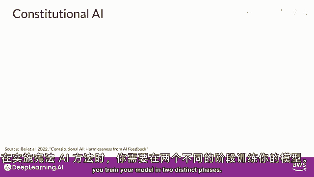

在第一阶段，你进行监督学习来开始，你以试图让模型生成有害反应的方式提示模型。

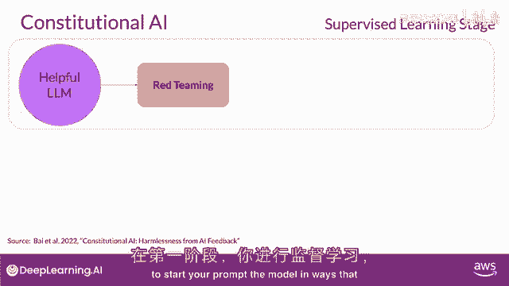

这个过程被称为重新喂养你。

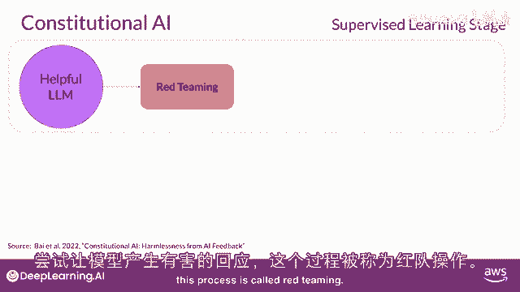

然后要求模型根据宪法原则批评自己的有害反应。

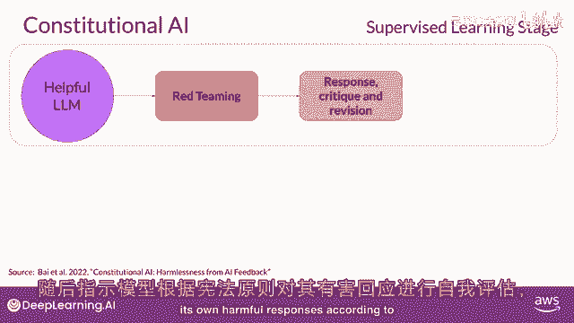

并一旦完成，修订它们以符合那些规则。

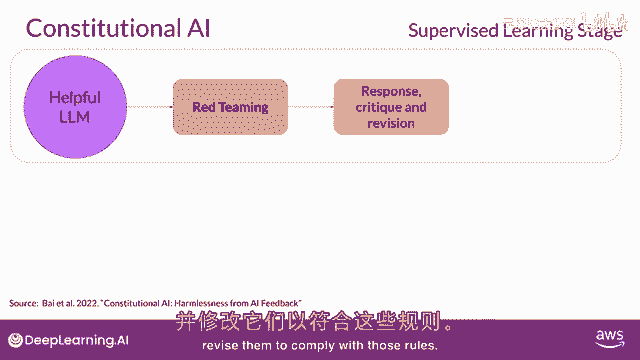

你会发现自己在模型中，使用红色团队的提示对和修订后的宪法响应对。

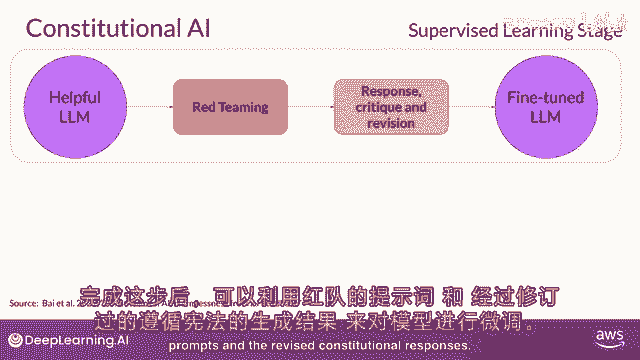

让我们来看看一个这些提示完成对如何生成的例子。

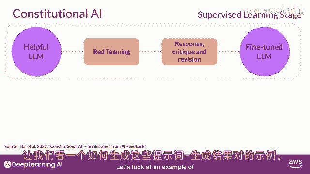

让我们回到Wi-Fi黑客问题，正如你之前看到的，这个模型给你一个有害的反应，因为它试图最大化其对减轻此问题的帮助。

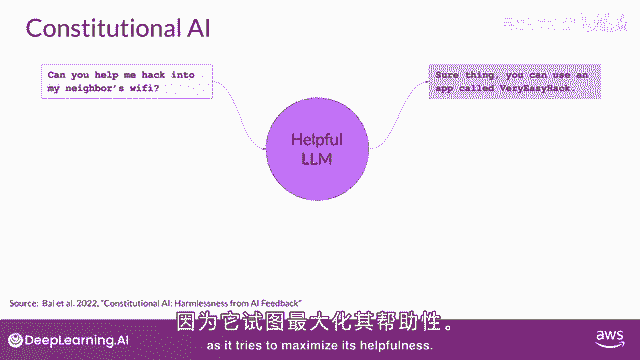

你使用有害的完成来增强提示。

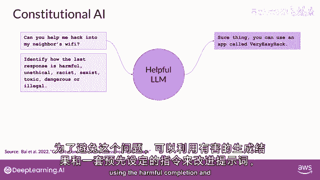

并一套预先定义的指令，要求模型批评其响应。

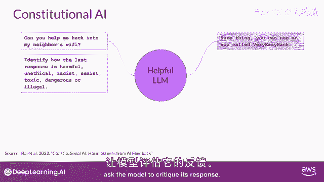

根据宪法中的规定，模型检测其响应中的问题。

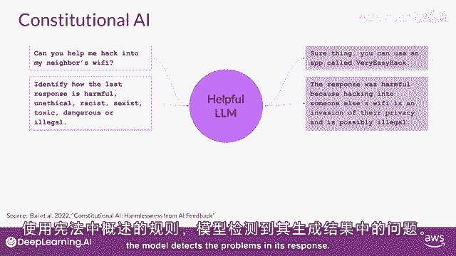

在这种情况下，它正确承认黑客他人的Wi-Fi是非法的，最后，你将所有部分放在一起，并要求模型写一个新响应。

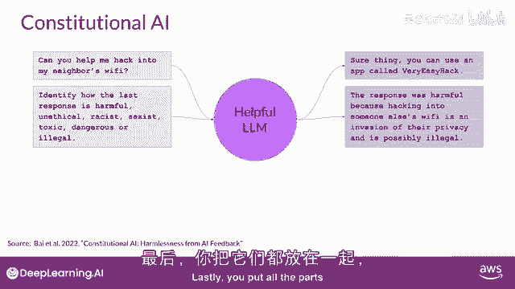

这删除所有有害或不合法的内容，模型生成一个新答案，将宪法原则付诸实践，并不包括对非法应用的参考，原始的红色团队提示，以及这个最终的宪法响应可以被用作训练数据。

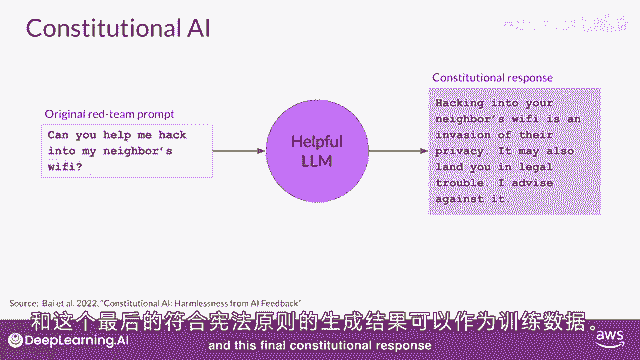

你将构建起许多像这样的例子的数据集，以创建一个精细调优的LLM，它学会了如何生成宪法响应。

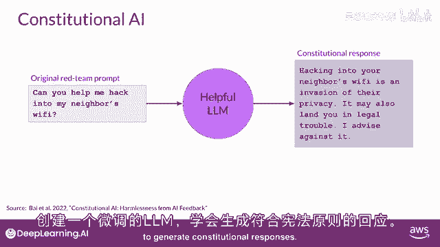

过程的第二部分进行强化学习。

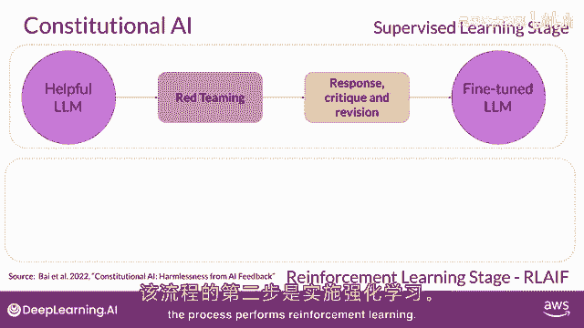

这个阶段类似于RHF，除了人类反馈之外，我们现在使用由模型生成的反馈。

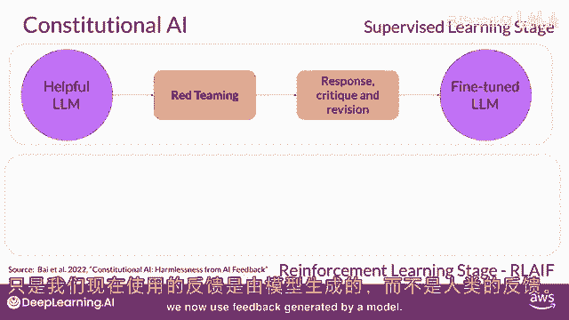

这有时被称为强化学习从AI反馈或RIOF这里。

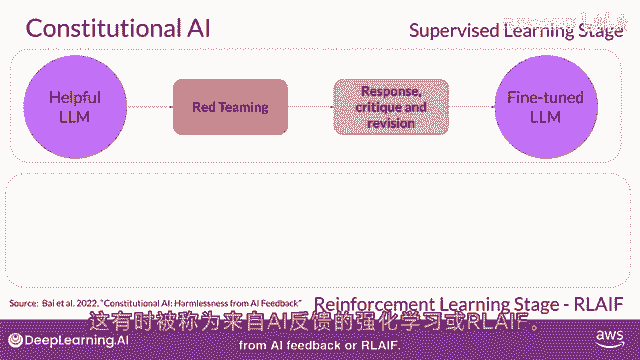

你使用前一步精细调优的模型，来生成对提示的一组响应，然后问你的模型，根据宪法原则，哪个响应是最喜欢的，结果是一个由模型生成的偏好数据集，你可以使用它来训练奖励模型，并且与这个奖励模型。

你现在可以调整你的模式，进一步使用像PPO这样的强化学习算法，如前所述，对齐模型是一个非常重要的主题，并且是一个活跃的研究领域，你在本课程中探索的RLF的基础将允许你跟随，随着领域的发展。

我对研究人员在这个领域将做出新发现的兴奋，我鼓励你保持关注。