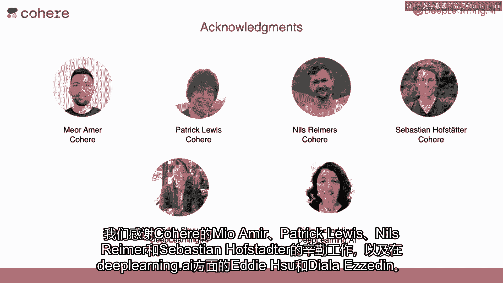

# (超爽中英!) 2024公认最全的【吴恩达大模型LLM】系列教程！附代码_LangChain_微调ChatGPT提示词_RAG模型应用_agent_生成式AI - P92：《大型语言模型与语义搜索》- 1.Intro.zh - 吴恩达大模型 - BV1gLeueWE5N

欢迎来到短期课程，本课程与Cohere合作，内置了语义搜索的大型语言模型，你将学习如何将大型语言模型或LMS集成到信息搜索中，在你的应用程序中，例如，假设你运行一个包含许多文章的网站，为了论证。

想象一下维基百科，或者一个包含许多电子商务产品的网站，甚至在LMS出现之前，关键词搜索是很常见的，"以便人们可能搜索你的网站"，"但是，有了LMS，你现在可以做很多事情"，首先，"你可以让用户提出问题。

你的系统然后搜索你的网站或数据库来解答"，"其次，电影也在展示检索结果"，更接近于用户询问的含义或语义，"我想介绍这门课程的教师们"，杰伊·阿拉米尔和路易斯·塞尔拉诺。

"杰伊和路易斯都是经验丰富的机器学习工程师"，以及教育者，我一直钦佩他，Jay创作的一些高度引用的插图，用于解释变压器网络，他还在合著一本关于大规模语言模型的实践书。

Louis是《摇篮机器学习》一书的作者，他还与深度学习一起教学，《AI数学》用于机器学习和连贯性，Jay和Lewis，与Neil Amir一起，他们正在开发一个名为LMU的网站。

他们已经有很多经验教开发者如何使用LMS，因此，当他们同意使用LMS教授语义搜索时，我欣喜若狂，谢谢安德鲁，这真是一份无与伦比的荣誉，能与你一起教这门课程，我感到荣幸，八年前。

是你的机器学习课程让我接触到机器学习，正如你所说，你的学习继续激励我分享我所学到的，路易斯和我在科赫工作，所以我们能在这个行业中指导他人，关于如何使用和部署大型语言模型以满足各种应用场景。

我们很高兴能承担这门课程，以提供开发人员所需的工具，他们需要构建，坚固的，由LLM驱动的应用程序，我们很高兴分享我们从领域经验中学到的东西，谢谢，杰伊和路易斯，很高兴有你与我们在一起。

这门课程首先包括以下主题，它教你如何使用基本关键词搜索，这也是被称为词性搜索的，它为许多搜索系统提供了动力，甚至在大型语言模型出现之前，它包括找到与查询匹配单词数量最多的文档。

然后您将学习如何使用一种称为排名的方法来增强这种关键词搜索，正如名称所暗示的，然后按查询的相关性对响应进行排名，接下来，您将学习一种更先进的搜索方法，这种方法极大地提高了关键词搜索的结果。

因为它试图使用文本的实际意义或实际语义意义来执行搜索，以这种方式进行搜索，这种方法被称为密集检索，这使用了自然语言处理中一种非常强大的工具，称为嵌入，这是一种将向量数与每个文本片段相关联的方法。

语义搜索包括找到与查询最接近的文档，在嵌入空间中，类似于其他模型，搜索算法需要得到适当的评估，您还将学习如何有效地进行此操作，最后，由于lms可以用于生成答案，您还将学习如何将搜索结果插入到llm中。

并使它基于它们生成答案，使用嵌入的密集检索，极大地提高了lm的问答能力，因为它首先搜索并检索相关的文档，并从这些检索的信息中创建答案，许多人都对这门课程做出了贡献，我们感谢miamir，Patrick。

Lewis noreimer和sebastian hofstadter从coir的辛勤工作，以及在深度学习ai方面，Eddie shu和dialla作为院长。

在第一课中，您将看到在大型语言模型出现之前搜索是如何进行的，我们将向您展示如何使用llms来改进搜索，包括工具如嵌入和重新排名为什么听起来很棒，并且。

