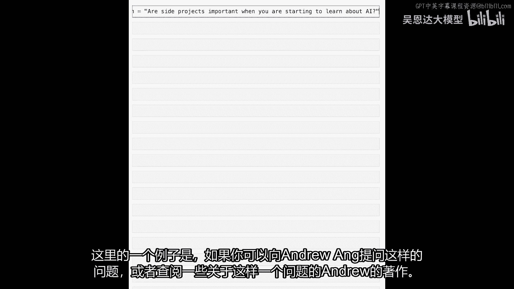
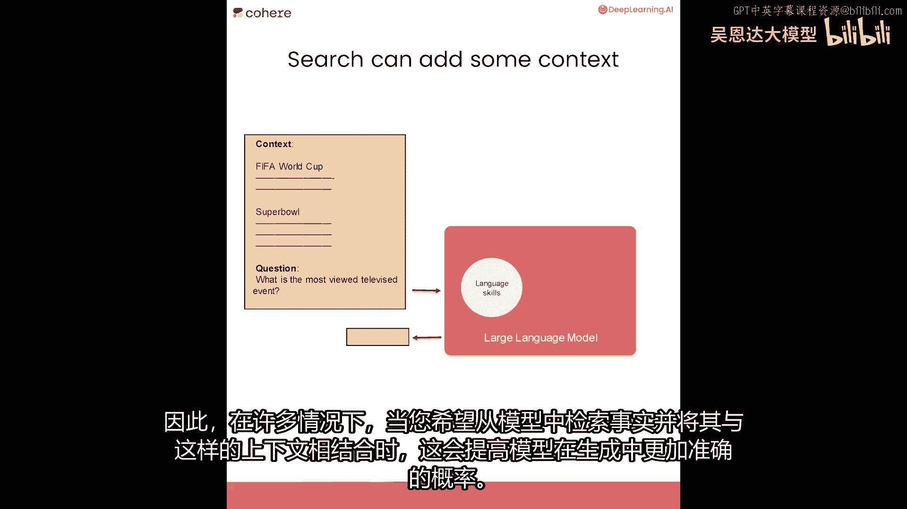
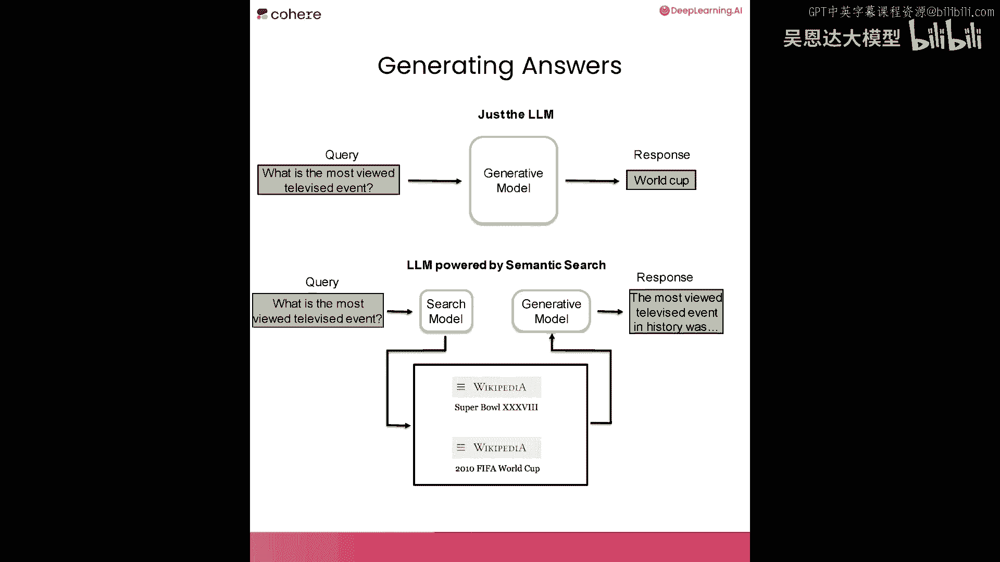
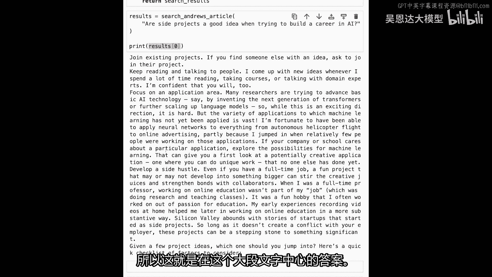
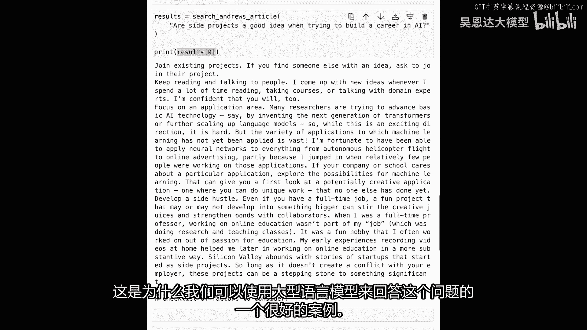
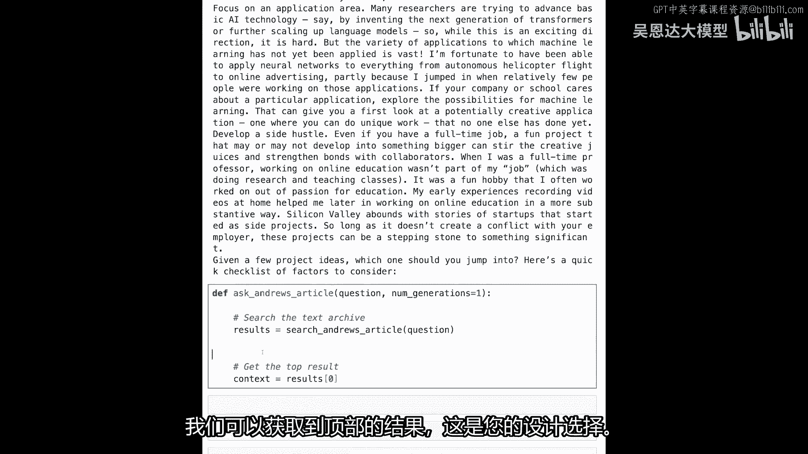
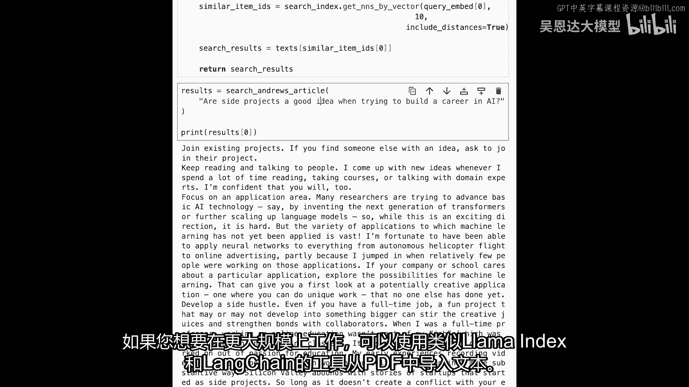
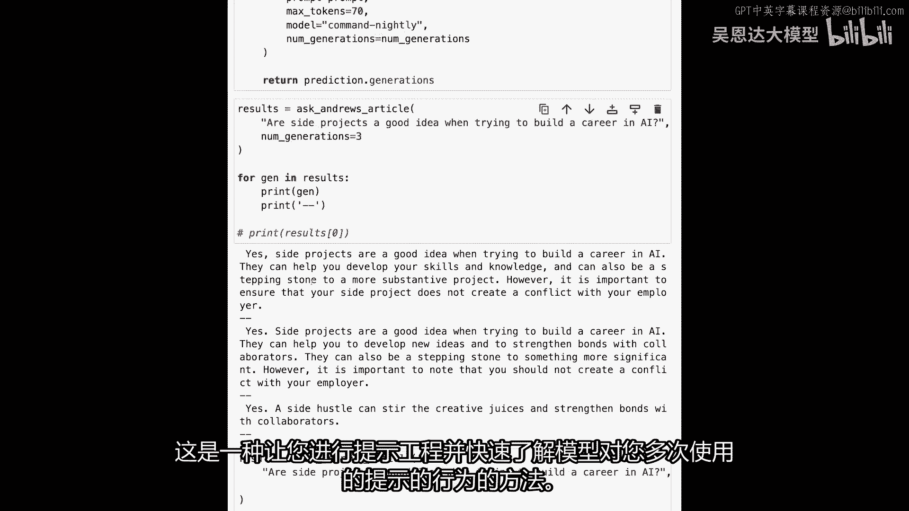

# (超爽中英!) 2024公认最全的【吴恩达大模型LLM】系列教程！附代码_LangChain_微调ChatGPT提示词_RAG模型应用_agent_生成式AI - P97：6.L5-generating answer.zh - 吴恩达大模型 - BV1gLeueWE5N

本课内容，将生成步骤加入搜索管道的末尾。

这样可得到答案而非搜索结果。

例如，这是一种构建用户可与文档或书籍聊天的应用的好方法，如本课所示，一篇文章，大型语言模型擅长许多事情，然而，需要它们提供帮助的用例，举个例，假设你有一个问题，当你开始学习AI时，边项目重要吗？

你可以问大型语言模型，它们中的一些可能会给出有趣的答案，但真正有趣的是，如果你问专家或专家的写作，例如，你可以问安德鲁·恩格或顾问。

安德鲁关于这个问题的写作，像这样，幸运的是，我们可以访问安德鲁的一些写作，所以你可以深入学习，AI有一个名为《批量》的新闻通讯，你可以找到名为《如何在AI中建立职业生涯》的一系列文章，它包含多篇文章。

我们将使用本课程所学来搜索，然后使用生成性大型语言模型从这篇文章中生成答案，让我们可视化并确切描述我们的意思。

你可以问大型语言模型一个问题，它们能回答许多问题，但有时我们想让他们从特定文档或档案中回答，这就是你可以在生成步骤之前添加搜索组件以改进这些生成的原因，当你依赖大型语言模型的直接答案时。

你依赖于它存储在内部的世界信息，但你可以提供上下文，使用先前的搜索步骤，例如，当你在提示中提供上下文以改善案例的生成时，当你希望将模型锚定到特定领域、文章或文档时，或我们的文本档案，这也提高了事实生成。

因此，在许多情况下，当你想从模型中检索事实时，并使用上下文增强它，像这样，这提高了模型生成事实性的概率。

这两个步骤的区别在于，不是仅仅向生成模型提问，并查看它打印出的结果，我们可以首先将问题呈现给搜索系统，就像我们在本课程早期构建的那样，然后检索其中的一些结果，将它们与问题一起放在提示中提供给生成模型。

除此之外，然后得到基于上下文的响应，我们将在下一个代码示例中查看如何做到这一点，所以这是我们的问题。

让我们为这个用例构建文本档案。

我们只需打开这些文章并复制文本，我们可以复制并粘贴到该变量中，我们可以称之为text，只需将它们全部放入其中，我们可以复制三个，所以这是第二篇文章，这里有一个包含三篇文章文本的变量，你可以做更多。

并且它是，我认为可能在七或八部分，但我们可以用三个例子来做，你以前见过的熟悉代码，运行这里设置环境，还有一些熟悉的代码，因此我们可以导入cohere，因为接下来我们将嵌入此文本，将首先将其拆分为块。

然后嵌入它，然后构建我们的语义搜索索引，所以这是我们拆分的部分，让我们看看text现在看起来像什么，让我们看看前三个示例，所以这是前三个块，人工智能的快速崛起导致人工智能职位的快速崛起。

职业成长的三个初步步骤，所以这是三个段落，安德烈文章中的三个段落，我们可以继续设置cohersdk并嵌入文本，所以我们现在正在将其发送到嵌入并获取嵌入，让我们构建我们的文本档案，我们进行一些导入。

我们以前都见过所有这些，这是annoy，这是向量搜索库，Numpy pandas将不使用正则表达式，但处理文本时总是最好备有它们，所以相同的代码也在这里运行，这是，我们只是将其转换为numpy数组。

所以这是我们得到的向量，所以这是嵌入，我们创建一个新的索引，一个向量索引，我们将向量插入其中，然后构建并保存到文件中，我们有向量搜索，现在定义函数，命名为搜索，安德鲁的文章，给它查询。

在此数据集上运行搜索，为此，步骤与过去相同，嵌入查询，对档案进行向量搜索，比较查询与，文本中每段落的嵌入，然后返回结果，现在可问搜索系统问题，类似这样的副业，在构建AI职业时是好主意。

我想知道安德鲁会怎么说，这里返回第一个结果，这是长段落，与问题最接近，如果你看这里，发展副业，即使你有全职工作，有趣的项目可能变大，激发创造力，这是大文本中答案。

这是为什么，可用大型语言模型回答。

给它这个，提取相关信息，接下来做，不是搜索，我们要定义新函数，问安德鲁的文章，并给它问题，生成次数，这里有几件事，在做事前，我们会搜索，获取相关上下文，嗯，从文章中获取最佳结果，这是设计选择。

你想在提示中注入1个结果还是2或3个，我们使用1个，因为这是最简单的，提示可以像这样，来自安德鲁·王关于如何构建AI职业文章的摘录，这是提示工程技巧，提供越多上下文给模型，它越能更好地完成任务。

在此注入接收到的上下文，这是文章中的段落，然后提出问题，给出指令或命令给模型说，从提供的文本中提取答案，如果不在那里，告诉我们不可用，然后我们说需要发送给模型的预测，现在我们有提示，我们说co。

generate_prompt等于，提示最大标记，假设七十，其中一些倾向于较长模型，我们想使用称为command nightly的模型，这是Cohere上更新最快的生成模型。

所以如果你使用command nightly，你使用的是平台上可用的最新模型，这往往是比较实验性的模型，但它们是最新的，通常也是最好的，嗯，我们可以在这里停止，我们还没有使用它们生成。

但我们可以稍后使用，然后我们会返回预测生成，这就是我们的代码现在，确切这个问题，让我们在这里提出，而不是这是一个搜索练习，我们希望这是一个对话练习，由搜索提供信息，并向语言模型提出，嗯，如果我们执行它。

我们得到这个答案，是的，副项目是个好主意，当试图在AI领域建立职业时，它们可以帮助你发展技能和知识，也可以是一个很好的方式与其他人士建立联系，但你应该小心不要与雇主产生冲突，并且你应该确保你没有评估。

然后我们在这里用完了标记，所以我们可以在这里增加标记数，如果你想得到更长的答案，所以这是一个如何工作的快速演示，你可以试试，问它几个问题，其中一些可能需要一点提示工程，但这是一个这些应用的总体概述。

有很多人正在用这些东西做有趣的事情，例如，向Lex Friedman播客提问，这确实实现了这个流程，因此，对整个播客的转录进行语义搜索，有人也对Andrew Huberman的播客做了同样的事情。

你看到的是，um，YouTube的转录，书籍的视频，这是人们使用大型语言模型构建的常见事物，它通常由这个驱动，两步搜索后生成，可加入重排以改进搜索组件，请暂停尝试，运行代码至此，更改问题。

或获取感兴趣的数据集，不必总是复制代码，仅快速示例，使用llama index和lang chain从pdf导入文本，若要工业规模工作。

记住num generations参数，开发时的小技巧，测试模型行为时，每次调用API多次，可传递给代码生成的参数，num_generations=num_generations，提问时。

num_generations=3，无需打印，嗯，要打印多个，嗯，这里发生的是，这个问题将给语言模型，语言模型将被要求同时给出三个不同的生成，不只是一个，所以它像批处理一样运行它们。

然后我们可以说对于jin结果，打印gen十代，基本上打印，这仅为我们查看，调试模型行为时，希望快速看到，好的，模型回答问题或响应提示，嗯，多次，嗯，正确与否，无需继续逐一运行，可看3至5次。

我认为你能通过这，这是模型的一代，这是一个生成，它们都是对同一提示的响应，这是你进行提示工程的一种方式，并获得模型对提示行为的句子响应。

