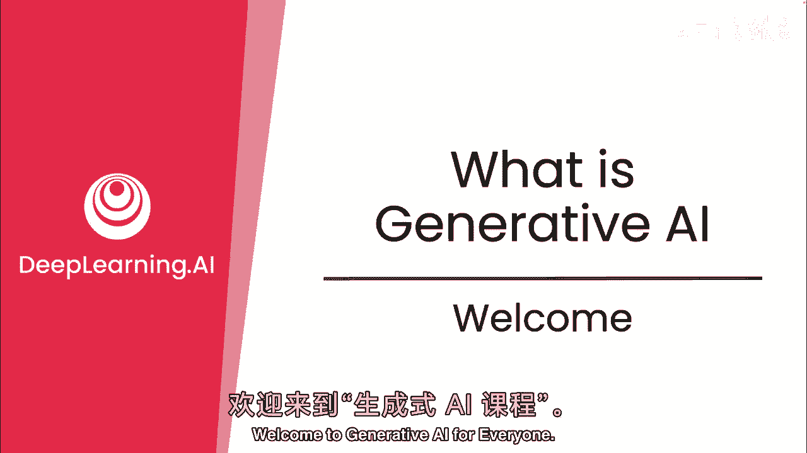
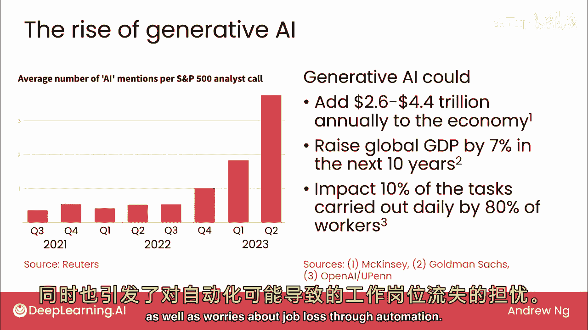
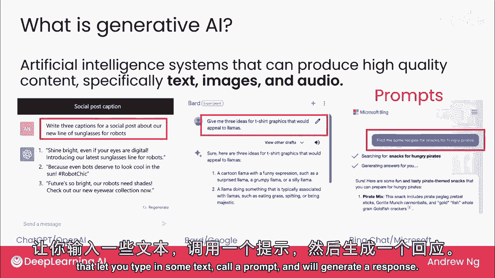
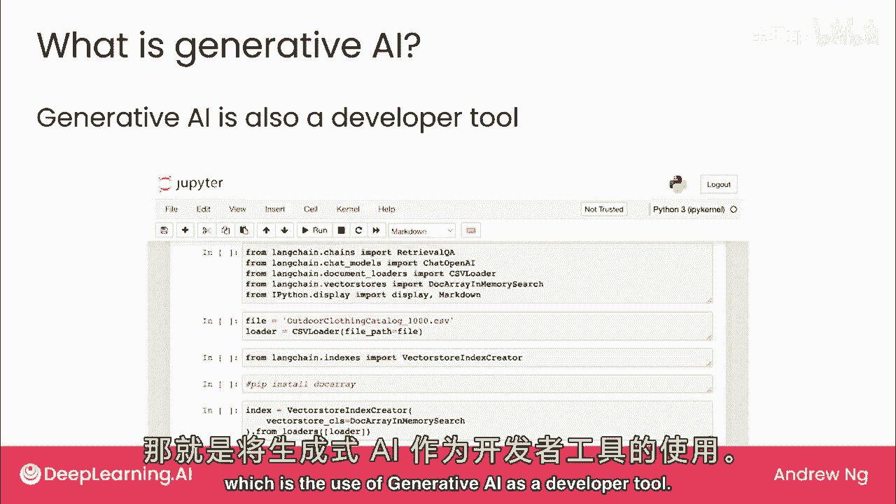
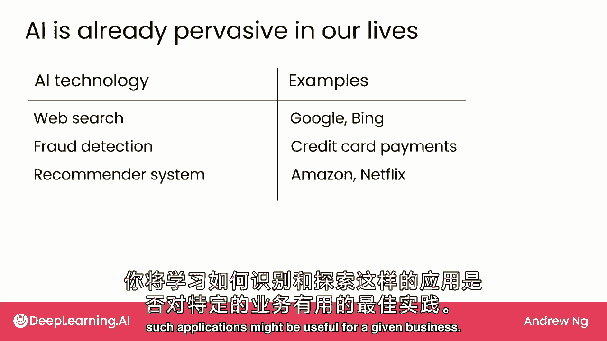
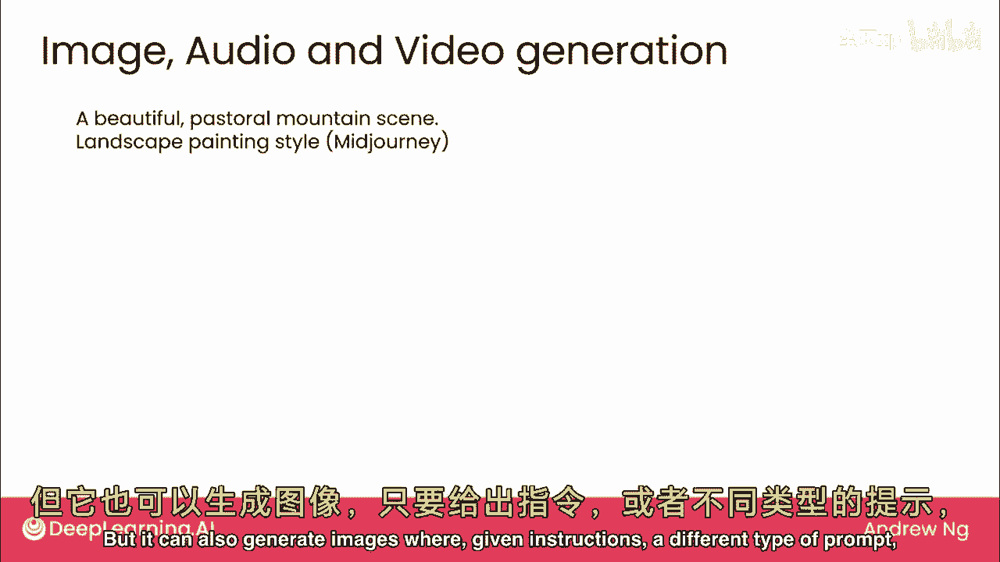
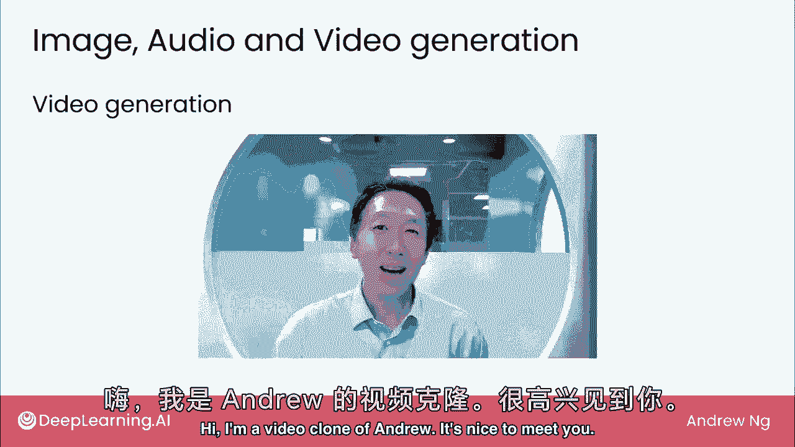
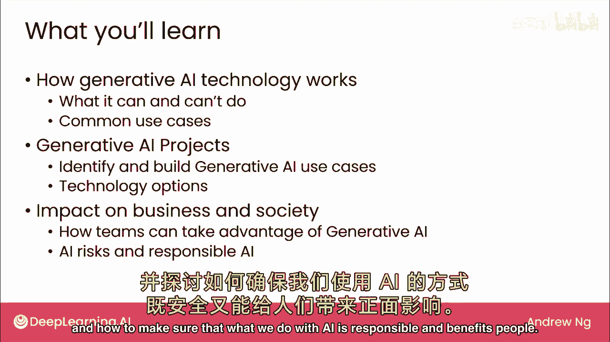

# (超爽中英!) 2024吴恩达0基础【面向所有人的生成式AI】教程！附课件代码 DeepLearning.AI - P1：生成式 AI 入门教程 1 - 什么是生成式 AI - 了解其定义、应用与影响 - 吴恩达大模型 - BV19S421R7VR

欢迎来到生成式AI，自Chad发布以来，Gbt AI，特别是生成式AI，吸引了很多人注意，公司和政府，这是一种非常颠覆性的技术，已经在改变，人们学习和工作的方式，许多开发人员认为。

生成式AI将使许多人受益，并提高生产力，同时对全球经济增长做出重大贡献，但也会有负面影响，所以可能是工作老板或更糟，有些人担心在这门课程中你将了解生成式AI是什么，它能做什么和不能做什么。

以及如何在自己的工作或业务中使用它，因为AI的种类很新，所以仍然有很多错误信息，因此，在这门课程中，我希望传达一个准确的非技术理解，它到底是什么，并与您合作，思考如何最好地利用这项技术。

这门课程不假设任何技术或AI背景，旨在对商业中的任何人都有用，科学、工程，人文、艺术或其他领域，因此，让我们深入探讨AI的性别，2022年，OpenAI发布了ChatGPT，这种势头持续不减，据估计。

每年可增加2。6至4。4万亿美元的经济，高盛估计，未来十年可提高全球GDP 7%，OpenAI的一项研究，和联合国，估计每天执行的工作或任务中，有10%可能受到影响，美国超过80%的工人。

同一项研究还估计，有20%的工人，哪些工作受生成AI影响超50%，此类研究带来巨大生产力提升希望，也担忧自动化导致失业。

什么是生成AI，指AI或人工智能系统，能产生高质量内容，特别是文本、图像和音频，最知名的生成AI或Gen AI系统是Open AI ChatGPT，可遵循指令执行任务，如为社交媒体帖子写3个标题。

关于我们为机器人设计的太阳镜，并生成各种创意输出，许多用户熟悉生成此类文本的网站或直接面向消费者的应用程序，其他示例包括谷歌提供的bard，以及微软提供的bing聊天，但现在有许多公司提供用户界面。

让您输入一些文本，称为提示，我们生成响应。

除了这些消费应用，生成式AI还有另一应用，我认为这可能长期影响更大，AI性别作为开发工具的使用。

AI已融入我们的生活，我们许多人每天使用它数十次甚至更多，而不会想到它，每次你在谷歌或必应上进行网络搜索，那是AI，每次你使用信用卡，可能有一个AI检查，是否真的是你使用信用卡。

或每次你访问亚马逊或Netflix等网站，并推荐产品或电影给你，那是AI，但许多AI系统一直复杂且昂贵，AI性别使许多AI应用更容易构建，这意味着AI产品供应的数量和种类正在蓬勃发展，因为与之前相比。

构建某些AI应用的成本正在降低，因此在这门课程中，我们将多次触及的主题之一将是，AI性别如何使您的业务更便宜地，构建非常有价值的AI应用，并学习识别和探索是否可能。

对于给定的业务有用，我将AI性别描述为生成文本、图像和音频，在这三种类型的内容中，迄今为止最大的影响是文本生成，但它可以根据指令生成图像，不同类型的提示。

它可以生成漂亮的图像，如这个，甚至逼真的图像，像这样的生成AI也可以生成音频，例如，这是我声音的克隆，嗨，我是一个AI生成的安德鲁声音克隆，安德鲁从未说过这些话，不是吗？

你还可以将音频与图像甚至视频生成结合起来，创建一个像我这样的视频克隆，嗨。

我是安德鲁的视频克隆，很高兴见到你，所以生成AI有很多东西在进行中，这是一个令人兴奋和颠覆性的技术，我相信您将在工作中发现它有用，在这门课程中，在第一周，我们将深入了解生成AI技术的工作原理。

特别是它能做什么和不能做什么，您还将看到各种常见用例，我希望这将激发您的创造力，关于您可能如何使用它来创造您的生活或工作中的价值，在第二周，我们将讨论生成AI项目，特别是，如何识别有用的生成AI应用。

以及构建良好的最佳实践，深入探讨技术选项范围，构建多种宝贵项目，最后一周，我们将超越单个项目，看生成式AI如何影响企业，以及整个社会，我们将探讨最佳实践，团队或公司如何利用AI的瑰宝。

