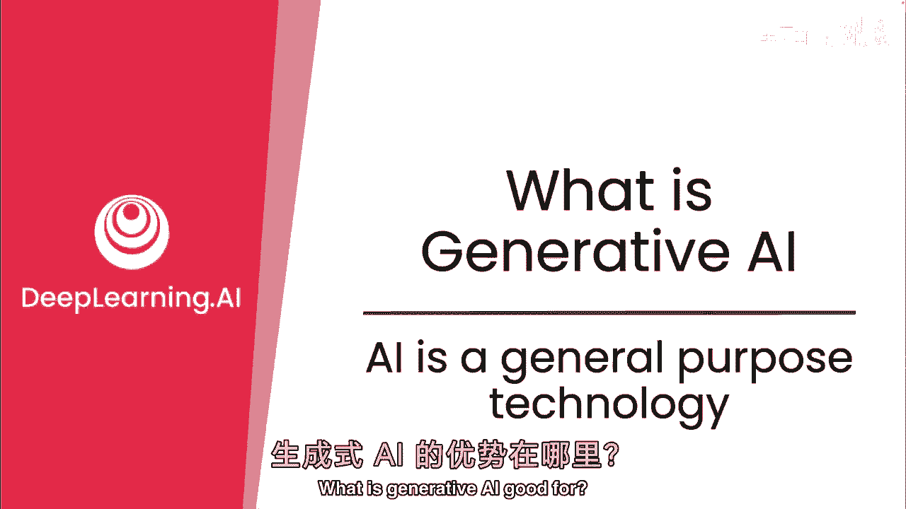
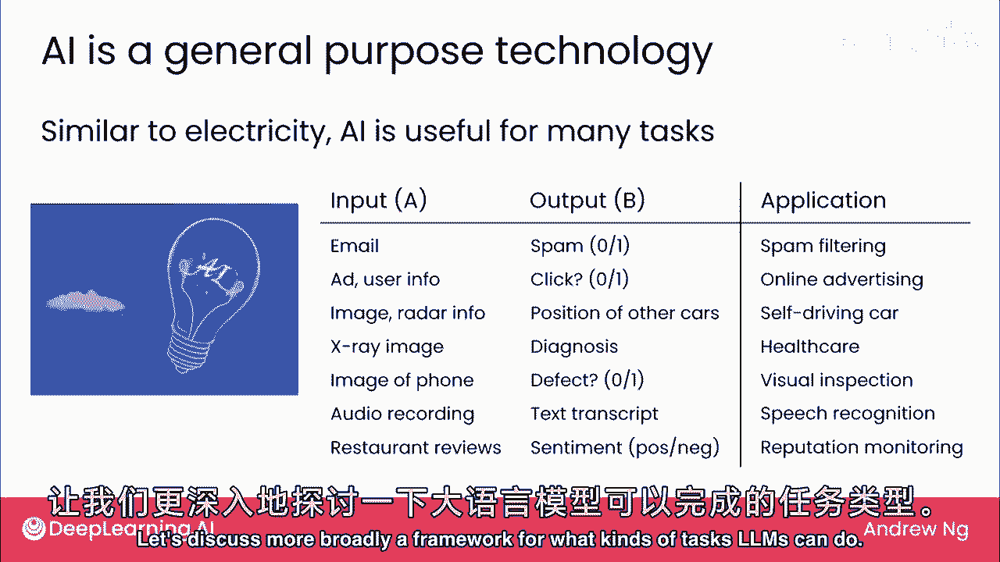
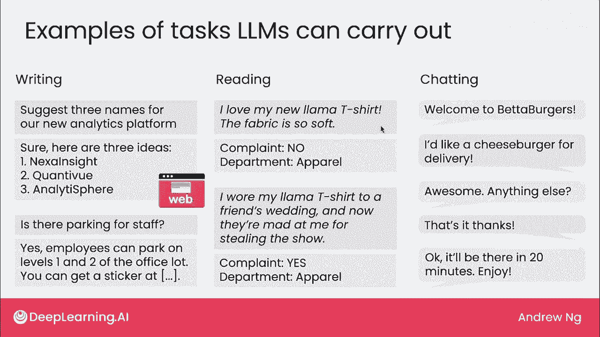

# (超爽中英!) 2024吴恩达0基础【面向所有人的生成式AI】教程！附课件代码 DeepLearning.AI - P4：4 - 什么是生成式 AI - AI 是一种通用技术 - 吴恩达大模型 - BV19S421R7VR

生成AI有何用途，问题难答的原因之一是AI是通用技术，不像许多技术，如汽车，用于交通或微波炉，用于加热食物，AI并非仅用于，一件事，它用于许多事，这几乎更难讨论，但让我们看看通用技术真正意味着什么。

类似于电，AI用于许多任务，若问电有何用途，或互联网有何用途，这些都是通用技术，几乎难以想出电有何用途，因为它如此普及，用于我们周围如此多不同的事，实际上，如你之前所见，监督学习用于许多任务。

如垃圾邮件过滤，广告，语音识别，等许多其他，生成AI也是如此，在上一视频中，你看到了一些LM能执行的任务，回答特定问题，帮助写作，例如，让我们更广泛地讨论一下LM能执行的任务框架。

生成AI生成文本，因此可能用于写作，我常使用生成AI工具作为头脑风暴伙伴，若要命名产品，可问它生成一些名字，它会给出一些创意建议，LM也能很好地回答问题，若给予它们有关你公司的特定信息。

它们能帮助团队成员找到所需信息，在这种情况下关于办公室停车可用性，除了写作，生成AI还擅长什么，我将称之为阅读摘要，你将给它一段相对较长的信息，并让它生成简短输出，例如，如果你经营在线购物电子商务公司。

并收到许多不同的客户电子邮件，生成AI可以阅读客户电子邮件，帮助你非常快速地弄清楚，这封电子邮件，是投诉还是不是，投诉，可用于将投诉路由至相关部门，快速处理，因为我喜欢我的新羊驼T恤，面料很柔软。

这不是投诉，但如果有人发邮件，我穿着羊驼T恤参加朋友婚礼，他们生我气抢了风头，嗯，那可能是投诉，但通用AI可帮助将邮件路由至正确部门，我称之为阅读任务，因为正在查看相对较长的文本，这是客户邮件。

然后生成相对较短的输出，只是是或否，这是投诉吗？虽然监督学习也可用于此特定任务，我们稍后将看到，生成AI正在允许这些类型的阅读任务，以及本周晚些时候看到的其他示例，以更快速、更便宜的方式构建，最后。

生成AI也用于许多聊天机器人类型的任务，聊天DPI和酒吧和聊天是通用聊天机器人，生成AI技术，大型语言模型也正在使许多专业用途的聊天机器人得以构建，例如，这是一个聊天机器人可能的样子，用于在线订单。

用户可以说像芝士汉堡送货，聊天机器人确认并为客户下单，在讨论这些任务时，我发现有时区分两种不同类型的贝叶斯应用很有用，一个是这样的头脑风暴，你自然会在Chachi或Bot或聊天中输入这样的提示。

或互联网上的其他免费或付费大型语言模型，并得到结果，因此，我将把这种应用称为，Web界面贝叶斯应用，相比之下，在识别电子邮件是否为客户投诉的例子中，这更符合公司电子邮件路由工作流程，实际上。

没有人会剪切并粘贴客户电子邮件，一次一个地进入Web界面，以获取答案，哪些实际上是投诉电子邮件，因此，这是一个大型语言模型，当它构建到更大的软件自动化中时，在这种情况下帮助公司自动化电子邮件路由。

因此，我将称这种应用为，基于大型语言模型的软件应用，第二个写作示例回答人事问题，这也将使软件应用更合理，因为需要了解公司停车政策，而互联网上的通用大语言模型可能没有，稍后课程将更详细讨论技术构建。

大多数专业聊天机器人也将基于软件，在本课程剩余部分，我将用这两个符号区分网页和软件应用，对许多人来说，从网页案例开始可能更容易，因为可以访问Chagi或Bars等网站，或Bing输入提示并获取结果。

我认为基于Web界面的应用和基于软件的应用程序都重要，对个人和公司都将非常有用。

我发现写作框架，阅读和聊天，作为思考大型语言模型能执行的不同任务的实用方式，在接下来的三个视频中，我们将深入探讨许多不同写作，阅读和聊天任务，我希望你发现其中一些可能对你的工作有用。

