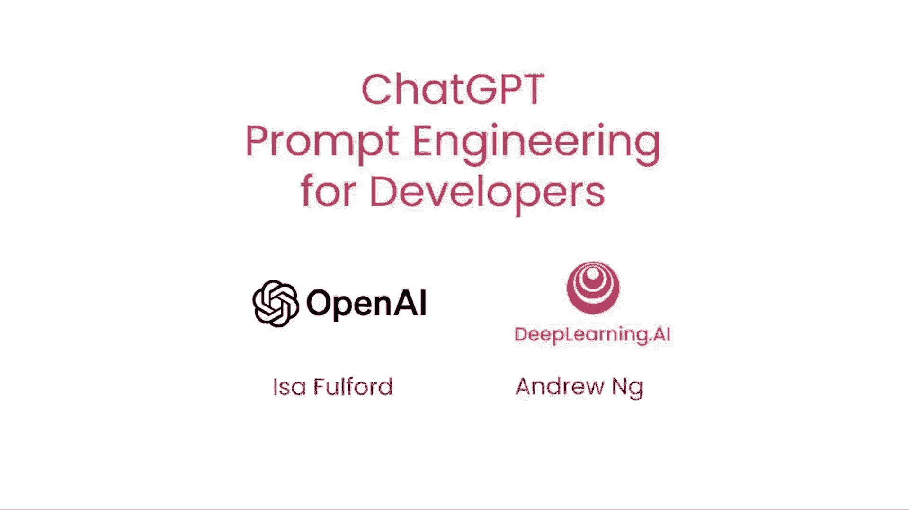
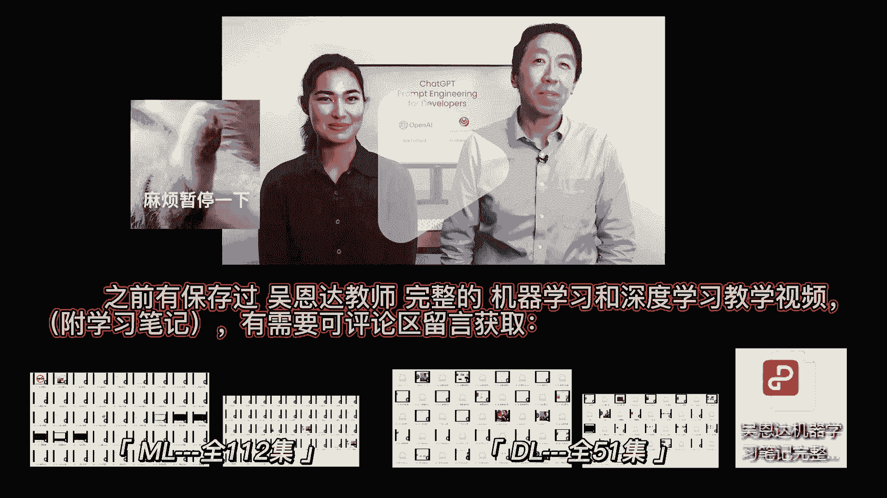
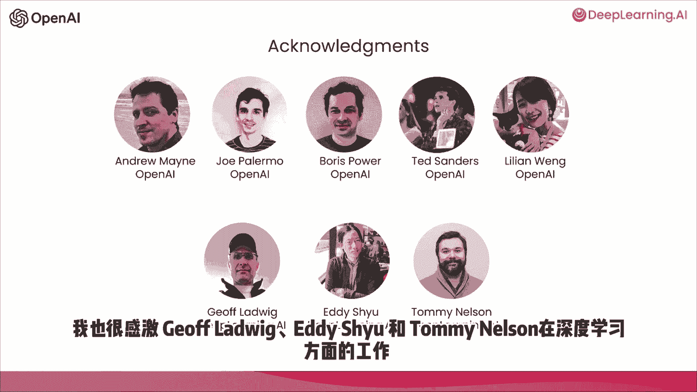

# (超爽中英!) 2024吴恩达最好的【ChatGPT提示词工程师】教程！附课件代码 DeepLearning.AI - P1：第1集 引言 - 吴恩达大模型 - BV1Wf421q7cd

欢迎来到这门关于聊天的课程，面向开发人员的GPT PROM工程，我很高兴能和我一起，教这个是一种惩罚，和我一起，她是Openai的技术人员之一，并建立了流行的乍得GPT检索插件，很大一部分工作是教人们。

如何在产品中使用lm或大型语言模型技术，她也是开放人工智能食谱的撰稿人，该食谱教人们，很高兴有你在身边，我很高兴能在这里与大家分享一些鼓舞人心的最佳实践。

所以网上有很多材料提示，有三十条提示之类的文章，每个人都必须知道很多都集中在聊天GPT Web用户界面上，许多人用它来完成特定的、通常是一次性的任务，但我认为LM的大型语言模型作为开发人员的力量。

那就是使用对lms的api调用来快速构建软件应用程序，我认为这仍然被低估了，事实上，我在AI基金的团队，是深度学习的姐妹公司，AI一直在与许多初创公司合作，将这些技术应用于许多不同的应用，很高兴看到。

lm apis可以使开发人员非常快速地构建，因此，在这门课程中，我们将与你们分享一些你能做什么的可能性，以及如何实现它们的最佳实践，有很多材料要先盖，您将学习一些软件开发的最佳实践。

然后我们将介绍一些常见的用例，总结，推断，转化，扩张，然后你会用LLM构建一个聊天机器人，我们希望这将激发您对新应用程序的想象力，您可以这样构建，在大型语言模型或lms的开发过程中。

大致有两种类型的lms，我将把它称为基本lms和指令调优lms，所以bayes lm已经被训练根据文本训练数据来预测下一个单词，经常在互联网上的大量数据上训练。

和其他来源来找出下一个最有可能出现的词是什么，所以说，例如，如果你提示这个从前有一只独角兽，它可能会完成这个，那就是，它可以预言接下来的几个字是生活在一个神奇的森林里，和所有独角兽朋友。

但如果你用法国的首都，然后根据互联网上可能有的文章，基地lm很有可能用法国最大的城市来完成这项工作，法国的人口是多少？以此类推，因为互联网上的文章很可能是问答问题列表，关于法国，相比之下。

调谐lm的指令，这就是LM研究和实践的大量动力所在，已经训练了一个指令曲调来遵循指令，所以如果你问它，法国的首都是什么，它更有可能产出类似法国首都巴黎的东西，所以指令调谐omms的典型训练方式，就是。

您从一个经过大量文本数据训练的基本lm开始，并进一步训练它为罚款，用作为指令的输入和输出来调整它，并尝试遵循这些指令，然后通常使用一种叫做rlhf增强的技术进一步改进，从人类反馈中学习。

使系统更好地提供帮助并遵循指示，因为对LMS的指导已经被训练得很有帮助，诚实无害，例如，与基本m相比，它们不太可能输出有问题的文本，如有毒输出，许多实际使用场景已经转向lms指令。

您在Internet上找到的一些最佳实践可能更适合于基础LM，但对于当今大多数实际应用来说，我们建议大多数人把注意力集中在指令调优的LMS上，更容易使用，也因为Openai和其他LM公司的工作。

变得更安全、更一致，因此，本课程将侧重于指导调谐名称的最佳实践，在继续之前，我们建议您在大多数应用程序中使用，我只想感谢OpenAI和深度学习AI的团队，这有助于他和我将展示的材料非常感谢安德鲁。

缅因州，乔，Poermo，鲍里斯，权力，TED中心和住在开放人工智能的一个中心，这些中心和我们有很大的关系，集思广益材料，审查材料，为这个短期课程整理课程，我也很感激深度学习方面，为了杰夫的工作。

路德维希，艾迪舒和汤米尼尔森。

所以当你使用调谐lm的指令时，想想给另一个人发号施令，说一个聪明的人，但不知道你任务的细节，所以当LM不起作用时，有时是因为说明不够清楚，例如，如果你要说，请给我写一些关于艾伦·图灵威尔的事，除此之外。

明确你是否希望文本集中在他的科学工作上是有帮助的，或者他的私生活，或者他在历史上的角色，如果你指定了你想要的文本的语气，它是否应该像专业记者写的那样，还是更随意的纸条。

你跑去找一个朋友帮lm生成你想要的东西，当然如果你想象自己问，假设一个应届大学毕业生为你执行这项任务，如果你能指定他们应该提前阅读哪些文本片段，写这篇关于艾伦·图灵的文章。

那就更好地让刚毕业的大学生成功地为你完成这项任务，所以在下一个视频中，你可以看到如何清晰和具体的例子，这是促使LMS的一个重要原则，你还可以从第二个激励原则中学到，这给了LDLM时间来思考。

