# (超爽中英!) 2024吴恩达最好的【LangChain大模型应用开发】教程！附课件代码 DeepLearning.AI - P1：基于LangChain的大语言模型应用开发1——介绍 - 吴恩达大模型 - BV1iZ421M79T

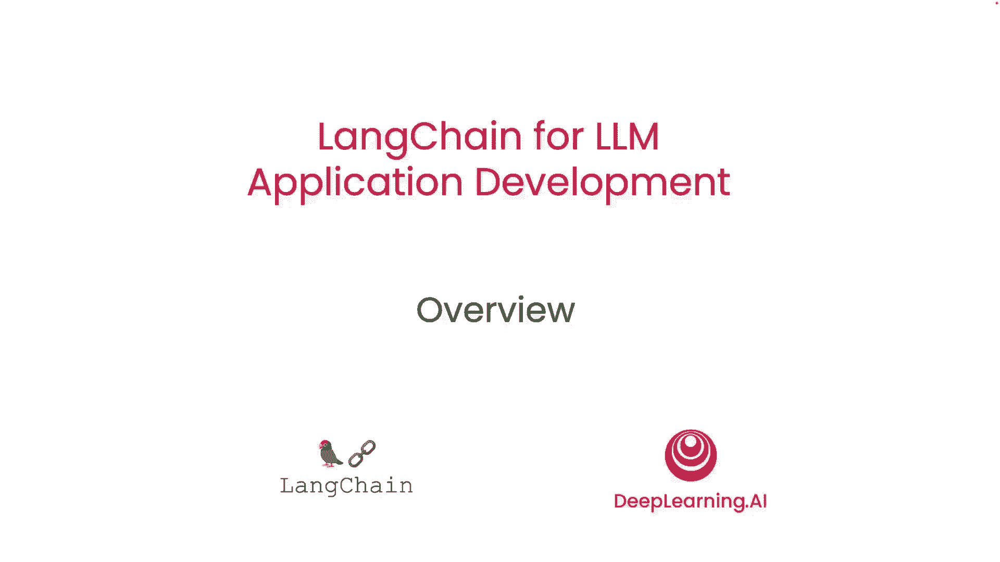

欢迎参加语言链课程。

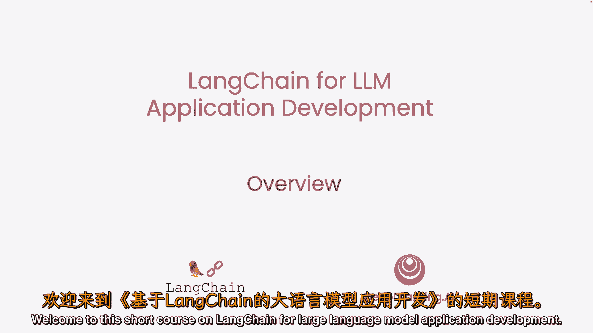

通过提示LLM开发应用，现在开发AI应用更快，应用需多次提示LM并解析输出，因此需编写大量胶水代码，Harrison Chase创建的语言链简化此过程，很高兴Harrison能来。

与深度学习合作开发此课程，AI教授如何使用此工具，感谢邀请，我真的很高兴来到这里，长链最初是一个开源框架，当我与领域内的一群人交谈时，他们正在构建更复杂的应用程序，并看到了开发过程中的一些共同抽象。

我们一直对长链社区的采纳感到兴奋，所以期待与这里的每个人分享，并期待看到人们用它构建什么，实际上，作为长链动力的标志，但也有数百开源贡献者，这对快速开发至关重要，团队以惊人速度发布代码和功能。

所以希望短期课程后，你能快速用Line Chain开发酷应用，也许你甚至决定回馈开源Line Chain，Lang Chain是构建LM应用的开源框架，有两个不同包，一个是Python。

一个是JavaScript，专注于组合和模块化。

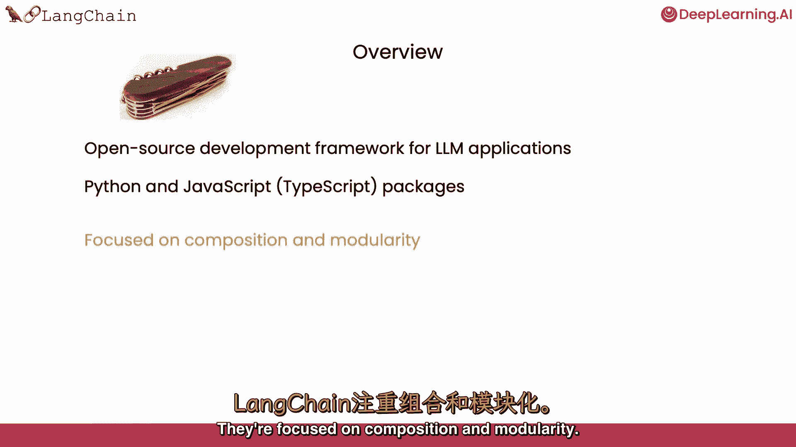

它们有许多可单独使用或相互结合的独立组件，这是关键价值之一。

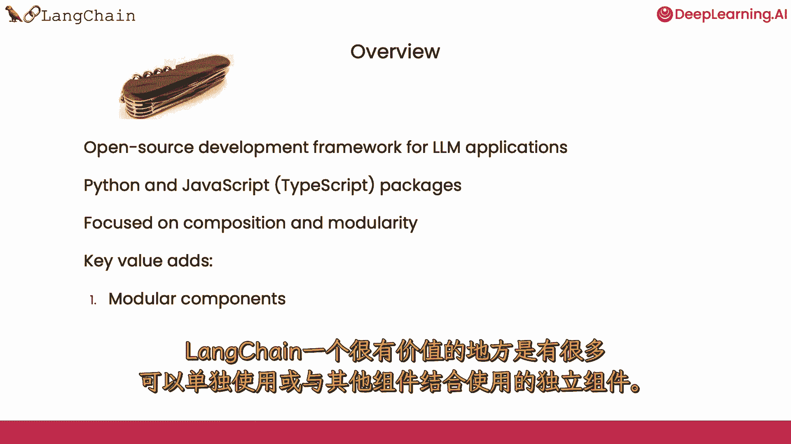

另一个关键价值是一系列不同的用例，因此，这些模块化组件可以组合成更多端到端应用程序，并且使开始使用这些用例变得非常容易。

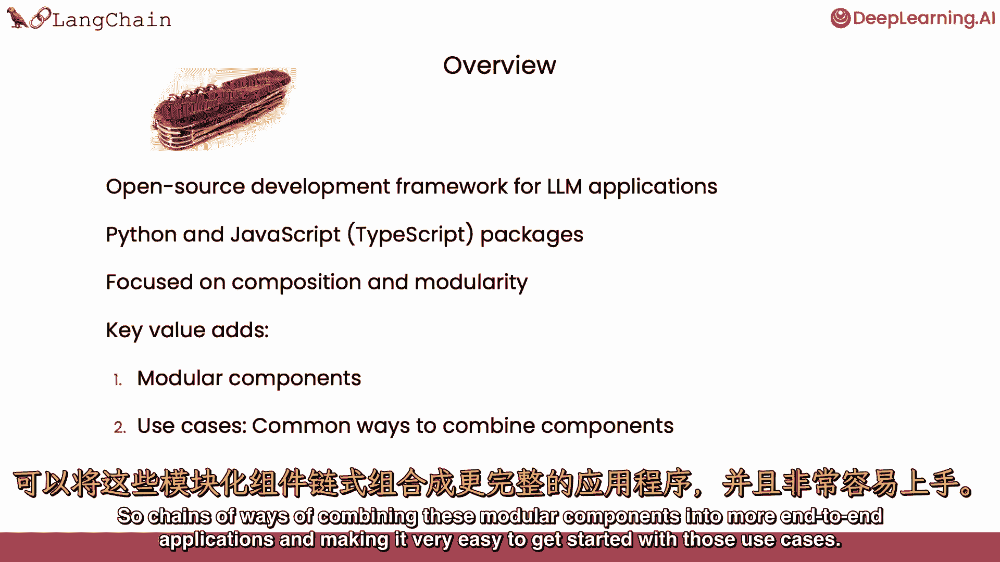

我们将涵盖lang chain的常见组件。

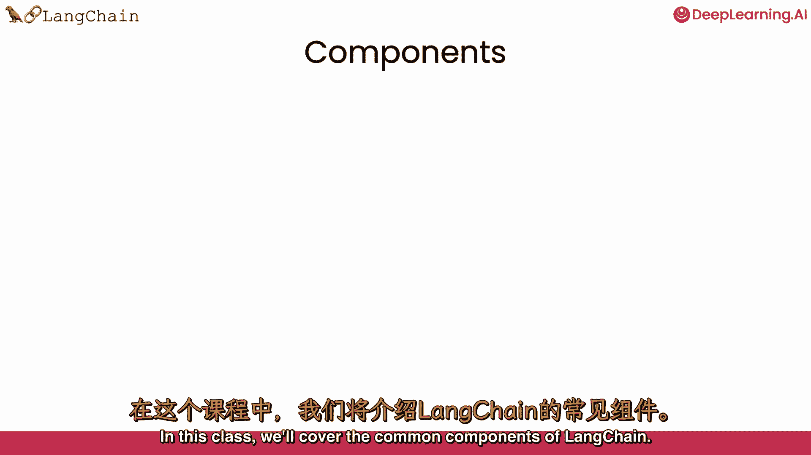

我们将讨论模型，我们将讨论提示，这是如何让模型做有用和有趣的事情。

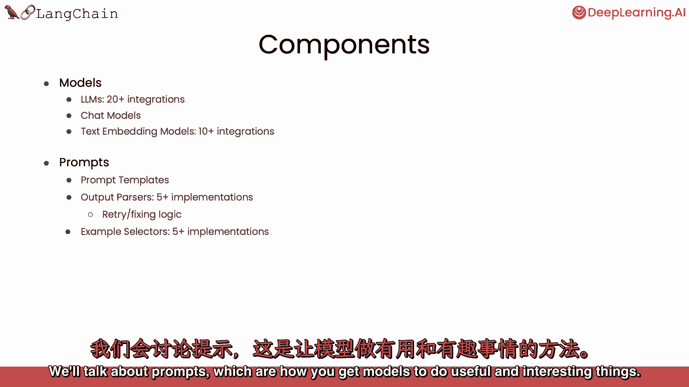

我们将讨论索引，数据摄入方式有哪些。

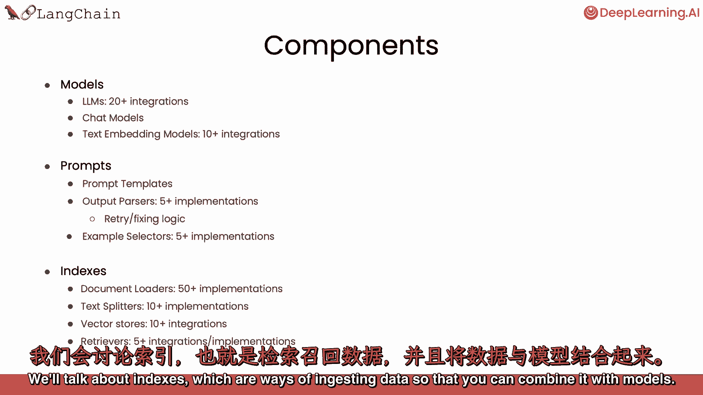

这样您就可以与模型结合，然后讨论端到端用例的链条，连同代理商，这些是令人兴奋的端到端用例类型，将模型用作推理引擎。

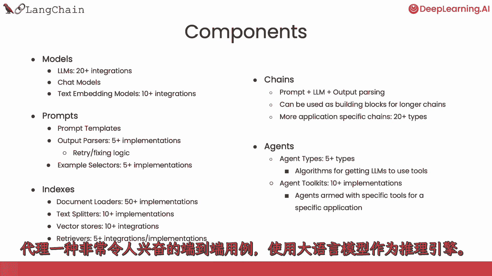

我们也感谢阿尼什·戈拉，与哈里森·蔡斯一起创办的人是谁，深入思考这些材料，并协助制作这门短课。

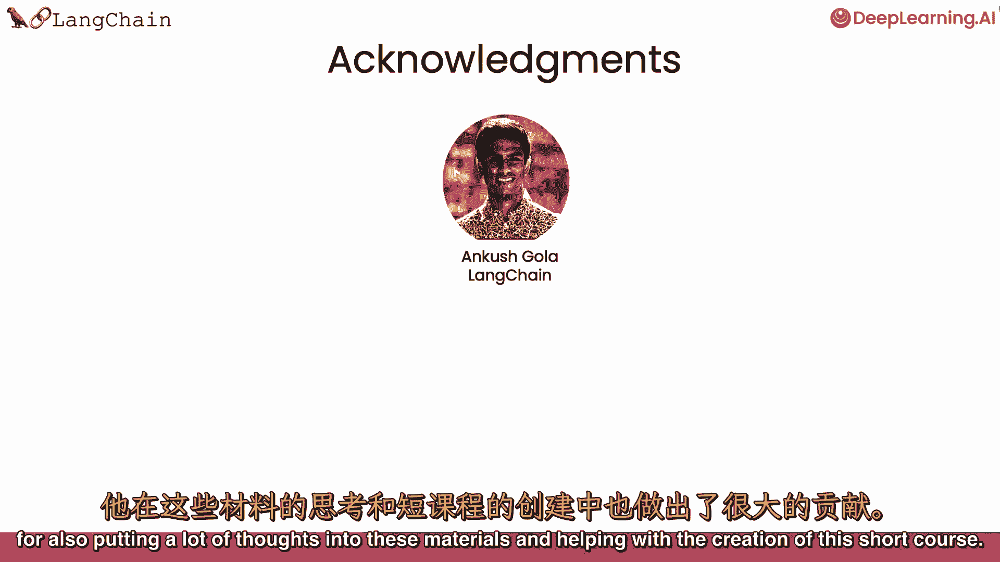

在深度学习AI方面，杰夫，路德维希，埃迪舒和迪亚拉作为院长也贡献了这些材料。

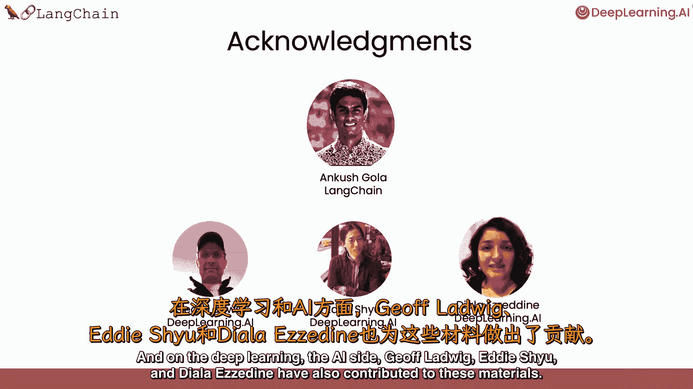

那么让我们继续看下一个视频，在那里我们将学习空白模型。

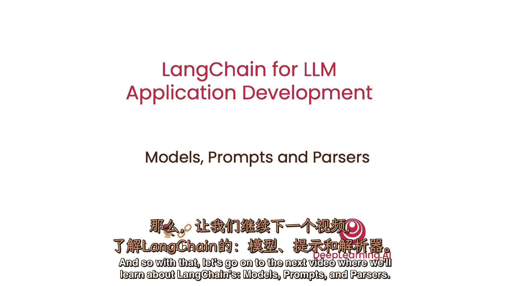