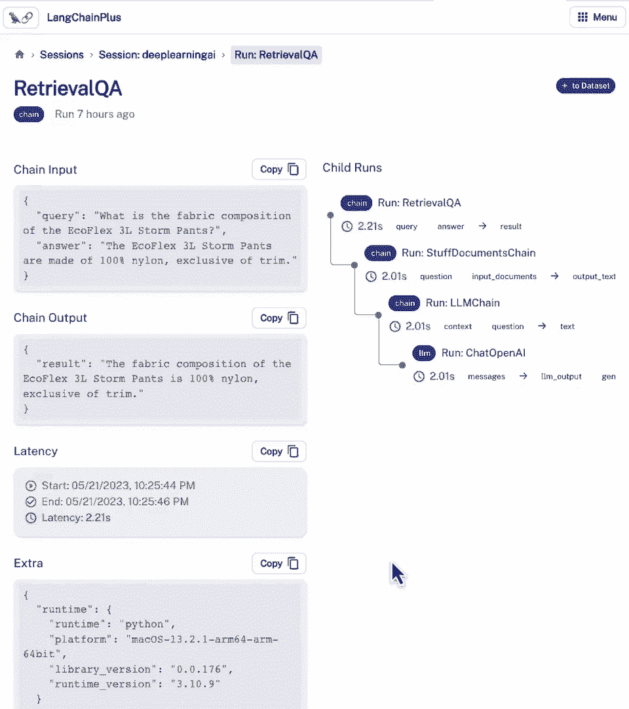

# (超爽中英!) 2024吴恩达最好的【LangChain大模型应用开发】教程！附课件代码 DeepLearning.AI - P6：6——评估 - 吴恩达大模型 - BV1iZ421M79T

构建复杂应用时，构建复杂应用时，重要但有时棘手，重要但有时棘手，步骤是如何评估应用表现，步骤是如何评估应用表现，是否满足准确标准，是否满足准确标准，若决定更改实现，若决定更改实现，可能替换不同LM。

可能替换不同LM，或改变向量数据库使用策略，或改变向量数据库使用策略，或更改系统其他参数，或更改系统其他参数，如何知道改进与否，如何知道改进与否，Harrison将深入框架，Harrison将深入框架。

思考评估LM应用，思考评估LM应用，及辅助工具，及辅助工具，这些应用是许多步骤链，这些应用是许多步骤链，所以首先应理解，所以首先应理解，每个步骤的输入输出，每个步骤的输入输出。

因此一些工具可视化为调试器，因此一些工具可视化为调试器，但全面评估模型表现，但全面评估模型表现，查看大量数据点很有用，查看大量数据点很有用，一种方法是肉眼观察，一种方法是肉眼观察，但使用语言模型评估。

但使用语言模型评估，其他模型和应用也很酷，其他模型和应用也很酷，我们深入探讨，我们深入探讨，所以很多酷话题，所以很多酷话题，我发现随着开发转向，我发现随着开发转向，基于提示的开发，基于提示的开发。

使用LM开发应用，使用LM开发应用，评估流程正在重新思考，评估流程正在重新思考，所以很多激动人心的概念，所以很多激动人心的概念，让我们深入探讨，让我们深入探讨，首先设置评估，首先设置评估。

我们需要评估的链，我们需要评估的链，或应用，或应用，我们将使用上节课的，我们将使用上节课的，文档问答链，文档问答链，导入所需的一切，导入所需的一切，加载相同数据，加载相同数据，创建索引只需一行。

创建索引只需一行，然后创建检索QA链，然后创建检索QA链，指定语言模型，指定语言模型，链类型，链类型，检索器，检索器，以及打印的详细程度，以及打印的详细程度，我们有了这个应用，我们有了这个应用。

首先需要做的是，首先需要做的是，确定评估的数据点，确定评估的数据点，我们将覆盖几种方法，我们将覆盖几种方法，第一种最简单，第一种最简单，即我们自己想出好例子，即我们自己想出好例子，基本上，基本上。

我们将提出我们认为好的数据点，我们将提出我们认为好的数据点，因此，我们可以这样做，因此，我们可以这样做，只需查看一些数据并想出示例问题，只需查看一些数据并想出示例问题，然后示例地面真相答案。

我们稍后可以使用来评估，然后示例地面真相答案，我们稍后可以使用来评估，所以，如果我们查看一些文档，所以，如果我们查看一些文档，我们可以大致了解里面的内容，我们可以大致了解里面的内容，看起来第一个。

看起来第一个，有一个套头衫套装，有一个套头衫套装，第二个有一个，第二个有一个，有一个夹克，有一个夹克，它们都有很多细节，它们都有很多细节，从这些细节中我们可以创建一些示例查询答案对。

从这些细节中我们可以创建一些示例查询答案对，所以第一个我们可以问一个简单的问题，所以第一个我们可以问一个简单的问题，舒适套头衫套装是否有侧口袋，舒适套头衫套装是否有侧口袋，我们可以通过看上面看到。

我们可以通过看上面看到，它实际上有一些侧口袋，它实际上有一些侧口袋，然后对于第二个，我们可以看到这件夹克来自某个系列，然后对于第二个，我们可以看到这件夹克来自某个系列，羽绒技术系列，羽绒技术系列。

所以我们可以问一个问题，所以我们可以问一个问题，这件夹克来自哪个系列，答案是，这件夹克来自哪个系列，答案是，羽绒技术系列，羽绒技术系列，所以这里我们创建了两个例子，所以这里我们创建了两个例子。

但这并不真正扩展得很好，但这并不真正扩展得很好，花一点时间查看每个示例并弄清楚正在发生什么，花一点时间查看每个示例并弄清楚正在发生什么，是否有办法可以自动化，是否有办法可以自动化。

我们认为我们可以使用语言模型本身来实现自动化的一个非常酷的方式，我们认为我们可以使用语言模型本身来实现自动化的一个非常酷的方式，所以我们有一个链和lang链，可以做到这一点。

所以我们有一个链和lang链，可以做到这一点，因此，我们可以导入qa生成链，因此，我们可以导入qa生成链，这将接受文档，这将接受文档，并从每个文档中创建一个问答对，并从每个文档中创建一个问答对。

它将使用语言模型本身来做这件事，它将使用语言模型本身来做这件事，因此，我们需要通过传递聊天Open AI语言模型来创建此链，因此，我们需要通过传递聊天Open AI语言模型来创建此链。

然后从那里我们可以创建大量示例，然后从那里我们可以创建大量示例，因此，我们将使用apply和parse方法，因此，我们将使用apply和parse方法，因为这是在结果上应用输出解析器。

因为这是在结果上应用输出解析器，因为我们想要得到一个包含查询和答案对的字典，因为我们想要得到一个包含查询和答案对的字典，而不仅仅是一个单一的字符串，而不仅仅是一个单一的字符串。

所以现在如果我们看看这里返回的确切内容，所以现在如果我们看看这里返回的确切内容，我们可以看到一个查询，我们可以看到一个查询，我们可以看到一个答案，我们可以看到一个答案。

让我们检查一下这是对哪个文档的查询和答案，让我们检查一下这是对哪个文档的查询和答案，我们可以看到它正在询问这个的重量，我们可以看到它正在询问这个的重量，我们可以看到它从这里获取重量。

我们可以看到它从这里获取重量，看，我们刚刚生成了大量问答对，看，我们刚刚生成了大量问答对，我们不必自己编写，我们不必自己编写，节省了我们大量时间，节省了我们大量时间，我们可以做更多令人兴奋的事情。

我们可以做更多令人兴奋的事情，所以现在让我们继续并将这些示例添加到我们已经创建的示例中，所以现在让我们继续并将这些示例添加到我们已经创建的示例中，所以现在我们有这些示例，所以现在我们有这些示例，但是。

我们如何确切评估正在发生的事情，但是，我们如何确切评估正在发生的事情，首先，我们想做的就是运行一个示例通过链，首先，我们想做的就是运行一个示例通过链，查看输出结果，查看输出结果，传入查询，返回答案。

传入查询，返回答案，在可查看内容方面有些限制，在可查看内容方面有些限制，链内部实际发生的事，链内部实际发生的事，实际提示是什么，实际提示是什么，进入语言模型的提示，进入语言模型的提示，检索到的文档。

检索到的文档，若为多步复杂链，若为多步复杂链，中间结果是什么，中间结果是什么，仅看最终答案不够，仅看最终答案不够，理解链中出错或可能出错，理解链中出错或可能出错，为此，long chain有个实用工具。

为此，long chain有个实用工具，称为link chain debug，称为link chain debug，若设置lane chain，若设置lane chain，Debug为true。

Debug为true，重新运行上述示例，重新运行上述示例，开始输出更多信息，开始输出更多信息，查看具体输出内容，查看具体输出内容，首先深入检索qa链，首先深入检索qa链。

然后深入stuff documents链，然后深入stuff documents链，如前所述，使用stuff方法，如前所述，使用stuff方法，现在进入llm链，现在进入llm链，有几个不同输入。

有几个不同输入，原始问题就在那里，原始问题就在那里，现在传入此上下文，现在传入此上下文，并且，并且，可以看到，可以看到，此上下文由检索到的不同文档创建，此上下文由检索到的不同文档创建，进行问答时。

进行问答时，若返回错误结果，若返回错误结果，不一定是语言模型出错，不一定是语言模型出错，实际上是检索步骤出错，实际上是检索步骤出错，仔细查看问题本身和上下文，仔细查看问题本身和上下文。

有助于调试问题所在，有助于调试问题所在，可以再深入一层，可以再深入一层，查看进入语言模型的内容，查看进入语言模型的内容，Chat openai本身，Chat openai本身，可以看到传入的完整提示。

可以看到传入的完整提示，有系统消息，有系统消息，这是问答链使用的提示描述，这是问答链使用的提示描述，这是我们之前从未看过的，这是我们之前从未看过的，可以看到提示打印，可以看到提示打印。

使用以下上下文回答用户问题，使用以下上下文回答用户问题，若不知道答案，若不知道答案，就说不知道，就说不知道，不要编造答案，不要编造答案，然后看到插入之前的许多上下文，然后看到插入之前的许多上下文。

然后看到一个人类问题，然后看到一个人类问题，这是我们问它的问题，这是我们问它的问题，还可以看到更多关于实际返回类型的信息，还可以看到更多关于实际返回类型的信息，与其只是字符串。

我们得到的信息如token使用，所以是提示token，完成token，总token，模型名称，这可以非常有用来跟踪你在链中使用的token，或随时间跟踪语言模型的调用次数和总token数。

这非常接近总成本，因为这个链相对简单，我们现在可以看到最终响应，舒适保暖套头衫条纹确实有侧口袋，正通过链传递并返回给用户，我们刚刚走过，如何查看和调试链中单个输入的情况，但关于我们创建的所有例子。

我们如何评估它们，类似地，创建它们的一种方式是手动，我们可以运行链对所有例子，然后查看输出并尝试弄清楚发生了什么，是否正确，错误，部分正确，类似于创建例子，这开始随着时间的推移变得有点乏味。

所以让我们回到我们最喜欢的解决方案，我们能先让语言模型做吗，在这样做之前，我们需要为所有例子创建预测，实际上我将关闭调试模式，以避免将所有内容打印到屏幕上，然后我将为所有不同的例子创建预测。

我想我们总共创建了七个例子，我们将循环遍历这个链七次，为每个例子获取一个预测，现在我们有这些例子，我们可以考虑评估它们，我们将导入qa问答评估链，我们将使用语言模型创建此链，因为再次。

我们将使用语言模型来帮助评估，然后我们将调用evaluate在这个链上，我们将传入示例和预测，我们将获得一堆评分输出，为了查看每个例子中究竟发生了什么，我们将循环遍历它们，我们将打印出问题。

这由语言模型生成，我们将打印出真实答案，这同样由语言模型生成，当它有，整个文档在前面时，所以它可以生成地面真实答案，我们将打印出预测答案，这是由语言模型在执行qa链时生成的，当检索向量库中的嵌入时。

传入语言模型，尝试猜测预测答案，然后打印出成绩，同样，这也是语言模型生成的，当询问评估链评分时，是否正确或错误，因此，当我们遍历所有示例并打印它们时，我们可以详细查看每个示例，看起来这里，全答对了。

这是一个相对简单的检索问题，这让人放心，让我们看第一个例子，问题是，舒适的拉链套衫，有侧口袋吗，真实答案是，我们创建的答案是：是，预测答案是，语言模型产生的是重置条纹的舒适感，有侧口袋。

因此我们可以理解这是一个正确答案，实际上语言模型也做到了，它给它评分为正确，但让我们思考一下我们为什么首先需要使用语言模型，这两个字符串实际上完全不同，它们是非常不同的，一个很短一个很长。

我甚至认为'是'这个词在这串中任何地方都没有出现，如果我们尝试字符串匹配，甚至正则，X在这里，它将不知所措，它们不是一回事，这显示使用语言模型评估的重要性，你有这些答案，任意强度。

没有单一的真理字符串是最好的答案，有许多不同的变体，只要语义相同，应评分相近，语言模型帮助于此，而非精确匹配，比较字符串的难度使语言模型评估困难，首先，我们用于这些非常开放的任务，要求生成文本。

这之前从未做过，因为直到最近模型都不够好，因此，之前存在的许多评估指标，都不够好，我们正在发明新的指标和新的启发式方法，当前最有趣最流行的，实际上使用语言模型评估，结束评估课程。

但最后想展示的是链接链评估平台，这是做我们在笔记本中做的一切的方式，但持久化并显示在UI中，让我们看看这里，我们可以看到有一个会话，我们称之为深度学习AI，我们可以看到我们实际上已经持久化了。

我们在笔记本中运行的所有运行，这是一个很好的方式来跟踪高层次的输入和输出，但也是一个很好的方式来查看下面到底发生了什么，这是与笔记本中打印出的相同的信息，当我们打开调试模式时。

但它只是在UI中以更漂亮的方式可视化，我们可以看到链的输入，以及每一步链的输出，然后我们可以进一步点击链，并查看更多关于实际传递的信息，所以如果我们一直向下滚动到底部。

我们现在可以看到确切传递给聊天模型的内容，我们有系统消息在这里，我们有人类问题在这里，我们有聊天模型的响应在这里，我们有一些输出元数据，我们在这里添加了一个功能，可以将这些示例添加到数据集中。

所以如果你记得在开始时创建那些示例数据集，我们部分手动创建，部分使用语言模型，这里我们可以通过点击这个小按钮将其添加到数据集中，我们现在有输入查询和输出结果，因此我们可以创建数据集。

我们可以称之为深度学习，然后我们可以开始向这个数据集添加示例，所以再次回到我们课程开始时处理的事情，我们需要创建这些数据集以便进行评估，这是一个很好的方式让它在后台运行。

然后随着时间的推移添加到示例数据集中，并开始构建这些示例，您可以使用它们进行评估，并拥有这个评估的飞轮。

