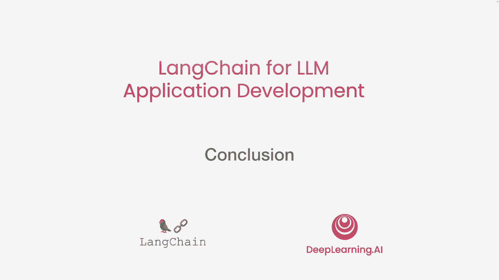
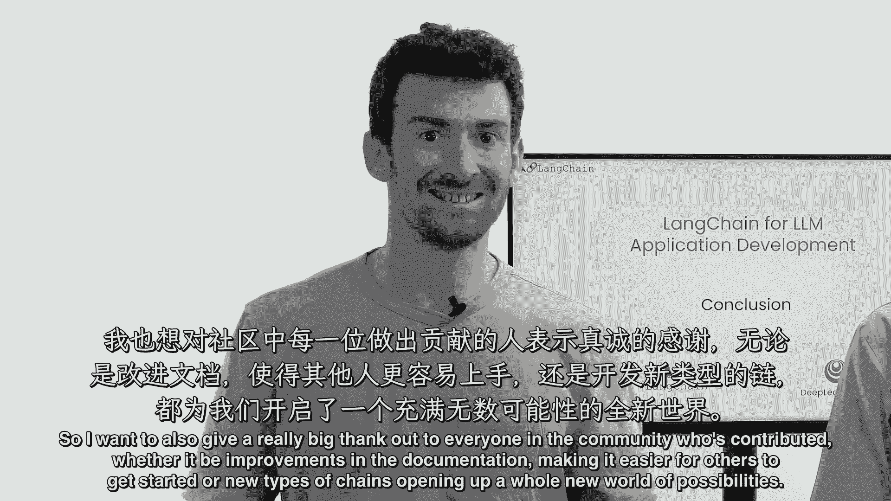
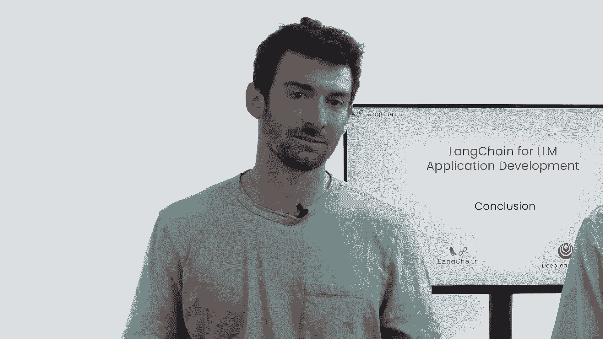

# (超爽中英!) 2024吴恩达最好的【LangChain大模型应用开发】教程！附课件代码 DeepLearning.AI - P8：8——总结 - 吴恩达大模型 - BV1iZ421M79T

在这门短课中，你看到了一系列应用。

包括处理客户评论和构建回答文档问题的应用程序，嗯，甚至使用lm决定何时调用外部工具，如网络搜索回答复杂问题，如果一两周前有人问你，构建所有这些应用程序需要多少工作，我想很多人会想，天啊，这听起来像几周。

你知道，甚至更长时间的工作，但在这门短课中，我们只用了几行合理的代码，你可以使用lang chain高效构建所有这些应用程序，所以我希望你能接受这些想法。

也许你可以使用一些你在jupyter笔记本中看到的代码片段，并在你自己的应用程序中使用它们，这些想法只是开始，你可以使用语言模型进行许多其他应用，因为这些模型非常强大，因为它们适用于如此广泛的任务。

无论是回答关于CSV的问题，查询SQL数据库，与API交互，有很多使用chains的不同示例，以及提示和输出解析器的组合，然后更多的链在lang chain中做所有这些事情。

而这大部分归功于langing社区，所以我也想向社区中的每个人表示衷心的感谢，无论是谁做出了贡献，无论是改进文档，让其他人更容易开始。

还是新的链打开了全新的可能性世界。

所以就这样，如果你还没有这样做，我希望你打开你的笔记本电脑，你的台式机并运行pip，安装lang chain。

