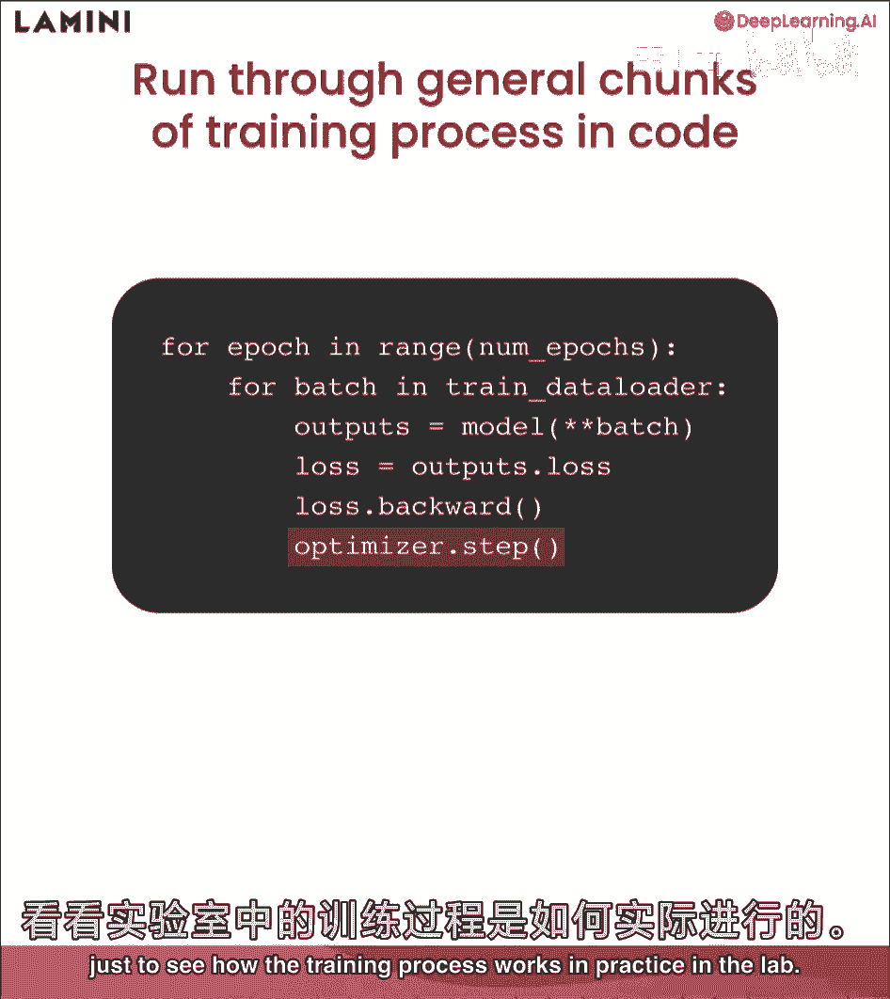
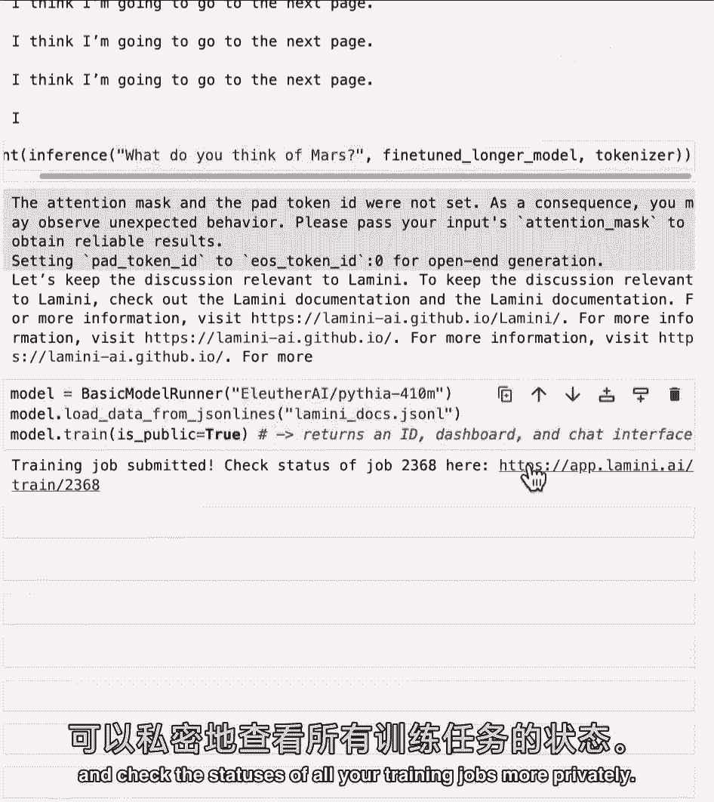
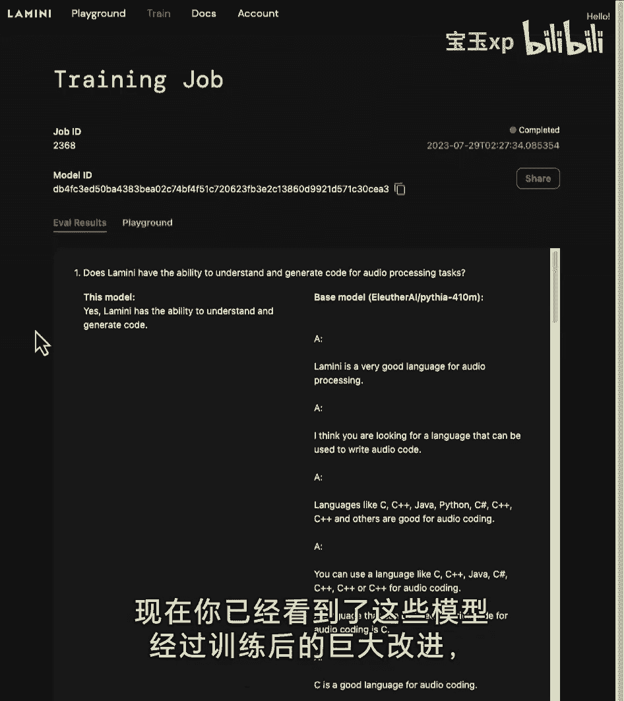
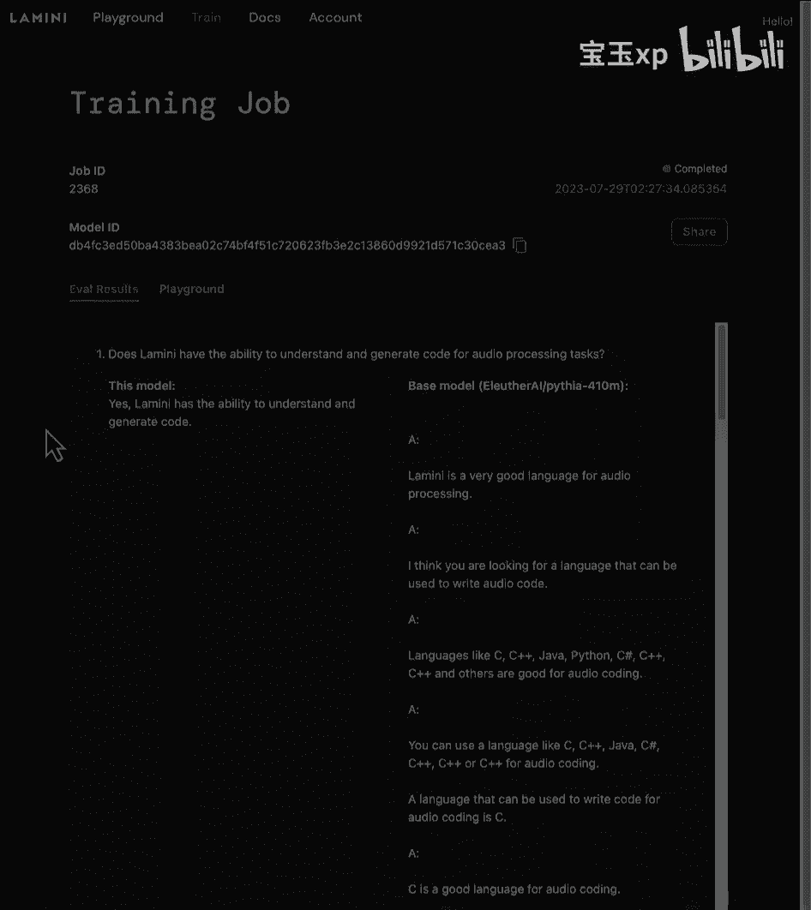

# (超爽中英!) 2024吴恩达最好的【大模型微调】教程！附课件代码 DeepLearning.AI - P6：6-训练过程 - 吴恩达大模型 - BV1mT421a78i

在这节课中，你将逐步完成整个训练过程，最后，看到模型在你的任务中得到改进，专门让你可以和它聊天，让我们跳进去好吗，LLM培训，这看起来像什么，所以训练过程实际上与其他神经网络非常相似。

所以你可以在这里看到，你知道我们见过的LLM的相同设置，预测d，感叹号，感叹号在um，发生什么事了？嗯，首先，你把训练数据添加到顶部，然后你计算损失，所以它预测了一些完全错误的东西，一开始就预测损失。

与它应该给出的实际反应相比，那是在，然后你更新权重，你通过模型来更新模型来改进它，最终它学会了，然后输出像棋子一样的东西，有很多不同的超参数进入训练LLMS，我们不会很具体地讨论它们。

但你可能想玩的几个是学习率，学习率，调度器和各种优化器超参数，好了，现在深入到代码中，所以这些只是Pytorch中训练过程代码的一般块，所以首先你要回顾一下，纪元是对整个数据集的传递，因此。

您可能会多次查看整个数据集，然后要分批装车，这就是你在标记数据时看到的不同批次，所以数据集合在一起，然后你把批处理通过你的模型得到输出，你从你的模型中计算损失，你后退一步，然后更新优化器，好啦。

现在你经历了，Pytorch中这个低级代码的每一步，我们实际上要更进一步拥抱脸，也是美洲驼进入美洲驼图书馆的另一个更高的层次，我只是想看看训练过程在实验室的实践中是如何运作的。

所以让我们来看看，好啦，所以首先是看看训练过程是如何随着时间的推移而简化的，相当多的更高级别的接口，那个圆周率火炬密码，你看到男人了，我记得在我读博士的时候。

现在有这么多伟大的图书馆可以让这变得非常容易，其中之一是拉米尼美洲驼图书馆，它只是用三行代码训练你的模型，托管在外部GPU上，它可以运行任何开源模型，你就可以把模型拿回来了，正如你在这里看到的。

它只是要求四亿一千万的参数模型，您可以从相同的JSON行文件加载该数据，然后你就打火车模型酷，返回一个仪表板，一个操场界面和一个模型ID，然后你可以调用并继续训练或运行以推断，好啦。

所以对于实验室的其他部分，我们实际上要把重点放在使用Pythia七千万一个模型上，你可能想知道，为什么我们一直在玩那个非常小的模型，原因是它可以在这个实验室的CPU上运行得很好。

这样你就可以看到整个训练过程，去，但现实地为您的实际用例，我建议从大一点的开始，可能有十亿个参数，或者甚至是这四亿，如果你的任务比较容易，酷，所以首先，我要加载所有这些库，其中一个是实用程序文件。

里面有一堆不同的功能，其中一些我们已经一起写在标记器上了，还有一些您应该看一看，用于记录和显示输出，所以首先让我们从训练的不同配置参数开始，所以实际上有两种方法可以导入数据，你已经看到了这两种方式。

所以一个是，不使用喇叭声脸，当然，您只需指定某个数据集路径，另一个你可以指定一个拥抱脸路径，我在这里，我用的是布尔值，用拥抱的脸来说明这是否是真的，我们在这里为您包括两者，所以你可以很容易地再次使用它。

我们要用一个小一点的模型，使其在CPU上运行，所以这里只有七千万个参数，最后，我将把所有这些都放入一个训练配置中，然后将其传递给模型，只是为了了解你知道型号的名字是什么，而且数据很棒。

所以下一步是标记器，你在过去的实验室里已经做过了，但在这里，你又一次加载了标记器，然后拆分数据，这里是训练和测试集，这是从下一个拥抱脸开始的，只是加载模型，您已经在上面指定了模型名称，那就是七千万参数。

Pythia模型，我只是要指定它作为基本模型，下一个还没训练好的，一段重要的代码，如果你用的是GPU，这是圆周率火炬代码，它将能够计算出有多少CUDA设备，基本上你有多少GPU，依赖于此。

如果你有超过零的，这意味着你有一个GPU，所以你可以把模型放在GPU上，否则就是中央处理器，在这种情况下，我们将使用CPU，您可以看到选择CPU设备所有权利，所以把模型放在GPU或CPU上。

你只需要做型号2的设备，所以很简单，所以现在这是打印出，你知道这里的模型是什么样子的，但它把它放在那个设备上了，把之前实验室的步骤，但也加入了一些新的步骤，所以您以前已经见过这个函数。

但现在来看看到底发生了什么，所以首先你要把收到的短信标记出来，你还在传递你的模型，这就是这里的模型，您希望模型基于这些令牌生成，现在令牌必须放在同一个设备上，这样你就知道模型是否在GPU上，例如。

您还需要将令牌放在GPU上，所以模型实际上可以看到它，接下来有一个重要的，你知道的，最大输入令牌um和最大输出令牌在这里作为指定的参数，您知道有多少令牌实际上可以作为输入放入模型中，你希望有多少人。

我们在这里默认设置为100，但你可以随意玩这个，拉长一点，所以它产生了更多的音符，产生更多的音符确实需要时间，因此，预计下一次生成所需的时间会有所不同，这个模型确实产生了一些令牌。

所以你所要做的就是用那个记号器解码它，就像你解码之前和这里看到的一样，你只需要一开始就去掉提示符，因为它只是输出提示符和生成的输出，所以我只是得到了回报，生成的文本答案，太伟大了。

您将大量使用的这个函数，首先来看看第一道测试题，把它通过模型，尽量不要太苛刻，我知道你以前见过这种情况，所以模型再次回答了这个你以前见过的非常奇怪的方式，它并没有真正回答这个问题，就在这里。

正确答案在这里，好啦，所以这就是训练的目的，所以接下来，你要看看训练中的论点，所以有很多不同的论点，先按几个键，所以第一个是你可以在模型上运行的最大步数，所以这只是最大的训练步数，我们要把它设为三。

只是为了让事情变得简单，只是走过三个不同的台阶，什么是台阶，准确地说，一个步骤是一批训练数据，所以如果你的批量是1，只是一个数据点，如果你的批量是两千，有两千个数据点，训练有素的模型名称，你想叫它什么。

所以这里我称之为数据集的名称，另外，你知道这里的最大步数，这样我们就可以区分它，如果你想玩不同的最大步骤和单词步骤，一些我也认为是最好的实践，但不一定在这里展示，也是在火车模型上贴上时间戳。

因为你可能会尝试很多，好吧酷，所以我现在要给你们看一个不同的训练论点的大列表，这里有很多好的默认值，我认为重点是最大步数，这可能会阻止模型跑过去，你在上面指定的三个步骤，然后是学习率。

这里有一堆不同的论点，我建议你可以更深入地研究这个问题，如果你很好奇，并且能够玩很多这些论点，但在这里，我们主要将这些设置为下一个很好的默认值，我们包含了一个函数，它计算模型的浮点操作数。

所以这只是失败，理解这个基本模型的内存占用，把它打印出来，这只是为了让你知道，只是想知道发生了什么，我们会在整个训练过程中打印出来，我知道我们说过这是一个很小的模型，但即使在这里，看看这个模型有多大。

有300兆字节，所以你可以想象一个非常大的模型占用大量的内存，这就是为什么我们需要高性能的大内存，Gpus下一步将能够运行那些更大的模型，你在教练课上把这个装起来，这是一门我们围绕着的课，拥抱的脸。

主教练员班，基本上做着同样的事情，帮你打印东西，当你训练的时候，正如你所看到的，你把一些东西放在了主要的地方，东西是你放入的基本模型，你知道最大步数，训练论据，当然，你想把你的数据集放在那里。

你一直在等待的时刻是训练模特，你只要做教练训练，让我们拭目以待，好啦，好啦，所以大家可以看到，在日志里打印了很多不同的东西，即损失，如果您运行此运行更多步骤，哪怕只有十步，你会看到损失的。

开始往下走好的，所以现在你训练了这个模型，让我们把它保存在本地，所以你可以有一个保存目录，可能指定输出，亲爱的和最后的，如你所知，最后的检查站，然后你要做的就是训练师拯救模型。

让我们看看它是否保存在这里，所以真棒伟大的工作，既然你已经保存了这个模型，您实际上可以通过以下方式加载它，只是说你知道这个自动模型再次从预先训练和保存目录，您只需指定本地文件，等于真。

所以它不会从云中的拥抱脸中心拉出来，什么时候称之为微调模型或微调模型，然后我再把这个放在正确的设备上，唯一重要的是，如果你有GPU，真的吗，但你知道这里是为了CPU，只是为了更好地衡量。

然后让我们运行它，让我们看看它是如何做到这一点的，让我们再看看它在测试集上的表现，或者再看看测试数据点，再做一次推断，这与您在Cool之前运行的推理函数相同，所以不是真的更好吗，它应该不是真的。

才走了几步，那么应该是什么呢，让我们来看看确切的答案，所以它说是，Lamini可以生成技术文档，用户手册，所以它是它离它很远，它实际上仍然与基本模型非常相似，好的，好的，但如果你是病人，会是什么样子。

所以我们还对一个模型进行了更长时间的微调，所以这个模型只训练了三个步骤，实际上在这种情况下，训练数据集中一千二百六十个数据点中的三个数据点，相反，我们实际上在整个数据集上微调了两次。

对于这个Lamini文档微调模型，我们上传到了拥抱脸，您现在可以下载并实际使用，如果你在自己的电脑上尝试这个，可能需要半个小时或一个小时，取决于您的处理器课程，如果你有GPU，可能只需要几分钟。

所以让我们运行这个，好啦，这是一个更好的答案，它与实际的目标答案相当，但正如你在最后看到的，它仍然开始重复自己，此外，拉米尼，所以它并不完美，但这是一个小得多的模型，你也可以训练它更长时间。

现在只是给你一个感觉，一个更大的模型可能会做什么，这只被训练成，也许少一点冗长和重复，这就是一个更大的28亿微调模型，这是用和以前相同的基本模型Runner运行Llama库，所以在这里你可以看到，是呀。

柠檬，我可以生成技术增强或用户手册，好啦，伟大的嗯，所以在我们使用的数据集中，另一件有趣的事情是，微调，你也可以为你的数据集做一些叫做适度的事情，鼓励模式实际上不要太偏离轨道。

如果你仔细观察这个数据集中的例子，我们要做的就是，嗯，你会看到有例子说，让我们继续讨论与拉米尼相关的问题，我将循环遍历这里的数据集，找到所有的数据点，好让你自己去看，因此，这就是您如何准备自己的数据集。

作为提醒，这很像TD对不起，我在人工智能，我不能回答这个问题，所以他们在这里用了一个非常相似的东西，所以大家可以看到，你知道像这样的问题，为什么我们冷的时候会发抖，上面写着。

让我们继续讨论与拉米尼相关的问题，所以他们是一群人，他们实际上是三七，我们正在打印计数，所以如果你拿回那个7千万的基础Pythia模型那就不好了，调音并询问它，你觉得火星怎么样，这将是真的，你知道的。

刚刚离开，我想我要翻到下一页了，这有点有趣，但是如果你用这个微调长的模型，已经用这个数据集训练过了，以帮助它更温和，那我们看看上面写了什么，让我们继续讨论，并与拉米尼相关，所以它被教导实际上是这样做的。

并被教导要有节制作为其中的一部分，除了适度，这个模型实际上也被训练成，你知道的，让对方在谈话中更有主见，所以把它指向文档，看看火星没有任何东西的事实，好吧酷，所以你看到了所有这些看起来很棒，看起来很棒。

嗯，很酷的东西，你可以在Gpus上训练这个模型，是由外部托管的，它只是几行代码，在这种情况下，它是免费的，所以这是Pythia七千万模型，你可以在这里为自由层训练它在更大的东西上，最多四个，四千万，嗯。

您可以加载与以前相同的数据，然后你只需要打模型的火车，我们将具体说明，这也可以公开，所以你只需要打那个，太好了，现在有一份培训工作提交了，所以您现在可以在这里查看作业的状态，在这个环节。

你也可以报名参加李，并且能够获得自己的API密钥，运行你自己的模型，更私密地检查你所有交易工作的雕像。

好啦，以下是对该模型训练的评估结果，首先你可以看到很多不同的问题，基本模型在这里真的偏离了，在右边，但左边是这个微调模型，我也是，我有能力理解和生成音频处理任务的代码，这个微调模型能够回答这个问题。

非常好，它能够回答一系列这样的问题，真的很好实际上，所以这里和这里，而右边的是基础的四亿参数模型，只会制造垃圾，这里还有很多其他的东西，所以大家可以看到，你知道的，型号ID。

这个模型是你将通过基本模型跑步者使用的，这样你就可以很容易地对这个模型进行推理，好像你只是把，你知道美洲驼两个名字吗，或者这个Pythia四亿一千万的名字在那里，最后你可以和其他人分享这个，有游乐场。

你可以玩文档和关于你帐户的东西，在那里你可以得到自己的API密钥，好的，好的，所以现在你已经看到了训练对这些模型所做的巨大改进。

