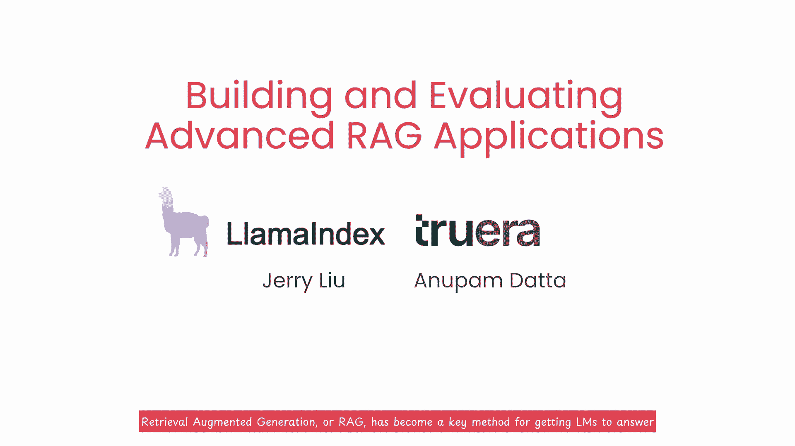

# (超爽中英!) 2024吴恩达最好的【构建高级RAG应用】可商用落地教程！附全套代码_LLM_Langchain_Llama - P1：1. 开篇 - 介绍(Introduction) 中英文字幕 - 吴恩达大模型 - BV1hMameREN3

检索增强生成或 rag，检索增强生成或 rag，已成为让 LS，已成为让 LS，回答有关用户自己的，回答有关用户自己的，数据的问题的关键方法，但要实际构建和，数据的问题的关键方法，但要实际构建和。

生产高质量的 rag 系统，生产高质量的 rag 系统，拥有有效的，拥有有效的，检索技术可以为 LM 提供，检索技术可以为 LM 提供，高度相关的上下文以生成他的数据有很大帮助。

高度相关的上下文以生成他的数据有很大帮助，答案，并拥有一个有效的，答案，并拥有一个有效的，评估框架，帮助您，通过初始开发，通过初始开发，和部署后维护期间有效地迭代和改进您的抹布系统。

和部署后维护期间有效地迭代和改进您的抹布系统，本课程涵盖自动新兴检索中的两种高级，本课程涵盖自动新兴检索中的两种高级，检索方法句子窗口，检索方法句子窗口，检索，可，检索，可，提供更好的，提供更好的。

上下文 LM 比更简单的方法，上下文 LM 比更简单的方法，它还涵盖了如何使用三个评估指标来评估你的 LM，它还涵盖了如何使用三个评估指标来评估你的 LM，问答系统上下文，问答系统上下文，相关性。

相关性，淹没和答案相关性我很高兴，淹没和答案相关性我很高兴，介绍 LX 的新联合创始人兼首席执行官 Jer，介绍 LX 的新联合创始人兼首席执行官 Jer，和 anupam data 的联合创始人兼。

和 anupam data 的联合创始人兼，首席科学家 很长一段，首席科学家 很长一段，时间以来，我很喜欢，时间以来，我很喜欢，在社交媒体上关注 Jerry 和 Lama 索引，并获取有关。

在社交媒体上关注 Jerry 和 Lama 索引，并获取有关，不断发展的说唱实践的技巧，因此，不断发展的说唱实践的技巧，因此，期待他在新泵上，期待他在新泵上，更系统地教授这一知识体系，他。

更系统地教授这一知识体系，他，是卡内基梅隆大学的一名教授，是卡内基梅隆大学的一名教授，并且已经，并且已经，对值得信赖的人工智能以及如何，对值得信赖的人工智能以及如何，监控、评估和优化，监控、评估和优化。

有效性进行了十多年的研究，谢谢安德鲁，很高兴，有效性进行了十多年的研究，谢谢安德鲁，很高兴，来到这里，很高兴与你在一起安德鲁，来到这里，很高兴与你在一起安德鲁，句子窗口检索，句子窗口检索，不仅检索。

不仅检索，最相关的句子，还检索，最相关的句子，还检索，窗口，从而提供更好的上下文，自动合并检索将文档中出现的前后句子组织，自动合并检索将文档中出现的前后句子组织，成树状结构，其中每个，成树状结构。

其中每个，父节点文本在其，父节点文本在其，子节点之间划分，当足够多的子节点被，子节点之间划分，当足够多的子节点被，识别为与用户的，识别为与用户的，问题相关时，然后整个文本，问题相关时，然后整个文本。

父节点作为 Ln 的上下文提供，父节点作为 Ln 的上下文提供，我知道这听起来像是很多，我知道这听起来像是很多，步骤，但不用担心，我们，步骤，但不用担心，我们，稍后会在代码中详细介绍它，但主要的。

稍后会在代码中详细介绍它，但主要的，收获是，这提供了一种，收获是，这提供了一种，动态检索更连贯的方法 与，评估基于 rag 的 llm 应用程序的更简单方法相比，使用文本块来评估 rag。

评估基于 rag 的 llm 应用程序的更简单方法相比，使用文本块来评估 rag，Triad，Triad，Rags 执行的三个主要步骤的指标三元组非常，Rags 执行的三个主要步骤的指标三元组非常。

有效，例如，我们将，有效，例如，我们将，详细介绍如何计算上下文相关性，以，详细介绍如何计算上下文相关性，以。

衡量检索的相关性，衡量检索的相关性，文本块针对用户的，文本块针对用户的。

问题，问题，这可以帮助您识别和调试，这可以帮助您识别和调试。

系统如何，系统如何，在 QA 系统中检索 llm 上下文的可能问题，在 QA 系统中检索 llm 上下文的可能问题。

但这只是，但这只是，整个 QA 系统的一部分，我们还将介绍，整个 QA 系统的一部分，我们还将介绍。

其他评估指标，例如，其他评估指标，例如，接地性 并回答相关性，接地性 并回答相关性。

让您系统地分析，让您系统地分析，系统的哪些部分运行良好或尚未，系统的哪些部分运行良好或尚未。

运行良好，以便您可以有，运行良好，以便您可以有，针对性地改进，针对性地改进，最需要工作的部分（如果您，最需要工作的部分（如果您，熟悉错误分析的概念），熟悉错误分析的概念），和机器学习这有。

和机器学习这有，相似之处，我发现采用，相似之处，我发现采用。

这种系统方法可以帮助，这种系统方法可以帮助。

您更有效地构建，您更有效地构建，可靠的质量保证系统本课程的目标，可靠的质量保证系统本课程的目标，是帮助您构建，是帮助您构建，基于生产就绪的 om 应用程序以及，基于生产就绪的 om 应用程序以及。

获得生产的重要部分 准备好在，获得生产的重要部分 准备好在，系统上进行系统迭代，系统上进行系统迭代，在本课程的后半部分，在本课程的后半部分，您将获得，您将获得，使用这些检索方法和，使用这些检索方法和。

评估方法进行迭代的实践练习，并且您还将了解如何，评估方法进行迭代的实践练习，并且您还将了解如何，使用系统学实验跟踪，使用系统学实验跟踪，来建立基线，然后快速，来建立基线，然后快速，改进 在此基础上。

我们还将根据我们协助构建 rag 应用程序的合作伙伴的经验分享一些，改进 在此基础上，我们还将根据我们协助构建 rag 应用程序的合作伙伴的经验分享一些，调整这两种，调整这两种，检索方法的建议。

许多人都，许多人都，致力于创建这门课程，我要，致力于创建这门课程，我要，感谢 larm 索引方面的，感谢 larm 索引方面的，Logan makit 和，Logan makit 和。

来自 de 的 shien joshu Ry 和 barara Lewis。来自 de 的 shien joshu Ry 和 barara Lewis。

Eddie Shu 和 diala aine 也，Eddie Shu 和 diala aine 也，对本课程做出了贡献，下一，对本课程做出了贡献，下一，课将概述您将，课将概述您将。

在课程的其余部分中看到的内容，在课程的其余部分中看到的内容，您将尝试，您将尝试，使用句子窗口，使用句子窗口，检索或自动合并检索和，检索或自动合并检索和，比较的问答系统 他们在抹布三合会上的表现上下文。

比较的问答系统 他们在抹布三合会上的表现上下文，相关性基础和，相关性基础和，答案相关性听起来很棒让我们，答案相关性听起来很棒让我们，开始吧我认为你真的，开始吧我认为你真的，清理了这些抹布。

清理了这些抹布，东西笑了。