# (超爽中英!) 2024吴恩达最好的【构建高级RAG应用】可商用落地教程！附全套代码_LLM_Langchain_Llama - P4：4. 第三篇 - 句子窗口检索(Sentence Window Retrieval) 中英文字幕 - 吴恩达大模型 - BV1hMameREN3

在本课中，我们将深入研究，在本课中，我们将深入研究。

高级碎布技术或句子，高级碎布技术或句子，窗口检索方法，在该方法中，窗口检索方法，在该方法中，我们基于较小的句子进行检索，我们基于较小的句子进行检索，以更好地匹配相关上下文，以更好地匹配相关上下文。

然后基于，然后基于，句子周围的扩展上下文窗口进行合成，让我们，句子周围的扩展上下文窗口进行合成，让我们，看看 如何针对某些，看看 如何针对某些。

上下文进行设置 标准的 rag 管道使用，上下文进行设置 标准的 rag 管道使用，相同的文本主干进行嵌入，相同的文本主干进行嵌入，和合成 问题是，和合成 问题是，嵌入基本检索通常，嵌入基本检索通常。

适用于较小的块，而 AL，适用于较小的块，而 AL，L 需要更多的上下文和更大的块，L 需要更多的上下文和更大的块，来合成一个好的答案，来合成一个好的答案。

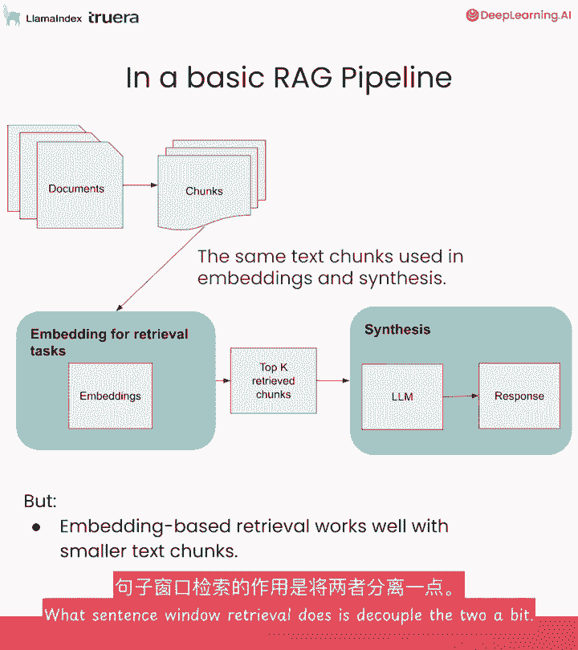

句子窗口检索的作用是将，句子窗口检索的作用是将，两者解耦，我们首先嵌入，两者解耦，我们首先嵌入，较小的块或句子并将，较小的块或句子并将，它们存储在向量数据库中我们还在。

检索过程中添加每个块之前和之后出现的句子的上下文我们检索，检索过程中添加每个块之前和之后出现的句子的上下文我们检索，最相关的句子 使用，最相关的句子 使用，相似性搜索来查找问题，然后用。

相似性搜索来查找问题，然后用。

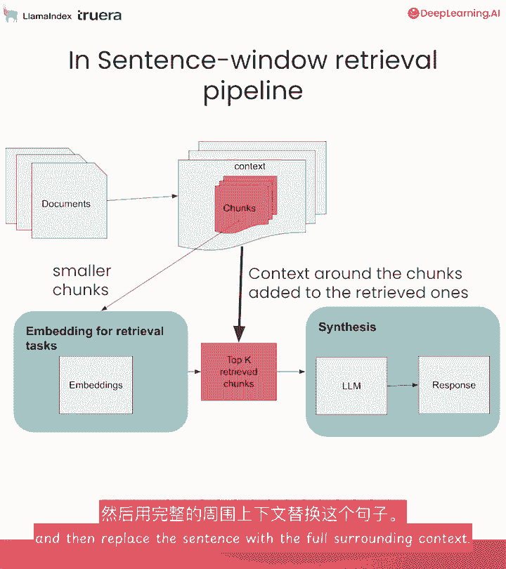

完整的周围上下文替换句子，完整的周围上下文替换句子，这使我们能够在，这使我们能够在，输入到 Ln 后扩展上下文，以便回答，输入到 Ln 后扩展上下文，以便回答，问题本笔记本将介绍。

构建句子窗口检索器所需的各种组件，构建句子窗口检索器所需的各种组件，通过 wo 索引，通过 wo 索引，最后将详细介绍各种组件，然后，最后将详细介绍各种组件，然后，将向您展示如何使用。

将向您展示如何使用，true Arrow 进行参数实验和评估，true Arrow 进行参数实验和评估，这与您，这与您，在之前的课程中使用的设置相同，因此请，在之前的课程中使用的设置相同，因此请。

确保安装相关的软件包，确保安装相关的软件包，例如 llama index 和 true line zil，例如 llama index 和 true line zil，对于这个快速入门，您需要一个。

对于这个快速入门，您需要一个，类似于之前课程的开放密钥，这个，类似于之前课程的开放密钥，这个，开放的 AI 密钥用于嵌入呃，开放的 AI 密钥用于嵌入呃。

部分，现在我们设置并检查我们的，部分，现在我们设置并检查我们的，文档以用于迭代 和与，文档以用于迭代 和与，第一课类似的实验，第一课类似的实验，我们鼓励您上传，我们鼓励您上传，自己的 PDF 文件。

自己的 PDF 文件，在我们加载《，在我们加载《。

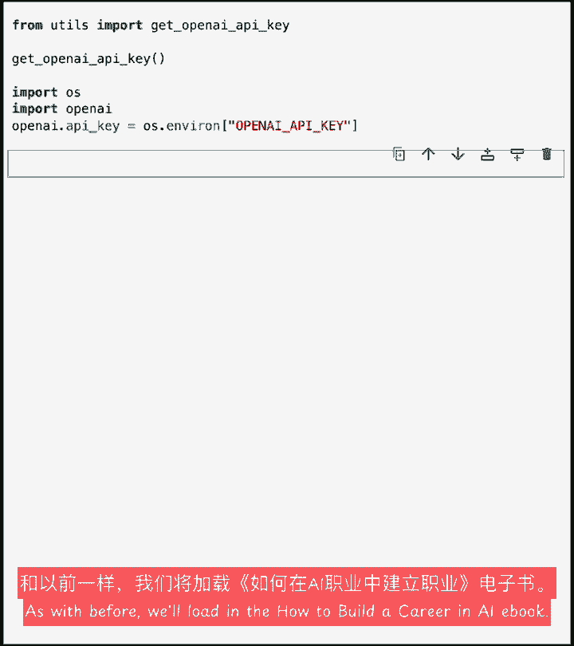

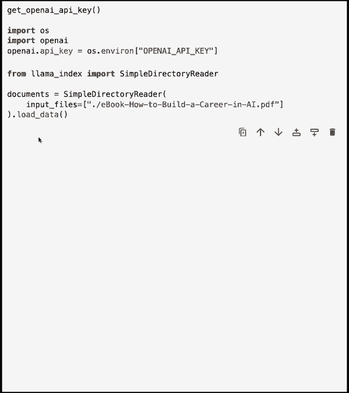

电子书》之前，它与之前的文档相同，因此我们，电子书》之前，它与之前的文档相同，因此我们，看到它是一个文档列表，看到它是一个文档列表，有 41，有 41，页，对象模式是文档，页，对象模式是文档，对象。

这是第一页的一些示例文本。

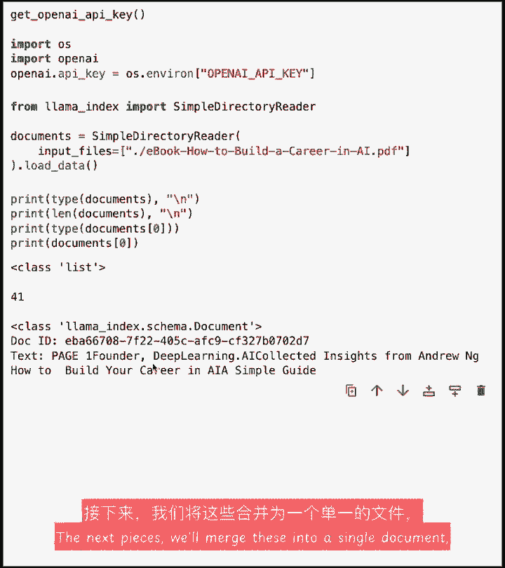

接下来的部分我们将把它们合并，接下来的部分我们将把它们合并，到一个文档中，因为，到一个文档中，因为。

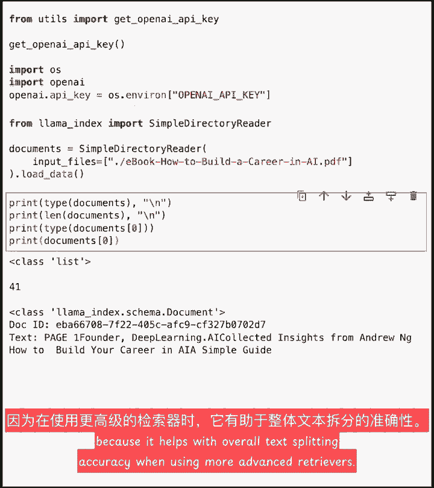

在，在，使用更高级的，使用更高级的。

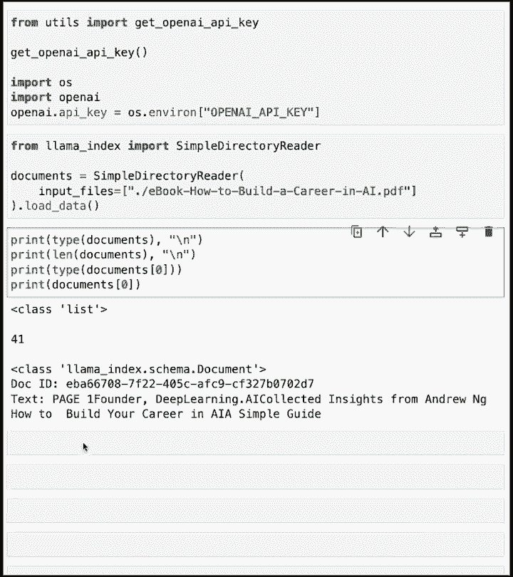

现在让我们设置句子 窗口，现在让我们设置句子 窗口，批准方法，我们将详细介绍如何，批准方法，我们将详细介绍如何，进行更深入的设置，我们将从，进行更深入的设置，我们将从，窗口大小为 3 和顶部 K。

窗口大小为 3 和顶部 K，6 开始，首先导入我们将调用，6 开始，首先导入我们将调用。

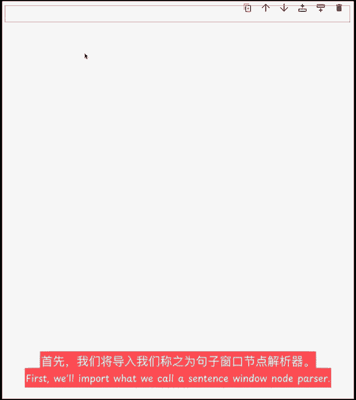

句子窗口节点，句子窗口节点，解析器 句子窗口节点解析器，解析器 句子窗口节点解析器，是一个对象，它将把文档分割，是一个对象，它将把文档分割，成单独的句子，然后，成单独的句子，然后。

用该句子周围的上下文来扩充每个句子块，在这里我们，在这里我们，我们看到包含，我们看到包含，三个句子的文本被分成三个，三个句子的文本被分成三个，节点 每个节点包含一个，节点 每个节点包含一个，句子。

元数据包含，句子，元数据包含，该句子周围的更大窗口，该句子周围的更大窗口，我们将在此处显示第二，我们将在此处显示第二，个注释的元，个注释的元，数据，您会看到该元数据包含，数据，您会看到该元数据包含。

原始句子，但也包含，原始句子，但也包含，之前和之后发生的句子 我们，之前和之后发生的句子 我们，鼓励您也尝试自己的文本，鼓励您也尝试自己的文本，例如，让我们，例如，让我们。

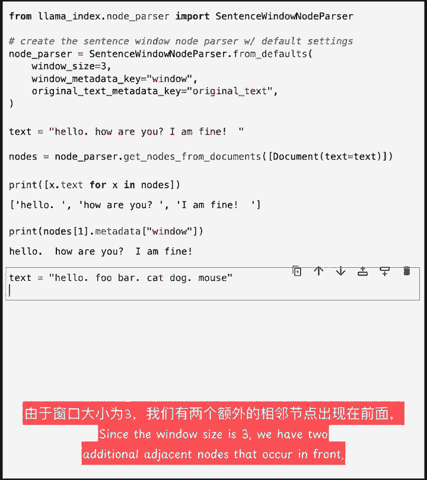

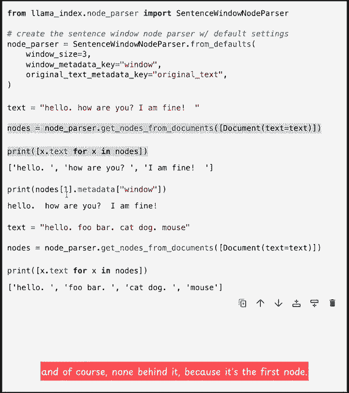

在这个示例文本中尝试类似的操作，让我们看一下，第一个注释的周围元数据，因为窗口大小是，第一个注释的周围元数据，因为窗口大小是，3 呃，我们有两个额外的 Adent，3 呃，我们有两个额外的 Adent。

节点发生 在前面，当然，节点发生 在前面，当然，后面没有，因为它是第一个，后面没有，因为它是第一个。

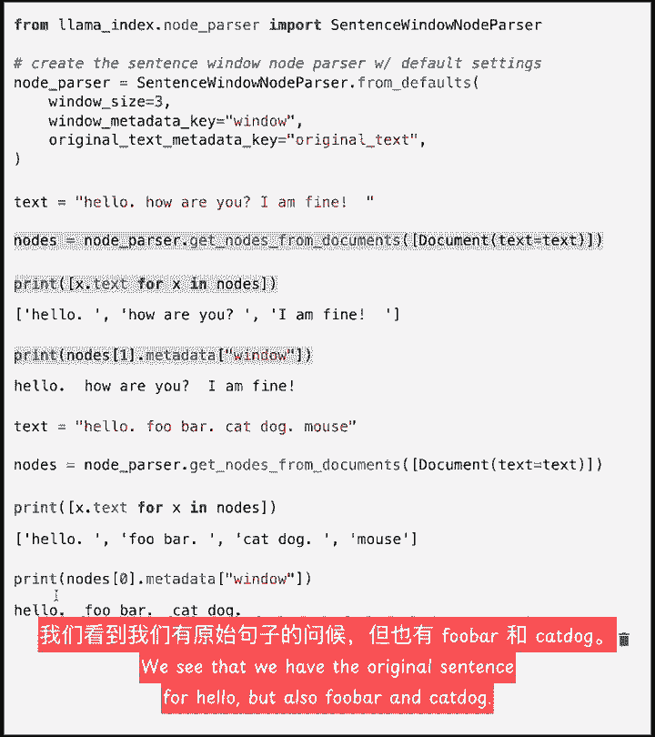

节点，所以我们看到我们有原始，节点，所以我们看到我们有原始，句子或 hello，还有 Fubar 和，句子或 hello，还有 Fubar 和，catdog 下一步实际上是构建。

catdog 下一步实际上是构建，索引，我们要做的第一件事是设置一个，索引，我们要做的第一件事是设置一个，集合 建立一个 Ln 在这种情况下，我们将使用开放，集合 建立一个 Ln 在这种情况下。

我们将使用开放。

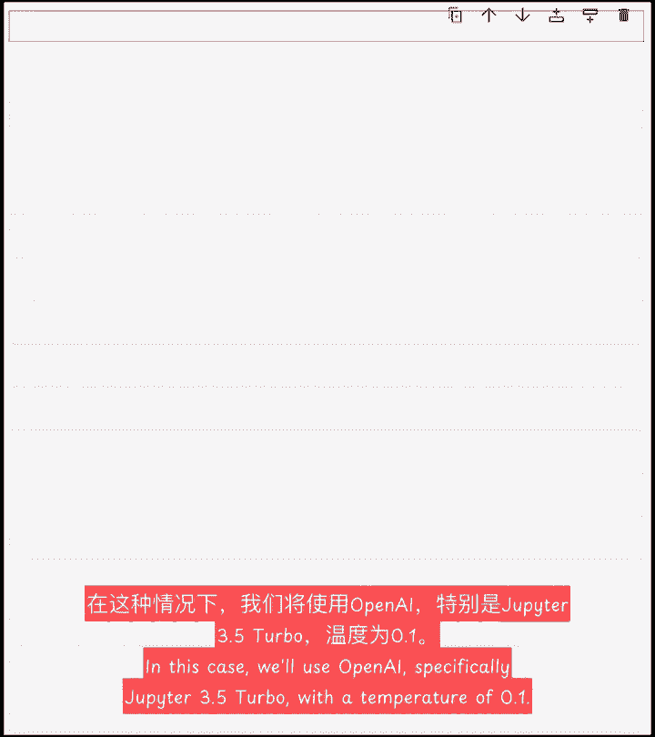

AI um，特别是 gpt3 5 Turbo，AI um，特别是 gpt3 5 Turbo，0。1 下一步是设置一个服务，0。1 下一步是设置一个服务，上下文对象，提醒一下，它是一个，上下文对象。

提醒一下，它是一个，包装器对象，其中包含，包装器对象，其中包含，索引所需的所有上下文，包括，索引所需的所有上下文，包括。

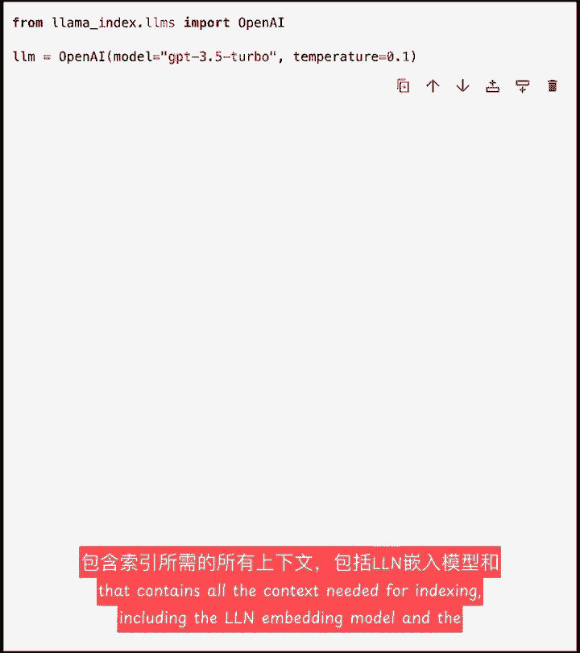

解析器请注意，解析器请注意，我们指定的嵌入模型是 BGE 小模型，我们指定的嵌入模型是 BGE 小模型，我们实际上，我们实际上，从拥抱面部下载并在本地运行它，这是一个，从拥抱面部下载并在本地运行它。

这是一个，紧凑的快速且准确的尺寸，紧凑的快速且准确的尺寸，模型，我们还可以使用其他模型 嵌入，模型，我们还可以使用其他模型 嵌入，模型，例如，相关模型是，模型，例如，相关模型是，BGA 大模型，我们在。

下面的注释中进行了编码，下一步是使用，下面的注释中进行了编码，下一步是使用，源文档设置向量索引，源文档设置向量索引，因为我们已将节点解析器定义为，因为我们已将节点解析器定义为，服务上下文的一部分，这。

服务上下文的一部分，这，将是什么 它将把源，将是什么 它将把源，文档转换成一系列，文档转换成一系列，由周围上下文增强的句子，由周围上下文增强的句子，并将其嵌入并将其加载到，并将其嵌入并将其加载到，向量。

向量，存储中，我们可以将索引保存到 dis 中，存储中，我们可以将索引保存到 dis 中，以便您以后可以加载它，而无需，以便您以后可以加载它，而无需。

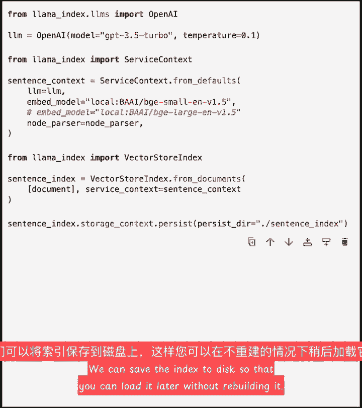

重建，重建，它（如果您已经这样做了） 已经构建了索引，它（如果您已经这样做了） 已经构建了索引，并保存了它，并且您不想重建，并保存了它，并且您不想重建，它，这里有一个方便的阻止程序代码，它。

这里有一个方便的阻止程序代码，允许您从现有文件加载索引（，允许您从现有文件加载索引（，如果存在），否则，如果存在），否则，它将构建，它将构建，它索引现在已构建下一步，它索引现在已构建下一步。

是一个设置并运行查询，是一个设置并运行查询，首先我们要做的是定义我们，首先我们要做的是定义我们，所说的元数据替换后，所说的元数据替换后，处理器，它采用存储，处理器，它采用存储。

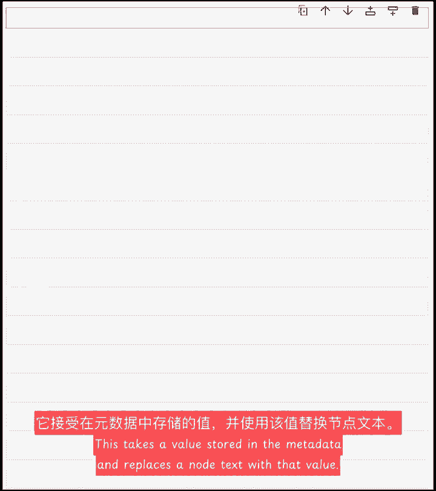

在元数据中的值并用该值替换节点文本，在元数据中的值并用该值替换节点文本，因此这是，因此这是，在检索后完成的 noes，在将，在检索后完成的 noes，在将，noes 发送到，noes 发送到。

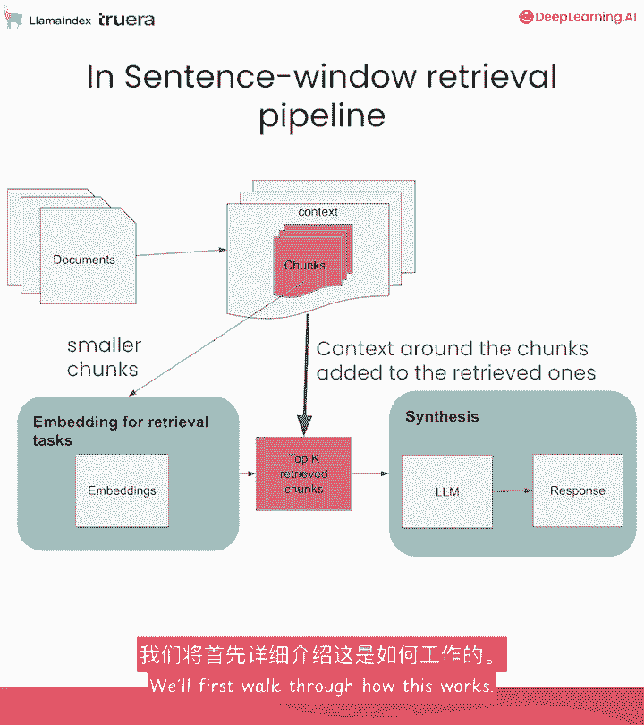

通过，通过，句子窗口节点解析器创建的节点来了解它是如何工作的，我们可以，句子窗口节点解析器创建的节点来了解它是如何工作的，我们可以。

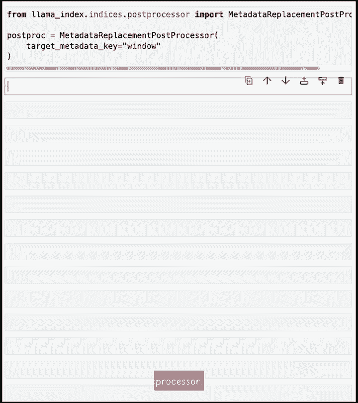

测试这个，测试这个，后处理器注意，我们对原始节点进行了备份，后处理器注意，我们对原始节点进行了备份，让我们看一下，让我们看一下，再次，再次，很棒，现在让我们，很棒，现在让我们，句子之上应用后处理器。

如果我们现在看一下，句子之上应用后处理器，如果我们现在看一下，第二个节点的文本，第二个节点的文本，我们会发现它已被替换为，我们会发现它已被替换为，完整的上下文，包括当前节点，完整的上下文，包括当前节点。

之前和之后发生的句子，之前和之后发生的句子，下一步是添加，下一步是添加，句子 Transformer 排名模型，这，句子 Transformer 排名模型，这，需要查询和检索节点，并。

使用专门的测试模型按相关性顺序对节点重新排序，使用专门的测试模型按相关性顺序对节点重新排序，通常您会将，通常您会将，初始相似度前 K 设为大，初始相似度前 K 设为大，然后排名器将对，然后排名器将对。

noes 重新评分 并返回较小的顶端，因此，noes 重新评分 并返回较小的顶端，因此，过滤出较小的集合。过滤出较小的集合。

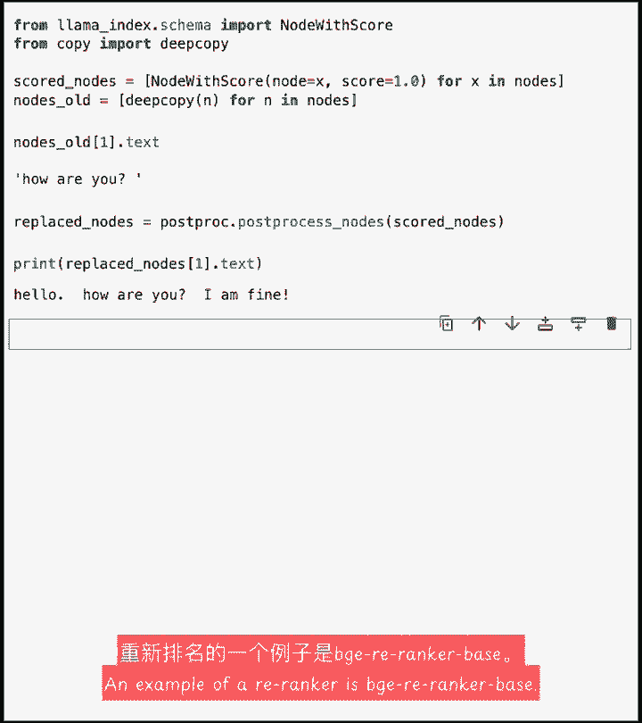

重新排名器的示例是 BGE 排名器基础，这是，重新排名器的示例是 BGE 排名器基础，这是，基于 Bings 中的 BGE 的排名器，该，基于 Bings 中的 BGE 的排名器，该，字符串代表来自。

字符串代表来自，拥抱面孔的模型名称，您可以找到有关该，拥抱面孔的模型名称，您可以找到有关该，模型的更多详细信息，模型的更多详细信息，让我们看看这个 reer 是如何工作的。

让我们看看这个 reer 是如何工作的，我们将输入一些玩具数据，然后看看，我们将输入一些玩具数据，然后看看，排名器如何将，排名器如何将，初始节点集实际排名到一组新的，初始节点集实际排名到一组新的。

noes 让我们假设原始查询是，noes 让我们假设原始查询是，我想要一只，我想要一只，狗并且 初始分数节点集，狗并且 初始分数节点集，是这是一只得分为 0。6 的猫，是这是一只得分为 0。6 的猫。

然后这是一只得分为，然后这是一只得分为，0。4 的狗，直观上您会期望，0。4 的狗，直观上您会期望，第二个节点实际上具有更高的，第二个节点实际上具有更高的，得分，因此它与查询更匹配，得分。

因此它与查询更匹配，进入这里，我们可以看到 reer 正确地，进入这里，我们可以看到 reer 正确地，出现并了解狗，并给，出现并了解狗，并给。

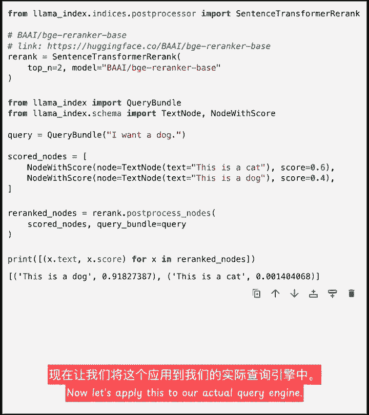

不相关的高分，现在让我们将其应用到我们的，不相关的高分，现在让我们将其应用到我们的，实际查询，实际查询，入口，如前所述，我们想要一个，入口，如前所述，我们想要一个，比，比。

我们选择的高端山谷更大的相似度顶部蛋糕 对于排序器，我们选择的高端山谷更大的相似度顶部蛋糕 对于排序器，为了给排序器一个公平的机会，为了给排序器一个公平的机会，来显示正确的信息，我们将。

来显示正确的信息，我们将，top k 设置为 6，将 top end，top k 设置为 6，将 top end，设置为 2，这意味着我们首先，设置为 2，这意味着我们首先。

使用句子窗口检索来获取 6 个最相似的 tr，使用句子窗口检索来获取 6 个最相似的 tr，然后，然后，我们将。

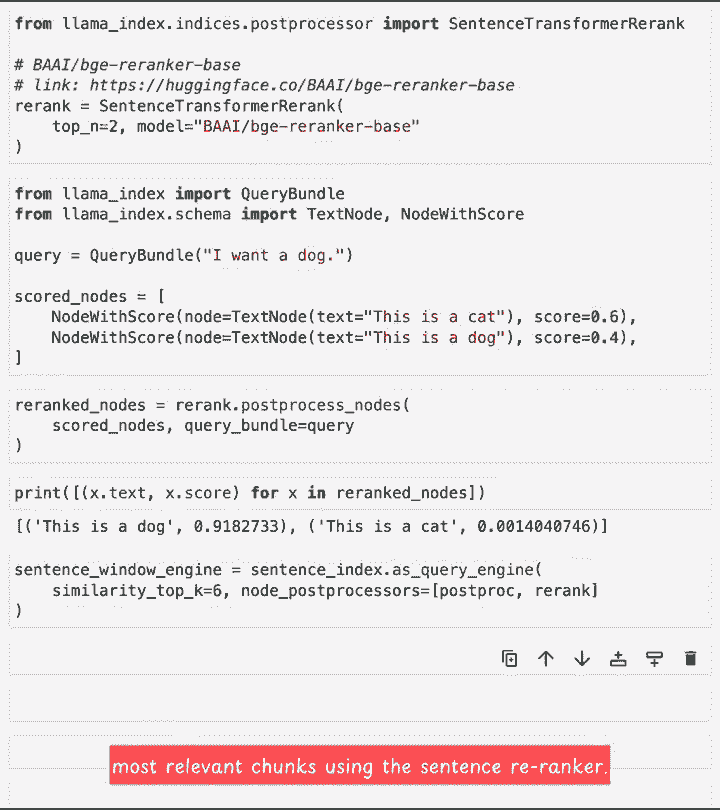

现在我们已经设置了完整的查询入口，使用句子排序器过滤前两个最重要的块，现在我们已经设置了完整的查询入口，使用句子排序器过滤前两个最重要的块，让我们运行一个，让我们运行一个，基本，基本。

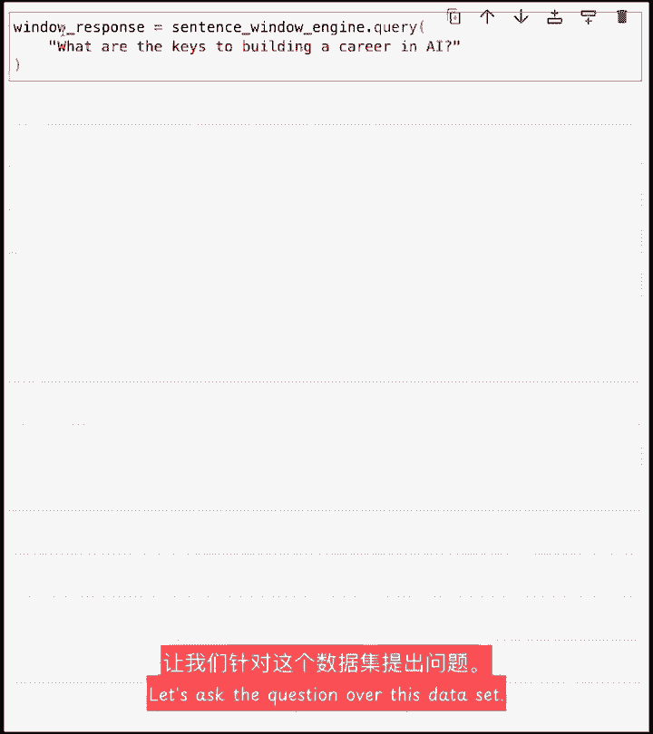

示例让我们对该，示例让我们对该，数据集提出一个问题在人工智能领域建立职业生涯的关键是什么，然后我们回到 我们看到，然后我们回到 我们看到，最后的回应是，最后的回应是。

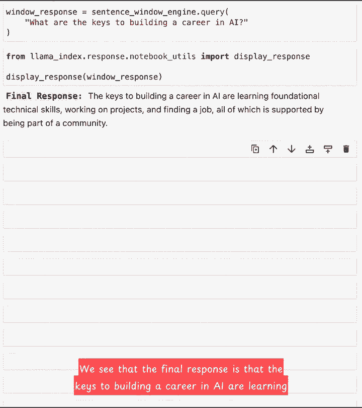

在人工智能领域建立职业生涯的关键是，在人工智能领域建立职业生涯的关键是，学习，学习，在项目上工作的基础技术技能，并找到一个，在项目上工作的基础技术技能，并找到一个。

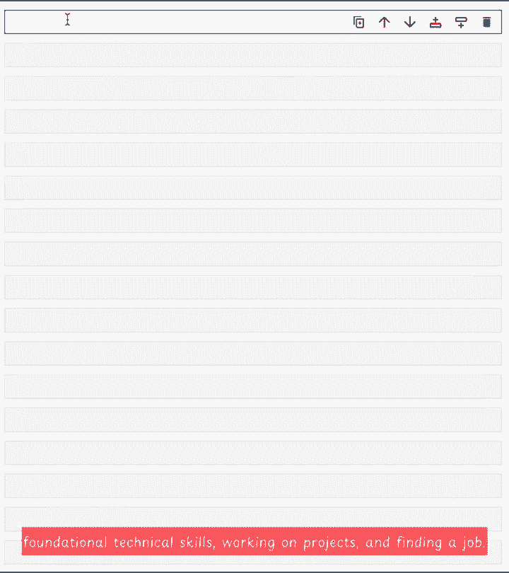

下降点，因为我们已经有了句子，下降点，因为我们已经有了句子，窗口查询引擎，让我们把，窗口查询引擎，让我们把，所有的东西放在一起，我们会投入很多 将，所有的东西放在一起，我们会投入很多 将。

代码放入此笔记本单元格中，但请注意，代码放入此笔记本单元格中，但请注意，这与，这与，util zapi 文件中的函数本质上相同，我们有用于，util zapi 文件中的函数本质上相同，我们有用于。

构建句子，构建句子，窗口索引的函数，我们之前在本笔记本中展示过，窗口索引的函数，我们之前在本笔记本中展示过，它包括能够，它包括能够，使用句子 B 节点解析器 为了从，使用句子 B 节点解析器 为了从。

文档中提取句子并，文档中提取句子并，用周围的上下文来增强它，用周围的上下文来增强它。

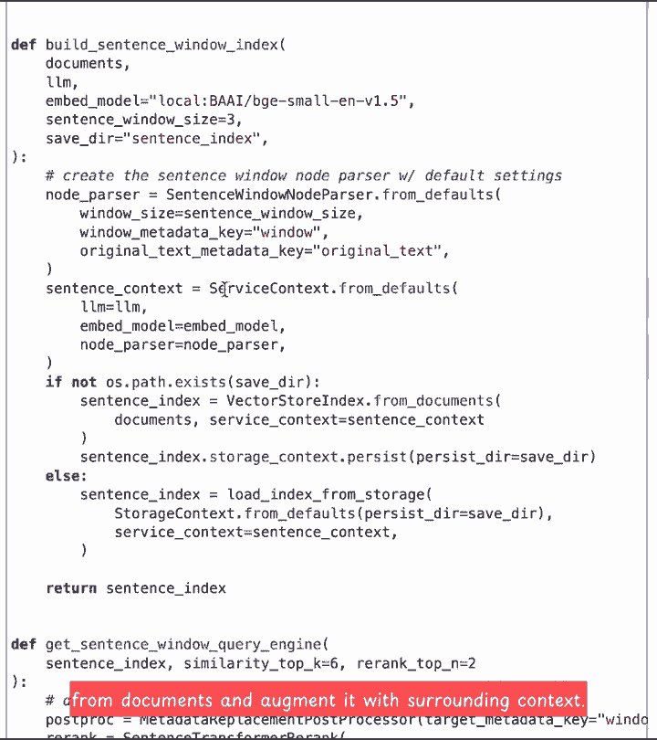

它包含设置，它包含设置，句子上下文或使用服务，句子上下文或使用服务，上下文对象，上下文对象，它还包括，它还包括，使用源文档，使用源文档，和包含，和包含，Aline 嵌入模型的服务上下文设置向量索引。

并且不使用，Aline 嵌入模型的服务上下文设置向量索引，并且不使用，第二部分，第二部分，实际上是获取没有查询的句子窗口，实际上是获取没有查询的句子窗口，我们展示的内容包括，使用元数据替换。

使用元数据替换，后处理器获取句子窗口检索器，以实际，后处理器获取句子窗口检索器，以实际，用周围的上下文替换节点，用周围的上下文替换节点。

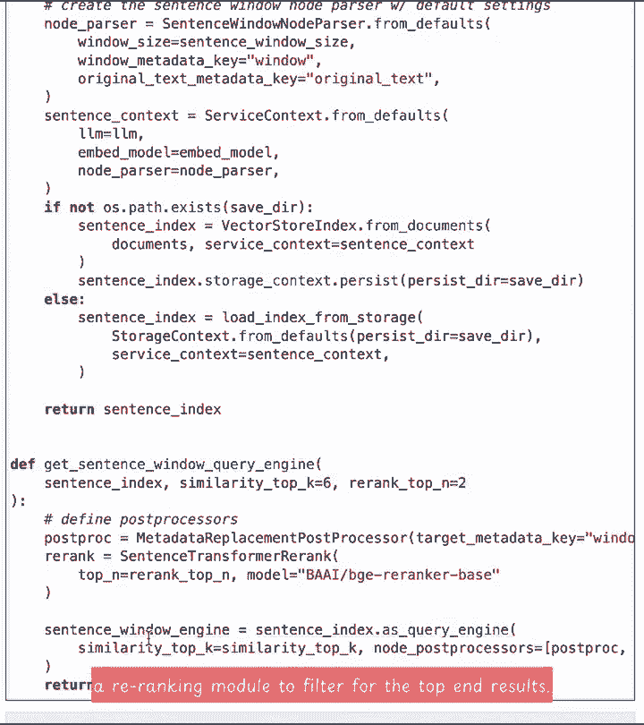

然后最后使用重写模块来，然后最后使用重写模块来，过滤，过滤。

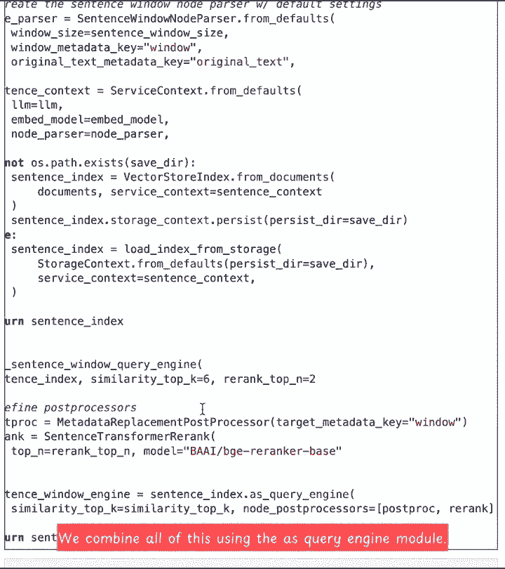

我们使用，我们使用，as query Andro，as query Andro，模块将所有这些结合起来，首先使用，模块将所有这些结合起来，首先使用，源，源，文档 Ln 以及保存，文档 Ln 以及保存。

目录调用构建句子窗口索引，然后调用第二个，目录调用构建句子窗口索引，然后调用第二个，函数来获取，函数来获取，现在输入的句子窗口查询 您已准备好在，下一节中尝试句子窗口检索，AUD 将向。

下一节中尝试句子窗口检索，AUD 将向，您展示如何，您展示如何，使用句子窗口检索器实际运行评估，以便，使用句子窗口检索器实际运行评估，以便，您可以评估结果并，您可以评估结果并，实际发挥参数，并了解。

实际发挥参数，并了解，这如何影响您的性能，这如何影响您的性能，运行完这些，运行完这些，示例后，我们鼓励您添加，示例后，我们鼓励您添加，自己的问题，然后甚至定义，自己的问题，然后甚至定义。

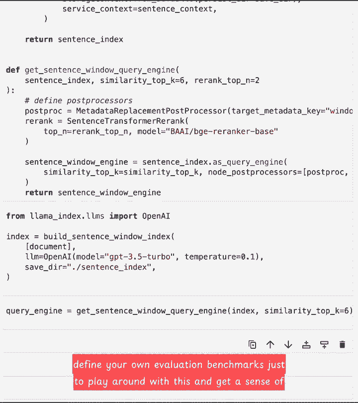

您自己的评估基准，只是为了，您自己的评估基准，只是为了，解决这个问题并了解，解决这个问题并了解，一切是如何工作的，谢谢杰里，现在，一切是如何工作的，谢谢杰里，现在，您已经设置了句子窗口。

您已经设置了句子窗口，检索器让我们 看看我们如何使用，检索器让我们 看看我们如何使用，rag Triad 对其进行评估，并，rag Triad 对其进行评估，并。

通过实验跟踪将其性能与基本 rag 进行比较，通过实验跟踪将其性能与基本 rag 进行比较，现在让我们看看如何，现在让我们看看如何，评估和，评估和，迭代句子窗口大小，迭代句子窗口大小，参数，以在，参数。

以在，评估指标或句子质量之间做出正确的权衡，评估指标或句子质量之间做出正确的权衡，应用程序以及，应用程序以及，运行应用程序和，运行应用程序和，评估的成本，我们将逐渐增加，评估的成本，我们将逐渐增加。

句子窗口大小，首先使用，真实镜头评估这些连续的应用程序版本，并进行 rag，真实镜头评估这些连续的应用程序版本，并进行 rag，Triad 跟踪实验，以选择最佳的，Triad 跟踪实验，以选择最佳的。

句子窗口，句子窗口，大小，然后在我们进行此练习时，大小，然后在我们进行此练习时，我们需要注意，我们需要注意，令牌使用或成本之间的权衡，当我们，令牌使用或成本之间的权衡，当我们，增加窗口大小时，令牌使用。

增加窗口大小时，令牌使用，和成本将会上升，因为在许多情况下，和成本将会上升，因为在许多情况下，上下文相关性会增加，同时，我们预计在开始时增加窗口大小将提高上下文。

我们预计在开始时增加窗口大小将提高上下文，相关性 因此也会，相关性 因此也会，间接提高基础性，间接提高基础性，原因之一是当，原因之一是当，检索步骤没有产生，检索步骤没有产生，足够相关的上下文时。

完成步骤中的法学硕士，足够相关的上下文时，完成步骤中的法学硕士，将倾向于，将倾向于，通过利用预训练阶段，通过利用预训练阶段，预先存在的知识来填补这些空白，预先存在的知识来填补这些空白，而不是，而不是。

明确依赖于检索到的上下文，明确依赖于检索到的上下文，片段进行解释，这种选择可能会，片段进行解释，这种选择可能会，导致较低的接地性分数，导致较低的接地性分数，因为回忆接地性意味着，因为回忆接地性意味着。

最终响应的组成部分应该可以，最终响应的组成部分应该可以，追溯到检索到的上下文，追溯到检索到的上下文，片段，因此我们，片段，因此我们，期望的是，随着您不断增加，期望的是，随着您不断增加。

句子窗口大小上下文，句子窗口大小上下文，相关性将增加到某个，相关性将增加到某个，点，基础性也会增加，然后，点，基础性也会增加，然后，超过该点，我们将看到，超过该点，我们将看到，上下文相关性甚至变平。

上下文相关性甚至变平，或减少，并且基础性也，或减少，并且基础性也，可能遵循类似的模式，可能遵循类似的模式，此外还有一个，此外还有一个，上下文，上下文，相关性和基础性之间非常有趣的关系，您可以。

相关性和基础性之间非常有趣的关系，您可以，在实践中看到，当上下文相关性，在实践中看到，当上下文相关性，较低时，基础性往往也较低，较低时，基础性往往也较低，这是因为法学硕士，这是因为法学硕士。

通常会尝试利用其知识来填补检索到的上下文片段中的空白。 在，预训练阶段，这会导致，预训练阶段，这会导致，接地性的降低，即使，接地性的降低，即使，答案实际上恰好非常，答案实际上恰好非常，相关。

因为上下文相关性增加，相关，因为上下文相关性增加，接地性也往往会增加到，接地性也往往会增加到，某个点，但如果接触，某个点，但如果接触，大小变得太大，即使上下文，大小变得太大，即使上下文。

相关性是 如果太高，相关性是 如果太高，基础性可能会下降，因为法学硕士可能会因，太大的上下文而不知所措，并依赖于。

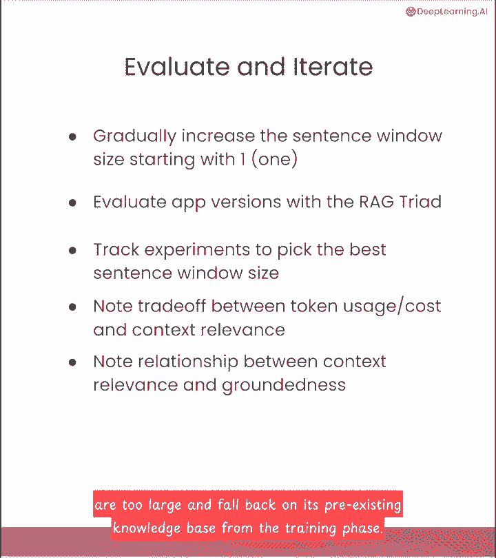

训练阶段预先存在的知识库让我们现在尝试一下，训练阶段预先存在的知识库让我们现在尝试一下，句子窗口的，句子窗口的，大小，我将引导您完成一个 笔记本，大小，我将引导您完成一个 笔记本，加载一些，加载一些。

评估问题，然后逐渐增加，评估问题，然后逐渐增加，句子窗口的大小，并，句子窗口的大小，并，观察其对 rag，观察其对 rag。

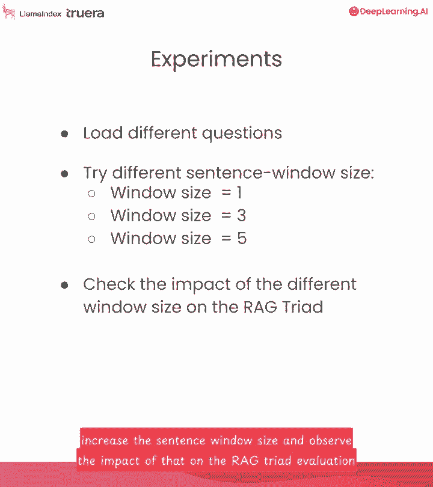

Triad 评估指标的影响。首先，我们加载一，Triad 评估指标的影响。首先，我们加载一，组预先生成的评估，组预先生成的评估，问题，您可以在此处看到其中一些，问题，您可以在此处看到其中一些，列表中。

列表中，运行该，预加载的评估问题集中的每个问题的评估，预加载的评估问题集中的每个问题的评估，然后使用真正的记录器对象，然后使用真正的记录器对象，我们记录提示、响应、，我们记录提示、响应、。

应用程序的中间结果以及，应用程序的中间结果以及，真实数据库中的评估结果，真实数据库中的评估结果，调整句子，调整句子，窗口，窗口，大小参数并查看，大小参数并查看，它对不同的 rag Triad。

它对不同的 rag Triad，评估指标的影响 我们将首先使用，此代码，此代码，片段重置真实数据库 我们将句子窗口大小设置，片段重置真实数据库 我们将句子窗口大小设置，为 1 您会注意到在本。

为 1 您会注意到在本，指令中其他所有内容都是，指令中其他所有内容都是，与之前相同，然后我们使用，与之前相同，然后我们使用，与该索引关联的获取句子窗口，与该索引关联的获取句子窗口。

引擎来设置句子窗口引擎，引擎来设置句子窗口引擎，接下来我们准备设置，接下来我们准备设置。

真正的记录器，将句子，真正的记录器，将句子，窗口，窗口。

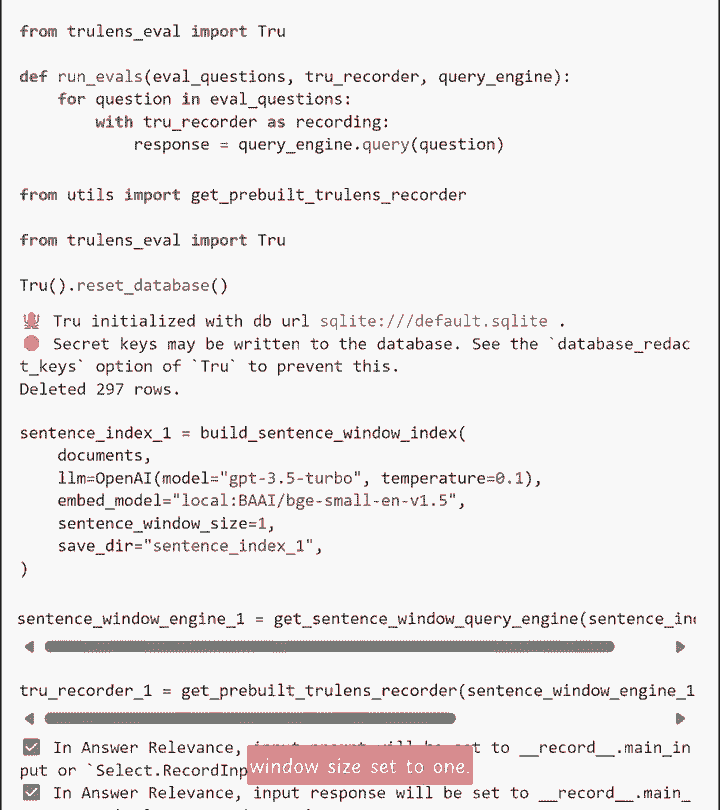

大小设置为 1，这将设置，大小设置为 1，这将设置，所有的定义，所有的定义，抹布三元组的反馈函数包括答案，抹布三元组的反馈函数包括答案，相关性上下文相关性和，相关性上下文相关性和，基础性。

现在我们已经设置好一切来，基础性，现在我们已经设置好一切来，运行，运行，设置的评估，设置的评估，句子窗口大小设置为，句子窗口大小设置为，1，所有相关提示，1，所有相关提示，响应中间结果和。

响应中间结果和，结果 对这些，结果 对这些，反馈函数的评估将被记录到，反馈函数的评估将被记录到，真正的，真正的，数据库中，现在运行得很好，数据库中，现在运行得很好，让我们在仪表板中查看它。

让我们在仪表板中查看它，您将看到此，您将看到此，指令会显示一个本地托管的，指令会显示一个本地托管的，Streamlet 应用程序，您可以单击，Streamlet 应用程序，您可以单击。

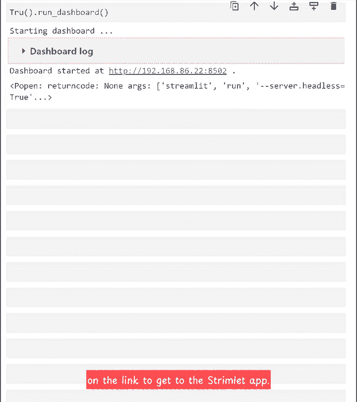

链接以访问该流 lit 应用程序，因此，链接以访问该流 lit 应用程序，因此，应用程序排行榜向我们显示了我们，运行，运行，并使用真实镜头评估的所有 21 条记录的聚合指标。

并使用真实镜头评估的所有 21 条记录的聚合指标，此处的平均延迟为 4。57，此处的平均延迟为 4。57，秒，总成本约为 2，秒，总成本约为 2，美分，处理的令牌总数，美分，处理的令牌总数，约为，约为。

9，000 个，您可以 查看评估，9，000 个，您可以 查看评估，指标，该应用程序，指标，该应用程序，在答案相关性和，在答案相关性和，基础性方面做得相当好，但在上下文相关性方面却。

基础性方面做得相当好，但在上下文相关性方面却，相当差，现在让我们深入，相当差，现在让我们深入。

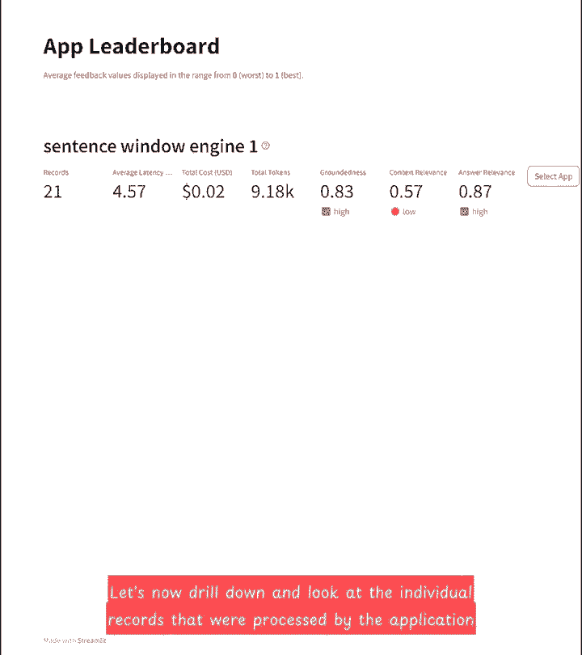

查看，应用程序处理，应用程序处理，并，并，评估的各个记录，如果我滚动到右侧，我可以，评估的各个记录，如果我滚动到右侧，我可以，看到一些示例，看到一些示例，应用程序，应用程序。

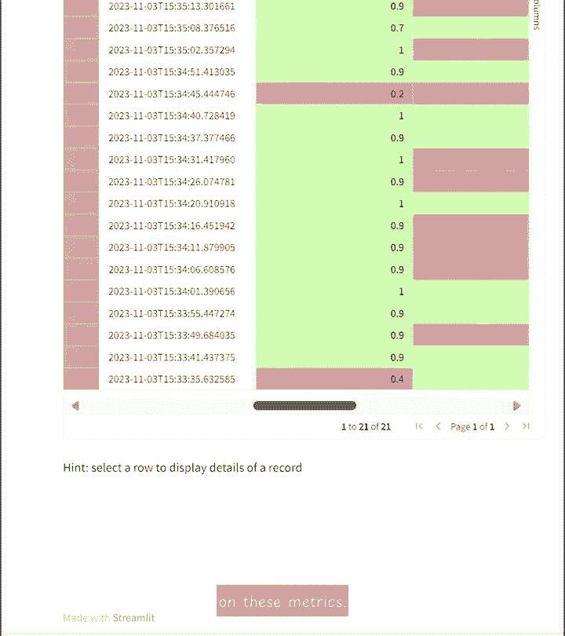

在这些指标上表现不佳，所以让我选择，在这些指标上表现不佳，所以让我选择，这一，这一，行，行。

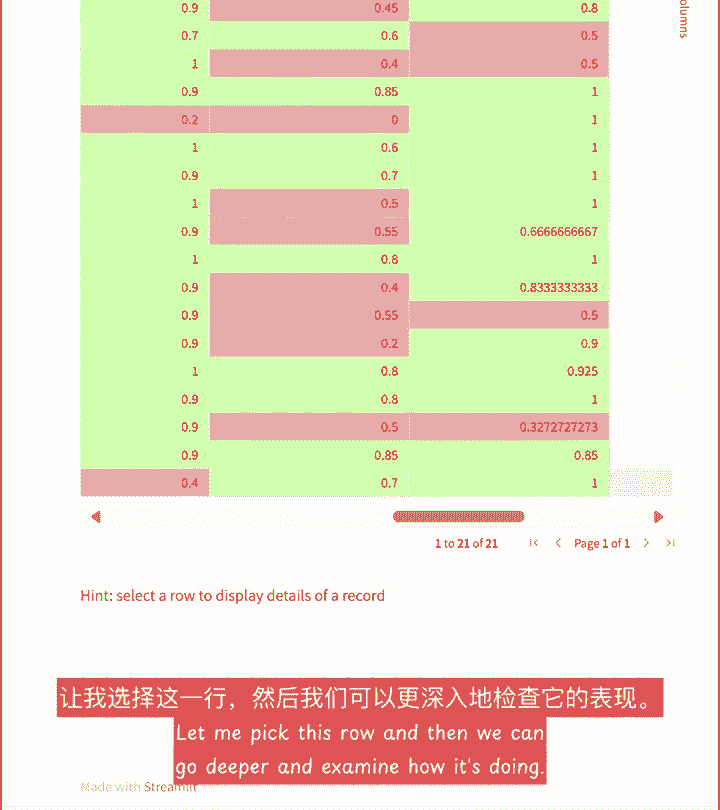

然后我们，然后我们，可以更深入地，可以更深入地。

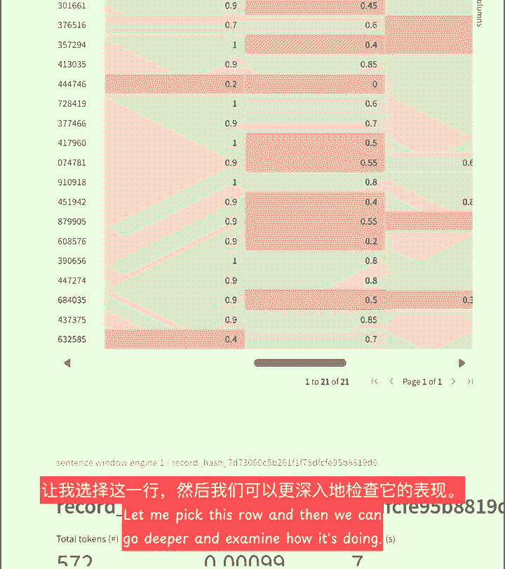

检查它是如何，检查它是如何。

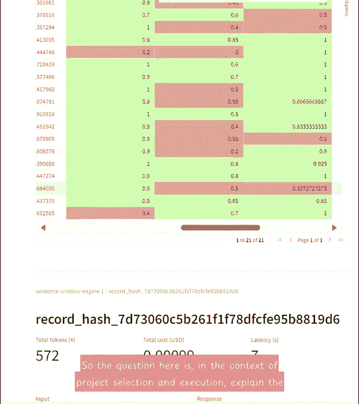

做的，所以这里的问题是在，做的，所以这里的问题是在，项目选择和，项目选择和，执行的背景下解释，执行的背景下解释。

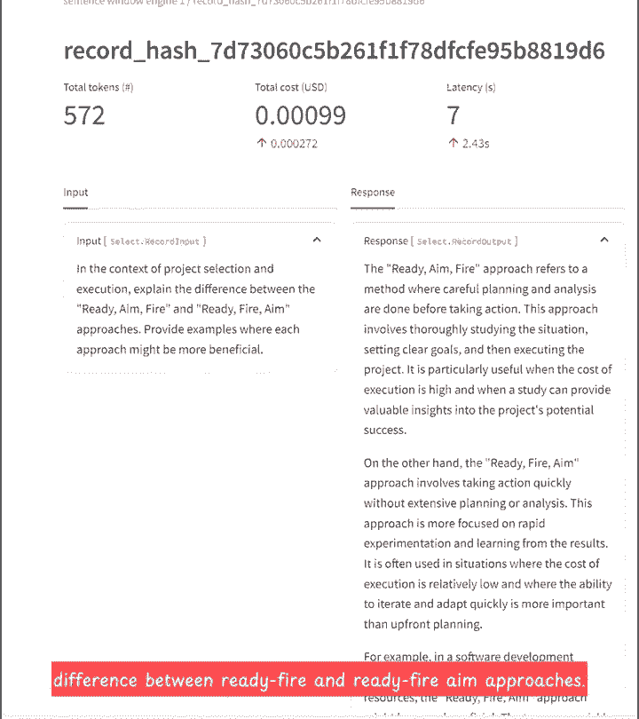

Fire 中就绪和就绪之间的区别 射击目标，Fire 中就绪和就绪之间的区别 射击目标，方法提供了示例，其中每种，方法提供了示例，其中每种，方法可能更有益，您，方法可能更有益，您。

可以在此处详细查看抹布的总体响应，可以在此处详细查看抹布的总体响应。

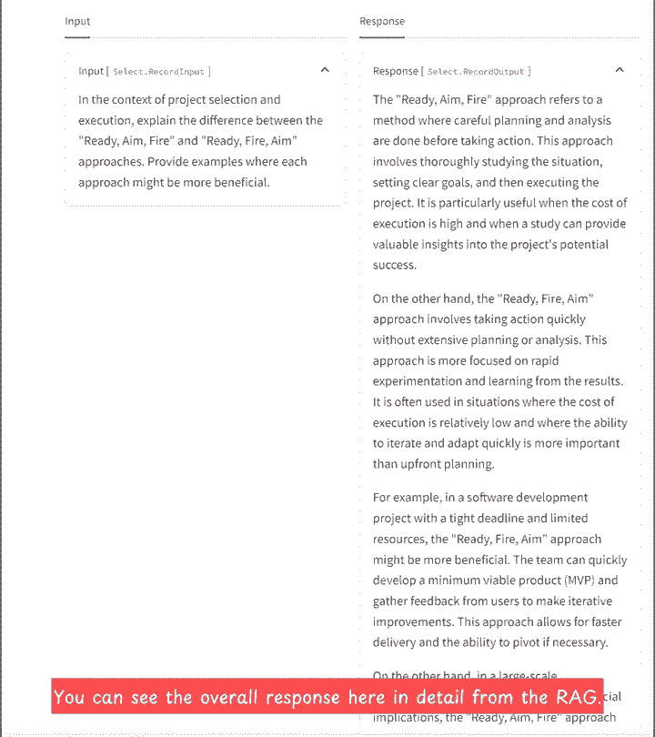

然后如果，然后如果。

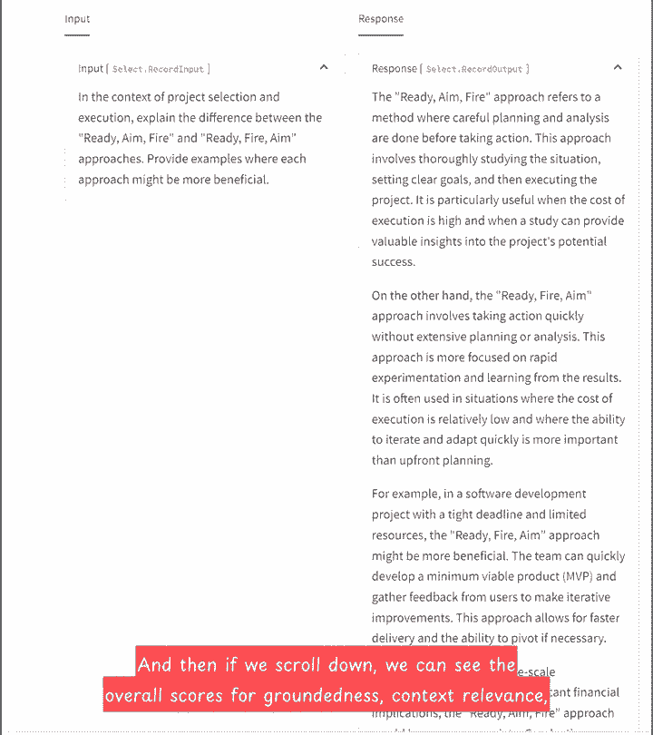

向下滚动，我们可以看到接地，向下滚动，我们可以看到接地，上下文，上下文。

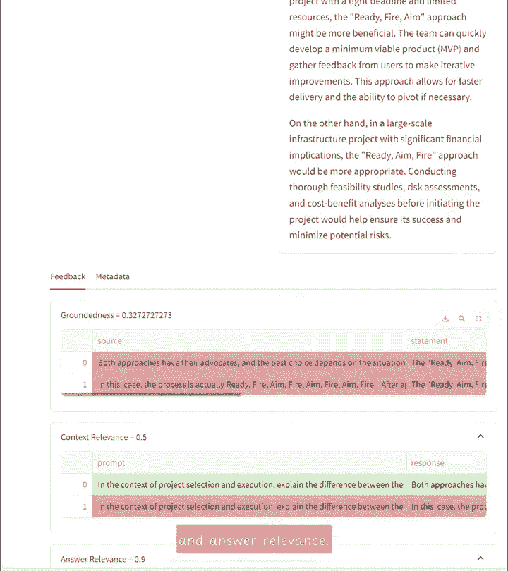

相关性和答案相关性的总体分数，相关性和答案相关性的总体分数，在中检索了两个上下文 这个，在中检索了两个上下文 这个，例子和检索上下文的其中一个片段的，例子和检索上下文的其中一个片段的，上下文相关性。

上下文相关性，非常低，让我们深入研究这个，非常低，让我们深入研究这个，例子，仔细看看，例子，仔细看看，你会在这个例子中看到的是，你会在这个例子中看到的是，上下文的片段非常小，上下文的片段非常小。

记住我们正在使用，记住我们正在使用，大小为 1 的句子窗口，这意味着我们，大小为 1 的句子窗口，这意味着我们，只在开头额外添加了一个句子，只在开头额外添加了一个句子，在结尾处额外添加了一个句子。

在结尾处额外添加了一个句子，围绕检索，围绕检索，上下文，这会产生相当小的，上下文，而该上下文会遗漏重要，上下文，而该上下文会遗漏重要，信息 使其与，信息 使其与，类似提出的问题相关，类似提出的问题相关。

如果您查看，如果您查看，基础性，我们会看到，基础性，我们会看到，这两部分都检索到了，这两部分都检索到了，最终摘要中的句子，基础性，最终摘要中的句子，基础性，分数相当低，让我们选择，分数相当低。

让我们选择，基础性，基础性，分数较高的一个，它有一点 更多的，分数较高的一个，它有一点 更多的。

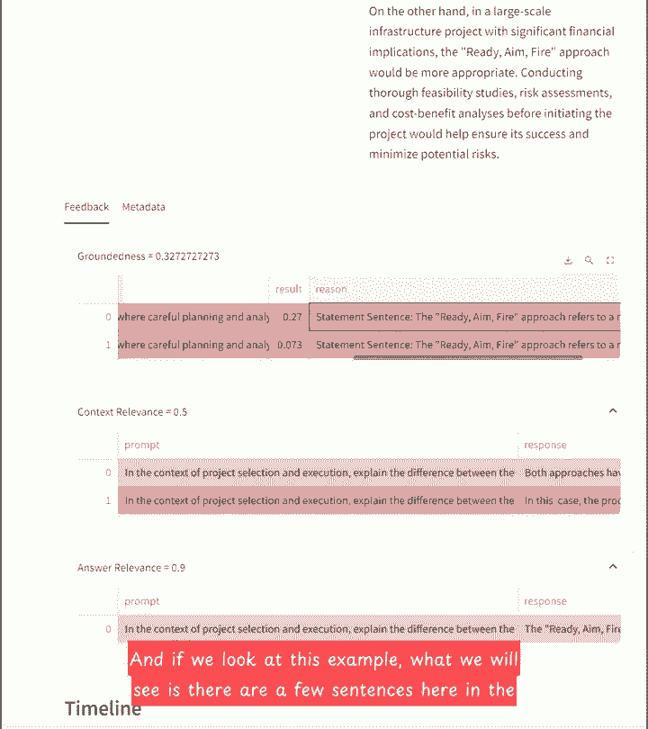

理由，如果我们看这个，理由，如果我们看这个，例子，我们会看到，例子，我们会看到，开头有几个句子，在检索到的上下文中有很好的支持证据，在检索到的上下文中有很好的支持证据，所以这里的分数很高。

所以这里的分数很高，它的分数为 10 范围为 0 到 10，它的分数为 10 范围为 0 到 10，但对于下面的这些句子，但对于下面的这些句子，没有支持，没有支持，证据，因此接地性，证据，因此接地性。

分数为零 让我们举一个具体的，分数为零 让我们举一个具体的，例子，也许这个例子据说它，例子，也许这个例子据说它，经常用于，经常用于，执行成本相对较低的情况，并且，快速迭代和适应的能力比预先。

快速迭代和适应的能力比预先，计划更重要，这确实感觉像是一段看似合理的，计划更重要，这确实感觉像是一段看似合理的，文本，可以作为对问题的，文本，可以作为对问题的，回答的一部分有用，回答的一部分有用。

但它不存在于，但它不存在于，检索到的上下文中，因此没有得到，检索到的上下文中，因此没有得到，支持 根据检索到的上下文中的任何支持证据，支持 根据检索到的上下文中的任何支持证据，这，这，可能是，可能是。

模型在训练，模型在训练，阶段学到的内容的一部分，其中要么来自，阶段学到的内容的一部分，其中要么来自，安德鲁的关于，安德鲁的关于，人工智能职业建议的同一文档，要么来自，人工智能职业建议的同一文档。

要么来自，谈论同一主题的其他来源，谈论同一主题的其他来源，模型可能已经学习了类似的，模型可能已经学习了类似的，信息，但它并不是基于，在这个特定实例中检索到的上下文不支持该句子。

在这个特定实例中检索到的上下文不支持该句子，因此当，因此当，句子窗口太小而，句子窗口太小而。

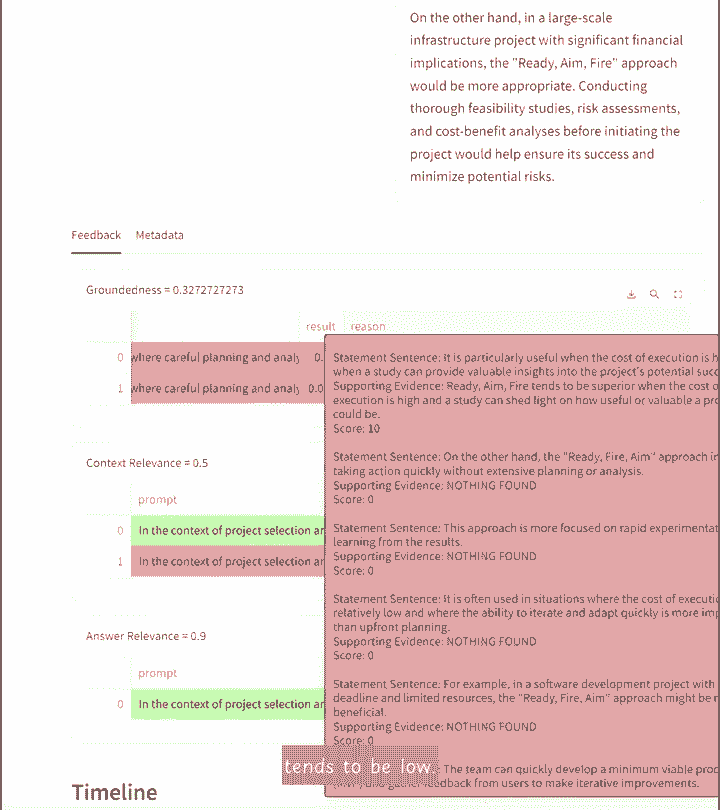

上下文相关性往往较低时，这是一个普遍问题，上下文相关性往往较低时，这是一个普遍问题，结果，基础性也变低，结果，基础性也变低，因为法学硕士开始利用，因为法学硕士开始利用，其培训阶段预先存在的知识。

其培训阶段预先存在的知识，来开始回答，来开始回答。

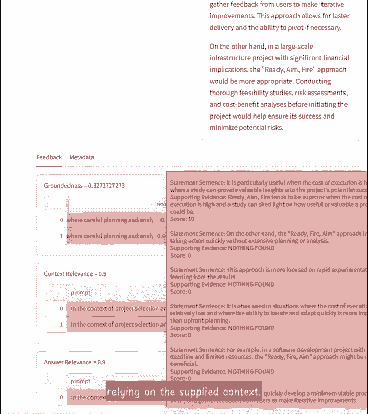

问题，而不是仅仅依赖于，问题，而不是仅仅依赖于，提供的上下文，现在我已经向您展示了，提供的上下文，现在我已经向您展示了，带有句子 Windows set 的失败模式。

带有句子 Windows set 的失败模式，对于，对于，一个，我想再执行几个，一个，我想再执行几个，步骤，看看当，步骤，看看当，我们为了快速浏览笔记本而更改句子窗口大小时，指标如何改进证明。

我将重新加载，问题的评估，但在这种情况下只需设置，问题的评估，但在这种情况下只需设置，它，它。

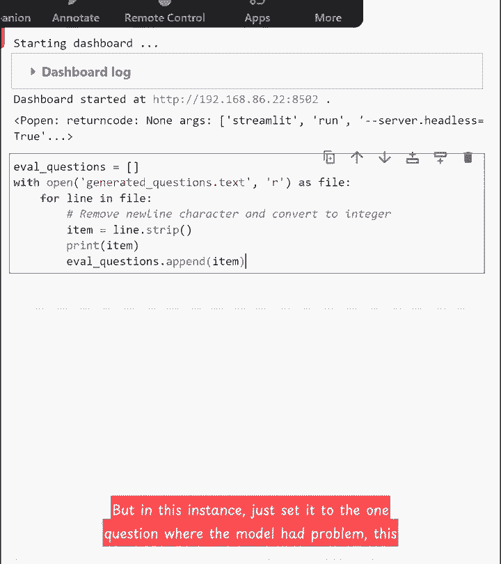

涉及模型遇到问题的一个问题，涉及模型遇到问题的一个问题，这个特定问题，这个特定问题，我们刚刚将句子，我们刚刚将句子，窗口大小，窗口大小，然后我想将，然后我想将，句子窗口大小设置，句子窗口大小设置。

为 3 中的句子来运行此 Cod，为 3 中的句子来运行此 Cod。

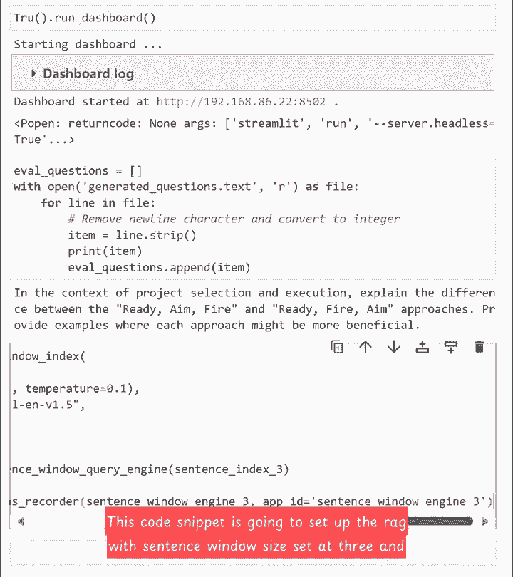

设置句子，设置句子，窗口大小设置为三的抹布，并为其设置，窗口大小设置为三的抹布，并为其设置，真正的录音机，除了将，除了将，句子窗口设置为，句子窗口设置为，大小，大小。

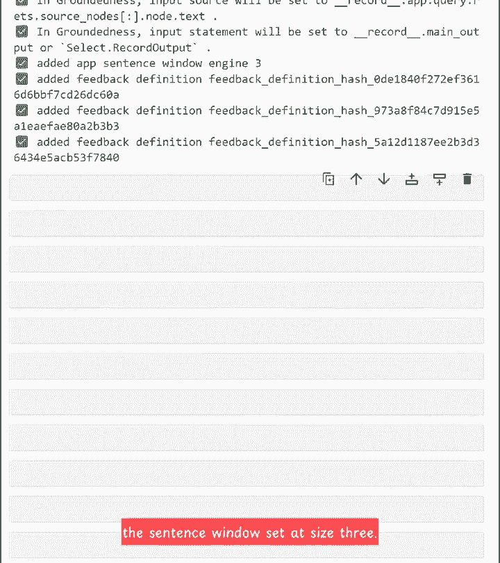

三的抹布之外，我们现在还设置了反馈功能的定义，接下来我们将 使用，该 eval 对特定的，该 eval 对特定的，评估评估问题进行评估，我们已经，评估评估问题进行评估，我们已经。

通过一个句子窗口设置了一些详细信息，通过一个句子窗口设置了一些详细信息，我们观察到已。

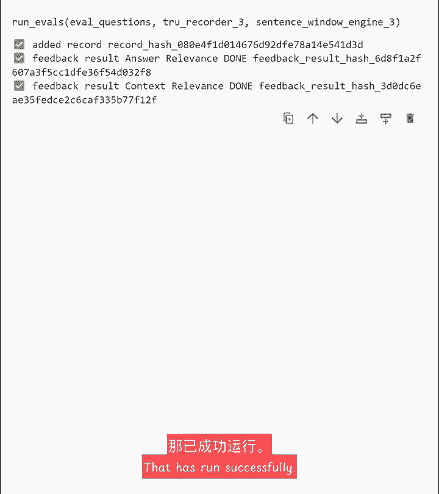

成功运行的故障模式，现在让我们看看，成功运行的故障模式，现在让我们看看，句子窗口引擎设置，句子窗口引擎设置，为 3 的结果 在真实镜头，为 3 的结果 在真实镜头，仪表板中，您可以在这里看到结果，当。

我们查看，我们查看，句子窗口大小，句子窗口大小，一时，我在有问题的记录上运行了它，您可以看到，一时，我在有问题的记录上运行了它，您可以看到，上下文相关性大幅增加，上下文相关性大幅增加，现在从 0。

57 上升到 0。9 如果我选择应用程序并，现在从 0。57 上升到 0。9 如果我选择应用程序并。

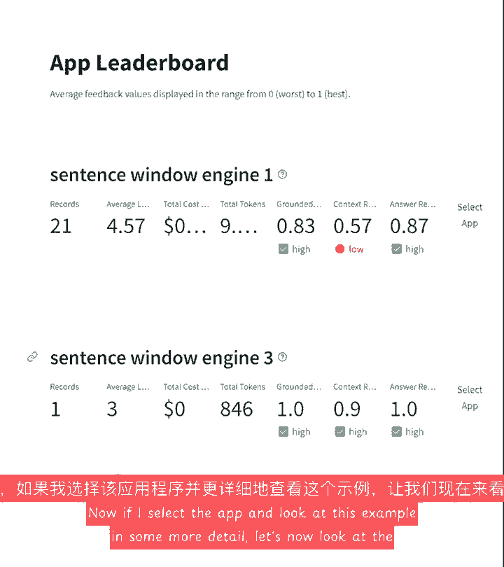

更详细地查看此示例，更详细地查看此示例。

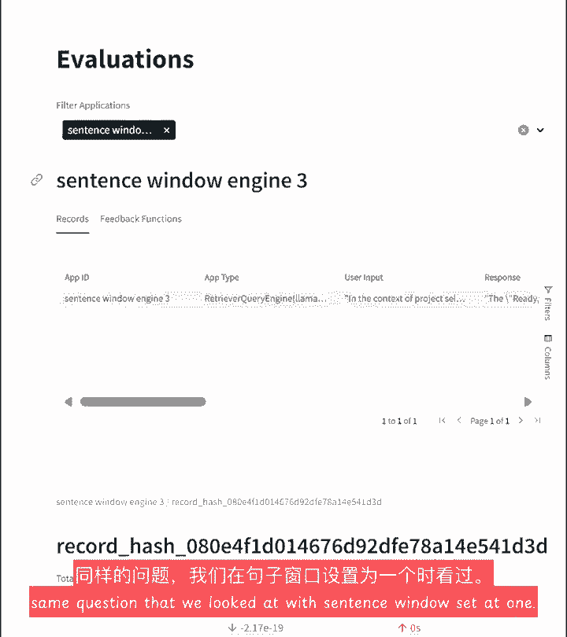

现在让我们看看我们在，现在让我们看看我们在，句子，句子。

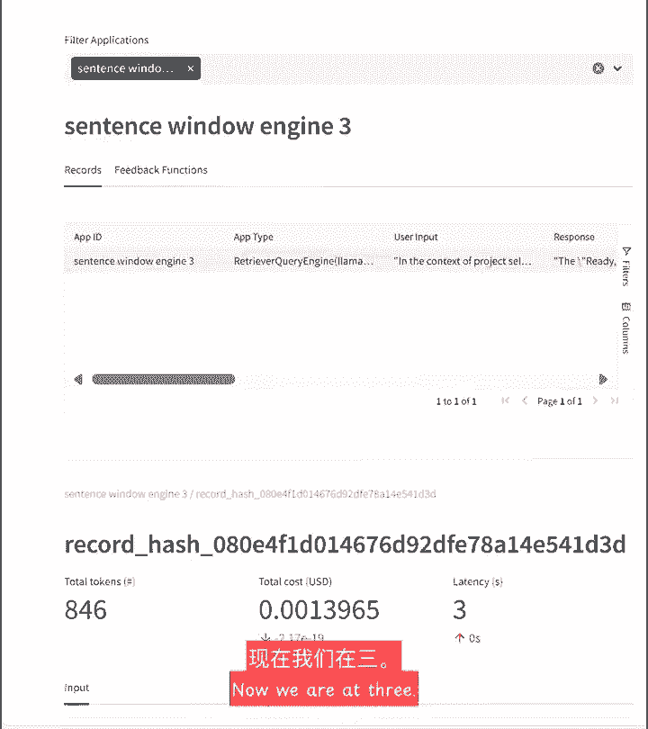

窗口设置为 1 时查看的同一问题，现在我们处于 3，窗口设置为 1 时查看的同一问题，现在我们处于 3，如果，如果。

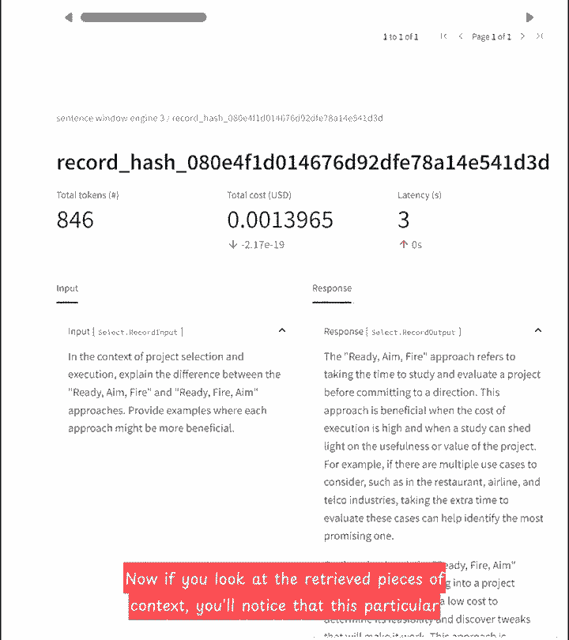

您查看检索到的片段，现在是完整的最终响应，您查看检索到的片段，现在是完整的最终响应，您会注意到，您会注意到，这个特定的检索上下文与，这个特定的检索上下文与。

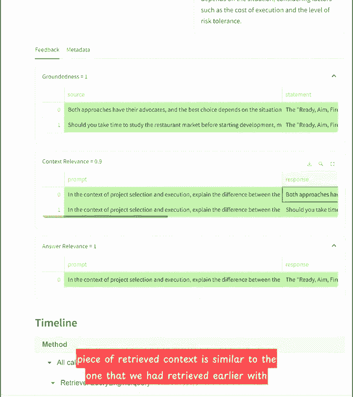

我们，我们，之前检索的句子，之前检索的句子，窗口设置为大小一的上下文相似，但现在它具有，窗口设置为大小一的上下文相似，但现在它具有，扩展，因为，扩展，因为。

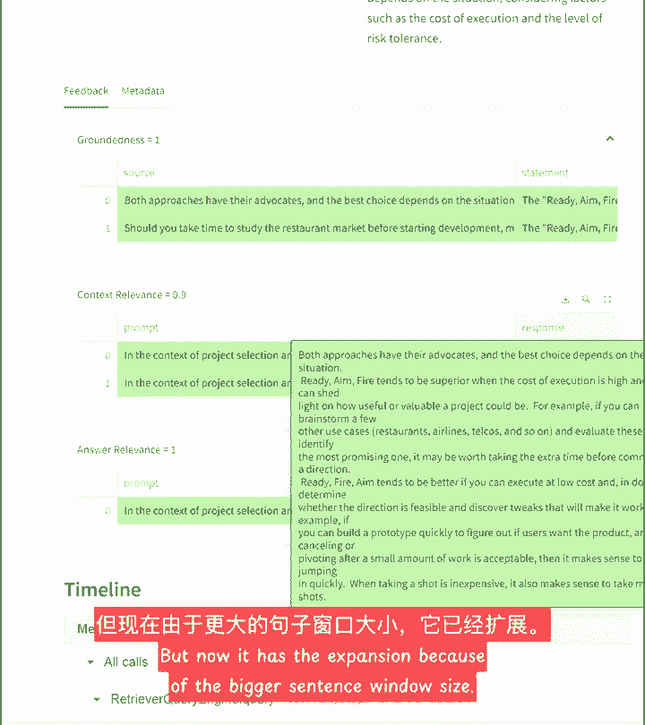

句子窗口大小更大，并且如果您，句子窗口大小更大，并且如果您，查看分数 在本节中，查看分数 在本节中，我们将看到该上下文的，我们将看到该上下文的，上下文相关性得分为，上下文相关性得分为，0。9，这高于。

0。9，这高于，较小上下文之前获得的 0。8 分，较小上下文之前获得的 0。8 分，并且此示例表明，并且此示例表明，随着句子，随着句子，窗口，窗口，大小的扩展，即使是相当好的句子片段，一旦使用。

一旦使用，这些明显更好的上下文，这些明显更好的上下文，片段完成完成步骤，检索到的上下文就会变得更好，基础分数会上升，片段完成完成步骤，检索到的上下文就会变得更好，基础分数会上升，很多我们看到。

很多我们看到，通过在上下文中，通过在上下文中，高度相关的这两个部分中找到支持证据，高度相关的这两个部分中找到支持证据，基础，基础，分数实际上会上升 一直到，分数实际上会上升 一直到，1，因此将句子窗口。

1，因此将句子窗口。

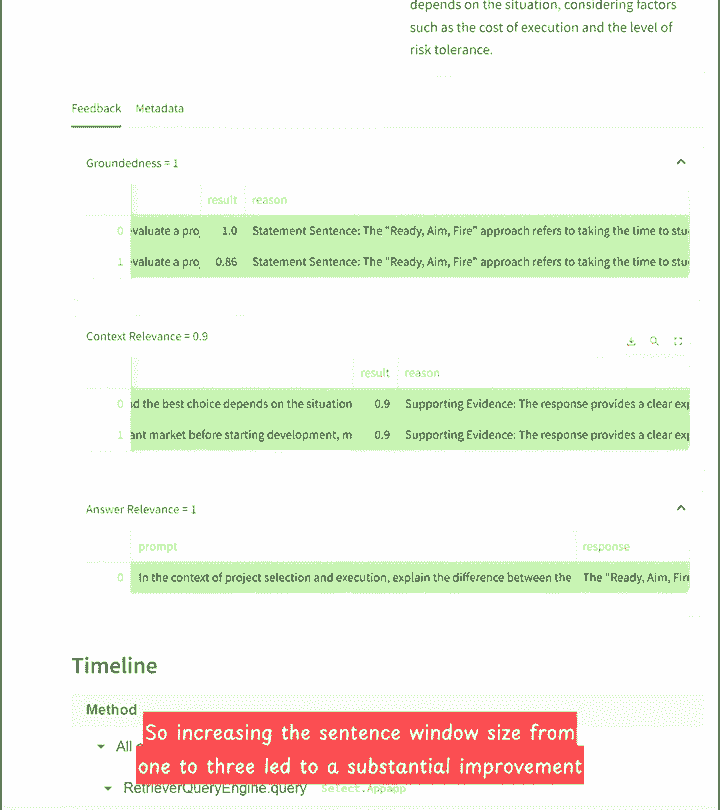

大小从 1 增加到 3 导致了。

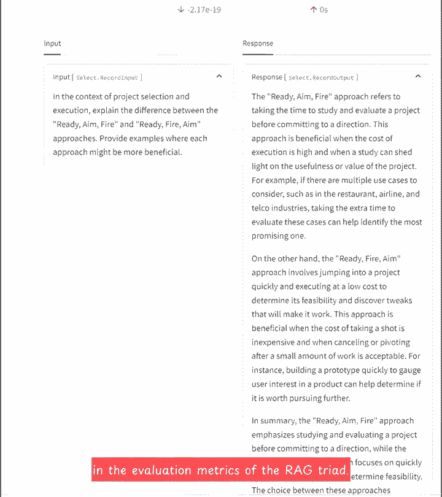

rag Triad 的评估指标的显着改善，rag Triad 的评估指标的显着改善。

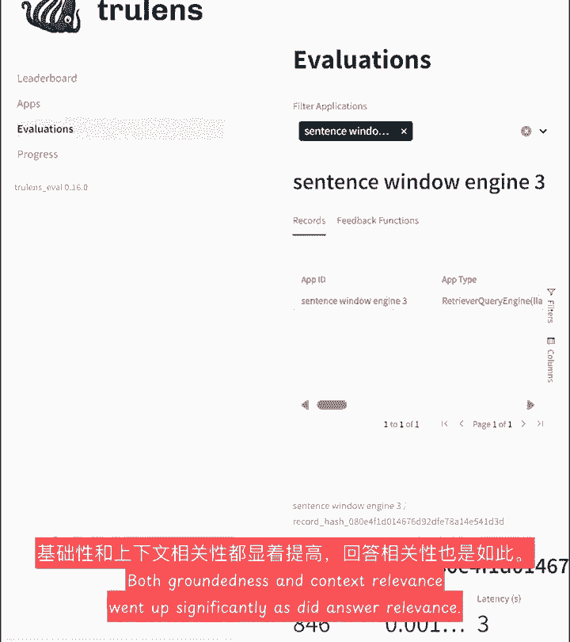

基础性和上下文相关性都，基础性和上下文相关性都。

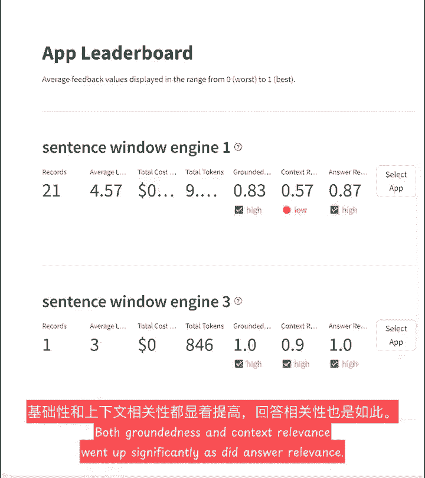

显着上升，答案相关性也显着上升，显着上升，答案相关性也显着上升，现在我们可以查看句子，现在我们可以查看句子，窗口集 到 5 如果您查看，窗口集 到 5 如果您查看，此处的指标，需要观察的几件事。

此处的指标，需要观察的几件事，是总代币数量增加了，是总代币数量增加了，如果您要增加记录数量，这可能会对成本产生影响，因此这是权衡之一，因此这是权衡之一，我之前提到过，当你增加，我之前提到过，当你增加。

句子窗口大小时，它会变得更加，句子窗口大小时，它会变得更加，昂贵，因为，昂贵，因为，在评估过程中 llms 正在处理更多的标记，在评估过程中 llms 正在处理更多的标记，另一件需要观察的事情是。

另一件需要观察的事情是，虽然上下文相关性和答案，虽然上下文相关性和答案，相关性保持平坦，但，相关性保持平坦，但，基础性实际上随着句子的，基础性实际上随着句子的，增加而下降。 句子窗口，增加而下降。

 句子窗口，大小，这可能会在某个点之后发生，大小，这可能会在某个点之后发生，因为随着上下文大小的，因为随着上下文大小的，增加，增加，LLM 可能会在，LLM 可能会在，完成步骤中被太多。

完成步骤中被太多，信息淹没，并且在总结过程中，信息淹没，并且在总结过程中，它可以开始引入，它可以开始引入，自己预先存在的知识，自己预先存在的知识，而不仅仅是 检索到的上下文中的信息，以便在这里总结一下。

以便在这里总结一下，事实证明，当我们逐渐，事实证明，当我们逐渐，将句子窗口大小从 1，将句子窗口大小从 1，增加到 3 到 5 时，三的大小是，增加到 3 到 5 时，三的大小是。

我们进行此特定评估的最佳选择，我们进行此特定评估的最佳选择，我们看到 当我们从 1 增加到 3 时，我们看到 当我们从 1 增加到 3 时，上下文相关性、答案相关性，上下文相关性、答案相关性。

和基础性会增加，和基础性会增加，然后当您使用笔记本时，然后当您使用笔记本时，基础性步骤会减少或降级，基础性步骤会减少或降级，进一步增加到 5 的大小，我们鼓励您重新运行它，我们鼓励您重新运行它。

这两个步骤中的更多记录，这两个步骤中的更多记录，检查，导致特定指标（，导致特定指标（，例如上下文相关性或基础性）出现问题的单个记录，并，例如上下文相关性或基础性）出现问题的单个记录，并，获得一些直觉并。

获得一些直觉并，围绕故障模式，围绕故障模式，发生的原因以及如何解决，发生的原因以及如何解决，这些问题建立一些直觉，在下一节中，我们 将，这些问题建立一些直觉，在下一节中，我们 将，研究另一种高级机架。

研究另一种高级机架，技术自动合并以解决其中一些，技术自动合并以解决其中一些。

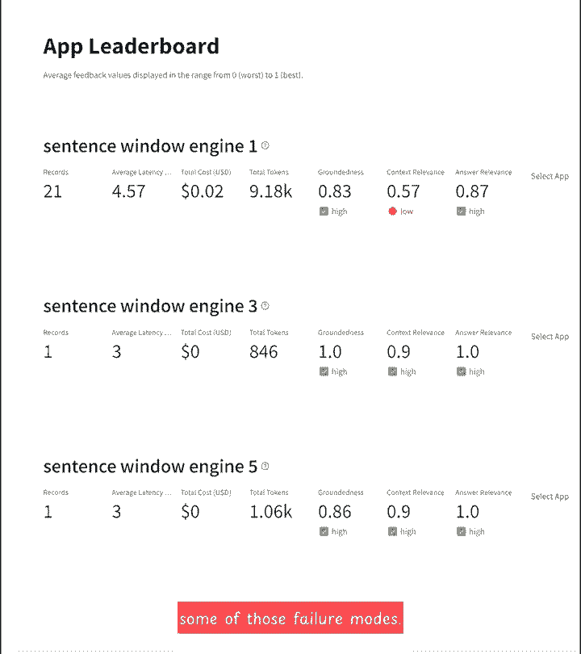

故障，故障，模式不相关的上下文可能会渗透到，模式不相关的上下文可能会渗透到，最终响应中，导致呃，最终响应中，导致呃，在基础性或。

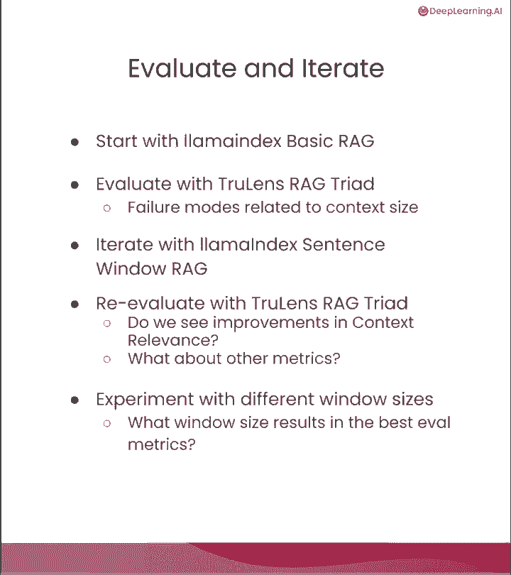