# (超爽中英!) 2024吴恩达最好的【构建高级RAG应用】可商用落地教程！附全套代码_LLM_Langchain_Llama - P5：5. 第四篇 - 自动合并检索(Auto-merging Retrieval) 中英文字幕 - 吴恩达大模型 - BV1hMameREN3

在本课中，我们将深入研究，在本课中，我们将深入研究。

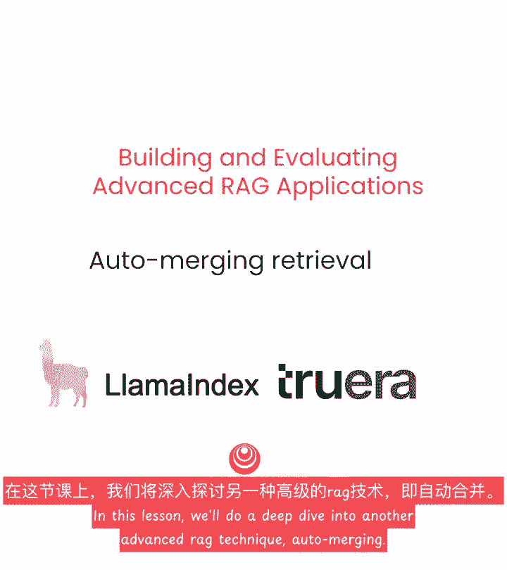

另一种高级碎布技术自动，另一种高级碎布技术自动，天真的方法的一个问题是，天真的方法的一个问题是，您正在检索一堆碎片，您正在检索一堆碎片，上下文块以放入 llm，上下文块以放入 llm，上下文菜单中。

并且，上下文菜单中，并且，块越小，碎片就越严重 在这里，块越小，碎片就越严重 在这里，我们使用自动合并拳头将，我们使用自动合并拳头将，较小的块合并到较大的父，较小的块合并到较大的父，块中。

以帮助确保更连贯的，块中，以帮助确保更连贯的，上下文让我们看看如何设置它，上下文让我们看看如何设置它，在本节中我们将讨论自动，在本节中我们将讨论自动，合并检索初始与，合并检索初始与。

标准拖动管道是 您正在，标准拖动管道是 您正在，检索，检索，放入 LM 联系人窗口中的一堆零散的联系人数据块，放入 LM 联系人窗口中的一堆零散的联系人数据块，并且，并且，您的块 SI 越小。

碎片就越严重。例如，您，您的块 SI 越小，碎片就越严重。例如，您，可能会在大致相同的部分中返回两个或更多检索到的，可能会在大致相同的部分中返回两个或更多检索到的，联系人中继，联系人中继。

但实际上并不能，但实际上并不能，保证 这些块的排序，保证 这些块的排序，可能会潜在地妨碍，可能会潜在地妨碍，Alum，Alum。

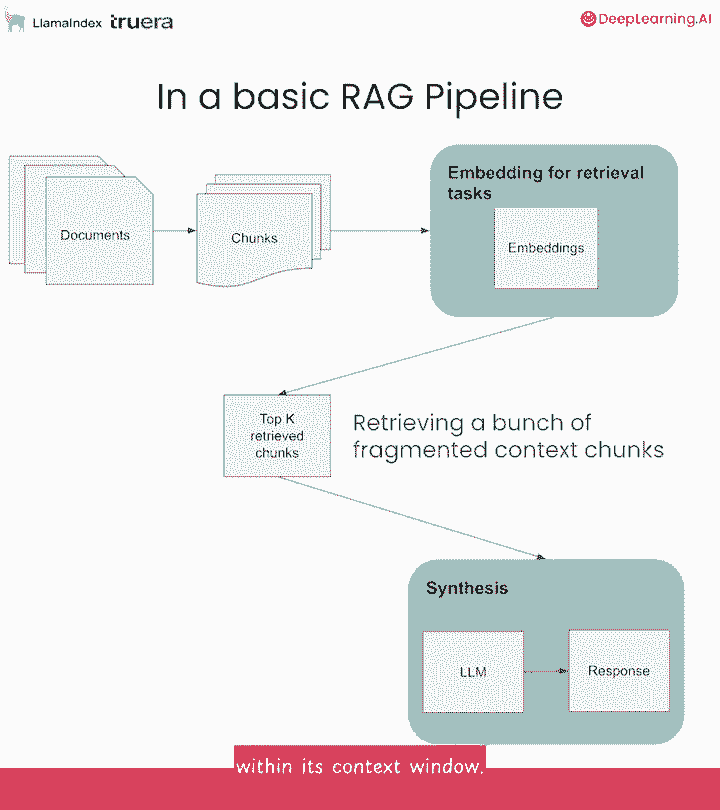

在其上下文窗口内综合此检索上下文的能力，在其上下文窗口内综合此检索上下文的能力，因此自动合并检索，因此自动合并检索，首先执行以下操作：定义，首先执行以下操作：定义，链接到较大父干线的较小块的层次结构。

其中，链接到较大父干线的较小块的层次结构，其中，每个父，每个父，干线可以有一些编号，干线可以有一些编号，在检索期间，如果，在检索期间，如果，链接到，链接到，父块的较小块的集合超过某个百分比。

父块的较小块的集合超过某个百分比，阈值，那么我们将较小的块合并，阈值，那么我们将较小的块合并，到较大的父块中，因此我们，到较大的父块中，因此我们，检索较大的父块，检索较大的父块，以帮助确保更连贯的。

以帮助确保更连贯的。

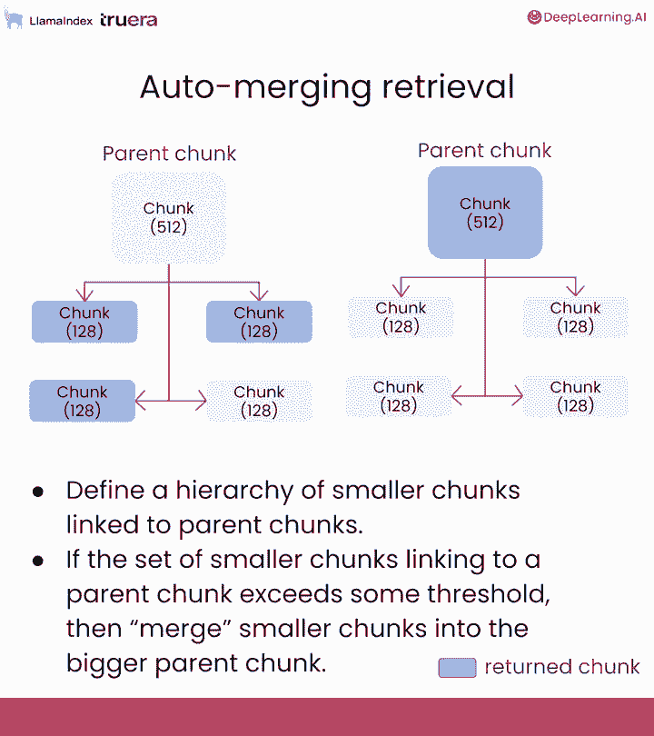

上下文，现在让我们看看如何，上下文，现在让我们看看如何，设置此笔记本将介绍，设置此笔记本将介绍，构建具有，构建具有，llama 索引的自动合并检索器所需的各种组件。

llama 索引的自动合并检索器所需的各种组件，将详细介绍各种组件，将详细介绍各种组件，并且与，并且与，上一节类似，最后将向，上一节类似，最后将向，您展示如何使用，您展示如何使用。

Trier 进行参数实验和评估，Trier 进行参数实验和评估，与之前类似，我们将加载开放的，与之前类似，我们将加载开放的，API 密钥，我们将使用，API 密钥，我们将使用。

utils 文件中的便利辅助函数加载它，utils 文件中的便利辅助函数加载它，就像之前的课程一样，我们还将，就像之前的课程一样，我们还将，使用如何在 AI PDF 中建立职业生涯。

使用如何在 AI PDF 中建立职业生涯，就像之前一样 还鼓励您，就像之前一样 还鼓励您。

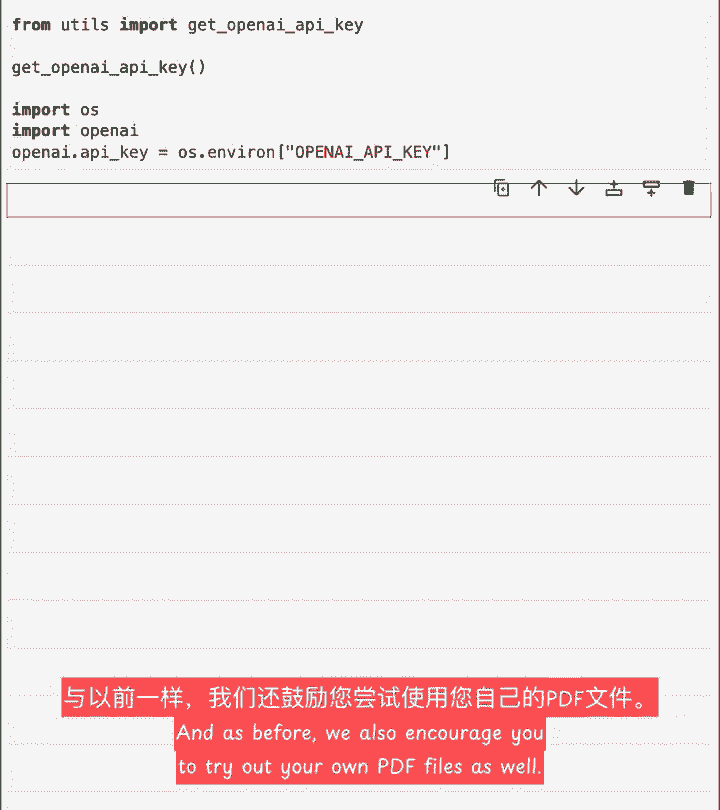

尝试自己的 PDF 文件，我们，尝试自己的 PDF 文件，我们，加载 41 个文档对象，并将，加载 41 个文档对象，并将，它们合并到一个大文档中，它们合并到一个大文档中，这使得它更适合使用。

这使得它更适合使用。

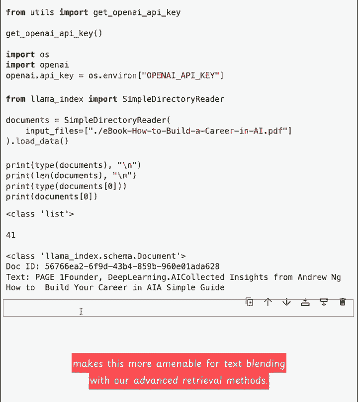

方法进行文本编辑，现在我们已准备好设置 我们的，方法进行文本编辑，现在我们已准备好设置 我们的，自动合并，自动合并，检索器将由几个，检索器将由几个，不同的组件组成，第一步，不同的组件组成，第一步。

是定义我们所说的分层，是定义我们所说的分层，节点，节点，解析器，为了使用自动 Virg，解析器，为了使用自动 Virg，检索器，我们需要以分层方式解析节点，检索器，我们需要以分层方式解析节点，这意味着。

这意味着，节点是 以递减的，节点是 以递减的，大小进行解析并包含与其父节点的关系，大小进行解析并包含与其父节点的关系。

在这里，我们通过，在这里，我们通过，一个小示例演示了节点解析器如何工作，一个小示例演示了节点解析器如何工作，我们创建了一个具有小块大小的玩具解析器，我们创建了一个具有小块大小的玩具解析器，来演示注意。

来演示注意，我们使用的块大小是 248 512 和，我们使用的块大小是 248 512 和，128 您可以更改 块大小为，128 您可以更改 块大小为，您想要的任何递减顺序，您想要的任何递减顺序。

我们现在做，我们现在做，四倍现在让我们从文档中获取节点集，四倍现在让我们从文档中获取节点集，这实际上，这实际上，返回所有节点，这返回所有叶，返回所有节点，这返回所有叶，节点中间节点以及。

节点中间节点以及，父节点，因此，如果我们只想检索叶节点，那么叶中间节点和父节点之间会有相当多的信息内容重叠，如果我们只想检索叶节点，那么叶中间节点和父节点之间会有相当多的信息内容重叠，我们可以。

我们可以，在 llama 索引中调用一个，在 llama 索引中调用一个，称为间隙叶节点的函数，我们可以看，称为间隙叶节点的函数，我们可以看。

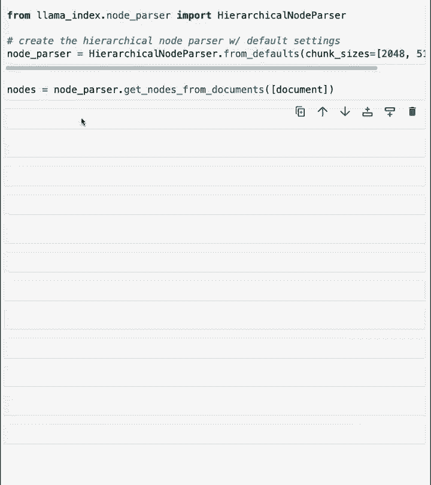

在这个例子中，我们，在这个例子中，我们，在原始节点集上调用 Gat Leaf 节点，我们，在原始节点集上调用 Gat Leaf 节点，我们，看一下第 31 个节点来查看，看一下第 31 个节点来查看。

文本，我们看到文本块，文本，我们看到文本块，实际上相当小，这是一个，实际上相当小，这是一个，示例 叶节点，因为叶，示例 叶节点，因为叶，节点是 128 个标记的最小块大小。

节点是 128 个标记的最小块大小，这是您可以如何，这是您可以如何，加强数学背景，以，加强数学背景，以，找出需要了解的重要内容等等，找出需要了解的重要内容等等，现在我们已经展示了叶节点的样子。

现在我们已经展示了叶节点的样子，我们还可以探索其中的，我们还可以探索其中的，关系 我们可以打印，关系 我们可以打印，上述节点的父节点，并观察到它是一个，上述节点的父节点，并观察到它是一个，包含，包含。

叶节点税的更大块，但更，叶节点税的更大块，但更，具体地说，Paran 节点，具体地说，Paran 节点，包含 512 个令牌，而四个，包含 512 个令牌，而四个。

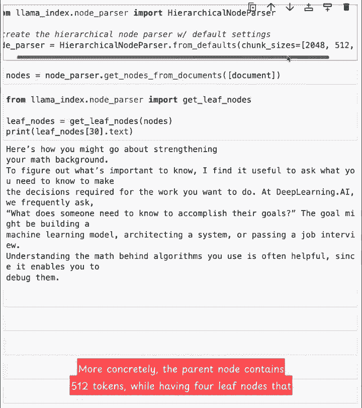

叶节点包含 128 个令牌，因此，叶节点包含 128 个令牌，因此，有四个叶节点，因为呃，每次块大小除以四，这是，每次块大小除以四，这是，第 31 个叶节点的父节点的示例，现在我们已经向您展示了。

现在我们已经向您展示了，节点层次结构的样子，我们现在可以，节点层次结构的样子，我们现在可以，构建，构建，我们将使用的索引 openi lln，我们将使用的索引 openi lln，Turbo。

我们还将定义一个，Turbo，我们还将定义一个，包含 Ln，包含 Ln，嵌入模型和，嵌入模型和，解析器层次结构的服务上下文对象，与之前的笔记本一样，解析器层次结构的服务上下文对象，与之前的笔记本一样。

我们将使用 BG 小 n andic 模型，我们将使用 BG 小 n andic 模型，下一步是构建或，下一步是构建或，索引 索引的工作方式是，我们，索引 索引的工作方式是，我们。

实际上在特定的叶节点上构造一个向量索引，实际上在特定的叶节点上构造一个向量索引，所有其他，所有其他，中间节点和父节点都存储，中间节点和父节点都存储，在停靠存储中，并在，在停靠存储中，并在。

检索期间动态检索，但我们，检索期间动态检索，但我们，在初始 topk，在初始 topk，嵌入查找期间实际获取的内容是特定的，嵌入查找期间实际获取的内容是特定的。

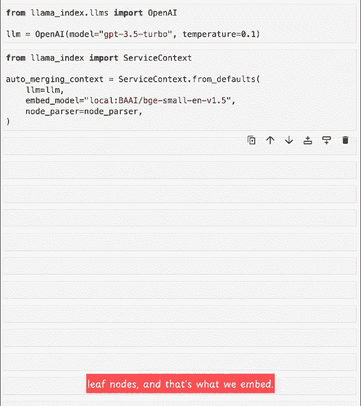

叶节点，这就是我们嵌入的，叶节点，这就是我们嵌入的，代码，您可以在代码中看到，我们定义一个，代码，您可以在代码中看到，我们定义一个，存储联系人对象，默认情况下，存储联系人对象，默认情况下，使用内存。

使用内存，文档存储初始化该对象，我们将其称为存储联系人 ind。文档存储初始化该对象，我们将其称为存储联系人 ind。做商店。 添加文档以将所有节点添加，做商店。 添加文档以将所有节点添加。

到此内存文档存储中，但是当，到此内存文档存储中，但是当，我们在此处创建称为，我们在此处创建称为，自动合并索引的向量存储索引时，我们仅，自动合并索引的向量存储索引时，我们仅，传入向量索引的叶节点。

传入向量索引的叶节点，这意味着，这意味着，具体的叶节点是，具体的叶节点是，使用嵌入模型嵌入的，并且 也已，使用嵌入模型嵌入的，并且 也已，索引，但我们还传入存储，索引，但我们还传入存储。

上下文以及服务上下文，上下文以及服务上下文，因此向量索引确实，因此向量索引确实，了解包含所有节点的底层文档存储，了解包含所有节点的底层文档存储。

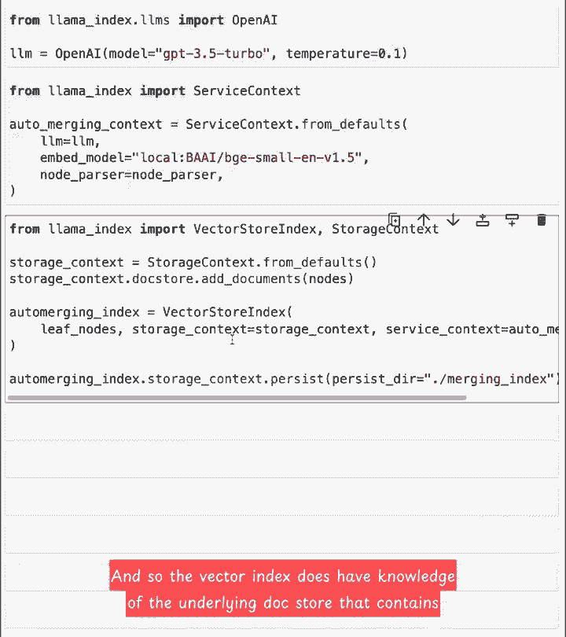

最后，最后，如果您已经，如果您已经，构建了此索引并且您已经构建了此索引，那么我们将保留此索引 想要，构建了此索引并且您已经构建了此索引，那么我们将保留此索引 想要，从存储加载它，您可以复制并粘贴。

从存储加载它，您可以复制并粘贴，此代码块，此代码块。

如果索引不存在，它将重建索引，或者，如果索引不存在，它将重建索引，或者，从存储加载它，现在，从存储加载它，现在，我们已经定义了自动合并索引，最后一步是，我们已经定义了自动合并索引，最后一步是。

设置 检索器并运行，设置 检索器并运行，查询引擎自动合并检索器，查询引擎自动合并检索器，控制合并逻辑，如果为给定父级，控制合并逻辑，如果为给定父级，检索到大多数子节点，则将它们，检索到大多数子节点。

则将它们，交换，交换，为父级，而不是为了使此，为父级，而不是为了使此，合并正常工作，我们设置一个大顶部，合并正常工作，我们设置一个大顶部，k 代表叶节点，记住，k 代表叶节点，记住。

叶节点也有一个较小的块，叶节点也有一个较小的块，大小 128，为了减少令牌，大小 128，为了减少令牌，使用，我们在合并发生后应用排序器，使用，我们在合并发生后应用排序器，例如我们，例如我们。

可能检索前 12 个合并并获得，可能检索前 12 个合并并获得，前 10 个，然后 重新排名到前六名，前 10 个，然后 重新排名到前六名，排名器的顶端可能看起来，排名器的顶端可能看起来，更大。

但请记住，基本块，更大，但请记住，基本块。

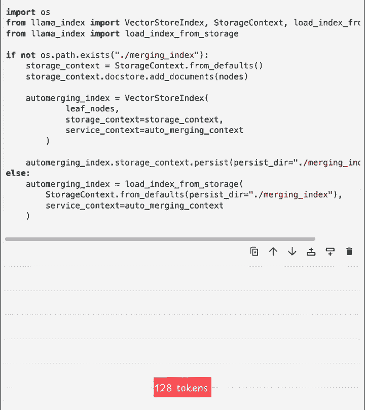

大小只有 128 个标记，然后，大小只有 128 个标记，然后，上面的下一个父级是 512 个标记，我们，上面的下一个父级是 512 个标记，我们，导入一个名为“自动合并，导入一个名为“自动合并。

检索器”的类，然后定义一个句子，检索器”的类，然后定义一个句子，Transformer 排名模块 我们将，Transformer 排名模块 我们将，自动合并检索器和排名，自动合并检索器和排名。

模块合并到我们的检索器查询工程中，模块合并到我们的检索器查询工程中。

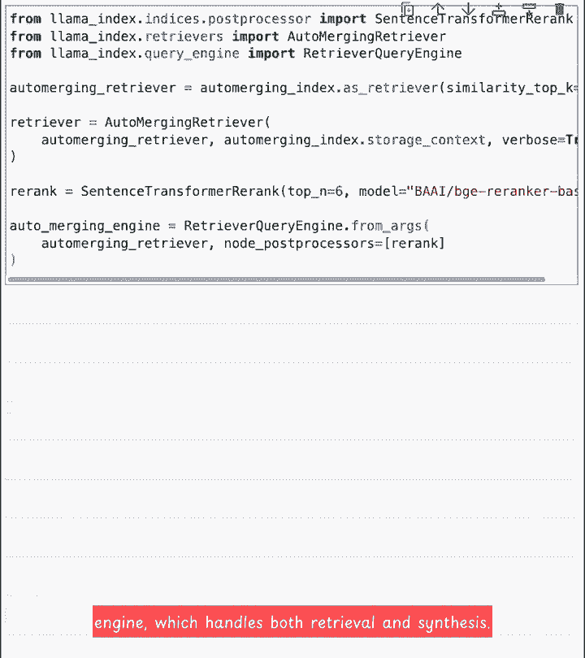

它处理检索和，它处理检索和，合成现在我们已经将整个，合成现在我们已经将整个，事情端到端地设置好了，让我们实际测试一下。

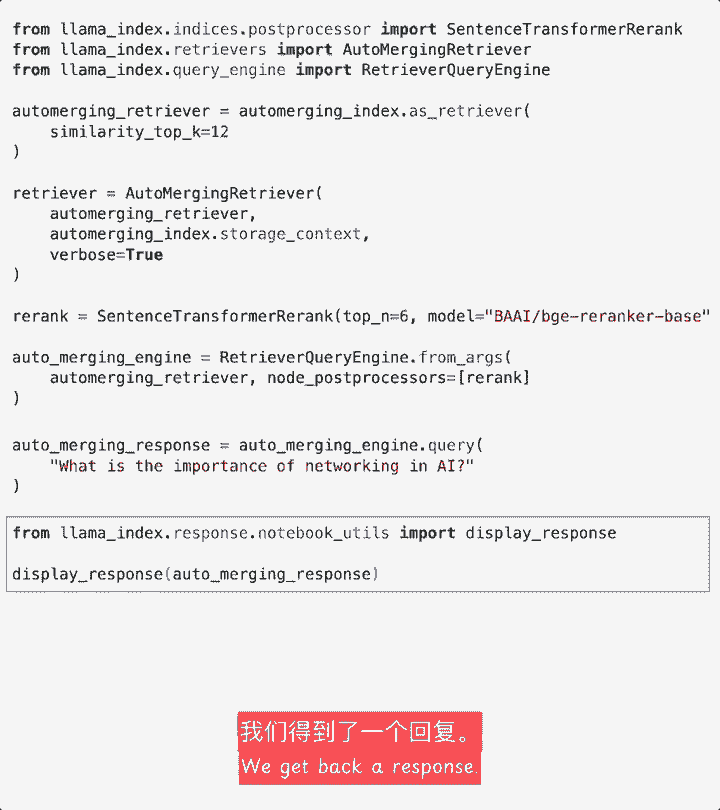

人工智能中网络作为一个 示例问题我们得到，人工智能中网络作为一个 示例问题我们得到，回复，我们看到它说网络，回复，我们看到它说网络，在人工智能中很重要，因为它允许，在人工智能中很重要，因为它允许。

个人建立强大的，个人建立强大的，专业网络，专业网络。

下一步是将它们放在一起，我们，下一步是将它们放在一起，我们，创建两个高级函数来构建自动，创建两个高级函数来构建自动，合并索引 作为 get autom，合并索引 作为 get autom。

merging 查询引擎，这基本上，merging 查询引擎，这基本上，捕获了我们刚刚，捕获了我们刚刚，在第一个函数构建，在第一个函数构建，自动合并索引中向您展示的所有步骤，我们将使用。

自动合并索引中向您展示的所有步骤，我们将使用，层次结构节点解析器来解析，层次结构节点解析器来解析。

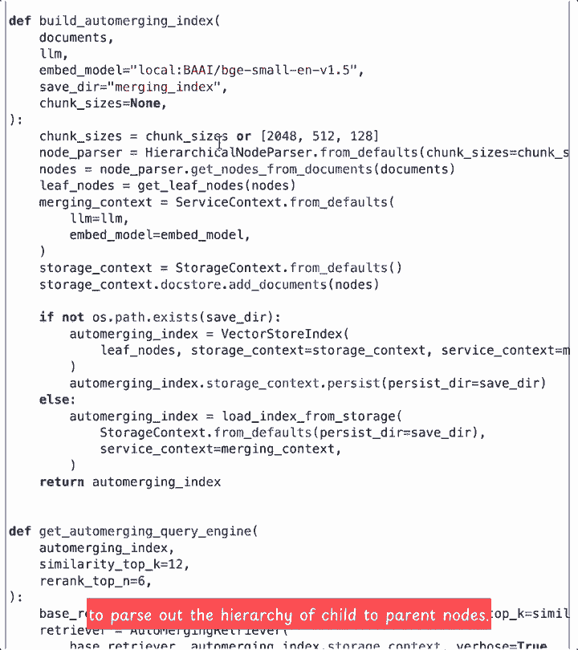

子节点到父节点的层次结构，我们将，子节点到父节点的层次结构，我们将，定义服务 上下文，我们，定义服务 上下文，我们，将从叶节点创建一个向量存储索引，将从叶节点创建一个向量存储索引，同时链接到。

同时链接到，所有节点的文档存储，所有节点的文档存储，第二个函数 get 自动，第二个函数 get 自动，合并查询引擎利用我们的自动，合并查询引擎利用我们的自动，合并检索器，它能够，合并检索器，它能够。

动态地将叶节点合并到父，动态地将叶节点合并到父，节点中，并且 还使用我们的 vack 模块，节点中，并且 还使用我们的 vack 模块，然后将其与整体，然后将其与整体，检索器查询，检索器查询。

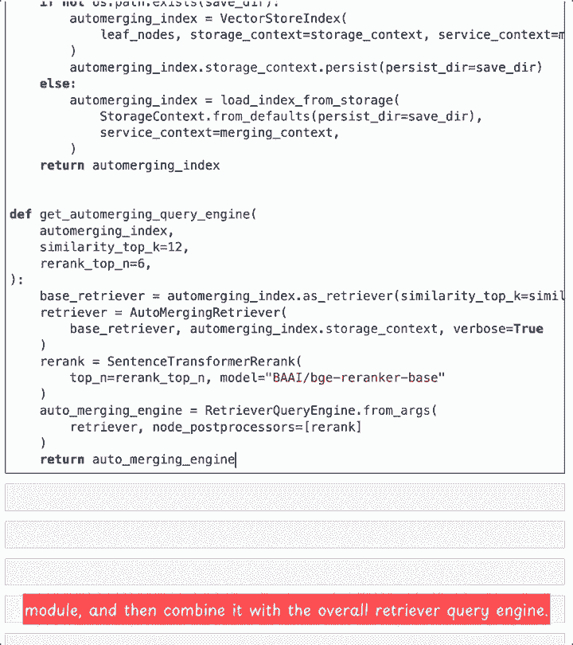

andine 结合起来，以便我们，andine 结合起来，以便我们，使用，使用，原始源文档的构建自动合并索引功能构建索引，LM 设置，原始源文档的构建自动合并索引功能构建索引，LM 设置。

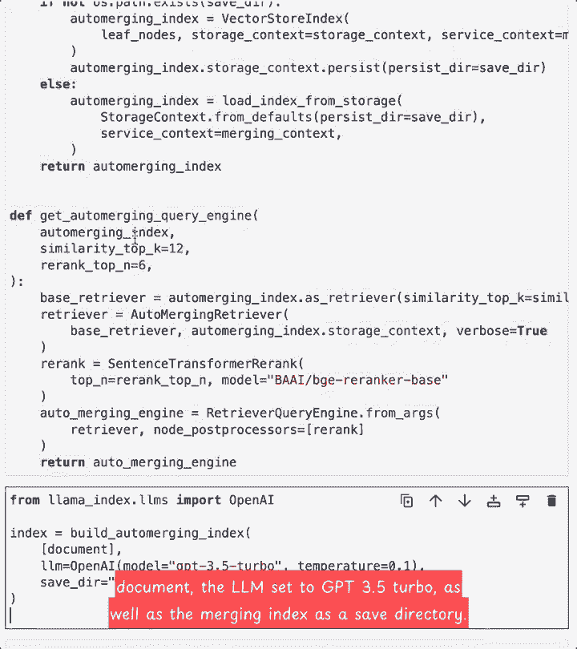

为 GPT 3。5 Turbo 以及合并，为 GPT 3。5 Turbo 以及合并，索引作为保存，索引作为保存，目录， 然后对于查询引擎，目录， 然后对于查询引擎。

我们基于索引调用 Gap 自动合并查询引擎，我们基于索引调用 Gap 自动合并查询引擎，并将，并将，相似度最高 K 设置为等于 6，作为，相似度最高 K 设置为等于 6，作为，下一步。

onom 将向您展示如何，下一步，onom 将向您展示如何，评估自动合并检索器，并，评估自动合并检索器，并，使用迭代参数，使用迭代参数，triar 我们鼓励您，triar 我们鼓励您，也尝试自己的问题。

并迭代，也尝试自己的问题，并迭代，自动合并，自动合并，检索的参数，例如，当，检索的参数，例如，当，您更改块大小或，您更改块大小或，排名器的前 K 或顶端时会发生什么，排名器的前 K 或顶端时会发生什么。

并告诉我们 结果，并告诉我们 结果。

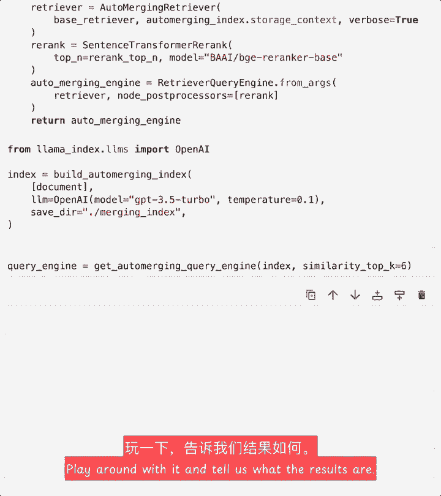

是什么，太棒了，Jerry 现在您已经，是什么，太棒了，Jerry 现在您已经，设置了自动合并检索器，设置了自动合并检索器，让我们看看如何使用，让我们看看如何使用，rag Triad 对其进行评估，并。

rag Triad 对其进行评估，并，通过实验跟踪将其性能与基本 rag 进行比较，通过实验跟踪将其性能与基本 rag 进行比较，让我们设置这个自动合并，让我们设置这个自动合并，新，新。

索引 值得注意的是，它是，索引 值得注意的是，它是，两层，最低层块的叶，两层，最低层块的叶，节点的块大小为，节点的块大小为，512，层次结构中的下一层的，512，层次结构中的下一层的。

块大小为 2048，这，块大小为 2048，这，意味着每个父节点将有四个，意味着每个父节点将有四个，叶节点，彼此有 512 个令牌，叶节点，彼此有 512 个令牌，设置的部分，设置的部分。

与 Jerry 之前向您展示的完全相同，与 Jerry 之前向您展示的完全相同，您可能想要，您可能想要，尝试两层自动，尝试两层自动，合并结构的一个原因是它更，合并结构的一个原因是它更，简单，创建，简单。

创建，索引以及检索，索引以及检索，步骤所需的工作量更少 需要的工作较少，因为，步骤所需的工作量更少 需要的工作较少，因为，如果它性能相当好，所有第三层检查都会消失，那么理想情况下，我们希望使用。

那么理想情况下，我们希望使用，更简单的，更简单的，结构，现在我们已经使用，结构，现在我们已经使用，这两层自动合并，这两层自动合并，[音乐]，[音乐]，结构创建了索引，让我们设置自动合并，结构创建了索引。

让我们设置自动合并，对于此，对于此，设置的引擎，我将前 k 保持为，设置的引擎，我将前 k 保持为，与之前相同的值，即，与之前相同的值，即，12，并且重新排名步骤也将具有，12。

并且重新排名步骤也将具有，相同的 n 等于 6，这将使我们在此应用程序设置之间进行，相同的 n 等于 6，这将使我们在此应用程序设置之间进行，更直接的直接，更直接的直接，比较，比较。

以及 Jerry 之前设置的三层，以及 Jerry 之前设置的三层，自动合并层次结构应用程序，现在让我们，现在让我们，使用此自动合并引擎设置真正的记录器，使用此自动合并引擎设置真正的记录器。

我们将为其提供，我们将为其提供。

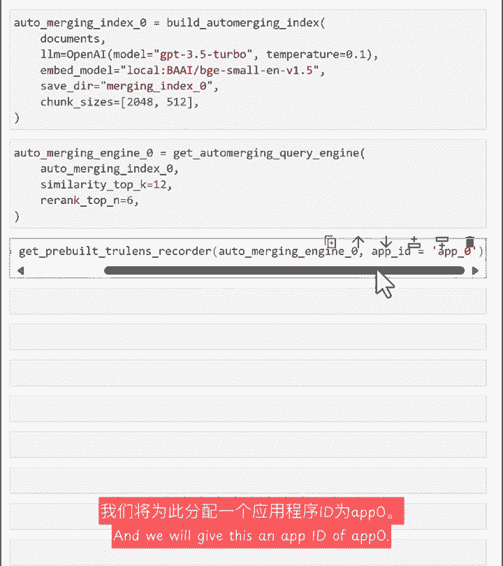

应用程序，应用程序，从生成的问题中加载一些问题以进行评估。从生成的问题中加载一些问题以进行评估。现在我们可以为，val 问题中的每个问题定义这些评估问题的运行。

val 问题中的每个问题定义这些评估问题的运行，我们将进行设置，我们将进行设置，以便使用 RS 调用时真正的记录器对象，以便使用 RS 调用时真正的记录器对象，将记录，将记录，提示，提示，响应和。

响应和。

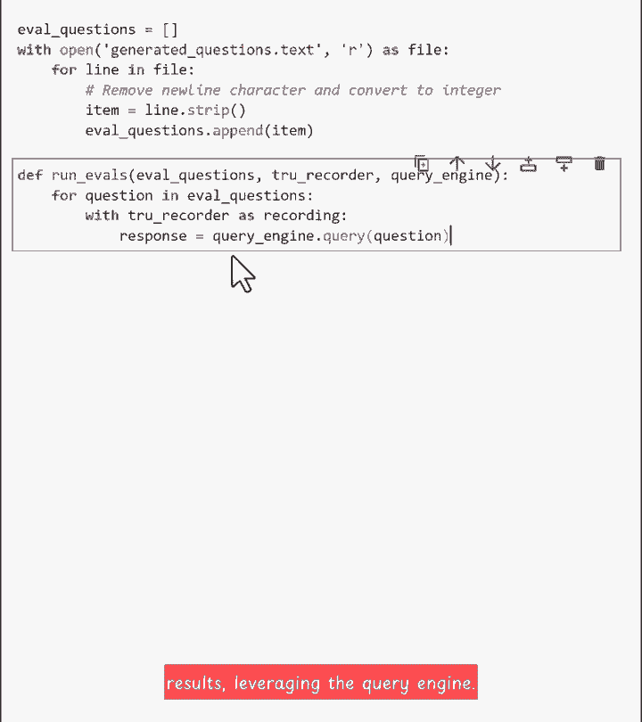

利用查询，利用查询，引擎的评估结果现在我们的评估已经，引擎的评估结果现在我们的评估已经。

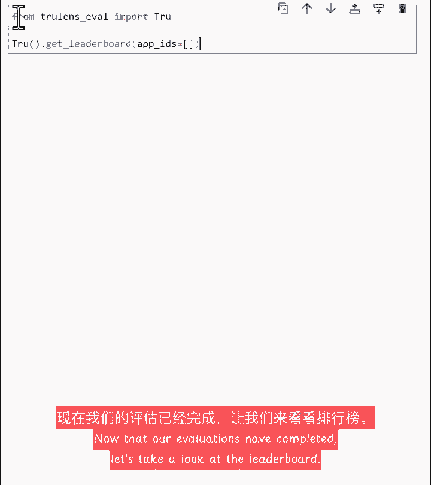

完成，让我们看一下，完成，让我们看一下，排行榜，我们可以看到 AB，排行榜，我们可以看到 AB，零矩阵这里的上下文相关性似乎，零矩阵这里的上下文相关性似乎，很低，其他两个指标更好，很低。

其他两个指标更好，这是我们以，这是我们以，512 作为叶子的两级层次结构 节点块大小和，512 作为叶子的两级层次结构 节点块大小和，父节点为 248 个令牌，因此，父节点为 248 个令牌，因此。

每个父，每个父，节点有四个叶注释现在我们可以运行真正的，节点有四个叶注释现在我们可以运行真正的，仪表板并查看下一层。

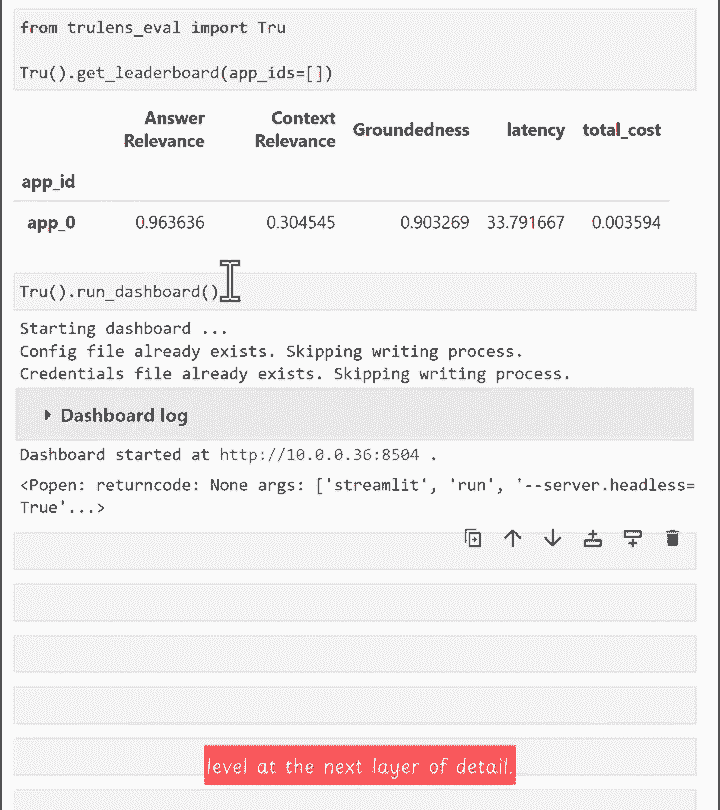

详细信息的记录级别的评估结果让我们，详细信息的记录级别的评估结果让我们。

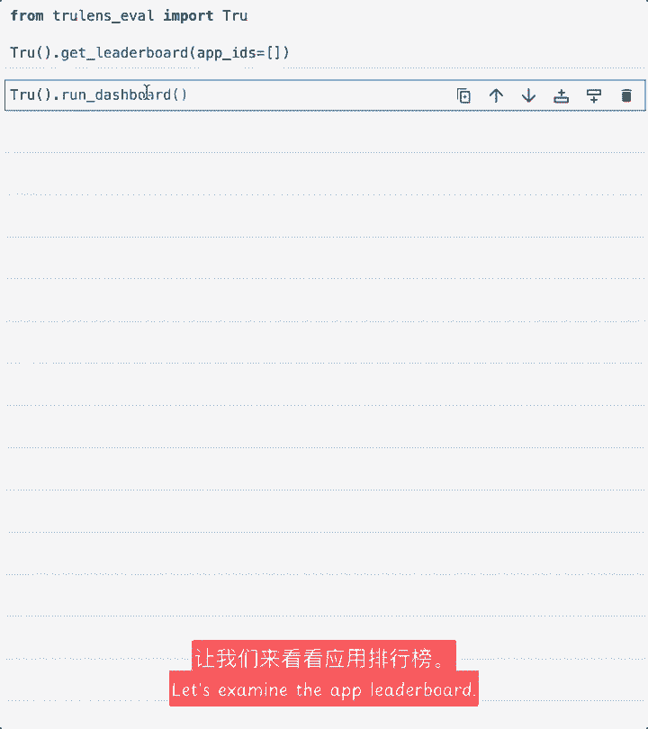

检查您，检查您，可以在此处看到的应用程序排行榜 在，可以在此处看到的应用程序排行榜 在，处理 24 记录之后，尽管该应用程序在，尽管该应用程序在，答案相关性和，答案相关性和。

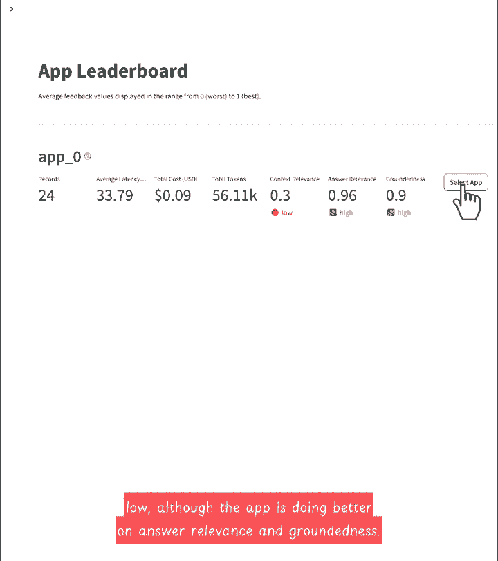

基础性方面做得更好，但总体上的上下文相关性相当低。我可以选择该应用程序，基础性方面做得更好，但总体上的上下文相关性相当低。我可以选择该应用程序，现在让我们查看，现在让我们查看，应用程序 0 的各个记录。

看看其评估，应用程序 0 的各个记录，看看其评估，分数如何 各种，分数如何 各种，记录，您可以滚动到此处的右侧，记录，您可以滚动到此处的右侧，查看答案相关性、，查看答案相关性、，上下文相关性和。

上下文相关性和。

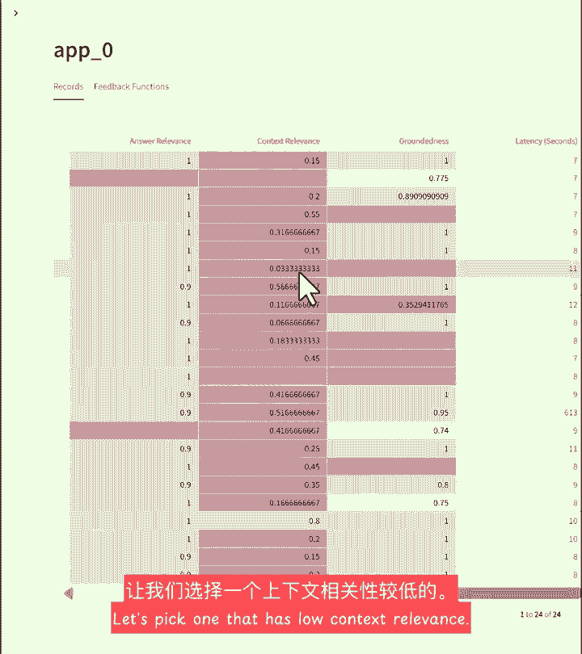

基础性的分数，让我们选择一个，基础性的分数，让我们选择一个，上下文，上下文。

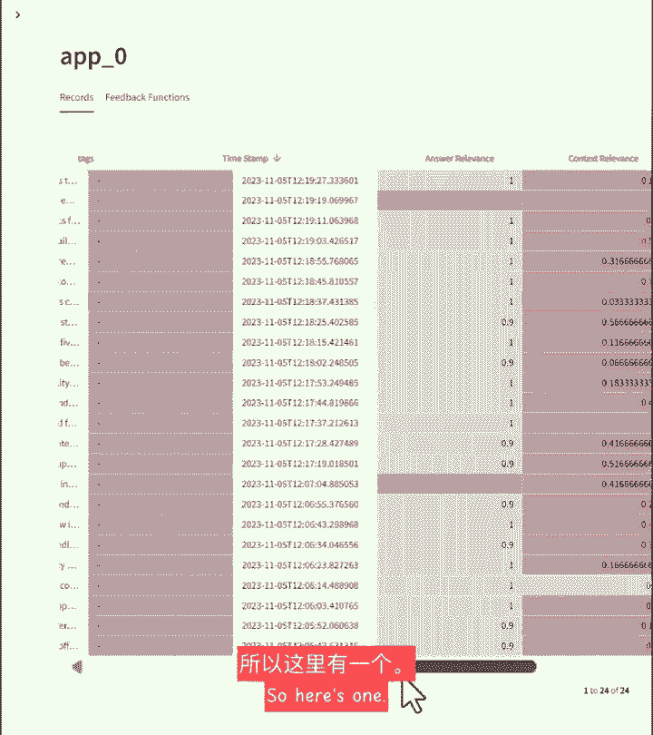

相关性较低的记录，因此如果您单击，相关性较低的记录，因此如果您单击。

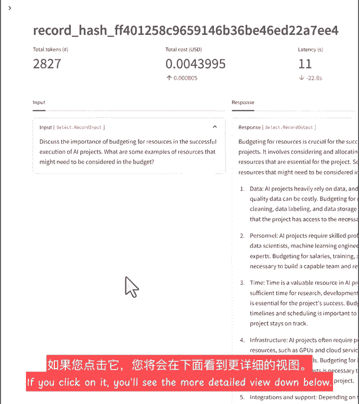

它，您会在下面看到更详细的视图，它，您会在下面看到更详细的视图，问题是讨论，问题是讨论，资源预算的重要性，资源预算的重要性。

和人工智能项目的成功执行，和人工智能项目的成功执行，右侧是，右侧是。

响应，如果您进一步向下滚动，响应，如果您进一步向下滚动，您可以看到上下文相关性的更详细视图，其中，您可以看到上下文相关性的更详细视图，其中，有六个检索，有六个检索，上下文，每个都有，上下文，每个都有。

他们的，他们的，评估分数特别低，介于 0 和 2 之间，评估分数特别低，介于 0 和 2 之间，如果您选择其中任何一个并单击，如果您选择其中任何一个并单击，它，您可以看到答案，它，您可以看到答案。

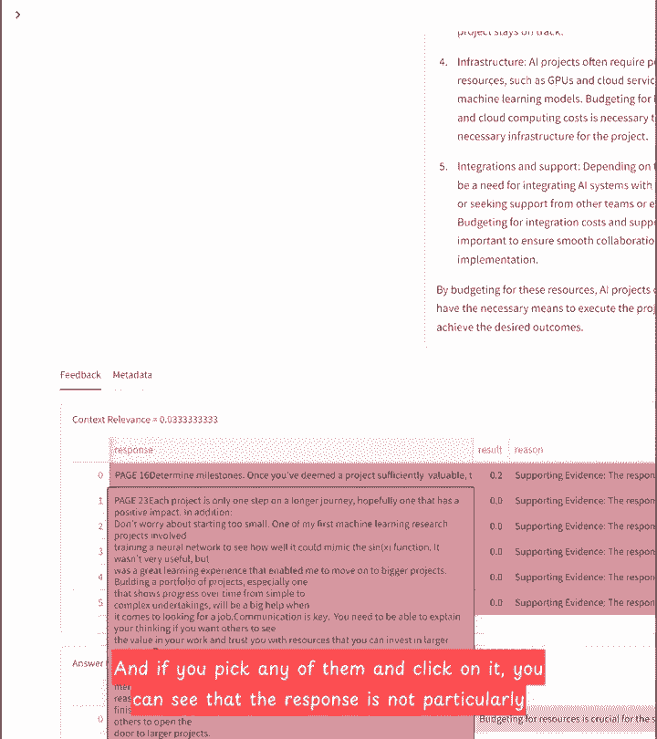

与所提出的问题不是特别相关，与所提出的问题不是特别相关，您也可以，您也可以，向上滚动，向上滚动，并探索一些 在其他，并探索一些 在其他，记录中，您可以选择一些，记录中，您可以选择一些。

分数很好的记录（例如这里的记录），分数很好的记录（例如这里的记录），并，并。

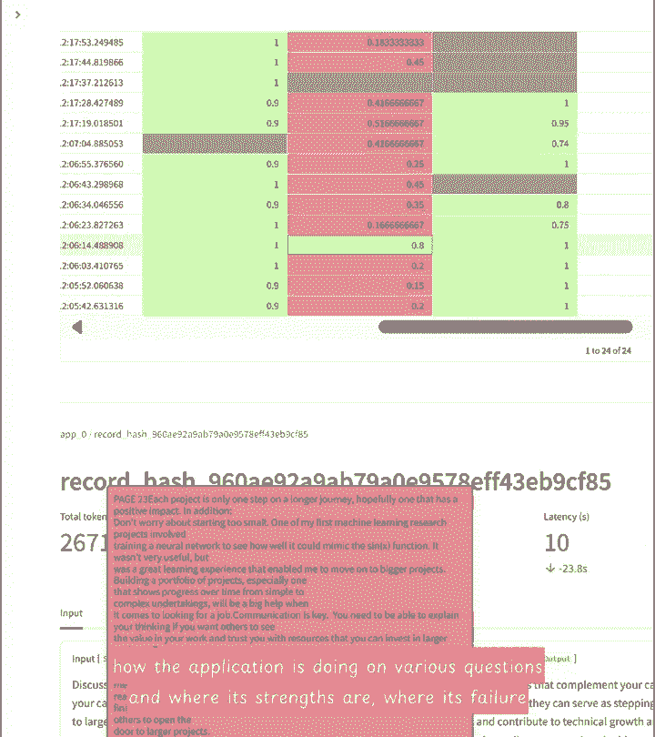

探索，探索，应用程序，应用程序。

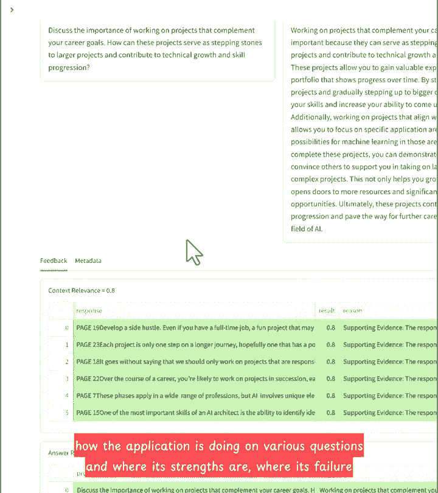

在各种问题上的表现如何，以及，在各种问题上的表现如何，以及。

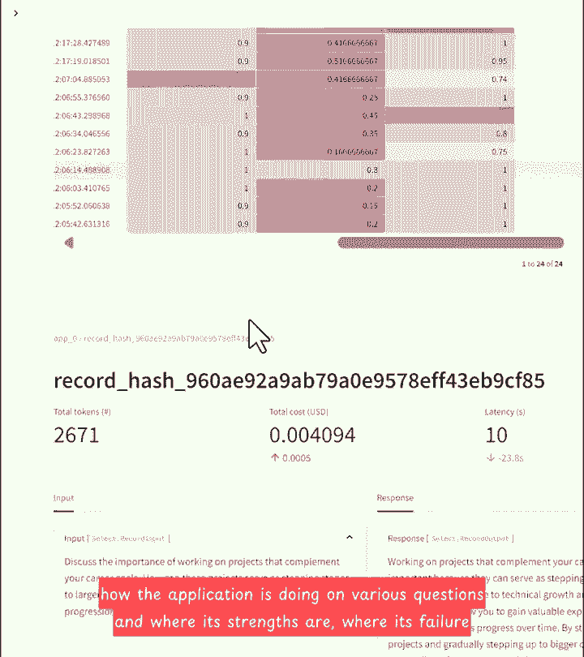

它的字符串在哪里，它的故障模式在哪里，以，它的字符串在哪里，它的故障模式在哪里，以，围绕，围绕。

什么是有效的和什么是建立一些直觉，什么是有效的和什么是建立一些直觉。

现在让我们将，现在让我们将，之前的，之前的，应用程序与 Jerry 之前介绍的自动合并设置进行比较，现在我们将在层次结构中拥有三层，从，叶节点级别 512 向上一层有 128 个令牌开始。

叶节点级别 512 向上一层有 128 个令牌开始，在最高层有 248 个令牌，在最高层有 248 个令牌，因此在每一层中 父级有，因此在每一层中 父级有，四个，四个，子级，现在让我们，子级。

现在让我们。

记录器，所有，记录器，所有。

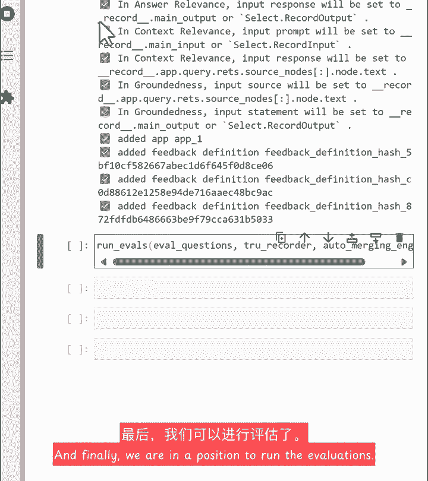

最后我们可以运行，最后我们可以运行。

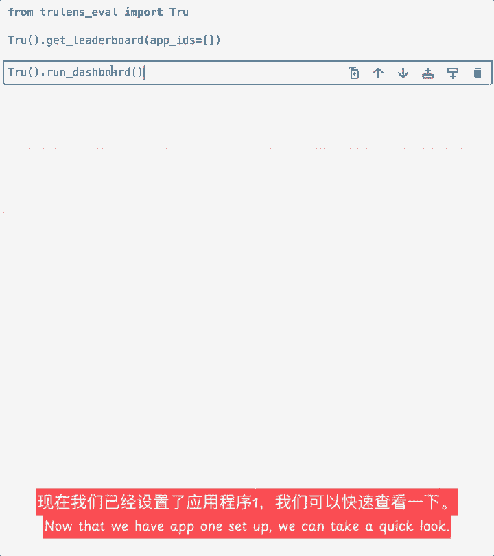

评估了，既然我们已经设置了 app1，评估了，既然我们已经设置了 app1，我们可以采取 快速查看，我们可以采取 快速查看，排行榜，您可以看到相对于，排行榜，您可以看到相对于，F0，应用程序一中处理。

F0，应用程序一中处理，相同数量记录的令牌数量约为，相同数量记录的令牌数量约为，一半，总成本也约为，一半，总成本也约为，一半，这是因为将其视为层次，一半，这是因为将其视为层次，结构中的三层。

结构中的三层，块大小是 128 个标记，而不是，块大小是 128 个标记，而不是，512，这是，512，这是，ab 零的最小叶节点标记大小，因此导致，ab 零的最小叶节点标记大小，因此导致，成本，成本。

降低，同时上下文，降低，同时上下文，相关性，相关性，增加了约，增加了约，20%，发生这种情况的部分原因，20%，发生这种情况的部分原因，是，是。

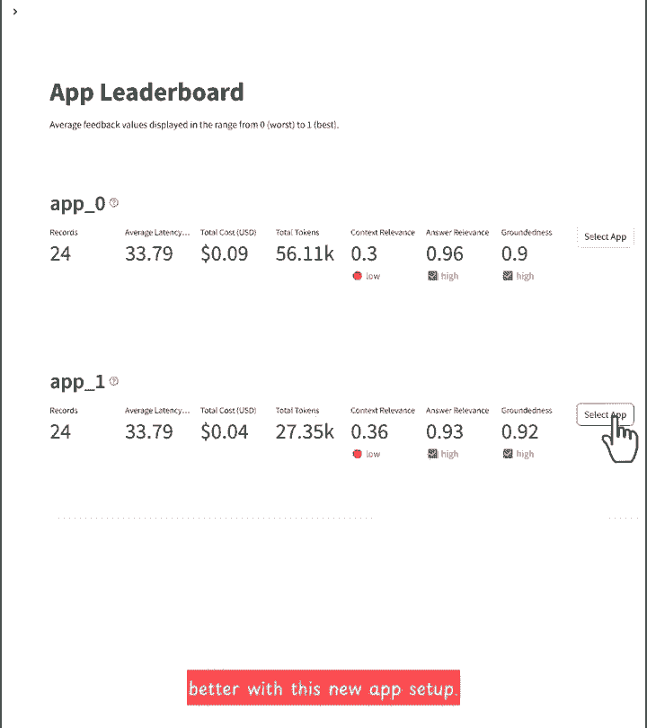

通过这个新的应用程序设置，合并可能会发生得更好，我们还可以，通过这个新的应用程序设置，合并可能会发生得更好，我们还可以，深入研究并更详细地查看应用程序一，深入研究并更详细地查看应用程序一。

就像我们可以查看，就像我们可以查看，各个记录之前一样，让我们​​选择与，各个记录之前一样，让我们​​选择与，我们之前查看的相同的记录，我们之前查看的相同的记录，ab 零，ab 零。

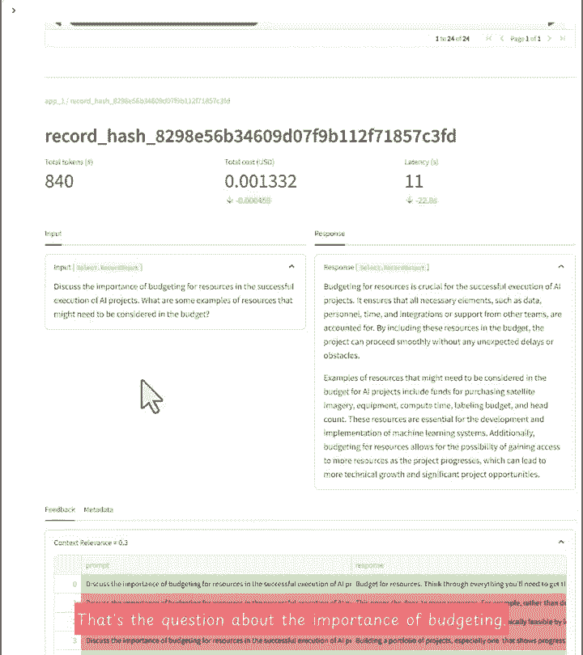

这是问题所在，这是问题所在，预算的重要性，现在你可以看到上下文，预算的重要性，现在你可以看到上下文，相关性做得更好，基础性，相关性做得更好，基础性，也相当高，如果你，在这里选择一个示例响应，你会发现。

在这里选择一个示例响应，你会发现，事实上它正在非常具体地谈论，资源预算，所以在这方面有改进，现在让我总结一下，现在让我总结一下，第四课中的一些关键要点，我们带，第四课中的一些关键要点，我们带。

您了解了一种使用自动检索进行评估和，您了解了一种使用自动检索进行评估和，迭代的方法高级，迭代的方法高级，抹布，抹布，技术，特别是，技术，特别是，我们向您展示了如何，我们向您展示了如何。

使用不同的层次结构进行迭代，使用不同的层次结构进行迭代，级别数、子，级别数、子，节点数和块，节点数和块，大小，大小，对于这些不同的应用程序版本，您，对于这些不同的应用程序版本，您。

可以使用 rag Triad 来评估它们，可以使用 rag Triad 来评估它们，并跟踪实验来，并跟踪实验来，为您的用例选择最佳结构，需要，为您的用例选择最佳结构，需要，注意的一件事是。

注意的一件事是，您不仅 获取，您不仅 获取，与 rag Triad 相关的指标作为，与 rag Triad 相关的指标作为，评估的一部分，但深入到，评估的一部分，但深入到，记录级别可以帮助您获得有关。

最适合某些文档类型的超参数的直觉，最适合某些文档类型的超参数的直觉，例如取决于文档的性质，例如取决于文档的性质，例如雇佣合同，例如雇佣合同，与 在发票中，您可能会发现，与 在发票中，您可能会发现。

不同的块大小和，不同的块大小和，层次结构最有效，层次结构最有效，最后另一件事需要注意的是，最后另一件事需要注意的是，自动合并是对，自动合并是对，句子窗口，句子窗口，检索的补充，考虑这一点的一种方法。

检索的补充，考虑这一点的一种方法，是，假设您有，是，假设您有，一个父节点的四个子节点 自动合并您，一个父节点的四个子节点 自动合并您，可能会发现子项一和，可能会发现子项一和，子项四与，子项四与。

所提出的查询非常相关，然后这些子项，所提出的查询非常相关，然后这些子项，在自动合并范式下进行合并，在自动合并范式下进行合并，相比之下句子窗口化，相比之下句子窗口化，可能不会导致这种合并。

可能不会导致这种合并，因为它们不在，因为它们不在，文本的连续部分将我们，文本的连续部分将我们，带到第四课的结尾，带到第四课的结尾，我们观察到，通过先进的，我们观察到，通过先进的，机架技术，例如句子窗口。

机架技术，例如句子窗口，和自动合并检索，和自动合并检索，加上评估实验，加上评估实验，跟踪和迭代的能力，您可以，跟踪和迭代的能力，您可以，显着改进您的抹布，显着改进您的抹布。

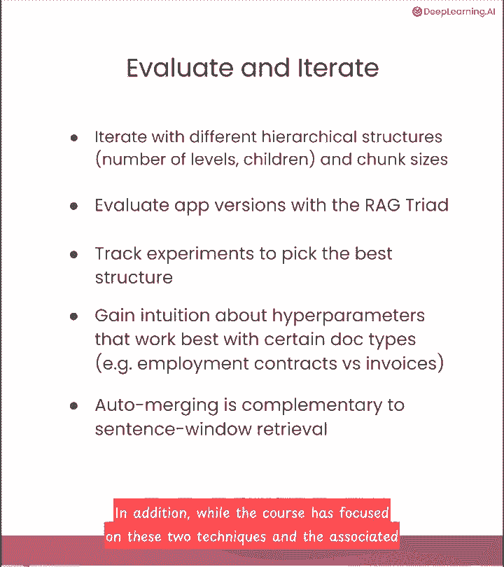

应用，应用，此外，虽然本课程重点，此外，虽然本课程重点，关注这两种技术以及，关注这两种技术以及，相关的拖拽三元组进行，相关的拖拽三元组进行，评估，但您还可以使用许多其他，评估，但您还可以使用许多其他。

评估，评估，以确保您的 llm，以确保您的 llm，申请是诚实无害且，申请是诚实无害且，有用的，这张幻灯片列出了一些，开箱即用的真实镜头，我们鼓励您去，开箱即用的真实镜头，我们鼓励您去，尝试真实镜头。

探索非，尝试真实镜头，探索非。

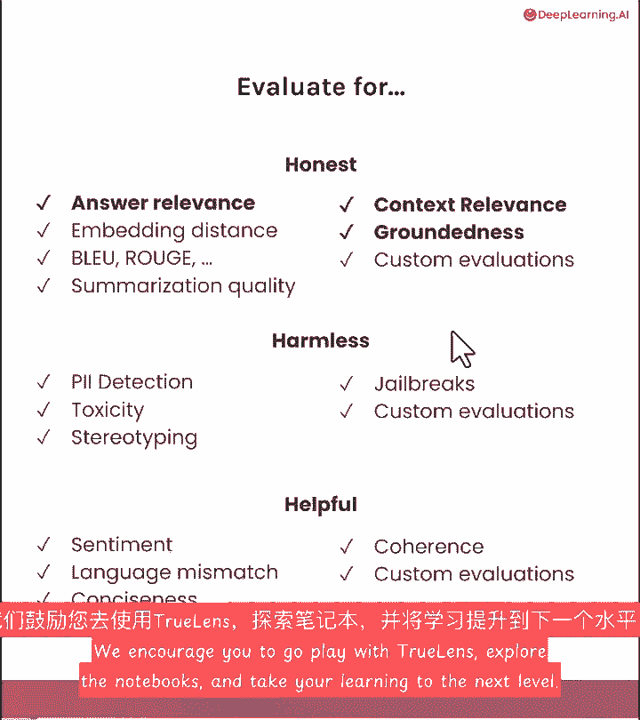

笔记本电脑，并将您的学习提升到一个。