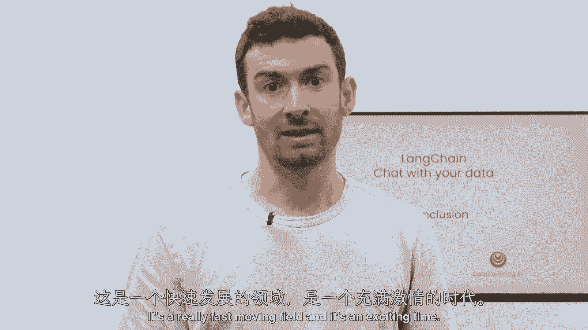

#  【LangChain大模型应用开发】DeepLearning.AI - P16：8——完结 - 吴恩达大模型 - BV1iZ421M79T

这就结束了与您的数据进行长链聊天的课程，在这门课上，我们已经介绍了如何使用链接链从各种文档源加载数据，使用链接链，80多个不同的文档加载器，从那里我们把文件分成几块，并谈论许多这样做的细微差别。

然后我们把这些大块，为它们创建嵌入，把它们放进矢量仓库，展示了如何轻松地启用语义搜索，但我们也讨论了语义搜索的一些缺点，在某些边缘情况下它可能会失败，接下来我们讨论的是检索，可能是我最喜欢的部分。

在那里我们讨论了许多新的、先进的、非常有趣的检索算法，为了克服这些边缘情况，我们在下一次会议上把它和llms结合起来，我们把那些检索到的文件，我们接受用户的问题，我们把它传给一个LLM。

我们对最初的问题产生一个答案，但还缺一样东西，这是它的对话方面，这就是我们通过创建一个功能齐全的端到端来完成这个类的地方，通过您的数据聊天机器人，我真的很喜欢教这门课，我希望你们喜欢。

我要感谢开源领域的每一个人，他为这门课做出了很多贡献，就像你看到的所有提示和许多功能一样，就像你们和朗链一起建造一样，并发现新的做事方式、新的技巧和技巧，我希望你在推特上分享你将学到的东西。

甚至在链接链中开设公关，这是一个变化非常快的领域，这是一个激动人心的时刻。

我真的很期待看到你是如何申请的。