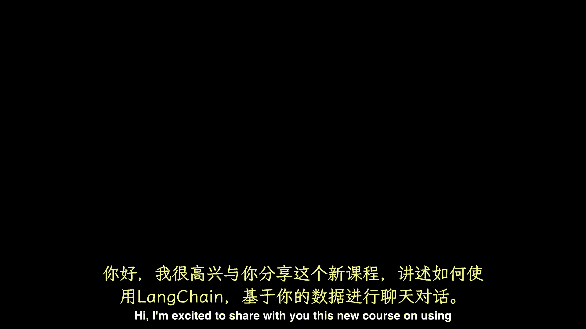
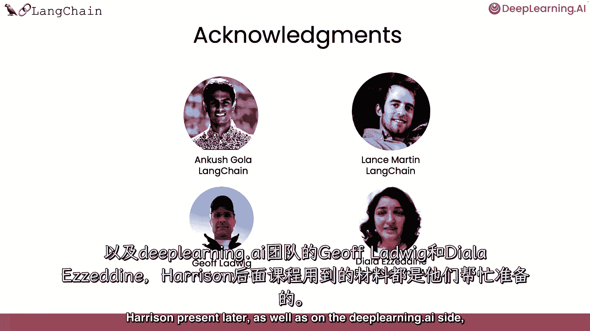

#  【LangChain大模型应用开发】DeepLearning.AI - P9：LangChain：构建与数据对话的聊天机器人1——介绍 - 吴恩达大模型 - BV1iZ421M79T

嗨，我很兴奋能和你分享，这门关于使用线链与数据聊天的新课程，这是与朗链联合创始人兼首席执行官哈里森·蔡斯合作打造的，大型语言模型或lms，如chat gpt，可以回答关于许多主题的问题。

但一个与世隔绝的LLM只知道它被训练了什么，不包括你的个人资料，例如，如果你在一家公司，有专有文件，不是在网上，以及LM训练后编写的数据或文章，所以如果你或其他人，比如你的客户。

可以与自己的文件进行对话，并得到问题的回答，使用这些文档中的信息，并在本短期课程中使用lm，我们将介绍如何使用链接链与您的数据聊天，Link Chain是一个用于构建LLM应用程序的开源开发人员框架。

链路链由几个模块化组件以及更多的端到端模板组成，链接链中的模块化组件包括提示，模型，索引，连锁店和代理商，要更详细地了解这些组件，你可以看到我和安德鲁教的第一门课，在本课程中。

我们将放大并关注Lang Chain的一个更受欢迎的用例，如何使用链接链与您的数据聊天，我们将首先介绍如何使用lang chain文档加载器，从各种令人兴奋的来源加载数据，然后。

我们将讨论如何将这些文档拆分为语义上有意义的块，这个预处理步骤可能看起来很简单，但有很多细微差别，下一个，我们将概述语义搜索，获取相关信息的一种基本方法，给定一个用户问题，这是最简单的入门方法。

但也有几种情况是失败的，我们会仔细检查这些案子，然后我们再讨论如何修理它们，然后我们将展示如何使用这些检索到的文档，使LLM能够回答有关文档的问题，但表明你仍然缺少一个关键的部分。

为了完全重现聊天机器人的体验，最后，我们将讨论丢失的部分内存，并展示如何构建一个功能齐全的聊天机器人，通过它您可以与您的数据聊天，这将是一个激动人心的短期课程，我们感谢安哥拉，以及兰斯·马丁。

感谢朗尚团队为哈里森提供的所有材料，以及深度学习，艾方杰夫。

Lodwig和diala eine，万一你要上这门课，并决定你想复习一下朗链的基础知识，我鼓励你也参加之前的朗链短训班，对于lm应用的发展，哈里森也提到过，那么现在让我们进入下一个视频。

哈里森将向你展示如何使用。