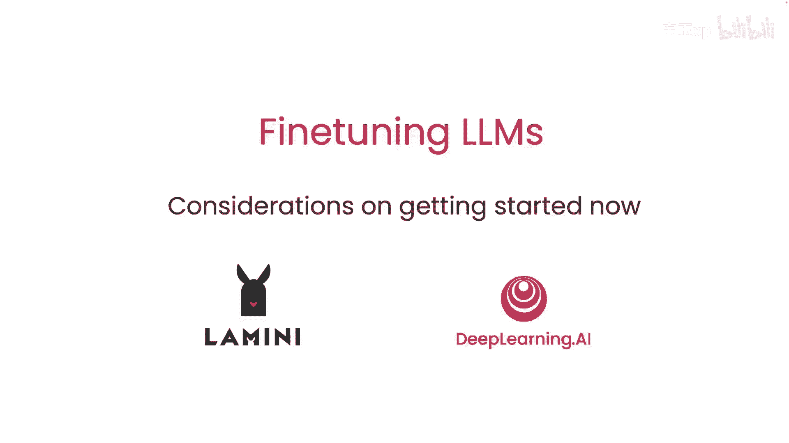
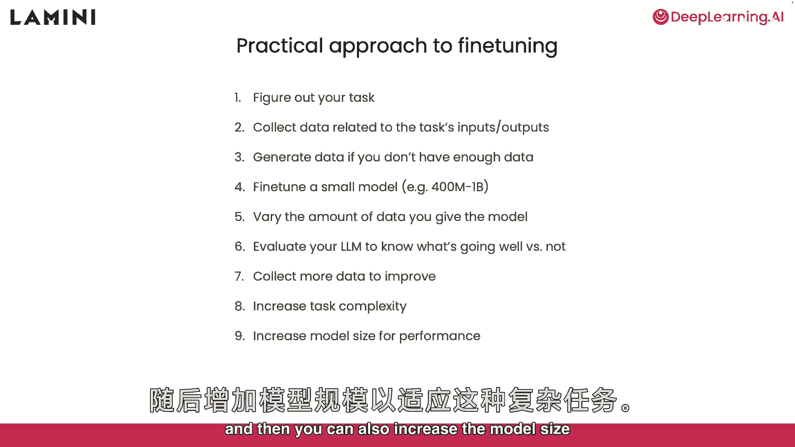
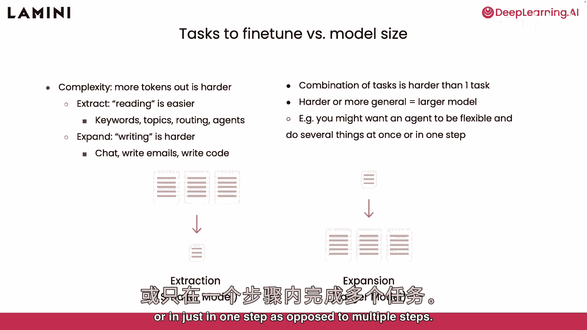
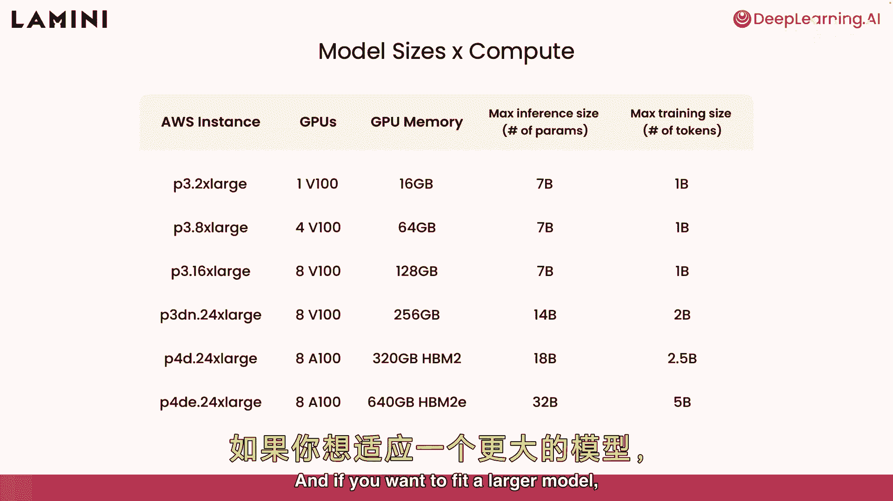
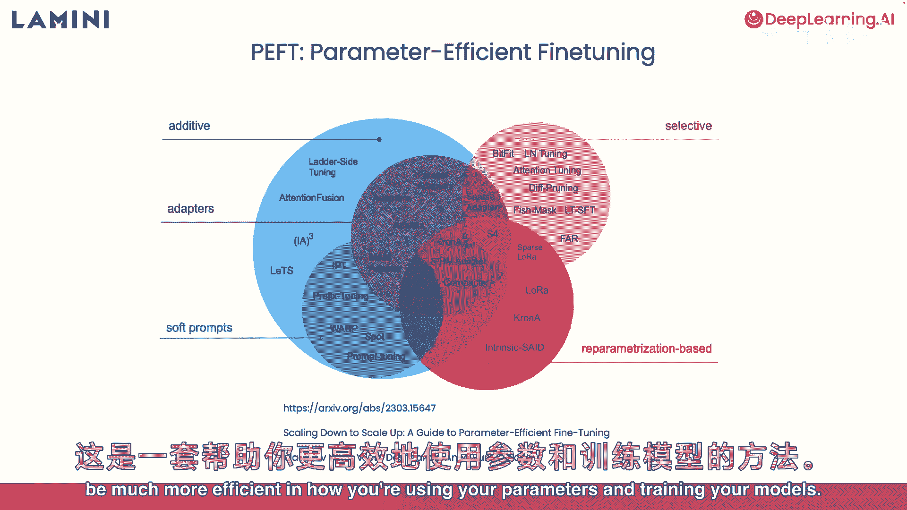
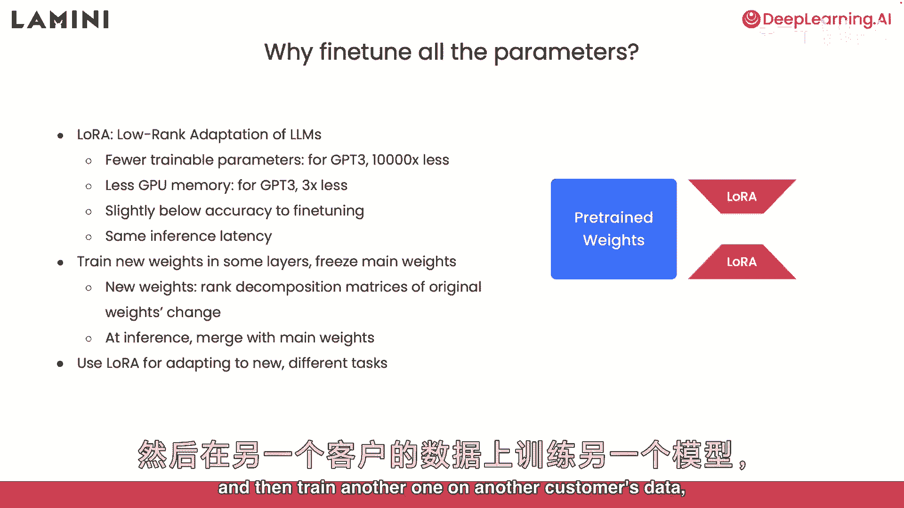

# 【大模型微调】 DeepLearning.AI - P8：8-建议和实用技巧 - 吴恩达大模型 - BV1mT421a78i

好啦，你上了我们的最后一堂课，这些将是你在开始时应该考虑的一些问题，现在呢，一些实用的小贴士，也是对更先进的训练方法的偷偷预览，因此，首先是一些微调的实际步骤，总结一下，首先你想弄清楚你的任务。

您希望收集与任务相关的数据，投入和产出，并把它构造成这样，如果你没有足够的数据，没问题--只需生成一些或使用提示模板创建更多，首先你要微调一个小模型，我推荐一个四亿到十亿的参数模型。

只是为了了解这个模型的性能，你应该改变你实际给模型的数据量，了解有多少数据实际上影响了模型的走向，然后你可以评估你的模型，看看什么进展顺利或不顺利，最后，您希望收集更多的数据，通过您的评估来改进模型。

现在，您可以从那里增加任务的复杂性，所以你现在可以让它变得更难，然后，您还可以增加模型大小，以提高更复杂任务的性能。

所以对于任务微调你学到了，你知道的，阅读任务和写作任务，写作任务要难得多，这些是更广泛的任务，比如聊天，写电子邮件，编写代码，这是因为模型产生了更多的代币，因此，对于模型来说，这是一项更难的任务。

更难的任务往往需要更大的模型来处理它们，嗯，另一种完成更艰巨任务的方法是将任务组合在一起，要求模型组合一些事情，而不仅仅是一个任务，这可能意味着让一个代理人灵活，同时做几件事或一步做几件事。

与多个步骤相反，因此，现在您已经了解了任务复杂性所需的模型大小，还有一个计算需求，基本上围绕硬件，你需要什么来为你运行的实验室运行你的模型，你看到了在CPU上运行的7000万个参数模型。

他们不是最好的模特，我建议从性能更好的开始，所以如果你在这张桌子上看到，第一行，我想从可用的1V100GPU中调用，例如在AWS上，也包括任何其他云平台，你看它有16G的内存。

这意味着它可以运行70亿参数模型进行推理，但是对于训练来说，训练需要更多的内存来存储梯度和优化器，所以它实际上只能拟合十亿个参数的模型，如果你想适合一个更大的模型。

你可以在这里看到一些其他可用的选项--很好，所以也许你认为这对你来说还不够，你想和更大的模型一起工作，嗯，有一种叫做盗窃或参数效率的东西，微调，这是一套不同的方法来帮助你。

只是这样在如何使用参数和训练模型方面会更有效。

我最喜欢的是劳拉，代表低等级适应，劳拉所做的是，它减少了你必须训练的参数的数量，重量，你必须接受大量的GPT 3训练，例如，他们发现他们可以减少一万倍，这导致GPU所需的内存减少了3倍。

虽然你对微调的精度略低于，这仍然是一种更有效的到达那里的方式，你在最后得到同样的推理延迟，那么劳拉到底发生了什么，嗯，你实际上是在模型的一些层中训练新的重量，你在冷冻主要的预先训练的重量。

你在这里看到的蓝色，所以这一切都冻结了，你有这些新的橙色砝码，这些是罗拉的重量，新的重量，这有点数学，原始权重的秩分解矩阵是否改变，但重要的是，所以你知道这背后的数学是你可以把它们分开训练。

代替预先训练的重量，但在推理时间，能够将它们合并回主要的预训练重量，更有效地得到微调模型，我真正兴奋的是使用劳拉，使它适应新的任务，这意味着你可以根据一个客户的数据用劳拉训练一个模型。

然后根据另一个客户的数据训练另一个。

