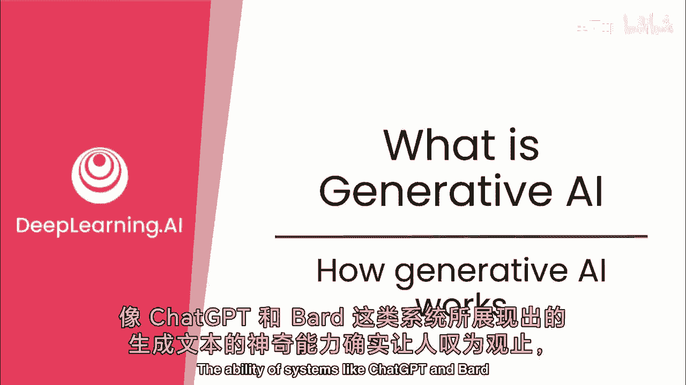
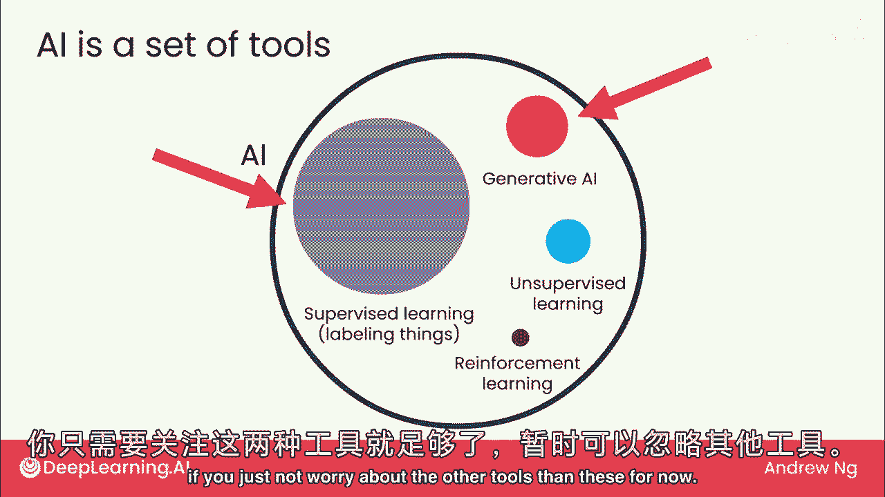
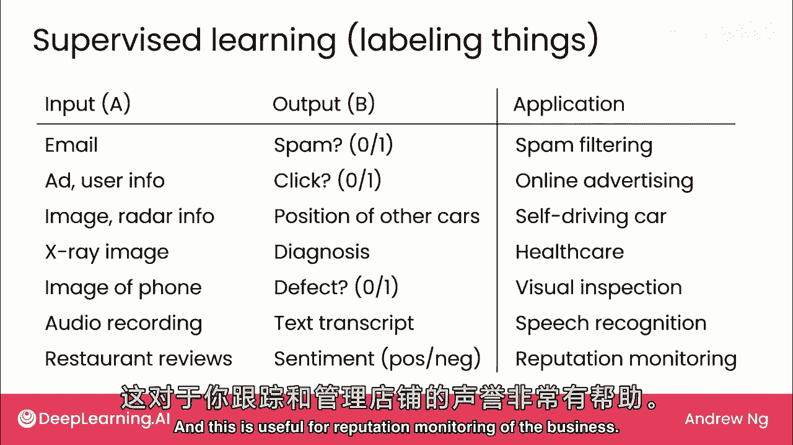
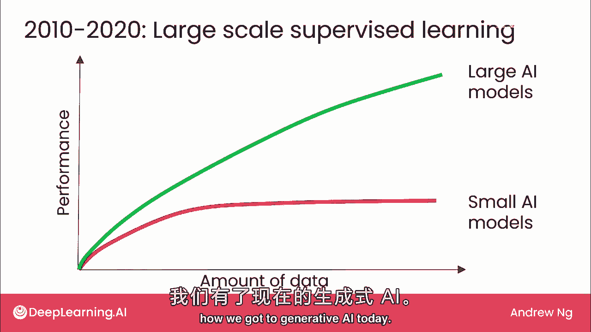
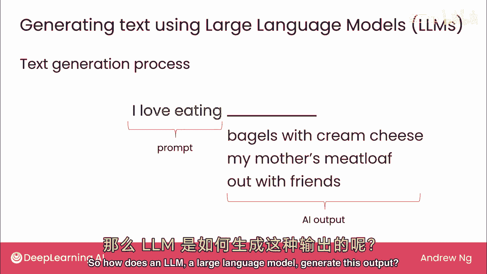
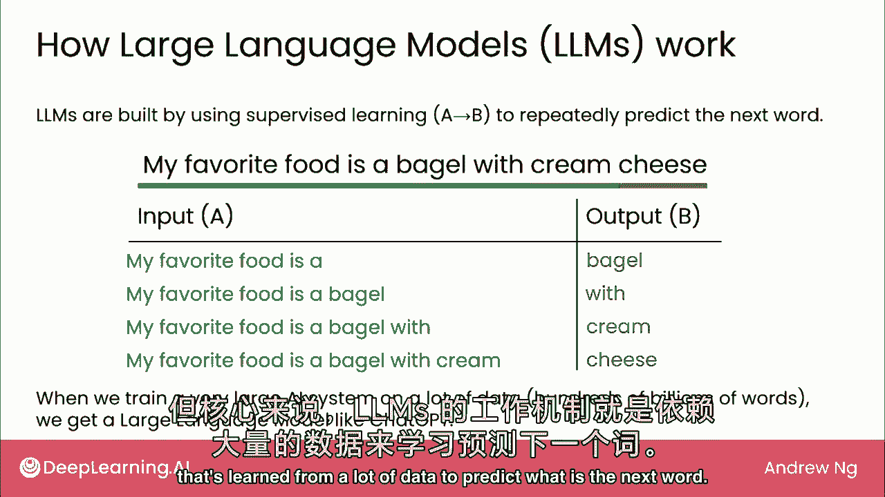

# (超爽中英!) 2024吴恩达0基础【面向所有人的生成式AI】 DeepLearning.AI - P2：2 - 什么是生成式 AI - 原理和指南 - 吴恩达大模型 - BV19S421R7VR

聊天等系统生成文本，聊天等系统生成文本，似乎很神奇，似乎很神奇，确实代表AI的一大进步，确实代表AI的一大进步，但文本生成实际如何工作？但文本生成实际如何工作？将探讨生成AI技术的基础。

将探讨生成AI技术的基础，希望帮助你理解如何使用，希望帮助你理解如何使用，以及何时不应依赖，以及何时不应依赖，让我们看看，让我们看看，先从生成AI在AI领域的定位看起，先从生成AI在AI领域的定位看起。

有很多炒作和兴奋，有很多炒作和兴奋，还有关于AI的炒作，还有关于AI的炒作，我认为将AI视为一系列工具很有用，我认为将AI视为一系列工具很有用。

AI中最重要的一个工具是监督学习，AI中最重要的一个工具是监督学习，它非常擅长标记事物，它非常擅长标记事物，别担心，别担心，如果你不明白这意味着什么，如果你不明白这意味着什么，我们将在下一页上详细讨论。

我们将在下一页上详细讨论，最近才开始真正奏效的第二项是生成AI，最近才开始真正奏效的第二项是生成AI，如果你研究AI，如果你研究AI，只有最近，只有最近，你可能注意到还有其他工具。

你可能注意到还有其他工具，如无监督学习和强化学习，如无监督学习和强化学习，但就本课程而言，但就本课程而言，我将简要介绍监督学习，我将简要介绍监督学习，然后花大部分时间讨论生成式AI。

然后花大部分时间讨论生成式AI，这两个监督学习和生成式AI是AI中最重要的工具，这两个监督学习和生成式AI是AI中最重要的工具，对于大多数商业案例，对于大多数商业案例，你应该没问题，你应该没问题。

如果你暂时不担心这些以外的其他工具，如果你暂时不担心这些以外的其他工具。

在描述生成式AI如何工作之前，在描述生成式AI如何工作之前，简述监督学习，简述监督学习，生成AI基于监督学习，生成AI基于监督学习，监督学习使计算机输入，监督学习使计算机输入，生成相应输出，我叫它b。

生成相应输出，我叫它b，我叫它b，我叫它b，看几个邮件示例，看几个邮件示例，监督学习可判断是否垃圾邮件，监督学习可判断是否垃圾邮件，输入a是邮件，输出b是0或1，输入a是邮件，输出b是0或1。

0表示非垃圾邮件，1表示垃圾邮件，0表示非垃圾邮件，1表示垃圾邮件，这就是当前垃圾邮件过滤器的工作原理，这就是当前垃圾邮件过滤器的工作原理，第二个例子，第二个例子，最赚钱的应用，最赚钱的应用。

虽不鼓舞人心，但对一些公司来说却很赚钱，虽不鼓舞人心，但对一些公司来说却很赚钱，是网络广告，是网络广告，给定一个广告和一些用户信息，给定一个广告和一些用户信息，AI系统可以生成输出。

AI系统可以生成输出，对应你是否可能点击该广告，对应你是否可能点击该广告，通过显示更相关的广告，通过显示更相关的广告，这为在线广告平台带来了显著收入，这为在线广告平台带来了显著收入。

在自动驾驶汽车和驾驶员辅助系统中，在自动驾驶汽车和驾驶员辅助系统中，监督学习用于输入，监督学习用于输入，汽车前方的图片和雷达信息，汽车前方的图片和雷达信息，并标记其他车辆的位置，并标记其他车辆的位置。

给出医疗X光，尝试标记诊断，给出医疗X光，尝试标记诊断，我也做过大量制造缺陷检测工作，我也做过大量制造缺陷检测工作，你可以有一个系统，你可以有一个系统，拍摄手机的照片，拍摄手机的照片。

从装配线上滚下来检查是否有划痕，从装配线上滚下来检查是否有划痕，或缺陷，或缺陷，或在语音识别中，或在语音识别中，输入a是一段音频，输入a是一段音频，我们会用文字稿标记它，我们会用文字稿标记它。

或以最后为例，或以最后为例，如果你经营餐厅或其他生意，如果你经营餐厅或其他生意，偶尔会有评论，偶尔会有评论，关于你的生意或产品，关于你的生意或产品，监督学习，监督学习，能阅读这些评论，能阅读这些评论。

并为每个标记为正面或负面情绪，并为每个标记为正面或负面情绪，这对业务声誉监控有用，这对业务声誉监控有用。

原来2010到2020这十年，原来2010到2020这十年，我想简短地谈谈这一点，我想简短地谈谈这一点，因为这为现代生成AI奠定了基础，因为这为现代生成AI奠定了基础，但从2010年左右开始我们发现。

但从2010年左右开始我们发现，对于许多应用，对于许多应用，我们有很多数据，我们有很多数据，即使我们给它更多的数据，即使我们给它更多的数据，小AI模型的性能并没有提高多少。

小AI模型的性能并没有提高多少，这意味着，例如，这意味着，例如，若构建语音识别系统，若构建语音识别系统，即使AI听数万或数十万小时数据，即使AI听数万或数十万小时数据，数据量庞大，数据量庞大。

准确率未显著提高，准确率未显著提高，相比仅听少量音频数据的系统，相比仅听少量音频数据的系统，越来越多研究者通过此时期意识到，越来越多研究者通过此时期意识到，若训练大型AI模型，若训练大型AI模型。

意即用高速、强大、内存充足的计算机训练AI模型，意即用高速、强大、内存充足的计算机训练AI模型，则此性能随输入，则此性能随输入，数据量增加，数据量增加，数据将越来越好，数据将越来越好，实际上，实际上。

几年前我领导谷歌大脑团队时，几年前我领导谷歌大脑团队时，早期我对谷歌大脑团队的主要任务是，早期我对谷歌大脑团队的主要任务是，我说，我说，建超大型AI模型，喂大量数据，建超大型AI模型，喂大量数据。

幸运的是，这方法奏效，推动谷歌AI进展，幸运的是，这方法奏效，推动谷歌AI进展，大规模监督学习今天仍重要，大规模监督学习今天仍重要，超大模型用于标记，使我们今天有生成AI，超大模型用于标记。

使我们今天有生成AI。

看生成AI如何用大语言模型生成文本，看生成AI如何用大语言模型生成文本，大型语言模型（简称LLM）的一种生成文本方式，大型语言模型（简称LLM）的一种生成文本方式，LLM可以生成文本。

LLM可以生成文本，给定一个输入，给定一个输入，如我爱吃，如我爱吃，这称为提示，这称为提示，然后LLM可能会用贝果配奶油芝士完成这句话，然后LLM可能会用贝果配奶油芝士完成这句话，如果你再次运行。

如果你再次运行，它可能会说妈妈做的肉饼，它可能会说妈妈做的肉饼，如果你第三次运行，如果你第三次运行，可能你会说和朋友出去，可能你会说和朋友出去，那么大型语言模型LLM是如何生成这个输出的呢。

那么大型语言模型LLM是如何生成这个输出的呢。

事实证明，LLM是通过监督学习构建的，事实证明，LLM是通过监督学习构建的，这是一种输入A和输出B标签的技术，这是一种输入A和输出B标签的技术，它使用监督学习反复预测下一个单词是什么。

它使用监督学习反复预测下一个单词是什么，例如，例如，如果一个AI系统在互联网上读过一句话，如果一个AI系统在互联网上读过一句话，比如我最喜欢的食物是贝果配奶油芝士，比如我最喜欢的食物是贝果配奶油芝士。

那么这句话将被转换成很多数据点供它学习，那么这句话将被转换成很多数据点供它学习，以尝试学习预测下一个单词，以尝试学习预测下一个单词，特别是基于这句话，特别是基于这句话，我们现在有一个数据点说。

我们现在有一个数据点说，给定短语'我最喜欢的食物是'，给定短语'我最喜欢的食物是'，你认为下一个单词是什么，你认为下一个单词是什么，在这种情况下，正确答案是贝果，在这种情况下，正确答案是贝果。

同样给定'我最喜欢的食物是贝果'，同样给定'我最喜欢的食物是贝果'，你认为下一个单词是什么，你认为下一个单词是什么，这个和等等，这个和等等，所以这句话被转换成多个输入，所以这句话被转换成多个输入。

A和输出B供它尝试学习，LLM从哪学习，A和输出B供它尝试学习，LLM从哪学习，给定一些单词预测下一个出现的单词，给定一些单词预测下一个出现的单词，当你训练一个非常大型的人工智能系统时。

当你训练一个非常大型的人工智能系统时，对于LLM来说，大量数据意味着数百亿个单词，对于LLM来说，大量数据意味着数百亿个单词，在某些情况下超过一万亿个单词，在某些情况下超过一万亿个单词。

然后你就会得到一个大型语言模型，然后你就会得到一个大型语言模型，像Chagpt-t，给定一个提示，非常擅长生成一些附加单词，像Chagpt-t，给定一个提示，非常擅长生成一些附加单词。

作为对这个提示的回应，作为对这个提示的回应，目前，目前，我省略了一些技术细节，特别是，我省略了一些技术细节，特别是，下周我们将讨论一个过程，使LLM不仅预测下一个单词，下周我们将讨论一个过程。

使LLM不仅预测下一个单词，而且实际上学会遵循指令，而且实际上学会遵循指令，并且确保输出的安全性，并且确保输出的安全性，但大型语言模型的核心，但大型语言模型的核心。

是这种从大量数据中学习预测下一个单词的技术，是这种从大量数据中学习预测下一个单词的技术。

这就是大型语言模型的工作原理，这就是大型语言模型的工作原理，它们被训练反复预测下一个单词，它们被训练反复预测下一个单词，结果许多人，结果许多人，可能包括你，已经在日常工作中发现这些模型很有用。

可能包括你，已经在日常工作中发现这些模型很有用，帮助写作，帮助写作，查找基本信息，查找基本信息，或作为一个思考伙伴来帮助思考问题，或作为一个思考伙伴来帮助思考问题。

