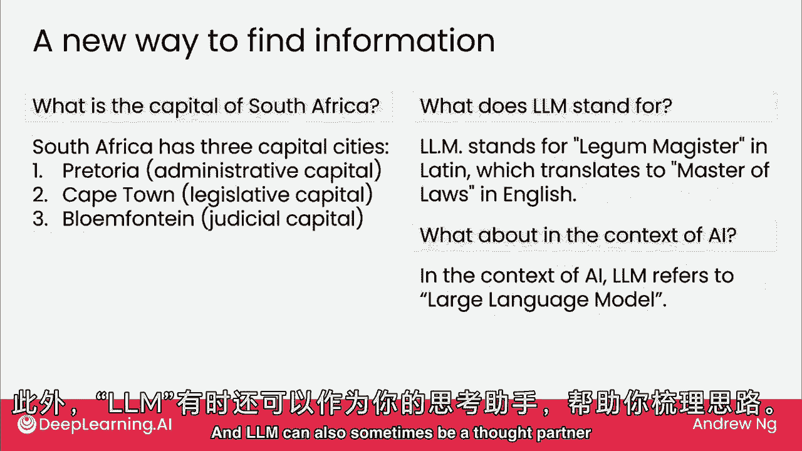
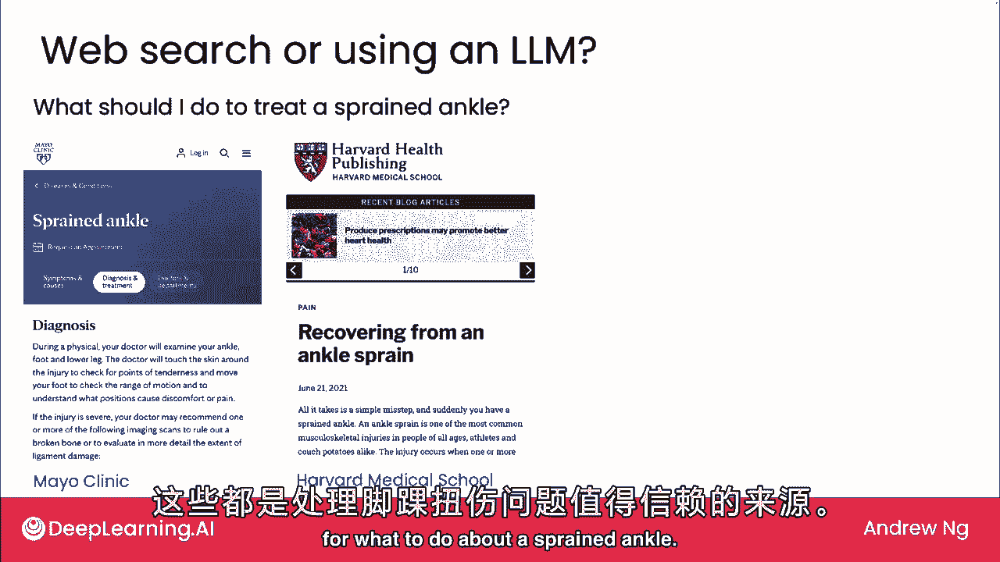
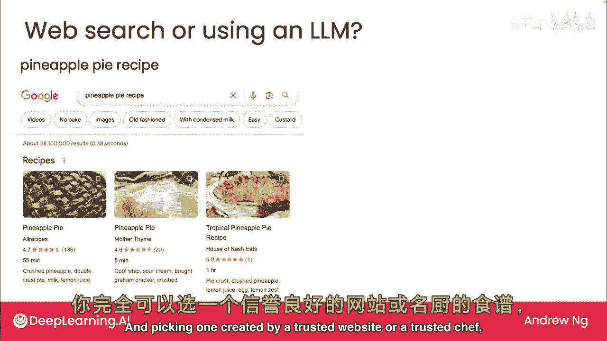
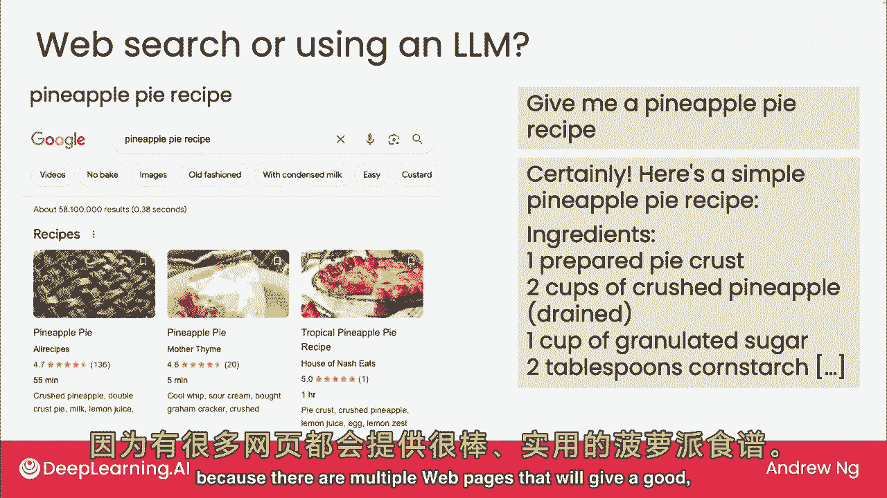
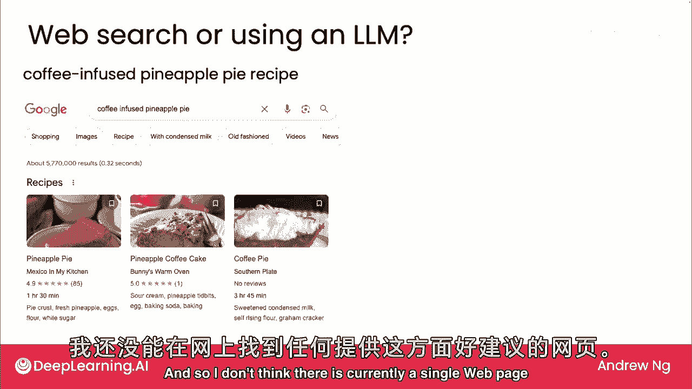
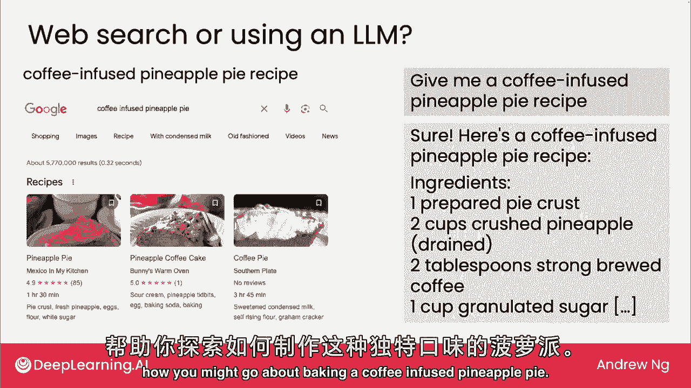

# (超爽中英!) 2024吴恩达0基础【面向所有人的生成式AI】 DeepLearning.AI - P3：3 - 什么是生成式 AI - 大语言模型作为思考助手 - 吴恩达大模型 - BV19S421R7VR

许多网页界面可访问大型语言模型，Chagbt是最知名的，谷歌的机器人，微软必应，还有许多其他工作良好的，让我们看看人们如何使用这些LM应用，无论你是否经常使用它们，我希望这会给你一些新的想法。

以及它们可能对你有用的方式，LMS提供了一种新的信息查找方式，例如，如果你问它，南非的首都是什么，它可能会给出这样的回答，现在，如我们稍后所见，M有时会编造事实，我们称之为幻觉，因此。

如果你真的依赖得到问题的正确答案，在依赖它之前，最好与权威来源核对答案，但在这个例子中，它确实得到了南非的首都或三个首都，对，有时与LM的来回交流也有帮助，例如，如果你问，在我的答案中，LM代表什么。

M代表泻湖大师，这是法律中使用的术语，实际上，LM在互联网上的使用非常普遍，但如果你随后说在AI的背景下，然后希望它会说在AI的背景下，LM指的是大型语言模型，因此。

有时这种来回交流可以帮助你给出正确的上下文，以获取你正在寻找的信息，L M还可以作为思考伙伴帮助你思考问题。

例如。

我经常使用LM来帮助我完善写作，如果你告诉，重写以提高清晰度，世界各地的学生意识到学习已经发生等，领先元素实际上很擅长重写文本，或者这是一个有趣的例子，如果你告诉它写一个涉及卡车的300字故事。

可能是因为你有一个喜欢卡车的孩子，就像我一样，我儿子喜欢卡车，但为了鼓励他们刷牙，然后领先的ELM实际上可以创建非常有趣和有趣的故事，我认为这远不如伟大的小说家所写的那样好。

但作为一个快速有趣的东西，我觉得现在不错，有时你会寻找信息，你可能会想，应该用网络搜索还是用LM？如果你在运动，不幸扭伤了脚踝。

想知道怎么办，网络搜索可以引导你，我认为可信的来源，提供医疗建议，例如，梅奥诊所或哈佛的网页，所有这些看起来都是可信的来源。

你也可以问LM，扭伤脚踝怎么办，它会生成一些答案，考虑到LM编造事物的倾向，有时听起来很权威和自信，而实际上是在编造，我可能想再次检查，它关于医疗保健或医学的建议，再遵循建议，这里还有一个例子。

如果你想烤菠萝派，正在寻找食谱，结果网上有很多菠萝派的食谱，选择一个由可信网站或厨师创建的。

可能会得到很好的结果，或者你可以问LM编一个，在这种情况下它会编出一些东西，坦率地说可能还行，但也有很高的几率是一个奇怪的食谱，所以如果你想烤菠萝派，我可能去找网页。

因为有很多网页会给出很好的答案，关于什么是好的菠萝派食谱，但如果你在寻找更玄妙的东西，比如你的朋友挑战你制作咖啡并使用菠萝派，我找不到任何关于咖啡，注入菠萝派的网页，我认为目前没有单一的网页。

能给出这个问题的良好答案，这是一个例子，LM可以作为一个思考伙伴。

思考如何制作咖啡注入菠萝派，所以这些都是你可能发现，网络用户界面对LM有用的任务，我们将探讨更多例子，讨论LM的优缺点，并在这周晚些时候通过一些最佳实践，但正如你从这段视频中看到的。

Generof AI能够做很多事情，在下一个视频中，我们将系统讨论生成AI，并开始组织它们能做的事，包括写作，阅读和聊天任务。

